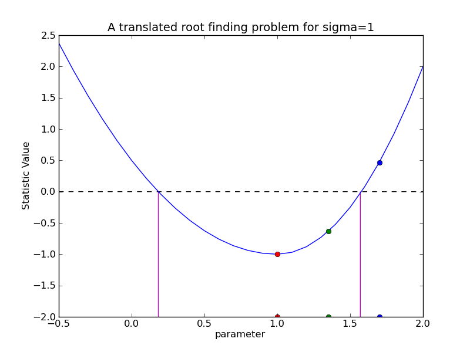
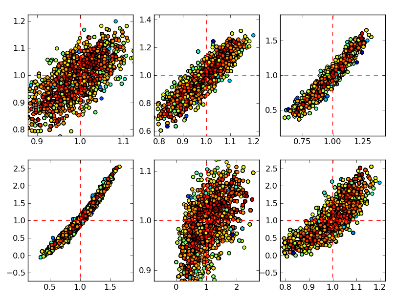
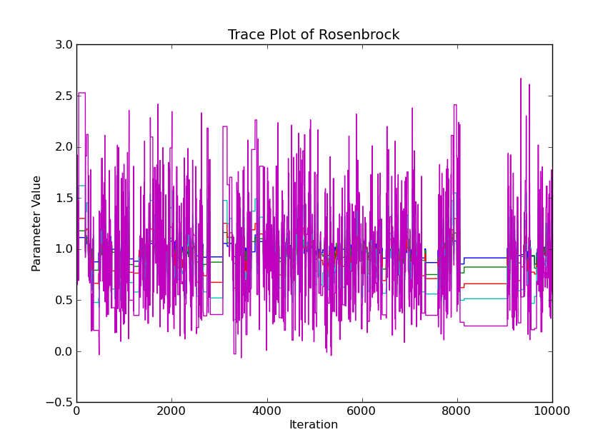

:author: Brian Refsdal
:email: brefsdal@cfa.harvard.edu
:institution: Smithsonian Astrophysical Observatory

:author: Stephen Doe
:email: sdoe@cfa.harvard.edu
:institution: Smithsonian Astrophysical Observatory

:author: Dan Nguyen
:email: dnguyen@cfa.harvard.edu
:institution: Smithsonian Astrophysical Observatory

:author: Aneta Siemiginowska
:email: asiemiginowska@cfa.harvard.edu
:institution: Smithsonian Astrophysical Observatory

--------------------------------------------------------
Fitting and Estimating Parameter Confidence using Sherpa
--------------------------------------------------------

.. class:: abstract

   Sherpa is a generalized modeling and fitting package for use in Python.
   Primarily developed for the Chandra Interactive Analysis of Observations
   (CIAO) package by the Chandra X-ray Center, Sherpa provides an
   Object-Oriented Programming (OOP) API for parametric data modeling.  It is
   designed to use the forward fitting technique to search for the set of
   best-fit parameter values in parameterized model functions.  Sherpa can also
   estimate the confidence limits on best-fit parameters using a new confidence
   method or using an algorithm based on Markov chain Monte Carlo (MCMC).
   Confidence limits on parameter values are necessary for any data analysis
   result, but can be non-trivial to compute in a non-linear and multi-parameter
   space.  This new, robust confidence method can estimate confidence limits of
   Sherpa parameters using a finite convergence rate.  The Sherpa extension
   module, pyBLoCXS, implements a sophisticated Bayesian MCMC-based algorithm
   for simple single-component spectral models defined in Sherpa.  pyBLoCXS has
   primarily been developed in Python using high-energy X-ray spectral data.  We
   describe the algorithm including the features for defining priors and
   incorporating deviations in the calibration information.  We will demonstrate
   examples of estimating confidence limits using the confidence method and
   processing simulations using pyBLoCXS.

.. class:: keywords

   modeling, fitting, parameter, confidence, mcmc, bayesian

Introduction
------------

Developed for users of the Chandra X-ray Observatory, Sherpa is written in
Python, C/C++, and FORTRAN to be a general purpose modeling and fitting
application.  Users typically fit models to observed data using Sherpa for a
variety of applications including time series, lightcurves, spectra, or 2-D
images.  Sherpa includes two main strategies to search parameter space for the
set of best-fit parameter values; non-linear least squares using
Levenberg-Marquardt with a weighted :math:`\chi^{2}` statistic (Gaussian) or a
maximum likelihood estimator using Nelder-Mead simplex and a Poisson-based
likelihood statistic.

Non-linear least squares
------------------------

Assumptions about Data
----------------------

Sherpa assumes that the observed data points are independent.  Errors in the
independent variable are currently unsupported.  If the dependent data points
include uncertainty, Sherpa assumes that each measured point has a symmetric
error bar.  If the measured data points include systematic error, it will be
added in quadrature.  Modeling the systematic error outside of quadrature is
discussed in :ref:`calerr`.  If the measured points do not
include uncertainties, Sherpa estimates Gaussian errors in :math:`\chi^2`
fitting or users have the option of a simple residual using least-square.

Complexity in Fitting
---------------------

Sherpa includes a model description syntax for users to build composite models
that are arbitrarily complex.  To support such a powerful feature, the user is
not required to provide a function to calculate the derivatives.  Sherpa
estimates the gradient using forward difference approximation (LMDIF) and
backward difference approximation if the fit is at an upper parameter boundary.

In some cases, the fit parameters are not necessarily independent and
identically distributed (i.i.d.) and correlations between parameters are
present.

Confidence Intervals
--------------------

.. figure:: figure3.png
   :scale: 40%
   :figclass: bht

The optimizer's search for the best-fit parameters stops when the fit statistic
or error function has reached an optimal value.  For least squares, the optimal
value is when the sum of squared residuals is a minimum.  For the maximum
likelihood estimator, the optimal value is when the log-likelihood is a maximum.
Once the best-fit parameter values are found, users typically determine how well
contrained the parameter values are at a certain confidence level by calculating
confidence intervals for each parameter.  The confidence level is a value of the
fit statistic that describes a constraint on the parameter value.  The
confidence interval is the range that likely contains the parameter value at
which the fit statistic reaches its confidence level while other parameters
reach new best-fit values [insert reference to figure 1].  For example, consider
calculating the confidence intervals at a value of :math:`\sigma=1`, or 68%
confidence.  If the observed data is re-sampled and the model is fit again with
new data, there would be a 68% chance that the new parameter value would fall
within the confidence interval.  The narrower the confidence interval, the more
the model parameter value becomes accurately constrained.

.. figure:: figure1.png
   :scale: 40%
   :figclass: bht

   The confidence intervals for a fit parameter can be thought of as a root
   problem. :label:`fig1`

In the neighborhood of the fit statistic minimum, the multi-dimensional
parameter space can take the shape of an asymmetric paraboloid.  The confidence
intervals are calculated for each selected parameter independently by viewing
the parameter space along the current parameter's dimension.  This view can be
represented as a 1-D asymmetric parabola.  Suppose that :math:`x_{0}` represents
a parameter's best-fit value.  Its associated confidence intervals are
represented as :math:`x_{0} \pm ^{\delta_{1}} _{\delta_{2}}` where
:math:`\delta_{1} \neq \delta_{2}` in non-linear parameter spaces, so each
confidence limit must be calculated independently.  In turn, the statistic value
should equal an amount of :math:`\sigma^{2}` (where :math:`\sigma` represents
the degree of confidence) at each confidence interval :math:`x_{0} + \delta_{1}`
and :math:`x_{0} - \delta_{2}` as other parameters vary to new best-fit values.
The degree to which the confidence limit is bounded can be characterized by the
shape of the well in a multi-dimensional parameter space.  A well that is a
deep-and-narrow corresponds to a tight confidence interval while a well that is
shallow-and-broad represents a wider confidence interval.

   The confidence intervals can be reduced to a root solving problem by
   translating the y-axis by an amount equal to :math:`\sigma^2` and selecting
   points along the fit statistic curve. :label:`fig2`

Method for Determining Confidence
---------------------------------

Calculating the confidence interval for a selected fit parameter can be
transformed into a one dimensional root finding problem with the correct
coordinate translation.  By simply translating the parameter dimension by an
amount equal to :math:`\sigma^2`, the confidence intervals now become x-axis
intercepts in the parameter dimension.  This is an important step in the
algorithm because the value of the fit statistic will change sign when the curve
crosses the confidence level.

Method for Selecting Abscissae
------------------------------

Sherpa's confidence method uses Müller's root finding method to calculate the
confidence intervals given three points.  Müller's method is the a good
algorithm for finding the root of a curve that is approximated by a parabola.
We argue that the statistic curve can be approximated by parabola given that the
statistic function can be represented as a Taylor's series.  The leading term in
series expansion is quadratic since the gradient of the statistic curve can be
ignored near the minimum.

What is the problem in data analysis?  What
is the Sherpa confidence method? 

.. code-block:: python

   x0 = numpy.array([1.3, 0.7, 0.8, 1.9, 1.2])

   def rosen(x):
       """The Rosenbrock function"""
       return sum(100.0*(x[1:]-x[:-1]**2.0)**2.0 +
                  (1-x[:-1])**2.0)

   def fit(fcn, pars, parmins=None, parmaxes=None):
       nm = sherpa.optmethods.NelderMead()
       xopt = nm.fit(lambda x : (fcn(x), None), pars,
                     parmins, parmaxes)[1]
       return xopt

   xopt = fit(rosen, x0, parmins, parmaxes)
   lows, highs = conf.error(rosen, fit, [0, 1, 2, 3, 4],
                            xopt)

How does confidence solve the problem?  What
are the assumptions/limitations for confidence?  

A Bayesian Approach to Confidence
---------------------------------

Fitting non-Gaussian data with :math:`\chi^2` can lead to biased results.  Using
Poisson based likelihood statistics like cash or C do not introduce bias, but
lack simple tests for characterizing how well the model fits the data.  Such
Poisson-based methods often require additional methods to validate model
selection and to determine "goodness-of-fit".  Such methods involve sampling
from the posterior probability distribution.  Sherpa includes fit statistics
derived from the likelihood and complimentary optimization methods, but on its
own Sherpa does not include the means to calculate the posterior.

pyBLoCXS is an additional Python module that complements Sherpa to probe the
posterior probability and to verify model selection using Bayesian methods.
pyBLoCXS is designed to use Markov chain Monte Carlo (MCMC) techniques to
explore parameter space at a suspected minimum.  pyBLoCXS was originally
implemented and tested to handle Bayesian Low-Count X-ray Spectral (BLoCXS)
analysis in Sherpa using simple composite spectral models, and additional
research is underway to test more complex cases.

pyBLoCXS is designed for, but not limited to X-ray spectra.  pyBLoCXS can be run
separately from Sherpa by using Python and the NumPy ndarray.  The main inputs
to pyBLoCXS are a callable objective function, a ndarray of best-fit parameter
values of size :math:`n`, an ndarray of the multi-variate scales of size
:math:`n x n` , and the degrees of freedom.  The ndarray of multi-variate scales
is typically the covariance matrix calculated at the best-fit parameter values.

pyBLoCXS currently has two sampling methods.  The Python class, *MH*,
implements a Metropolis-Hastings jumping rule characterized by a multi-variate
Student's t distribution based on the input scales, best-fit values, and
user-specified degrees of freedom.  The second class, *MetropolisMH*, is a
variation on *MH* in that its a Metropolis-Hastings jumping rule with a
Metropolis jumping rule centered on the current draw.  The *MetropolisMH* class
also uses a multi-variate Student's t distribution.

Although pyBLoCXS implements a different type of sampler, pyBLoCXS is based on
the techniques described in [van2001]_.  A description of the MCMC methods
implemented in pyBLoCXS can be found in Chapter 11 of [gel2004]_.

What is MCMC and pyBLoCXS, how
do they work?

.. code-block:: python

   cov = conf.covar(rosen, [0, 1, 2, 3, 4], xopt)

   # 20 degrees of freedom
   mh = pyblocxs.mh.MH(lambda x : -1.0 * rosen(x),
                       cov, xopt, 20)
   wk = pyblocxs.mh.Walk(mh)
   fvals, accept, x = wk(niter=10000)

How does pyBLoCXS handle calibration uncertainties?  How is pyBLoCXS different
from confidence?  What are the assumptions/limitations for pyBLoCXS?  What are
the future steps for confidence?  What are the future steps for pyBLoCXS?

   Rosenbrock function of five terms as a series of scatter plots :label:`scatter`

Accounting for Calibration Uncertainties
----------------------------------------
   :label:`calerr`

Conclusion
----------

We describe the Sherpa confidence method and the techiques included in pyBLoCXS
to estimate parameter confidence when fit parameters present with correlations
or the parameters are not themselves normally distributed.

Support of the development of Sherpa is provided by National Aeronautics and
Space Administration through the Chandra X-ray Center, which is operated by
the Smithsonian Astrophysical Observatory for and on behalf of the National
Aeronautics and Space Administration contract NAS8-03060.

References
----------
.. [van2001] D. van Dyk et al. *Analysis of Energy Spectra with Low Photon Counts via Bayesian Posterior Simulation*, The Astrophysical Journal, 548:224, February 2001.

.. [pro2002] R. Protassov et al. *Statistics, Handle with Care: Detecting Multiple Model Components with the Likelihood Ratio Test*, The Astrophysical Journal, 571:545-559, May 2002.

.. [lee2011] H. Lee et al. *Accounting for Calibration Uncertainties in X-ray Analysis: Effective Area in Spectral Fitting*, The Astrophysical Journal 731:126, 2011.

.. [gel2004] A. Gelman et al. *Bayesian Data Analysis* Chapman & Hall Texts in Statistical Science Series, 2nd Ed. 2004.

.. [ref2009] B. Refsdal et al. *Sherpa: 1D/2D modeling in fitting in Python* Proceedings of the 8th Python in Science conference (SciPy 2009), G Varoquaux, S van der Walt, J Millman (Eds.), pp. 51-57.

.. [fre2001] P. E. Freeman, S. Doe, A. Siemiginowska. *Sherpa: a Mission-Independent Data Analysis Application* SPIE Proceedings, Vol. 4477, p.76, 2001.
