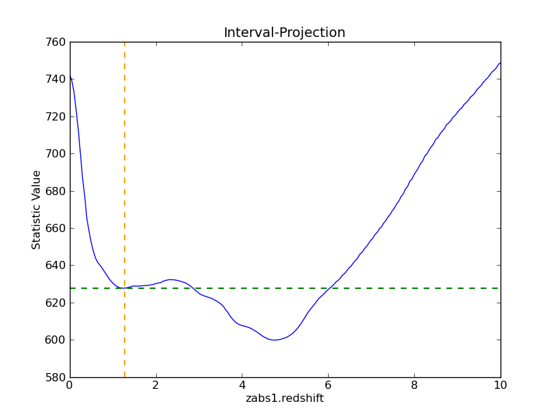
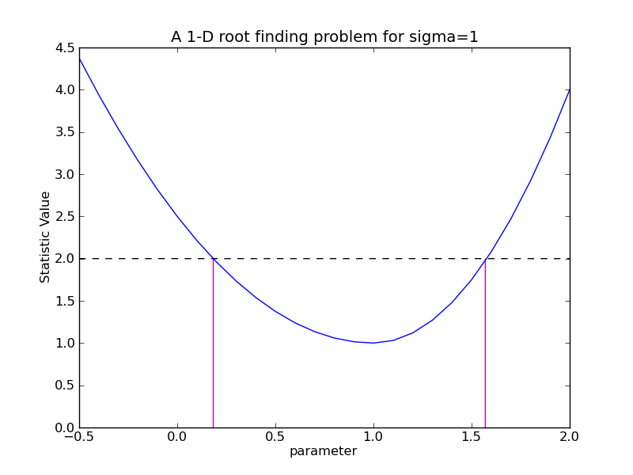
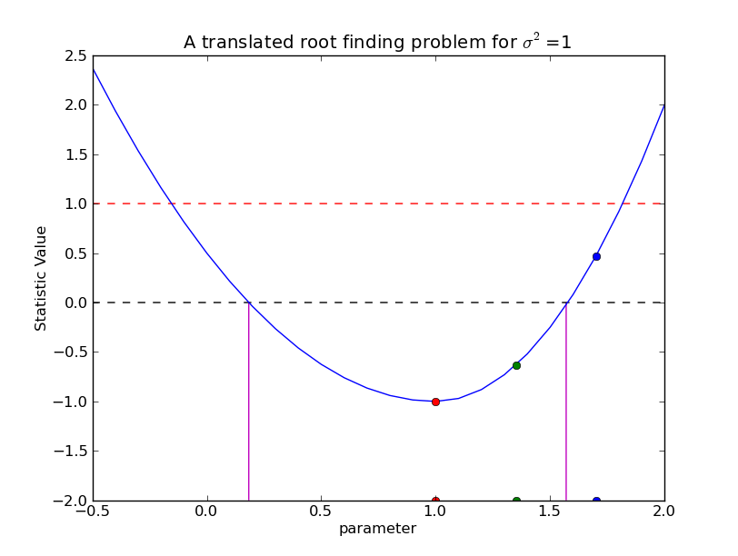
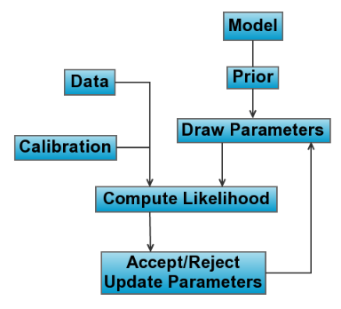
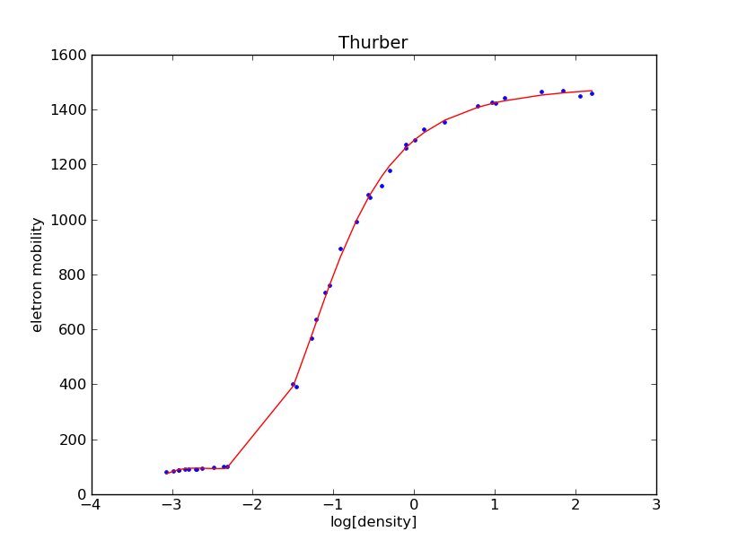
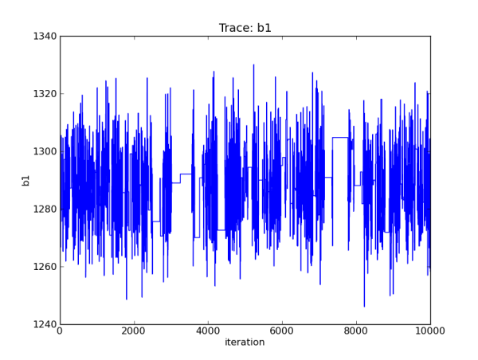
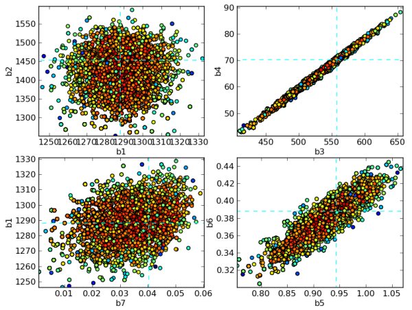
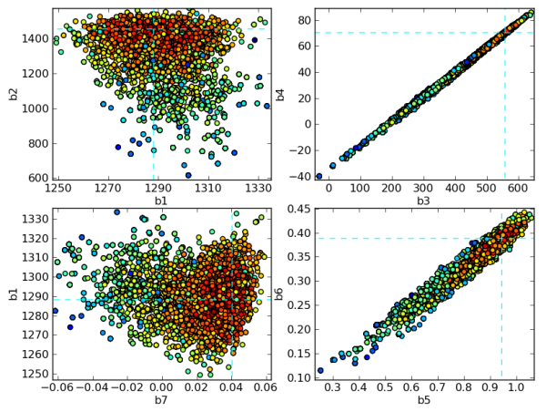

:author: Brian Refsdal
:email: brefsdal@cfa.harvard.edu
:institution: Smithsonian Astrophysical Observatory

:author: Stephen Doe
:email: sdoe@cfa.harvard.edu
:institution: Smithsonian Astrophysical Observatory

:author: Dan Nguyen
:email: dnguyen@cfa.harvard.edu
:institution: Smithsonian Astrophysical Observatory

:author: Aneta Siemiginowska
:email: asiemiginowska@cfa.harvard.edu
:institution: Smithsonian Astrophysical Observatory

.. _`pyBLoCXS`: http://hea-www.harvard.edu/AstroStat/pyBLoCXS/
.. _`Sherpa`: http://cxc.harvard.edu/contrib/sherpa/

--------------------------------------------------------------
Fitting and Estimating Parameter Confidence Limits with Sherpa
--------------------------------------------------------------

.. class:: abstract

   Sherpa is a generalized modeling and fitting package.  Primarily developed
   for the Chandra Interactive Analysis of Observations (CIAO) package by the
   Chandra X-ray Center, Sherpa provides an Object-Oriented Programming (OOP)
   API for parametric data modeling.  It is designed to use the forward fitting
   technique to search for the set of best-fit parameter values in parametrized
   model functions.  Sherpa can also estimate the confidence limits on best-fit
   parameters using a new confidence method or using an algorithm based on
   Markov chain Monte Carlo (MCMC).  Confidence limits on parameter values are
   necessary for any data analysis result, but can be non-trivial to compute in
   a non-linear and multi-parameter space.  This new, robust confidence method
   can estimate confidence limits of Sherpa parameters using a finite
   convergence rate.  The Sherpa extension module, pyBLoCXS, implements a
   sophisticated Bayesian MCMC-based algorithm for simple single-component
   spectral models defined in Sherpa.  pyBLoCXS has primarily been developed in
   Python using high-energy X-ray spectral data.  We describe the algorithm
   including the features for defining priors and incorporating deviations in
   the calibration information.  We will demonstrate examples of estimating
   confidence limits using the confidence method and processing simulations
   using pyBLoCXS.

.. class:: keywords

   modeling, fitting, parameter, confidence, mcmc, bayesian

Introduction
------------

`Sherpa`_ is an extensible, general purpose modeling and fitting application
written in Python and Python C/C++/FORTRAN extensions.  Originally developed for
users of NASA's Chandra X-ray Observatory, Sherpa has also been used to analyze
data from other astronomy missions, and even non-astronomical data.  Sherpa
provides Python data classes to encapsulate various types of astronomical data
sets (spectra, images, time series, light curves).  But to provide the greatest
flexibility, Sherpa is also designed to read in any data set that can be
represented as a collection of arrays.  From its first version, Sherpa has been
designed to help scientists analyze data from many different sources, and to be
extensible by scientific users, to help solve new problems.

Sherpa's main task is to help users fit parametrized models to their data.
Sherpa provides a library of physical and mathematical models, also written in
Python.  These models can be combined in arbitrarily complex expressions, that
are interpreted by the Python parser; such expressions can include Sherpa
models, arithmetic operators, models written by users in Python, and even other
Python functions.

To compare models and data, Sherpa includes statistics such as least-squares,
chi-squared based on Gaussian statistics, and maximum likelihood based on
Poisson statistics.  As model parameters are varied, Sherpa can then measure
whether the new model parameter values improve or worsen the fit to the data,
using one of these statistics.  Sherpa also provides functions to search
parameter space for the set of best-fit parameter values: a non-linear least
squares using the Levenberg-Marquardt algorithm [lm]_; and the Nelder-Mead simplex
algorithm [nm]_.

However, the analysis is not complete when a user has found a set of best-fit
model parameter values consistent with the data.  Because of measurement errors
and statistical noise, there is some probability distribution in parameter space
of parameter values that are consistent with the data.  If the user can examine
this probability distribution in some way, the user can determine how well the
best-fit parameter values are constrained.  Such constraints are often
summarized as confidence limits, stating that parameters are known to a certain
level of confidence [avn1976]_.  For example, after an examination of parameter
space, the user might determine that, for a model having temperature as a
parameter, a best-fit temperature of 1.2 keV has 90% confidence limits of +0.2
keV, -0.4 keV.  Meaning that if the observation and resulting fit were
replicated 1000 times, then in 900 trials the best-fit temperature would be
between 1.4 and 0.8 keV.  The narrower the confidence limits, the better the
constraints on the best-fit parameter value.

In this paper, we describe several methods we make available to Sherpa
users and Python programmers to put confidence limits on fitted
parameter values.  We discuss a confidence limit function included in
Sherpa, that examines parameter space near the local minimum
representing best-fit parameter values, and that returns the desired
confidence limits.  We provide an interface to this function allowing
users to add their own statistic and fitting functions, making this
function available to SciPy users.  We also discuss the use of
simulations in Sherpa to derive limits from distributions of fitted
parameter values after many simulations and fits, and show an example
to derive both flux and flux errors from a model fitted to spectral
data.  Finally, we present a new Python module providing a Bayesian
approach to deriving fitted parameter values and confidence limits:
`pyBLoCXS`_, a new importable Python module, that allows use of prior
distributions on model parameters via extensions to Sherpa statistics
classes.

Data Preparation
----------------

Sherpa provides native Python data classes that encapsulate 1-D and
2-D data sets, i.e., (x, y) and (x_1, x_2, y) respectively.  These
classes can be extended to contain data of higher dimensionality.  In
all data classes, the x-array(s) are considered to be the independent
variable(s), and the y-array is considered the dependent variable.
Any model to be fit to the data must take the form f(x, p), where x is
the collection of x-array(s) taken from the data, and p is the array
of parameter values that may be varied by the Sherpa fitting function.
The model returns an array of model values that are compared to the
data's y-values.

Sherpa data classes also include error bars on the dependent variable;
these error bars are assumed to be symmetric.  (Error bars on the
independent x-array(s) are not yet supported, and so are not assumed
to be significant.)  The data classes can contain both statistical and
systematic errors; if both are present, they are added in quadrature
to provide the error bars on the data.  Systematic errors come from
measurements; if not provided along with the data, Sherpa assumes the
systematic errors are zero.  If statistical errors are not measured
and provided with the data, then Sherpa can estimate Gaussian errors
as needed in :math:`\chi^2` fitting; or, the user can use one of the
maximum likelihood statistics, in which Poisson statistics are
assumed; or, the user can do a simple least-squares fit to the data.

Fitting Models to Data
----------------------

Sherpa models are assumed to be parametrized functions f(x, p), where
x is the collection of x-array(s) from the data, and p is the array of
model parameters.  When the model is calculated, the return value is
an array of predicted data values that can be directly compared to the
observed data values (that are contained in the data's y-array). 

Sherpa includes a model description syntax for users to build composite models
that are arbitrarily complex.  To support such a powerful feature, the user is
not required to provide a function to calculate the derivatives.  For least
squares fitting using Levenberg-Marquardt, Sherpa estimates the gradient using
forward difference approximation (LMDIF) and backward difference approximation
if the fit is at an upper parameter boundary.  An estimate of the gradient is
not needed for fitting using simplex, only the fit statistic value is required. 

In some cases, the fit parameters are not necessarily independent and
identically distributed (i.i.d.) and correlations between parameters
are present.  This can lead to non-linear effects and complex
parameter spaces, see Figure :ref:`fig1`.  We present a method designed to
calculate confidence intervals in non-linear regression and a Bayesian
method to sample the posterior probability distribution.

   A local minima :label:`fig1`

Confidence Intervals
--------------------

The optimizer's search for the best-fit parameters stops when the fit
statistic or error function has reached an optimal value.  For least
squares, the optimal value is when the sum of squared residuals is a
minimum.  For the maximum likelihood estimator, the optimal value is
found when the log-likelihood is a maximum.  Once the best-fit
parameter values are found, users typically determine how well
constrained the parameter values are at a certain confidence level by
calculating confidence intervals for each parameter.  The confidence
level is a value of the fit statistic that describes a constraint on
the parameter value.  The confidence interval is the range that likely
contains the parameter value at which the fit statistic reaches its
confidence level while other parameters reach new best-fit values.
See Figure :ref:`fig2`.  For example, consider calculating the
confidence intervals at a value of :math:`\sigma=1`, or 68%
confidence.  If the observed data is re-sampled and the model is fit
again with new data, there would be a 68% chance that the confidence
intervals would constraint the parameter value.  The narrower the
confidence interval, the more the model parameter value becomes
accurately constrained.

   A closeup view of a local minima :label:`fig2`

In the neighborhood of the fit statistic minimum, the multi-dimensional
parameter space can take the shape of an asymmetric paraboloid.  The confidence
intervals are calculated for each selected parameter independently by viewing
the parameter space along the current parameter's dimension.  This view can be
represented as a 1-D asymmetric parabola, see Figure :ref:`fig2`.  Suppose that
:math:`x_{0}` represents a parameter's best-fit value.  Its associated
confidence intervals are represented as :math:`x_{0} \pm ^{\delta_{1}}
_{\delta_{2}}` where :math:`\delta_{1} \neq \delta_{2}` in non-linear parameter
spaces, so each confidence limit must be calculated independently.  In turn, the
statistic value should equal an amount of :math:`\sigma^{2}` (where
:math:`\sigma` represents the degree of confidence) at each confidence interval
:math:`x_{0} + \delta_{1}` and :math:`x_{0} - \delta_{2}` as other parameters
vary to new best-fit values.  The degree to which the confidence limit is
bounded can be characterized by the shape of the well in a multi-dimensional
parameter space.  A well that is a deep-and-narrow corresponds to a tight
confidence interval while a well that is shallow-and-broad represents a wider
confidence interval.

   The confidence intervals can be reduced to a root solving problem by
   translating the y-axis by an amount equal to :math:`\sigma^2` and selecting
   points along the fit statistic curve. :label:`fig3`

Method for Determining Confidence
---------------------------------

Calculating the confidence interval for a selected fit parameter can
be transformed into a one dimensional root finding problem with the
correct coordinate translation.  By simply translating the parameter
dimension by an amount equal to :math:`\sigma^2`, the confidence
intervals now become x-axis intercepts in the parameter dimension.
This is an important step in the algorithm because a change in sign
will bracket the root.  The green and blue points in Figure
:ref:`fig3` effectively bracket the requested confidence limit.

Method for Selecting Abscissae
------------------------------

Sherpa's confidence method uses Müller's root finding method to
calculate the confidence intervals given three points.  Sherpa begins
at the best-fit value and calculates points along the fit statistic
curve using the covariance, if available, and the secant method.
Müller's method is the a good algorithm for finding the root of a
curve that is approximated by a parabola near the minimum.  We argue
that the function curve can be approximated by parabola given that the
function can be represented as a Taylor's series.  The leading term in
series expansion is quadratic since the gradient of the statistic
curve can be ignored near the minimum.

The confidence method assumes that the parameter values are located in
a minimum approximated by a parabola, that the best-fit is
sufficiently far from any parameter boundaries, and that the bracketed
parameter interval is larger than the requested machine tolerance.

A Bayesian Approach to Confidence
---------------------------------

Fitting Poisson data with :math:`\chi^2` can lead to biased results.
Using likelihood statistics like cash or C do not introduce bias, but
lack simple tests for characterizing how well the model fits the data.
Such likelihood statistics often require additional methods to
validate model selection and to determine "goodness-of-fit".  Such
methods involve sampling from the posterior probability distribution.
Sherpa includes fit statistics derived from the likelihood and
complimentary optimization methods, but on its own Sherpa does not
include the means to calculate the posterior.

`pyBLoCXS`_ is an additional Python module that complements Sherpa to
probe the posterior probability and to verify model selection using
Bayesian methods.  pyBLoCXS is designed to use Markov chain Monte
Carlo (MCMC) techniques to explore parameter space at a suspected
minimum.  pyBLoCXS was originally implemented and tested to handle
Bayesian Low-Count X-ray Spectral (BLoCXS) analysis in Sherpa using
simple composite spectral models, and additional research is underway
to test more complex cases.

The underlying statistical model in pyBLoCXS employs Bayes' Rule
:ref:`bayes2` where the posterior probability distribution is
proportional to the product of the conditional and prior distributions.

.. math::
   :label: bayes1

   p(\theta|d, I) = \frac{p(d|\theta, I) p(\theta|I)}{p(d|I)}

Where :math:`p(\theta|d, I)` represents the posterior distribution;
:math:`p(d|\theta, I)`, the likelihood; :math:`p(\theta|I)`, the prior;
and :math:`p(d|I)` is considered constant.

.. math::
   :label: bayes2

   p(\theta|d, I) \propto p(d|\theta, I) p(\theta|I)

Where :math:`\theta` represents the model parameters; :math:`d`, the observed
data; and :math:`I`, the initial information.

The pyBLoCXS package includes a method ``get_draws`` to sample the
posterior distribution for a specified number of iterations.  The loop
draws parameter values from a multi-variate Student's t distribution
and calculates the likelihood on the parameter proposal given the
observed data.  The proposal is then accepted or rejected according to
the current Metropolis-Hastings acceptance criterion and repeat.  See
Figure :ref:`mcmc` for a graphical representation of the MCMC loop.

   The Metropolis-Hastings criterion implemented in pyBLoCXS. :label:`mcmc`

pyBLoCXS currently has two sampling methods.  The Python class,
``MH``, implements a Metropolis-Hastings jumping rule characterized by
the Student's t distribution based on the input scales, best-fit
values, and user-specified degrees of freedom.  The second class,
``MetropolisMH``, is a variation on ``MH`` in that it implements a
Metropolis-Hastings jumping rule with a Metropolis jumping rule
centered on the current draw.

The pyBLoCXS package can be used separately from Sherpa using just
Python and NumPy.  The main inputs to pyBLoCXS are a callable function
to calculate the log-likelihood, an ndarray of best-fit parameter values
of size ``n``, an ndarray of the multi-variate scales of size ``n x
n``, and the degrees of freedom.  The ndarray of multi-variate scales
is typically the covariance matrix calculated at the best-fit
parameter values.

pyBLoCXS is based on the techniques described in the paper [van2001]_,
however, pyBLoCXS implements a different type of sampler.  A
description of the MCMC methods implemented in pyBLoCXS can be found
in Chapter 11 of [gel2004]_.

Example
-------

The `Thurber
<http://www.itl.nist.gov/div898/strd/nls/data/thurber.shtml>`_ problem
is an example of Non-linear least squares regression from the
Statistical Reference Datasets (`StRD
<http://www.itl.nist.gov/div898/strd/>`_) at the National Institute of
Standards and Technology (NIST).  The observed data results from a NIST
study of semiconductor electron mobility.  The `data
<http://www.itl.nist.gov/div898/strd/nls/data/LINKS/DATA/Thurber.dat>`_
includes 37 observations with the dependent variable (y) represented
as electron mobility and the independent variable (x) as the log of
the density.

.. math::
   :label: thurber

   y = f(x; \beta) + \epsilon
     = \frac{\beta_1 + \beta_2x + \beta_3x^2 + \beta_4x^3}{1 + \beta_5x + \beta_6x^2 + \beta_7x^3} + \epsilon

.. math::
   :label: thurber_params

   \vec{p} = \{ \beta_1, \beta_2, \beta_3, \beta_4, \beta_5, \beta_6, \beta_7 \}

We define a compact high-level UI to access the Sherpa confidence method.  The
illustrative example below minimizes the Thurber function using least-squares
and Sherpa's implementation of Levenberg-Marquardt (LMDIF).  The results can be
found in Table :ref:`tbl1`.  The fit results agree to 99.99% for all parameters.

   Thurber fit :label:`fit1`

Loading Data
------------

This example relies on a package `asciitable
<http://cxc.harvard.edu/contrib/asciitable/>`_ to read columns of text
data into NumPy arrays.  The Thurber problem defines an equation as
the model the function which is written as a vectorized Python
function using NumPy ufuncs.

|

.. code-block:: python

   import sherpa.ui as ui
   import asciitable

   tbl = asciitable.read('Thurber.dat',
			 Reader=asciitable.NoHeader,
			 data_start=36,
			 delimiter="\s")

   # Columns as NumPy arrays
   x = tbl['col2']
   y = tbl['col1']

   p0 = [1000, 1000, 400, 40, 0.7, 0.3, 0.03]

   def calc(p, x):
       xx = x**2
       xxx = x**3
       return ( (p[0] + p[1]*x + p[2]*xx + p[3]*xxx) / 
		(1. + p[4]*x + p[5]*xx + p[6]*xxx) )

   # define a tolerance
   tol = 1.e-9

Sherpa Fitting
--------------

Below, the Thurber data arrays are loaded into a Sherpa data set using
``load_arrays``.  The example indicates the fit statistic,
optimization method, and defines the ``calc`` function as the Sherpa
model using ``load_user_model``.  The function ``add_user_pars``
accepts Python lists that specify the parameter names, initial values,
and optionally the parameter limits.  A user can fit the model to the data using
``fit`` and access the best-fit parameter values as a NumPy array ``popt``.

|

.. code-block:: python

   names = ['b%i' % (ii+1) for ii in range(len(p0))]

   ui.load_arrays(1, x, y, ui.Data1D)
   ui.set_stat('leastsq')

   ui.set_method('levmar')
   ui.set_method_opt('gtol', tol)
   ui.set_method_opt('xtol', tol)
   ui.set_method_opt('ftol', tol)
   ui.set_method_opt('epsfcn', tol)

   ui.load_user_model(calc, 'mdl')
   ui.add_user_pars('mdl', names, p0)
   ui.set_model('mdl')

   ui.fit()
   popt = ui.get_fit_results().parvals

.. table:: The best-fit parameters for Thurber problem. :label:`tbl1`

   +-----------------+--------------------+-------------------+------------+
   | Parameter       | Certified Values   | Sherpa Values     | Percentage |
   +-----------------+--------------------+-------------------+------------+
   | :math:`\beta_1` | 1.2881396800E+03   | 1.28813971e+03    | 99.999     |
   +-----------------+--------------------+-------------------+------------+
   | :math:`\beta_2` | 1.4910792535E+03   | 1.49106665e+03    | 99.999     |
   +-----------------+--------------------+-------------------+------------+
   | :math:`\beta_3` | 5.8323836877E+02   | 5.83229092e+02    | 99.998     |
   +-----------------+--------------------+-------------------+------------+
   | :math:`\beta_4` | 7.5416644291E+01   | 7.54148565e+01    | 99.998     |
   +-----------------+--------------------+-------------------+------------+
   | :math:`\beta_5` | 9.6629502864E-01   | 9.66284739e-01    | 99.999     |
   +-----------------+--------------------+-------------------+------------+
   | :math:`\beta_6` | 3.9797285797E-01   | 3.97967752e-01    | 99.999     |
   +-----------------+--------------------+-------------------+------------+
   | :math:`\beta_7` | 4.9727297349E-02   | 4.97257372e-02    | 99.997     |
   +-----------------+--------------------+-------------------+------------+

Sherpa Confidence Method
------------------------

The example below highlights the calculation of the asymmetric
:math:`\text{1}\sigma` confidence limits on seven parameters using
``conf`` using the C-statistic and simplex.  The confidence limits are
accessible as NumPy arrays ``pmins`` and ``pmaxes``.

|

.. code-block:: python

   ui.set_stat('cstat')
   ui.set_method('neldermead')
   ui.fit()
   ui.conf()

   # lower error bars
   pmins  = ui.get_conf_results().parmins
   
   # upper error bars
   pmaxes = ui.get_conf_results().parmaxes

Confidence limits on the example Thurber problem are listed in Table :ref:`tbl2`.

.. table:: The one standard deviation confidence limits for Thurber problem. :label:`tbl2`

   +-----------------+------------+-------------+-------------+
   | Parameter       | Best Fit   | Lower Bound | Upper Bound |
   +-----------------+------------+-------------+-------------+
   | :math:`\beta_1` |   1288.12  |   -12.1594  |    12.1594  |
   +-----------------+------------+-------------+-------------+
   | :math:`\beta_2` |   1452.67  |   -73.3571  |    17.8398  |
   +-----------------+------------+-------------+-------------+
   | :math:`\beta_3` |   557.281  |   -7.09913  |    34.3927  |
   +-----------------+------------+-------------+-------------+
   | :math:`\beta_4` |   70.2984  |   -10.1567  |    2.42915  |
   +-----------------+------------+-------------+-------------+
   | :math:`\beta_5` |  0.943534  | -0.0575953  |  0.0433009  |
   +-----------------+------------+-------------+-------------+
   | :math:`\beta_6` |  0.387899  |   -0.02639  |  0.0199346  |
   +-----------------+------------+-------------+-------------+
   | :math:`\beta_7` | 0.0403176  | -0.0134162  | 0.00914532  |
   +-----------------+------------+-------------+-------------+

Sherpa Covariance Method
------------------------

To compute the covariance matrix, Sherpa first estimates the
information matrix by finite differences by reducing a
multi-dimensional problem to a series of 1-D problems.  Sherpa then
iteratively applies second central differencing with extrapolation
(Kass 1987).  The covariance matrix follows by inverting the
information matrix.

The example below calculates the covariance matrix accessible as a
NumPy array for the seven parameter values.  An estimation of the
symmetric confidence limits are found in the NumPy arrays ``pmins``
and ``pmaxes``.

|

.. code-block:: python

   ui.covar()

   # lower error bars
   pmins  = ui.get_covar_results().parmins
   
   # upper error bars
   pmaxes = ui.get_covar_results().parmaxes

   # where pmins == -pmaxes

   # Access the covariance matrix
   cov = ui.get_covar_results().extra_output

.. table:: The one standard deviation covariance results for Thurber problem. :label:`tbl3`

   +-----------------+------------+-------------+-------------+
   | Parameter       | Best Fit   | Lower Bound | Upper Bound |
   +-----------------+------------+-------------+-------------+
   | :math:`\beta_1` |   1288.12  |   -12.1594  |   12.1594   |
   +-----------------+------------+-------------+-------------+
   | :math:`\beta_2` |   1452.67  |    -55.506  |    55.506   |
   +-----------------+------------+-------------+-------------+
   | :math:`\beta_3` |   557.281  |   -39.7166  |   39.7166   |
   +-----------------+------------+-------------+-------------+
   | :math:`\beta_4` |   70.2984  |   -7.58595  |   7.58595   |
   +-----------------+------------+-------------+-------------+
   | :math:`\beta_5` |  0.943534  | -0.0471354  | 0.0471354   |
   +-----------------+------------+-------------+-------------+
   | :math:`\beta_6` |  0.387899  | -0.0217024  | 0.0217024   |
   +-----------------+------------+-------------+-------------+
   | :math:`\beta_7` | 0.0403176  | -0.0107599  | 0.0107599   |
   +-----------------+------------+-------------+-------------+

It is important to note that the parameter uncertainties computed by covariance
do not consider correlations between parameters and can underestimate or
overestimate the true uncertainty.  Compare the differences in uncertainties
computed by ``conf`` and ``covar`` in Tables :ref:`tbl2` and :ref:`tbl3`.

pyBLoCXS
--------

The example below selects the Metropolis-Hastings using the pyBLoCXS [sem2011]_
function ``set_sampler``.  The likelihood and parameter draws are computed using
the high level function ``get_draws``.  The inputs to ``get_draws`` at the API
level are a function to calculate the likelihood, the best-fit parameter values,
the covariance matrix centered on the best-fit, the degrees of freedom, and the
number of iterations.  At the high level, only the number of iterations is
needed as input.  The other inputs are accessed from Sherpa by pyBLoCXS.

|

.. code-block:: python

   import pyblocxs

   pyblocxs.set_sampler('MH')
   stats, accept, params = pyblocxs.get_draws(niter=1e4)

   pyblocxs.plot_trace(params[0], 'b1')

pyBLoCXS includes high level plotting functions to display the trace,
the cumulative distribution function, and the probability distribution
function.  The trace plot for :math:`\beta_1` includes gaps in the
line that indicate rejected parameter proposals.  This example has an
acceptance rate of ~24%, well within the accepted range for an MCMC
chain.

   A trace plot show the draws for :math:`\beta_1` per iteration :label:`trace`

The ``scatter`` function in matplotlib can be used to visualize the
log-likelihood according to two selected parameters.  Using
Metropolis-Hastings as the sampler, the density plot is shown in
Figure :ref:`figmh1` .  For parameters :math:`\beta_3` and
:math:`\beta_4`, a distinct correlation is shown as a long and narrow
well.

|

.. code-block:: python

   import pylab
   pylab.scatter(params[0], params[1],
                 c=stats, cmap=pylab.cm.jet)

   Log-likelihood density using Metropolis-Hastings in pyBLoCXS. :label:`figmh1`

To contrast the previous sampler, selecting Metropolis-Hastings mixed
with Metropolis and re-sampling shows a density plot with a larger
region of parameter space and distinct tail features in Figure
:ref:`figmh2`.

|

.. code-block:: python

   pyblocxs.set_sampler('MetropolisMH')
   stats, accept, params = pyblocxs.get_draws(niter=1e4)

   pylab.scatter(params[0], params[1],
                 c=stats, cmap=cm.jet)

   Log-likelihood density using Metropolis-Hastings with Metropolis in pyBLoCXS. :label:`figmh2`

Priors
------

pyBLoCXS includes a flexible definition of priors for each fit
parameter.  Priors are important for maximum likelihood analysis to
take advantage of priori knowledge such as the range of parameter
values.  pyBLoCXS assumes each parameter to have a flat or
non-informative prior by default.

Using the Sherpa model ``normgauss1d``, a Gaussian prior can be added
to the first parameter in the set with 

|

.. code-block:: python

   import sherpa.astro.ui as ui
   import pyblocxs

   ui.xsapec.therm
   ui.normgauss1d.g1
   g1.pos=2.5; g1.fwhm=0.5

   pyblocxs.set_prior(therm.kT,g1)
   pyblocxs.set_sampler_opt('defaultprior',
                            False)
   pyblocxs.set_sampler_opt('priorshape',
                            [True, False, False])
   pyblocxs.set_sampler_opt('originalscale',
                            [True, True, True])

By accepting callable functions, pyBLoCXS can support arbitrary
functions representing the parameter prior.

|

.. code-block:: python

   import sherpa.astro.ui as ui
   import numpy

   def lognorm(x, sigma=0.5, norm=1.0, x0=20.):
       xl=numpy.log10(x)+22.
       return (norm/numpy.sqrt(2*numpy.pi)/sigma)*
               numpy.exp(-0.5*(xl-x0)*(xl-x0)/sigma/sigma)

   ui.xsphabs.abs1

   pyblocxs.set_prior(abs1.NH,lognorm)
   pyblocxs.set_sampler_opt('defaultprior',
                            False)
   pyblocxs.set_sampler_opt('priorshape',
                            [True, False, False])
   pyblocxs.set_sampler_opt('originalscale',
                            [True, True, True])

Accounting for Calibration Uncertainties
----------------------------------------
   :label:`calerr`

Future released versions of pyBLoCXS will include methods to
incorporate the systematic uncertainties in modeling high energy
spectra.  These uncertainties which have largely been ignored due to
the lack of a comprehensive method, can introduce bias in the
calculation of model parameters and can underestimate their variance.
Specifically, pyBLoCXS will utilize the calibration uncertainties in
the effective area curve for spectral analysis.  The effective area
for high energy detectors records the sensitivity of the detector as a
function of energy.

Calibration samples of the effective area are described in Drake et
al. (2006) using Principle Component Analysis (PCA) to represent the
curve's variability.  Samples of the effective area can also be found
using simulations.

pyBLoCXS perturbs the effective area curve by sampling from the
calibration information at each iteration in the MCMC loop accurately
accounting for the non-linear effects in the systematic uncertainty.
With this method, best-fit model parameters values and their
uncertainty are estimated more accurately and efficiently using Sherpa
and pyBLoCXS.

|

Conclusion
----------

We describe the Sherpa confidence method and the techniques included in
pyBLoCXS to estimate parameter confidence when fit parameters present
with correlations or the parameters are not themselves normally
distributed.  Multi-dimensional parameter space is typically non-uniform and
Sherpa provides the user with options to explore its topology.  The
included code example describes an application of the Sherpa
confidence method and the pyBLoCXS sampling method.

Support of the development of Sherpa is provided by National Aeronautics and
Space Administration through the Chandra X-ray Center, which is operated by
the Smithsonian Astrophysical Observatory for and on behalf of the National
Aeronautics and Space Administration contract NAS8-03060.

References
----------

.. [avn1976] Y. Avni. *Energy spectra of X-ray clusters of galaxies*, The Astrophysical Journal, 210:642-646, Dec. 1976. 

.. [fre2001] P. E. Freeman, S. Doe, A. Siemiginowska. *Sherpa: a Mission-Independent Data Analysis Application* SPIE Proceedings, Vol. 4477, p.76, 2001.

.. [gel2004] A. Gelman et al. *Bayesian Data Analysis* Chapman & Hall Texts in Statistical Science Series, 2nd Ed. 2004.

.. [lee2011] H. Lee et al. *Accounting for Calibration Uncertainties in X-ray Analysis: Effective Area in Spectral Fitting*, The Astrophysical Journal 731:126, 2011.

.. [nm] Computer Journal, J.A. Nelder and R. Mead, 1965, vol 7, pp. 308-313.

.. [pro2002] R. Protassov et al. *Statistics, Handle with Care: Detecting Multiple Model Components with the Likelihood Ratio Test*, The Astrophysical Journal, 571:545-559, May 2002.

.. [ref2009] B. Refsdal et al. *Sherpa: 1D/2D modeling in fitting in Python* Proceedings of the 8th Python in Science conference (SciPy 2009), G Varoquaux, S van der Walt, J Millman (Eds.), pp. 51-57.

.. [sem2011] Siemiginowska et al. *pyblocxs: Bayesian Low-Counts X-ray Spectral Analysis in Sherpa*, Astronomical Society of the Pacific Conference Series, 442:439. 2011.

.. [van2001] D. van Dyk et al. *Analysis of Energy Spectra with Low Photon Counts via Bayesian Posterior Simulation*, The Astrophysical Journal, 548:224, February 2001.

.. [lm] Lecture Notes in Mathematics 630: Numerical Analysis, G.A. Watson (Ed.), Springer-Verlag: Berlin, 1978, pp. 105-116
