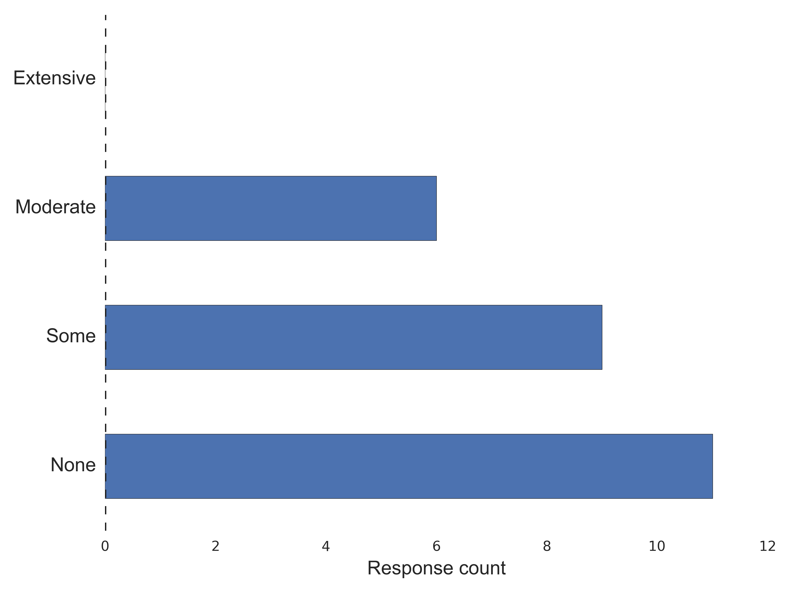
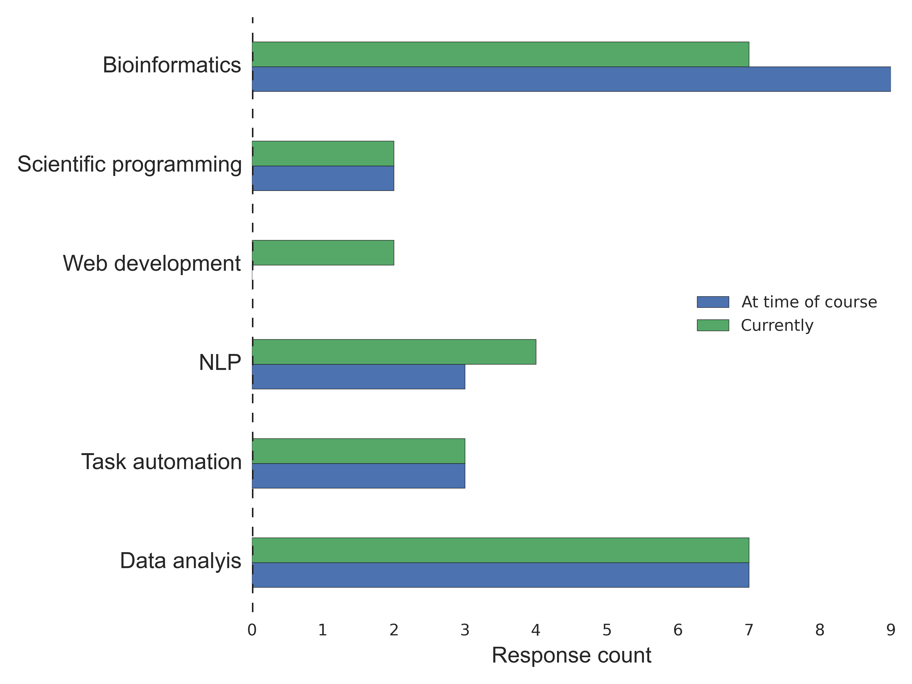
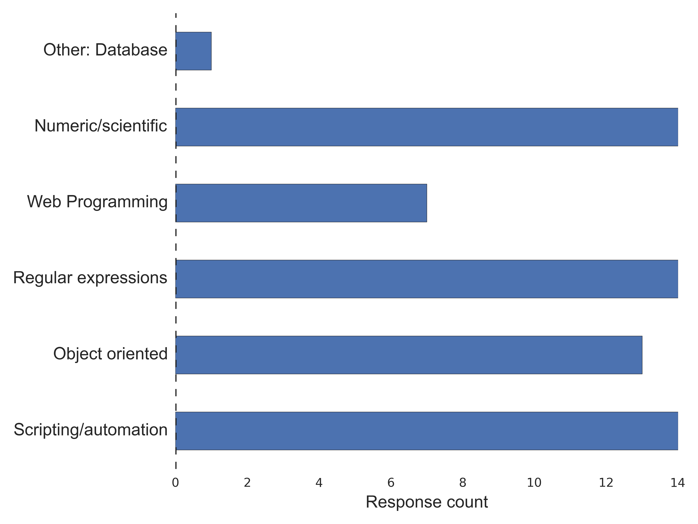
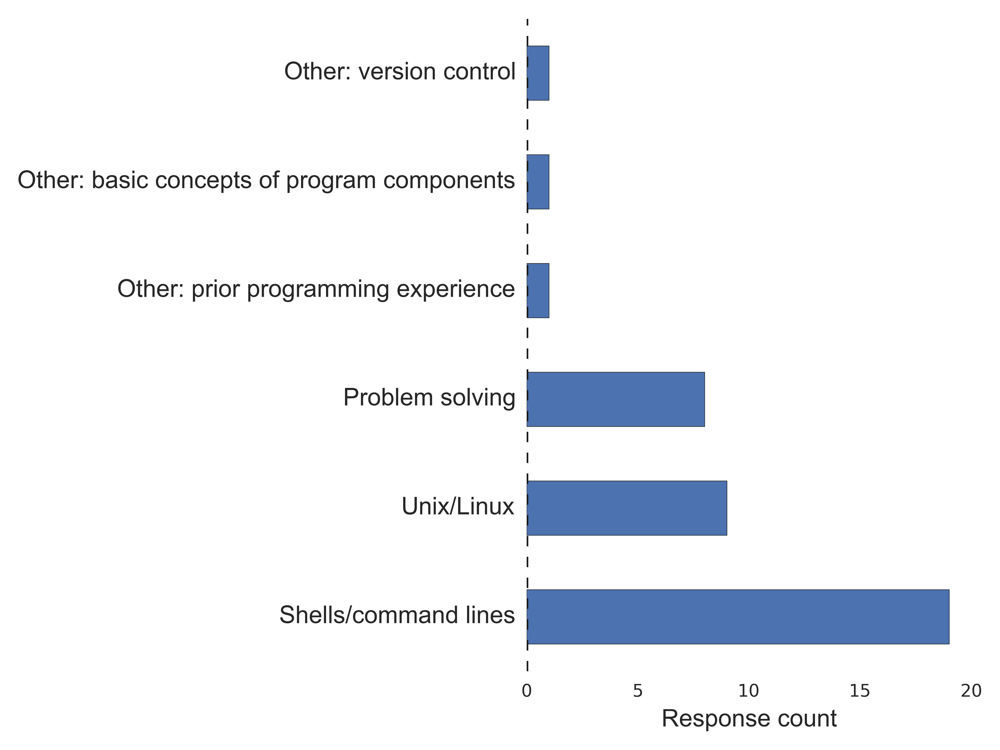

:author: Brian E. Chapman, Ph.D.
:email: brian.chapman@utah.edu
:institution: Department of Radiology, University of Utah

:author: Jeannie Irwin, Ph.D.
:email: jeannieirwin@gmail.com
:institution: Unaffiliated

----------------------------------------------------------------
Python as a First Programming Language for Biomedical Scientists
----------------------------------------------------------------

.. class:: abstract

We have been involved with teaching Python to biomedical scientists since 2005. In all, seven courses have been taught: 5 at the University of Pittsburgh, as a required course for biomedical informatics graduate students. Students have primarily been biomedical informatics graduate students with other students coming from human genetics, molecular biology, statistics, and similar fields. The range of prior computing experience has been wide: the majority of students had little or no prior programming experiences while a few students were experienced in other languages such as C/C++ and wanted to learn a scripting language for increased productivity. The semester-long courses have followed a procedural first approach then an introduction to object-oriented programming. By the end of the course students produce an independent programming project on a topic of their own choosing.

The course has evolved as biomedical questions have evolved, as the Python language has evolved, and as online resources have evolved. Topics of primary interest now focus on biomedical data science with analysis and visualization using tools such as Pandas, scikit-learn, and Bokeh. Class format has evolved from traditional slide-based lectures supplemented with IDLE programming demonstrations to flipped-classrooms with IPython notebooks with an interactive learning emphasis. Student evaluations indicate that students tend to find the class challenging but also empowering. The most difficult challenge for most students has been working with their computers (installing software, setting environment variables, etc.) Tools such as Canopy, Anaconda, and the IPython notebook have significantly reduced the extraneous cognitive burden on the students as they learn programming.

In addition to reviewing the nature of the course, we will review the long-term impact the course has had on the students, in terms of their retrospective evaluation of the course and the current nature of their computational toolbox. We will also discuss how our experience with these courses has been leveraged in designing a Python-centric summer school for biomedical data science.

.. class:: keywords

   education, biomedical informatics, biomedical sciences

Introduction
-------------------------

Python has become the most popular language for majors at the top computer science departments (`Philip Guo, "Python is Now the Most Popular Introductory Teaching Language at Top U.S. Universities" <http://cacm.acm.org/blogs/blog-cacm/176450-python-is-now-the-most-popular-introductory-teaching-language-at-top-us-universities/fulltext>`_). Motivations for Python as the first language are its simple semantics and syntax [Stefik2013]_, leading to students making fewer mistakes, feeling more confidence, and having a better grasp of programming concepts relative to peers taught with more traditional, lower-level languages such as C or Java [Koulouri2014]_. Since Python is a multi-paradigm programming language, it offer great pedagogical flexibility. Python is also an active language with many open source projects and employers looking for Python programmers (`"Is Python Becoming the King of the Data Science Forest?" <(http://www.experfy.com/blog/python-data-science/>`_, `"The RedMonk Programming Language Rankings: January 2015" <(http://redmonk.com/sogrady/2015/01/14/language-rankings-1-15/>`_).

These same characteristics make Python well-suited for teaching programming to students without a computational background. The biomedical sciences are increasingly becoming computationally oriented. The installation of electronic medical records, digital public health registries, and the rise of -omics (e.g., genomics, proteomics, biomics) means biological discovery and healthcare delivery increasingly require the storage and analysis of digital data. However, students in biomedical sciences largely arrive in graduate school without computational skills. For example, biomedical informatics graduate students have diverse backgrounds including medicine, nursing, library science, psychology, and linguistics. In order to be successful in their graduate studies, the students must quickly pick up programming skills relevant to the biomedical problems they are addressing in their graduate studies.

Rather than asking students to take multiple undergraduate computer science courses, we have designed a one-semester Python programming course that allows the students to develop programming skills for their graduate studies. In this paper we first provide a brief summary of the course. Using both our personal observations and surveys of past teaching assistants and students, we then summarize our experiences with this course over the past ten years. Finally, we provide suggestions for future teaching of biomedical graduate students.

Course Objectives
-------------------------

The course we describe here was originally created as a required programming course for biomedical informatics students at the University of Pittsburgh. Most recently it has been offered at the University of Utah as a required course for an applied genomics certificate and as an elective for a variety of biomedical science graduate programs, including biomedical informatics, biology, human genetics, and oncological science. One of us (BEC) has seven years' experience as the course designer and instructor, the other (JI) has one year's experience as a student (with a prior instructor) and four years' experience as a TA with BEC at the University of Pittsburgh.

As we conceive the course, it has two intended purposes. First, the course is intended to provide the students sufficient programming experience that they can use programming in their graduate studies, meaning they should be able to

a. continue to learn and improve their Python programming skills on their own,
b. successfully use Python in other programming-oriented courses during their graduate studies,
c. use Python in their thesis or dissertation work,
d. use their experience with the Python course to teach themselves another programming language, as needed.

Second, the course is intended to introduce students to the nature of biomedical data: what it looks like, what some of the standards associated with it are, and how to represent and model the data. For example, with clinical lab values, students would be asked to address whether integers, floating point numbers, or strings would be most appropriate for representing the depicted values, what type of meta-data  should be associated with the value (e.g., units, method of measurements), and what sort of data structure would be most appropriate to store the data and meta-data (e.g., list, tuple, or dictionary).

Simultaneously, the course tries to illustrate biomedical problems that researchers are currently addressing so that students are not learning programming in a vacuum or purely abstractly but in the context of problems in their fields.

The course is described to students as a “boot camp” to get students with little or no programming experience up to speed for starting their graduate work. Consequently, as a "boot camp" the students should expect to spend more time than in an average three-credit course. Because this course is viewed as a foundation for subsequent graduate classes, we assume the students are self motivated and are consequently more interested in learning than in the grade received in the course.

The course is taught with a more empirical than theoretical approach, using the Python (and IPython [Perez2007]_) shell to try out code snippets and see what happens. We occasionally quote Ms. Frizzle from The Magic School Bus: "Take chances, make mistakes, and get messy!" (http://magicschoolbus.wikia.com/wiki/Ms._Frizzle)

First taught in 2005, the nature of the course has transformed as the available computational and pedagogical tools have expanded. For example, learning how to read files with Pandas [McKinney2010]_ (http://pandas.pydata.org/) has replaced exercises in reading and parsing comma-separated files using low-level Python functionality. Similarly, static slides have been replaced by interactive IPython/Jupyter notebooks (http://ipython.org/notebook.html) and YouTube videos.

Course Structure
-------------------------

The course is structured around weekly homework assignments and a course project. Additional features have included quizzes (scheduled and pop), in-class and take-home exams, peer code-review, and in-class individual, pair, group, and class-wide programming assignments. Homeworks are designed to both reinforce topics that were covered in class and to require students to learn additional material on their own, primarily in the form of finding and using modules within the Python standard library. Course projects are intended to allow students to focus on an area of interest, to require them to learn additional tools, and to require them to integrate various topics covered in class. For example, they must define a base class and inherited class, interface with a database (e.g., SQLite), and have some sort of graphical user interface (e.g., IPython notebook, TKinter (https://docs.python.org/2/library/tkinter.html), Flask (http://flask.pocoo.org/), Django (https://www.djangoproject.com/)).

The semester class is roughly split in half. In the first half-semester, the course covers the fundamentals of imperative programming including numeric and string manipulation, if/else, while/for, functions, and classes. Homework assignments become progressively more demanding. In the second half-semester, topics learned in the first half are reinforced through exploration and illustration of various Python packages. Homeworks are decreased to allow the students more time to focus on their term projects. Because the illustrative applications are somewhat arbitrary, the students can request/select which topics are covered.

In-class lectures are minimized in favor of interactive programming assignments, either in the form of class-wide, small group, or individual programming projects, code reviews, or discussions about sticking points encountered during the homework. To ensure that students are motivated to be prepared for class, a "random student selector" is used to determine who will be at the podium for the next explanation or problem.

Students are encouraged to work together on homeworks and optionally can work together on term projects.

Evaluation Methods
-----------------------------

We reviewed previous course materials and end-of-course student evaluations. Course evaluation formats varied across years and institutions making quantitative analysis difficult, but were valuable for qualitative information. In addition, we solicited input from past teaching assistants and sent a questionnaire to previous students to better assess the long-term usefulness of the course. The questionnaire was generated using SurveyMonkey and consisted of a combination of multiple-choice, Likert scale, and free-response questions. Past course lists were obtained from the University of Pittsburgh and the University of Utah. Where current e-mails were not known from the University, connections were sought through LinkedIn and other social media. Previous teaching assistants for the courses were e-mailed directly. Course materials were reviewed to observe changes in content over the years. Previous teaching assistants for the course were solicited for their analysis of the course. Twenty-seven previous students responded to the survey. However, one of the responses was blank on all questions, and so our results are based on 26 responses.

Results
---------------------------------------------------------------

Instructors' Perceived Successes and Challenges
~~~~~~~~~~~~~~~~~~~~~~~~~~~~~~~~~~~~~~~~~~~~~~~~~~

All in all, we believe that the course has been very successful. The vast majority of students enrolling in the class achieve a functional proficiency in Python by the end of the semester. Frequently, the term project for the class has expanded into thesis or dissertation projects. At least one student with little prior programming experience started taking on "moonlighting" Python programming projects for other students and faculty. The personally communicated responses of two students remain memorable. The first student who took the course later in her graduate studies referred to the course as "liberating." Specifically, she felt liberated from dependency on her advisor's programming staff for conducting her own graduate work. She ultimately changed course and completed a programming-centric dissertation project. The second student, a physician who attended the course as part of a short-term fellowship, referred to the class as "life changing." After completing the fellowship, he left his medical practice, received a graduate degree in biomedical informatics from Stanford University, and is currently employed by a company recently named as one of the 50 smartest companies of 2015 by MIT Technology Review (http://www.technologyreview.com/lists/companies/2015/).

The greatest challenge we have observed in teaching programming to the biomedical science graduate students is the lack of basic computer skills among students. Students have had difficulty using a shell, installing Python and an appropriate code editor and/or an integrated development environment, getting environment variables set, etc. These challenges have been substantially diminished by the use of third-party, complete Python installations, such as Anaconda or Canopy. The use of the IPython notebook has also simplified getting started for the students. However, the notebook has in some ways become a long-term detriment to some students as they are slower to adopt more powerful code editors or debugging tools.

Another challenge that we have observed repeatedly is a lack of general problem solving skills among students. This is immediately manifested in the difficulty students have in learning how to debug their programs, but lack of problem solving skills has also been manifested in tackling open-ended problems. Students have struggled with how to break a problem into small parts, and how to start with a partial solution, test it, and then move on to a more complete solution.

A final challenge with the course has been keeping the class relevant to each student. This challenge can be broken down into three parts. First, a common pedagogical problem is the breadth of prior programming experience of the students. With the limited teaching support available in most health sciences settings, it is not feasible to have multiple courses where skill levels can better match student backgrounds. Consequently, we must continually strive to not drown the weaker students while not boring the more advanced students. We believe the course evaluations indicate that we generally achieve this balance, but the balance always feels unstable. Further, we have observed that as we make the classroom more interactive, there is more opportunity for students to become frustrated with each other. Second, as the computational fields within biomedical sciences expand, it is more difficult to fashion a single course in which the instructor can meaningfully match the increasingly diverse needs of the students. Third, and perhaps most important, it has been difficult to provide relevant data sets for the students to explore. This is particularly true for students interested in clinical informatics, where privacy rules severely restrict access to data. Thankfully, federally funded efforts to increase data sharing have resulted in many relevant publicly available medical data sets. The NCI Biomedical Imaging Archive (https://imaging.nci.nih.gov/ncia/login.jsf), MT Samples (http://www.mtsamples.com/), MIMIC II [Goldberger2000]_. A variety of -omic datasets (see for example http://www.ncbi.nlm.nih.gov/guide/all/ for a partial list) are now publicly available, largely due to NIH data sharing requirements connected to funding. Nonetheless, availability of large, rich data sets remains a limitation for the dual purpose of the class.

Students' Retrospective Assessment of the Course
~~~~~~~~~~~~~~~~~~~~~~~~~~~~~~~~~~~~~~~~~~~~~~~~~~~~

Overall Assessment
+++++++++++++++++++++++++++++++++++++++++++++++++++++++++++++

We assessed the students' overall retrospective assessment of the course value with four Likert-scale (1: Strongly Disagree, 2: Disagree, 3: Neither Disagree or Agree, 4: Agree, 5: Strongly Agree) questions:

The responses to these questions are tabulated in Table 1.

.. table:: Students' retrospective evaluation of course value
   :class: w

   +----------------------------------------------------------------------------------------------------+---+---+---+----+----+
   | Question                                                                                           | 1 | 2 | 3 | 4  | 5  |
   +====================================================================================================+===+===+===+====+====+
   | Learning Python was valuable for helping me subsequently learn additional programming language(s)  | 1 | 1 | 3 | 12 | 9  |
   +----------------------------------------------------------------------------------------------------+---+---+---+----+----+
   | Learning Python was valuable for my career development                                             | 0 | 1 | 1 | 10 | 14 |
   +----------------------------------------------------------------------------------------------------+---+---+---+----+----+
   | Programming is an integral part of my professional work                                            | 2 | 3 | 4 | 12 | 5  |
   +----------------------------------------------------------------------------------------------------+---+---+---+----+----+
   | Python is my primary programming tool                                                              | 3 | 4 | 5 |  9 | 5  |
   +----------------------------------------------------------------------------------------------------+---+---+---+----+----+

In addition to these Likert-scale questions, we asked two open-ended questions:

* "What weaknesses and strengths do you perceive Python as having related to your work? What other programming languages (if any) do you now use? Please comment on how and why you chose them with respect to Python."
* "Please provide a short paragraph describing your retrospective analysis of the usefulness (or lack thereof) of the course. Please comment on how difficult it was for your to learn, how well you feel you still remember what you learned in the class, and whether what you learned in the class seemed relevant and up to date.

In response to our first open-ended question, reasons people listed for not using Python after the class included not programming at all, limitations of the language (memory management, speed), not considering it a statistical language (as compared to R), and collaborators using other languages (Java, Perl).

Responses to the second question were primarily positive and were similar to comments made in course evaluations. "Because I had only brief programming experience prior, the course made me much more comfortable with not only my own work and trying to incorporate automation or analysis, but also with understanding the work of others." "For me- being a novice at programming. Understanding the basics of Object Oriented Programming how to read code and think logically within a program was the best part which continues to help me today." "I thought this was a great course and perfect way to introduce OOP. I left the course feeling confident of taking on most programming challenges. Initially is was difficult to learn, but once you start thinking that way the learning accelerates."

Negative comments primarily addressed the work load of the class. "The class was too time-consuming." "I was behind on day one and was drowning in information pretty much the whole time." Similar comments can be found in course evaluation. For example, in one recent evaluation a student commented, "I felt like the class was preparing to take the mid-term on the second day of class. A fire house [hose] of information." In another evaluation a student wrote "way too much homework. I cannot stress this enough....Spending 12+hrs on homework is not conducive to a graduate student." Some negative comments indicate that we could do better in scaffolding the learning process for the students.

Prior Programming Experience of Students
+++++++++++++++++++++++++++++++++++++++++++++++++++++++++++++

We asked the students to assess their own programming experience at the time they enrolled in the class. Responses are shown in Figure 1. For students with prior programming experience, most of that prior experience was with Java (9 students) or C/C++ (9 students) with a few students reporting experience with BASIC (2), Perl (2), and JavaScript (1).

    Figure 1. Prior programming experience

Although these responses are anonymous, and we do not know which responses correspond to which students, as an instructor BEC did not see a noticeable difference in class performance between students with no and with some prior experience. However, at least one TA felt strongly that prior experience was necessary for success in the course. Acknowledging that the course is certainly easier for someone with prior programming experience, it was not uncommon for a student with no prior programming experience to be the top performing student in the course. Responses from students with some programming experience indicate that they thought the class could be difficult for a student with no prior programming experience.

Several students have suggested breaking the class into two parts: one class where the very basics of programming were covered and a second course that assumed basic knowledge of programming and covered most of the materials in the present course.

Application Areas and Valued Skill Sets
+++++++++++++++++++++++++++++++++++++++++++++++++++++++++++++

Students reported what their focus area was when they enrolled in the class and what it is currently (Figure 2). Related to this we asked them to report what topics covered in class were most valuable for them (Figure 3).

    Figure 2. Student areas of focus when they enrolled in class and currently.

    Figure 3. Topics most valuable to the students.

As mentioned previously, we view it as a challenge to keep the course relevant to all students. Responses indicate that we are doing reasonably well in this. Most topics covered in the class are broadly valued by the students, with web programming being less valued. However, free responses indicate that we are not covering all the topics students would have liked to learn (e.g., Biopython, scikit-learn). Some responses demonstrate a lack of understanding by students about why certain topics were covered, indicating a need for better explanation of motivation for a topic by the instructors. We concur with the following critique: "I didn't see the usefulness of some of the material while I was taking the class. Now, I wish I had continued learning some of the material after the class had ended. As a result, I am re-learning some of the scientific tools so that I can apply them to data science concepts. Perhaps a stronger emphasis on motivating the subject would be good."

Suggested Pre-course Preparation
+++++++++++++++++++++++++++++++++++++++++++++++++++++++++++++

In the retrospective student survey, ten respondents said they would like to have been taught how to work in computer shells prior to beginning instruction in programming. In a related response, six would have liked to have been taught UNIX/Linux skills prior to beginning instruction in Python.

    Figure 4.

These responses affirm our own experience that the greatest barrier to the students' success is lack of basic computer skills. It should also be noted that the survey was only sent to students  who had completed the course. Anecdotally a large number of students dropped the class before programming really began simply out of frustration with trying to install Python and text editors, set environment variables, etc. (In the most recent course, about one-third of the students dropped the course within the first month.) This was especially true of Windows users. In the most recent class, we used git for homework, and Windows users almost all adopted the git shell as their default shell rather than the Windows terminal. Anecdotally, the adoption of the git shell and the survey responses showing interest in learning UNIX/Linux occurs in the context of students (primarily bioinformatics focused) becoming familiar with a wide variety of Linux-based tools being used in their field as well as learning the power of such UNIX/Linux tools as grep, awk, and sed.

Some of our peers insist that all instruction be done in Linux and provide Linux virtual machines for their students. We concur in the value of learning the value of Linux, since it is arguably the primary scientific programming platform. However, in this class, we have opted to emphasize the platform-independent nature of Python and have let students use their own platform, particularly since clinical environments are dominated by Windows. BEC has always taught with a Mac while JI was a Windows user. Platform independence is, however, only an approximation, and there were frequent problems with the variety of platforms being used in the class. In one course evaluation a student wrote, "The instructor used a different platform (mac) but many many times there were differences between mac & windows which is what the students used.  This led to annoying delays/struggles.  The instructor should have done all the homework in advance on windows before assignments were given to class as well as in class examples too." In another evaluation, a student complained, "Use of Mac OS by the instructor created problems in teaching and homework, etc."

With the interest in UNIX/Linux expressed by the students, the nuisance of teaching across platforms, the acknowledged role of Linux in scientific programming, and the availability of cross-platform virtualization tools (e.g., VirtualBox, Vagrant, Docker), we believe the course would be best run using a common Linux platform.

One-third of survey respondents requested being taught general problem solving skills prior to starting programming. Two of the respondents to our survey touched upon this in their open responses. One student wrote "it did take some time to work in that problem-solving mindset," and the other wrote, "Since I came from the natural sciences it was a challenge to approach programming abstraction tasks."

Summary and Conclusion
---------------------------------------------------------------

Based on our experience over the last decade, we believe that Python is an excellent choice for teaching programming to graduate students in biomedical sciences, even when they have no prior programming experience. In the course of a semester, students were able to progress from absolute beginners to students tackling fairly complex and often useful term projects. Student responses to our survey and course evaluations support this conclusion.  While including a range of responses, these survey responses and end-of-course evaluations primarily reflect the fact that our Python course is challenging but useful. We acknowledge that there might be biases in our responses in that we only e-mailed people who completed the course (not all those who enrolled in the class) and for students enrolled at the University of Pittsburgh, we were limited to contacting students for whom the Department of Biomedical Informatics had current contact information (thus excluding students from outside of the department who had enrolled) or with whom we had maintained professional contact with.

In open responses to our survey, former students expressed a variety of ways Python has helped them. The majority of students continue to use Python, and even those who do not describe Python as an important current tool, valued taking the course. In addition to expected comments about increased personal productivity and confidence, one former student who does not program as part of his professional responsibilities noted how valuable the class was  for their future work supervising programmers.

The Python course has primarily been seen as a stand-alone course. However, our past experience indicates that the programming with Python course should  be part of a larger series of courses. First, the students need to be introduced to working with the shell, preferably Linux. To avoid requiring students to learn another skill before class (virtualization), we are building an on-line, computational learning environment based on GitLab, Docker, and the Jupyter notebook. The Terminado emulator (https://github.com/takluyver/terminado) in the IPython notebook will be used to help students learn Linux shells. Thus the students can be exposed to the shell, Linux, and programming with no prior technical skill other than running a web browser. We believe the students would also benefit from a primer in problem solving heuristics. The classic text on this is George Pólya's *How to Solve It* [Pólya1971]_. We are interested in whether this has been generalized to problem solving outside of mathematics.

In addition to developing prelude courses, we also believe the programming instruction would be improved by breaking the course into smaller, sub-semester (quarter) pieces. In some sense, our habit of teaching 3-credit courses has shaped the course structure more than the needs of the students. By breaking the course into smaller pieces that take part of a semester (or quarter) and that the students can step into (or out of) as appropriate would better serve the students.

These ideas are being implemented for a summer biomedical data science boot camp for clinicians and others without a computational background. Python will be used as the programming language. As discussed here, the Python programming course, similar to what is described here, will be preceded by mini courses on working with Linux shells and problem solving. Following the programming course, there will be short courses on visualization, statistics, and machine learning, also using Python. The plan is for the boot camp to feed into various computationally-oriented biomedical graduate programs.

A final question related to this course might be, "Why teach a beginning course when there are many excellent on-line resources for learning Python (or other programming languages)?" We have tried to create not just another programming class, but a programming class for a specific subset of graduate students. We try to incorporate as much as possible these excellent resources into our course, but try to add to them the context of the students' academic focus. We also believe value remains for traditional face-to-face classes. Students especially valued in-class programming illustrations. And,  as one student reported, "one of the not so obvious benefit of the class is the connection you made with other students who now know python. Creating a user / support group."

References
----------
.. [Koulouri2014] T. Koulouri, et al. *Teaching Introductory Programming: A Quantitative Evaluation of Different Approaches,*
           Trans. Comput. Educ., 14(4):1---26, December 2014.
.. [Stefik2013] A. Stefik and S. Siebert. *An Emperical Investigation into Programming Language Syntax,* Trans. Comput. Educ., 13(4):1---19, November 2013.

.. [McKinney2010] Wes McKinney. *Data Structures for Statistical Computing in Python,* Proceedings of the 9th Python in Science Conference, 51-56 (2010)

.. [Perez2007] Fernando Pérez and Brian E. Granger. *IPython: A System for Interactive Scientific Computing,* Computing in Science & Engineering, 9, 21-29 (2007), DOI:10.1109/MCSE.2007.53

.. [Pólya1971] George Pólya. *How to Solve it: A New Aspect of Mathematical Method,* Princeton University Press, 1971.
  publisher={Princeton University Press}

.. [Goldberger2000] Goldberger AL, et al. *PhysioBank, PhysioToolkit, and PhysioNet: Components of a New Research Resource for Complex Physiologic Signals.* Circulation 101(23):e215-e220

