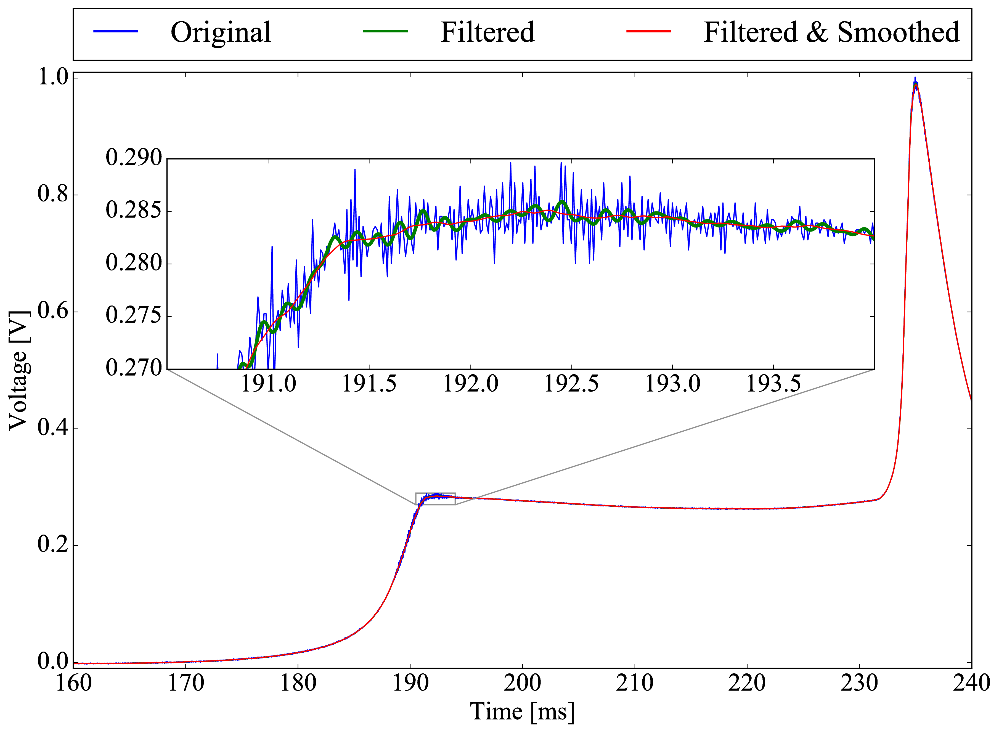
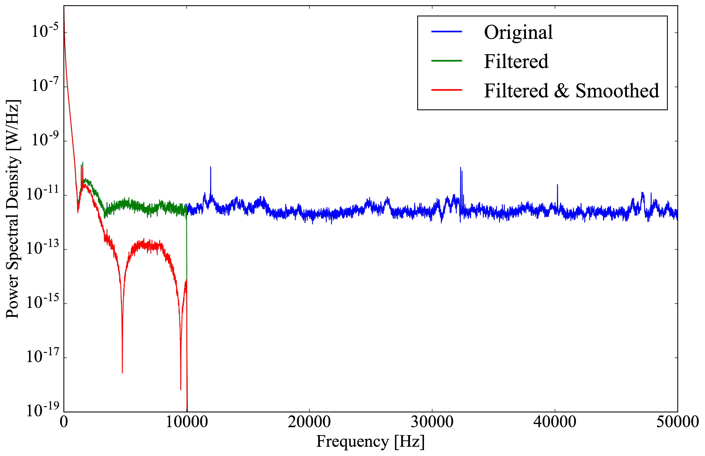
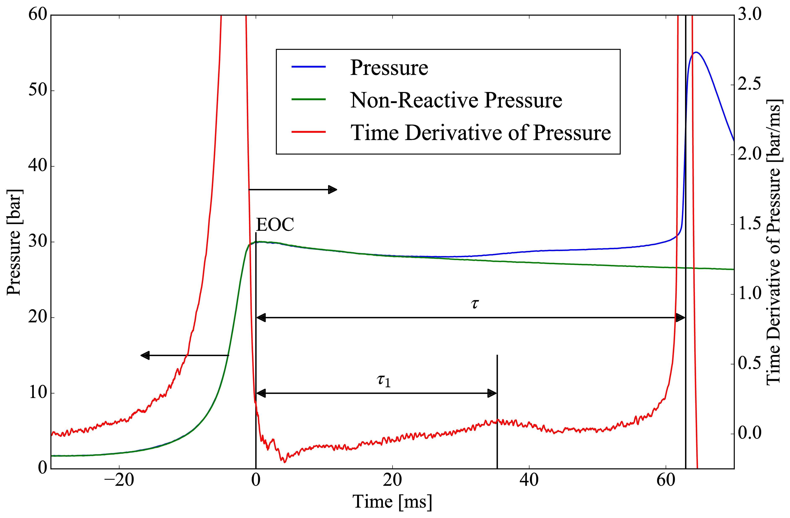
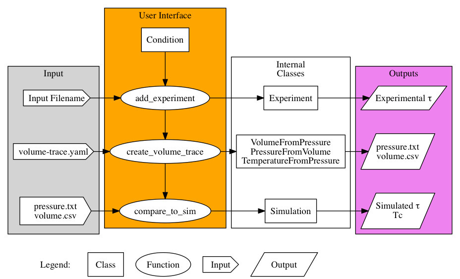
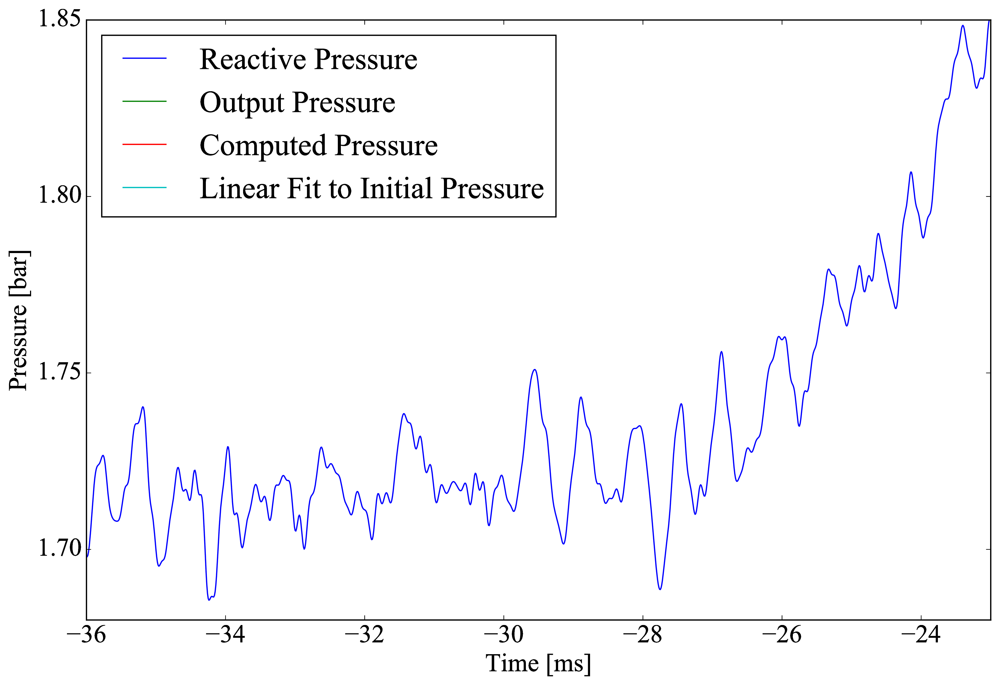
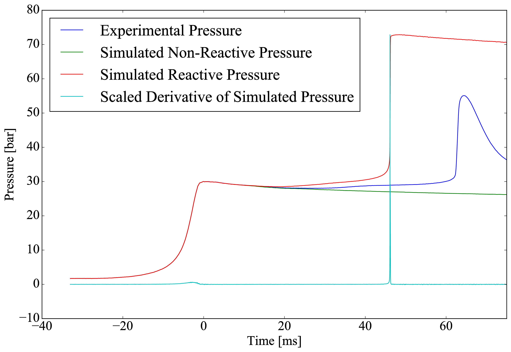

:author: Bryan W. Weber
:email: bryan.w.weber@gmail.com
:institution: Mechanical Engineering Department, University of Connecticut, Storrs, CT 06269

:author: Chih-Jen Sung
:email: chih-jen.sung@uconn.edu
:institution: Mechanical Engineering Department, University of Connecticut, Storrs, CT 06269

:bibliography: SciPy-2016

---------------------------------------------------------------------
UConnRCMPy: Python-based data analysis for Rapid Compression Machines
---------------------------------------------------------------------

.. class:: abstract

    The ignition delay of a fuel/air mixture is an important quantity in designing combustion
    devices, and these data are also used to validate computational kinetic models for combustion.
    One of the typical experimental devices used to measure the ignition delay is called a Rapid
    Compression Machine (RCM). This paper presents UConnRCMPy, an open-source Python package to
    process experimental data from the RCM at the University of Connecticut. Given an experimental
    measurement, UConnRCMPy computes the thermodynamic conditions in the reaction chamber of the RCM
    during an experiment along with the ignition delay. UConnRCMPy relies on several packages from
    the SciPy stack and the broader scientific Python community. UConnRCMPy implements an extensible
    framework, so that alternative experimental data formats can be incorporated easily. In this
    way, UConnRCMPy improves the consistency of RCM data processing and enables reproducible
    analysis of the data.

.. class:: keywords

    rapid compression machine, engineering, kinetic models

Introduction
------------

The world relies heavily on combustion to provide energy in useful and clean forms for human
consumption; in particular, the transportation sector accounts for nearly 30% of the energy use in
the United States and of that, more than 90% is supplied by combustion of fossil fuels
:cite:`MER2016`. Unfortunately, emissions from the combustion of traditional fossil fuels have been
implicated in a host of deleterious effects on human health and the environment :cite:`Avakian2002`
and fluctuations in the price of fossil fuels can have a negative impact on the economy
:cite:`Owen2010`.

Two methods are being considered to reduce the impact of fossil fuel combustion in transportation on
the environment and the economy, namely: 1) development of new fuel sources and 2) development of
new engine technologies.

The challenge for engineers is that it is not straightforward to combine new fuels with newly
designed engines. For instance, the design process of a new engine may become circular: the "best"
alternative fuel should be tested in the "best" engine, but the "best" engine depends on which is
selected as the "best" alternative fuel. One way to short circuit this process is by employing
computer-aided design and modeling of new engines with new fuels to develop advanced engines to be
able to utilize multiple conventional and alternative fuels. The key to this process is the
development of accurate and predictive combustion models.

These models of combustion are typically descriptions of the chemical kinetic pathways the
hydrocarbon fuel and oxidizer undergo as they break down into carbon dioxide and water. There may be
as many as several tens of thousands of pathways in the model for combustion of a particular fuel,
with each pathway requiring several parameters to describe its rate. Therefore, it is important to
thoroughly validate the operation of the model by comparison to experimental data collected over a
wide range of conditions.

One type of data that is particularly relevant for transportation applications is the ignition
delay. The ignition delay is a global combustion property depending on the interaction of many of
the pathways present in the model. There are several methods to measure the ignition delay at
engine-relevant conditions, including shock tubes and rapid compression machines (RCMs).

An RCM is typically designed with one or two pistons that rapidly compress a homogeneous fuel and
oxidizer mixture inside a reaction chamber. After the end of compression (EOC), the piston(s) is
(are) locked in place, creating a constant volume reaction chamber. The primary diagnostic in most
RCM experiments is the pressure measured as a function of time in the reaction chamber. This
pressure trace is then processed to extract the ignition delay.

In this paper, the design and operation of a software package to process the pressure data collected
from RCMs is described. Our package, called UConnRCMPy :cite:`uconnrcmpy`, is designed to enable
reproducible analysis of the data acquired from the RCM at the University of Connecticut (UConn).
Despite the initial focus on data from the UConn RCM, the package is designed to be extensible so
that it can be used for data in different formats while providing a consistent interface to the
user.

First, this paper will introduce the fundamentals of RCM operation and data processing. Then, the
implementation of UConnRCMPy will be described, including the use of many packages from the
scientific Python software ecosystem. Finally, a brief demonstration of the use of UConnRCMPy and
its extensibility will be given.

Background
----------

The RCMs at the University of Connecticut have been described extensively elsewhere
:cite:`Das2012,Mittal2007a`, and will be summarized here for reference. The RCMs use a single piston
that is pneumatically accelerated and hydraulically decelerated. In a typical experiment, the
reaction chamber is first evacuated to an absolute pressure near 1 Torr, measured by a high-accuracy
static pressure transducer. Next, the reactants are filled in to the desired initial pressure
(|P0|), and a low dead volume valve on the reaction chamber is closed. Compression is triggered by a
digital control circuit. After compression, the piston is held in place to create a constant volume
chamber in which reactions proceed. For appropriate combinations of pressure, temperature, and
mixture composition, ignition will occur after some delay period. A single
compression-delay-ignition sequence is referred to as an experiment or a run. Each experiment is
repeated approximately 5 times at the same nominal initial conditions to ensure repeatability of the
data, and this set of experiments is referred to in the following as a condition.

During and after the compression, the pressure is monitored using a dynamic pressure transducer.
The pressure trace is processed to determine the quantities of interest, including
the pressure and temperature at the EOC, |PC| and |TC| respectively, and the ignition delay. The
ignition delay (|tau|) is typically measured at several values of |TC| for a given value of |PC| and
mixture composition; this is referred to in the following as a data set.

RCM Signal Processing Procedure
-------------------------------
Signal measurement
==================

As mentioned previously, the primary diagnostic on the RCM is the reaction chamber pressure,
measured by a dynamic pressure transducer (separate from the static transducer used to measure
|P0|). The dynamic transducer outputs a charge signal that is converted to a voltage signal by a
charge amplifier. This system measures changes in pressure in the reaction chamber (as opposed to
the absolute pressure measured by the static transducer) and as such, has a nominal output of 0 V
prior to the start of compression. In addition, the output range of 0 V to 10 V is set by the
operator to correspond to a particular pressure range by setting a "scale factor". Typical values
for the scale factor range between 10 bar/V and 100 bar/V.

The voltage output from the charge amplifier is digitized by a hardware data acquisition system
(DAQ) and recorded into a plain text file by a LabView Virtual Instrument. The voltage is sampled at
a rate chosen by the operator, typically between 50 kHz and 100 kHz. This provides sufficient
resolution for events on the order of milliseconds; the typical ignition delay measured in this
system approximately ranges from 5 ms to 100 ms.

    Raw voltage trace and the voltage trace after filtering and smoothing from a typical RCM
    experiment. Note that the voltage in the figure varies from 0 V to 1 V because the scale factor
    is 100 bar/V and the maximum pressure for this case is near 100 bar. (a): Close up of the time
    around the EOC, demonstrating the fidelity of the smoothed and filtered signal with the original
    signal. (b): Close up of the time before the start of compression, demonstrating the offset of
    the initial voltage slightly below 0 V. :label:`raw-voltage`

Figure :ref:`raw-voltage` shows a typical voltage trace measured from the RCM at UConn. Several
features are apparent from this figure. First, the compression stroke takes approximately 30 ms to
40 ms, with the EOC used to set the reference time of :math:`t = 0` (the determination of the time
of the EOC will be discussed in due course). Approximately 50% of the pressure rise occurs in the
last 5 ms of compression. Second, there is a slow pressure decrease after the EOC due to heat
transfer from the reactants to the relatively colder chamber walls. Third, after some delay period
there is a spike in the pressure corresponding to rapid heat release due to combustion. Finally, the
signal can be somewhat noisy, and the measured initial voltage may be offset from the nominal 0 V by
a few millivolts.

Filtering and Smoothing
=======================

To produce a useful pressure trace, the voltage signal must be filtered and/or smoothed. Several
algorithms have been considered to smooth the voltage trace, including a simple moving average, a
low-pass filter, and some combination of these two methods. In the current version of UConnRCMPy
:cite:`uconnrcmpy`, the voltage is first filtered using a low-pass filter with a cutoff frequency of
10 kHz. The filter is constructed using the ``firwin`` function from the ``signals`` module of SciPy
:cite:`Jones2001` with the Blackman window :cite:`Blackman1958,Oppenheim1999` and a filter order of
:math:`2^{14}-1`. The cutoff frequency, window type, and filter order were determined empirically,
based on Fig. :ref:`frequency`. Methods to select a cutoff frequency that optimizes the
signal-to-noise ratio are currently being investigated.

    Power spectral density profiles of the original, filtered, and filtered and smoothed signals,
    showing the peaks of noise above 10 kHz. :label:`frequency`

After filtering, the signal is smoothed by a moving average filter with a width of 21 points. It is
desired that the signal remain the same length through this operation, but the convolution operation
used to apply the moving average zero-pads the first and last 10 points. To avoid a bias in the
initial voltage, the first 10 points are set equal to the value of the 11th point; the final 10
points are not important in the rest of the analysis and are ignored. The result of the filtering
and smoothing operations is shown on Fig. :ref:`raw-voltage`.

Offset Correction and Pressure Calculation
==========================================

In general, the voltage trace can be converted to a pressure trace by

.. math::
    :label: pressure-trace

    P(t) = F \cdot \overline{V}(t) + P_0

where :math:`\overline{V}(t)` is the filtered and smoothed voltage trace and :math:`F` is the scale
factor from the charge amplifier. However, as can be seen in Fig. :ref:`raw-voltage`\ b there is a
small offset in the initial voltage relative to the nominal value of 0 V. To correct for this
offset, it can be subtracted from the voltage trace

.. math::
    :label: corrected-pressure-trace

    P(t) = F \cdot \left[\overline{V}(t) - \overline{V}(0)\right] + P_0

where :math:`\overline{V}(0)` is the initial voltage of the filtered and smoothed signal. The result
is a vector of pressure values that must be further processed to determine the time of the EOC and
the ignition delay.

Finding the EOC
===============

There are several methods to determine the EOC of a particular experiment. Since the piston is held
in place at the end of its stroke, the pressure will be a maximum (in the absence of ignition) at
the EOC. Therefore, the EOC can be found either by searching for this maximum value or by
calculating the first derivative of the pressure with respect to time and finding the zero crossing.
As the signal is noisy, even after smoothing, the derivative will tend to increase the noise in the
signal :cite:`Chapra2010` leading to difficulty in specifying the correct zero crossing. On the
other hand, finding the maximum of the pressure in the time prior to ignition is not straightforward
either. In general, the pressure after ignition has occurred will be higher than the pressure at the
EOC. However, we can take advantage of the fact that there is some pressure drop after the EOC to
eliminate the ignition from consideration.

In the current version of UConnRCMPy :cite:`uconnrcmpy`, this is done by searching backwards in time
from the global maximum pressure in the pressure trace (typically, the global maximum pressure due
to ignition) until a minimum in the pressure is reached. Since the precise time of the minimum is
not important for this method, the search is done by comparing the pressure at a given index
:math:`i` to the pressure at point :math:`i-50`, starting with the index of the global maximum
pressure. The comparison is not made to the adjacent point to avoid the influence of noise. If
:math:`P(i) \geq P(i-50)`, the index is decremented and the process is repeated until :math:`P(i) <
P(i-50)`. This value of :math:`i` is approximately at the minimum of pressure prior to ignition, so
the maximum of the pressure in points to the left of the minimum will be the EOC.

This method is generally robust, but it fails when there is no minimum in the pressure between the
EOC and ignition, or the minimum pressure is very close to the EOC pressure. This may be the case
for short ignition delays, on the order of 5 ms or less. In these cases, the comparison offset can
be reduced to improve the granularity of the search; if the method still fails, manual intervention
is necessary to determine the EOC. In either case, the value of the pressure at the EOC, |PC|, is
recorded and the time at the EOC is taken to be :math:`t=0`.

Calculating Ignition Delay
==========================

The ignition delay is determined as the time difference between the EOC and the point of ignition.
There are several definitions of the point of ignition; the most commonly used in RCM experiments is
the inflection point in the pressure trace due to ignition. As before, finding zero crossings of the
second time derivative of the pressure to define the inflection point is difficult due to noise;
however, finding the maximum of the first derivative is trivial, particularly since the time before
and shortly after the EOC can be excluded to avoid the peak in the derivative around the EOC.

In the current version of UConnRCMPy :cite:`uconnrcmpy`, the first derivative of the experimental
pressure trace is computed by a second-order forward differencing method. The derivative is then
smoothed by the moving average algorithm with a width of 151 points. This value for the moving
average window was chosen empirically.

For some conditions, the reactants may undergo two distinct stages of ignition. These cases can be
distinguished by a pair of peaks in the first time derivative of the pressure. For some two-stage
ignition cases, the first-stage pressure rise, and consequently the peak in the derivative, are
relatively weak, making it hard to distinguish the peak due to ignition from the background noise.
This is currently the area requiring the most manual intervention, and one area where significant
improvements can be made by refining the differentiation and filtering/smoothing algorithms. An
experiment that shows two clear peaks in the derivative is shown in Fig. :ref:`ign-delay-def` to
demonstrate the definition of the ignition delays.

    Illustration of the definition of the ignition delay in a two-stage ignition case.
    :label:`ign-delay-def`

Calculating the EOC Temperature
===============================

The final parameter of interest presently is the EOC temperature, |TC|. This temperature is often
used as the reference temperature when reporting ignition delays. In general, it is difficult to
measure the temperature as a function of time in the reaction chamber of the RCM, so methods to
estimate the temperature from the pressure trace are generally used.

The law of conservation of energy written for the ideal gases in the reaction chamber is:

.. math::
    :label: first-law

    c_v \frac{dT}{dt} = -P \frac{dv}{dt} - \sum_k u_k \frac{d Y_k}{dt}

where :math:`c_v` is the specific heat at constant volume of the mixture, :math:`v` is the specific
volume, :math:`u_k` and :math:`Y_k` are the specific internal energy and mass fraction of the
species :math:`k`, and :math:`t` is time. For a constant-area piston, the rate of change of the
volume is equal to the piston velocity. In UConnRCMPy, Eq. :ref:`first-law` is integrated by Cantera
:cite:`cantera`.

In Cantera, intensive thermodynamic information about the system is stored in an instance of the
``Solution`` class. The ``Solution`` classes used in this study model simple, compressible systems
and require two independent properties, plus the composition, to fix the state. The two properties
must be intensive (i.e., not dependent on system size), and are typically chosen from the pressure,
temperature, and density. In addition to evaluating thermodynamic data, Cantera :cite:`cantera`
contains several objects used to model homogeneous reacting systems; the two used in this paper are
a ``Reservoir`` and an ``IdealGasReactor``, which are subclasses of the generic ``Reactor`` class.
The specific ``IdealGasReactor`` class is preferred over the generic ``Reactor`` class in this study
because the energy equation is directly solved in terms of the temperature (i.e., Eq.
:ref:`first-law`) in an ``IdealGasReactor``. A ``Solution`` object is installed in each ``Reactor``
subclass instance to manage the state information and evaluate thermodynamic properties. The
difference between the ``Reservoir`` and the ``IdealGasReactor`` is simply that the state (i.e., the
pressure, temperature, and chemical composition) of the ``Solution`` in a ``Reservoir`` is fixed.

Integrating Eq. :ref:`first-law` requires knowledge of the volume of the reaction chamber as a
function of time. To calculate the volume as a function of time, it is assumed that there is a core
of gas in the reaction chamber that undergoes an isentropic compression :cite:`Lee1998`.
Furthermore, it is assumed that there is negligible reactant consumption during the compression
stroke.

Constructing the volume trace is triggered by the user by running the ``create_volume_trace`` method
that implements the following procedure. A Cantera ``Solution`` object is initialized at the initial
temperature, pressure, and composition of the reaction chamber. After initialization the initial
mass-specific entropy (|s0|) and density (|rho0|) are recorded. The initial volume is arbitrarily
taken to be :math:`V_0=1.0\,\text{m}^3`. The initial volume used in constructing the volume trace is
arbitrary provided that the same value for the volume is used for the initial volume in the
``Reactor``-based simulations described below. However, extensive quantities such as the total heat
release during ignition cannot be compared to experimental values.

The measured pressure at each point in the pressure trace (:math:`P_i`) is used with the previously
recorded initial entropy (|s0|) to set the state of the ``Solution`` object sequentially. At each
point, the volume is computed by applying the ideal gas law:

.. math::
    :label: ideal-gas-law

    V_i = V_0 \frac{\rho_0}{\rho_i}

where :math:`\rho_i` is the density at each point computed by the Cantera ``Solution``. This
procedure effects a constant composition isentropic compression process.

Once the volume trace has been generated, it can be utilized in the ``IdealGasReactor`` and the
solution of Eq. :ref:`first-law` by installing an instance of the ``Wall`` class. In Cantera
:cite:`cantera`, ``Wall``\ s have several uses, including allowing heat transfer into or out of the
``Reactor``, allowing heterogeneous reactions on the surface of the ``Wall``, or causing the volume
of the ``Reactor`` to vary. In this study, only the last function is used (i.e., the reaction
chamber is adiabatic and homogeneous). ``Wall``\ s must be installed between instances of
``Reactor``\ s, so in UConnRCMPy a ``Wall`` is installed between the ``IdealGasReactor`` that
represents the reaction chamber and an instance of the ``Reservoir`` class. By specifying the
velocity of the ``Wall`` using the volume trace computed previously, the ``IdealGasReactor`` will
proceed through the same states as the reaction chamber in the experiment.

The velocity of the ``Wall`` is specified by using an instance of the ``VolumeProfile`` class from
the CanSen software :cite:`cansen`. This instance is passed to the ``Func1`` class in Cantera, which
wraps the ``VolumeProfile`` in a way that the C++ solvers in Cantera can use. The ``VolumeProfile``
class computes the first forward difference of the volume as a function of time and returns the
appropriate velocity when passed a time.

The ``IdealGasReactor`` is installed into an instance of ``ReactorNet`` from Cantera
:cite:`cantera`. The ``ReactorNet`` implements the interface to the solver CVODES. CVODES is an
adaptive-time-stepping solver, distributed as part of the SUNDIALS suite :cite:`Hindmarsh2005`. As
the solver steps towards the end time of the simulation, the state of the system is stored on each
integrator time step, producing simulated pressure, volume, and temperature traces. Finally, the EOC
temperature is recorded as the simulated temperature at the EOC.

Two simulations can be triggered by the user that utilize this procedure. In the first, the
multiplier for all the reaction rates is set to zero, to simulate a constant composition
(non-reactive) process. In the second, the reactions are allowed to proceed as normal. Only the
non-reactive simulation is necessary to determine |TC|.

When a reactive simulation is conducted, the user must compare the temperature traces from the two
simulations to verify that the inclusion of the reactions does not change |TC|, validating the
assumption of adiabatic, constant composition compression. Although the value of |TC| is the same,
when conducting simulations to compare a kinetic model to experimental results, it is important to
include the species equations in the solution of Eq. :ref:`first-law` due to the buildup of a pool
of radicals that affects the processes after the EOC :cite:`Mittal2008`, although it does not affect
the computation of |TC|.

Simulating Post-EOC Processes
=============================

As can be seen in Fig. :ref:`ign-delay-def`, the pressure decreases after the EOC due to heat
transfer from the higher temperature reactants to the reaction chamber walls. This process is
specific to the machine that carried out the experiments, and to the conditions under which the
experiment was conducted. Therefore, the rate of pressure decrease should be modeled and included
in simulations that compare predicted ignition delays to the experimental values.

To conduct this modeling, a non-reactive experiment is conducted, where |O2| in the oxidizer is
replaced with |N2| to maintain a similar specific heat ratio but suppress the oxidation reactions
that lead to ignition. The pressure trace from this non-reactive experiment should closely match
that from the reactive experiment during the compression stroke, further validating the assumption
of adiabatic, constant composition compression. Furthermore, the non-reactive pressure trace should
closely match the reactive pressure trace after the EOC until exothermic reactions cause the
pressure in the reactive experiment to begin to increase.

To apply the effect of the post-compression heat loss into the simulations, the reaction chamber is
modeled as undergoing an adiabatic volume expansion. Since the post compression time is modeled as
an isentropic expansion, the same procedure is used as in the computation of |TC| to compute a
volume trace for the post-EOC time. The only difference is that the non-reactive pressure trace is
used after the EOC instead of the reactive pressure trace. Once the volume trace is generated, it
can be applied to a simulation by concatenating the volume trace of the compression stroke and the
post-EOC volume trace together and following the procedure outlined in `Calculating the EOC
Temperature`_. For consistency, the ignition delay in a reactive simulation is defined in the same
manner as in the reactive experiments, as the maxima of the time derivative of the pressure trace.
This procedure has been validated experimentally by measuring the temperature in the reaction
chamber during and after the compression stroke. The temperature of the reactants was found to be
within :math:`\pm`\ 5 K of the simulated temperature :cite:`Das2012a,Uddi2012`.

Implementation of UConnRCMPy
----------------------------

UConnRCMPy is constructed in a hierarchical manner, with different classes representing different
levels of the data. The lowest level representation is the ``VoltageTrace`` that contains the raw
voltage signal and timing recorded by the DAQ, as well as the filtered and smoothed voltage traces.
The filtering and smoothing algorithms are implemented as separate methods so they can be reused
in other situations and are run automatically when the ``VoltageTrace`` is initialized.

One step up from the ``VoltageTrace`` is the ``ExperimentalPressureTrace`` class. This class
consumes a ``VoltageTrace`` and processes it into a pressure trace, given the multiplication factor
from the charge amplifier and the initial pressure. This class also contains methods to compute the
derivative of the experimental pressure trace, as discussed in `Calculating Ignition Delay`_.

All of the information about a particular experimental run is stored in the ``Experiment`` class. When
initialized, the ``Experiment`` expects an instance of the ``pathlib.Path`` class; if none is
provided, it prompts the user to enter a file name that is expected to be in the current working
directory. The file name should point to a tab-delimited plain text file that contains the voltage
trace recorded by LabView from one experimental run. Then UConnRCMPy creates an instance of
``VoltageTrace``, followed by an instance of ``ExperimentalPressureTrace``. The pressure trace from
the latter is processed to extract the ignition delay(s).

The main user interface to UConnRCMPy is through the ``Condition`` class, the highest level of data
representation. The ``Condition`` class contains all of the information pertaining to the
experiments at a given condition. The intended use of this class is in an interactive Python
interpreter (the author prefers the Jupyter Notebook with an IPython kernel :cite:`Perez2007`). Due
to the dependence on the ``pathlib`` library, UConnRCMPy must be used with Python 3.4 or greater.

To begin, the user creates an instance of the ``Condition`` class and conducts the first reactive
experimental run at a given condition. When the run is finished (each run takes approximately 1
minute), the user adds the experiment to the ``Condition`` instance using the ``add_experiment``
method. This method creates an instance of class ``Experiment`` for each experiment passed in. As
each experiment is processed by UConnRCMPy, the information from that run is added to the system
clipboard for pasting into some spreadsheet software. In the current version, the information copied
is the time of day of the experiment, the initial pressure, the initial temperature, the pressure at
the EOC, the overall and first stage ignition delays, an estimate of the EOC temperature, and some
information about the compression ratio of the reactor. Finally, each experiment is added to a
dictionary keyed by the file name of the text file storing the experimental voltage trace.

Two plots are optionally created each time a reactive experiment is added to the ``Condition``
(plotting is controlled by passing a boolean argument ``plotting`` to the ``Condition`` when it is
initialized). The plots use Matplotlib :cite:`Hunter2007`. The first plot is a cumulative plot of
the pressure traces of each of the experiments that are added to the ``Condition``. The second plot
is an individual plot for each experiment showing the pressure trace and the time derivative of the
pressure trace.

In general, for a given condition, the user will conduct and process all of the reactive experiments
before conducting any non-reactive experiments. Then, the user chooses one of the reactive
experiments as the reference experiment for the condition (i.e., the one whose ignition delay(s) and
|TC| are reported). The reference experiment is defined as the experimental run whose overall
ignition delay is closest to the mean overall ignition delay among the experiments at a given
condition. To select the reference experiment, the user puts the file name of the reference experiment
into a YAML format file called ``volume-trace.yaml`` with the key ``reacfile`` as shown below in the
`Usage Example`_ section.

Once the reference reactive experiment is selected, the user runs non-reactive experiments at the
same initial conditions as the reference experiment. The user adds non-reactive experiments to the
``Condition`` by the same ``add_experiment`` method and UConnRCMPy automatically determines whether
the experiment is reactive or non-reactive. Adding a non-reactive experiment creates a figure
comparing the pressure trace of the non-reactive experiment with the reference reactive experiment.
If the user adds a non-reactive experiment before creating the ``volume-trace.yaml`` file, or if the
file referenced in the ``reacfile`` key is not present in the current working directory, UConnRCMPy
throws a ``FileNotFound`` exception.

When the user is satisfied with the agreement of the reactive and non-reactive pressure traces, they
choose a reference non-reactive experiment and add the file name of that file into the
``volume-trace.yaml`` file. Then, the user triggers creation of the volume trace by running the
``create_volume_trace`` method of the ``Condition``. This function converts the reactive pressure
trace (before the EOC) and the non-reactive pressure trace (after the EOC) to a volume trace.

The ``create_volume_trace`` function relies on a YAML file located in the current working directory
called ``volume-trace.yaml``. This file must contain several parameters necessary to reproduce the
analysis. These parameters must be specified by the user, and include the compression time, the file
names of the reference reactive and non-reactive experiments, and the end times for the reactive and
non-reactive experiments. The reactive end time determines the length of the output pressure trace,
while the non-reactive end time determines the length of the volume trace. The length of the volume
trace is also determined by the compression time, which should be set to a time such that the
starting point is before the beginning of the compression. All three times should be specified in
ms.

Two optional parameters can also be specified in ``volume-trace.yaml``. These are offset parameters
used to control the precise point where the switch from the reactive pressure trace to the
non-reactive pressure trace occurs in the volume trace. These parameters may be necessary if the
determination of the EOC does not result in aligned compression strokes for the reactive and
non-reactive experiments, but they are not generally necessary.

The actual computation of the volume trace (as described in `Calculating the EOC Temperature`_) is
done by the ``VolumeFromPressure`` class. This class expects a pressure trace, initial temperature,
and initial volume. First, the volume trace of the reactive (pre-EOC) portion is generated using the
pre-EOC pressure trace, the experimental initial temperature, and an initial volume of
:math:`V_0=1.0\,\text{m}^3`, as discussed in `Calculating the EOC Temperature`_. A temperature trace
is also constructed for the pre-EOC pressure trace using the ``TemperatureFromPressure`` class. The
last value of this temperature trace provides an estimate for |TC|; although this value is not the
reported value, it typically differs by :math:`\pm`\ 2 K from the reported value due to slight
differences in the choice of the compression time.

For the non-reactive (post-EOC) volume trace, the initial temperature is estimated as the final
value of the temperature trace constructed for the pre-EOC period. Furthermore, the initial volume
of the non-reactive (post-EOC) volume trace is taken to be the final value of the pre-EOC volume
trace, so that although there may be small mismatches in |PC|, the volume trace will be consistent.

After generation, ``create_volume_trace`` writes the volume trace out to a CSV file so that the
volume trace can be used in other software. The reactive pressure trace is also written to a
tab-separated file. Before writing, the volume and pressure traces are both downsampled by a factor
of 5. This reduces the computational time of a simulation and does not have any effect on the
simulated results. ``create_volume_trace`` also generates a figure that plots the complete reactive
pressure trace, a non-reactive pressure trace generated from the volume trace using the
``PressureFromVolume`` class, and a linear fit to the constant pressure period prior to the start of
compression. This linear fit aids in determining a suitable compression time. Finally, the value of
the pressure at the beginning of compression is put on the system clipboard to be pasted into a
spreadsheet to record the |P0| used for simulations. This may differ slightly from the |P0| read
from the static transducer due to noise in the signal.

The final step is to use the volume trace in a simulation to determine |TC|. To begin the
simulations, the user calls the ``compare_to_sim`` method of the ``Condition``. This function takes
two optional arguments, ``run_reactive`` and ``run_nonreactive``, both of which are booleans. These
determine which type of simulation should be conducted; by default, ``run_reactive`` is ``False``
and ``run_nonreactive`` is ``True`` because the reactive simulations may take substantial time.
There is no restriction on combinations of values for the arguments; either or both may be ``True``
or ``False``. The ``compare_to_sim`` method relies on the ``run_simulation`` method, which in turn
adds instances of the class ``Simulation`` to the ``Condition`` instance. If either type of
simulation has already been added to the ``Condition`` instance, the user is asked whether they
would like to overwrite the existing simulation.

The ``Simulation`` class sets up the simulation in Cantera and controls the running simulation.
Importantly, the maximum time step is set to be the time step used in the volume trace, so that the
simulation does not take steps larger than the resolution of the velocity. Larger time steps may
result in incorrect calculation of the state if the velocity is not properly applied to the reactor.
As the simulation runs, the solution time, temperature, pressure, and simulated volume are appended
to lists that are converted to NumPy arrays :cite:`vanderWalt2011` when the simulation finishes.
Once the simulation finishes, the derivative is computed using second order Lagrange polynomials, as
suggested by Chapra and Canale :cite:`Chapra2010` because the time step is not constant in the
simulation. Finally, |TC| and the overall ignition delay (if a reactive simulation was conducted)
are sent to the system clipboard to be pasted into a spreadsheet. The first stage ignition delay
must be found manually because determining peaks in the derivative is currently unreliable, as
mentioned in `Calculating Ignition Delay`_ for experiments.

The ``compare_to_sim`` method also plots the experimental pressure trace and any of the simulated
pressure traces that have been generated. If the simulated reactive pressure trace is generated,
the time derivative of the pressure is also plotted, where the derivative is scaled by the maximum
pressure in the reactive simulation.

    Flowchart of information in UConnRCMPy. :label:`flowchart`

The general flow of the user interaction with UConnRCMPy is shown in Fig. :ref:`flowchart`. The
Inputs are required input from the user, while the User Interface are classes and functions called
by the user during processing.

UConnRCMPy also offers a convenience function that processes a folder of experimental data files.
This function, called ``process_folder``, takes two arguments, the ``Path`` to process and a
boolean determining whether plots should be drawn. This function skips the machinery of a
``Condition`` instance, instead directly creating ``Experiment`` instances for each data file it
finds. The purpose of this function is to automatically calculate the ignition delays and |PC| for
a group of experiments; after this processing, the user should create a separate ``Condition`` to
perform any other processing (volume trace, etc.).

UConnRCMPy is documented using standard Python docstrings for functions and classes. The
documentation is converted to HTML files by the Sphinx documentation generator :cite:`Brandl2016`.
The format of the docstrings conforms to the NumPy docstring format so that the autodoc module of
Sphinx can be used. The documentation is available on the web at
http://bryanwweber.github.io/UConnRCMPy/.

Usage Example
-------------

In the following, two examples of using UConnRCMPy are given, first with the standard interface and
second utilizing a slightly modified interface corresponding to a different data format. Both
examples assume the user is running in a Jupyter Notebook with an IPython kernel.

Standard Interface
==================

These experiments were conducted with mixtures of propane, oxygen, and nitrogen :cite:`Dames2016`.
The CTI file necessary to run this example can be found in the Supplementary Material of the work by
Dames et al. :cite:`Dames2016`. The condition in this example is for a fuel rich mixture, with a
target |PC| of 30 bar. The user creates the ``Condition``, then conducts a reactive experiment with
the RCM and adds the experiment to the ``Condition``. This process is repeated 5 times to ensure
repeatable data is obtained.

.. code:: python

    from uconnrcmpy import Condition
    from pathlib import Path
    %matplotlib

    cond_00_in_02_mm = Condition()
    # Conduct reactive experiment #1 on the RCM
    cond_00_in_02_mm.add_experiment(Path(
        '00_in_02_mm_373K-1285t-100x-19-Jul-15-1620.txt'))
    # Conduct reactive experiment #2 on the RCM
    cond_00_in_02_mm.add_experiment(Path(
        '00_in_02_mm_373K-1282t-100x-19-Jul-15-1626.txt'))
    # Conduct reactive experiment #3 on the RCM
    cond_00_in_02_mm.add_experiment(Path(
        '00_in_02_mm_373K-1282t-100x-19-Jul-15-1633.txt'))
    # Conduct reactive experiment #4 on the RCM
    cond_00_in_02_mm.add_experiment(Path(
        '00_in_02_mm_373K-1282t-100x-19-Jul-15-1640.txt'))
    # Conduct reactive experiment #5 on the RCM
    cond_00_in_02_mm.add_experiment(Path(
        '00_in_02_mm_373K-1282t-100x-19-Jul-15-1646.txt'))

This sequence generates a figure showing all of the experiments together, as shown in Fig.
:ref:`all-runs` (the axis limits have been adjusted from the default). It also generates one figure
per experiment. The figures showing each experiment look similar to Fig. :ref:`ign-delay-def`, but
the non-reactive trace is not plotted and the EOC and ignition delays are not labeled.

.. figure:: figures/all-runs.png

    All of the runs at the example experimental condition. The legend shows the date and time the
    experiment was conducted. :label:`all-runs`

By examining the ignition delays copied to a spreadsheet for the runs at this condition, the user
determines that the reference experiment is the run that took place at 16:33. The user adds the
filename of this run to the ``volume-trace.yaml`` file:

.. code:: yaml

    reacfile: >
      00_in_02_mm_373K-1282t-100x-19-Jul-15-1633.txt

and the user conducts the first non-reactive experiment and adds it to the ``Condition``:

.. code:: python

    # Conduct non-reactive experiment #1 on the RCM
    cond_00_in_02_mm.add_experiment(Path(
        'NR_00_in_02_mm_373K-1278t-100x-19-Jul-15-1652.txt'))

UConnRCMPy determines that this is a non-reactive experiment and generates a new figure. This figure
compares the current non-reactive case with the reference reactive case as specified in
``volume-trace.yaml``. For this particular example, the pressure traces are shown in Fig.
:ref:`ign-delay-def`. In this case, the non-reactive pressure agrees very well with the reactive
pressure and no further experiments are necessary; in principle, any number of non-reactive
experiments can be conducted and added to the figure for comparison. Since there is good agreement
between the non-reactive and reactive pressure traces, the user adds the non-reactive reference file
name to ``volume-trace.yaml``.

.. code:: yaml

    reacfile: >
      00_in_02_mm_373K-1282t-100x-19-Jul-15-1633.txt
    nonrfile: >
      NR_00_in_02_mm_373K-1278t-100x-19-Jul-15-1652.txt

Then, the user specifies the rest of the parameters in ``volume-trace.yaml``. ``comptime`` is
usually specified by guess-and-check after comparison with the figure, ``reacend`` is typically
chosen to be shortly after the main pressure peak due to ignition, and ``nonrend`` is typically
chosen to be 400 ms.

.. code:: yaml

    reacfile: >
      00_in_02_mm_373K-1282t-100x-19-Jul-15-1633.txt
    nonrfile: >
      NR_00_in_02_mm_373K-1278t-100x-19-Jul-15-1652.txt
    comptime: 33
    nonrend: 400
    reacend: 80

It is often convenient to use a YAML library to dump the ``volume-trace.yaml`` file from the
interpreter, instead of having a text editor open. In either case, once ``volume-trace.yaml`` is
updated, ``create_volume_trace`` can be run. As mentioned previously, ``comptime`` is determined by
comparison with the fit to the initial pressure, as shown in Fig. :ref:`pressure-comparison`. In
this case, the compression has clearly started at approximately :math:`t > -0.028\,\text{s}`. The
time prior to that where the pressure appears to stabilize around the initial pressure is
approximately :math:`t = -0.033\,\text{s}`, giving a compression time of 33 ms.

    Comparison of the reactive pressure trace, the pressure trace output to the text file, the
    pressure trace computed from the volume trace, and the linear fit to the initial pressure
    demonstrating the choice of compression time. The green line for Output Pressure follows the red
    line for Computed Pressure exactly, as expected, and so is not shown.
    :label:`pressure-comparison`

The final step is to conduct the simulations to calculate |TC| and the simulated ignition delay.
This is done by the user by running the ``compare_to_sim`` function, which places the calculated
values of |TC| and the ignition delay into the system clipboard (provided that both the non-reactive
and reactive simulations are conducted). The plot generated by this method is shown in Fig.
:ref:`sim-comp`.

.. code:: python

    cond_00_in_02_mm.compare_to_sim(
        run_reactive=True,
        run_nonreactive=True,
    )

    Comparison of the experimental and simulated pressure traces, along with the time derivative
    of the simulated pressure. :label:`sim-comp`

Modified Interface
==================

As mentioned previously, it is also possible to replace parts of the processing interface by using
the features of Python to overload class methods. Due to the modular nature of UConnRCMPy, small
parts of the interface can be replaced without sacrificing consistent analysis for the critical
parts of the code, such as computing the ignition delay. For instance, ongoing work involves
processing RCM data collected by several operators of the RCM. Each user has their own file naming
strategy that must be parsed for information about the experiment. To process this "alternate" data
format, two new classes called ``AltCondition`` and ``AltExperiment`` are created that inherit from
the ``Condition`` and ``Experiment`` classes, respectively. The ``AltCondition`` class only needs to
overload the ``add_experiment`` method, to create an ``AltExperiment``, instead of a regular
``Experiment``.

.. code:: python

    class AltCondition(Condition):
        def add_experiment(self, file_name=None):
            exp = AltExperiment(file_name)
            # Omit the plotting code...

Then, the ``AltExperiment`` overloads the ``parse_file_name`` method of the ``Experiment`` class to
parse the alternate format. The user must make sure the new ``parse_file_name`` method returns the
expected values as defined in the docstring for the original ``parse_file_name`` method, or else
overload other methods that consume the file name information.

.. code:: python

    class AltExperiment(Experiment):
        def parse_file_name(self, file_path):
            # Parse the file name for information...
            return file_name_information

In this way, consistent definitions for important research quantities can be used, while providing
flexibility in the data format and naming conventions.

Conclusions and Future Work
---------------------------

UConnRCMPy provides a framework to enable consistent analysis of RCM data. Because it is open source
and extensible, UConnRCMPy can help to ensure that RCM data in the community can be analyzed in a
reproducible manner; in addition, it can be easily modified and used for data in any format. In this
sense, UConnRCMPy can be used more generally to process any RCM experiments where the ignition delay
is the primary output. Future plans for UConnRCMPy include the development of a robust test suite to
prevent regressions and document correct usage of the framework, as well as the development of a
method to determine the optimal cutoff frequency in the filtering algorithm.

Acknowledgements
----------------

This material is based on paper supported by the National Science Foundation under Grant No.
CBET-1402231.

.. |TC| replace:: :math:`T_C`
.. |PC| replace:: :math:`P_C`
.. |O2| replace:: O\ :sub:`2`
.. |N2| replace:: N\ :sub:`2`
.. |P0| replace:: :math:`P_0`
.. |T0| replace:: :math:`T_0`
.. |gamma| replace:: :math:`\gamma`
.. |tau| replace:: :math:`\tau`
.. |s0| replace:: :math:`s_0`
.. |rho0| replace:: :math:`\rho_0`
