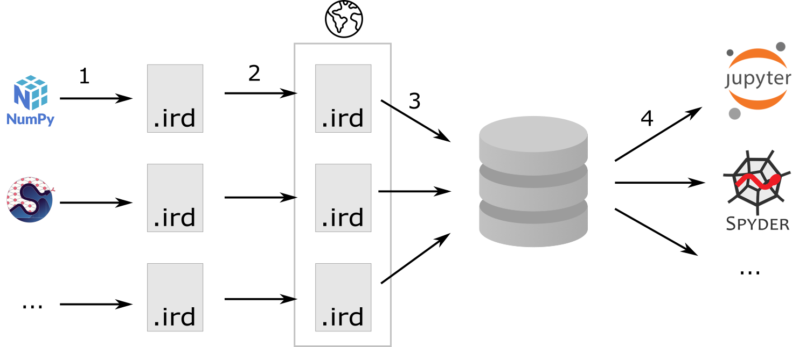

:author: Matthias Bussonnier
:email: bussonniermatthias@gmail.com
:institution: QuanSight, Inc
:institution: Digital Ours Lab, SARL.
:orcid: 0000-0002-7636-8632
:corresponding:
:author: Camille Carvalho
:email: 
:institution: University of California Merced, Merced, CA, USA
:institution: Univ Lyon, INSA Lyon, UJM, UCBL, ECL, CNRS UMR 5208, ICJ, F-69621, France
:orcid: 0000-0002-8426-549X

====================================================================
Papyri: Better documentation for the Scientific Ecosystem in Jupyter
====================================================================

.. class:: abstract

   We present here the idea behind Papyri, a framework we are developing to
   provide a better documentation experience for the scientific ecosystem. In
   particular, we wish to provide a documentation browser from within Jupyter or
   other IDEs and Python editors that gives a unified experience, cross library
   navigation search and indexing. By decoupling documentation generation from
   rendering we hope this can help address some of the documentation
   accessibility concerns, and allow customisation based on users' preferences. 
   

.. class:: keywords

   Documentation, Jupyter, ecosystem, accessibility

Introduction
============

Over the past decades, the Python ecosystem has grown rapidly, and one of the
last bastion where some of the proprietary competition tools shine is integrated
documentation. Indeed, open-source libraries are usually developed in
distributed settings that can make it hard to develop coherent and integrated
systems. 

While a number of tools and documentations exists (and improvements are made
everyday), most efforts attempt to build documentation in an isolated way,
inherently creating a heterogeneous framework. The consequences are twofolds:
(i) it becomes difficult for newcomers to grasp the tools properly, (ii) there
is a lack of cohesion and unified framework as library authors make their proper
choices and must maintain build scripts or services.

Many users, colleagues, and members of the community have been frustrated with
the documentation experience in the Python ecosystem. Given a library, who
hasn't struggle to find the "official" website for the documentation ? Often,
users stumble across an old documentation version that is better ranked in their
favorite search engine, and this impacts less experienced users' learning
greatly.

The experience on users' local machine is affected by limited documentation
rendering. Indeed, while the inspector in many Integrated Development
Environments (IDEs) provides some documentation, users do not get access to
the narrative, or full documentation gallery. For Command Line Interface (CLI)
users, documentation is often displayed as raw source where no navigation is
possible. On the maintainers' side, the final documentation rendering is less a
priority. Rather, maintainers should aim at making users gain from improvement
in the rendering without having to rebuild all the docs.

Efforts such as conda-forge [CFRG]_ have shown that concerted efforts can
give a much better experience to end-users, and in today's world where sharing
libraries source on code platforms, continuous integration, and many other tools
is ubiquitous, we believe a better documentation framework for many of the
libraries of the scientific Python should be available.

Thus, against all advice we received and based on our own experience, we have decided to
rebuild an *opinionated* documentation framework, from scratch, and with minimal
dependencies: *Papyri*. Papyri focuses on building an intermediate
documentation representation format, that lets us decouple building, and
rendering the docs. This highly simplifies many operations and gives us access
to many desired features that were not available up to now.

In what follows we provide the framework in which Papyri has been created and
present its objectives (Context and goals), we describe the Papyri features
(format, installation, and usage), then present its current implementation. We
end this paper with comments on current challenges and future work.

1) Context and objectives
=========================

Through out the paper, we will draw several comparisons between documentation
building and compiled languages. Also, we will borrow and adapt commonly used
terminology. In particular, similarities with "ahead-of-time" (AOT) [AOT]_,
"just-in-time"" (JIT) [JIT]_, intermediate representation (IR) [IR]_, link-time
optimization (LTO) [LTO]_, static vs dynamic linking will be highlighted. This
allows to clarify the presentation of the underlying architecture, however there
is no requirement to be familiar with the above to understand the concepts
underneath Papyri. In that context, we wish to discuss documentation building as
a process from a source-code meant for a machine to a final output targeting the
flesh and blood machine between the keyboard and the chair. 

1) Current tools and limitations
--------------------------------

In the scientific Python ecosystem, it is well known that Docutils [docutils]_
and Sphinx [sphinx]_ are major cornerstones for publishing html documentation
for Python, and are used by all the libraries in this ecosystem. While a few
alternatives exist, most tools and services have some internal knowledge of
Sphinx. For instance, `Read the Docs` [RTD]_ provides a specific Sphinx theme
[RTD-theme]_ users can opt-in to, `Jupyter-book` is built on top of Sphinx, and
`MyST` parser [MYST]_ (which is made to allow markdown in documentation) 
targets Sphinx as a backend, to name a few. All of the above provide an
"ahead-of-time" documentation compilation and rendering, which is slow and
computationally intensive. When a project needs its specific plugins, extensions
and configurations to properly build (which is almost always the case), it is
relatively difficult to build documentation for a single object (like a single
function, module or class). This makes AOT tools difficult to use for
interactive exploration. One can then consider a JIT approach, as done
for `Docrepr` (integrated both in `Jupyter` and `Spyder`). However in that case,
interactive documentation lacks inline plots, crosslinks, indexing, search and
many custom directives.

Some of the above limitations are inherent to the design of documentation build
tools that were intended for a separate documentation construction. While Sphinx does
provide features like `intersphinx`, link resolutions are done at documentation
building phase. Thus, this is inherently unidirectional, and can easily get broken.
To illustrate this, we consider `NumPy` and `SciPy`, two extremely close
libraries. In order to obtain proper cross-linked documentation, one is required to perform at least five
steps:

- build NumPy documentation

- publish NumPy ``object.inv`` file. 

- build SciPy documentation using NumPy ``obj.inv`` file.

- publish SciPy ``object.inv`` file
  
- rebuild NumPy docs to make use of SciPy's ``obj.inv``

Only then can both SciPy's and NumPy's documentation refer to each other. As one can expect, crosslinks break everytime a new version of a library is published [#]_. Pre-produced html in IDEs and other tools are then prone to error and difficult to maintain. This also raises security issues: some institutions become reluctant to use tools like `Docrepr` or viewing pre-produced html. 

.. [#] `ipython/ipython#12210 <https://github.com/ipython/ipython/pull/12210>`_, `numpy/numpy#21016 <https://github.com/numpy/numpy/pull/21016>`_, `& #29073 <https://github.com/numpy/numpy/pull/20973>`_

2) Docstrings format
--------------------

The `Numpydoc` format is ubiquitous among the scientific ecosystem [NPDOC]_. It
is loosely based on RST syntax, and despite supporting full rst syntax,
docstrings rarely contain full-featured directive. Maintainers are confronted to the following dilemma:

- keep the docstrings simple. This means mostly text-based docstrings with few directive for efficient readability. The end-user may be exposed to raw docstring, there is no on-the-fly directive interpretation. This is the case for tools such as IPython and Jupyter. 

- write an extensive docstring. This includes references, and directive that
  potentially creates graphics, tables and more, allowing an enriched end-user experience. However this may be computationally intensive, and executing code to view docs could be a security risk.

Other factors impact this choice: (i) users, (ii) format, (iii) runtime. IDE users or non-Terminal users motivate to push for extensive docstrings, and tools like `Docrepr` can mitigate this problem. However, users are often exposed to raw docstrings (see for example the discussion `SymPy
<https://github.com/sympy/sympy/issues/14964>`_ on how should equations be
represented in docstrings), and Fig :ref:`oldnew`. In terms of format, markdown is appealing, however inconsistencies in the rendering will be created between libraries. Finally, some libraries can dynamically modify their docstring at runtime. While this avoids using directives, it ends up being more expensive (runtime costs, complex maintenance, and contribution costs).

.. figure:: scipy-dpss-old-new.png

   The following screenshot shows current help for ``scipy.signal.dpss`` as
   currently accessible on the left, as shown by Papyri for Jupyterlab
   extension on the right. An extended version of the right pannel is displayed in
   Fig :ref:`jlab`. :label:`oldnew`

3) Objectives of the project
----------------------------

We now layout the objectives of the Papyri documentation framework. 
Let us emphasize that the project is in no way intended to replace or cover many features included in well established documentation tools such as Sphinx or Jupyter-book.
Those projects are extremely flexible and fit the need of their users. The Papyri project addresses specific documentation challenges (mentioned above), we present below what is (and what is not) the scope of work.

a) Not a generic (customisable) website builder
~~~~~~~~~~~~~~~~~~~~~~~~~~~~~~~~~~~~~~~~~~~~~~~

When authors want or need complete control of the output and wide
personalisation options, or branding, then Papyri is likely not the project to look
at. That is to say single-project websites where appearance, layout, domain need to be
controlled by the author is not part of the objectives.

b) A uniform documentation structure and syntax
~~~~~~~~~~~~~~~~~~~~~~~~~~~~~~~~~~~~~~~~~~~~~~~

The Papyri project prescribes stricter requirements in terms of format and structure compared to other tools such as Docutils and Sphinx. When possible, the documentation follows the Diátaxis Framework [DT]_. This provides a uniform documentation setup and syntax, simplifying contributions to the project and easing error catching at compile time. 
Such strict environment is qualitatively supported by a number of documentation fixes done upstream during the development stage of the project [#]_.
Since Papyri is not fully-customisable, users who are already using documentation tools such as Sphinx, mkdocs [mkdocs]_ and others should expect their project to require minor modifications to work with Papyri. 

.. [#] Tests have been performed on `NumPy <https://github.com/numpy/numpy/pulls?q=is%3Apr+is%3Aclosed+author%3ACarreau>`_, `SciPy <https://github.com/scipy/scipy/pulls?q=is%3Apr+is%3Aclosed+author%3ACarreau>`_

c) Accessibility and user proficiency
~~~~~~~~~~~~~~~~~~~~~~~~~~~~~~~~~~~~~

Accessibility is a top priority of the project. To that aim, items are associated to semantic meaning as much as possible, and documentation rendering is separated from documentation building phase. That way, accessibility features such as high contract themes (for better text-to-speech (TTS) raw data), early example highlights (for newcomers) and type annotation (for advanced users) can be quickly available. With the uniform documentation structure, this provides a coherent experience where users become more comfortable to find information (and in a single location) (see Fig :ref:'oldnew').

d) Simplicity, speed, and independence
~~~~~~~~~~~~~~~~~~~~~~~~~~~~~~~~~~~~~~

One objective of the project is to make documentation installation and rendering relatively straightforward and fast. To that aim, the project includes relative independence of documentation building across libraries, allowing bidirectional crosslinks (i.e. both forward and backward links between pages) to be maintained more easily. In other words, a single library can be built without the need to access documentation from another. Also, the project should include straightforward lookup documentation for an object from the
interactive read–eval–print loop (REPL). Finally, efforts are put to limit the installation speed (to avoid polynomial growth when installing packages on large distributed systems).

.. **TO MB: should IRD be introduced in this section then ??**
.. MB: I dont' think so, as IRD is not a goal but  a solution ? 

2) The Papyri solution
======================

In this section we describe in more details how Papyri has been implemented to address the objectives mentioned above. 

1) Making documentation a multi-step process
--------------------------------------------

.. When building documentation, one can either customise the ``.. code-block:`` directive to execute/reformat entries, or create a ``:rc:`` role to link to configure parameters, several custom directives and plug-ins to simplify the rendering (including creating references, auto-genering documentation)
.. and sync with libraries source code. 

When using current documentation tools, customisation made by maintainers usually
falls into the following two categories:

- simpler input convenience,
- modification of final rendering.

This first category often requires arbitrary code execution and must import the
library currently being built. This is the case for example for the use of ``..
code-block:``, or custom ``:rc:`` directive. The second one offers a more user
friendly environment. For example,
`sphinx-copybutton` [sphinx-copybutton]_ adds a button to easily copy code snippets in a single
click, and `pydata-sphinx-theme` or `sphinx-rtd-dark-mode` [pydata-sphinx-theme]_ provide a different
appearance. As a consequence, developers must make choices on behalf of their
end-users: this may concern syntax highlights, type annotations display,
light/dark theme. 

Being able to modify extensions and re-render the documentation without the
rebuilding and executing stage is quite appealing. Thus, the building phase in
Papyri (collecting documentation information) is separated from the rendering
phase (Objective (c)): at this step, Papyri has no knowledge and no
configuration options that permit to modify the appearance of the final
documentation. Additionally, the optional rendering process has no knowledge of
the building step, and can be run without accessing the libraries involved.

This kind of technique is commonly used in the field of compilers with the usage
of Single Compilation Unit [SCU]_ and Intermediate Representation [IR]_, but to
our knowledge, it has not been implemented for documentation in the Python
ecosystem. As mentioned before, this separation is key to achieve many features
proposed in Objectives (c), (d) (see Fig :ref:`diag`).

   Sketch representing how to build documentation with Papyri. Step 1: Each project
   builds an IRD bundle that contains semantic information about the project
   documentation. Step 2: the IRD bundles are publihsed online. Step 3: users install IRD bundles locally on their machine, pages get corsslinked, indexed, etc. Step 4: IDEs render documentation on-the-fly, taking into consideration users' preferences. :label:`diag`

2) Intermediate Representation for Documentation (IRD)
------------------------------------------------------

IRD format
~~~~~~~~~~
.. We borrow the name IR again from compilers.

Papyri relies on standard interchangeable "Intermediate Representation for
Documentation format" (IRD). This allows to reduce operation complexity of the
documentation build. For example, given M documentation producers and N
renderers, a full documentation build would be O(MN) (each renderer needs to
understand each producer). If each producer only cares about producing IRD, and
if each renderer only consumes it, then one can reduce to O(M+N). Additionally,
one can take IRD from multiple producers at once, and render them all to a
single target, breaking the silos between libraries.

At the moment, IRD files are currently separated into four main categories
roughly following the Diátaxis framework [DT]_ and some technical needs:

- API files describe the documentation for a single object, expressed as a
  `Json` object. When possible, the information is encoded semantically (Objective (c)).
  Files are organized based on the fully-qualified name of the Python object
  they reference, and contain either absolute reference to another object
  (library, version and identifier), or delayed references to objects that may
  exist in another library. Some extra per-object meta information like
  file/line number of definitions can be stored as well. 
- Narrative files are similar to API files, except that they do not
  represent a given object, but possess a previous/next page, and are organised
  in an ordered tree related to the table of content. 
- Examples files are a non-ordered collection of files.
- Assets files are untouched binary resource archive files that can be referenced by any of the above
  three ones. They are the only ones that contain backward references, and no forward references.

In addition to the four categories above, metadata about the current package is
stored: this includes library name, current version, PyPi name, GitHub repository slug [#]_, maintainers' names,
logo, issue tracker and others. In particular, metadata allows us to auto generate
links to issue trackers, and to source files when rendering. 
In order to properly resolve some references and normalize links convention, we also store a mapping from fully qualified names to canonical ones.

.. [#] "slug" is the common term that refers to the various combinaison of
   organization name/user name/repository name, that uniquely identifies a
   repository on a platform like GitHub.

IRD files must be standardized in order to achieve a uniform syntax structure (Objective (b)). In this paper, we do not discuss the IRD files distribution. The final specification IRD files is still in progress. We thus invite contributors to
consult the current state on the GitHub repository [papyri]_ .

IRD bundles
~~~~~~~~~~~

Once a library has collected IRD representation for all documentation items
(functions, class, narrative sections, tutorials, examples), Papyri consolidates them into what we will refer to as IRD bundles. A Bundle gathers all IRD files and metadata for a single version of a library [#]_. Bundles are a
convenient unit to speak about publication, installation, or update of a given
library documentation files.

.. [#] One could have IRD bundles not attached to a particular library. For example, this can be done if an author wishes to provide only a set of examples or tutorials. We will not dicuss this case further here.

Unlike package installation, IRD bundles do not have the notion of dependencies.
Thus, a fully fledged package manager is not necessary, and one can simply download corresponding files and unpack them at the installation phase.

Additionally, IRD bundles for multiple versions of the same library (or conflicting libraries) is not inherently problematic as they can be shared across
multiple environments.

From a security standpoint, installing IRD bundles does not require the
execution of arbitrary code. This is a critical element for adoption in deployments.
There exists as well to opportunity to provide localized variants at the IRD installation time (IRD bundles translations haven't been explored exhaustively at the moment).

IRD and high level usage 
------------------------

Papyri-based documentation involves three broad categories of stakeholders
(library maintainers, end-users, IDE developers), and processes. This leads to
certain requirements on IRD files and bundles.

On the maintainers' side, the goal is to ensure that Papyri can build IRD files, and publish IRD bundles. Creation of IRD files and bundles is the most computationally intensive step. It
may require complex dependencies, or specific plugins. Thus, this can be a
multi-step process, or one can use external tooling (not related to Papyri nor
using Python) to create them. Visual appearance and rendering of documentation is
not taken into account in this process. Overall, building IDR files and bundles takes about the same amount of time as running a full Sphinx build. The limiting factor is often associated to executing library examples and code snippets. For example, building SciPy & NumPy documentation
IRD files on a 2021 Macbook Pro M1 (base model), including executing examples in
most docstrings and type inferring most examples (with most variables
semantically inferred) can take several minutes. 

End-users are responsible from installing desired IRD bundles. In most cases, it
will consist of IRD bundles from already installed libraries. While Papyri is
not currently integrated with packages manager or IDEs, one could imagine
this process being automatic, or on demand. This step should be fairly efficient
as it mostly requires downloading and unpacking IRD files.

Finally, IDEs developers want to make sure
IRD files can be properly rendered and browsed by their users when requested. This may
potentially take into account users' preferences, and may provide added
values such as indexing, searching, bookmarks, etc.), as seen in rustsdocs, devdocs.io. 

3) Current implementation
=========================

We present here some of the choices made in the current Papyri implementation.

1) IRD files generation
-----------------------

For now, the current implementation of Papyri only supports Sphinx, RST and Numpydoc. Those are widely used by a majority of the core Scientific Python ecosystem, and are compatible with IRD files and bundles (which are at the center of Papyri). Future work includes extensions to be compatible with MyST.

The project uses 'tree-sitter' and 'tree-sitter-rst' to parse RST syntax. "Abstract syntax tree" (AST) nodes contain offset bytes to the original buffer, then tree-sitter allows us to easily "unparse" an AST node when necessary. This is relatively
convenient for handling custom directives and limit cases (for instance when projects rely on loose definition of the RST syntax). Let us provide an example: RST directives are usually of the form::

  .. directive:: arguments
      
      body

While technically there is no space before the ``::``, Docutils and Sphinx will not create errors when building the documentation. Due to our choice of a rigid (but unified) structure, we use tree-sitter that indicates an error node if there is an extra space. This allows us to check for error nodes, un-parse, add heuristics to restore a proper syntax, then parse again to obtain the new node.

Alternatively a number of directives like ``warnings``, ``notes``
``admonitions`` still contain valid RST. Instead of storing the directive with
the raw text, we parse the full document (potentially finding invalid syntax),
and unparse to the raw text only if the directive requires it.

Serialisation of data structure into IRD files is currently using a custom
serialiser. Future work includes swaping to msgspec [msgspec]_. The AST objects are completely typed, however they contain a number of unions and sequences of unions. It turns out, many frameworks like ``pydantic`` do not support sequences of unions where each item in the union may be of a different type.

The current Papyri strategy is to type-infer all code examples with `Jedi`, and pre-syntax highlight using 'pygments' when possible.

2) IRD File Installation
------------------------

Download and Installation of IRD files is done concurrently using ``httpx``,
with ``trio`` as an async framework, allowing to download files concurrently.

The current implementation of Papyri targets Python documentation and
is written in Python. We can then query the existing version of Python libraries
installed, and infer the appropriate version of the requested documentation. At the moment, the
implementation is set to tentatively guess relevant libraries versions when the
exact version number is missing from for the install command. 

The IRD files are post-processed into a local custom format. Object informations are
stored in 3 different places: a local `SQLite` database, `CBOR` representation of
each document, and raw storage on the disk for assets and binary resource archive files. 

SQlite allows us to easily query graph information at runtime and just before
rendering. It is mostly optimized for infrequent reading access. The goal is to move most of SQLite information resolving at the installation time (such as looking for interlibraries links).

CBOR represenation of post-processed IRD files is more compact than JSON (where keys are often highly redundant). Additionally, it avoids compression uses for fast access.

Finallt, access to these resources is provided via an internal ``GraphStore`` API which
is agnostic of the backend. This ensures the consistency of operations like
adding/removing/replacing documents.

3) Documentation Rendering
--------------------------

The current Papyri implementation contains a certain number of rendering engines (presented below). Each
of them mostly consists of fetching a single page with its metadata, and
walking through the IRD AST tree, and rendering each nodes with users' preferences. 

- An ASCII terminal renders using `Jinja2`. This can be useful to pipe
  documentation to other tools like ``grep``, ``less``, ``cat``. 
  Then one can work in a highly restricted environment, make sure that
  reading the documentation is coherent. This can serve as a proxy to using a
  screen reader.

- A Textual User Interface browser renders using `urwid`. Navigation within the
  terminal is possible, one can reflow long line on resized window, and even open image files in
  external editors. Though, several bugs have been encountered in urwid. The project includes replacing the
  CLI IPython ``?`` interface (which currently only shows raw docstrings) in urwid with a new one written with Rich/Textual.

- A JIT rendering engine uses Jinja2, `Quart`, `Trio`. Quart is an async
  version of `flask` **and trio is ??what is flask ?**. This option contains the most features, and therefore is the
  main one used for development. This environment lets us iterate rapidly
  over the rendering engine.

- A static AOT rendering of all the existing pages that can be
  rendered ahead of time uses the same class as the JIT rendering. Basically, this loops through all entries in the SQLite database and renders
  each item independently. This renderer is mostly used for exhaustive testing and performance measures for Papyri. This can render most of the API documentation of IPython, `Astropy`, `Dask`, `Distributed`, `Matplotlib`, `Networkx`, NumPy, `Pandas`, Papyri, SciPy, `Scikit-image` and others. It can represent ~28000 pages in ~60 seconds (that is ~450 pages/s on a recent Macbook pro M1).
  

For all of the above renderers, profiling shows that documentation rendering is
mostly limited by object de-serialisation from disk and Jinja2
templating engine. In the early project development phase, we attempted to write a static html renderer in a
compiled language (like Rust, using compiled and typed checked templates). This provided a speedup of roughly a factor 10. However, its implementation is now out of sync with the main Papyri code base. 

Finally, a JupyterLab extension is currently in progress.The documentation then presents itself as
a side-panel and is capable of basic browsing and rendering (see Figure :ref:`oldnew` and Figure :ref:`jlab`). The model uses typescript,
react and native JupyterLab component. Future goals include improving/replacing the
JupyterLab's ``?`` and the JupyterLab Inspector (when possible). A screenshot of the current development version of the JupyterLab
extension can be seen in Figure :ref:`jlab`.

.. figure:: jupyterlab-prototype.png
   :scale: 80%

   Example of extended view of the Papyri documentation for Jupyterlab extension (here for SciPy). Code examples can now include plots. Most token in each examples are linked to the corresponding page. Early navigation bar is visible at the top. :label:`jlab`

.. figure:: local-graph.png

   Local graph (made with D3.js [D3js]_) representing the connections among the most important nodes around ``numpy.ndarray``. Nodes
   are sized with respect to the number of incomming links, and colored with respect to their library.

4) Challenges
=============

We mentioned above some limitations we encountered (in rendering usage for instance) and what will be done in the future to address them. We provide below some limitations related to syntax choices, and broader opportunities that arise from the Papyri project. 

1) Limitations
--------------
The decoupling of the building and rendering phases is key in Papyri. However it requires to come up with a scheme that uniquely identifies each object. In particular, this is essential in order to link any object documentation without accessing the IRD bundles build from all the libraries. To that aim, we use the fully qualified names of an object. Namely, each object is identified by the the concatenation of the module in which it is defined, with its local name. Several particular cases needed specific treatment. 

- To mirror the Python syntax, is it easy to use ``.`` to concatenate both parts. 
  Unfortunately, that leads to ambiguity when modules re-export functions are of
  the same name. For example, if one types

  .. code-block:: python

      # module mylib/__init__.py

      from .mything import mything

  then ``mylib.mything`` is ambiguous both with respect to the ``mything`` submodule, and
  the reexported object. In future versions, the convention used will be ``:`` as a module/name
  separator.

- Decorated functions or other dynamic approaches to expose functions to users
  end up having ``<local>>`` in their fully qualified names, which is invalid. 

- Many built-in functions (``np.sin``, ``np.cos``, ...) do not have a fully
  qualified name that can be extracted by object introspection. We believe it 
  should be possible to identify those via other means like docstring hash (to be explored).

- Fully qualified names are often not canonical names (i.e. the name typically used for import). While we made efforts in creating a mapping from one to another, finding the canonical name automatically is not always straightforward. 

- There are also challenges with case sensitivity. For example for
  MacOS file systems, a couple of objects may unfortunately refer to the same IRD file
  on disk. To address this, a case-sensitive hash is appened at end of the filename.

- Many libraries have syntax that _looks_ right once rendered to html, but does
  not follow proper syntax, or relies on specificities of Docutils and Sphinx
  rendering/parsing.

- Many custom directive plugins cannot be reused from Sphinx. These will need to be
  reimplemented.

2) Future possibilities
-----------------------

Beyond what has been presented in this paper, there are several opportunities
to improve and extend what Papyri can allow for the Scientific Python
ecosystem.

The first area is the ability to build IRD bundles on
Continuous Integration platforms. Services like GitHub action, Azure pipeline and
many others are already setup to test packages. We hope to leverage this
infrastructure to build IRD files and make them available to users. 

A second area is hosting of intermediate IRD files. While the current prototype is hosting by http index using GitHub pages, it is likely not a
sustainable hosting platform as disk space is limited. To our knowledge, IRD are smaller in size than HTML documentation, we hope that other platforms like Readthedoc can be leveraged. This could provide a single domain that renders the documentation for multiple libraries, thus
avoiding the display of many library subdomains. This contributes to giving a more unified experience to users. 

It should be possible for projects to avoid using many dynamic docstrings
interpolation that are used to document ``*args`` and ``**kwargs``. This would
make sources easier to read, and potentially have some speedup at the library import time. 

Once a (given and appropriately used by its users) library uses an IDE that supports
Papyri for documentation, docstring syntax could be exchanged for markdown.

As IRD files are structured, it should be feasible to provide cross-version
information in the documentation. For example, if one installs multiple versions of
IRD bundles for a library, then assuming the user does not use the latest version,
the renderer could inspect IRD files from previous/future versions to indicate
the range of versions for which the documentation has not changed.
Upon additional efforts, it should be possible to infer *when* a parameter was
removed, or will be removed, or simply allow to display the difference between
two versions.

5) Conclusion
=============

To address some of current limitations in documentation accessibility, building and maintaining, we have provided a new documentation framework called Papyri. We presented its features and underlying implementation choices (this includes crosslinks maintainance, decoupling building and rendering phases, enrich the rendering features, use the IRD format to create a unified syntax structure, etc.). While the project is still at its early stage, clear impacts can be already seen on the availability of high-quality documentation for endusers, and on the workload reduction for maintainers. Building IRD format opened a wide range of technical possibilities, and contributes to improve users' experience (and therefore the success of the Scientific Python ecosystem). This may become necessary for users to navigate in a exponentially growing
ecosystem.

Acknowledgments
===============

The authors want to thank S. Gallegos (author of
Tree-sitter-rst), J. L. Cano Rodríguez and 
E. Holscher (Read The Docs), C. Holdgraf (2i2c), B. Granger and
F. Pérez (Jupyter Project), T. Allard and I. Presedo-Floyd (QuanSight) for their 
useful feedback and help on this project. 

Funding
=======

M. B. received a 2-year grant from the Chan Zuckerberg
Initiative (CZI) Essential Open Source Software for Science (EOS)
– EOSS4-0000000017 via the NumFOCUS 501(3)c non profit to develop the Papyri project.

.. - post deprecation
.. - translation
..   - automatic gallery.

.. rustdocs.
.. https://markdoc.io/
..  USE CI to build documentatino

.. comment: 
    In this talk we will demo and discuss the work that is being done on Papyri, a
    new framework to provide rich documentation in Jupyter and Terminal IPython
    with plots, crosslink, equations. We will describe how libraries can opt-in to
    this new framework while still in beta to provide feedback, what are the trade-off of using it, the current
    capabilities and the one planed with current funding, as well as where this
    could go in the future.

    This talk discusses a solution to a widely encountered problem of documentation while using Jupyter and Terminal IPython. This will be an impactful talk to the community of all scientific groups.

    ## Summary

    This submission is very interesting! I would have liked if the authors gave
    more detail on the difference between user perspectives (that is, library
    users navigating documentation with this tool), and developer perspectives
    (developers of libraries that may want to integrate this documentation
    framework into their projects). I also hope that the authors comment on
    documentation accessibilty for users of different skill levels and if / how
    this framework addresses it.

    ## Is the abstract compelling?

    Absolutely! This sounds like a fantastic tool that would be of interest to package developers and users in the SciPy community.

    ## How relevant, immediately useful, and novel is the topic?

    The topic is both relevant and useful to the community.

References
----------

.. [docutils] https://docutils.sourceforge.io/
.. [sphinx] https://www.sphinx-doc.org/en/master/
.. [mkdocs] https://www.mkdocs.org/
.. [RTD] https://readthedocs.org/
.. [RTD-theme] https://sphinx-rtd-theme.readthedocs.io/en/stable/
.. [AOT] https://en.wikipedia.org/wiki/Ahead-of-time_compilation
.. [JIT] https://en.wikipedia.org/wiki/Just-in-time_compilation
.. [IR] https://en.wikipedia.org/wiki/Intermediate_representation
.. [LTO] https://en.wikipedia.org/wiki/Interprocedural_optimization
.. [DT] https://diataxis.fr/
.. [CFRG] https://conda-forge.org/
.. [MYST] https://myst-parser.readthedocs.io/en/latest/
.. [NPDOC] https://numpydoc.readthedocs.io/en/latest/format.html
.. [SCU] https://en.wikipedia.org/wiki/Single_Compilation_Unit
.. [papyri] https://github.com/jupyter/papyri
.. [sphinx-copybutton] https://sphinx-copybutton.readthedocs.io/en/latest/
.. [pydata-sphinx-theme] https://pydata-sphinx-theme.readthedocs.io/en/stable/
.. [msgspec] https://pypi.org/porject/msgspec
.. [D3js] https://d3js.org/
