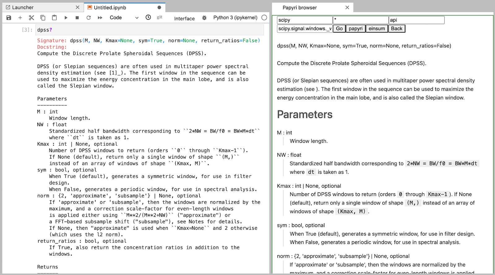
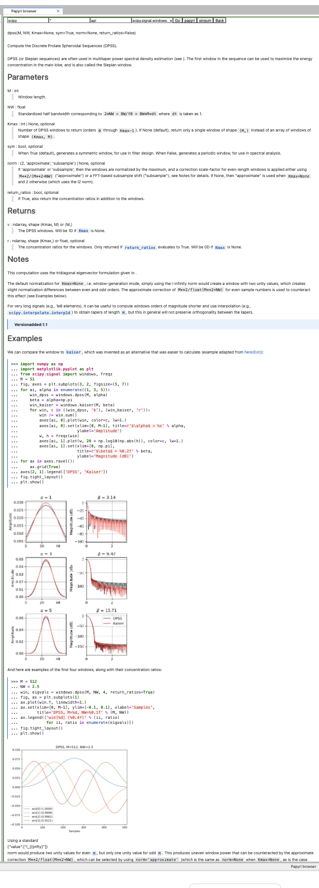
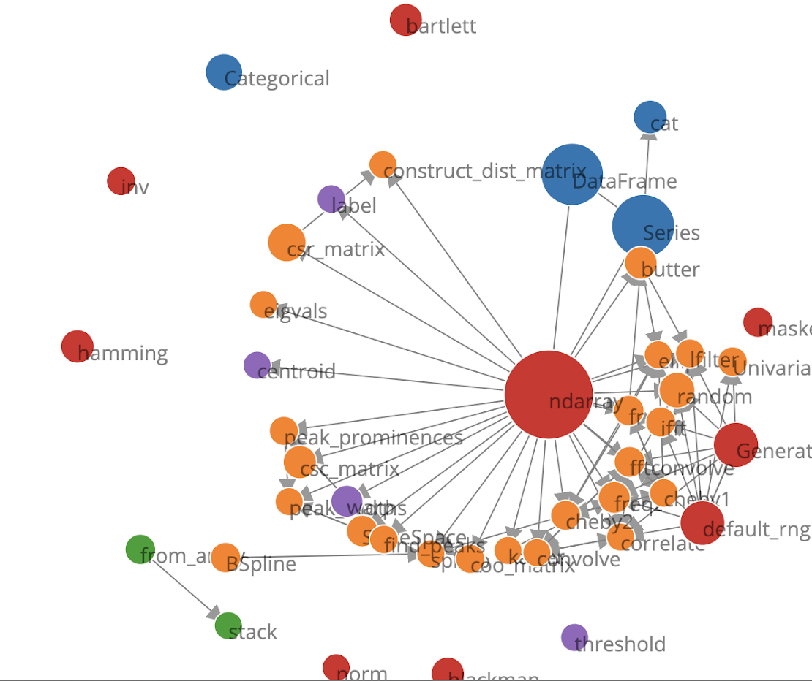

:author: Matthias Bussonnier
:email: bussonniermatthias@gmail.com
:institution: QuanSight, Inc
:institution: Digital Ours Lab, SARL.
:orcid: 0000-0002-7636-8632
:corresponding:

--------------------------------------------------------------------
Papyri: Better documentation for the Scientific Ecosystem in Jupyter
--------------------------------------------------------------------

.. class:: abstract

   We present here the idea behind Papyri, a framework we are developing to
   provide a better documentation experience for the scientific ecosystem. In
   particular, we wish to provide a documentation browser from within Jupyter or
   other IDEs and Python editors that gives a unified experience, cross library
   navigation search and indexing. *I don't understand the last part of the
   sentence (let's chat).*  By decoupling documentation generation from
   rendering we hope this can help address some of the documentation
   accessibility concerns, and allow customisation based on users' preferences. 
   

.. class:: keywords

   Document, Jupyter, ecosystem, accessibility

Introduction
------------

Over the past decades, the Python ecosystem has grown rapidly, and one of the
last bastion where some of the proprietary competition tools shine is integrated
documentation. Indeed, open-source libraries are usually developed in
distributed settings that can make it hard to develop coherent and integrated
systems. 

While a number of tools and documentations exists (and improvements are made
everyday), most efforts attempt to build documentation in an isolated way,
inherently creating a heterogeneous framework. The consequences are twofolds:
(i) it becomes difficult for newcomers to grasp the tools properly, (ii) there
is a lack of cohesion and unified framework as library authors make their proper
choices and must maintain build scripts or services.

Many users, colleagues, and members of the community have been frustrated with
the documentation experience in the Python ecosystem. Given a library, who
hasn't struggle to find the "official" website for the documentation ? Often,
users stumble across an old documentation version that is better ranked in their
favorite search engine, and this impacts less experienced users' learning
greatly.

The experience on users's local machine is not better:
While access to inspector in many IDE provides some documentation, it does not
get access to the narrative, or full documentation gallery. Command Line
Interface (CLI) users are in an even worse place as raw source is often
displayed and no navigation is possible.

Maintainers are not either in a good position, we do not want to have to think
about final rendering. Though we would like users to gain from improvement in
the rendering without having to rebuild all our docs.

Efforts such as conda-forge [CFRG]_ have shown that concerted efforts can
give a much better experience to end-users, and in today's world where sharing
libraries source on code platforms, continuous integration, and many other tools
is ubiquitous, we believe a better documentation framework for many of the
libraries of the scientific Python is should be available.

Thus, against all advice we received and our own experience, we have decided to
rebuild an opinionated documentation framework, from scratch, and with minimal
dependencies: **Paryri**. Papyri focus on building an intermediate documentation
representation format, that let us decoupling building, and rendering the docs;
highly simplifying many operations and giving us access to many desired features
not available until now.

Parallel with to Compiled languages
-----------------------------------

We'll draw several comparison between documentation building and compiled
languages, plus borrow an adapt a couple of terms from the domain. Needed, what
is building the documentation bur going from a source-code meant for a machine
to a final output targeting the flesh and blood machine between the keyboard and
the chair.

In particular we'll draw similarities with "ahead-of-time" [AOT]_,
"just-in-time" [JIT]_, "intermediate representation (IR)" [IR]_, link-time
optimization (LTO) [LTO]_, static vs dynamic linking.

If you are familiar with these concept that might be a good parallel to keep in
mind in order to follow the reasoning and architecture, but is not necessary to
understand the concepts behind papyri.

Current Tools and their limitations
-----------------------------------

It is difficult to speak about the scientific python ecosystem documentation
without making reference to docutils [docutils]_ and sphinx [sphinx]_ which are
virtually use by all the libraries in the scientific Python ecosystem. Both
these libraries are the cornerstone of publishing html documentation for Python.
While few alternative exists, most tools and services have some internal
knowledge of sphinx. Read the Docs [RTD]_ provide a specific sphinx theme
[RTD-theme]_ user can opt-in to, `Jupyter-book` is  built on top of sphinx, and
MyST parser [MYST]_ which is made to allow markdown in documentation does targets
sphinx as a backend. 

All the above tools provides an "ahead of time" documentation compilation and
rendering, a step which is slow and computationally intensive. Each project
needs its specific plugins, extensions and configurations to properly build. It
is also often relatively difficult to build documentation for a single object (a
single function, module or class), making use of those tools for interactive
exploration difficult.  While this "just-in-time" approach is attempted by
projects like `docrepr` that is integrated both in `Jupyter` and `Spyder`, the
above limitations means interactive documentation lacks inline plots,
crosslinks, indexing, search and many custom directives.

Some of the above limitation are inherent to the design of documentation build
tools that were designed to build documentation in isolation. While sphinx does
provide features like `intersphinx`, link resolutions are done at documentation
build time and are thus inherently unidirectional, and can easily get broken.
For example, let's considering `numpy` and `scipy` which are two extremely close
libraries, having proper cross-linked documentation requires at least five
steps:

- build NumPy documentation

- publish NumPy ``object.inv`` file. 

- build SciPy documentation using NumPy ``obj.inv`` file.

- publish SciPy ``object.inv`` file
  
- rebuild NumPy docs to make use of SciPy's ``obj.inv``

Only then can both SciPy's and NumPy's documentation refer to each other.

Any of the created links being potentially invalidated on the publication of a
new version of any of those libraries, which is something that regularly happen
[#]_. 

.. [#] `ipython/ipython#12210 <https://github.com/ipython/ipython/pull/12210>`_, `numpy/numpy#21016 <https://github.com/numpy/numpy/pull/21016>`_, `& #29073 <https://github.com/numpy/numpy/pull/20973>`_

This make using pre-produced html in IDEs and other tools difficult and error
prone. This has also raised security issue where some institution are reluctant
to use either tools like `docrepr` or viewing pre-produced html. 

Editing docstrings between a rock and a hard place
--------------------------------------------------

The numpydoc format is ubiquitous among the scientific ecosystem [NPDOC]_ , It
is loosely based on RST syntax, and despite supporting full rst syntax,
docstrings often rarely contain full-featured directive. As many tools show raw
docstrings and are incapable of interpreting directive on the fly, even if they
could or had the right plugin, this may be computationally intensive which is
undesirable, and executing code to view docs could be a security risk.
Maintainers are thus often pull in two opposite directions. 

- keeping the docstrings simple, mostly text based with few directive in order
  to have readability to the end user that might be exposed to the docstring
  when using tools like IPython and Jupyter. 

- Write an extensive docstring, with references, and directive that
  potentially create graphics, tables and more, but impede readability. 

While tools like `docrepr` mitigate this problem, this is true only for IDE
users and not Terminal users that will still be exposed to raw docstrings. This
leads to long discussions, for example in `SymPy
<https://github.com/sympy/sympy/issues/14964>` on how should equations be
represented in docstrings. 

Some libraries would also prefer to use markdown in their docstrings, but this
would create inconsistencies for the end user with respect to rendering, and
have the same dilemmas as above.

Finally a few library will dynamically modify their docstring at runtime in
order to avoid using directives. This can have runtime cost, as well as a more
complex maintenance and contribution cost.

Goals Non Goals
---------------

Below we'll layout goals and non-goals. Non-goals are as much if not more
important than goals as they will frame the limit of the what the tools we'll
build can do, and the more limited our goals are the more we can reason about
the system and usually the smarter the tools can be.

Generic Website builder
~~~~~~~~~~~~~~~~~~~~~~~

Many of the existing projects to build online documentation are well
established, extremely flexible and fits the need or their users. We are in no
way trying to cover many of the use case covered by projects like sphinx, or
Jupyter Book. When authors want or need complete control of the output and wide
personalisation options, or branding; papyri is likely not the project to look
at. That is to say single-project websites where appearance, layout, domain is
controlled by the author is an explicit non-goal.

Full compatibility with current systems
~~~~~~~~~~~~~~~~~~~~~~~~~~~~~~~~~~~~~~~

For user who are already using sphinx, mkdocs or other projects and are
interested in using Papyri, we also not targeting 100% compatibilities. You
should expect your project to requires minor modifications to work with papyri. 
We in particular are stricter on many of the rst directive than docutils and
sphinx are, and we believe that a stricter requirements leads to more uniform
documentation setup and syntax, which is simpler for contributors and allow to
catch more errors at compile time. This is qualitatively supported by number of
documentation fixes we did upstream during the developments **ADD REFERENCES,
HERE to many fixes to numpy/scipy**.

Prescribing documentation sctructure
~~~~~~~~~~~~~~~~~~~~~~~~~~~~~~~~~~~~

We do not want to prescribe how to write documentation, and who it should be
targeted to. Nonetheless as we have to make technical choices, and when possible
will keep in mind the Diátaxis Framework [DT]_, this.

Accessibility and User proficiency
~~~~~~~~~~~~~~~~~~~~~~~~~~~~~~~~~~

We care about accessibility as well, this is one of the reason we will try to
attach semantic meaning to items in the documentation when possible. As we also
want documentation rendering to be separated from documentation building, this
should let users opt-in to accessibility features, like hight contrast themes, 
or make it easier for speech to text library to consume the raw data.

We also want to separate rendering in order to give users the opportunity to alter 
documentation depending on their proficiency. For example while type
annotation is useful to the advance user it can be confusing for the neophyte.

Similarly, newcomers tend to prefer working from examples, and could thus decide
to promote examples earlier in the rendering. 

Regardless of configurability, we believe that a coherent experience where
documentation is uniform and in a single place should make users more
comfortable with finding information.

Simplicity, speed and independence
~~~~~~~~~~~~~~~~~~~~~~~~~~~~~~~~~~

We wish to have relative independence of documentation building across
libraries. That is to say the system should be able to build documentation for a
single library, without the need to access documentation for another.

We do want documentation installation and rendering to be relatively
straightforward and fast. On large distributed system, we cannot afford to have
the installation speed to grow polynomially with the number of installed
packages.

We do want the ability to have forward and backward links and references between
pages. 

And we do want to ability to lookup documentation for an object from the
interactive REPL.

The Papyri solution
-------------------

Here we present the solution we came up that we believe solve most of the
problems we highlighted above, and then describe the current state of our
implementations.

Making documentation multi-step
-------------------------------

We first recognised that many of the customisation made by maintainers when
building documentation with sphinx and similar tools fall in two categories:

- simpler input convenience. 
- modification of final rendering. 

Wether you customise the ``.. code-block:`` directive to execute or reformat
your entries, or create a ``:rc:`` role to link to configuration parameters, a
large number of custom directive and plug-in only purpose make it easier to
create references, or make sure the content is auto generated to avoid
documentation becoming out of sync with libraries source code. This first
category often require arbitrary code execution and must import the library you
are currently building the documentation for. 

The second category of plugins attempt to improve the documentation final
rendering in order to be more user friendly. For example `sphinx-copybutton` add
a button to easily copy code snippets in a single click, `pydata-sphinx-theme`
provide a different appearance.

We'll note that this second category many of the improvement can fall into user
preferences (`sphinx-rtd-dark-mode`), and developers end up making choices on
behalf of their end users: 

- which syntax highlight to use ?
- should I show type annotations ?
- do I provide a light or dark theme ? 

We have often wished to modify the second category of extension and re-render 
documentation without having to go through the long and slow process of
rebuilding and executing everything. 

Thus our first choice was to have  strict boundary between the two types of
plugins. The building or "generate" step of papyri that collect documentation
informations has no knowledge and no configuration options that permit to modify
the final appearance of the final documentation.

The optional rendering process also have no knowledge of the building step, and
can be run without access to the libraries we are rendering documentation for.

This a powerful separation of concern, that will give a number of advantages and
will allow us to achieve many features that are currently relatively hard with
current systems. This is not a new technique if we refer to the field of
compiler, where we can reason independently about each compilation units .

Standard IRD format
-------------------

While we are still in search of a better name, most of the success of papyri 
relies on the definition of standard interchangeable Intermediate
Representation for Documentation format (IRD). We borrow the name IR again from
compilers.

This allow to separate concerns between M producers and N renderer, and reduce a
M*N problem where each renderer need to be able to be able to consume input from
each producer, to an N+M, where each producer should only care about producing
IRD, and each renderer consume it.

This also allows us to take IRD from multiple producer are once, and render it
together to a single target, this breaking the silos between libraries.

As of the writing of this paper, IRD files are currently separated into multiple
categories. 

- API files describe the documentation for a single object, expressed as a
  Json object. When possible the informations are encoded semantically.
  Files are organized based on the fully-qualified name of the Python object
  they reference, and contain either absolute reference to another object
  (library, version and identifier), or delayed references to objects that may
  exists in another library. Some extra per-object meta information like
  file/line number of definition can be stored as well.
- Narrative files are similar to API file, except with the notion they do not
  represent a given object, but posses a previous/next page, and are organised
  in an ordered tree related to the table of content. 
- Examples files are non-ordered collection of files.
- Assets are untouched binary blobs that can be references by any of the above
  three categories, and are the only category that only have backward
  references, and no forward references.

In addition to those 4 kinds of objects, metadata about the current package is
stored: library name, current version, pypi name, GitHub slug, maintainers names,
logo, issue tracker and a few other. Allowing us to for example auto generate
link to issue tracker, or to source files when rendering. 

We also store a mapping from fully qualified names to canonical names, in order
to properly resolve some references, of normalise links.

The final specification of the IRD file is unfinished, we thus invite you to
consult the current state on the GitHub repository.

Those IRD files must be standardise in order to achieve our end goal, and
distribution of those files are not going to be covered in this paper.

IRD Installation
----------------

High level Usage 
----------------

The papyri lifecycle for documentation can roughly be decomposed into 3 broad
categories of stakeholders, and processes. 

The first stakeholders are library maintainers. Those should ensure that papyri
can build Intermediate Representation Documentation (IRD) files. And publish
and IRD bundle.

Creation of IRD files and bundles is the computation intensive step, that may
requires complex dependencies, or specific plugins. Creation of these files may
be a multi-step process or use external tooling that is not related to papyri or
does not use Python. Note that these steps do not requires the libraries
maintainer to worry about visual appearance and rendering of documentation.

The second category of stakeholder are end-users. Those users are responsible
from installing IRD bundles from the libraries they wish to use on their
machines. Note that IRD from libraries that are not in use are installable as
well, and that IRD bundle not attached to a particular library could also be
installed, providing for example domain specific tutorials or examples. 

The third category of stakeholder are IDE developers, who want to make sure
IRD files can be properly rendered and browsed by their users; potentially
taking into account user preferences, and providing added values with for
example indexing, searching, bookmarks. Such a category of stakeholder could
also be opinionated web hosting in a similar fashion to rustsdocs, devdocs.io

Future possibilities
--------------------

- Removal of dynamic docstrings, 
- Markdown
- Static website,
- post deprecation
- translation

Challenges
----------

In order to be able to link to object documentation without having access the
the build IRD bundles from all the library we need to come up with a schema that
uniquely identify each object. For this we decided to use the fully qualified
names of an object. That is to say the concatenation of the module in which it
is defined, with its local name. We encountered multiple edge cases with that. 

- To mirror python syntax is it easy to use ``.`` to concatenate both parts. 
  Unfortunately that leads to ambiguity when modules re-export functions of
  the same name. 

  .. code-block:: python

      # module mylib/__init__.py

      from .mything import mything

  ``mylib.mything`` is ambiguous with respect to the ``mything`` submodule and
  the object reexported. In future version we'll  use ``:`` as a module/name
  separator.

- Decorated functions or other dynamic approaches to expose function to users
  end up having ``<local>>`` in their fully qualified names, which is invalid. 

- Many builtins functions (``np.sin``, ``np.cos``, ...) do not have a fully
  qualified name that can be extracted by object introspection. 

- Fully qualified names are often not canonical names (the name you typically
  use for import), and finding the canonical name automatically is not always
  straitforward. 

We also came across challenges with case sensitivity, in particular of
filesystems, and a couple of object have same fully qualified name up to
difference in casing. 

Current implementation
----------------------

IRD file Generation
~~~~~~~~~~~~~~~~~~~

While the core idea around papyri resides in the IRD files and bundles, we can
come back on some of the decision we made with current implementation.

The current implementation only support parsing RST and Numpydoc in docstrings. 
While we hope to extend it with MyST later, or provide it as a plugin, this is
our main focus as a wide majority of the core Scientific python stack.
We use Tree-Sitter, and tree-sitter-rst to parse RST syntax, in particular
tree-sitter allow us to easily "unparse" an AST node when necessary as the ast
nodes contains bytes offset to the original buffer. This was relatively
convenient to handle custom directive a number of edge cases where project
relied on loose definition of the rst syntax. For example rst directive are of
the form::

  .. directive:: arguments
      
      body

While technically there is no space before the ``::``, docutils and sphinx allow
this, but it fails in tree-sitter with an error node. We can check error nodes,
un-parse, add heuristics to restore a proper syntax and parse the new node.

Alternatively a number of directive like ``warnings``, ``notes``
``admonitions`` still contain valid RST. Instead of storing the directive with
the raw text, we parse the full document (potentially finding invalid syntax),
and unparse to the raw text only if the directive requires it.

Serialisation of datastructure into IRD files are currently using a custom
serialiser that we hope to swap for msgspec. The AST objects are completely
typed but contains a number of Unions and Sequences of Unions. We found out that
many frameworks like ``pydantic`` do not support sequences of Unions where each
item in the Union may be of a different type.

We currently try to type-infer all code examples with Jedi, and pre-syntax
highlight using pygments when possible.

IRD File Installation
~~~~~~~~~~~~~~~~~~~~~

Download and Installation of IRD files is done concurrently using ``httpx``,
with ``trio`` as an async framework. 

The IRD files post-processed into a local custom format. Object informations are
store in 3 different places: A local SQLite database, CBOR representation of
each document, and raw storage on disk for assets and binary blobs. 

SQlite allows us to easily query graph informations at run time, just before
rendering, and is mostly optimised for infrequent read access.

CBOR object for post-processed IRD files has been chosen to provide a more
compact representation than JSON which is highly redundant, while still
avoiding to use compression for fast access.

Access to these resources is providing via an internal ``GraphStore`` API which
is agnostic of the backend, and ensure the consistency of operation like
adding/removing/replacing documents.

Documentation Rendering
~~~~~~~~~~~~~~~~~~~~~~~

We've prototypes a number of rendering engines, each of them basically consist
of fetching a single page and it's metadata, and walking the IRD AST tree, and
rendering each nodes with user preferences. 

- An ASCII terminal render using Jinja2. This can be useful to pipe
  documentation to other tools like grep, less, cat.

- A TUI browser using urwid. This lets you navigate in the terminal, reflow long
  line on window resize, and can even open images files in external editors. We
  encountered several bugs in urwid and are considering rewriting it using
  Rich/Textual.

- A Just-in-Time rendering engine using Jinja2/quart/trio ; Quart being an async
  version of flask. This version is the one with the most features.

- A static "Ahead of time", rendering of all the existing pages that can be
  rendered ahead of time, using the same class as the Just-in-time rendering
  that basically loops through all entries in the SQLite database and render
  each.

Our profile show that documentation rendering is limited by object serialisation
and de serialisation from disk as well a Jinja2 templating engine. 
We've played with writing a static html renderer in a compiled language (Rust,
using compiled, and typed checked templates), and managed to get about a factor
10 speedup, but this implementation is now out of syn with the main papyri
code base. 

Finally we've started implementing a JupyterLab extension that is capable of
basic IRD file browsing and rendering, using react and typescript. It has
limited capabilities, like ability to browse to previous pages.

   The following screenshot shows current help for ``scipy.signal.dpss`` as
   currently accessible on the left, as shown by the  papyri for jupyterlab
   extension on the right.

   Zoomed out view of the papyri for jupyterlab extension, we can see that the
   code examples include plots. Most token in each examples are link to the
   corresponding page. Early navigatin bar visible at the top.

   (screenshot). We played with the possibility of using D3.js to a local graph
   of connection among the most important node arround ``numpy.ndarray``. Nodes
   are sized with respectd to the number of incomming links, and colored with
   respect to their library.

Misc
----

Is is common for compiler to use IR (MIRI, LLVM IR)
Not a novel idea, allow to mix compilation from multiple targets, LTO.
Diataxis
rustdocs.
https://markdoc.io/

.. comment: 
    In this talk we will demo and discuss the work that is being done on Papyri, a
    new framework to provide rich documentation in Jupyter and Terminal IPython
    with plots, crosslink, equations. We will describe how libraries can opt-in to
    this new framework while still in beta to provide feedback, what are the trade-off of using it, the current
    capabilities and the one planed with current funding, as well as where this
    could go in the future.

    This talk discusses a solution to a widely encountered problem of documentation while using Jupyter and Terminal IPython. This will be an impactful talk to the community of all scientific groups.

    ## Summary

    This submission is very interesting! I would have liked if the authors gave
    more detail on the difference between user perspectives (that is, library
    users navigating documentation with this tool), and developer perspectives
    (developers of libraries that may want to integrate this documentation
    framework into their projects). I also hope that the authors comment on
    documentation accessibilty for users of different skill levels and if / how
    this framework addresses it.

    ## Is the abstract compelling?

    Absolutely! This sounds like a fantastic tool that would be of interest to package developers and users in the SciPy community.

    ## How relevant, immediately useful, and novel is the topic?

    The topic is both relevant and useful to the community.

some maths, for example :math:`e^{\pi i} + 3 \delta`.  Or maybe an
equation on a separate line:

.. math::

   g(x) = \int_0^\infty f(x) dx

or on multiple, aligned lines:

.. math::
   :type: eqnarray

   g(x) &=& \int_0^\infty f(x) dx \\
        &=& \ldots

The area of a circle and volume of a sphere are given as

.. math::
   :label: circarea

   A(r) = \pi r^2.

.. math::
   :label: spherevol

   V(r) = \frac{4}{3} \pi r^3

We can then refer back to Equation (:ref:`circarea`) or
(:ref:`spherevol`) later.

Mauris purus enim, volutpat non dapibus et, gravida sit amet sapien. In at
consectetur lacus. Praesent orci nulla, blandit eu egestas nec, facilisis vel
lacus. Fusce non ante vitae justo faucibus facilisis. Nam venenatis lacinia
turpis. Donec eu ultrices mauris. Ut pulvinar viverra rhoncus. Vivamus
adipiscing faucibus ligula, in porta orci vehicula in. Suspendisse quis augue
arcu, sit amet accumsan diam. Vestibulum lacinia luctus dui. Aliquam odio arcu,
faucibus non laoreet ac, condimentum eu quam. Quisque et nunc non diam
consequat iaculis ut quis leo. Integer suscipit accumsan ligula. Sed nec eros a
orci aliquam dictum sed ac felis. Suspendisse sit amet dui ut ligula iaculis
sollicitudin vel id velit. Pellentesque hendrerit sapien ac ante facilisis
lacinia. Nunc sit amet sem sem. In tellus metus, elementum vitae tincidunt ac,
volutpat sit amet mauris. Maecenas [#]_ diam turpis, placerat [#]_ at adipiscing ac,
pulvinar id metus.

.. [#] On the one hand, a footnote.
.. [#] On the other hand, another footnote.

.. .. figure:: figure1.png
.. 
..    This is the caption.:code:`chunk of code` inside of it. :label:`egfig` 
.. 
.. .. figure:: figure1.png
..    :align: center
..    :figclass: w
.. 
..    This is a wide figure, specified by adding "w" to the figclass.  It is also
..    center aligned, by setting the align keyword (can be left, right or center).
..    This caption also has :code:`chunk of code`.
.. 
.. .. figure:: figure1.png
..    :scale: 20%
..    :figclass: bht
.. 
..    This is the caption on a smaller figure that will be placed by default at the
..    bottom of the page, and failing that it will be placed inline or at the top.
..    Note that for now, scale is relative to a completely arbitrary original
..    reference size which might be the original size of your image - you probably
..    have to play with it.  :label:`egfig2`
.. 
.. As you can see in Figures :ref:`egfig` and :ref:`egfig2`, this is how you reference auto-numbered
.. figures.
.. 
.. table:: This is the caption for the materials table. :label:`mtable`

   +------------+----------------+
   | Material   | Units          |
   +============+================+
   | Stone      | 3              |
   +------------+----------------+
   | Water      | 12             |
   +------------+----------------+
   | Cement     | :math:`\alpha` |
   +------------+----------------+

We show the different quantities of materials required in Table
:ref:`mtable`.

.. The statement below shows how to adjust the width of a table.

.. raw:: latex

   \setlength{\tablewidth}{0.8\linewidth}

.. table:: This is the caption for the wide table.
   :class: w

   +--------+----+------+------+------+------+--------+
   | This   | is |  a   | very | very | wide | table  |
   +--------+----+------+------+------+------+--------+

Unfortunately, restructuredtext can be picky about tables, so if it simply
won't work try raw LaTeX:

.. raw:: latex

   \begin{table*}

     \begin{longtable*}{|l|r|r|r|}
     \hline
     \multirow{2}{*}{Projection} & \multicolumn{3}{c|}{Area in square miles}\tabularnewline
     \cline{2-4}
      & Large Horizontal Area & Large Vertical Area & Smaller Square Area\tabularnewline
     \hline
     Albers Equal Area  & 7,498.7 & 10,847.3 & 35.8\tabularnewline
     \hline
     Web Mercator & 13,410.0 & 18,271.4 & 63.0\tabularnewline
     \hline
     Difference & 5,911.3 & 7,424.1 & 27.2\tabularnewline
     \hline
     Percent Difference & 44\% & 41\% & 43\%\tabularnewline
     \hline
     \end{longtable*}

     \caption{Area Comparisons \DUrole{label}{quanitities-table}}

   \end{table*}

Perhaps we want to end off with a quote by Lao Tse [#]_:

  *Muddy water, let stand, becomes clear.*

.. [#] :math:`\mathrm{e^{-i\pi}}`

.. Customised LaTeX packages
.. -------------------------

.. Please avoid using this feature, unless agreed upon with the
.. proceedings editors.

.. ::

..   .. latex::
..      :usepackage: somepackage

..      Some custom LaTeX source here.

References
----------

.. [docutils] https://docutils.sourceforge.io/
.. [sphinx] https://www.sphinx-doc.org/en/master/
.. [RTD] https://readthedocs.org/
.. [RTD-theme] https://sphinx-rtd-theme.readthedocs.io/en/stable/
.. [AOT] https://en.wikipedia.org/wiki/Ahead-of-time_compilation
.. [JIT] https://en.wikipedia.org/wiki/Just-in-time_compilation
.. [IR] https://en.wikipedia.org/wiki/Intermediate_representation
.. [LTO] https://en.wikipedia.org/wiki/Interprocedural_optimization
.. [DT] https://diataxis.fr/
.. [CFRG] https://conda-forge.org/
.. [MYST] https://myst-parser.readthedocs.io/en/latest/
.. [NPDOC] https://numpydoc.readthedocs.io/en/latest/format.html
