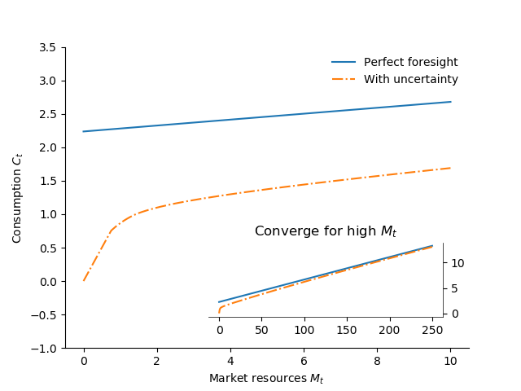

========================================================
The `Econ-ARK <http://econ-ark.org>`__ Open Source Tools
for Computational Economics
========================================================

:Author: Christopher D. Carroll
Alexander M. Kaufman
Jacqueline Kazil
David C. Low
Nathan M. Palmer
Matthew N. White
:Date:   July 9, 2018

.. role:: math(raw)
   :format: html latex
..

Introduction
============

Academic research in statistics has standardized on the use of the ‘R’
modeling language for scholarly communication, and on a suite of tools
and standards of practice (the use of R-markdown, e.g.) that allow
statisticians to communicate their ideas easily to each other. Many
other scholarly fields have similarly developed computational and
communication tools that allow scholars easily and transparently to
exchange quantitative ideas and computational results without anyone
having to master idiosyncratic details of anyone else’s hand-crafted
computer code.

The only branch of economics in which something similar has happened is
representative agent macroeconomics, which (to some degree) has
standardized on the use of the DYNARE toolkit.

Our aim is to provide a high quality set of tools and standards whose
existence will help bring the rest of economics out of the (comparative)
wilderness. Part of the reason we are confident the goal is feasible is
that the tools that are now available – Python, Github, and Jupyter
notebooks among them – have finally reached a stage of maturity that can
handle the communication of almost any message an economist might want
to transmit. (See the recent blog post by Paul Romer, `“Jupyter,
Mathematica, and the Future of the Research
Paper” <https://paulromer.net/jupyter-mathematica-and-the-future-of-the-research-paper/>`__
for a fuller statement of the point).

We face two challenges. The first is to develop a set of resources and
examples and standards of practice for communication that are
self-evidently a major improvement on the way economists exchange ideas
now. The second is to persuade scholars to converge on using those
tools.

The `Econ-ARK <http://econ-ark.org>`__ is the vehicle by which we hope
to achieve these objectives. We have begun with the creation of a
toolkit for Heterogeneous Agent (HA) macroeconomics, in part because
that is a field where the need for improvement in standards of
transparency, openness, and reproducibility is particularly manifest,
and because it is a field where important progress seems particularly
feasible.

The traditional approach in macroeconomics has been to assume that
aggregate behavior can adequately be understood by modeling the behavior
of a single ‘representative agent.’ HA macroeconomics instead starts by
constructing models of the behavior of individual microeconomic agents
(a firm or a consumer, e.g.) that match key facts (e.g., some people are
borrowers and others are savers) from the rich microeconomic evidence
about the behavior and circumstances of such agents. With that solid
foundation in place, macroeconomic outcomes are constructed by
aggregating the behavior of the idiosyncratic agents subject to sensible
requirements on the characteristics of the aggregate (such as, in a
stock market, that the number of shares sold must match the number of
shares bought).

The Heterogeneous-Agent Resources toolKit (HARK) is a modular
programming framework for solving, estimating, and simulating
macroeconomic models in which economic agents can be heterogeneous in a
large number of ways. Models that allow heterogeneity among agents have
proven to be useful for policy and research purposes. For example,
recent work by has shown that changes in interest rates (caused, for
example, by monetary policy actions) affect the economy in large part by
reallocating income flows across different types of households
(borrowers versus lenders, e.g.) rather than by causing every household
to change their behavior in the same way (as, implicitly, in a
traditional RA model). C. Carroll, Slacalek, et al. () show that the
response to fiscal policy (e.g., stimulus payments, or tax cuts) depends
crucially on how such payments are distributed across different groups
(an extension of unemployment benefits has a bigger effect on spending
than a cut in the capital gains tax). Geanakoplos () outlines how
heterogeneity drives the leverage cycle, and Geanakoplos et al. ()
applies these insights to large-scale model of the housing and mortgage
markets.

HA models of the kind described above have had a major intellectual
impact over the past few years. But the literature remains small, and
contributions have come mostly from a few small groups of researchers
with close connections to each other.

In large part, this reflects the formidable technical challenges
involved in constructing such models. In each case cited above, the
codebase underlying the results is the result of many years of
construction of hand-crafted code that has not been meaningfully vetted
by researchers outside of the core group of contributors. This is not
mostly because researchers have refused to share their code; instead, it
is because the codebases are so large, so idiosyncratic, and (in many
cases) so poorly documented and organized as to be nearly
incomprehensible to anyone but the original authors and their
collaborators. Researchers with no connections to the pioneering
scholars have therefore faced an unpalatable choice between investing
years of their time reinventing the wheel, or investing years of their
time deciphering someone else’s peculiar and idiosycratic code.

The HARK project addresses these concerns by providing a set of
well-documented code modules that can be combined to solve a range of
heterogeneous-agent models. Methodological advances in the computational
literature allow many types of models to be solved using similar
approaches – the HARK project simply brings these together in one place.
The key is identifying methodologies that are both “modular” (in a sense
to be described below) as well as robust to model misspecification.
These include both solution methods as well as estimation methods.

In addition to these methodological advances, the HARK project adopts
modern software development practices to ease the burden of code
development, code review, code sharing, and collaboration for
researchers dealing in computational methods. Researchers who must
review the scientific and technical code written by others are keenly
aware that the time required to review and understand another’s code can
dwarf the time required to simply re-write the code from scratch
(conditional on understanding the underlying concepts). This can be
particularly important when multiple researchers may need to work on
parts of the same codebase, either across time or distance.

Because these problems are generic (and not specific to computational
economics), the software development community, and particularly the
open-source community, has spent decades perfecting tools for
programmers to quickly consume and understand code written by others,
verify that it is correct, and to contribute back to a large and diverse
codebase without fear of introducing bugs. The tools used by these
professional developers include formal code documentation, unit testing
structures, modern versioning systems for automatically tracking changes
to code and content, and low-cost systems of communicating ideas, such
as interactive programming notebooks that combine formatted mathematics
with executable code and descriptive content. These tools operate
particularly well in concert with one another, constituting an
environment that can greatly accelerate project development for both
individuals and collaborative teams. These technical tools are not new –
the HARK project simply aims to apply the best of them to the
development of code in computational economics in order to increase
researcher productivity, particularly when interacting with other
researchers’ code.

The rest of this paper will first outline the useful concepts we adopt
from software development, with examples of each, and then demonstrate
how these concepts are applied in turn to the key solution and
estimation methods required to solve general heterogeneous-agent models.
The sections are organized as follows: discusses the natural modular
structure of the types of problems HARK solves and overviews the code
structure that implements these solutions. outlines details of the core
code modules used by HARK. outlines two example models that illustrate
models in the HARK framework. summarizes and concludes.

HARK Structure 
===============

` <Methodological%20Framework%20...%20of%20the%20HARK%20Framework>`__

The class of problems that HARK solves is highly modular by
construction. There are approximately these steps in creating a
heterogneous-agents rational model:

#. Write down individual agent problem

#. Solve the individual agent problem

#. For general equilibrium, also solve for aggregate interations and
   beliefs

#. Estimate the model using Simulated Method of Moments (SMM)

Under the solution and estimation method used by HARK, each of these
steps is highly modular. The structure of the solution method suggests a
natural division of the code. The rest of this section outlines the code
structure HARK employs, and the next section outlines the theory behind
these models.

The following example will illustrate the usage of some key commands in
HARK. ``CRRAutility`` is the function object for calculating CRRA
utility supplied by ``HARK.utilities`` module. ``CRRAutility`` is called
attributes of the module ``HARK.utilities``. In order to calculate CRRA
utility with a consumption of 1 and a coefficient of risk aversion of 2
we run:

import HARKutilities as Hutil

Hutil.CRRAutility(,)

Python modules in HARK can generally be categorized into three types:
tools, models, and applications. **Tool modules** contain functions and
classes with general purpose tools that have no inherent “economic
content,” but that can be used in many economic models as building
blocks or utilities. Tools might include functions for data analysis
(e.g. calculating Lorenz shares from data, or constructing a
non-parametric kernel regression), functions to create and manipulate
discrete approximations to continuous distributions, or classes for
constructing interpolated approximations to non-parametric functions.
Tool modules generally reside in HARK’s root directory and have names
like ``HARK.simulation`` and ``HARK.interpolation``. The core
functionality of HARK is in the tools modules; these will be discussed
in detail in the following section.

**Model modules** specify particular economic models, including classes
to represent agents in the model (and the “market structure” in which
they interact) and functions for solving the “one period problem” of
those models. For example, ``ConsIndShockModel.py`` concerns
consumption-saving models in which agents have CRRA utility over
consumption and face idiosyncratic (**Ind**\ ividual) shocks to
permanent and transitory income. The module includes classes for
representing “types” of consumers, along with functions for solving
(several flavors of) the one period consumption-saving problem. When
run, model modules might demonstrate example specifications of their
models, filling in the model parameters with arbitrary values. When
``ConsIndShockModel.py`` is run, it specifies an infinite horizon
consumer with a particular discount factor, permanent income growth
rate, coefficient of relative risk aversion and other parameters, who
faces lognormal shocks to permanent and transitory income each period
with a particular standard deviation; it then solves this consumer’s
problem and graphically displays the results. [1]_ Model modules
generally have ``Model`` in their name. The two examples discussed in
the “microeconomic” and “macroeconomic” sections below come from “Model
modules.”

**Application modules** use tool and model modules to solve, simulate,
and/or estimate economic models *for a particular purpose*. While tool
modules have no particular economic content and model modules describe
entire classes of economic models, applications are uses of a model for
some research purpose. For example,
``/SolvingMicroDSOPs/StructEstimation.py`` uses a consumption-saving
model from ``ConsIndShockModel.py``, calibrating it with age-dependent
sequences of permanent income growth, survival probabilities, and the
standard deviation of income shocks (etc); it then estimates the
coefficient of relative risk aversio n and shifter for an age-varying
sequence of discount factors that best fits simulated wealth profiles to
empirical data from the Survey of Consumer Finance. A particular
application might have multiple modules associated with it, all of which
generally reside in one directory. Particular application modules will
not be discussed in this paper further; please see the Github page and
associated documentation for references to the application modules.

Tool Modules 
=============

HARK’s root directory contains the following tool modules, each
containing a variety of functions and classes that can be used in many
economic models, or even for mathematical purposes that have nothing to
do with economics. We expect that all of these modules will grow
considerably in the near future, as new tools are “low hanging fruit”
for contribution to the project.

HARK.core
---------

This module contains core classes used by the rest of the HARK
ecosystem. A key goal of the project is to create modularity and
interoperability between models, making them easy to combine, adapt, and
extend. To this end, the ``HARK.core`` module specifies a framework for
economic models in HARK, creating a common structure for them on two
levels that can be called “microeconomic” and “macroeconomic”, which are
described in detail in the next section.

Beyond the model frameworks, ``HARK.core`` also defines a
“supersuperclass” called ``HARK.object``. When solving a dynamic
economic model, it is often required to consider whether two solutions
are sufficiently close to each other to warrant stopping the process
(i.e. approximate convergence). HARK specifies that classes should have
a ``distance`` method that takes a single input and returns a
non-negative value representing the (generally dimensionless) distance
between the object in question and the input to the method. As a
convenient default, ``HARK.object`` provides a “universal distance
metric” that should be useful in many contexts. [2]_ When defining a new
subclass of ``HARK.object``, the user simply defines the attribute
distance\_criteria as a list of strings naming the attributes of the
class that should be compared when calculating the distance between two
instances of that class. See
`here <https://econ-%20ark.github.io/HARK/generated/HARK.core.html>`__
for online documentation.

HARK.utilities
--------------

The ``HARK.utilities`` module carries a double meaning in its name, as
it contains both utility functions (and their derivatives, inverses, and
combinations thereof) in the economic modeling sense as well as
utilities in the sense of general tools. Utility functions include
constant relative risk aversion (CRRA) and constant absolute risk
aversion (CARA). Other functions in ``HARK.utilities`` include data
manipulation tools, functions for constructing discrete state space
grids, and basic plotting tools. The module also includes functions for
constructing discrete approximations to continuous distributions as well
as manipulating these representations.

HARK.interpolation
------------------

The ``HARK.interpolation`` module defines classes for representing
interpolated function approximations. Interpolation methods in HARK all
inherit from a superclass such as ``HARKinterpolator1D`` or
``HARKinterpolator2D``, wrapper classes that ensures interoperability
across interpolation methods. Each interpolator class in HARK must
define a ``distance`` method that takes as an input another instance of
the same class and returns a non-negative real number representing the
“distance” between the two. [3]_

**HARK.simulation**

The HARK.simulation module provides tools for generating simulated data
or shocks for post-solution use of models. Currently implemented
distributions include normal, lognormal, Weibull (including
exponential), uniform, Bernoulli, and discrete.

**HARK.estimation**

Methods for optimizing an objective function for the purposes of
estimating a model can be found in ``HARK.estimation``. As of this
writing, the implementation includes minimization by the Nelder-Mead
simplex method, minimization by a derivative-free Powell method variant,
and two tools for resampling data (i.e., for a bootstrap). Future
functionality will include global search methods, including genetic
algorithms, simulated annealing, and differential evolution.

Model Modules 
==============

*Microeconomic* models in HARK use the ``AgentType`` class to represent
agents with an intertemporal optimization problem. Each of these models
specifies a subclass of ``AgentType``; an instance of the subclass
represents agents who are ex-ante homogeneous (they have common values
for all parameters that describe the problem, such as risk aversion).
The ``AgentType`` class has a ``solve`` method that acts as a “universal
microeconomic solver” for any properly formatted model, making it easier
to set up a new model and to combine elements from different models; the
solver is intended to encompass any model that can be framed as a
sequence of one period problems. [4]_

*Macroeconomic* models in HARK use the ``Market`` class to represent a
market or other mechanisms by which agents interactions are aggregated
to produce “macro-level” outcomes. For example, the market in a
consumption-saving model might combine the individual asset holdings of
all agents in the market to generate aggregate savings and capital in
the economy, which in turn produces the interest rate that agents care
about. Agents then learn the aggregate capital level and interest rate,
which affects their future actions. Thus objects that *microeconomic*
agents treat as exogenous when solving their individual-level problems
(such as the interest rate) are made *endogenous* at at the
macroeconomic level through the ``Market`` aggregator. Like
``AgentType``, the ``Market`` class also has a ``solve`` method, which
seeks out a dynamic general equilibrium rule governing the dynamic
evolution of the macroeconomic object. [5]_

Each of these are explored via example in the following.

Microeconomics: the AgentType Class
-----------------------------------

The core of our microeconomic dynamic optimization framework is a
flexible object-oriented representation of economic agents. The
``HARK.core`` module defines a superclass called ``AgentType``; each
model defines a subclass of ``AgentType``, specifying additional
model-specific features and methods while inheriting the methods of the
superclass. Most importantly, the method ``solve`` acts as a “universal
solver” applicable to any (properly formatted) discrete time model. This
section provides a brief example of a problem solved by a microeconomic
instance of ``AgentType``. [6]_

Sample Model: Perfect Foresight Consumption-Saving
~~~~~~~~~~~~~~~~~~~~~~~~~~~~~~~~~~~~~~~~~~~~~~~~~~

To provide a concrete example of how the AgentType class works, consider
the very simple case of a perfect foresight consumption-saving model.
The agent has time-separable, additive CRRA preferences over consumption
:math:`C_t`, discounting future utility at a constant rate; he receives
a particular stream of labor income each period :math:`Y_t`, and knows
the interest rate :math:`\mathsf{R}` on assets :math:`A_t` that he holds
from one period to the next. His decision about how much to consume in a
particular period :math:`C_t` out of total market resources :math:`M_t`
can be expressed in Bellman form as:

.. math::

   \begin{aligned}
   V_t(M_t) &= \max_{C_t} \; \mathrm{u}(C_t)  + \beta  \cancel{\mathsf{D}}_t E [V_{t+1}(M_{t+1}) ], \\
   A_t &= M_t - C_t, \\
   M_{t+1} &= \mathsf{R} A_t + Y_{t+1}, \\
   Y_{t+1} &= \Gamma_{t+1} Y_t, \\
   \mathrm{u}(C) &= \frac{C^{1-\rho}}{1-\rho}.
   \end{aligned}

An agent’s problem is thus characterized by values of :math:`\rho`,
:math:`\mathsf{R}`, and :math:`\beta`, plus sequences of survival
probabilities :math:`\cancel{\mathsf{D}}_t` and income growth factors
:math:`\Gamma_t` for :math:`t = 0, ... ,T`. This problem has an
analytical solution for both the value function and the consumption
function.

The ``ConsIndShockModel`` module defines the class
``PerfForesightConsumerType`` as a subclass of ``AgentType`` and
provides ``solver`` functions for several variations of a
consumption-saving model, including the perfect foresight problem. A
HARK user could specify and solve a ten period perfect foresight model
with the following two commands (the first command is split over
multiple lines) :

MyConsumer PerfForesightConsumerType( time\_flow, cycles, Nagents , CRRA
, Rfree , DiscFac , LivPrb [,,,,,,, ,,], PermGroFac [,,,,,, ,,,] )

MyConsumer.solve()

The first line makes a new instance of ConsumerType, specifies that time
is currently “flowing” forward, specfies that the sequence of periods
happens exactly once, and that the simulation-based solution will use
1,000 agents. The next five lines (all part of the same command) set the
time invariant (CRRA is :math:`\rho`, Rfree is :math:`\mathsf{R}`, and
DiscFac is :math:`\beta`) and time varying parameters (LivPrb is
:math:`\cancel{\mathsf{D}}_t`, PermGroFac is :math:`\Gamma_{t}`). After
running the ``solve method``, ``MyConsumer`` will have an attribute
called ``solution``, which will be a list with eleven
``ConsumerSolution`` objects, representing the period-by-period solution
to the model. [7]_

The consumption function for a perfect foresight consumer is a linear
function of market resources – not terribly exciting. The marginal
propensity to consume out of wealth doesn’t change whether theconsumer
is rich or poor. When facing *uncertain* income, however, the
consumption function is concave – the marginal propensity to consume is
very high when agents are poor, and lower when they are rich. In
addition, agents facing uncertainty save more than agents under
certainty. However as agents facing uncertainty get richer, their
consumption function converges to the perfect foresight consumption
function – rich but uncertain agents act like agents who have certainty.
In , the solid blue line is consumption under certainty, while the
dashed orange line is consumption under uncertainty. The inset plot
demonstrates that these two functions converge as the x-axis of this
plot are extended.

   Consumption Functions[fig:consumption-functions]

Macroeconomics: the Market Class
--------------------------------

The modeling framework of ``AgentType`` is called “microeconomic”
because it pertains only to the dynamic optimization problem of
individual agents, treating all inputs of the problem from their
environment as exogenously fixed. In what we label as “macroeconomic”
models, some of the inputs for the microeconomic models are endogenously
determined by the collective states and choices of other agents in the
model. In a rational dynamic general equilibrium, there must be
consistency between agents’ beliefs about these macroeconomic objects,
their individual behavior, and the realizations of the macroeconomic
objects that result from individual choices.

The Market class in ``HARK.core`` provides a framework for such
macroeconomic models, with a ``solve`` method that searches for a
rational dynamic general equilibrium. An instance of ``Market`` includes
a list of ``AgentTypes`` that compose the economy, a method for
transforming microeconomic outcomes (states, controls, and/or shocks)
into macroeconomic outcomes, and a method for interpreting a history or
sequence of macroeconomic outcomes into a new “dynamic rule” for agents
to believe. Agents treat the dynamic rule as an input to their
microeconomic problem, conditioning their optimal policy functions on
it. A dynamic general equilibrium is a fixed point dynamic rule: when
agents act optimally while believing the equilibrium rule, their
individual actions generate a macroeconomic history consistent with the
equilibrium rule.

Down on the Farm
~~~~~~~~~~~~~~~~

The ``Market`` class uses a farming metaphor to conceptualize the
process for generating a history of macroeconomic outcomes in a model.
Suppose all ``AgentTypes`` in the economy believe in some dynamic rule
(i.e. the rule is stored as attributes of each ``AgentType``, which
directly or indirectly enters their dynamic optimization problem), and
that they have each found the solution to their microeconomic model
using their ``solve`` method. Further, the macroeconomic and
microeconomic states have been reset to some initial orientation.

To generate a history of macroeconomic outcomes, the ``Market``
repeatedly loops over the following steps a set number of times:

#. ``sow``: Distribute the macroeconomic state variables to all
   ``AgentTypes`` in the market.

#. ``cultivate``: Each ``AgentType`` executes their ``marketAction``
   method, likely corresponding to simulating one period of the
   microeconomic model.

#. ``reap``: Microeconomic outcomes are gathered from each ``AgentType``
   in the market.

#. ``mill``: Data gathered by ``reap`` is processed into new
   macroeconomic states according to some “aggregate market process”.

#. ``store``: Relevant macroeconomic states are added to a running
   history of outcomes.

This procedure is conducted by the ``makeHistory`` method of ``Market``
as a subroutine of its ``solve`` method. After making histories of the
relevant macroeconomic variables, the market then executes its
``calcDynamics`` function with the macroeconomic history as inputs,
generating a new dynamic rule to distribute to the ``AgentTypes`` in the
market. The process then begins again, with the agents solving their
updated microeconomic models given the new dynamic rule; the ``solve``
loop continues until the “distance” between successive dynamic rules is
sufficiently small.

Summary and Conclusion 
=======================

The HARK project is a modular code library for constructing
microeconomic and macroeconomic models with heterogeneous agents.
Portfolio choice under uncertainty is central to nearly all academic
models, including modern DSGE models (with and without financial
sectors), models of asset pricing (eg. CAPM and C-CAPM), models of
financial frictions (eg. Bernanke et al. 1999), and many more. Under
strict assumptions many of these models can be solved by aggregating
agent decision-making and employing the representative agent. However
when individual agents look very different from one another - for
example, different wealth levels, preferences, or exposures to different
types of shocks - assumptions required for aggregation can quickly fail
and a representative agent is no longer appropriate. Code to solve the
required heterogeneous-agent models tends to be bespoke and
idiosyncratic, often reinvented by different researchers working on
similar problems. This needless code duplication increases the chance
for errors and wastes valuable researcher time.

Researchers should spend their valuable time producing research, not
reinventing wheels. The HARK toolkit already provides a useful set of
industrial strength, reliable, reusable wheels, constructed using a
simple and easily extensible framework with clear documentation,
testing, and estimation frameworks. The longer-term goals of the
Econ-ARK project are to create a collaborative codebase that can serve
the entire discipline of economics, employing the best of modern
software development tools to accelerate understanding and
implementation of cutting edge research tools. The solution methods
employed in HARK are not the only methods available, and those who have
additional methodological suggestions are strongly encouraged to
contribute! Increasing returns to production is one of the few
“non-dismal” possibilities in economic thought – we hope to capture this
feature of code production in the HARK framework. Key next steps include
finalizing the general-equilibrium HARK modules, identifying additional
baseline models to replicate in HARK, and encouraging a new generation
of students to learn from, use, and contribute to the collaborative
construction of heterogeneous-agent models.

Bibliography
============

Adjemian, Stéphane, Houtan Bastani, Michel Juillard, Ferhat Mihoubi,
George Perendia, Marco Ratto, and Sébastien Villemot. 2011. “Dynare:
Reference Manual, Version 4.” Dynare working papers 1, CEPREMAP.

Aruoba, S Borağan, and Jesús Fernández-Villaverde. 2015. “A Comparison
of Programming Languages in Macroeconomics.” *Journal of Economic
Dynamics and Control* 58. Elsevier: 265–73.

Carroll, Christopher D. 2012. “Implications of Wealth Heterogeneity for
Macroeconomics.” *Johns Hopkins University Department of Economics
Working Paper*, no. 597.

———. 2014a. “Representing Consumption and Saving Without a
Representative Consumer.” In *Measuring Economic Sustainability and
Progress*, 115–34. University of Chicago Press.

———. 2017. “Monetary Policy According to HANK.” In *American Economic
Review*, 697-743.

———. 2014b. “Heterogeneous Agent Macroeconomics: An Example and an
Agenda.” Washington, D.C.: Presentation at IMF Workshop on Computational
Macroeconomics.

Carroll, Christopher, Alexander Kaufman, David Low, Nathan Palmer, and
Matthew White. 2017. “A User’s Guide for Hark: Heterogeneous Agents
Resources and toolKit.”
https://github.com/econ-ark/HARK/blob/master/Documentation/HARKmanual.pdf:
Econ ARK.

Carroll, Christopher, Jiri Slacalek, Kiichi Tokuoka, and Matthew N
White. 2017. “The Distribution of Wealth and the Marginal Propensity to
Consume.” *Quantitative Economics* 8 (3). Wiley Online Library:
977–1020.

Chacon, Scott, and Ben Straub. 2014. *Pro Git*. Apress.

Geanakoplos, John. 2010. “The Leverage Cycle.” *NBER Macroeconomics
Annual* 24 (1). The University of Chicago Press: 1–66.

Geanakoplos, John, Robert Axtell, J Doyne Farmer, Peter Howitt, Benjamin
Conlee, Jonathan Goldstein, Matthew Hendrey, Nathan M Palmer, and
Chun-Yi Yang. 2012. “Getting at Systemic Risk via an Agent-Based Model
of the Housing Market.” *American Economic Review* 102 (3): 53–58.

Ram, Yoav, and Lilach Hadany. 2015. “The Probability of Improvement in
Fisher’s Geometric Model: A Probabilistic Approach.” *Theoretical
Population Biology* 99. Elsevier: 1–6.

Sheppard, Kevin. 2018. “Introduction to Python for Econometrics,
Statistics and Numerical Analysis.” *Lecture Notes, University of
Oxford*. https://www.kevinsheppard.com/Python_for_Econometrics.

.. [1]
   Running ``ConsIndShockModel.py`` also demonstrates other variations
   of the consumption-saving problem, but their description is omitted
   here for brevity.

.. [2]
   Roughly speaking, the universal distance metric is a recursive
   supnorm, returning the largest distance between two instances, among
   attributes named in ``distance_criteria``. Those attributes might be
   complex objects themselves rather than real numbers, generating a
   recursive call to the universal distance metric.

.. [3]
   Interpolation methods currently implemented in HARK include
   (multi)linear interpolation up to 4D, 1D cubic spline interpolation,
   2D curvilinear interpolation over irregular grids, a 1D “lower
   envelope” interpolator, and others.

.. [4]
   See C. Carroll, Kaufman, et al. () for a much more thorough
   discussion.

.. [5]
   See C. Carroll, Kaufman, et al. () for a much more thorough
   discussion.

.. [6]
   For a much more detailed discussion please see Carroll et al. (2017).

.. [7]
   The solution to a dynamic optimal control problem is a set of policy
   functions and a value functions, one for each period. The policy
   function for this consumption-savings problem is how much to consume
   :math:`C_t` for a given amount of market resources :math:`M_t`.
