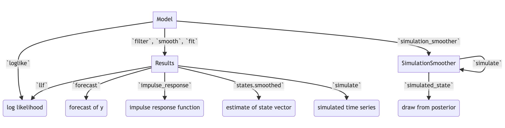
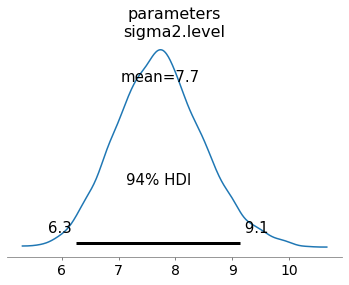
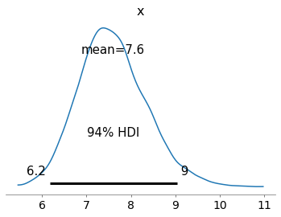
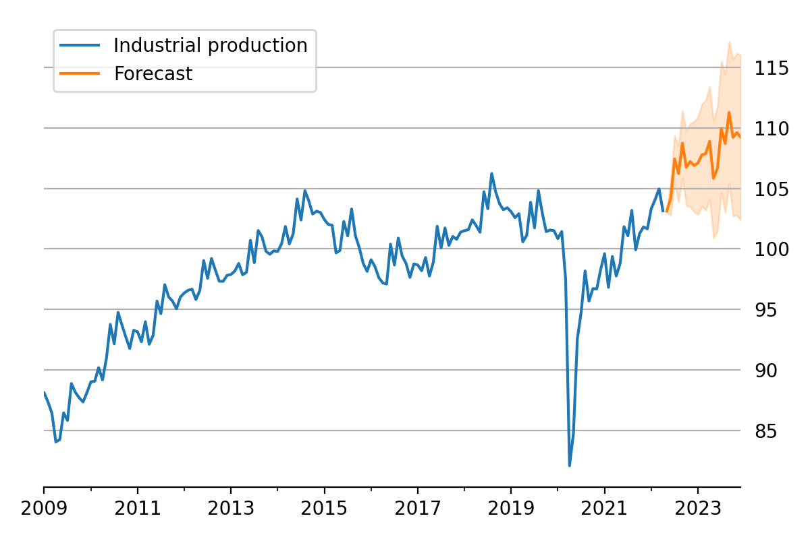
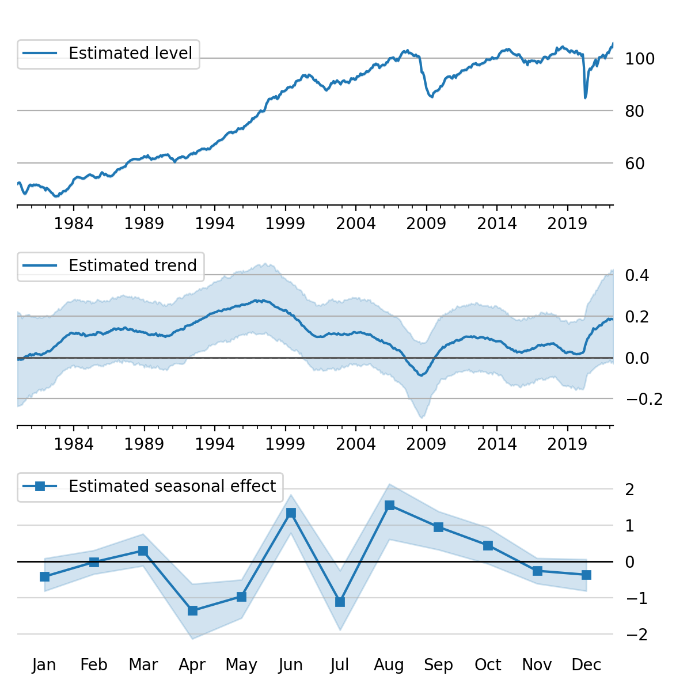
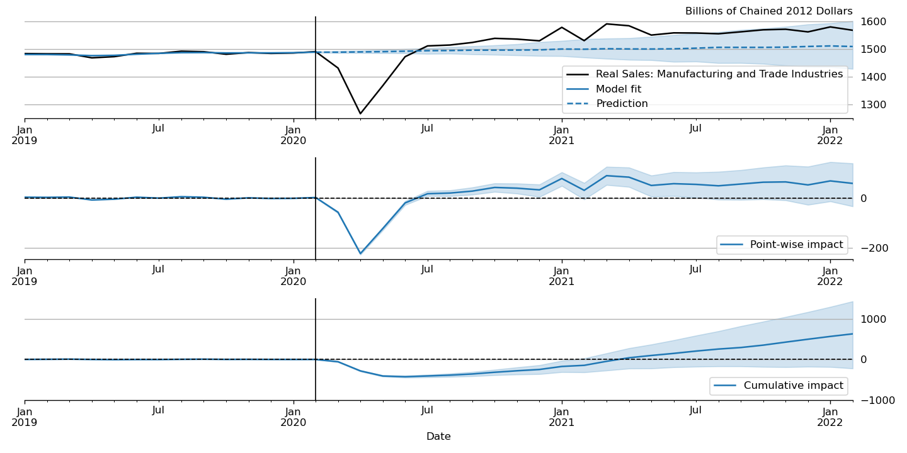

:author: Chad Fulton
:email: chad.t.fulton@frb.gov
:institution: Federal Reserve Board of Governors
:bibliography: mybib

-----------------------------------------------------------------
Bayesian Estimation and Forecasting of Time Series in statsmodels
-----------------------------------------------------------------

.. class:: abstract

   ``Statsmodels``, a Python library for statistical and econometric analysis,
   has traditionally focused on frequentist inference, including in its
   models for time series data. This paper introduces the powerful features
   for Bayesian inference of time series models that exist in ``statsmodels``, with
   applications to model fitting, forecasting, time series decomposition,
   data simulation, and impulse response functions.

.. class:: keywords

   time series, forecasting, bayesian inference, Markov chain Monte Carlo,
   statsmodels

Introduction
------------

``Statsmodels`` :cite:`seabold_statsmodels_2010` is a well-established Python
library for statistical and econometric analysis, with support for a wide range
of important model classes, including linear regression, ANOVA, generalized
linear models (GLM), generalized additive models (GAM), mixed effects models,
and time series models, among many others. In most cases, model fitting proceeds
by using frequentist inference, such as maximum likelihood estimation (MLE). In
this paper, we focus on the class of time series models
:cite:`mckinney_time_2011`, support for which has grown substantially in
``statsmodels`` over the last decade. After introducing several of the most
important new model classes – which are by default fitted using MLE – and
their features – which include forecasting, time series decomposition and
seasonal adjustment, data simulation, and impulse response analysis – we
describe the powerful functions that enable users to apply Bayesian methods to
a wide range of time series models.

Support for Bayesian inference in Python outside of ``statsmodels`` has also grown
tremendously, particularly in the realm of probabilistic programming, and
includes powerful libraries such as
``PyMC3`` :cite:`salvatier_probabilistic_2016`, ``PyStan`` :cite:`carpenter_stan_2017`,
and ``TensorFlow Probability`` :cite:`dillon_tensorflow_2017`. Meanwhile,
``ArviZ`` :cite:`kumar_arviz_2019` provides many excellent tools for associated
diagnostics and vizualisations. The aim of these libraries is to provide support
for Bayesian analysis of a large class of models, and they make available both
advanced techniques, including auto-tuning algorithms, and flexible model
specification. By contrast, here we focus on simpler techniques. However, while
the libraries above do include some support for time series models, this has not
been their primary focus. As a result, introducing Bayesian inference for the
well-developed stable of time series models in ``statsmodels``, and providing
access to the rich associated feature set already mentioned, presents a
complementary option to these more general-purpose libraries. [#]_

.. [#] In addition, it is possible to combine the sampling algorithms of PyMC3
       with the time series models of ``statsmodels``, although we will not
       discuss this approach in detail here. See, for example,
       https://www.statsmodels.org/v0.13.0/examples/notebooks/generated/statespace_sarimax_pymc3.html.

Time series analysis in ``statsmodels``
---------------------------------------

A time series is a sequence of observations ordered in time, and time series
data appear commonly in statistics, economics, finance, climate science,
control systems, and signal processing, among many other fields. One
distinguishing characteristic of many time series is that observations that are
close in time tend to be more correlated, a feature known as autocorrelation.
While successful analyses of time series data must account for this, statistical
models can harness it to decompose a time series into trend, seasonal, and
cyclical components, produce forecasts of future data, and study the propagation
of shocks over time.

We now briefly review the models for time series data that are available in
``statsmodels`` and describe their features. [#]_

.. [#] In addition to statistical models, ``statsmodels`` also provides a number
       of tools for exploratory data analysis, diagnostics, and hypothesis
       testing related to time series data; see
       https://www.statsmodels.org/stable/tsa.html.

Exponential smoothing models
''''''''''''''''''''''''''''

Exponential smoothing models are constructed by combining one or more simple
equations that each describe some aspect of the evolution of univariate
time series data. While originally somewhat *ad hoc*, these models can be
defined in terms of a proper statistical model (for example, see
:cite:`hyndman_forecasting_2008`). They have enjoyed
considerable popularity in forecasting (for example, see the implementation in
R described by :cite:`hyndman2018forecasting`). A prototypical example that
allows for trending data and a seasonal component – often known as the additive
"Holt-Winters' method" – can be written as

.. math::

   \begin{aligned}
   l_t & = \alpha (y_t - s_{t-m}) + (1 - \alpha) ( l_{t-1} + b_{t-1} ) \\
   b_t & = \beta (l_t - l_{t-1}) + (1 - \beta) b_{t-1} \\
   s_t & = \gamma (y_t - l_{t-1} - b_{t-1}) + (1 - \gamma) s_{t-m}
   \end{aligned}

where :math:`l_t` is the level of the series, :math:`b_t` is the trend,
:math:`s_t` is the seasonal component of period :math:`m`, and
:math:`\alpha, \beta, \gamma` are parameters of the model. When augmented with
an error term with some given probability distribution (usually Gaussian),
likelihood-based inference can be used to estimate the parameters.
In ``statsmodels``, additive exponential smoothing models
can be constructed using the :code:`statespace.ExponentialSmoothing` class. [#]_
The following code shows how to apply the additive Holt-Winters model above to
model quarterly data on consumer prices:

.. code-block:: python

   import statsmodels.api as sm
   # Load data
   mdata = sm.datasets.macrodata.load().data
   # Compute annualized consumer price inflation
   y = np.log(mdata['cpi']).diff().iloc[1:] * 400

   # Construct the Holt-Winters model
   model_hw = sm.tsa.statespace.ExponentialSmoothing(
      y, trend=True, seasonal=12)

.. [#] A second class, :code:`ETSModel`, can also be used for both additive and
       multiplicative models, and can exhibit superior performance with maximum
       likelihood estimation. However, it lacks some of the features relevant
       for Bayesian inference discussed in this paper.

Structural time series models
'''''''''''''''''''''''''''''

Structural time series models, introduced by :cite:`harvey_forecasting_1990`
and also sometimes known as unobserved components models, similarly decompose a
univariate time series into trend, seasonal, cyclical, and irregular components:

.. math::

   y_t = \mu_t + \gamma_t + c_t + \varepsilon_t

where :math:`\mu_t` is the trend, :math:`\gamma_t` is the seasonal component,
:math:`c_t` is the cyclical component, and
:math:`\varepsilon_t \sim N(0, \sigma^2)` is the error term. However, this
equation can be augmented in many ways, for example to include explanatory
variables or an autoregressive component. In addition, there are many possible
specifications for the trend, seasonal, and cyclical components, so that a wide
variety of time series characteristics can be accommodated. In ``statsmodels``,
these models can be constructed from the :code:`UnobservedComponents` class; a
few examples are given in the following code:

.. code-block:: python

   # "Local level" model
   model_ll = sm.tsa.UnobservedComponents(y, 'llevel')
   # "Local linear trend", with seasonal component
   model_arma11 = sm.tsa.UnobservedComponents(
      y, 'lltrend', seasonal=4)

These models have become popular for time series analysis and forecasting, as
they are flexible and the estimated components are intuitive. Indeed, Google's
Causal Impact library :cite:`brodersen_inferring_2015` uses a Bayesian
structural time series approach directly, and Facebook's Prophet library
:cite:`taylor_forecasting_2017` uses a conceptually similar framework and is
estimated using PyStan.

Autoregressive moving-average models
''''''''''''''''''''''''''''''''''''

Autoregressive moving-average (ARMA) models, ubiquitous in time series
applications, are well-supported in ``statsmodels``, including their
generalizations, abbreviated as "SARIMAX", that allow for integrated time series
data, explanatory variables, and seasonal effects. [#]_ A general version of
this model, excluding integration, can be written as

.. math::

   \begin{aligned}
   y_t & = x_t \beta + \xi_t \\
   \xi_t & = \phi_1 \xi_{t-1} + \dots + \phi_p \xi_{t-p}
   + \varepsilon_t + \theta_1 \varepsilon_{t-1} + \dots + \theta_q \varepsilon_{t-q}
   \end{aligned}

where :math:`\varepsilon_t \sim N(0, \sigma^2)`. These are constructed in
``statsmodels`` with the :code:`ARIMA` class; the following code shows how to
construct a variety of autoregressive moving-average models for consumer price
data:

.. code-block:: python

   # AR(2) model
   model_ar2 = sm.tsa.ARIMA(y, order=(2, 0, 0))
   # ARMA(1, 1) model with explanatory variable
   X = mdata['realint']
   model_arma11 = sm.tsa.ARIMA(
      y, order=(1, 0, 1), exog=X)
   # SARIMAX(p, d, q)x(P, D, Q, s) model
   model_sarimax = sm.tsa.ARIMA(
      y, order=(p, d, q), seasonal_order=(P, D, Q, s))

.. [#] Note that in ``statsmodels``, models with explanatory variables are in the
       form of "regression with SARIMA errors".

While this class of models often produces highly competitive forecasts, it does
not produce a decomposition of a time series into, for example, trend and
seasonal components.

Vector autoregressive models
''''''''''''''''''''''''''''

While the SARIMAX models above handle univariate series, ``statsmodels`` also has
support for the multivariate generalization to vector autoregressive (VAR)
models. [#]_ These models are written

.. math::

   y_t = \nu + \Phi_1 y_{t-1} + \dots + \Phi_p y_{t-p} + \varepsilon_t

where :math:`y_t` is now considered as an :math:`m \times 1` vector. As a result,
the intercept :math:`\nu` is also an :math:`m \times 1` vector, the
coefficients :math:`\Phi_i` are each :math:`m \times m` matrices, and the error
term is :math:`\varepsilon_t \sim N(0_m, \Omega)`, with :math:`\Omega` an
:math:`m \times m` matrix. These models can be constructed in ``statsmodels``
using the :code:`VARMAX` class, as follows [#]_

.. code:: python

   # Multivariate dataset
   z = (np.log(mdata['realgdp', 'realcons', 'cpi'])
          .diff().iloc[1:])

   # VAR(1) model
   model_var = sm.tsa.VARMAX(z, order=(1, 0))

.. [#] ``statsmodels`` also supports vector moving-average (VMA) models using the
       same model class as described here for the VAR case, but, for brevity,
       we do not explicitly discuss them here.
.. [#] A second class, :code:`VAR`, can also be used to fit VAR models, using
       least squares. However, it lacks some of the features relevant for
       Bayesian inference discussed in this paper.

Dynamic factor models
'''''''''''''''''''''

``statsmodels`` also supports a second model for multivariate time series: the
dynamic factor model (DFM). These models, often used for dimension reduction,
posit a few unobserved factors, with autoregressive dynamics, that are used to
explain the variation in the observed dataset. In ``statsmodels``, there are two
model classes, :code:`DynamicFactor`` and :code:`DynamicFactorMQ`, that can fit
versions of the DFM. Here we focus on the :code:`DynamicFactor` class, for which
the model can be written

.. math::

   \begin{aligned}
   y_t & = \Lambda f_t + \varepsilon_t \\
   f_t & = \Phi_1 f_{t-1} + \dots + \Phi_p f_{t-p} + \eta_t
   \end{aligned}

Here again, the observation is assumed to be :math:`m \times 1`, but the
factors are :math:`k \times 1`, where it is possible that :math:`k << m`. As
before, we assume conformable coefficient matrices and Gaussian errors.

The following code shows how to construct a DFM in ``statsmodels``

.. code:: python

   # DFM with 2 factors that evolve as a VAR(3)
   model_dfm = sm.tsa.DynamicFactor(
      z, k_factors=2, factor_order=3)

Linear Gaussian state space models
''''''''''''''''''''''''''''''''''

   Selected functionality of state space models in statsmodels. :label:`ssmflow`

In ``statsmodels``, each of the model classes introduced above (
:code:`statespace.ExponentialSmoothing`, :code:`UnobservedComponents`,
:code:`ARIMA`, :code:`VARMAX`, :code:`DynamicFactor`, and
:code:`DynamicFactorMQ`) are implemented as part of a broader class of models,
referred to as linear Gaussian state space models (hereafter for brevity, simply
"state space models" or SSM). This class of models can be written as

.. math::

   \begin{aligned}
   y_t & = d_t + Z_t \alpha_t + \varepsilon_t \qquad \quad \varepsilon_t \sim N(0, H_t) \\
   \alpha_{t+1} & = c_t + T_t \alpha_t + R_t \eta_t \qquad \eta_t \sim N(0, Q_t) \\
   \end{aligned}

where :math:`\alpha_t` represents an unobserved vector containing the "state" of
the dynamic system. In general, the model is multivariate, with :math:`y_t` and :math:`\varepsilon_t` :math:`m \times 1` vector, :math:`\alpha_t`
:math:`k \times 1`, and :math:`\eta_t` `r \times 1`.

Powerful tools exist for state space models to estimate the
values of the unobserved state vector, compute the value of the likelihood
function for frequentist inference, and perform posterior sampling for Bayesian
inference. These tools include the celebrated Kalman filter and smoother and
a simulation smoother, all of which are important for conducting Bayesian
inference for these models. [#]_ The implementation in ``statsmodels`` largely follows
the treatment in :cite:`durbin_time_2012`, and is described in more detail in
:cite:`fulton_estimating_2015`.

.. [#] ``Statsmodels`` currently contains two implementations of simulation
   smoothers for the linear Gaussian state space model. The default is the
   "mean correction" simulation smoother of :cite:`durbin_simple_2002`. The
   precision-based simulation smoother of :cite:`chan_efficient_2009` can
   alternatively be used by specifying ``method='cfa'`` when creating the
   simulation smoother object.

In addition to these key tools, state space models also admit general
implementations of useful features such as forecasting, data simulation, time
series decomposition, and impulse response analysis. As a consequence, each of
these features extends to each of the time series models described above. Figure
:ref:`ssmflow` presents a diagram showing how to produce these features, and
the code below briefly introduces a subset of them.

.. code-block:: python

   # Construct the Model
   model_ll = sm.tsa.UnobservedComponents(y, 'llevel')

   # Construct a simulation smoother
   sim_ll = model_ll.simulation_smoother()

   # Parameter values (variance of error and
   # variance of level innovation, respectively)
   params = [4, 0.75]

   # Compute the log-likelihood of these parameters
   llf = model_ll.loglike(params)

   # `smooth` applies the Kalman filter and smoother
   # with a given set of parameters and returns a
   # Results object
   results_ll = model_ll.smooth(params)

   # Produce forecasts for the next 4 periods
   fcast = results_ll.forecast(4)

   # Produce a draw from the posterior distribution
   # of the state vector
   sim_ll.simulate()
   draw = sim_ll.simulated_state

Nearly identical code could be used for any of the model classes introduced
above, since they are all implemented as part of the same state space model
framework. In the next section, we show how these features can be used to
perform Bayesian inference with these models.

..
   Model
   - Known parameters: `update`, `filter` or `smooth`
   - Frequentist inference: `fit`
   - Bayesian inference: 
   Results

..
   Features:

   - Fitting / loglikelihood (need the latter in the Bayesian section)
   - Forecast
   - Simulate
      + Simulation smoother
   - States (i.e. time series decomposition)
   - Impulse responses
   - News

Bayesian inference via Markov chain Monte Carlo
-----------------------------------------------

We begin by giving a cursory overview of the key elements of Bayesian
inference required for our purposes here. [#]_ In brief, the Bayesian approach
stems from Bayes' theorem, in which the posterior distribution for an object of
interest is derived as proportional to the combination of a prior distribution
and the likelihood function

.. math::

   \underbrace{p(A | B)}_\text{posterior}
     \propto \underbrace{p(B | A)}_\text{likelihood}
     \times \underbrace{p(A)}_\text{prior}

Here, we will be interested in the posterior distribution of the parameters
of our model and of the unobserved states, conditional on the chosen model
specification and the observed time series data. While in most cases the form
of the posterior cannot be derived analytically, simulation-based methods such
as Markov chain Monte Carlo (MCMC) can be used to draw samples that approximate
the posterior distribution nonetheless. While PyMC3, PyStan, and TensorFlow
Probability emphasize Hamiltonian Monte Carlo (HMC) and no-U-turn sampling
(NUTS) MCMC methods, we focus on the simpler random walk Metropolis-Hastings
(MH) and Gibbs sampling (GS) methods. These are standard MCMC methods that
have enjoyed great success in time series applications and which are simple to
implement, given the state space framework already available in ``statsmodels``.
In addition, the ArviZ library is designed to work with MCMC output from any
source, and we can easily adapt it to our use.

With either Metropolis-Hastings or Gibbs sampling, our procedure will produce a
sequence of sample values (of parameters and / or the unobserved state vector)
that approximate draws from the posterior distribution arbitrarily well, as the
number of length of the chain of samples becomes very large.

.. [#] While a detailed description of these issues is out of the scope of this
       paper, there are many superb references on this topic. We refer the
       interested reader to :cite:`west_bayesian_1999`, which provides a
       book-length treatment of Bayesian inference for state space models, and
       :cite:`kim_state-space_1999`, which provides many examples and
       applications.

Random walk Metropolis-Hastings
'''''''''''''''''''''''''''''''

In random walk Metropolis-Hastings (MH), we begin with an arbitrary point as the
initial sample, and then iteratively construct new samples in the chain as
follows. At each iteration, (a) construct a proposal by perturbing the previous
sample by a Gaussian random variable, and then (b) accept the proposal with some
probability. If a proposal is accepted, it becomes the next sample in the chain,
while if it is rejected then the previous sample value is carried over. Here, we
show how to implement Metropolis-Hastings estimation of the variance parameter
in a simple model, which only requires the use of the log-likelihood
computation introduced above.

.. code-block:: python

   import arviz as az
   from scipy import stats
   
   # Construct the model
   model_rw = sm.tsa.UnobservedComponents(y, 'rwalk')

   # Specify the prior distribution. With MH, this
   # can be freely chosen by the user
   prior = stats.uniform(0.0001, 100)

   # Specify the Gaussian perturbation distribution
   perturb = stats.norm(scale=0.1)

   # Storage
   niter = 100000
   samples_rw = np.zeros(niter + 1)

   # Initialization
   samples_rw[0] = y.diff().var()
   llf = model_rw.loglike(samples_rw[0])
   prior_llf = prior.logpdf(samples_rw[0])

   # Iterations
   for i in range(1, niter + 1):
      # Compute the proposal value
      proposal = samples_rw[i - 1] + perturb.rvs()
      
      # Compute the acceptance probability
      proposal_llf = model_rw.loglike(proposal)
      proposal_prior_llf = prior.logpdf(proposal)
      accept_prob = np.exp(
         proposal_llf - llf
         + prior_llf - proposal_prior_llf)
      
      # Accept or reject the value
      if accept_prob > stats.uniform.rvs():
         samples_rw[i] = proposal
         llf = proposal_llf
         prior_llf = proposal_prior_llf
      else:
         samples_rw[i] = samples_rw[i - 1]
         
   # Convert for use with ArviZ and plot posterior
   samples_rw = az.convert_to_inference_data(
      samples_rw)
   # Eliminate the first 10000 samples as burn-in;
   # thin by factor of 10 to reduce autocorrelation
   az.plot_posterior(samples_rw.posterior.sel(
      {'draw': np.s_[10000::10]}), kind='bin',
      point_estimate='median')

   Approximate posterior distribution of variance parameter, random walk model, Metropolis-Hastings; CPI inflation. :label:`mhsamples`

The approximate posterior distribution, constructed from the sample chain,
is shown in Figure :ref:`mhsamples`.

Gibbs sampling
''''''''''''''

Gibbs sampling (GS) is a special case of Metropolis-Hastings (MH) that is
applicable when it is possible to produce draws directly from the conditional
distributions of every variable, even though it is still not possible to derive
the general form of the joint posterior. While this approach can be superior to
random walk MH when it is applicable, the ability to derive the conditional
distributions typically requires the use of a "conjugate" prior – i.e., a prior
from some specific family of distributions. For example, above we specified a
uniform distribution as the prior when sampling via MH, but that is not possible
with Gibbs sampling. Here, we show how to implement Gibbs sampling estimation of
the variance parameter, now making use of an inverse Gamma prior, and the
simulation smoother introduced above.

   Approximate posterior joint distribution of variance parameters, local level model, Gibbs sampling; CPI inflation. :label:`gssamples`

.. code-block:: python

   # Construct the model and simulation smoother
   model_ll = sm.tsa.UnobservedComponents(y, 'llevel')
   sim_ll = model_ll.simulation_smoother()

   # Specify the prior distributions. With GS, we must
   # choose an inverse Gamma prior for each variance
   priors = [stats.invgamma(0.01, scale=0.01)] * 2

   # Storage
   niter = 100000
   samples_ll = np.zeros((niter + 1, 2))

   # Initialization
   samples_ll[0] = [y.diff().var(), 1e-5]

   # Iterations
   for i in range(1, niter + 1):
      # (a) Update the model parameters
      model_ll.update(samples_ll[i - 1])

      # (b) Draw from the conditional posterior of
      # the state vector
      sim_ll.simulate()
      sample_state = sim_ll.simulated_state.T

      # (c) Compute / draw from conditional posterior
      # of the parameters:
      # ...observation error variance
      resid = y - sample_state[:, 0]
      post_shape = len(resid) / 2 + 0.01
      post_scale = np.sum(resid**2) / 2 + 0.01
      samples_ll[i, 0] = stats.invgamma(
         post_shape, scale=post_scale).rvs()

      # ...level error variance
      resid = sample_state[1:] - sample_state[:-1]
      post_shape = len(resid) / 2 + 0.01
      post_scale = np.sum(resid**2) / 2 + 0.01
      samples_ll[i, 1] = stats.invgamma(
         post_shape, scale=post_scale).rvs()

   # Convert for use with ArviZ and plot posterior
   samples_ll = az.convert_to_inference_data(
      {'parameters': samples_ll[None, ...]},
      coords={'parameter': model_ll.param_names},
      dims={'parameters': ['parameter']})
   az.plot_pair(samples_ll.posterior.sel(
      {'draw': np.s_[10000::10]}), kind='hexbin');

The approximate posterior distribution, constructed from the sample chain,
is shown in Figure :ref:`gssamples`.

Illustrative examples
---------------------

For clarity and brevity, the examples in the previous section gave results for
simple cases. However, these basic methods carry through to each of the models
introduced earlier, including in cases with multivariate data and hundreds of
parameters. Moreover, the Metropolis-Hastings approach can be combined with
the Gibbs sampling approach, so that if the end user wishes to use Gibbs
sampling for some parameters, they are not restricted to choose only conjugate
priors for all parameters.

In addition to sampling the posterior distributions of the parameters, this
method allows sampling other objects of interest, including forecasts of
observed variables, impulse response functions, and the unobserved state vector.
This last possibility is especially useful in cases such as the structural time
series model, in which the unobserved states correspond to interpretable
elements such as the trend and seasonal components. We provide several
illustrative examples of the various types of analysis that are possible.

Forecasting and Time Series Decomposition
'''''''''''''''''''''''''''''''''''''''''

   Data and forecast with 80% credible interval; U.S. Industrial Production. :label:`indproforecast`

   Estimated level, trend, and seasonal components, with 80% credible interval; U.S. Industrial Production. :label:`indproleveltrend`

   "Causal impact" of COVID-19 on U.S. Sales in Manufacturing and Trade Industries. :label:`causalimpact`

In our first example, we apply the Gibbs sampling approach to a
structural time series model in order to forecast U.S. Industrial Production
and to produce a decomposition of the series into level, trend, and seasonal
components. The model is

.. math::

   \begin{aligned}
   \hspace{7.5em} y_t & = \mu_t + \gamma_t + \varepsilon_t & \hspace{2em} \text{observation equation} \\
   \mu_t & = \beta_t + \mu_{t-1} + \zeta_t & \text{level} \\
   \beta_t & = \beta_{t-1} + \xi_t & \text{trend} \\
   \gamma_t & = \gamma_{t-s} + \eta_t & \text{seasonal} 
   \end{aligned}

Here, we set the seasonal periodicity to `s=12`, since Industrial Production is
a monthly variable. We can construct this model in Statsmodels as [#]_

.. code-block:: python

   model = sm.tsa.UnobservedComponents(
      y, 'lltrend', seasonal=12)

.. [#] This model is often referred to as a "local linear trend" model (with
   additionally a seasonal component); `lltrend` is an abbreviation of this
   name.

To produce the time-series decomposition into level, trend, and seasonal
components, we will use samples from the posterior of the state vector
:math:`(\mu_t, \beta_t, \gamma_t)` for each time period :math:`t`. These are
immediately available when using the Gibbs sampling approach; in the earlier
example, the draw at each iteration was assigned to the variable `sample_state`.
To produce forecasts, we need to draw from the posterior predictive
distribution for horizons :math:`h = 1, 2, \dots H`. This can
be easily accomplished by using the `simulate` method introduced earlier. To be
concrete, we can accomplish these tasks by modifying section (b) of our Gibbs
sampler iterations as follows:

.. code-block:: python
   
    # (b') Draw from the conditional posterior of
    # the state vector
    model.update(params[i - 1])
    sim.simulate()
    # save the draw for use later in time series
    # decomposition
    states[i] = sim.simulated_state.T

    # Draw from the posterior predictive distribution
    # using the `simulate` method
    n_fcast = 48
    fcast[i] = model.simulate(
       params[i - 1], n_fcast,
       initial_state=states[i, -1]).to_frame()

These forecasts and the decomposition into level, trend, and seasonal components
are summarized in Figures :ref:`indproforecast` and :ref:`indproleveltrend`,
which show the median values along with 80% credible intervals. Notably, the
intervals shown incorporate for both the uncertainty arising from the stochastic
terms in the model as well as the need to estimate the models' parameters. [#]_

.. [#] The popular Prophet library, :cite:`taylor_forecasting_2017`, similarly
   uses an additive model combined with Bayesian sampling methods to produce
   forecasts and decompositions, although its underlying model is a GAM rather
   than a state space model.

Casual impacts
''''''''''''''

A closely related procedure described in :cite:`brodersen_inferring_2015` uses
a Bayesian structural time series model to estimate the "causal impact" of
some event on some observed variable. This approach stops estimation of the
model just before the date of an event and produces a forecast by drawing from
the posterior predictive density, using the procedure described just above. It
then uses the difference between the actual path of the data and the forecast to
estimate impact of the event.

An example of this approach is shown in Figure :ref:`causalimpact`, in which we
use this method to illustrate the effect of the COVID-19 pandemic on U.S. Sales
in Manufacturing and Trade Industries. [#]_

.. [#] In this example, we used a local linear trend model with no seasonal
   component.

Extensions
----------

There are many extensions to the time series models presented here that are
made possible when using Bayesian inference. First, it is easy to create custom
state space models within the ``statsmodels`` framework. As one example, the
``statsmodels`` documentation describes how to create a model that extends the
typical VAR described above with time-varying parameters. [#]_ These custom
state space models automatically inherit all the functionality described above,
so that Bayesian inference can be conducted in exactly the same way.

.. [#] For details, see https://www.statsmodels.org/devel/examples/notebooks/generated/statespace_tvpvar_mcmc_cfa.html.

Second, because the general state space model available in ``statsmodels`` and
introduced above allows for time-varying system matrices, it is possible using
Gibbs sampling methods to introduce support for automatic outlier handling,
stochastic volatility, and regime switching models, even though these are
largely infeasible in ``statsmodels`` when using frequentist methods such as
maximum likelihood estimation. [#]_

.. [#] See, for example, :cite:`stock_core_2016` for an application of these
       techniques that handles outliers, :cite:`kim_stochastic_1998` for
       stochastic volatility, and :cite:`kim_business_1998` for
       an application to dynamic factor models with regime switching.

Conclusion
----------

This paper introduces the suite of time series models available in ``statsmodels``
and shows how Bayesian inference using Markov chain Monte Carlo methods can be
applied to estimate their parameters and produce analyses of interest, including
time series decompositions and forecasts.

References
----------
