:author: Chiranth Siddappa
:email: csiddapp@uccs.edu
:institution: University of Colorado Colorado Springs
:corresponding:

:author: Mark Wickert
:email: mwickert@uccs.edu
:institution: University of Colorado Colorado Springs
:bibliography: caf

---------------------------------------------
CAF Implementation on FPGA Using Python Tools
---------------------------------------------

.. class:: abstract

.. include:: ./papers/chiranth_siddappa/abstract.txt

.. class:: keywords

.. include:: ./papers/chiranth_siddappa/keywords.txt

Introduction
============

In this investigation, the pre-processing steps of downsampling and filtering are simulated and considered outside of
the scope of this project.
In the case of geolocation systems, the use of collectors and reference emitters are used to create geometries that will
allow for the detection of Doppler and movement in the signal. The Doppler is used to calculate a frequency difference
of arrival (FDOA).
Then, cross correlations can be used to determine the time delay by denoting the peak location of the resulting output
as a time delay of arrival (TDOA).
The goal of this project is to be able to provide a real time solution for FDOA and TDOA.
The basic algorithm for calculating the complex ambiguity function for time difference of arrival and frequency offset (CAF)
has been well known since the early 1980's :cite:`stein-orig`. In many radio frequency applications, there is a need to
find a time lag of the signal or the frequency offset of a signal.
The reader would be familiar with a form of frequency offset known as Doppler as a common example.
The CAF is the joint time offset and frequency offset generalization.
The CAF was mainly used first for radar and sonar type processing for locating objects using a method known as active echo
location :cite:`knight-sonar`.
In this scenario, a matched filter design would be used to ensure that the signals match :cite:`weiss-waves`.
More commonly with newer radio frequency systems such as GPS, similar but orthogonal signals are transmitted in the same
frequency range.
Because of the property of orthogonal signals not cross correlating they do not collide with one another, and they are
an optimal signal type for testing this application :cite:`ZiemerComm`.

Motivation
==========
The CAF has many practical applications, the more traditional being the aforementioned radar and sonar type systems,
with a similar use case in image processing. The use of cross-correlations in the form of the dot product to find
similarities is the same theoretical basis for our use in geolocation.
In the particular case of geolocation systems, the use of collectors and reference emitters are used to create
geometries that will allow for the detection of Doppler and movement in the signal.
This method of calculation has yet to be simplified.
Currently GPU's have been employed as the main workhorse due to the availability as a co-prorcessor.
But the use of the FPGA has always been an attractive alternative due to the high configurability of the hardware options,
but comes with much higher up front design cost :cite:`Hennessy`. For design cost, we are primarily concerned with the
development time for code that can be written in C syntax in the form of OpenCL or CUDA for a GPU, as compared to using an
HDL which will require background in digital logic and testing that must occur on hardware directly.

To geolocate a signal emitter's location the Doppler is used to calculate a frequency difference of arrival (FDOA) which
represents a satellite's drift.
Then, cross correlations can be used to determine the time delay by denoting the peak of the resulting output as a time
delay of arrival (TDOA).
The refernce signal will be different for every use case, which motivates the need to ensure
that the resulting Verilog hardware description language (HDL)
module output can also be produced to match necessary configurations :cite:`verilogIEEE`.
This became a project goal motivated off work done by other projects to be able to produce code in other languages
:cite:`codegen`.
Thus, the solution provided must be able to be reconfigured based off of different needs.
The processing for this system will be targeted to a PYNQ board manufactured by Xilinx, but has been designed such that
it can be synthesized to any target device.
All Verilog HDL modules that are produced by the Python classes conform to the AXI bus standards of interfacing
:cite:`axi4`. This allows for a streamlined plug and play connection between all the modules and is the basis of the
templating that is implemented with the help of Jinja.

Starting Point
==============
The main concepts necessary for the understanding of the CAF are topics that are covered in Modern Digital Signal
Processing, Communication Systems, and a digital design course. These concepts would be the Fast Fourier Transform
(FFT), integration in both infinite and discrete forms, frequency shifting, and digital design.
This project will show a working implementation of digital design HDL modules implementing the
logic accurately with this given knowledge. Given the mathematical background of this project, it is crucial to have a way to
test implementations against theory. This is the motivation for the discussion of using Python to help generate code
and test benches.

Project Overview
================
The goal of this project was to implement the CAF in an HDL such that the end product can be targeted to any device.
The execution of this goal was taken as a bottom up design approach, and as such the discussion starts from small
elements to larger ones. The steps taken were in the following order:

#. Obtain and generate a working CAF simulation
#. Break simulation into workable modules
#. Design modules
#. Verify and generate with test benches
#. Assemble larger modules
#. Synthesize and Implement using Vivado for the PYNQ-Z1 board

Complex Ambiguity Function
==========================

An example of the signal path in the satellite receiver scenario is described by Fig. :ref:`satellite-diagram-example`.
In this case, an emitted signal is sent to a satellite, and then received and captured by an RF receiver.
Some amount of offset is expected to have happened during the physical relay of the signal back to a receiver within the
broadcast area of the satellite.
The signal is then downconverted and filtered, and then sent to the CAF via a capture buffer.
While a signal is sent through an upconverter and relayed to the satellite, a copy of the same signal must be stored
away as a reference to compute the TDOA and FDOA.
Both the reference and capture blocks are abstractions, and have individual modules written in Verilog to handle the
storage of these signals.

Another very specific example of the satellite receiver scenario is described by Fig. :ref:`satellite-diagram-example-gps`.
In this scenario, we see that no emitter exists, yet a reference signal is able to be sent to the CAF for TDOA and FDOA
calculations. This is because GPS signals use a PRN sequence as ranging codes, and the taps for the signals are provided
to the user :cite:`gpsgov`.
This provides a significant processing gain as the expected sequence can be computed in real time or stored locally.
This project takes advantage of these signals through the use of gps-helper :cite:`gps-helper`.

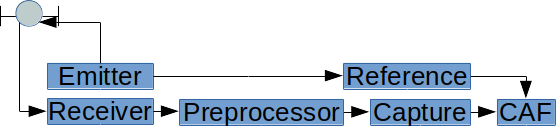

   Satellite Block Diagram for Emitter and Receiver. :label:`satellite-diagram-example`

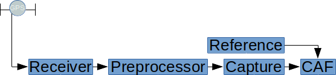

   Satellite Block Diagram for CAF with GPS Signal. :label:`satellite-diagram-example-gps`

As a basis for what the rest of this paper is describing, an overview of the CAF and the various forms of computing are provided.

The general form of the CAF is:

.. math::

   \chi (\tau ,f)=\int _{{-\infty }}^{\infty }s(t)s^{*}(t-\tau )e^{{i2\pi (f/f_s)t}}\,dt,\ \frac{-f_s}{2} < f < \frac{f_s}{2}

The equation describes both a time offset :math:`\tau` and a frequency offset :math:`f` that are used to create a
surface. The frequency shift :math:`f` is bounded by half the sampling rate.
The discrete form is a little simpler, and lends itself to the direct implementation :cite:`hartwellcaf`:

.. math::

   \chi(k, f) = \sum _{n=0}^{N-1}s[n]s^{*}[n - k]e^{i2\pi (f/f_s)(n/N)},\ \frac{-f_s}{2} < f < \frac{f_s}{2}

where :math:`N` is the signal capture window length, :math:`f_s` is the sampling rate in Hz making :math:`f` have units
of Hz and :math:`kD` is a discrete time offset in samples with sample period :math:`1/f_s`. In both the continuous and
discrete-time domains, :math:`\chi` is a function of both time offset and frequency offset.
The symbol :math:`s` represents the signal in question, generally considered to be the reference signal.
The accompanying :math:`s^{*}` is the complex conjugate and time shifted signal.

As an example, a signal that was not time
shifted would simply be the autocorrelation :cite:`ZiemerComm`. It is referred to as the received signal in this context,
and it is the signal that is used to determine both the time and frequency offset. To determine this offset, we are
attempting to shift the signal as close as possible to the original reference signal.
The time offset is what allows for the computation of a TDOA, and the frequency offset is what allows for the
computation of the FDOA.

In this implementation, the frequency offset is created by a signal generator and a complex multiply module that are
both configurable.
Once this offset has been applied, a cross-correlation is applied directly in the form of the dot product.
This eliminates the costly implementation case where an FFT and an inverse FFT are used to produce a result.
The signal generator can supply a specified frequency step and accuracy with configuration of the signal generator class
:cite:`caf-verilog`. An example of the signal generator is shown in Fig. :ref:`dds-one`.
The resulting spectrum is shown in Fig. :ref:`sig-gen`. This satisfies the frequency (:math:`f`) portion of the equation.
The complex multiply module is similarly configurable for different bit widths through the complex multiply generator
class :cite:`caf-verilog`.
An example CAF surface is provided in Fig. :ref:`caf-surface-example` showing how the energy of the signal is spread over
both frequency and time. This type of visualization is very useful for real-world signals with associated noise. In
this project, care was taken in truncation choices to ensure that the correlation summation ensures signal energy
retention.
In this project, the CAF module that has been implemented will return a time offset index and frequency offset index
back to the user based off provided build parameters shown in the code listing for the Python class `CAF`,
described in a later section for the CAF Module.
When writing the module, all simulation and testing was done at the sample by sample level to ensure validity so the CAF
surface was not used in testing. A method for computing the CAF using the dot product and frequency shifts has been
published to the package. This implementation is specific to this project in that it uses a sample size that is twice
that of the reference signal for the computation. A sample output slice will be shown in the Experiments section for the
CAF module in Fig. :ref:`caf-test-signal`.

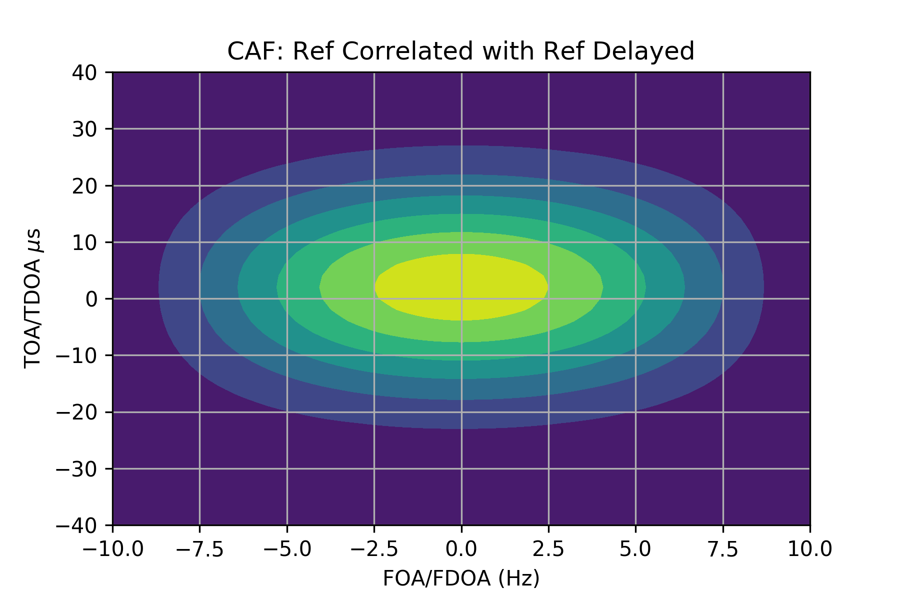

   CAF Surface Example. :label:`caf-surface-example`

Hardware
========

The targeted hardware for this project is the Zynq processor on the PYNQ-Z1 board. However, this project is fully
synthesizable and should be able to be targeted for any other Xilinx board.

Python and PYNQ
---------------

The PYNQ development board designed by Xilinx provides a Zynq chip which has an ARM CPU running at 650 MHz and an FPGA
fabric that is programmable via an overlay :cite:`pynq`.
This performance allows for a linux operating system to be run on the CPU which in this case is Ubuntu, and hosts a Jupyter notebook to program and interface with the FPGA fabric using an
overlay.
This overlay contains mappings for ports and interfaces between the fabric and the CPU.
This functionality is very unique in that both an ARM core and a fabric are on the same board.
As shown by Fig. :ref:`pynq-overlay` the overlay sits between the processing system (CPU) and the programmable logic
(FPGA).
This overlay is loaded and programmed to the fabric through a Jupyter notebook and allows for native
visualization and data interaction through any Python tools that work inside the IPython kernel.
The overlay is represented by the yellow background with labels "Custom" and "Accelerator" and shows how the overlay is
a communication layer between the processing system and the programmable logic.

.. figure:: zynq_block_diagram.jpg

   The PYNQ processing overlay diagram. :cite:`pynq` :label:`pynq-overlay`

It also contains a bitfile that will properly configure the FPGA :cite:`bitfile`.
This bitfile is generated through the Vivado Design Suite that is provided by Xilinx by loading the output modules
from the `caf-verilog` module.
A different bitfile must be created for every unique combination of configuration of the CAF and every device that is
targeted. Every instantiation of the `CAF` Python class that has different parameters will require a new bitfile.

The Jupyter notebook itself is considered an interactive computing pool providing an interface to do
computation and prototyping through a web browser. In this implementation it is meant to be an easier way for a non-hardware oriented person
to be able to access a computational accelerator designed by a hardware engineer :cite:`pynq`.

A diagram of the processing and the programmable logic is shown in Fig. :ref:`pspl`. The processor system is the
Cortex-A9 processor that is running at 650MHz with 512MB of DDR3 RAM. The FPGA is a Zynq XC7020 part which has 13,300
logic slices, 53,200 6-input LUTs, 160,400 flip-flops, 630KB of block RAM, and 220 DSP slices. Later, a usage report is
provided with a description of how the logic was optimized to make use of these primitives. It is possible to access the
DRAM from the programmable logic (FPGA) through an AXI IP Core.

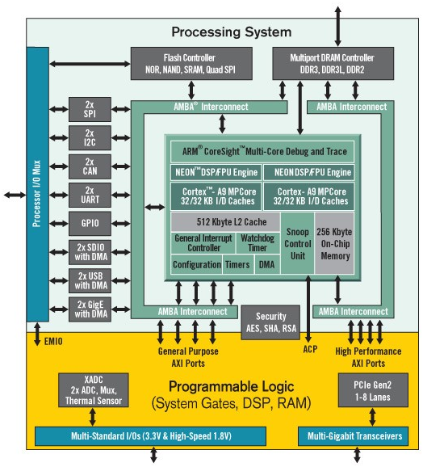

   The PYNQ processing overlay diagram. :cite:`pynq` :label:`pspl`

Software
========

Xilinx Vivado WebPack 2018.2
----------------------------

The Vivado design tool provides a simulator along with the ability to synthesize, elaborate, and implement the design
:cite:`vivadodesignsteps`.
For this project, this built-in simulator was used exclusively.
Other simulators were not chosen because the other target devices that this project seeks to be implemented on are
likely to also be Xilinx products.
The tool is free to download for anyone to use, and allows the hardware engineer to develop and synthesize HDL designs
for Xilinx FPGA's.
There is also a Software Development Kit that allows an engineer to write in C code.
For this project, all modules are written in Verilog.
This was done because of the need to instantiate multiple submodules that provide functionality together.
When running the synthesis tool, the output was very useful in helping make incremental design changes to fully optimize
the board.
Although none were used in this project, Xilinx does offer many free IP Cores that can be used in designs. They are
black boxes that can be used in both simulation and the final implementation in HDL and block designs.

Python and Jupyter
------------------

This project made extensive use of the Python ecosystem through the use of pip, Jupyter, and many other packages. The
reader is encouraged to view the :code:`caf-verilog` source code :cite:`caf-verilog` and view the releases that have been
made on PyPI :cite:`caf-verilog-pypi`.
When designing modules, a first test of what a signal should look like when operated on was done using the interactive
plotting ability that is provided :cite:`jupyter`.
The generation of the modules was done using Jinja which provides both template parsing and rendering :cite:`jinja`.
Whenever a simulated signal was changed, instead of having to write out a file or test bench by hand, a template was
used to create the output and render it to the simulation directory.
The signals that are used to create the signal generator were first quantized by using the NumPy library and then
written to a file that gets used a memory buffer in the signal generator :cite:`numpydev`.
Most of the mathematical operations that are implemented were first verified using this library.
This project requires the use of orthogonal signals to ensure that the spectral density that is being tested is isolated
from the others. This was possible using the gps-helper module that implements the GPS gold codes that are orthogonal
PRN sequences :cite:`gps-helper`.

Quantization
------------

In order to
use a signal in the digital domain, a signal must first be quantized by an analog to digital converter (ADC). Most ADC's
that are available are able to provide a 12-bit value, and some newer devices are now able to provide 16-bits :cite:`adc16`.
However, for this project 12-bit signed signals were used during testing as this is a very nice number to compute mentally and
still provides minimal energy loss when plotting on the spectrum.

Inspecting signals after quantization is important because when signals are reduced in size there is information loss.
This is demonstrated by Fig. :ref:`quant-cos` where a 12 bit and 8 bit quantization of a cosine signal is shown.
Quantization helper functions are provided in caf_verilog with the help of scikit-dsp-comm's simpleQuant function
:cite:`scikit`.
This means that the full bit value of the signal cannot be used otherwise there is signal loss to DC gain. The signals
must be equal over 0. For a 12-bit quantization of a vector for example the numbers must be in the range (-4095, 4095)
in comparison to the two's complement full value of (-4096, 4095). This is all necessary because the computation that is
done on the FPGA will be done using fixed point or an integer value. This also reduces power and cost on the FPGA
:cite:`float2fixed`.
Test files are written out and read back as integer values via this module by all the other classes for tests and
verification.

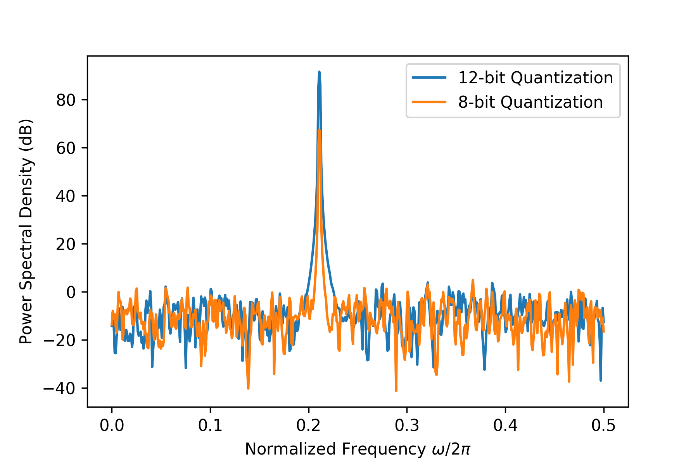

   12-bit and 8-bit Quantization Comparison. :label:`quant-cos`

Complex Multiply
----------------

As an example for why this module is necessary, an example of frequency shifting a signal is presented.
In Fig. :ref:`cpx-multiply-all` we have two inputs: a positive frequency signal on top, and a negative frequency signal
in the middle. The output is shown in the bottom plot.
All of these signals are shown in a spectral density plot, with both sampling frequencies normalized to a value of 1
for presentation.
What we see is that the resulting spectrum has a signal at a frequency of the sum of the two negative and positive
frequency signals. This is what is expected. This method is what is used to shift the captured signal for the CAF.

.. figure:: cpx_multiply_all.png

   Inputs (top and middle) and output (bottom) of the CPX Multiply Verilog module. :label:`cpx-multiply-all`

Signed multiplication in Verilog can be done by specifying the signed data type. Any multiply of two numbers of the same
size requires twice the number of bits in the result :cite:`tumbush-signed`. However, in this project the need for different
size operands arises. This module
takes in two complex numbers and performs a pipelined multiplication on the data.
Before the result is provided to the master, the result is truncated.
It should be noted that no timing constraint violations were encountered during the implementation. The only timing
constraint that was provided was the slew rate for the fabric clock, and all other constraints were Vivado defaults.

The specific pipeline steps are presented in Table :ref:`cpx-multiply-stages` which shows which operations are completed
in which pipeline stage.
Stages 1 and 2 are always conditionally assigned based on the current state of the AXI interface so that resources are
not constantly being used. This helps for timing and for power usage. The result is then truncated and returned to the
master when the master's ready signal is asserted.
Because this is a pipelined implementation, an input and output can be processed every clock.

.. raw:: latex

   \begin{table}
   \renewcommand{\arraystretch}{1.3}
   \caption{CPX Multiply Stages}
   \label{cpx-multiply-stages}
   \centering
   \begin{tabular}{ll}
   \hline
   Stage & Operation \\ \hline
   1 & xi * yi \\
   1 & xq * yq \\
   1 & xi * yq \\
   1 & xq * yi \\
   2 & xu - yv \\
   2 & xv + yu \\
   3 & Truncate
   \end{tabular}
   \end{table}

A code listing of the Verilog HDL output is provided as reference. The two blocks
that are shown are for the first step through the third step. The first two steps can be seen to only be calculated when
the master signal conditions are correct.

.. code-block:: verilog

   always @(posedge clk) begin
      if (m_axis_tvalid & s_axis_tready) begin
         xu <= xi * yi;
         yv <= xq * yq;
         xv <= xi * yq;
         yu <= xq * yi;
      end else begin
         xu <= xu;
         yv <= yv;
         xv <= xv;
         yu <= yu;
      end // else: !if(m_axis_tvalid & s_axis_tready)
   end

   always @(posedge clk) begin
      if(m_axis_tready) begin
         xu_out <= xu;
         yv_out <= yv;
         xv_out <= xv;
         yu_out <= yu;
         i_sub <= xu_out - yv_out;
         i_sub_out <= i_sub;
         q_add <= xv_out + yu_out;
         q_add_out <= q_add;
      end // if (m_axis_tvalid)
      else begin
         xu_out <= xu_out;
         yv_out <= yv_out;
         xv <= xv;
         xv_out <= xv_out;
         yu <= yu;
         yu_out <= yu_out;
         i_sub <= i_sub;
         i_sub_out <= i_sub_out;
         q_add <= q_add;
         q_add_out <= q_add_out;
      end // else: !if(m_axis_tvalid)
      i <= i_sub_out[xi_bits+yi_bits-1:
                     xi_bits+yi_bits-i_bits];
      q <= q_add_out[xq_bits+yq_bits-1:
                     xq_bits+yq_bits-q_bits];
   end // always @ (posedge clk)

Signal Generator
----------------

The signal generator module is implemented using a half sine lookup table and accumulator.
This is commonly known as a numerically controlled oscillator in direct digital synthesis :cite:`dds`.
This module produces a sine wave at the specified frequency by using a modulo counter that increments a phase value at
every clock cycle.
Note that the sampling frequency of the signal, 625kHz, is different from the clock frequency of the
board, at 250MHz.
The number of phase bits that are necessary are determined by the sampling frequency and the frequency resolution
specified by Eq. :ref:`phase-bits`.

.. math::
   :label: phase-bits

   \Big\lceil \log_2\Big(\frac{ f_{\text{clk}} }{ \text{freq\_res} }\Big) \Big\rceil = \text{phase\_bits}

The output of one cycle is shown in Fig. :ref:`dds-one`. The values that are supplied to the module for the lookup table
are generated using the NumPy sine function and are quantized using helper methods included in the caf_verilog module.
To set the frequency of the signal generator, a phase step or increment value must be provided by Eq.
:ref:`phase-increment`.

.. math::
   :label: phase-increment

   \frac{f_\text{out} \cdot 2^{\text{phase\_bits}}}{f_\text{clk}} = \text{phase\_increment}

An example spectrum of the output of the signal generator that is created from the Python class is shown in
Fig. :ref:`sig-gen`.
While no calculation of power has been provided, a parameter n_bits sets the signal strength. For this project, a value
of 8-bits was found to be sufficient to provide a frequency shifted signal. The same settings used to generate the
module used as an example in this section are used in Fig. :ref:`freq-shift-inout` by using the `SigGen` class.

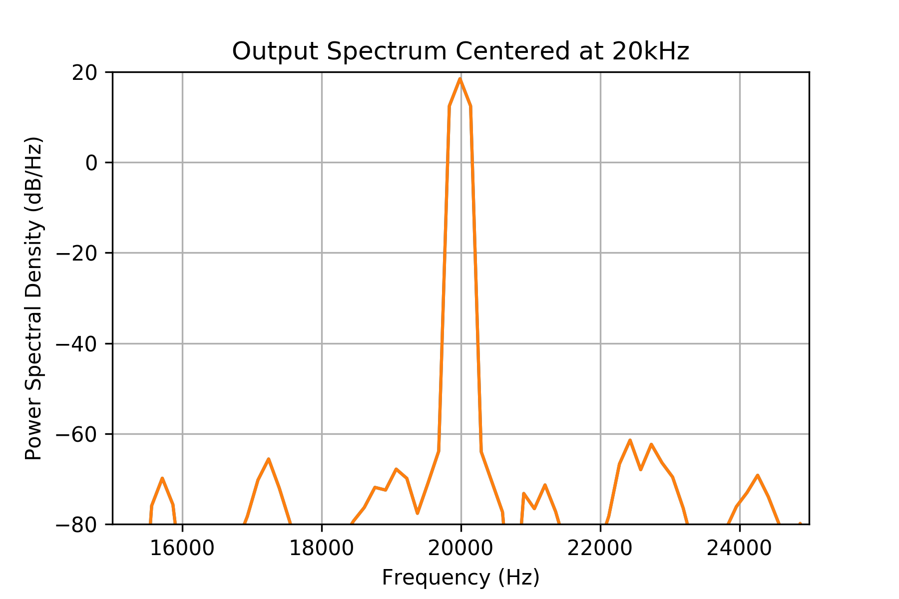

   Cosine centered at 20kHz with 8-bits and 200Hz resolution. :label:`sig-gen`

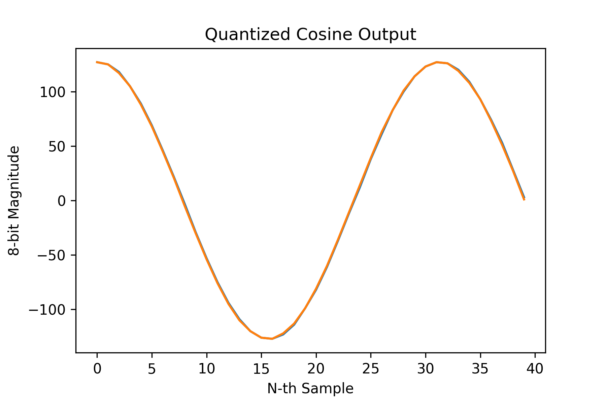

   Cosine centered at 20kHz with 8-bits and 100Hz resolution. :label:`dds-one`

Frequency Shift
---------------

The frequency shift module takes in the same parameters as the signal generator module and adds an input for a complex
value to shift. This module needs to make sure that different bit width signals are multiplied together correctly and
that the pipeline is managed correctly to ensure that there are no phase shifts. Fig. :ref:`freq-shift-inout` shows an
input signal, and the resulting shifted signal. When using the Python generated Verilog module, a negative
value for the frequency will be taken care of by setting a bit in the module parameters to perform the complex conjugate
on the signal generator output.

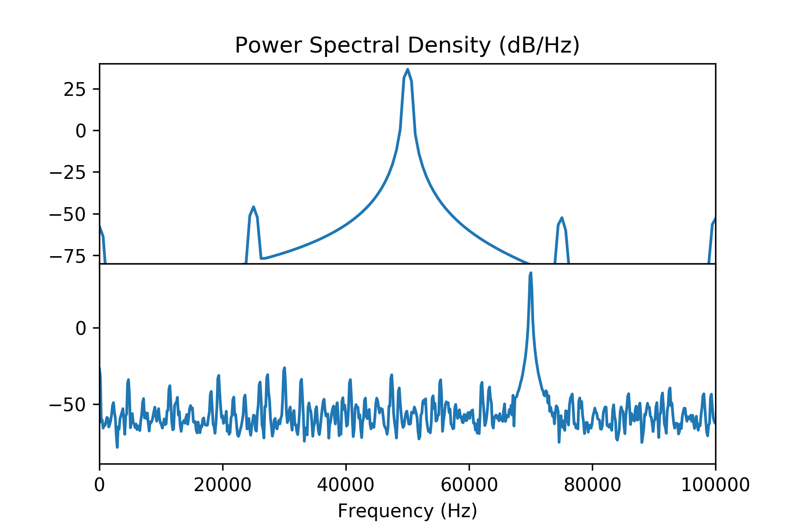

   Input signal at 50kHz (top), and output signal at 70kHz (bottom). :label:`freq-shift-inout`

Required inputs for the `FreqShift` Python class are the input vector 'x', and the number of bits for the I and Q data that it
represents. The same parameters are passed to the `FreqShift` class so that the `SigGen` module can be
instantiated internally and accessed for naming by the Jinja template for the module.

Cross Correlation
-----------------

The cross correlation is useful in comparing the time offset between two signals.
As an example, a pseudorandom sequence signal provided by gps-helper :cite:`gps-helper` is time shifted in Fig.
:ref:`prn-seq` by ten samples.
Both of these signals are a non-return to zero representation of the binary bit sequence.
The reference is shown with zero padding on either end so the visual representation stays centered between the two
signals.

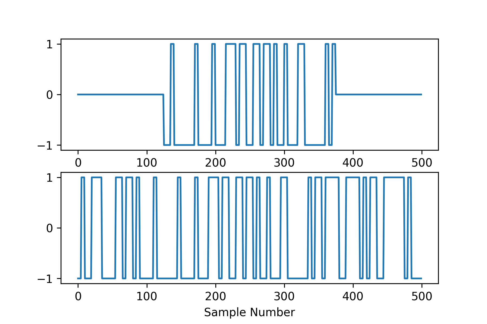

   A reference and received signal (top and bottom) simulated from a PRN sequence from gps-helper. :label:`prn-seq`

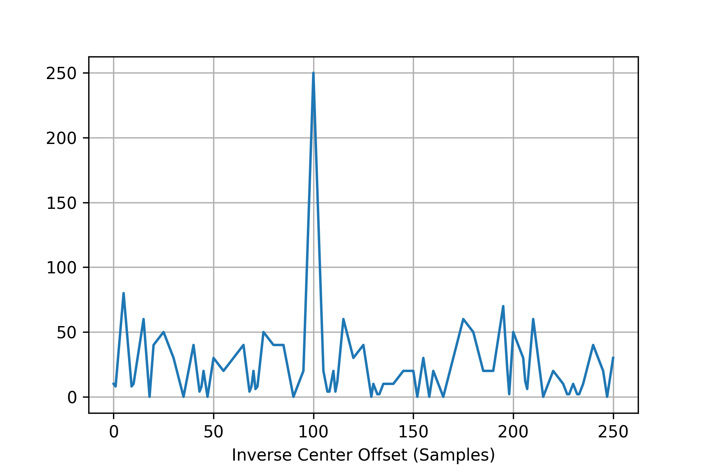

   The cross correlation of two simulated signals, showing a positive offset of 25 samples using xcorr. :label:`xcorr`

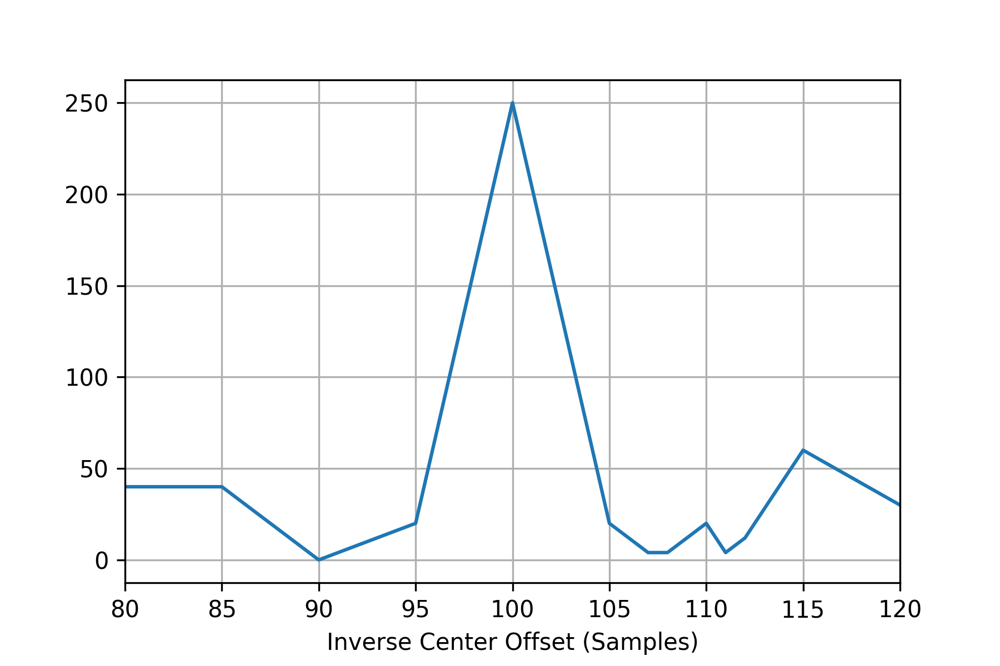

   Cross correlated output of a signal of length 250. :label:`x-corr-250`

The general form of the cross correlation is :cite:`ZiemerComm`:

.. math::
   :label: xcorr-inf

   {\displaystyle (f\star g)(\tau )\ = \int _{-\infty }^{\infty }{\overline {f(t)}}g(t+\tau )\,dt}

In Eq. :ref:`xcorr-inf` the signal :math:`f(t)` is shown with the complex conjugate, and the signal :math:`g(t)` is
shown with a time or sample shift of :math:`\tau`. When translated into the discrete form, the form looks like the
following:

.. math::
   :label: xcorr-disc

   {\displaystyle (f\star g)[n]\ = \sum _{m=-\infty }^{\infty }{{f^{*}[m]}}g[m+n]}

When looking at the cross product in discrete form (:ref:`xcorr-disc`), it is possible to see that the form of the
multiplication and addition closely follows that of the dot product (Eq. :ref:`dot-prod-eq`).

.. math::
   :label: dot-prod-eq

   a \cdot b = \sum_{i = 1}^{n} a_i * b_i

These series of equations provide a means of determining where the signals are correlated in time, or if they are
orthogonal meaning they are not correlated at all :cite:`ZiemerComm`.
In order to capture the full signal power with the dot product, it is necessary to store twice the length of the
reference signal for correlation as shown in Fig. :ref:`prn-seq`.
Furthermore, as compared to Fig. :ref:`xcorr` which uses xcorr, the dot product method that produced Fig.
:ref:`x-corr-250` has a much higher magnitude.
This is because the xcorr method uses an FFT, and the result is normalized to one.
We also note that the axis for samples is denoted as an inverse offset.
When the peak is generated with dot products, the center is going to be the center of the sample length.
This is because the multiply and accumulate has the highest magnitude in the center as compared to the xcorr method with
FFT's which produces a normalized axis around zero.
Since we are always looking at what offset is necessary to cause the shift back to the reference, it is left as a sample
offset.
This also makes verifying the Verilog test benches much more straight forward.
However, with the dot product, the magnitude that is achieved when a full correlation is hit is the length of the
correlation sequence itself.
This means that a longer integration time allows for a higher fidelity difference between signal magnitudes of
surrounding shifted correlations.
This method reduces the amount of multiplies that are necessary and is much simpler to implement on an FPGA. These
results were verified using the xcorr function from scikit-dsp-comm and the dot product function provided by NumPy. The
simulation for this function required the output of the entire sequence to be written to and sequentially read from
disk. When running the simulations it was found that the very last dot product in the sequence was missing.
A full cross correlation using the dot product actually has two times the length plus one to account for both positive
and negative offsets.

Dot Product
-----------

The final CAF solution uses a pipelined multiply and accumulate. When the implementation was run, it was found that a
pipelined implementation was able to make use of the primitive DSP48 type. Further fine-tuning suggestions were taken to
ensure that the multiply and accumulate functionality of the primitive type was taken advantage of correctly
:cite:`8bitdot`.

ArgMax
------

Because there is a need to compare the magnitudes of complex numbers, the argmax function is required. The mathematical
absolute value of a complex number is described in Eq. :ref:`mag`.
However, finding the true absolute value of the number requires the implementation of the square root.
The first option that was looked at was a binary square root algorithm :cite:`abacus` that only uses base 2 division.
However, this can take a variable amount of clock cycles. An implementation is provided in the sqrt package as
reference. The other option is the CORDIC logic core provided by Xilinx which also would apply backpressure :cite:`cordic`,
essentially sequentially buffering the result by a fixed number of clocks.

.. math::
   :label: mag

   r = \sqrt[]{x^2 + y^2}

After comparing results and performing the argmax using these different methods a decision was made to just use the
squares of each of the real and imaginary components.
This is possible because we can use the proportion of the squared values and their square roots to compute the argmax
with the same result.
Since the largest magnitude squared value is made up of both a real and imaginary component, it is enough to say that
the largest magnitude (:math:`x^{2}+y^{2}`) will be sufficient.
The result is provided back by the next clock, with only a delay in the pipeline for the first multiply. Then,
comparisons are done within the module itself to find the max. This also allows for taking advantage of the larger
integration time by allowing larger max values to propagate through. The trade-off is that there is much larger
utilization with multiple instantiations all growing in size as the multiply operands increase in size. Inspecting the
utilization of the synthesized and implemented designs did not seem to indicate that this was the limiting factor in the
design layout growth.

CAF Module
----------

The CAF module uses a generate variable, which is part of the Verilog standard :cite:`verilogIEEE` to implement the
frequency shifts and corresponding cross correlations. A reference buffer and a capture buffer are instantiated in this
module that provide the input to the pipeline as shown in Fig. :ref:`caf-block-diag`. This module is a slave to a master
as it is being driven by the data lines.

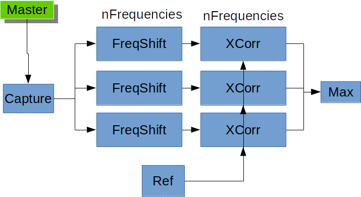

   Block diagram of a CAF implementation with three frequencies. :label:`caf-block-diag`

The results of a frequency shifted correlation is shown in Fig. :ref:`caf-test-shift`, and an autocorrelation is
shown in Fig. :ref:`caf-test-signal`.
We see that in Fig. :ref:`caf-test-shift` there is no peak. This is because two orthogonal signals should not have any
correlation energy.

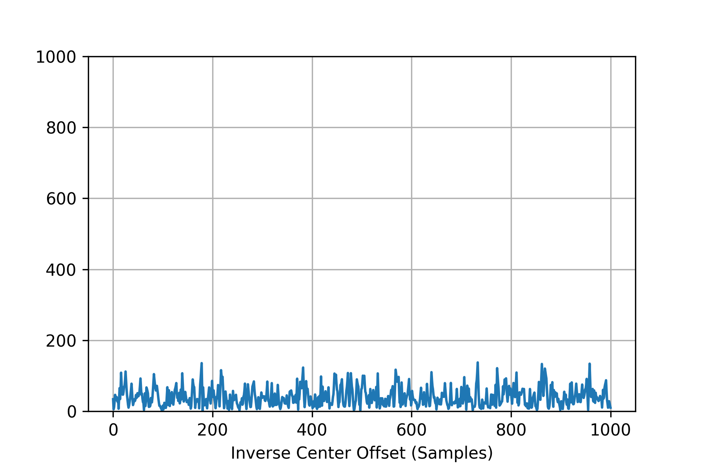

   Cross correlation of a frequency shifted signal. :label:`caf-test-shift`

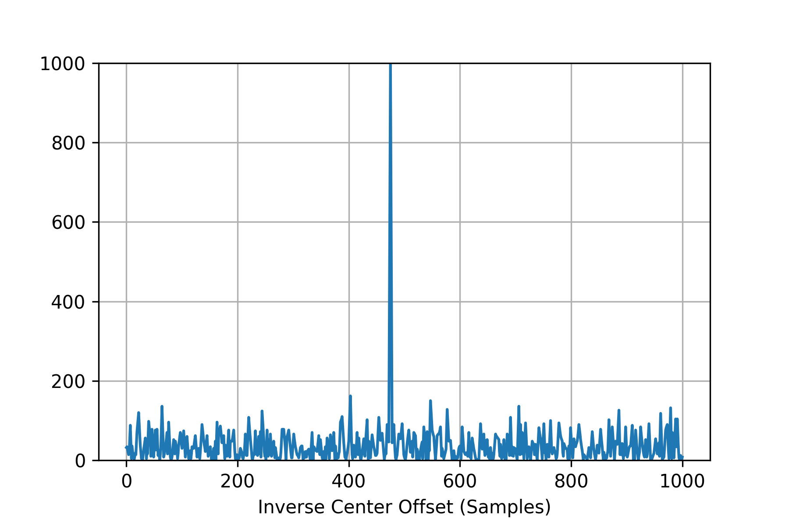

   Autocorrelation output with length of implemented design. :label:`caf-test-signal`

In the next code listing, the Python class definition for `CAF` is provided for reference.
The class takes in both a reference and received or captured signal, and the number of bits requested to represent the
signals.
These two signals are required parameters.
The reference signal is used to produce a stored reference as a capture buffer module, and the received signal is used
in the generated test bench.
The same parameters for the SigGen and FreqShift modules are required here as well, as they are passed down to their
instantiations for the CAF to instantiate.

.. code-block:: Python

   class CAF(CafVerilogBase):

       def __init__(self, reference, received, foas,
                    ref_i_bits=12, ref_q_bits=0,
                    rec_i_bits=12, rec_q_bits=0,
                    fs=625e3, n_bits=8,
                    pipeline=True, output_dir='.'):

Synthesis and Implementation
----------------------------

Both the synthesis and implementation were completed successfully, and all timing constraints were met by the tool.
Several different design sizes were elaborated and implemented, all ending up with different utilization amounts.
The final design iteration that was able to maximize the iteration time is
described by Table :ref:`ffull`. Each of these tables describes a different
usage that is still below the specific size of the Pynq board. For different devices, new `CAF` Python class instantiations
should be used to explore board usages by using the Verilog module outputs to follow the Vivado design process.

.. raw:: latex

   \begin{table}[]
   \renewcommand{\arraystretch}{1.3}
   \caption{12 phase bits, 8-bit multiplication, 49 frequencies, and 1000 samples.}
   \label{ffull}
   \centering
   \begin{tabular}{llll}
   \textbf{Resource} & \textbf{Utilization} & \textbf{Available} & \textbf{Utilization \%} \\
   LUT & 32682 & 53200 & 61.43 \\
   LUTRAM & 490 & 17400 & 2.82 \\
   FF & 28695 & 106400 & 26.97 \\
   BRAM & 25.50 & 140 & 18.21 \\
   DSP & 196 & 220 & 89.09 \\
   IO & 53 & 125 & 42.40 \\
   \end{tabular}%
   \end{table}

The final implementation run shown by Table :ref:`ffull` was able to use the most of the resources of the board
evenly because of the 8-bit multiplication :cite:`8bitdot`. The first couple implementations were using 12-bit numbers
because that was what was nominally chosen for the simulations. However, since regenerating the module is very simple, a
new CAF module was written out using the module and tested with different shifts. The final implementation has 49
different frequency offsets and an integration sample length of 1000.

Future Work and Enhancements
============================
When the original implementation of the sin and cosine generator was created, a half-sine method was used.
While functionally sound, it is possible to decrease size by using a quarter-sine implementation where only a fourth of
the sine is stored :cite:`zipcpu`.

While the body of work for caf-verilog supports the modeling of the caf itself, this project can be used as a basis for
incorporating Verilog as an extension to the wider scientific computing field.
The SymPy Development Team has already made significant contributions in this realm, and is being used in many projects
to support code generation for various languages such as c, c++, and Julia :cite:`codegen`.
Using a common API, it should be possible to also provide an extension to incorporate the Verilog HDL.
