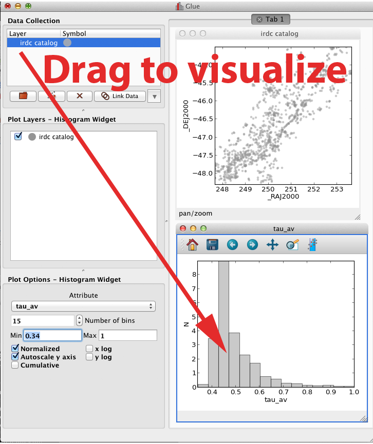
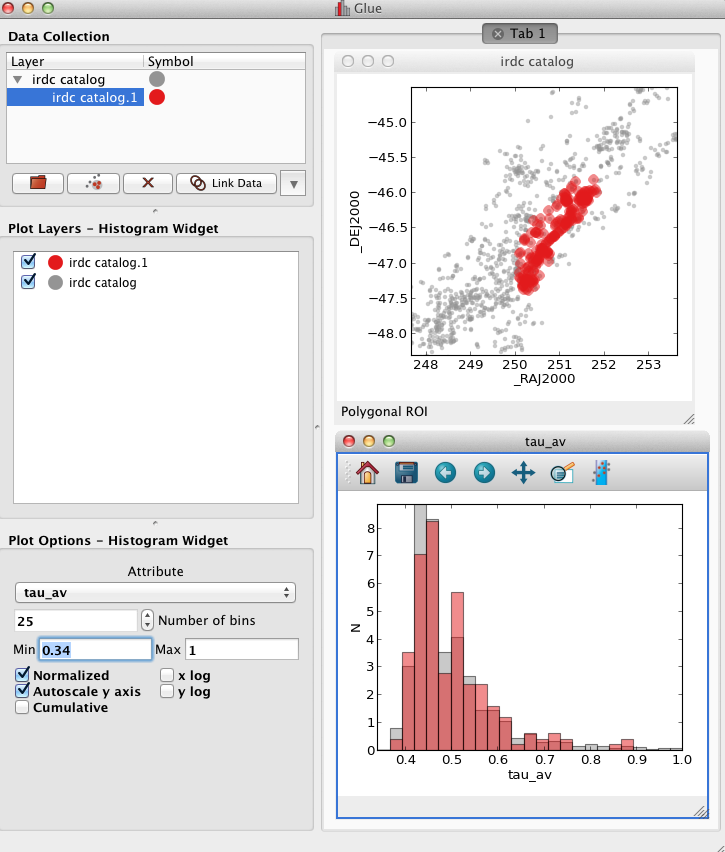
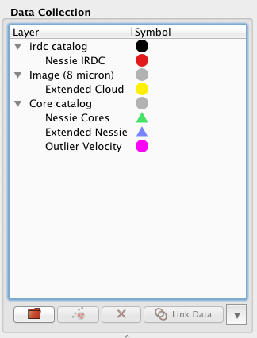

:author: Christopher Beaumont
:email: cbeaumont@cfa.harvard.edu
:institution: University of Hawaii, Harvard University

:author: Thomas Robitaille
:email: robitaille@mpia.de
:institution: Max Planck Institute for Astronomy

:author: Alyssa Goodman
:email: agoodman@cfa.harvard.edu
:institution: Harvard University

:author: Michelle Borkin
:email: borkin@seas.harvard.edu
:institution: Harvard University

-------------------------------------------
Multidimensional Data Exploration with Glue
-------------------------------------------

.. class:: abstract

    Modern research projects incorporate data from several sources,
    and new insights are increasingly driven by the ability to
    interpret data in the context of other data. `Glue
    <http://glueviz.org>`_ is an interactive environment built on top
    of the standard Python science stack to visualize relationships
    within and between datasets. With Glue, users can load and
    visualize multiple related datasets simultaneously. Users specify
    the logical connections that exist between data, and Glue
    transparently uses this information as needed to enable
    visualization across files. This functionality makes it trivial,
    for example, to interactively overplot catalogs on top of images.

    The central philosophy behind Glue is that the structure of
    research data is highly customized and problem-specific. Glue aims
    to accommodate this and simplify the "data munging" process, so that
    researchers can more naturally explore what their data have to
    say. The result is a cleaner scientific workflow, faster
    interaction with data, and an easier avenue to insight.

.. class:: keywords

   data visualization, exploratory data analysis, Python

Introduction
------------

The world is awash in increasingly accessible and increasingly
interrelated data.  Modern researchers rarely consider data in
isolation.  In astronomy, for example, researchers often complement
newly-collected data with publicly-available survey data targeting a
different range of the electromagnetic spectrum.  Because of this, new
discoveries are increasingly dependent upon interpreting data in the
context of other data.

Unfortunately, most of the current interactive tools for data
exploration focus on analyzing a single dataset at a time. It is
considerably more difficult to explore several conceptually related
datasets at once. Scientists typically resort to non-interactive
techniques (e.g., writing scripts to produce static
visualizations). This slows the pace of investigation, and makes it
difficult to uncover subtle relationships between datasets.

To address this shortcoming, we have been developing Glue. Glue is an
interactive data visualization environment that focuses on
multi-dataset exploration. Glue allows users to specify how different
datasets are related, and uses this information to dynamically link
and overlay visualizations of several datasets. Glue also
integrates into Python-based analysis workflows, and eases the back-and-forth
between interactive and non-interactive data analysis.

The Basic Glue Workflow
-----------------------

The central visualization philosophy behind Glue is the idea of
linked views -- that is, multiple related representations
of a dataset that are dynamically connected, such that interaction
with one view affects the appearance of another. For example,
a user might create two different scatter plots of a multi-dimensional
table, select a particular region of parameter space in one plot,
and see the points in that region highlighted in both plots. Linked-view
visualizations are especially effective at exploring high-dimensional
data. Glue extends this idea to related data sets spread across multiple files.

Let's illustrate the basic Glue workflow with an example. An
astronomer is studying Infrared Dark Clouds (environments of star
formation) in our Galaxy. Her data sets include a catalog of known
Infrared Dark Clouds, a second catalog of "cores"
(substructures embedded in these clouds where the stars actually
form), and a wide-field infrared survey image of a particular cloud.

**Step 1** She begins by loading the cloud catalog into Glue. She creates a
scatter plot of the position of each cloud, as well as a histogram
showing the distribution of surface densities. She creates each
visualization by dragging the data item onto the visualization
area. At this point, her screen looks like Figure 1.

   The basic Glue interface, shown at the end of **step 1**. Datasets
   are listed on the left panel.  Dragging them to the right creates a
   new visualization.

**Step 2** She is interested in a particular region of the sky, and thus draws
a lasso around particular points in the scatter plot. This creates
a new "subset", which is shown in red on each visualization (Figure 2). If she
traces a different region on either plot, the subset will update
in both views automatically.

   Glue after **step 2**. Tracing a cluster of points in the scatter
   plot creates a new subset, The histogram plot updates
   automatically.

**Step 3** Next she loads the infrared image. She would like to see how the
points in the catalog relate to structures in the image, by
overplotting the subset on the image. To do this, she first "links"
the data by defining the logical relationships between the two
files. She opens a data linking dialog, which displays the attributes
defined for each dataset (Figure 3). The image has attributes for the x and y
location of each pixel, and the catalog has columns which list the
location of each object in the same coordinate system. She highlights
the attribute describing the x location attribute for each dataset
(Right Ascension), and "links" them (in effect informing Glue that the
two attributes describe the same quantity). She repeats this for the y
location attribute (declination), and closes the dialog.

.. figure:: step_3.png
   :scale: 55%
   :figclass: thb

   The dialog for expression relationships between different
   datasets in **step 3**. Here, both datasets use the same spatial
   coordinates.

**Step 4** Now, she can drag the subset onto the image, to overplot
these points at their proper location (this is possible because
Glue now has enough information to compute the location of each
catalog source in the image. The details of how this is accomplished
are described in the next section). All three plots are still linked:
if the user highlights a new region in the image, this will
redefine the subset and update each plot. Figure 4 shows the
Glue interface at this point.

.. figure:: step_4.png
   :scale: 38%
   :align: center
   :figclass: wthb

   Once the catalog and image are linked, the user can overplot
   the original subset on the image (**step 4**).

The relationship between the catalog and image was very simple; each
dataset described the *same spatial quantities*, in the *same
units*. In general, connections between datasets are more
complicated. For example, the catalog of cores specifies positions in
a different coordinate system. Because of this, Glue allows users to
connect quantities across datasets using transformation
functions. Glue includes some of these functions by default, but users
can also write their own functions for arbitrary transformations. Glue
uses these functions as needed to transform quantities between
coordinate systems, to correctly overlay visualizations and/or filter
data in subsets.

**Step 5** Our scientist discovers several interesting relationships between
these datasets -- in particular, that several distinct entries in the
cloud catalog appear to form a coherent, extended structure in the
image. Furthermore, the cores embedded in these clouds all have
similar velocities, strengthening the argument that they are related.
At this point, she decides to test this hypothesis more rigorously, by
comparing to models of structure formation. This analysis will happen
outside of Glue. She saves all of her subsets as masks, for followup
analysis. Furthermore, she saves the entire Glue session, which allows
her to re-load these datasets, dataset connections, and subset
definitions at any time.

   Eventually, the user annotates several
   interesting regions in parameter space (**step 5**). These subsets
   can be exported as masks for further analysis.

Glue Architecture
-----------------

The scenario above outlines the basic workflow that Glue enables --
Glue allows users to create interactive linked visualizations, and
to drill down into interesting subsets of these visualizations. One of
the design priorities in Glue is to keep visualization code as simple
and modular as possible, so that adding new visualizations is
straightforward. Here we provide an overview of how we have implemented
cross-data linking in Glue, while striving to keep
visualization code as simple as possible.

Keeping visualizations in-sync is accomplished with the
publish/subscribe pattern. Glue defines several standard messages that
communicate state changes (e.g., that a subset definition has been
changed, a subset has been added or removed, etc.).  Visualization
clients attach callback methods to a central hub; these callback
methods are meant to respond to a particular type of state change
(e.g., to change the appearance of a plot). The hub is responsible for
broadcasting messages it receives -- in effect, calling each callback
function registered with a particular message. Thus, to stay
synchronized, a visualization client simply needs to implement
callback functions that handle each type of message, and register
these with the hub.

The hub receives messages to broadcast from data and subset
objects. The base classes for these objects override the
``__setattribute__`` method, such that state changes automatically
send messages to the hub. This means that, in most situations, code
that edits the state (for example, code that translates user-drawn
regions-of-interest to subset definitions) need not manually
broadcast messages.

Glue enables data linking across files by providing a simple,
dictionary-like interface for accessing attributes from data.  For
example, consider the case where a user overplots a
catalog on top of an image.  Such an overlay requires knowledge of the
location of each catalog entry *in the pixel coordinate system of the
image*. The pseudo-code for the overlay looks like this:

.. code-block:: python

 def overplot_catalog(catalog_data):
     try:
         # try to fetch requested quantities
         x = catalog_data['pixel_coord_x']
         y = catalog_data['pixel_coord_y']
     except InvalidAttribute:
         # cannot compute pixel location of catalog
         return
     # x, y are numpy arrays
     plot(x, y)

In other words, visualization code simply looks up the information it
needs. Behind the scenes, the data object is responsible for
retrieving and/or computing this quantity, and returning a NumPy
array. If it cannot do this, it raises an ``InvalidAttribute``
exception, which visualization code responds to. Importantly,
visualization code is *not* responsible for performing coordinate
transformations.

Subsets also rely on this interface for filtering data.
Each subset stores its logical definition as a subset state.
Fundamentally, subset states are combinations of inequalities. Each
subset state has a ``to_mask`` method that is capable of filtering
a given dataset. For example,
the implementation of a simple inequality subset state looks like this:

.. code-block:: python

 class GreaterThanSubsetState(SubsetState):

     def __init__(self, attribute, threshold):
         self.attribute = attribute
         self.threshold = threshold

     def to_mask(self, data):
         # uses the data dictionary interface
         return data[self.attribute] > self.threshold

Because subset states retain the information about which
quantities they constrain, they can be applied across datasets,
provided the quantities that they filter against are defined
or computable in the target dataset.

Internally, Glue maintains a graph of coordinate transformation
functions when the user defines connections between datasets. The
nodes in this graph are all the attributes defined in all datasets,
and the edges are translation functions. When client code
tries to access a quantity that is not originally stored
in a dataset, Glue searches for a path from quantities that *are*
natively present to the requested quantity. If such a path
exists, The relevant set of transformation functions are called,
and the result is returned.

Integrating with Python Workflows
---------------------------------

Python is the language-of-choice for many scientists, and the
fact that Glue is written in Python means that it is more easily
"hackable" than a typical GUI application. This blurs the boundary
between interactive and scripted analysis, and can lead to a more fluid
workflow. Here are several examples:

**Custom data linking functions** Glue allows users to specify
arbitrary Python functions to translate between quantities in
different datasets.  As a simple example, consider a function which
translates between pounds and kilograms:

.. code-block:: python

 from glue.config import link_function

 @link_function(info='Convert pounds to kilograms')
 def pounds2kilos(lbs):
     return lbs / 2.2

Link functions accept and return NumPy arrays. The ``link_function``
decorator adds this function to the list of translation functions
presented in the data linking UI. This code can be put in a
configuration file that glue runs on startup.

**Custom data loading** A traditional weakness of GUIs is their
fragility to unanticipated data formats. However, Glue allows users to
specify custom data loader methods, to parse data in unrecognized
formats. For example, to parse jpeg files:

.. code-block:: python

 from glue.config import data_factory
 from glue.core import Data
 from skimage.io import imread

 @data_factory('JPEG Reader', '*.jpg')
 def read_jpeg_image(file_name):
     im = imread(file_name)

     return Data(label='Image',
                 r=im[:, :, 0],
                 g=im[:, :, 1],
                 b=im[:, :, 2])

This function parses a data object with three attributes (the red,
green, and blue channels). The ``data_factory`` decorator adds
this function to the data loading user interface.

**Setup Scripts** Glue can be passed a Python script to run on
startup. This can be a convenient way to automate the task of loading
and linking several files that are frequently visualized. This
addresses another typical pain-point of GUIs -- the repetitive
mouse-clicking one has to do every time a GUI is restarted.

**Calling Glue from Python** Glue can be invoked during a running
Python session. Many scientists use Python for data-exploration from
the command line (or, more recently, the IPython notebook). Glue can
be used to interact with live Python variables. For example, Glue
includes a convenience function, ``qglue``, that composes "normal"
data objects like NumPy arrays and Pandas DataFrames into Glue
objects, and initializes the Glue UI with these variables. ``qglue``
is useful for quick questions about multidimensional data that arise
mid-analysis.

Similarly, Glue embeds an IPython terminal that gives users access
to the Python command line (and Glue variables) during a glue
session. Variables in a Glue session can be introspected and
analyzed on this command line.

Relationship to Other Efforts
-----------------------------

Glue helps researchers uncover the relationships that exist between
related datasets. It enables users to easily create multiple linked
visualizations which can be used to identify and drill down into
interesting data subsets.

Many of the ideas behind Glue are rooted in previous efforts (for a
more thorough history from an astronomy perspective, see
[Goodman12]_). The statistician John Tukey pioneered many of the
ideas behind what he termed Exploratory Data Analysis (that is, the
open-ended investigation of features in datasets, as distinguished
from Confirmatory Data Analysis where specific hypotheses are tested
systematically; [Tukey77]_). In the early 1970s, he developed the
PRIM-9 program, which implemented the idea of creating multiple views
of multivariate data, and isolating data subsets. More modern
linked-visualization programs influenced by PRIM-9 include `GGobi
<http://ggobi.org/>`_, `Spotfire <http://spotfire.tibco.com>`_,
`DataDesk <http://www.datadesk.com>`_, and `Tableau
<http://www.tableausoftware.com>`_ (the first is free and open-source,
the latter 3 are commercial).

Within the astronomy community, `Topcat
<http://www.star.bris.ac.uk/~mbt/topcat/>`_ and `Viewpoints
<https://www.assembla.com/wiki/show/viewpoints>`_ focus on linked
visualization of tabular data. Finally, some efforts from the
Virtual Observatory community (especially the `SAMP
<http://www.ivoa.net/documents/SAMP/>`_ protocol) allow different
visualization tools to interoperate, and hence provide a limited
linked-view environment.

Glue builds upon the ideas developed in these programs in a few key
ways. The majority of these linked-view environments focus on the
exploration of a single catalog. Glue generalizes this approach in two
directions. First, Glue is designed to handle several files at a time,
and to visually explore the connections between these files.  Second, Glue
handles non-tabular data like images -- this is critical for
applications in astronomy, medical imaging, and Geographic Information
Systems.

The landscape of data is evolving rapidly, and driving revolutions
both within and beyond science. The phenomenon of "big data" is one of
the most public facets of this revolution. Rapidly growing volumes of
data present new engineering challenges for analysis, as well as new
opportunities for data-driven decision making. Glue tackles a
different but equally important facet of the data revolution, which we
call "wide data". Data are becoming increasingly inter-related, and
the ability to tease out these connections will enable new
discoveries. Glue is a platform for visually and flexibly exploring these
relationships.

References
----------
.. [Goodman12] Goodman, Alyssa
               *Principles of high-dimensional data visualization in astronomy*
               Astronomische Nachrichten, Vol. 333, Issue 5-6, p.505
.. [Tukey77] Tukey, John
             *Exploratory Data Analysis*
             Addison-Wesley Publishing Company, 1977
