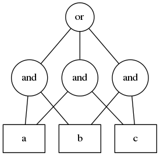
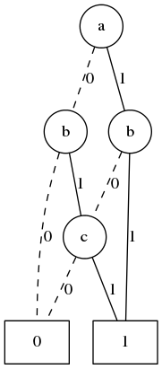

.. Filename: chris_drake.rst

:author: Chris Drake
:email: cjdrake@gmail.com
:institution: Drake Enterprises

:video: https://www.youtube.com/watch?v=cljDuK0ouRs

**************************************************************************
  PyEDA: Data Structures and Algorithms for Electronic Design Automation
**************************************************************************

.. class:: abstract

   This paper introduces PyEDA,
   a Python library for electronic design automation (EDA).
   PyEDA provides both a high level interface to the representation of
   Boolean functions,
   and blazingly-fast C extensions for fundamental algorithms where
   performance is essential.
   PyEDA is a hobby project which has the simple but audacious goal of
   improving the state of digital design by using Python.

Introduction
============

Chip design and verification is a complicated undertaking.
You must assemble a large team of engineers with many different specialties:
front-end design entry, logic verification, power optimization, synthesis,
place and route, physical verification, and so on.
Unfortunately, the tools, languages,
and work flows offered by the electronic design automation (EDA) industry are,
in this author's opinion, largely a pit of despair.
The languages most familiar to chip design and verification engineers are
Verilog (now SystemVerilog), C/C++, TCL, and Perl.
Flows are patched together from several proprietary tools with incompatible
data representations.
Even with Python's strength in scientific computing,
it has largely failed to penetrate this space.
In short, EDA needs more Python!

This paper surveys some of the features and applications of
`PyEDA <https://github.com/cjdrake/pyeda>`_,
a Python library for electronic design automation.
PyEDA provides both a high level interface to the representation of
Boolean functions,
and blazingly-fast C extensions for fundamental algorithms where
performance is essential.

PyEDA is a hobby project,
but in the past year it has seen some interesting adoption from
University students.
For example,
students at Vanderbilt University used it to model system reliability [Nan14]_,
and students at Saarland University used as part of a fast DQBF Refutation tool [Fin14]_.

Even though the name "PyEDA" implies that the library is specific to EDA,
it is actually general in nature.
Some of the techniques used for designing and verifying digital logic are
fundamental to computer science.
For example, we will discuss applications of Boolean satisfiability (SAT),
the definitive NP-complete problem.

PyEDA's repository is hosted at https://github.com/cjdrake/pyeda.git,
and its documentation is hosted at http://pyeda.rtfd.org.

Note About Code Blocks
----------------------

This document contains several Python code blocks.
For the sake of simplicity, we assume you have PyEDA installed,
and have prepared an interactive terminal by executing:

.. code-block:: pycon

   >>> from pyeda.inter import *

Boolean Variables and Functions
===============================

At its core, PyEDA provides a powerful API for creating and
manipulating Boolean functions.

First, let us provide the standard definitions.

A Boolean *variable* is an abstract numerical quantity that can take any
value in the set :math:`\{0, 1\}`.
A Boolean function is a rule that maps points in an :math:`N`-dimensional
Boolean space to an element in :math:`\{0, 1\}`.
Formally, :math:`f: B^N \Rightarrow B`,
where :math:`B^N` means the Cartesian product of :math:`N` sets of type
:math:`\{0, 1\}`.
For example, if you have three input variables, :math:`a, b, c`,
each defined on :math:`\{0, 1\}`,
then :math:`B^3 = \{0, 1\}^3 = \{(0, 0, 0), (0, 0, 1), ..., (1, 1, 1)\}`.
:math:`B^3` is the **domain** of the function (the input part),
and :math:`B = \{0, 1\}` is the **range** of the function (the output part).
The set of all input variables a function depends on is called its *support*.

There are several ways to represent a Boolean function,
and different data structures have different tradeoffs.
In the following sections,
we will give a brief overview of PyEDA's API for logic expressions,
truth tables, and binary decision diagrams.
In addition,
we will provide implementation notes for several useful applications.

Logic Expressions
=================

Logic expressions are a powerful and flexible way to represent Boolean functions.
They are implemented as a graph,
with *atoms* at the branches, and *operators* at the leaves.
Atomic elements are *literals* (variables and complemented variables),
and *constants* (zero and one).
The supported algebraic operators are ``Not``, ``Or``, ``And``, ``Xor``,
``Equal``, ``Implies``, and ``ITE`` (if-then-else).

For general purpose use,
symbolic logic expressions are PyEDA's central data type.
Since release ``0.27``,
they have been implemented using a high performance C library.

Expressions are fast, and reasonably compact.
On the other hand, they are generally not canonical,
and determining expression equivalence is NP-complete.
Conversion to a canonical expression form can result in exponential size.

Construction
------------

To construct a logic expression, first start by defining some symbolic
*variables* of type ``Expression``:

.. code-block:: pycon

   >>> a, b, c, d = map(exprvar, 'abcd')

By overloading Python's logical operators,
you can build expression algebraically:

.. code-block:: pycon

   >>> F = a | ~b & c ^ ~d

Use methods from the ``Function`` base class to explore the function's
basic properties:

.. code-block:: pycon

   >>> F.support
   frozenset({a, b, c, d})
   >>> list (F.iter_relation())
   [({a: 0, b: 0, c: 0, d: 0}, 0),
    ({a: 1, b: 0, c: 0, d: 0}, 1),
    ({a: 0, b: 1, c: 0, d: 0}, 0),
    ...
    ({a: 0, b: 1, c: 1, d: 1}, 0),
    ({a: 1, b: 1, c: 1, d: 1}, 1)]

There are also several factory functions that offer more power than Python's
built-in binary operators.
For example, operators such as ``Or``, ``And``, and ``Xor`` allow you to
construct N-ary expressions:

.. code-block:: pycon

   >>> a ^ b ^ c
   Xor(Xor(a, b), c)
   >>> Xor(a, b, c)
   Xor(a, b, c)

Also, functions such as ``OneHot``, and ``Majority``
implement powerful, higher order functions:

.. code-block:: pycon

   >>> OneHot(a, b, c)
   And(Or(~a, ~b), Or(~a, ~c), Or(~b, ~c), Or(a, b, c))
   >>> Majority(a, b, c)
   Or(And(a, b), And(a, c), And(b, c))

Simplification
--------------

The laws of Boolean Algebra can be used to simplify expressions.
For example, Table :ref:`boolident` enumerates a partial list of Boolean identities
for the ``Or`` and ``And`` operators.

.. table:: Boolean OR/AND Identities :label:`boolident`

   +---------------+-----------------------------------+---------------------------------------------------+
   | Name          | OR                                | AND                                               |
   +===============+===================================+===================================================+
   | Commutativity | :math:`x + y = y + x`             | :math:`x \cdot y = y \cdot x`                     |
   +---------------+-----------------------------------+---------------------------------------------------+
   | Associativity | :math:`x + (y + z) = (x + y) + z` | :math:`x \cdot (y \cdot z) = (x \cdot y) \cdot z` |
   +---------------+-----------------------------------+---------------------------------------------------+
   | Identity      | :math:`x + 0 = x`                 | :math:`x \cdot 1 = x`                             |
   +---------------+-----------------------------------+---------------------------------------------------+
   | Domination    | :math:`x + 1 = 1`                 | :math:`x \cdot 0 = 0`                             |
   +---------------+-----------------------------------+---------------------------------------------------+
   | Idempotence   | :math:`x + x = x`                 | :math:`x \cdot x = x`                             |
   +---------------+-----------------------------------+---------------------------------------------------+
   | Inverse       | :math:`x + x' = 1`                | :math:`x \cdot x' = 0`                            |
   +---------------+-----------------------------------+---------------------------------------------------+

Most laws are computationally easy to apply.
PyEDA allows you to construct unsimplified Boolean expressions,
and provides the ``simplify`` method to perform such inexpensive
transformations.

For example:

.. code-block:: pycon

   >>> F = ~a | a
   >>> F
   Or(~a, a)
   >>> F.simplify()
   1
   >>> Xor(a, ~b, Xnor(~a, b), c)
   ~c

Performing simplification can dramatically reduce the size and depth of
your logic expressions.

Transformation
--------------

PyEDA also supports a growing list of expression transformations.
Since expressions are not a canonical form,
transformations can help explore tradeoffs in time and space,
as well as convert an expression to a form suitable for a particular algorithm.

For example,
in addition to the primary operators ``Not``, ``Or``, and ``And``,
expressions also natively support the secondary ``Xor``, ``Equal``,
``Implies``, and ``ITE`` (if-then-else) operators.
By transforming all secondary operators into primary operators,
and pushing all ``Not`` operators down towards the leaf nodes,
you arrive at what is known as "negation normal form".

.. code-block:: pycon

   >>> F = Xor(a >> b, c.eq(d))
   >>> F.to_nnf()
   And(Or(And(Or(c, d), Or(~c, ~d)), And(a, ~b)),
          Or(~a, b, And(~c, ~d), And(c, d)))

Currently, expressions also support conversion to the following forms:

* Binary operator (only two args per ``Or``, ``And``, etc)
* Disjunctive Normal Form (DNF)
* Conjunctive Normal Form (CNF)

DNF and CNF expressions are "two-level" forms.
That is, the entire expression is either an ``Or`` of ``And`` clauses (DNF),
or an ``And`` of ``Or`` clauses (CNF).
DNF expressions are also called "covers",
and are important in both two-level and multi-level logic minimization.
CNF expressions play an important role in satisfiability.
We will briefly cover both of these topics in subsequent sections.

Visualization
-------------

Boolean expressions support a ``to_dot()`` method,
which can be used to convert the graph structure to DOT format
for consumption by Graphviz.
For example, Figure :ref:`majexpr` shows the Graphviz output on the
majority function in three variables:

.. code-block:: pycon

   >>> F = Majority(a, b, c)
   >>> F.to_dot()

   Majority expression rendered by Graphviz :label:`majexpr`

The ``expr`` Function
---------------------

The ``expr`` function is a factory function that attempts to transform any
input into a logic expression.
It does the obvious thing when converting inputs that look like Boolean values:

.. code-block:: pycon

   >>> expr(False)
   0
   >>> expr(1)
   1
   >>> expr("0")
   0

But it also implements a full top-down parser of expressions.
For example:

.. code-block:: pycon

   >>> expr("a | b ^ c & d")
   Or(a, Xor(b, And(c, d)))

See the `documentation <http://pyeda.readthedocs.org/en/latest/expr.html#from-the-expr-function>`_
for a complete list of supported operators accepted by the ``expr`` function.

Boolean Satisfiability
----------------------

One of the most interesting questions in computer science is whether a given
Boolean function is satisfiable, or SAT.
That is, for a given function :math:`F`,
is there a set of input assignments that will produce an output of :math:`1`?

PyEDA Boolean functions implement two functions for this purpose,
``satisfy_one``, and ``satisfy_all``.
The former answers the question in a yes/no fashion,
returning a satisfying input point if the function is satisfiable,
and ``None`` otherwise.
The latter returns a generator that will iterate through all satisfying
input points.

SAT has all kinds of applications in both digital design and verification.
In digital design, it can be used in equivalence checking,
test pattern generation, model checking, formal verification,
and constrained-random verification, among others.
SAT finds its way into other areas as well.
For example, modern package management systems such as apt and yum
might use SAT to guarantee that certain dependencies are satisfied
for a given configuration.

The ``pyeda.boolalg.picosat`` module provides an interface to the modern
SAT solver PicoSAT [Bie08]_.
When a logic expression is in conjunctive normal form (CNF),
calling the ``satisfy_*`` methods will invoke PicoSAT transparently.

For example:

.. code-block:: pycon

   >>> F = OneHot(a, b, c)
   >>> F.is_cnf()
   True
   >>> F.satisfy_one()
   {a: 0, b: 0, c: 1}
   >>> list(F.satisfy_all())
   [{a: 0, b: 0, c: 1},
    {a: 0, b: 1, c: 0},
    {a: 1, b: 0, c: 0}]

When an expression is not a CNF,
PyEDA will resort to a standard, backtracking algorithm.
The worst-case performance of this implementation is exponential,
but is acceptable for many real-world scenarios.

Tseitin Transformation
----------------------

The worst case memory consumption when converting to CNF is exponential.
This is due to the fact that distribution of :math:`M` ``Or`` clauses over
:math:`N` ``And`` clauses (or vice-versa) requires :math:`M \times N` clauses.

.. code-block:: pycon

   >>> Or(And(a, b), And(c, d)).to_cnf()
   And(Or(a, c), Or(b, c), Or(a, d), Or(b, d))

Logic expressions support the ``tseitin`` method,
which perform's Tseitin's transformation on the input expression.
For more information about this transformation, see [Tse68]_.

The Tseitin transformation does not produce an equivalent expression,
but rather an *equisatisfiable* CNF,
with the addition of auxiliary variables.
The important feature is that it can convert any expression into a CNF,
which can be solved using PicoSAT.

.. code-block:: pycon

   >>> F = Xor(a, b, c, d)
   >>> soln = F.tseitin().satisfy_one()
   >>> soln
   {a: 0,
    aux[0]: 1,
    aux[1]: 1,
    ...
    b: 0,
    c: 0,
    d: 1}

You can safely discard the ``aux`` variables to get the solution:

.. code-block:: pycon

   >>> {k: v for k, v in soln.items() if k.name != 'aux'}
   {a: 0, b: 0, c: 0, d: 1}

Truth Tables
============

The most straightforward way to represent a Boolean function is to simply
enumerate all possible mappings from input assignment to output values.
This is known as a truth table,
It is implemented as a packed list,
where the index of the output value corresponds to the assignment of the
input variables.
The nature of this data structure implies an exponential size.
For :math:`N` input variables, the table will be size :math:`2^N`.
It is therefore mostly useful for manual definition and inspection of
functions of reasonable size.

To construct a truth table from scratch,
use the ``truthtable`` factory function.
For example, to represent the ``And`` function:

.. code-block:: pycon

   >>> truthtable([a, b], [False, False, False, True])
   # This also works
   >>> truthtable([a, b], "0001")

You can also convert expressions to truth tables using the ``expr2truthtable``
function:

.. code-block:: pycon

   >>> expr2truthtable(OneHot0(a, b, c))
   c b a
   0 0 0 : 1
   0 0 1 : 1
   0 1 0 : 1
   0 1 1 : 0
   1 0 0 : 1
   1 0 1 : 0
   1 1 0 : 0
   1 1 1 : 0

Partial Definitions
-------------------

Another use for truth tables is the representation of *partially defined* functions.
Logic expressions and binary decision diagrams are *completely defined*,
meaning that their implementation imposes a complete mapping from all points
in the domain to :math:`\{0, 1\}`.
Truth tables allow you to specify some function outputs as "don't care".
You can accomplish this by using either ``"-"`` or ``"X"`` with the ``truthtable``
function.

For example, a seven segment display is used to display decimal numbers.
The codes "0000" through "1001" are used for 0-9,
but codes "1010" through "1111" are not important, and therefore can be
labeled as "don't care".

.. code-block:: pycon

   >>> X = ttvars('x', 4)
   >>> F1 = truthtable(X, "0000011111------")
   >>> F2 = truthtable(X, "0001111100------")

To convert a table to a two-level,
disjunctive normal form (DNF) expression,
use the ``truthtable2expr`` function:

.. code-block:: pycon

   >>> truthtable2expr(F1)
   Or(And(x[0], ~x[1], x[2], ~x[3]),
      And(~x[0], x[1], x[2], ~x[3]),
      And(x[0], x[1], x[2], ~x[3]),
      And(~x[0], ~x[1], ~x[2], x[3]),
      And(x[0], ~x[1], ~x[2], x[3]))

Two-Level Logic Minimization
----------------------------

When choosing a physical implementation for a Boolean function,
the size of the logic network is proportional to its cost,
in terms of area and power.
Therefore it is desirable to reduce the size of that network.

Logic minimization of two-level forms is an NP-complete problem.
It is equivalent to finding a minimal-cost set of subsets of a
set :math:`S` that covers :math:`S`.
This is sometimes called the "paving problem",
because it is conceptually similar to finding the cheapest configuration of
tiles that cover a floor.
Due to the complexity of this operation,
PyEDA uses a C extension to the Berkeley Espresso library [Bra84]_.

After calling the ``espresso_tts`` function on the ``F1`` and ``F2``
truth tables from above,
observe how much smaller (and therefore cheaper) the resulting DNF expression is:

.. code-block:: pycon

   >>> F1M, F2M = espresso_tts(F1, F2)
   >>> F1M
   Or(x[3], And(x[0], x[2]), And(x[1], x[2]))

Binary Decision Diagrams
========================

A binary decision diagram is a directed acyclic graph used to represent a
Boolean function.
They were originally introduced by Lee,
and later by Akers.
In 1986, Randal Bryant introduced the reduced, ordered BDD (ROBDD).

The ROBDD is a canonical form,
which means that given an identical ordering of input variables,
equivalent Boolean functions will always reduce to the same ROBDD.
This is a desirable property for determining formal equivalence.
Also, it means that unsatisfiable functions will be reduced to zero,
making SAT/UNSAT calculations trivial.
Due to these auspicious properties,
the term BDD almost always refers to some minor variation of the ROBDD
devised by Bryant.

The downside of BDDs is that certain functions,
no matter how cleverly you order their input variables,
will result in an exponentially-sized graph data structure.

Construction
------------

Like logic expressions,
you can construct a BDD by starting with symbolic variables
and combining them with operators.

For example:

.. code-block:: pycon

   >>> a, b, c = map(bddvar, 'abc')
   >>> F = a & b & c
   >>> F.support
   frozenset({a, b, c})
   >>> F.restrict({a: 1, b: 1})
   c
   >>> F & 0
   0

The ``expr2bdd`` function can also be used to convert any expression into
an equivalent BDD:

.. code-block:: pycon

   >>> expr2bdd(expr("(s ? d1 : d0) <=> (s & d1 | ~s & d0)"))
   1

Equivalence
-----------

As we mentioned before,
BDDs are a canonical form.
This makes checking for SAT, UNSAT, and formal equivalence trivial.

.. code-block:: pycon

   >>> ~a & a
   0
   >>> ~a & ~b | ~a & b | a & ~b | a & b
   1
   >>> F = a ^ b
   >>> G = ~a & b | a & ~b
   >>> F.equivalent(G)
   True
   >>> F is G
   True

PyEDA's BDD implementation uses a unique table,
so ``F`` and ``G`` from the previous example are actually just two different
names for the same object.

Visualization
-------------

Like expressions,
binary decision diagrams also support a ``to_dot()`` method,
which can be used to convert the graph structure to DOT format
for consumption by Graphviz.
For example, Figure :ref:`majbdd` shows the Graphviz output on the
majority function in three variables:

.. code-block:: pycon

   >>> expr2bdd(expr("Majority(a, b, c)")).to_dot()

   Majority BDD rendered by Graphviz :label:`majbdd`

Future Directions for Function Data Structures
==============================================

The implementation of Boolean functions is a vast field,
and PyEDA is really only scratching the surface.
In this section we will describe several directions for improvement.

Due to their fundamentally exponential size,
truth tables have limited application.
It is more common for tabular function representations to use an implicant
table, sometimes referred to as a "cover".
PyEDA has some support for implicant tables in the Espresso C extension,
but this functionality is not exposed to the user interface.

PyEDA's current implementation of BDDs is written in pure Python.
Given that BDDs are memory limited,
the ``PyObject`` data type imposes a hefty overhead on the size of the DAG.
Also, there are currently no complemented edges or automatic variable reordering,
features that more complete decision diagram libraries implement.
One solution is to implement a Python C extension to a more
complete and high performance library such as [CUDD]_.

There are several function representations left for consideration.
Within the realm of decision diagrams,
we have not considered algebraic decision diagrams (ADDs),
or zero-suppressed decision diagrams (ZDDs).
Within the realm of graph-based structures primarily for logic synthesis,
we have not considered the and-inverter-graph (AIG),
or the majority-inverter-graph (MIG).

Function Arrays
===============

When dealing with several related Boolean functions,
it is usually convenient to index the inputs and outputs.
For this purpose, PyEDA includes a multi-dimensional array (MDA) data type,
called an ``farray`` (function array).

The most pervasive example is computation involving any numeric data type.
For example, let’s say you want to add two numbers ``A``, and ``B``.
If these numbers are 32-bit integers, there are 64 total inputs,
not including a carry-in.
The conventional way of labeling the input variables is
:math:`a_0, a_1, \ldots, a_{31}`, and :math:`b_0, b_1, \ldots, b_{31}`.

Furthermore, you can extend the symbolic algebra of Boolean functions to arrays.
For example, the element-wise XOR of ``A`` and ``B`` is also an array.

In this section, we will briefly discuss ``farray`` construction,
slicing operations, and algebraic operators.
Function arrays can be constructed using any ``Function`` implementation,
but for simplicity we will restrict the discussion to logic expressions.

Construction
------------

The ``farray`` constructor can be used to create an array of arbitrary
expressions.

.. code-block:: pycon

   >>> a, b, c, d = map(exprvar, 'abcd')
   >>> F = farray([a, b, And(a, c), Or(b, d)])
   >>> F.ndim
   1
   >>> F.size
   4
   >>> F.shape
   ((0, 4), )

As you can see, this produces a one-dimensional array of size 4.

The shape of the previous array uses Python's conventional,
exclusive indexing scheme in one dimension.
The ``farray`` constructor also supports multi-dimensional arrays:

.. code-block:: pycon

   >>> G = farray([ [a, b],
                    [And(a, c), Or(b, d)],
                    [Xor(b, c), Equal(c, d)] ])
   >>> G.ndim
   2
   >>> G.size
   6
   >>> G.shape
   ((0, 3), (0, 2))

Though arrays can be constructed from arbitrary functions in arbitrary shapes,
it is far more useful to start with arrays of variables and constants,
and build more complex arrays from them using operators.

To construct arrays of expression variables,
use the ``exprvars`` factory function:

.. code-block:: pycon

   >>> xs = exprvars('x', 8)
   >>> xs
   farray([x[0], x[1], x[2], x[3], x[4], x[5], x[6], x[7]])
   >>> ys = exprvars('y', 4, 4)
   farray([[y[0,0], y[0,1], y[0,2], y[0,3]],
           [y[1,0], y[1,1], y[1,2], y[1,3]],
           [y[2,0], y[2,1], y[2,2], y[2,3]],
           [y[3,0], y[3,1], y[3,2], y[3,3]]])

Use the ``uint2exprs`` and ``int2exprs`` function to convert integers to their
binary encoding in unsigned, and twos-complement, respectively.

.. code-block:: pycon

   >>> uint2exprs(42, 8)
   farray([0, 1, 0, 1, 0, 1, 0, 0])
   >>> int2exprs(-42, 8)
   farray([0, 1, 1, 0, 1, 0, 1, 1])

Note that the bits are in order from LSB to MSB,
so the conventional bitstring representation of ``-42`` in eight bits
would be "11010110".

Slicing
-------

PyEDA's function arrays support numpy-style slicing operators:

.. code-block:: pycon

   >>> xs = exprvars('x', 4, 4, 4)
   >>> xs[1,2,3]
   xs[1,2,3]
   >>> xs[2,:,2]
   farray([x[2,0,2], x[2,1,2], x[2,2,2], x[2,3,2]])
   >>> xs[...,1]
   farray([[x[0,0,1], x[0,1,1], x[0,2,1], x[0,3,1]],
           [x[1,0,1], x[1,1,1], x[1,2,1], x[1,3,1]],
           [x[2,0,1], x[2,1,1], x[2,2,1], x[2,3,1]],
           [x[3,0,1], x[3,1,1], x[3,2,1], x[3,3,1]]])

A special feature of PyEDA ``farray`` slicing that is useful for digital logic
is the ability to multiplex (mux) array items over a select input.
For example, to create a simple, 4:1 mux:

.. code-block:: pycon

   >>> X = exprvars('x', 4)
   >>> S = exprvars('s', 2)
   >>> X[S]
   Or(And(x[0], ~s[0], ~s[1]),
      And(x[1],  s[0], ~s[1]),
      And(x[2], ~s[0],  s[1]),
      And(x[3],  s[0],  s[1]))

Algebraic Operations
--------------------

Function arrays are algebraic data types,
which support the following symbolic operators:

* unary reductions (``uor, uand, uxor, ...``)
* bitwise logic (``~ | & ^``)
* shifts (``<< >>``)
* concatenation (``+``)
* repetition (``*``)

Combining function and array operators allows us to implement a reasonably
complete domain-specific language (DSL) for symbolic Boolean algebra in Python.

Consider, for example, the implementation of the ``xtime`` function,
which is an integral part of the AES algorithm.

The Verilog implementation, as a ``function``:

.. code-block:: verilog

   function automatic logic [7:0]
   xtime(logic [7:0] b, int n);
       xtime = b;
       for (int i = 0; i < n; i++)
           xtime = {xtime[6:0], 1'b0}
                 ^ (8'h1b & {8{xtime[7]}});
   endfunction

And the PyEDA implementation:

.. code-block:: python

   def xtime(b, n):
       for _ in range(n):
           b = (exprzeros(1) + b[:7]
             ^  uint2exprs(0x1b, 8) & b[7]*8)
       return b

Practical Applications
----------------------

Arrays of functions have many practical applications.
For example,
the ``pyeda.logic.addition`` module contains implementations of
ripple-carry, brent-kung, and kogge-stone addition logic.
Here is the digital logic implementation of :math:`2 + 2 = 4`:

.. code-block:: pycon

   >>> from pyeda.logic.addition import kogge_stone_add
   >>> A = exprvars('a', 8)
   >>> B = exprvars('b', 8)
   >>> S, C = kogge_stone_add(A, B)
   >>> S.vrestrict({A: "01000000", B: "01000000"})
   farray([0, 0, 1, 0, 0, 0, 0, 0])

Related Work
============

It is truly an exciting time for Python in digital logic.
There are several available libraries implementing features that are
competitive with PyEDA's.

SymPy was an early influence for PyEDA's design [Sympy]_.
It features a `logic <http://docs.sympy.org/dev/modules/logic.html>`_
module that implements symbolic logic expressions.
SymPy is implemented in 100% pure Python,
and therefore will have some trouble competing with the raw performance
of PyEDA's C extensions.

Another tremendous influence was Ilan Schnell's ``pycosat`` module [Pycosat]_.
It implements a similar Python interface to the PicoSAT SAT solver [Bie08]_,
but does not delve into the area of symbolic Boolean algebra.

Steve Haynal and others at the University of California Santa Barbara have implemented
`PyCUDD <http://bears.ece.ucsb.edu/pycudd.html>`_,
a Python binding to the well-known [CUDD]_ library.

The `Sage Math <http://doc.sagemath.org>`_ project implements
logic and sat modules with similar features to PyEDA's.

Lastly, there are a few notable Python bindings to other SAT libries.
`python-minisat <https://github.com/tfukushima/python-minisat>`_,
and `pycryptosat <https://pypi.python.org/pypi/pycryptosat>`_
implement Python wrappers around
`MiniSAT <http://minisat.se/>`_ and
`CryptoMiniSAT <https://github.com/msoos/cryptominisat>`_, respectively.
Also, Microsoft recently open sourced the truly excellent
`Z3 <http://minisat.se/>`_ theorem prover library,
which has its own SMT SAT solver and Python bindings.

References
==========

.. [Ake78] S.B. Akers,
           *Binary Decision Diagrams*,
           IEEE Transactions on Computers, Vol. C-27, No. 6, June 1978, pp. 509-516.

.. [Bah93] R. I. Bahar, E. A. Frohm, C. M. Gaona, G. D. Hachtel, E. Macii, A. Pardo, and F. Somenzi.
           *Algebraic Decision Diagrams and Their Applications*,
           Proceedings of the International Conference on Computer-Aided Design,
           pages 188-191,
           Santa Clara, CA, November 1993.

.. [Bie08] A. Biere.
           *PicoSAT Essentials*,
           Journal on Satisfiability, Boolean Modeling and Computation (JSAT),
           vol. 4, pages 75-97, Delft University, 2008.

.. [Bra84] R. Brayton, G. Hatchel, C. McMullen, and A. Sangiovanni-Vincentelli,
           *Logic Minimization Algorithms for VLSI Synthesis*,
           Kluwer Academic Publishers, Boston, MA, 1984.

.. [Bry86] R.E. Bryant.
           *Graph-based algorithms for Boolean function manipulation*,
           IEEE Transactions on Computers, C-35(8):677-691, August 1986.
           http://www.cs.cmu.edu/~bryant/pubdir/ieeetc86.pdf

.. [Dec04] J. Decaluwe.
           *MyHDL: A Python-based Hardware Description Language*,
           Linux Journal, November 2004.
           http://www.myhdl.org

.. [Fin14] B. Finkbeiner, L. Tentrup,
           *Fast DQBF Refutation*,
           SAT 2014
           https://www.react.uni-saarland.de/tools/bunsat/

.. [Graphviz] Graphviz - Graph Visualization Software
              http://www.graphviz.org/

.. [Loc14] D. Lockhart, G. Zibrat, C. Batten.
           *PyMTL: A Unified Framework for Vertically Integrated Computer Architecture Research*,
           Int'l Symp. on Microarchitecture (MICRO-47), December 2014.
           http://csl.cornell.edu/~cbatten/pdfs/lockhart-pymtl-micro2014.pdf

.. [Min93] S.I. Minato.
           *Zero-suppressed BDDs for set manipulation in combinatorial problems*,
           In Proceedings of the Design Automation Conference, pages 272-277,
           Dallas, TX, June 1993.

.. [Nan14] S. Nannapaneni, et al.
           *A Model-Based Approach for Reliability Assessment in Component-Based Systems*,
           https://www.phmsociety.org/sites/phmsociety.org/files/phm_submission/2014/phmc_14_025.pdf

.. [Pycosat] Ilan Schnell
             https://github.com/ContinuumIO/pycosat/

.. [Ros03] K. Rosen.
           *Discrete Mathematics and its Applications*
           McGraw Hill, 2003.

.. [CUDD] F. Somenzi.
          *CUDD: CU Decision Diagram Package*,
          http://vlsi.colorado.edu/~fabio/CUDD/

.. [Sympy] Sympy - Python library for symbolic mathematics
           http://docs.sympy.org

.. [Lee59] C.Y. Lee,
           *Representation of Switching Circuits by Binary-Decision Programs*,
           Bell System Technical Journal, Vol. 38, July 1959, pp. 985-999.

.. [Tse68] G.S. Tseitin,
           *On the complexity of derivation in propositional calculus*,
           Slisenko, A.O. (ed.) Structures in Constructive Mathematics and
           Mathematical Logic, Part II, Seminars in Mathematics
           pp. 115–125. Steklov Mathematical Institute, 1968.
