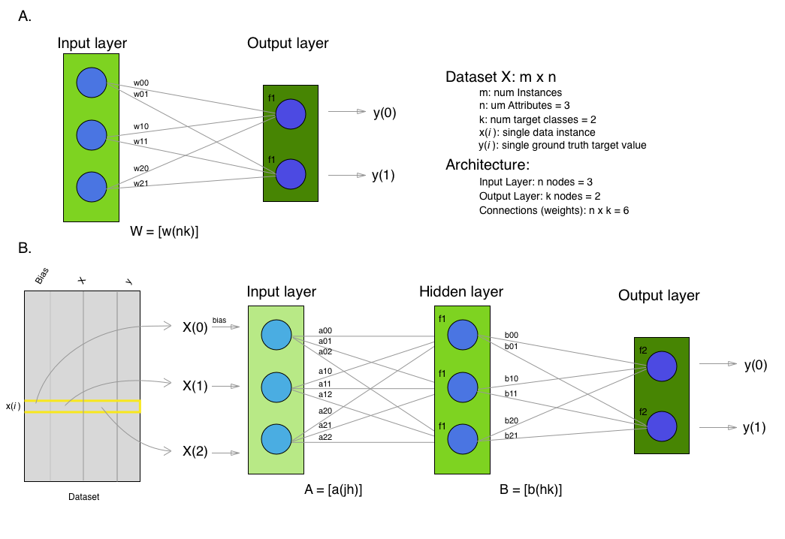
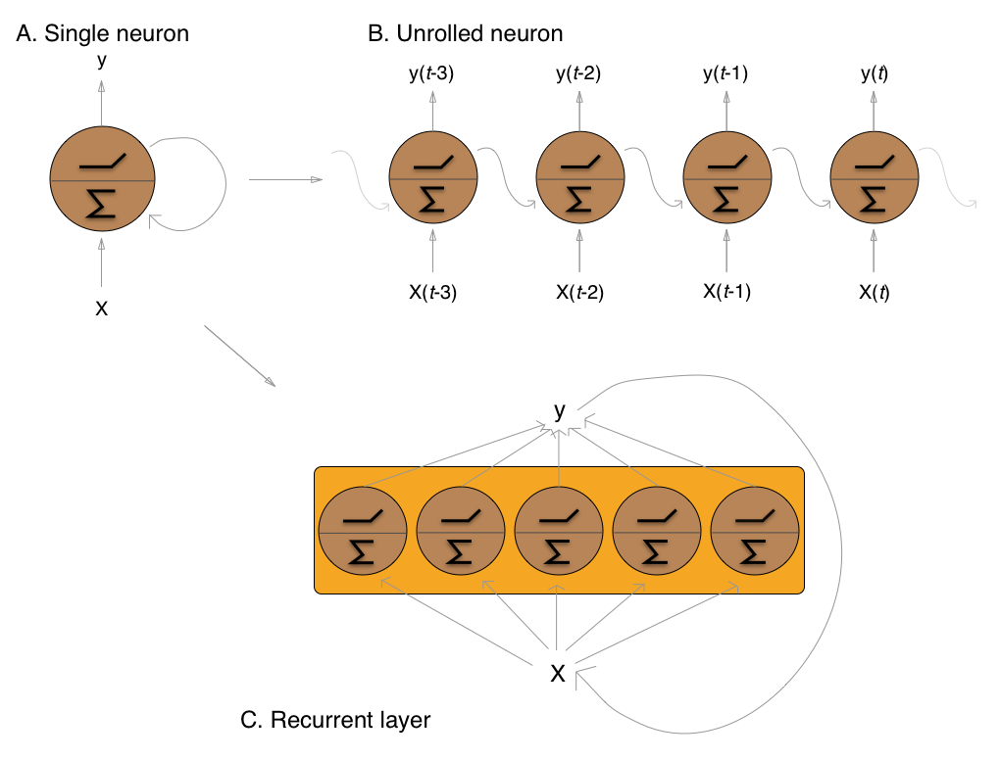
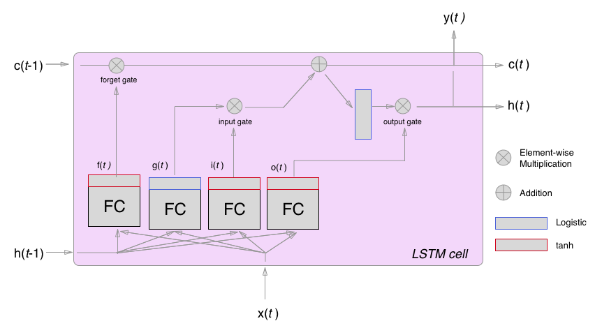
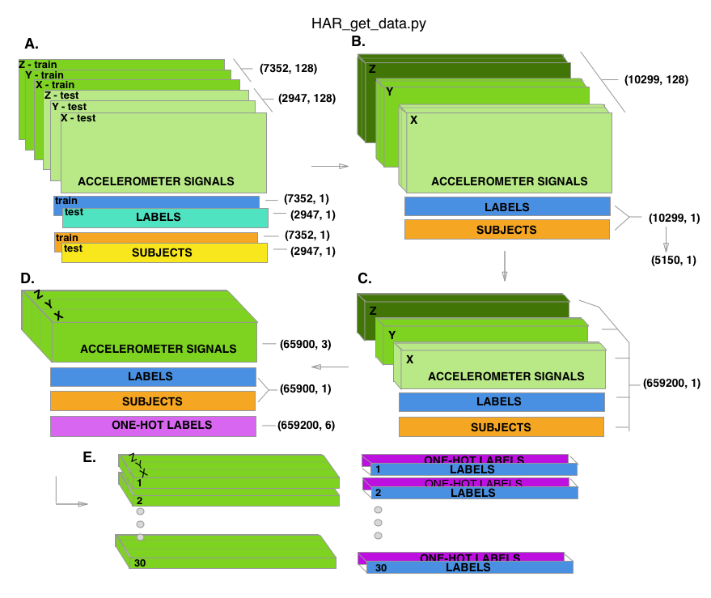
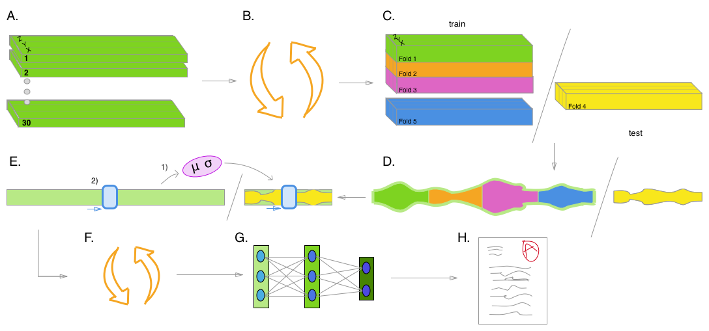

:author: Christian McDaniel
:email: clm121@uga.edu
:institution: University of Georgia

:author: Shannon Quinn
:email: spq@uga.edu
:institution: University of Georgia
:bibliography: citations

-----------------------------------------------------------------------------------------------------------------------------------------
Developing a Start-to-Finish Pipeline for Accelerometer-Based Activity Recognition Using Long Short-Term Memory Recurrent Neural Networks
-----------------------------------------------------------------------------------------------------------------------------------------

.. class:: abstract

Increased prevalence of smartphones and wearable devices has facilitated the collection of triaxial accelerometer data for numerous Human Activity Recognition (HAR) tasks. Concurrently, advances in the theory and implementation of long short-term memory (LSTM) recurrent neural networks (RNNs) has made it possible to process this data in its raw form, enabling on-device online analysis. In this two-part experiment, we have first amassed the results from thirty studies and reported their methods and key findings in a meta-analysis style review. We then used these findings to guide our development of a start-to-finish data analysis pipeline, which we implemented on a commonly used open-source dataset in a proof of concept fashion. The pipeline addresses the large disparities in model hyperparameter settings and ensures the avoidance of potential sources of data leakage that were identified in the literature. Our pipeline uses a heuristic-based algorithm to tune a baseline LSTM model over an expansive hyperparameter search space and trains the model on standardized windowed accelerometer signals alone. We find that we outperform other baseline models trained on this data and are able to compete with benchmark results from complex models trained on higher-dimensional data.

.. class:: keywords

Neural Network, Human Activity Recognition, Recurrent Neural Network, Long Short-Term Memory, Accelerometer, Machine Learning, Data Analysis, Data Science, Hyperparameter Optimization, Hyperparameter

Introduction
------------

Human Activity Recognition (HAR) is a time series classification problem in which a classifier attempts to discern distinguishable features from movement-capturing on-body sensors :cite:`KHC10`. The most common sensor for HAR tasks is the accelerometer, which measures high-frequency (30-200Hz) triaxial time series recordings, often containing noise, imprecision, missing data, and long periods of inactivity between meaningful segments :cite:`RDML05,BI04,OR16`. Consequently, attempts to use traditional classifiers typically require significant preprocessing and technical engineering of hand crafted features from raw data, resulting in a barrier to entry for the field and making online and on-device data processing impractical :cite:`GRX16,MS10,GBGG16,RDML05,OR16`.

The limitations of classical methods in this domain have been alleviated by concurrent theoretical and practical advancements in artificial neural networks (ANNs), which are more suited for complex non-linear data. While convolutional neural networks (CNNs) are attractive for their automated feature extraction capabilities during convolution and pooling operations :cite:`SS17,REBS17,FFH+16,SKP18,ZSO17,GRX16,OR16,GBGG16`, recurrent neural networks (RNNs) are specifically designed to extract information from time series data due to the recurrent nature of their data processing and weight updating operations :cite:`WZ89`. Furthermore, whereas earlier implementations of RNNs experienced problems when processing longer time series (tens to hundreds of time steps), the incorporation of a multi-gated memory cell in long short-term memory recurrent neural networks (LSTMs) :cite:`HS97` along with other regularization schemes helped alleviate these issues.

As RNN usage continues, numerous studies have emerged to address various aspects of understanding and implementing these complex models, namely regarding the vast architectural and hyperparameter combinations that are possible :cite:`GSS02,RG17,PW17,KJFF15,MKS17`. Unfortunately, these pioneering studies tend to focus on tasks other than HAR, leaving the time series classification tasks of HAR without domain-specific architecture guidance.

In a meta-analysis style overview of the use of LSTM RNNs for HAR experiments across 30 reports (discussed below), we found a general lack of consensus regarding the various model architectures and hyperparameters used. Often, a given pair of experiments explored largely or entirely non-overlapping ranges for a single hyperparameter. Key architectural and procedural details are often not included in the reports, making reproducibility impossible. The analysis pipelines employed are often lacking detail and sources of data leakage, where information from the testing data is exposed to the model during training, appear to be overlooked in certain cases. Without clear justifications for model implementations and deliberate, reproducible data analysis pipelines, objective model comparisons and inferences from results cannot be made. For these reasons, the current report seeks to summarize the previous implementations of LSTMs for HAR research available in literature and outline a structured data analysis pipeline for this domain. We implement a truncated version of our pipeline, optimizing a baseline LSTM over an expansive hyperparameter search space, and obtain results on par with benchmark studies. We suspect that our efforts will encourage scientific rigor in the field going forward and initiate more granular exploration of the field as we understand these powerful data analysis tools within this domain.

Background
-------------
This section is intended to give the reader a digestible introduction to ANNs, RNNs, and the LSTM cell. The networks will be discussed as they relate to multi-class classification problems as is the task in HAR.

*Artificial Neural Networks* The first ANN architecture was proposed by Drs. Warren McCulloch and Walter Pitts in 1943 as a means to emulate the cumulative semantic functioning of groups of neurons via propositional logic :cite:`MP43,Ger17`. Frank Rosenblatt subsequently developed the Perceptron in 1957 :cite:`Ros57`. This ANN variation carries out its step-wise operations via mathematical constructs known as linear threshold units (LTUs). The LTU operates by aggregating multiple weighted inputs and feeding this summation u through an activation function :math:`f(u)` or step function :math:`\text{step}(u)`, generating an interpretable output :math:`\tilde{y}` (e.g. 0 or 1) :cite:`Ger17`.

.. math::
  :type: eqnarray

  \tilde{y} &=& f(u) \\
            &=& f(w \cdot x)

where :math:`\cdot` is the dot product operation from vector calculus. :math:`x` is a single instance of the training data, containing values for all :math:`n` attributes of the data. As such, :math:`w` is also of length :math:`n`, and the entire training data set for all :math:`m` instances is a matrix :math:`X` of dimensions :math:`m` by :math:`n` (i.e., :math:`m` x :math:`n`).

A 2-layer ANN can be found in Figure :ref:`ANN` A. Each attribute in instance :math:`x(i)` represents a node in the perceptron's input layer, which simply provides the raw data to the the output layer - where the LTU resides. To represent :math:`k` target classes, :math:`k` LTU nodes are included in the output layer, each corresponding to a single class in :math:`y`. Each LTU's prediction :math:`\tilde{y}` indicates the predicted probability that the training instance belongs to the corresponding class. The LTU output with the largest value - :math:`\text{max}(\tilde{y})` - is taken as the overall predicted class for the instance of the data being analyzed. Taken over the entire dataset, each LTU has a prediction vector :math:`\tilde{y}_{k}` length :math:`m` and the entire output layer produces a prediction matrix :math:`\tilde{Y}` with dimensions :math:`m` x :math:`k`. Additionally, each LTU contains its own weight vector :math:`w_{k}` of length :math:`n` (i.e., a fully-connected network), resulting in a weight matrix :math:`W` of dimensions :math:`n` x :math:`k`.

ANNs often contain complex architectures with additional layers, which allow for nonlinear transformations of the data and increase the flexibility and robustness of the model. If we look at a simple three-layer neural network (see Figure :ref:`ANN` B), we see input and output layers as described above, as well as a layer in the middle, termed a *hidden layer*. This layer acts much like the output layer, except that its outputs :math:`z` for each training instance are fed into the output layer, which then generates predictions :math:`\tilde{y}` from :math:`z` alone. The complete processing of all instances of the dataset, or all instances of a portion of the dataset called a *mini-batch*, through the input layer, the hidden layer, and the output layer marks the completion of a single *forward pass*.

For the model to improve, the outputs generated by this forward pass must be evaluated and the model updated in an attempt to improve the model's predictive power on the data. An error term (e.g., sum of squared error (:math:`sse`)) is calculated by comparing individual predictions :math:`\tilde{y}_{k}` to corresponding ground truth target values in :math:`y_{k}`. Thus, an error matrix :math:`E` is generated containing error terms over all :math:`k` classes for all :math:`m` training instances. This error matrix is used as an indicator for how to adjust the weight matrix in the output layer so as to yield more accurate predictions, and the corrections made to the output layer give an indication of how to adjust the weights in the hidden layer. This process of carrying the error backward from the output layer through the hidden layer(s) is known as *backpropagation*. One forward pass and subsequent backpropagation makes up a single *epoch*, and the training process consists of many epochs repeated in succession to iteratively improve the model.

    **A.** A two-layer network and associated dimensions of the components. **B.** A three-layer network showing a single data instance x(*i*) being fed in as input. :label:`ANN`

The iterative improvements to the model are known as *optimization*, and many methods exist to carry this process out. The common example is stochastic gradient descent (SGD), which calculates the gradient of the error - effectively the steepness of :math:`E`'s location as it "descends" toward lower error - and adjusts the weight matrices at each layer in a direction opposite this gradient. The change to be applied to the weight matrices is mediated via a learning rate :math:`\eta` :cite:`Mil18`.

.. math::

  E = Y - f(X W)

optimization:

.. math::

  \text{min}_{W} \|E\|_{F}

.. math::

  hsse_{W} = \frac{1}{2} \displaystyle\sum_{c=0}^{k-1} (y_{c} - f(X \cdot w_{c})) \cdot (y_{c} - f(X \cdot w_{c}))

.. math::

  \frac{\partial hsse} {\partial w_{k}} = X*[ f'( X \cdot w_{k} )*e_{k} ]* \eta = -X*\delta_{k}* \eta

where :math:`f(...)` represents the activation function, :math:`min_{W}` represents the objective function of minimizing with respect to :math:`W`, and :math:`\|E\|_{F}` stands for the Frobenius norm on the error matrix :math:`E`. :math:`\text{hsse}_{W}` represents the halved (for mathematical convenience) sum of squared error, calculated for all :math:`k` nodes in the output layer. :math:`f'(...)` represents the derivative of the activation function over the term in the parentheses.

Looking at our three-layer neural network depicted in Figure :ref:`ANN`, a single epoch would proceed as follows:

1. Conduct a forward pass, compute :math:`\tilde{y}` and compare with :math:`y` to generate the error term:

.. math::

  z_{h} = f_{1} ( a_{_h} \cdot x )

.. math::

  \tilde{y}_{k} = f_{2} ( b_{_k} \cdot z )

.. math::

  e_{k} = y_{k} - \tilde{y}_{k}

2. Backpropagate the error regarding the correction needed for :math:`\tilde{y}`.

3. Backpropagate the correction to the hidden layer.

4. update weight matrices :math:`A` and :math:`B` via :math:`\delta^y` and :math:`\delta^z`:

.. math::
  :type: eqnarray

  b_{hk} &=& b_{hk} - z_{h} \delta^y_{k} * \eta \\
         &=& b_{hk} - \frac{ \partial hsse} {\partial b_{hk}} * \eta

.. math::
  :type: eqnarray

  a_{jh} &=& a_{jh} - x_{j} \delta^z_{h} * \eta \\
         &=& a_{jh} - \frac{ \partial hsse} {\partial a_{jh}} * \eta

:math:`sse` is commonly used as the error term for regression problems, whereas squared error or *cross entropy* is typical for classification problems.

.. math::

  \text{cross entropy} = -\displaystyle\sum_{i=1}^m \displaystyle\sum_{c=1}^k y_ic * log( f_{c}(x_{i}))

The high flexibility of neural networks increases the chances of overfitting, and there are various ways to avoid this. *Early stopping* is a technique that monitors the change in performance on a validation set (subset of the training set) and stops training once improvement slows sufficiently. *Weight decay* helps counter large updates to the weights during backpropagation and slowly shrinks the weights toward zero in proportion to their relative sizes. Similarly, the *dropout* technique "forgets" a specified proportion of the outputs from a layer's neurons by not passing those values on to the next layer. *Standardizing* the input is important, as it encourages all inputs to be treated equally during the forward pass by scaling and mitigating outliers' effects :cite:`Ger17,Mil18`.

Other hyperparameters tend to affect training efficiency and effectiveness and tend to differ with different datasets and types of data. Hammerla, et. al. found *learning rate* :math:`\eta` to be an important hyperparameter in terms of its effect on performance :cite:`HHP16`. Too small a learning rate and the model will exhibit slow convergence during training, while too large a value will lead to wild oscillations during optimization :cite:`Mil18`. Hammerla, et. al. also find the *number of units* per layer :math:`n` to be important, and Miller adds that too many hidden units is better than too few, leading to sparse layers of weight matrices versus restricting flexibility of the model, respectively. *Bias* helps account for irreducible error in the data and is implemeneted via a node whose inputs are always :math:`1`'s (top node in the input layer of Figure :ref:`ANN` A). Reimers and Gurevych emphasize the importance of weight initialization for model performance in their survey of the importance of hyperparameter tuning for using LSTMs for language modeling :cite:`RG17`. Jozefowicz, et. al. cite the initialization of the forget gate bias to 1 as a major factor in LSTM performance :cite:`JZS15`.

*Recurrent Neural Networks (RNNs)* The recurrent neuron, developed by Drs. Ronald Williams and David Zipser in 1989 :cite:`WZ89`, is extremely useful in training a model on sequence data. Recurrent neurons address temporal dependencies along the temporal dimension of time series data by sending their outputs both forward to the next layer and "backward throught time," looping the neuron's output back to itself as input paired with new input from the previous time step. Thus, a component of the input to the neuron is an accumulation of activated inputs from each previous time step. Figure :ref:`RNN` depicts a recurrent neuron as part of a recurrent layer. Recurrent layers are placed between input layers and output layers and can be used in succession with densely connected and convolutional layers.

  The recurrent neuron from three perspectives. **A.** A single recurrent neuron, taking input from X, aggregating this input over all timesteps in a summative fashion and passing the summation through an activation function at each timestep. **B.** The same neuron unrolled through time, making it resemble a multilayer network with a single neuron at each layer. **C.** A recurrent layer containing five recurrent nodes, each of which processes the entire dataset X through all time point. :label:`RNN`

Instead of a single weight vector as in ANN neurons, RNN neurons have two sets of weights, one (:math:`wx`) for the new inputs :math:`x_{t}` and one (:math:`wy`) for the outputs of the previous time step :math:`y_{(t-1)}`, yielding matrices :math:`W_{x}` and :math:`W_{y}` when taken over the entire layer. The portion of the neuron which retains a running record of the previous time steps is the *memory cell* or just the *cell* :cite:`Ger17`.

Outputs of the recurrent layer:

.. math::

  y_{(t)} = \phi(W_{x} \cdot x_{(t)} + W_{y} \cdot Y_{(t-1)} + b)

where :math:`\phi` is the activation function and :math:`b` is the bias vector of length :math:`n` (the number of neurons).

The *hidden state*, or the *state*, of the cell (:math:`h_{(t)}`) is the information that is kept in memory over time.

To train these neurons, we "unroll" them after a complete forward pass to reveal a chain of linked cells the length of time steps :math:`t` in a single input. We then apply standard backpropagation to these links, calling the process backpropagation through time (BPTT). This works relatively well for very short time series, but once the number of time steps increases to tens or hundreds of time steps, the network essentially becomes very deep during BPTT and problems arise such as very slow training and exploding and vanishing gradients :cite:`Ger17`. Various hyperparameter and regularization schemes exist to alleviate exploding/vanishing gradients, including *gradient clipping* :cite:`PMB13`, *batch normalization*, dropout, and the long short-term memory (LSTM) cell originally developed by Sepp Hochreiter and Jurgen Schmidhuber in 1997 :cite:`HS97`.

*Long Short-Term Memory (LSTM) RNNs* The LSTM cell achieves faster training and better long-term memory than vanilla RNN neurons by maintaining two state vectors, the short-term state :math:`h_{(t)}` and the long-term state :math:`c_{(t)}`, mediated by a series of inner gates, layers, and other functions. These added features allow the cell to process the time series in a deliberate manner, recognizing meaningful input to store long-term and later extract when needed, and forget unimportant information or that which is no longer needed :cite:`Ger17`.

  The inner mechanisms of an LSTM cell. From outside the cell, information flows similarly as with a vanilla recurrent cell, except that the state now exists as two parts, one for long-term memory (:math:`c_{(t)}`) and the other for short-term memory (:math:`h_{(t)}`). Inside the cell, four different sub-layers and associated gates are revealed. :label:`LSTM`

As can be seen in Figure :ref:`LSTM`, when the forward pass advances by one time step, the new time step's input enters the LSTM cell and is copied and fed into four independent fully-connected layers (each with its own weight matrix and bias vector), along with the short-term state from the previous time step, :math:`h_{(t-1)}`. The main layer is :math:`g_{(t)}`, which processes the inputs via :math:`tanh` activation function. In the basic recurrent cell, this is sent straight to the output; in the LSTM cell, part of this is incorporated in the long-term memory as decided by the *input gate*. The input gate also takes input from another layer, :math:`i_{(t)}`, which processes the inputs via the sigmoid activation function :math:`\sigma` (as do the next two layers). The third layer, :math:`f_{(t)}`, processes the inputs, combines them with :math:`c_{(t-1)}`, and passes this combination through a *forget gate* which drops a portion of the information therein. Finally, the fourth fully-connected layer :math:`o_{(t)}` processes the inputs and passes them through the *output gate* along with a copy of the updated long-term state :math:`c_{(t)}` after its additions from :math:`f_{(t)}`, deletions by the forget gate, further additions from the filtered :math:`g_{(t)}`-:math:`i_{(t)}` combination and a final pass through a :math:`tanh` activation function. The information that remains after passing through the output gate continues on as the short-term state :math:`h_{(t)}`.

.. math::

  i_{(t)} = \sigma (W){xi} \cdot x_{(t)} + W_{hi} \cdot h_{(t-1)} + b_{i}

.. math::

  f_{(t)} = \sigma (W){xf} \cdot x_{(t)} + W_{hf} \cdot h_{(t-1)} + b_{f}

.. math::

  o_{(t)} = \sigma (W){xo} \cdot x_{(t)} + W_{ho} \cdot h_{(t-1)} + b_{o}

.. math::

  g_{(t)} = \sigma (W){xg} \cdot x_{(t)} + W_{hg} \cdot h_{(t-1)} + b_{g}

.. math::

  c_{(t)} = f_{(t)} \otimes c_{(t-1)} + i_{(t)} \otimes g_{(t)}

.. math::

  y_{(t)} = h_{(t)} = o_{(t)} \otimes \tanh(c_{(t)})

where :math:`\otimes` represents element-wise multiplication :cite:`Ger17`.

Related Works
-------------
The following section outlines the nuanced hyperparameter combinations used by 30 studies available in literature in a meta-analysis style survey. Published works as well as pre-published and academic research projects were included so as to gain insight into the state-of-the-art methodologies at all levels and increase the volume of works available for review. It should be noted that the following summaries are not necessarily entirely exhaustive regarding the specifications listed. Additionally, many reports did not include explicit details of many aspects of their research.

The survey of previous experiments in this field provided blueprints for constructing an adequate search space of hyperparameters. We have held our commentary on the findings of this meta-study until the Discussion section.

*Experimental Setups* Across the 30 studies, each used a unique implementation of LSTMs for the research conducted therein. Data sets used include the OPPORTUNITY Activity Recognition dataset :cite:`OR16,RVCK17,GRX16,ZYCG17,Bro17,GP17`, UCI HAR dataset :cite:`U18,ZYCG17`, PAMAP2 :cite:`OR16,Set18,GP17,ZYH+18`, Skoda :cite:`OR16,GP17`, WISDM :cite:`CZZZ16,U18`, and various study-specific and/or internally-collected datasets :cite:`MMB+18`. Activity classes include “Activities of Daily Life” (ADL; e.g., opening a drawer, climbing stairs, walking, or sitting down), smoking :cite:`Ber17`, cross-country skiing :cite:`REBS17`, eating :cite:`KDD17`, nighttime scratching :cite:`MAR+16`, driving :cite:`CFF+17`, and so on.

Data analysis pipelines employed include cross validation :cite:`LBMG15`, repeating trials :cite:`SS16`, and various train-validation-test splitting procedures :cite:`SS17,WA17,HDJS18`. Most studies used the Python programming language and implemented LSTMs via third-party libraries such as Theano Lasagne, RNNLib, and Keras with TensorFlow.

*Preprocessing* Some reports kept preprocessing to a minimum, e.g., linear interpolation to fill missing values :cite:`OR16`, per-channel normalization :cite:`OR16,HDJS18`, and standardization :cite:`CZZZ16,ZYCG17`. Zhao, et. al. standardized the data to have 0.5 standard deviation :cite:`ZYCG17` as opposed to the typical unit standard deviation, citing Wiesler, et. al. as supporting this nuance for deep learning implementations :cite:`WRSN14`.

More advanced noise reduction strategies include kernel smoothing :cite:`GRX16`, removing the gravity component :cite:`MAR+16`, applying a low-pass filter :cite:`LBMG15`, removing the initial and last 0.5 seconds :cite:`HDJS18`. Moreau, et. al. grouped together segments of data from different axes, tracking the dominant direction of motion across axes :cite:`MAR+16`.

For feeding the data into the models, the sliding window technique was commonly used, with window sizes ranging from 32 :cite:`MMB+18` to 5000 :cite:`ZYCG17` milliseconds (ms); typically 50% of the window size was used as the step size :cite:`REBS17,SS17,Bro17,OR16`. Guan and Plotz ran an ensemble of models, each using a random sampling of a random number of frames with varying sample lengths and starting points. This method is similar to the bagging scheme of random forests and was implemented to increase robustness of the model :cite:`GP17`.

*Architectures* Numerous architectural and hyperparameter choices were made among the various studies. Most studies used two LSTM layers :cite:`OR16,CZZZ16,KDD17,RVCK17,U18,ZYCG17,GP17,HDJS18,MMB+18`, while others used a single layer :cite:`WA17,Bro17,SS16,CFF+17,ZWYM16,ZYH+18,SKP18`, three layers :cite:`ZWYM16`, or four layers :cite:`MP17`.

The number of units (i.e., nodes, LSTM cells) per layer range from 3 :cite:`MAR+16` to 512 :cite:`Set18`. Several studies used different numbers of units for different circumstances – e.g., three units per layer for unilateral movement (one arm) and four units per layer for bilateral movement (both arms) :cite:`MAR+16` or 28 units per layer for the UCI HAR dataset (lower dimensionality) versus 128 units per layer for the Opportunity dataset :cite:`ZYCG17`. Others used different numbers of units for different layers of the same model – e.g., 14-14-21 for a 3-layer model :cite:`ZWYM16`.

Almost all of the reports used the sigmoid activation for the recurrent connections within cells and the tanh activation function for the LSTM cell outputs, as these are the activation functions used the original paper :cite:`HS97`. Other activation functions used for the cell outputs include ReLU :cite:`ZYCG17,HDJS18` and sigmoid :cite:`ZYH+18`.

Several studies designed or utilized novel LSTM architectures that went beyond the simple tuning of hyperparameters. Architectures tested include the combination of CNNs with LSTMs such as ConvLSTM :cite:`GRX16`, DeepConvLSTM :cite:`OR16,SS17,Bro17`, and the multivariate fully convolutional LSTM network (MLSTM-FCN) :cite:`KMDH18`; innovations regarding the connections between hidden units including the bidirectional LSTM (b-LSTM) :cite:`REBS17,Bro17,MAR+16,LBMG15,HHP16`, hierarchical b-LSTM :cite:`LC12`, deep residual b-LSTM (deep-res-bidir LSTM) :cite:`ZYCG17`, and LSTM with peephole connections (p-LSTM) :cite:`REBS17`; and other nuanced architectures such as ensemble deep LSTM :cite:`GP17`, weighted-average spatial LSTM (WAS-LSTM) :cite:`ZYH+18`, deep-Q LSTM :cite:`SKP18`, the multivariate squeeze-and-excite fully convolutional network ALSTM (MALSTM-FCN) :cite:`KMDH18`, and similarity-based LSTM :cite:`FFH+16`. Note that the term “deep” indicates the use of multiple layers of hidden connections - generally three or more LSTM layers qualifies as "deep".

The use of densely-connected layers before or after the LSTM layers was also common. Kyritsis, et. al. added a dense layer with ReLU activation after the LSTM layers, Zhao, et. al. included a dense layer with tanh activation after the LSTMs, and Musci, et. al. used a dense layer before and after its two LSTM layers :cite:`KDD17,ZWYM16,MMB+18`. The WAS-LSTM, deep-Q LSTM, and the similarity-based LSTM used a combination of dense and LSTM hidden layers.

*Training* Weight initialization strategies employed include random orthogonal initialization :cite:`OR16,SS17`, fixed random seed :cite:`Set18`, the Glorot uniform initialization :cite:`Bro17`, random uniform initialization on [-1, 1] :cite:`MAR+16`, or using a random normal distribution :cite:`HDJS18`. For mini-batch training, reported batch sizes range from 32 :cite:`RVCK17,Set18` to 450 :cite:`Ber17` training examples (e.g., windows) per batch.

Loss functions for monitoring training include categorical cross-entropy :cite:`OR16,MP17,CZZZ16,SS17,KDD17,Set18,Bro17,HDJS18,ZYH+18`, F1 score loss :cite:`GP17`, mean squared error (MSE) :cite:`CFF+17`, and mean absolute error :cite:`ZWYM16`. During back propagation, various updating rules – e.g. RMSProp :cite:`OR16,Set18,Bro17`, Adam :cite:`MP17,KDD17,Bro17,HDJS18,ZYH+18`, and Adagrad :cite:`SS16,HHP16` – and learning rates – 10^-7 :cite:`SS16`, 10^-4 :cite:`SS17,GP17`, 2e-4 :cite:`MAR+16`, 5e-4 :cite:`LBMG15`, and 10^-2 :cite:`OR16` are used.

Regularization techniques employed include weight decay of 90% :cite:`OR16,SS17`; update momentum of 0.9 :cite:`MAR+16`, 0.2 :cite:`LBMG15`, or the Nesterov implementation :cite:`SS16`; dropout (e.g., 50% :cite:`OR16,SS17` or 70% :cite:`ZWYM16`) between various layers; batch normalization :cite:`ZYCG17`; or gradient clipping using the norm :cite:`ZYCG17,HDJS18,ZYH+18`. Broome chose to test the stateful configuration for its baseline LSTM :cite:`Bro17`. In this configuration, unit memory cell weights are maintained between each training example instead of resetting them to zero after each forward pass.

The number of epochs specified ranged from 100 :cite:`Bro17` to 10,000 :cite:`HDJS18`. Many studies chose to use early stopping to prevent overfitting :cite:`JWHT17`. Various patience schemes, specifying how many epochs with no improvement above a given threshold the model should allow, were chosen.

*Performance Measures* Various performance measures were used to assess the performance of the model, including the F1 score - used by most :cite:`OR16,Bro17,GRX16,ZYCG17,Bro17`, classification error :cite:`REBS17`, accuracy :cite:`SS17,Set18`, and ROC :cite:`MAR+16,HDJS18`.

As this meta-analysis style overview has shown, there are many different model constructions being employed for HAR tasks. The work by the aforementioned studies as well as others have laid the groundwork for this field of research.

Experimental Setup
------------------
We implemented a truncated version of our Pipeline, and have made code available for running the entire Pipeline on the UCI HAR Dataset at https://github.com/xtianmcd/accelstm.

*Data* Although many studies use the gyroscope- and magnetometer-supplemented records from complex inertial signals, accelerometer data is the most ubiquitous modality in this field and training models on this data alone helps illuminate the robustness of the model and requires lower computational complexity (i.e., more applicable to online and on-device classifications). As such, this report trains its models on triaxial accelerometer data alone.

The primary dataset used for our experiments is the Human Activity Recognition Using Smartphones Data Set (UCI HAR Dataset) from Anguita, et. al. :cite:`AGO+13b`.

*UCI HAR Dataset* Classes (6) include walking, climbing stairs, descending stairs, sitting, standing, and laying down. Data was collected from built-in accelerometers and gyroscopes (not used in our study) in smartphones worn on the waists of participants.

A degree of preprocessing was applied to the raw signals themselves by the data collectors. The accelerometer data (recorded at 50Hz) was preprocessed to remove noise by applying a third order low pass Butterworth filter with corner frequecy of 20Hz and a median filter. A second filter was then applied to the total accelerometer signal (T) to remove the gravity component, leaving the isolated body accelerometer signal (B). The accelerometer signals for both B and T were provided as pre-split single-axis windowed signals divided into separate files; see Figure :ref:`HAR` A. Windows contained 2.56 seconds (128 time steps) of data and had a step size of 50% of the window size. A 70:30 train-to-test split was used, splitting one of the participants between the two sets.

*Preprocessing* We kept preprocessing to a minimum. We first attempted to “undo” as much of the preprocessing already performed on the data and reformat the data for feeding it into the network. We did this to establish a baseline format for the data at the start of the Pipeline so that data from different datasets can be used. The code for this procedure can be found in the GitHub repository linked above in the file accelstm/src/data/HAR_get_data.py. First, we re-combined the training and testing sets (Figure :ref:`HAR` B). We effectively removed the windows by concatenating together time points from every other window, reforming contiguous time series (Figure :ref:`HAR` C). We then combined each axis-specific time series to form the desired triaxial data format, where each time point consists of the accelerometer values along the x-, y-, and z-axes as a 3-dimensional array (Figure :ref:`HAR` D). We generated one-hot labels in that step as well. We kept track of the participant to which each record belonged (Figure :ref:`HAR` E) so that no single participant was later included in both training and testing sets.

  Depiction of the "undoing" procedure to return the data in the UCI HAR Dataset to its unprocessed form. **A.** Data is provided as train/test-split single-axis windowed acccelerometer signals. **B.** Combine train and test sets. **C.** Remove windows; reformat labels and subject include's accordingly. **D.** Axes are combined into a three-dimensional time series; one-hot labels are generated. **E.** 3-D time series and labels are grouped by subject to emulate subject-wise data acquisition. :label:`HAR`

We used an 80:20 training-to-testing split (Figure :ref:`Pipeline` A-D), and *subsequently* standardized the data by first fitting the standardization parameters (i.e., mean and standard deviation) to the training data and then using these parameters to standardize the training and testing sets separately (Figure :ref:`Pipeline` E1). This sequenced procedure prevents exposing any summary information about the testing set to the model before training, i.e., data leakage. Finally, a fixed-length sliding window was applied (Figure :ref:`Pipeline` E2), the windows were shuffled to avoid localization during training (Figure :ref:`Pipeline` F), and the data was ready to feed into the LSTM neural network.

  Outline of the proposed data analysis pipeline. **A.** The data should start as raw tri-axial data files separated into individual records; one record per individual. **B.** Shuffle the records. **C.** Partition the records into k equal groupings for the k-fold cross validation. **D.** Concatenate the records end-to-end within the train and test sets (for feeding in to the LSTM). **E.** Standardize the data, careful to avoid data leakage; subsequently window the data. **F.** Shuffle the windowed data sets. **G.** If in Part 1 of the Pipeline, optimize the model's hyperparameters; if in Part 2, train the optimized model on the training data. **H.** Predict outcomes for the testing data using the trained model and score the results. :label:`Pipeline`

*Training* All model training code can be found in the GitHub repository linked above in the folder accelstm/src/models. Training the model was broken up into two sections, the first of which consisted of hyperparameter optimization. We employed a heuristic-based search, namely the tree-structured Parzen (TPE) expected improvement (EI) algorithm, in order to more efficiently navigate the vast hyperparameter search space. EI algorithms estimate the ability of a supposed model :math:`x` to outperform some performance standard :math:`y^*`, and TPE aims to assist this expectation by heuristically modeling the search space without requiring exhaustive exploration thereof. TPE iteratively substitutes equally-weighted prior distributions over hyperparameters with Gaussians centered on the examples seen over time. This re-weighting of the search space allows TPE to estimate :math:`p(y)` and :math:`p(x|y)` - regarding the performance :math:`y` from suggested model :math:`x` - ultimately allowing the EI algorithm to estimate :math:`p(y|x)` of model :math:`M` via Bayes Theorem :cite:`BBBK11`.

.. math::

  EI_{y^*}(x) := \int_{-\infty}^\infty \text{max}(y^* - y, 0) p_M(y|x)dy

becomes

.. math::
  :type: eqnarray

  EI_{y^*}(x) &=& \int_{-\infty}^{y^*} \text{max}(y^* - y, 0) p_M(y|x)dy \\
              &=& \int_{-\infty}^{y^*} \frac{p(x|y)p(y)}{p(x)}dy \\
              &=& \frac{\gamma y^* l(x) \int_{-\infty}^{y^*} p(y)dx}{y l(x) + (1-\gamma)g(x)} \\
              &\propto& (\gamma + \frac{g(x)}{l(x)} (1-\gamma))^{-1}

where

.. math::

  \gamma = p(y^* < y)

.. math::
  :type: eqnarray

  p(x|y) &=& l(x) \text{ if } y < y^* \\
         &=& g(x) \text{ if } y \geq y^*

and :math:`p(a|b)` is the conditional probability of :math:`a` given event :math:`b`.

The ranges of hyperparameters were devised to include all ranges explored by the various reports reviewed in the above section of this paper, as well as any other well-defined range or setting used in the field, yielding an immense search space with trillions of possible combinations. The hyperparameters included in the search space are listed in Table :ref:`hyperparameters`. Due to constraints in the Python package used for hyperparameter optimization (i.e., hyperas from hyperopt), a subsequent tuning of the window size, stride length and number of layers needed to be performed on the highest performing combination of all other hyperparameters via randomized grid search. This step was omitted in the current proof of concept experiment, but the code for carrying out the grid search can be found in the file accelstm/src/models/more_opt.py. Thus, for initial optimization and the final cross validation (detailed below), data was partitioned using a window size of 128 with 50% stride length and fed into a 2-layer LSTM network.

.. raw:: latex

   \setlength{\tablewidth}{1.0\linewidth}

.. table:: The various hyperparameters included in the search space, and their respective ranges. :label:`hyperparameters`
  :class: w

  +--------------------+------------------------------------------------+------------------------------------------------------------------------------------------------------------------+
  | Category           | Hyperparameter                                 | Range                                                                                                            |
  +====================+================================================+==================================================================================================================+
  | Data Processing    | Window Size                                    | 24, 48, 64, 128, 192, 256                                                                                        |
  |                    +------------------------------------------------+------------------------------------------------------------------------------------------------------------------+
  |                    | Stride                                         | 25%, 50%, 75%                                                                                                    |
  |                    +------------------------------------------------+------------------------------------------------------------------------------------------------------------------+
  |                    | Batch Size                                     | 32, 64, 128, ..., 480                                                                                            |
  +--------------------+------------------------------------------------+------------------------------------------------------------------------------------------------------------------+
  | Archi-tecture      | Units                                          | 2, 22, 42, 62, ..., 522                                                                                          |
  |                    +------------------------------------------------+------------------------------------------------------------------------------------------------------------------+
  |                    | Layers                                         | 1, 2, 3                                                                                                          |
  +--------------------+------------------------------------------------+------------------------------------------------------------------------------------------------------------------+
  | Forward Processing | Activation Function (unit, state)              | softmax, tanh, sigmoid, ReLU, linear                                                                             |
  |                    +------------------------------------------------+------------------------------------------------------------------------------------------------------------------+
  |                    | Bias                                           | True, False                                                                                                      |
  |                    +------------------------------------------------+------------------------------------------------------------------------------------------------------------------+
  |                    | Weight Initialization (cell, state)            | zeros, ones, random uniform dist., random normal dist., constant (0.1), orthogonal, Lecun normal, Glorot uniform |
  +--------------------+------------------------------------------------+------------------------------------------------------------------------------------------------------------------+
  | Regular-ization    | Regularization (cell, state, bias, activation) | None, L2 Norm, L1 Norm                                                                                           |
  |                    +------------------------------------------------+------------------------------------------------------------------------------------------------------------------+
  |                    | Weight Dropout (unit, state)                   | uniform distribution (0, 1)                                                                                      |
  |                    +------------------------------------------------+------------------------------------------------------------------------------------------------------------------+
  |                    | Batch normalization                            | True, False                                                                                                      |
  +--------------------+------------------------------------------------+------------------------------------------------------------------------------------------------------------------+
  | Learning           | Optimizers                                     | SGD, RMSProp, Adagrad, Adadelta, Nadam, Adam                                                                     |
  |                    +------------------------------------------------+------------------------------------------------------------------------------------------------------------------+
  |                    | Learning Rate                                  | :math:`10^{-7}, 10^{-6}, 10^{-5}, 10^{-4}, 10^{-3}, 10^{-2}, 10^{-1}`                                            |
  +--------------------+------------------------------------------------+------------------------------------------------------------------------------------------------------------------+

For the second portion of the experiment, the Pipeline is completed via 5-fold cross validation, where the folds were made at the participant level so that no single participant's data ended up in both training and testing sets.

*Languages and Libraries* All models were written in the Python programming language. The LSTMs were built and run using the Keras library and TensorFlow as the backend heavy lifter. Hyperas from Hyperopt was used to optimize the network. Scikit learn provided the packages for cross validation, randomized grid search, and standardization of data. Numpy and Pandas were used to read and reformat the data among various other operations.

Results
-------
During preliminary testing, we found that the model performed better on the total raw accelerometer signal (T) compared to the body-only data with the gravity-component (B) removed. As such, we used the total accelerometer signal (T) in our experiment.

The hyperparameter optimization explored a search space with trillions of possible parameter combinations. Due to time constraints, we stopped the search after six full days (hundreds of training iterations), during which time the suggested models' accuracies on test sets had ranged from 12.66% to 94.96%. The algorithm found several high-performing models and had used at least once all the values possible for each activation function, initialization strategy, regularization strategy, learning rate, and optimizer in the search space. The algorithm had tested models that both used and omitted batch normalization and bias, and it had tested dropout values between 0.005 and 0.991, batch sizes between 35 and 441 samples per batch, and from 10 to 508 units at both of the two layers.

Due to limited time to run our experiments, we conducted part two of the experiment concurrently with part one using a baseline LSTM architecture we felt would be a good starting point based on notes throughout the literature. The hyperparameter settings used in the model are as follows: window size, 128 time steps; step size, 50% of window size; number of layers, 2; units (layer1), 128; units (layer2), 114; batch size, 64; cell activation, tanh; recurrent activation, sigmoid; dropout, 0.5; weight initialization, Glorot Uniform; regularization, None; optimizer, RMSProp; bias, yes. We ran 5-fold CV on the model and computed the overall and class-wise F1 scores and accuracies. Cross validation yielded an average accuracy of 90.97% and F1 score of 0.90968, with a single best run of 95.25% accuracy and 0.9572 F1 score. We include the single best run for comparison with other reports, many of which do not report evidence of using cross validation or repeated trials.

.. table:: Results table including results from baseline LSTM models trained on all 9 features provided in the dataset - total accelerometer signals (T), body accelerometer signals (gravity component removed, B), gyroscope signals (G). One of the baseline LSTM's did not explicitly specify the number of features used but only mentioned accelerometer signals. We provide results from Part 1 (P1, Hyperparameter Optimization) and Part 2 (P2, Cross-Validation) of our Pipeline. P2 scores include accuracies as percentages and F1 scores as decimals. :label:`compare`

  +--------------------------+-----------------+-----------+
  | Model                    | Performance     | Features  |
  +==========================+=================+===========+
  | Baseline LSTM 1          | 90.77%          | 9 (T,B,G) |
  +--------------------------+-----------------+-----------+
  | Baseline LSTM 2          | 85.35%          | 3-9 (?)   |
  +--------------------------+-----------------+-----------+
  | **Pipeline P1 (Best)**   | **93.47%**      | **3**     |
  +--------------------------+-----------------+-----------+
  | **Pipeline P2 (CV)**     | **90.97%**      | **3**     |
  |                          +-----------------+-----------+
  |                          | **0.90968**     | **3**     |
  +--------------------------+-----------------+-----------+
  | **Pipeline P2 (Best)**   | **95.25%**      | **3**     |
  |                          +-----------------+-----------+
  |                          | **0.9572**      | **3**     |
  +--------------------------+-----------------+-----------+

Discussion
-----------
The execution of HAR research in various settings from the biomedical clinic early on :cite:`BMT+01,RDML05,BTvHS98` to current-day innovative settings such as the automobile :cite:`CFF+17`, the bedroom :cite:`MAR+16`, the dining room :cite:`KDD17`, and outdoor sporting environments :cite:`REBS17` justifies the time spent expanding this area of research. As LSTM models are increasingly demonstrated to have potential for HAR research, the importance of deliberate and reproducible works is paramount.

*Review of Previous Works* A survey of the literature revealed a lack of cohesiveness regarding the use of LSTMs for accelerometer data and the overall data analysis pipeline. We grew concerned with possible sources of data leakage. Test set data should come from different participants than those used for the training data :cite:`HTF17`, and no information from the test set should be exposed to the model before training.

We were surprised to see some of the more advanced preprocessing techniques being employed. Much of the appeal of non-linear models such as neural networks is their ability to learn from raw data itself and independently perform smoothing and feature extraction on noisy data through parameterized embeddings of the data. For example, Karpathy's 2015 study of LSTMs for language modeling showed specific neurons being activated when quotes were opened and deactivated when the quotes were closed, while others were activated by parenthetical phrases, marked the end of sentences, and so on :cite:`KJFF15`. Additionally, these preprocessing methods are more computationally expensive and less realistic for online and on-device implementations than is desired. The improved performance of the model on the total accelerometer signal (T) versus the body-only signal (B) with the gravity component removed demonstrates the promising potential of non-linear data-dependent models for classifying complex noisy data and supports our claim that extensive preprocessing is not necessary.

We do feel standardization is justified for this data due to its complexity and poor signal-to-noise ratio. Standardization is often important for data-dependent models such as LSTMs since the presence of outliers and skewed distributions may distort the weight embeddings :cite:`JWHT17`.

*Hyperparameter Optimization and Data Analysis Pipeline* We structured our experiments with the objective of maintaining simplicity, relying as much as possible on the baseline model itself, maximizing generalizability and reproducibility of our methods and results, and unifying the existing methods and results in literature.

We saw very promising results from the hyperparameter optimization portion of the experiment. The TPE algorithm, although not run to completion in this experiment, was able to navigate the search space and find several well-performing models. We chose to err on the side of caution by using very granular ranges over the numerical hyperparameters, and as a result we ran out of time even using the heuristic-based TPE algorithm. We suggest further experiments to reduce the search space by using less granular ranges over the numeric hyperparameters, and exploring more advanced heuristic search methods. Doing so will decrease the search time and allow completion of the entire Pipeline in a more reasonable amount of time. Nonetheless, the TPE's so-far-best model at the time of termination and our baseline model from Part 2 outperformed other baseline LSTMs trained on higher dimensional data from the same dataset :cite:`U18,ZYCG17`; see Table :ref:`compare`.

We also compare our performance with other benchmark experiments on the UCI HAR dataset. Compared with more complex LSTMs trained using more features, our averaged cross validation results scored competitively with the b-LSTM (91.09%), the residual LSTM (91.55%), and the deep res-bidir-LSTM (93.57%) all from Zhao, et. al. :cite:`ZYCG17`. As we found no evidence of cross validation in these other reports, we compare our single best-performing test's accuracy of 95.25% and F1 score of 0.9572 and find it to compete with the highest scoring models found in literature: 4 layer LSTM (96.7% accuracy, 0.96 F1score) :cite:`MP17`, MLSTM-FCN and MALSTM-FCN (96.71% accuracy) :cite:`KMDH18`, and one-vs-one (OVO) SVM (96.4% accuracy, 551 features) :cite:`ROGA+13`.

Conclusion/Future Work
--------------------------------

We demonstrate the ability for a baseline LSTM model trained solely on raw triaxial accelerometer data (without gravity component removed) to perform competitively with classical models trained on hundreds of hand-crafted features and with other more complex LSTM models trained on higher dimensional sensor data.

We demonstrate the ability to optimize a data-centric model over an expansive hyperparameter search space and train it end-to-end within a scientifically rigorous and deliberate Data Analysis Pipeline. The code used in this project can be found at https://github.com/xtianmcd/accelstm.

Going forward, we would like to repeat this experiment to average performances from different models returned by the TPE algorithm; we would also like to repeat this experiment on other HAR datasets. Further exploration should be done to analyze why the algorithm’s selections are indeed superior, how different data affect these choices, and how the LSTM cells within the models themselves are representing this type of data as has been done with LSTMs in other domains.

We hope that this Pipeline will serve useful in producing explicit and reproducible experiment results and in pushing the field forward in a methodical way.
