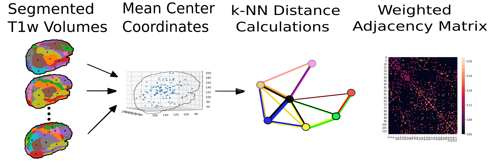
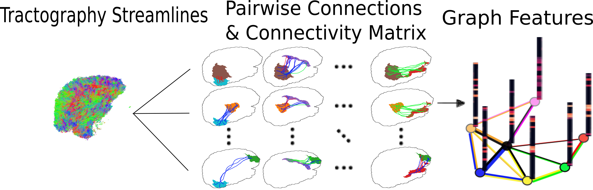
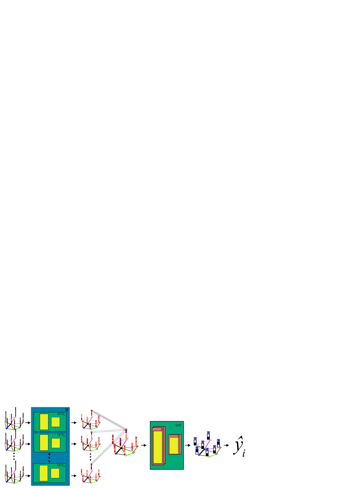
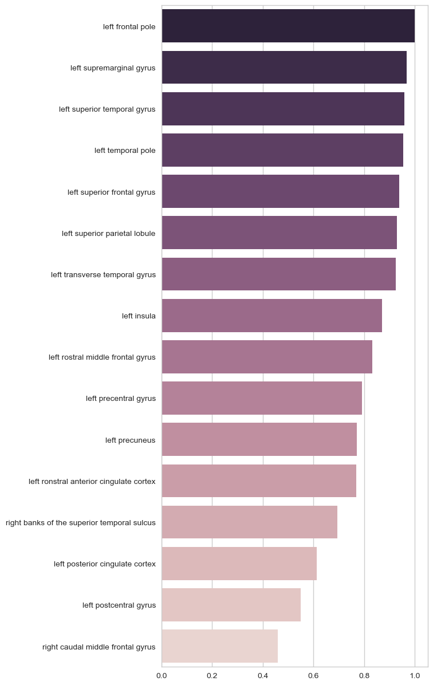

:author: Christian McDaniel
:email: clm121@uga.edu
:institution: University of Georgia

:author: Shannon Quinn, PhD
:email: spq@uga.edu
:institution: University of Georgia
:corresponding:
:bibliography: bibli

***********************************************************************************************************************************************
Developing a Graph Convolution-Based Analysis Pipeline for Multi-Modal Neuroimage Data: An Application to Parkinson's Disease
***********************************************************************************************************************************************

.. class:: abstract

Parkinson's disease (PD) is a highly prevalent neurodegenerative condition originating in subcortical areas of the brain and resulting in progressively worsening motor, cognitive, and psychiatric (e.g., depression) symptoms. Neuroimage data is an attractive research tool given the neurophysiological origins of the disease. Despite insights potentially available in magnetic resonance imaging (MRI) data, developing sound analytical techniques for this data has proven difficult. Principally, multiple image modalities are needed to compile the most accurate view possible; the process of incorporating multiple image modalities into a single holistic model is both poorly defined and extremely challenging. In this paper, we address these issues through the proposition of a novel graph-based convolutional neural network (GCN) architecture and present an end-to-end pipeline for preprocessing, formatting, and analyzing multimodal neuroimage data. We employ our pipeline on data downloaded from the Parkinson's Progression Markers Initiative (PPMI) database. Our GCN model outperforms baseline models, and uniquely allows for direct interpretation of its results.

Introduction
============
Affecting more than 1% of the United States population over the age of 60, Parkinson's disease (PD) is the second-most prevalent age-related neurodegenerative disease following Alzheimer's disease :cite:`RST2014`. PD diagnosis has traditionally relied on clinical assessments with some degree of subjectivity :cite:`GGLVVZ2018`, often missing early-stage PD altogether :cite:`BDH2016`. Benchmarks for delineating PD progression or differentiating between similar conditions are lacking [:cite:`LMSACRMW2018,LWXGXKZ2012`]. As such, many efforts have emerged to identify quantitatively rigorous methods through which to distinguish PD.

Neuroimage data is an attractive tool for PD research. Magnetic resonance imaging (MRI) in particular is safe for patients, highly diverse in what it can capture, and decreasing in cost to acquire. Recent work shows that multiple MRI modalities are required to provide researchers and clinicians with the most accurate view of a patient's physiological state [:cite:`LCLZFFPK2015,BDH2016,LWXGXKZ2012`]. For example, anatomical MRI (aMRI [1]_) data is useful for identifying specific brain regions, but the Euclidean distance between regions does not well-approximate the functional or structural connectivity between them. Diffusion-weighted MRI (dMRI) measures the flow of water through the brain in order to track the tube-like connections between regions (i.e., tracking *nerve fiber bundles* a.k.a. *tracts* via white matter *tractography*; see Appendix A in the :code:`appendices` file on our GitHub repository [2]_ for more information), and functional MRI (fMRI) measures changes in blood oxygenation throughout the brain over time to approximate which regions of the brain function together. As such, it is useful to analyze a combination of these modalities to gain insights from multiple measures of brain physiology. Processing and analyzing multi-modal data together is both poorly defined and extremely challenging, requiring combined expertise from neuroscience and data analytics.

.. [1] We use “anatomical MRI” to refer to standard *T1-weighted* (T1w) MR imaging. “T1 weighted” refers to the specific sequence of magnetic and radio frequency pulses used during imaging. T1w MRI is a common MR imaging procedure and yields high-resolution images; different tissues and brain regions can be distinguished.
.. [2] https://github.com/xtianmcd/GCNeuro

MRI data is inherently noisy data and requires extensive preprocessing before analysis can be performed. This is often left to the researcher to carry out; many techniques exist, and the technical implementation decisions made along the way can affect the outcome of later analysis. This is a major barrier to reproducibility and prevents data analysts from applying their skills in this domain. More work is needed to automate the procedure and provide better documentation for steps requiring case-specific input. To that end, we discuss our findings and methods below, and our code is available on GitHub.

Following preprocessing, we address the issue of analyzing multimodal MRI data together. Previous work has shown that graph-based signal processing techniques allow multimodal analysis in a common data space [:cite:`KPFRLGR2017,KPFRLGR2018,ZHCLZW2018`]. It has been shown that graph-based signal processing classifiers can be incorporated in neural network-like architectures and applied to neuroimage data. Similar to convolutional neural networks, Graph Convolutional Networks (GCNs) learn *filters* over a graph so as to identify patterns in the graph structure, and ultimately perform classification on the nodes of the graph.  In this paper, following the discussion of our preprocessing pipeline, we propose a novel GCN architecture which uses graph attention network (GAT) layers to perform whole-graph classification on graphs formed from multimodal neuroimage data.

On data downloaded from the Parkinson's Progression Markers Initiative (PPMI), we compare the performance of the novel GCN architecture to that of baseline models. We find that our GCN model outperforms baseline models on our data. The weights from GAT layers provide a means for direct interpretation of the results, indicating which brain regions contributed the most to the distinction between patients with PD and healthy controls.

Related Works
=====================
While genetic and molecular biomarkers have exhibited some efficacy in developing a PD blueprint [:cite:`GGLVVZ2018,MLLAMWGSECES2018,BP2014`], many research efforts have turned to neuroimaging due to its noninvasive nature and alignment with existing knowledge of the disease. Namely, PD affects a major dopamine-producing pathway (i.e., the nigrostriatal dopaminergic pathway) of the brain :cite:`Brodal2016`, and results in various structural and functional brain abnormalities that can be captured by existing imaging modalities [:cite:`ZYHJZLWWZZLLH2018,MLLAMWGSECES2018,GLHSA2014,TBEDTEEE2015,LSCZCCYLHGS2014,GRSKMFZJHM2016`]. Subsequent whole-brain neuroimage analysis has identified PD-related regions of interest (ROIs) throughout the brain, from cortical and limbic regions to the brainstem and cerebellum [:cite:`BWSWBKSDRH2011,TBEDTEEE2015,GRSKMFZJHM2016`].

As neuroimage data has accumulated, researchers have worked to develop sound analytical techniques for the complex images. Powerful machine learning techniques have been employed for analyzing neuroimage data [:cite:`MLLAMWGSECES2018,TBEDTEEE2015,BWSWBKSDRH2011,LSCZCCYLHGS2014`], but algorithmic differences can result in vastly different results [:cite:`GLHSA2014,K2018,ZYHJZLWWZZLLH2018`]. :cite:`CJMRCMBD2017` and :cite:`GRSKMFZJHM2016` found that implementation choices made during the processing pipeline can affect analysis results as much as anatomical differences themselves (e.g., when performing white matter tractography on diffusion-weighted MRI (dMRI) data and in group analysis of resting-state functional MRI (rfMRI) data, respectively). To overcome the effect of assumptions made by a given analysis algorithm, many researchers have turned to applications of deep machine learning (DL) for neuroimage data analysis. Considered “universal function approximators” :cite:`HKKJ1990`, DL algorithms are highly flexible and therefore have low bias in their modeling behavior. Examples of DL applications to neuroimage analysis are widespread. :cite:`KUHSMHBB2016` proposes a 3D convolutional neural network (CNN) for skull stripping 3D brain images, :cite:`HDCLPC2018` proposes a novel recurrent neural network plus independent component analysis (RNN-ICA) model for fMRI analysis, and :cite:`HCSAAP2014` demonstrate the efficacy of the restricted Boltzmann machine (RBM) for network identification. :cite:`LZCY2017` offer a comprehensive review of deep learning-based methods for medical image computing.

Multi-modal neuroimage analysis is increasing in prevalence [:cite:`BSSNSOV2018,LCLZFFPK2015,BDH2016,LMSACRMW2018,LWXGXKZ2012`] due to limitations of single modalities, resulting in larger and increasingly complex data sets. Recently, researchers have utilized advances in graph convolutional networks to address these concerns. We discuss the mathematical background of graph convolutional networks (GCNs) and graph attention networks (GATs, a variant of GCNs with added attention mechanisms) in the Methods Section below and Appendix B in the :code:`appendices` file on GitHub. Principally, our model is based on advancements made by :cite:`KW2017` and :cite:`VCCRLB2018` on GCNs and GATs, respectively.

This work follows from previous efforts applying GCNs to similar classification tasks. :cite:`SNFOV2013` - in addition to providing in-depth intuition behind spectral graph processing (i.e., processing a signal defined on a graph structure) - demonstrate spectral graph processing on diffusion signals defined on a graph of connected brain regions. Their paper preceded but laid the groundwork for incorporating spectral graph processing into convolutional neural network architectures. To classify image objects based on multiple “views” or angles, [:cite:`KZS2015,KCR2016`] developed “siamese” and “multi-view” neural networks. These architectures share weights across parallel neural networks to incorporate each view of the data. They group examples into pairs, aiming to classify the pairs as being from the same class or different classes.

Efforts to utilize GCNs for multimodal neuroimage data have used similar pairwise grouping as a way to increase the size of their data set. [:cite:`KPFRLGR2017,KPFRLGR2018`] train GCN models to learn similarity metrics between subjects with Autism Spectrum Disorder (ASD) and healthy controls (HC), using fMRI data from the Autism Brain Imaging Data Exchange (ABIDE) database. :cite:`ZHCLZW2018` apply a similar architecture to learn similarity metrics between subjects with PD and HC, using dMRI data from the PPMI data set. Their work inspired our paper; to our knowledge, we are the first publication that uses GCNs to predict the class of neuroimage data directly, instead of making predictions on pairwise examples.

Discussion of the Processing Pipeline
=======================================

This section walks through our pipeline, which handles the formatting and preprocessing of multimodal neuroimage data and readies it for analysis via our GCN architecture. We reference the specific python files that handle each task, and we provide some background information. More information can be found in the Appendices on GitHub.

Data Formatting
------------------

MRI signals are acquired through the application of precisely coordinated magnetic fields and radiofrequency (RF) pulses. Each image is reconstructed from a series of recordings averaged over many individual signals, and requires extensive artifact correction and removal before it can be used. This inherently results in noisy measurements, magnetic-based artifacts, and artifacts from human error such as motion artifacts [:cite:`Wang2015,HBL2010`]. As such, extensive preprocessing must be performed to clean the data before analysis. Appendix A on our GitHub page provides more details on the main MRI modalities.

Our pipeline assumes that a "multi-zip" download is used to get data from the PPMI database [3]_. The file :code:`neuro_format.py` combines the data from multiple download folders into a single folder, consolidating the multiple zip files and recombining data from the same subject.

.. [3] The "Advanced Download" option on the PPMI database splits the data into multiple zip files, separating files from the same subject.

Next, before preprocessing, images should be converted to the Neuroimaging Informatics Technology Initiative (NIfTI) [4]_ file format. Whereas many MRI data are initially in the Digital Information and Communications in Medicine (DICOM) [5]_ format for standardized transfer of medical data and metadata, the NIfTI format is structured for ease of use when conducting computational analysis and processing on these files. The size, orientation, and location in space of the voxel data is dependent on settings used during image acquisition and requires an *affine matrix* to relate two images in a standard coordinate space. The NIfTI file format automatically associates each image with an affine matrix as well as a *header file*, which contains other helpful metadata. The software :code:`dcm2niix` [6]_ is helpful for converting the data from DICOM format to NIfTI format.

.. [4] https://nifti.nimh.nih.gov
.. [5] https://www.dicomlibrary.com
.. [6] https://github.com/rordenlab/dcm2niix

Next, it is common practice to convert your data file structure to the Brain Imaging Data Structure (BIDS) [7]_ format. Converting data to the BIDS format is required by certain softwares, and ensures a standardized and intuitive file structure. There exist some readily available programs for doing this, but we wrote our own function specifically for PPMI data in :code:`make_bids.py`, as the PPMI data structure is quite nuanced. This file also calls :code:`dcm2niix` to convert the image files to NIfTI format.

.. [7] https://bids.neuroimaging.io

Data Preprocessing
-------------------

This subsection discusses the various softwares and commands used to preprocess the multimodal MRI data. The bash script :code:`setup` should help with getting the necessary dependencies installed [8]_ . The script was written for setting up a Google cloud virtual machine, and assumes the data and pipeline files are already stored in a Google cloud bucket.

.. [8] We install the softwares to the home (`~`) to avoid permission issues during remote Google cloud session. Several environment variables used by Freesurfer need to be hard coded to accommodate this download location. See the `setup` bash script provided for details.

The standard software for preprocessing anatomical MRI (aMRI) data is Freesurfer [9]_. Although an actively developed software with responsive technical support and rich forums, receiving training for Freesurfer may still be helpful. The :code:`recon-all` command performs all the steps needed for standard aMRI preprocessing, including motion correction, registration to a common coordinate space using the Talairach atlas by default, intensity correction and thresholding, skull-stripping, region segmentation, surface tessellation and reconstruction, statistical compilation, etc.

.. [9] https://surfer.nmr.mgh.harvard.edu

The entire process takes around 15 or more hours per image. Support for GPU-enabled processing was stopped years ago, and the :code:`-openmp <num_cores>` command, which allows parallel processing across the designated number of cores, may only reduce the processing time to around 8-10 hours per image [10]_. We found that running parallel single-core CPU processes worked the best, especially when many processing cores are available. For this we employed a Google Cloud Platform virtual machine and utilized the python module :code:`joblib.Parallel` to run many single-core processes in parallel. For segmentation, the Deskian/Killiany atlas is used, resulting in around 115 volume segmentations per image, to be used as the nodes for the graph.

.. [10] In the release notes, it is recommended for multi-subject pipelines to use a single core per image and process subjects in parallel; we also found this to provide the greatest speedup. Multiprocessing only reduces the processing time by a few hours, so parallelization is more important. We did not use GPUs; the time required to transfer data on and off GPU cores may diminish the speedup provided by GPU processing. Also, Freesurfer has not supported GPUs for quite some time, and we were unable to compile Freesurfer to use newer versions of CUDA.

The Functional Magnetic Resonance Imaging of the Brain (FMRIB) Software Library (FSL) [11]_ is often used to preprocess diffusion data (dMRI). The *b0* volume is taken at the beginning of dMRI acquisition and is used to align dMRI images to aMRI images of the same subject. This volume is isolated (:code:`fslroi`) and merged with b0's of other clinic visits (CVs) [12]_ for the same subject (:code:`fslmerge`). :code:`fslmerge` requires that all dMRI acquisitions for a given subject have the same number of coordinates (e.g., (116,116, :math:`\textbf{78}` ,65) vs. the standard (116,116, :math:`\textbf{72}` ,65)). Since some acquisitions had excess coordinates, we manually examined these images and, if possible, removed empty space above or below the brain. Otherwise, these acquisitions were discarded. Next, the brain is isolated from the skull (*skull stripped*, :code:`bet` with the help of :code:`fslmaths -Tmean`), magnetic susceptibility correction is performed *for specific cases* (see below) using :code:`topup`, and eddy correction is performed using :code:`eddy_openmp`. Magnetic susceptibility and eddy correction refer to specific noise artifacts that significantly affect dMRI data.

.. [11] https://fsl.fmrib.ox.ac.uk/fsl/fslwiki
.. [12] We use “clinic visit” or CV to refer to the MRI acquisitions (anatomical and diffusion) obtained during a single visit to the clinic.

The :code:`topup` tool requires two or more dMRI acquisitions for a given subject, where the image acquisition parameters :code:`TotalReadoutTime` and/or :code:`PhaseEncodingDirection` (found in the image's header file) differ from one another. Since the multiple acquisitions for a given subject typically span different visits to the clinic, the same parameters are often used and :code:`topup` cannot be utilized. We found another software, BrainSuite [13]_, which can perform magnetic susceptibility correction using a single acquisition. Although we still include FSL in our pipeline since it is the standard software used in many other papers, we employ the BrainSuite software's Brain Diffusion Pipeline to perform magnetic susceptibility correction and to align the corrected dMRI data to the aMRI data for a given subject (i.e., *coregistration*).

.. [13] http://brainsuite.org

First, a BrainSuite compatible brain mask is obtained using :code:`bse`. Next, :code:`bfc` is used for bias field (magnetic susceptibility) correction, and finally :code:`bdp` performs co-registration of the diffusion data to the aMRI image of the same subject. The calls to the Freesurfer, FSL, and BrainSuite software libraries are included in :code:`automate_preproc.py`.

Once the data has been cleaned, additional processing is performed on the diffusion (dMRI) data. As discussed in the Introduction section, dMRI data measures the diffusion of water throughout the brain. The flow of water is constricted along the tube-like pathways (tracts) that connect regions of the brain, and the direction of diffusion can be traced from voxel to voxel to approximate the paths of tracts between brain regions. There are many algorithms and softwares that perform tractography, and the choice of algorithm can greatly affect the analysis results. We use the Diffusion Toolkit (DTK) [14]_ to perform multiple tractography algorithms on each diffusion image. In :code:`dtk.py` we employ four different diffusion tensor imaging (DTI)-based deterministic tractography algorithms: Fiber Assignment by Continuous Tracking (FACT; :cite:`MCCZ1999`), the second-order Runge–Kutta method (RK2; :cite:`BPPDA2000`), the tensorline method (TL; :cite:`LWTJAM2003`), and the interpolated streamline method (SL, :cite:`CLCASSMBR1999`). :cite:`ZZWJJPNLYT2015` provide more information on each method. :code:`dti_recon` first transforms the output file from Brainsuite into a usable format for DTK, and then :code:`dti_tracker` is called for each of the tractography algorithms. Finally, :code:`spline_filter` is used to smooth the generated tracts, denoising the outputs. Now that the images are processed, they can be efficiently loaded using python libraries :code:`nibabel` and :code:`dipy`, and subsequently operated on using standard data analysis packages such as :code:`numpy` and :code:`scipy`.

.. [14] http://trackvis.org/dtk/

Defining Graph Nodes and Features
----------------------------------------------------------

Neuroimage data is readily applied to graph processing techniques and is often used as a benchmark application for new developments in graph processing :cite:`SNFOV2013`. Intuitively, the objective is to characterize the structural and functional relationships between brain regions, since correlations between PD and abnormal brain structure and function have been shown. As such, the first step is to define a graph structure for our data. This step alone has intuitive benefits. Even after preprocessing, individual voxels of MRI data contain significant noise that can affect analysis :cite:`GRSKMFZJHM2016`. Brain region sizes vary greatly across individuals and change over one individual's lifetime (e.g., due to natural aging :cite:`Peters2006`). Representing regions as vertices on a graph meaningfully groups individual voxels and mitigates these potential red herrings from analysis.

We use an undirected weighted graph :math:`\mathcal{G} = {\mathcal{V},\mathcal{E}, \textbf{W}}` with a set of vertices :math:`\mathcal{V}` with :math:`|\mathcal{V}| =` the number of brain regions :math:`N`, a set of edges :math:`\mathcal{E}`, and a weighted adjacency matrix :math:`\textbf{W}`, to represent our aMRI data. :math:`\mathcal{G}` is shared across the entire data set to represent general population-wide brain structure. Each vertex :math:`v_{i} \in \mathcal{V}` represents a brain region. Together, :math:`\mathcal{V}, \mathcal{E}`, and :math:`\textbf{W}` form a *k-Nearest Neighbor adjacency matrix*, in which each vertex is connected to its *k* nearest neighbors (including itself) by an *edge*, and edges are weighted according to the average Euclidean distance between two vertices. The weight values are normalized by dividing each distance by the maximum distance from a given vertex to all of its neighbors, :math:`d_{ij} \in [0,1]`. (Refer to Appendix B on our GitHub for details.)

:code:`gen_nodes.py` first defines the vertices of the graph using the anatomical MRI data, which has been cleaned and *segmented* into brain regions by Freesurfer. The center voxel for each segmentation volume in each image is calculated. Next, :code:`adj_mtx.py` calculates the mean center coordinate across all aMRI images for every brain region. The average center coordinate for each region :math:`i` is a vertex :math:`v_{i} \in \mathcal{V}` of the graph :math:`\mathcal{G}`. See Figure :ref:`adjmtx` for a depiction of the process.

    A depiction of the steps involved in forming the adjacency matrix. First, anatomical images are segmented into regions of interest (ROIs), which represent the vertices of the graph. The center voxel for each ROI is then calculated. An edge is placed between each node *i* and its *k*-nearest neighbors, calculated using the center coordinates.  Lastly, each edge is weighted by the normalized distance between each node *i* and its connected neighbor *j*. :label:`adjmtx`

Using these vertices, we wish to incorporate information from other modalities to characterize the relationships between the vertices. We define a *signal* on the vertices as a function :math:`f : \mathcal{V} \rightarrow \mathbb{R}`, returning a vector :math:`\textbf{f} \in \mathbb{R}^{N}`. These vectors can be analyzed as “signals” on each vertex, where the change in signal across vertices is used to define patterns throughout the overall graph structure. In our case, the vector signal defined on a vertex :math:`v_{i}` represents that vertex's weighted connectivity to all other vertices :cite:`SNFOV2013`. The weights correspond to the strength of connectivity between :math:`v_{i}` and some other vertex :math:`v_{j}`, as calculated by a given tractography algorithm. As such, each signal is a vertex of size :math:`N` and there are :math:`N` signals defined on each graph (one for each vertex), forming an :math:`N` x :math:`N` *weighted connectivity matrix*. Each dMRI image has one :math:`N` x :math:`N` set of signals for each tractography algorithm. In this way, the dimensionality of the data is drastically reduced, and information from multiple modalities and processing algorithms may be analyzed in a common data space.

:code:`gen_features.py` approximates the strength of connectivity between each pair of vertices. For this, the number of tracts (output by each tractography algorithm) connecting each pair of brain regions must be counted. Recall that each image carries with it an affine matrix that translates the voxel data to a coordinate space. Each preprocessing software uses a different coordinate space, so a new affine matrix must be calculated to align the segmented anatomical images and the diffusion tracts (i.e., *coregistration*). Freesurfer's :code:`mri_convert`, FSL's :code:`flirt`, and DTK's :code:`track_transform` are used to put the two modalities in the same coordinate space so that voxel-to-voxel comparisons can be made. Next, :code:`nibabel`'s i/o functionality is used to generate a mask file for each brain region, :code:`nibabel.streamlines` is used to read in the tractography data and :code:`dipy.tracking.utils.target` is used to identify which tracts travel through each volume mask. The tracts are encoded using a unique hashing function to save space and allow later identification.

To generate the signals for each vertex, :code:`utils.py` uses the encoded tract IDs assigned to each volume to count the number of tracts connecting each volume pair. The number of connections between pairs of brain regions approximate the connection strength, and these values are normalized similar to the normalization scheme mentioned above for the k-nearest neighbor weights. Figure :ref:`featsfig` offers a visualization.

  The process of generating the features from a single tractography algorithm is shown. Tractography streamlines are aligned to a corresponding anatomical image. The number of streamlines connecting each pair of brain regions is calculated to represent the strength of connection. Using each brain region as a vertex on the graph, the connection strengths between a given vertex to all other vertices are compiled to form the signal vector for that vertex. :label:`featsfig`

Graph Convolutional Networks
----------------------------------------------------------

Common to many areas of data analysis, *spectral graph processing* techniques (i.e., processing a signal defined on a graph structure) have capitalized on the highly flexible and complex modeling capacity of so-called deep learning neural network architectures. The layered construction of nonlinear calculations loosens rigid parameterizations of other classical methods. This is desirable, as changes in parameterizations have been shown to affect results in both neuroimage analysis (e.g., independent component analysis (ICA) :cite:`CJMRCMBD2017`) and in graph processing (e.g., the explicit parameterization used in Chebyshev approximation :cite:`KW2017`; further discussed in Appendix B).

In this paper, we utilize the Graph Convolutional Network (GCN) to compute signal processing on graphs. GCNs were originally used to classify the vertices of a single graph using a single set of signals defined on its vertices. Instead, our task is to learn signal patterns that generalize over many subjects' data. To this end, we designed a novel GCN architecture, which combines information from anatomical and diffusion MRI (dMRI) data, processes data from multiple diffusion MRI tractography algorithms for each dMRI image, and consolidates this information into a single vector so as to compare many subjects' data side-by-side. A single complete forward pass of our model consists of multiple parallel Graph Convolutional Networks (one for each tractography algorithm), max pooling, and graph classification via Graph Attention Network layers. We will briefly explain each part in this subsection; see Appendix B on our GitHub for a deeper discussion.

The convolution operation measures the amount of change enacted on a function :math:`f_{1}` by combining it with another function :math:`f_{2}`. We can define :math:`f_{2}` such that its convolution with instances of :math:`f_{1}` from one class (e.g., PD) produce large changes while its convolution with instances of :math:`f_{1}` from another class (e.g., HC) produce small changes; this provides a way to discriminate instances of :math:`f_{1}` into classes without explicitly knowing the class values. Recall that we have defined a function :math:`f` over the vertices of our graph using dMRI data (i.e., the *signals*). We seek to learn functions, termed *filters*, that, when convolved with the input graph signals, transform the inputs into distinguishable groups according to class value (e.g., PD vs. healthy control). This is similar to the local filters used in convolutional neural networks, except that the filters of GCNs use the connections of the graph (i.e., the edges) to establish locality.

Our specific implementation is based off the :code:`GCN` class from :cite:`KW2017`'s PyTorch implementation [15]_, which has several computational improvements over the original graph convolution formula. In short, the graph convolutional operation is based off the graph Laplacian

.. [15] https://github.com/tkipf/pygcn

.. math::

    \textup{\L{}} = I - D^{\frac{-1}{2}} \textbf{W} D^{\frac{-1}{2}},

where :math:`I` is the identity matrix with 1's along the diagonal and 0's everywhere else, :math:`W` is the weighted adjacency matrix defined earlier w.r.t. :math:`\mathcal{G}`, and :math:`D` is a weighted degree matrix such that :math:`D_{ii} = \sum_{j} \textbf{W}_{ij}`. We define the graph convolutional operation as

.. math::

    Z = \tilde{D}^{\frac{-1}{2}}\tilde{W}\tilde{D}^{\frac{-1}{2}} X \Theta,

A so-called *renormalization trick* has been applied to :math:`\textup{\L{}}` wherein identity matrix :math:`I_{N}` has been added; i.e., self-loops have been added to the adjacency matrix. :math:`I_{N}+D^{\frac{-1}{2}}WD^{\frac{-1}{2}}` becomes :math:`\tilde{D}^{\frac{-1}{2}}\tilde{W}\tilde{D}^{\frac{-1}{2}}`, where :math:`\tilde{W} = W+I_{N}` and :math:`\tilde{D}_{ii} = \sum_{j} \tilde{W}_{ij}`. :math:`\Theta \in \mathbb{R}^{CxF}` is a matrix of trainable coefficients, where :math:`C=N` is the length of the input signals at each node, and :math:`F=N` is the number of C-dimensional filters to be learned. :math:`X` is the :math:`N` x :math:`N` matrix of input signals for all vertices (i.e., the signals from a single tractography output of a single dMRI image). :math:`Z \in \mathbb{R}^{NxF}` is the output matrix of convolved signals. We will call the output signals *features* going forward.

Generalizing :math:`\Theta` to the weight matrix :math:`\textbf{W}(l)` at a layer, we can calculate a hidden layer of our GCN as

.. math::

    Z = f(X,A) = softmax(\hat{A} ReLU(\hat{A}X\textbf{W}(0))\textbf{W}(1)),

where :math:`\hat{A} = \tilde{D}^{\frac{-1}{2}}\tilde{A}\tilde{D}^{\frac{-1}{2}}`.

Multi-View Pooling
-------------------------
For each dMRI acquisition, *d* different tractography algorithms are used to compute multiple “views” of the diffusion data. To account for the variability in the outputs produced by each algorithm, we wish to compile the information from each before classifying the whole graph. As such, *d* GCNs are trained side-by-side, such that the GCNs share their weights [:cite:`KZS2015,KPFRLGR2017`]. This results in *d* output graphs, i.e. *d* output vectors for each vertex. The vectors corresponding to the same vertex are pooled using max pooling, which has been shown to outperform mean pooling :cite:`ZHCLZW2018`.

Graph Attention Networks
-------------------------
In order to convert the task from classifying each node to classifying the whole graph, the features on each vertex must be pooled to generate a single feature vector for each input. The *self-attention* mechanism, widely used to compute a concise representation of a signal sequence, has been used to effectively compute the importance of graph vertices in a neighborhood :cite:`VCCRLB2018`. This allows for a weighted sum of the vertices' features during pooling.

We employ a PyTorch implementation of :cite:`VCCRLB2018`'s :code:`GAT` class [16]_ to implement a graph attention network, using a feed-forward neural network to learn attention coefficients as

.. [16] https://github.com/Diego999/pyGAT

.. math::

    a_{ij} = \frac{exp(LeakyReLU(a^{T}[\textbf{W}_{a}h_{i}||\textbf{W}_{a}h_{j}]))}{\sum_{k \in \mathcal{N}_{i}} exp(LeakyReLU(a^{T}[\textbf{W}_{a}h_{i}||\textbf{W}_{a}h_{k}]))},

where :math:`||` is concatenation.

Multi-Subject Training
-------------------------

The model is trained using :code:`train.py`. First, several helper functions in :code:`utils.py` are called to load the graph, input signals, and their labels, and prepare them for training. The model is built and run using the :code:`GCNetwork` class in :code:`GCN.py`. During training, the model reads in the signals for one dMRI acquisition at a time, where the signals from each tractography algorithm are processed in parallel, pooled into one graph, and then pooled into a single feature vector via the graph attention network. Using this final feature vector, a class prediction is made. Once a class prediction is made for every input dMRI instance, the error is computed and the weights of the model are updated through backpropagation. This is repeated over many epochs to iteratively fit the weights to the classification task. Figure :ref:`GCNfig` shows an outline of the network architecture.

    A depiction of the novel GCN architecture is shown. First, a GCN is trained for each “view” of the data, corresponding to a specific tractography algorithm. The GCNs share weights, and the resulting features are pooled for each vertex. This composite graph is then used to train a multi-head graph attention network, which assigns a weight (i.e., “attention”) to the feature computed at each vertex. The weight assigned to each vertex is used to compute a weighted sum of the features, yielding a single feature vector for graph classification. :label:`GCNfig`

Methods
============

Our data is downloaded from the Parkinson's Progression Markers Initiative (PPMI) [17]_ database. We download 243 images, consisting of 96 aMRI images and 140 diffusion images. The images are from 20 individuals (each subject had multiple visits to the clinic and data from multiple image modalities). Among the images, 117 are from the Parkinson's Disease (PD) group and 30 are from healthy controls (HC). We preprocessed our data using the pipeline described above. We ran this preprocessing using a Google cloud virtual machine with 96 CPU cores over the course of several days.

.. [17] https://www.ppmi-info.org

Following preprocessing, we constructed the shared adjacency matrix and trained the model on the dMRI signals, which totaled to 588 (147 dMRI acquisitions x 4 tractography algorithms) :math:`N` x :math:`N` connectivity matrices. We calculated the adjacency matrix using each node's 20 nearest neighbors. To account for the class imbalance between PD and HC images, we use a bagging method. On each of five iterations, all the images from the HC group were combined with an equally-sized subset from the PD group. All of the images were used at least once during training, and the overall performance measures were averaged across training folds.

Using caution to prevent any forms of data leakage, we used a roughly 80/20 train-test split, wherein we ensured all data from the same subject was used as only training or testing data. To assess the performance of our GCN model, we first trained a number of baseline models on the features constructed from the diffusion data. These models include k-nearest neighbor, logistic regression, ridge regression, random forest, and support vector machine (SVM, with both linear and polynomial kernels) from :code:`scikit-learn`; we also trained a fully-connected neural network (fcNN) and a 4-channel convolutional neural network (CNN) using :code:`PyTorch`. Finally, we compare our model to the “siamese multi-view” GCN (sMVGCN) used in :cite:`ZHCLZW2018`. This network utilizes diffusion and anatomical MRI data and trains on pairs of image data to predict whether the pairs are from the same or different classes. The data is also from the PPMI data set and uses the PD and HC classes during classification. This was the closest model to ours that we found in the literature.

Except for the multi-channel CNN, we trained each model on the features from each tractography algorithm individually, and averaged the results. We calculated the overall accuracy, F1 score, and area under the ROC curve (AUC) as our performance measures. The default parameters were used for the :code:`scikit-learn` models. The fcNN was a three-layer network with two hidden layers. The first layer had 128 ReLU units; the second had 64. For the CNN, a single convolutional layer was used, containing 18 filters of size 3; stride of 1 was used. Max pooling with a kernel size of 2 and stride of 2 was used to feed the features through two fully-connected layers before the final output. The first fully-connected layer reduced the 18x57x57-dimension input - where 57 is the original input width and height of 115 halved via max pooling - to 64 ReLU hidden units. For both neural networks, softmax activation was applied to the outputs and negative log likelihood was used as the loss function (i.e., cross entropy). Again for both models, learning rate was set to 0.01 and dropout of 0.5 was used between fully-connected hidden layers. These parameters coincide with the default parameters of the graph convolutional network class we used, and are commonly used in the literature. We used a validation set to find the optimal number of epochs to train each network for. We tested 40, 80, 100, 140, 200, and 400 epochs for each model and found that 140 worked best for the fcNN, and 100 for the CNN.

We trained the graph convolutional network (GCN) on the same bagged subsets of data for comparison purposes. The only difference is that the features are md to the vertices of the adjacency matrix before training. We used a validation set to tune the model parameters. We tested with or without dropout (set to 0.5 when used), with or without weight decay (set to 5e-4 when used), the number of hidden units for the first GCN layer (8,16,32), the number of "heads" or individual attention weights (2,4,6,8), and the number of epochs (same options as for the fcNN and GCN). We found that dropout of 0.5, weight decay of 5e-4, 8 hidden units, 8 attention heads, and 80 epochs worked best for our model. The results from training the GCN are also included in Table :ref:`baselines`.

Results
============

The results from training the diffusion data on baseline models, and the combined diffusion and anatomical data on the GCN are included in Table :ref:`baselines`. We report accuracy, F1-score, and AUC for each model; these numbers are averaged across five training iterations using subsets of the data to account for class imbalance. Subsequently, we analyze the attention weights from the GCN model. Each node of the adjacency matrix was assigned an attention weighting corresponding to that node’s importance in determining the overall class of the graph. Since each node of the adjacency matrix corresponds to an anatomical brain region, we could interpret the magnitude of each node’s attention weight as the relative importance of a brain region for distinguishing the PD vs. HC classes. We compiled the attention weights from each training iteration and determined the 16 brain regions with the highest weights. The names and relative importance assigned to these regions are shown in Figure :ref:`attentions`.

    The 16 regions with highest attention weighting across all training iterations are shown. "L" and "R" indicate regions on the left or right hemisphere, respectively. "post.", "ant.", "sup.", "mid.", "rost.", "caud.", and "trans." indicate posterior, anterior, superior, middle, rostral, caudal, and transverse, respectively. :label:`attentions`

.. table:: The results from our testing of the baseline algorithms on the features constructed from the diffusion data alone, and our graph convolutional network (GCN) which additionally incorporates anatomical information. The results are averaged across five training iterations, which use subsamples of the data to ensure class balance. :label:`baselines`

  +-------------------------+--------------+-----------+------------+
  | Model                   | Accuracy (%) | F1-Score  | AUC        |
  +=========================+==============+===========+============+
  | k-Nearest Neighbor      | 63.66%       | 0.636     | 0.646      |
  +-------------------------+--------------+-----------+------------+
  | Logistic Regression     | 75.72%       | 0.749     |  0.839     |
  +-------------------------+--------------+-----------+------------+
  | Ridge Regression        | 85.54%       | 0.883     |  0.500     |
  +-------------------------+--------------+-----------+------------+
  | Random Forest           | 77.77%       | 0.765     | 0.782      |
  +-------------------------+--------------+-----------+------------+
  | SVM (linear kernel)     | 87.66%       | 0.873     | 0.894      |
  +-------------------------+--------------+-----------+------------+
  | SVM (polynomial kernel) | 87.02%       | 0.899     | 0.887      |
  +-------------------------+--------------+-----------+------------+
  | Fully-Connected NN      | 83.98%       | 0.854     | 0.881      |
  +-------------------------+--------------+-----------+------------+
  | Convolutional NN        | 85.33%       | 0.900     | 0.908      |
  +-------------------------+--------------+-----------+------------+
  | Graph Convolutional NN  | **92.14%**   | **0.953** | **0.943**  |
  +-------------------------+--------------+-----------+------------+

Discussion and Conclusion
===================================

From the results on the baseline models, we can see that the features generated from the diffusion MRI data are suitable for distinguishing the PD vs. HC classes. For example, the relatively high performance of the SVM models demonstrate that the features are roughly linearly separable. Furthermore, we see from the improved performance of the GCN model that the incorporation of anatomical data improves the capacity for the data to be modeled. Of the 16 highest-weighted regions according to the GAT attentions layers, 9 coincide with lateral or contralateral regions identified by :cite:`ZHCLZW2018` as significantly contributing to the distinction between PD and HC classes. All but two of the regions listed in Figure :ref:`attentions` were from the left hemisphere, whereas the majority of regions in :cite:`ZHCLZW2018` were from the right hemisphere. We aren’t sure why this may be, but the stronger identification of left hemispheric regions aligns with asymmetries found by :cite:`CMDWKHZLDR2016`, wherein the left hemisphere is more significantly affected in early-stage PD.

Due to the time required to construct the pipeline, and the substantial time and compute resources required for each additional image, we used a relatively small data set. The models showed signs of overfitting during training, due to increasing performance on the training data after improvement with the testing data had stopped. We feel that reproduction with a larger dataset may mitigate this issue and improve the robustness of our initial results.

We would also like to see future studies incorporate both diffusion and functional MRI data. We investigated the use of the C-PAC preprocessing software to generate features from functional MRI (fMRI) data, and we believe these features could be incorporated into our model. Additional anatomical information such as the volume of each region could also be incorporated, and even metadata such as age or genetic information could be added to each node of an image to encourage class separation. These points reflect our use of graph convolutional networks for multimodal neuroimage analysis, as the format allows for the combination of multiple forms of data in an efficient and intuitive manner. All of these points were beyond the scope of the current experiment, and are possibilities for future research.

We have made the code for our pipeline available on GitHub. Included in the repository are the parameters we used to download our data from PPMI, so that researchers with access to the database might download similar data for reproduction. Processing this data is very technical; there are multiple ways of doing so and our pipeline is surely capable of being improved upon. For example, we utilized all 115 brain regions returned by Freesurfer’s segmentaion. Instead, :cite:`ZHCLZW2018` selectively utilize only 84 of the regions. By confining the number of regions, e.g., to only those with clinical significance to PD, we may see improvements in performance and interpretability.

We have presented here a complete pipeline for preprocessing multi-modal neuroimage data, applied to real-world data aimed at developing image biomarkers for Parkinson's disease research. We propose a novel graph-based deep learning model for analysing the data in an interpretable format. Our focus in this paper was to explicitly delineate the steps we took and implement sound data analysis techniques, so as to enable reproducibility in the field. To this end, we hope to help bridge the gap between neuroscience research and advanced data analysis.

Acknowledgements
=========================

Data used in the preparation of this article were obtained from the Parkinson's Progression Markers Initiative (PPMI) database (www.ppmi-info.org/data). For up-to-date information on the study, visit www.ppmi-info.org.
PPMI - a public-private partnership - is funded by the Michael J. Fox Foundation for Parkinson's Research and funding partners, including Abbvie, Allergan, Avid, Biogen, BioLegend, Bristol-Mayers Squibb, Colgene, Denali, GE Healthcare, Genentech, GlaxoSmithKline, Lilly, Lundbeck, Merck, Meso Scale Discovery, Pfizer, Piramal, Prevail, Roche, Sanofi Genzyme, Servier, Takeda, TEVA, UCB, Verily, Voyager, and Golub Capital.
