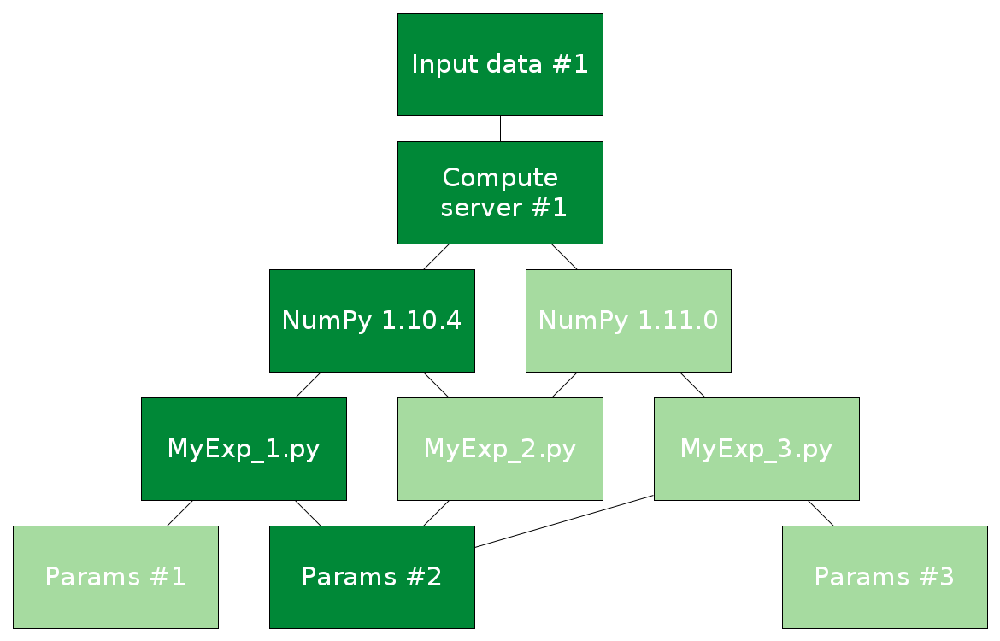
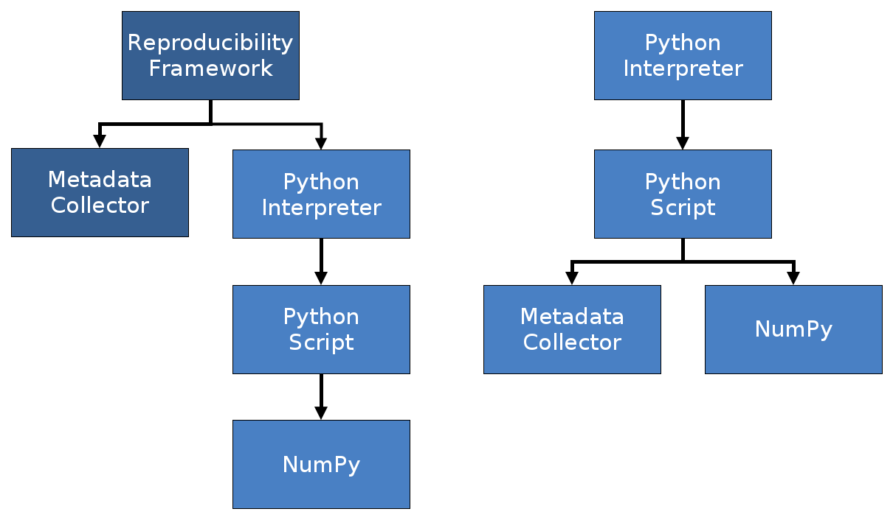
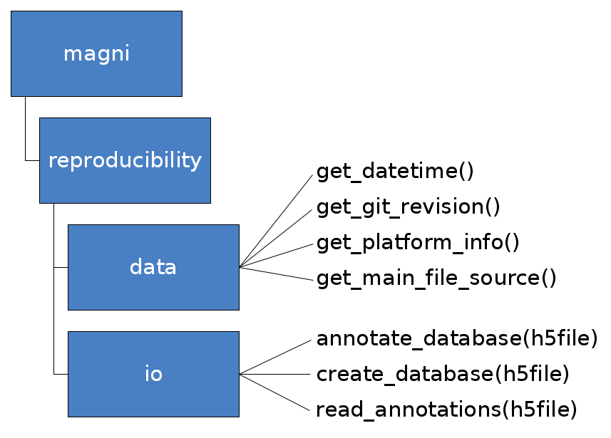

:author: Christian Schou Oxvig
:email: cso@es.aau.dk
:institution: Faculty of Engineering and Science, Department of Electronic Systems, Aalborg University, 9220 Aalborg, Denmark

:author: Thomas Arildsen
:email: tha@es.aau.dk
:institution: Faculty of Engineering and Science, Department of Electronic Systems, Aalborg University, 9220 Aalborg, Denmark

:author: Torben Larsen
:email: tl@es.aau.dk
:institution: Faculty of Engineering and Science, Department of Electronic Systems, Aalborg University, 9220 Aalborg, Denmark

:bibliography: references

--------------------------------------------------------------------------------------------
Storing Reproducible Results from Computational Experiments using Scientific Python Packages
--------------------------------------------------------------------------------------------

.. class:: abstract

  Computational methods have become a prime branch of modern science. Unfortunately, retractions of papers in high-ranked journals due to erroneous computations as well as a general lack of reproducibility of results have led to a so-called credibility crisis. The answer from the scientific community has been an increased focus on implementing reproducible research in the computational sciences. Researchers and scientists have addressed this increasingly important problem by proposing best practices as well as making available tools for aiding in implementing them. We discuss and give an example of how to implement such best practices using scientific Python packages. Our focus is on how to store the relevant metadata along with the results of a computational experiment. We propose the use of JSON and the HDF5 database and detail a reference implementation in the Magni Python package. Further, we discuss the focuses and purposes of the broad range of available tools for making scientific computations reproducible. We pinpoint the particular use cases that we believe are better solved by storing metadata along with results the same HDF5 database. Storing metadata along with results is important in implementing reproducible research and it is readily achievable using scientific Python packages.

.. class:: keywords

  Reproducibility, Computational Science, HDF5

Introduction
------------
*Exactly how did I produce the computational results stored in this file?* Most data scientists and researchers have probably asked this question at some point. For one to be able to answer the question, it is of utmost importance to track the provenance of the computational results by making the computational experiment reproducible, i.e. describing the experiment in such detail that it is possible for others to independently repeat it :cite:`LeVeque2012`, :cite:`Hinsen2014_version2`. Unfortunately, retractions of papers in high-ranked journals due to erroneous computations :cite:`Miller2006` as well as a general lack of reproducibility of computational results :cite:`Merali2010`, with some studies showing that only around 10% of computational results are reproducible :cite:`Begley2012`, :cite:`Rupp2011`, have led to a so-call *credibility crisis* in the computational sciences.

The answer has been a demand for requiring research to be reproducible :cite:`Peng2011`. The scientific community has acknowledged that many computational experiments have become so complex that more than a textual presentation in a paper or a technical report is needed to fully detail it. Enough information to make the experiment reproducible must be included with the textual presentation :cite:`Rupp2011`, :cite:`Choudhury2012`, :cite:`Stodden2014a`. Consequently, reproducibility of computational results have become a requirement for submission to many high-ranked journals :cite:`NatureEd2011`, :cite:`LeVeque2012`.

*But how does one make computational experiments reproducible?* Several communities have proposed best practices, rules, and tools to help in making results reproducible, see e.g. :cite:`Vandewalle2009`, :cite:`Sandve2013`, :cite:`Stodden2014`, :cite:`Davison2012`, :cite:`Stodden2014a`. Still, this is an area of active research with methods and tools constantly evolving and maturing. Thus, the adoption of the reproducible research paradigm in most scientific communities is still ongoing - and will be for some time. However, a clear description of how the reproducible research paradigm fits in with customary workflows in a scientific community may help speed up the adoption of it. Furthermore, if tools that aid in making results reproducible for such customary workflows are made available, they may act as an additional catalyst. 

In the present study, we focus on giving guidelines for integrating the reproducible research paradigm in the typical scientific Python workflow. In particular, we propose an easy to use scheme for storing metadata along with results in an HDF5 database. We show that it is possible to use Python to adhere to best practices for making computational experiments reproducible by storing metadata as JSON serialized arrays along with the results in an HDF5 database. A reference implementation of our proposed solution is part of the open source Magni Python package.

The remainder of this paper is organized as follows. We first describe our focus and its relation to a more general data management problem. We then outline the desired workflow for making scientific Python experiments reproducible and briefly review the fitness of existing reproducibility aiding tools for this workflow. This is continued by a description of our proposed scheme for storing metadata along with results. Following this specification, we detail a reference implementation of it and give plenty examples of its use. The paper ends with a more general discussion of related reproducibility aiding software packages followed by our conclusions.

The Data Management Problem
---------------------------
Reproducibility of computational results may be considered a part of a more general problem of data management in a computational study. In particular, it is closely related to the data management tasks of documenting and describing data. A typical computational study involves testing several combinations of various elements, e.g. input data, hardware platforms, external software libraries, experiment specific code, and model parameter values. Such a study may be illustrated as a layered graph like the one shown in figure :ref:`figdatamanagementproblem`. Each layer corresponds to one of the elements, e.g. the version of the NumPy library or the set of parameter values. The edges in the graph mark all the combinations that are tested. An example of a combination that constitutes a single simulation or experiment is the set of connected vertices that are highlighted in the graph in figure :ref:`figdatamanagementproblem`. In the present study, we focus on the problem of documenting and describing such a single simulation. A closely related problem is that of keeping track of all tested combinations, i.e. the set of all paths through all layers in the graph in figure :ref:`figdatamanagementproblem`. This is definitely also an interesting and important problem. However, once the "single simulation" problem is solved, it should be straight forward to solve the "all combinations" problem by appropriately combining the information from all the single simulations.

   Illustration of a typical data management description problem as a layered graph. In this exemplified experiment, several combinations of input data, hardware platforms, software libraries (e.g. NumPy), algorithmic/experimental setup (described in a Python script), and parameter values are tested. The challenging task is to keep track of both the full set of combinations tested (marked by all the edges in the graph) as well as the individual simulations (e.g. the combination of highlighted vertices). :label:`figdatamanagementproblem`

Storing Metadata Along With Results
-----------------------------------
For our treatment of reproducibility of computational results, we adopt the meaning of reproducibility from :cite:`LeVeque2012`, :cite:`Hinsen2014_version2`. That is, *reproducibility* of a study is the ability of others to repeat the study and obtain the same results using a general description of the original work. The related term *replicability* then means the ability of others to repeat the study and obtain the same results using the exact same setup (code, hardware, etc.) as in the original work [#]_. As pointed out in :cite:`Hinsen2014_version2`, reproducibility generally requires replicability.

The lack of reproducibility of computational results is oftentimes attributed to missing information about critical computational details such as library versions, parameter values, or precise descriptions of the exact code that was run :cite:`LeVeque2012`, :cite:`Barni2005`, :cite:`Rupp2011`, :cite:`Merali2010`. Several studies have given best practices for how to detail such metadata to make computational results reproducible, see e.g. :cite:`Vandewalle2009`, :cite:`Sandve2013`, :cite:`Stodden2014`, :cite:`Davison2012`. Here we detail the desired workflow for storing such metadata along with results when using a typical scientific Python workflow in the computational experiments. That is, we detail how to document a single experiment as illustrated by the highlighted vertices in figure :ref:`figdatamanagementproblem`.

.. [#] Some authors (e.g. :cite:`Stodden2014a`) swap the meaning of *reproducibility* and *replicability* compared to the convention, we have adopted.

The Scientific Python Workflow
******************************
In a typical scientific Python workflow, we define an experiment in a Python script and run that script using the Python interpreter, e.g.

.. code-block:: bash

   $ python my_experiment.py

The content of the :code:`my_experiment.py` script would typically have a structure like:

.. code-block:: python

   import some_library
   import some_other_library

   def some_func(...):
      ...

   def run_my_experiment(...):
      ...

   if __name__ == '__main__':
       run_my_experiment(...)

This is a particularly generic setup that only requires the availability of the Python interpreter and the libraries imported in the script. We argue that for the best practices for detailing a computational study to see broad adoption by the scientific Python community, three elements are of critical importance: Any method or tool for storing the necessary metadata to make the results reproducible must

1. be very easy to use and integrate well with existing scientific Python workflows.
2. be of high quality to be as trustworthy as the other tools in the scientific Python stack.
3. store the metadata in an open format that is easily inspected using standard viewers as well as programmatically from Python.

These elements are some of the essentials that have made Python so popular in the scientific community [#]_. Thus, for storing the necessary metadata, we seek a high quality solution which integrates well with the above exemplified workflow. Furthermore, the metadata must be stored in such a way that is is easy to extract and inspect when needed.

.. [#] See http://cyrille.rossant.net/why-using-python-for-scientific-computing/ for an overview of the main arguments for using Python for scientific computing.

Existing Tools
**************
Several tools for keeping track of provenance and aiding in adhering to best practices for reproducible research already exist, e.g. Sumatra :cite:`Davison2012`, ActivePapers :cite:`Hinsen2015_version3`, or Madagascar :cite:`Fomel2015`. Tools like Sumatra, ActivePapers, and Madagascar generally function as *reproducibility frameworks*. That is, when used with Python, they wrap the standard Python interpreter with a framework that in addition to running a Python script (using the standard Python interpreter) also captures and stores metadata detailing the setup used to run the experiment. E.g. when using Sumatra, one would replace :code:`python my_experiment.py` with :cite:`Davison2012`

.. code-block:: bash

   $ smt run -e python -m my_experiment.py

This idea of wrapping a computational simulation is different from the usual scientific Python workflow which consists of running a Python script that imports other packages and modules as needed, e.g. importing NumPy for numerical computations. This difference is illustrated in figure :ref:`figinterpretervsimport`.

   Illustration of the difference between a full reproducibility framework (on the left) and an importable Python library (on the right). The reproducibility framework calls the metadata collector as well as the Python interpreter which in turn runs the Python simulation script which e.g. imports NumPy. When using an importable library, the metadata collector is imported in the Python script alongside with e.g. NumPy. :label:`figinterpretervsimport`

We argue that an importable Python library for aiding in making results reproducible has several advantages compared to using a full blown reproducibility framework. A major element in using any tool for computational experiments is being able to trust that the tool does what it is expected do. The scientific community trusts Python and the SciPy stack. For a reproducibility framework to be adopted by the community, it must build trust as the wrapper of the Python interpreter, it effectively is. That is, one must trust that it handles experiment details such as input parameters, library paths, etc. just as accurately as the Python interpreter would have done. Furthermore, such a framework must be able to fully replace the Python interpreter in all existing workflows which uses the Python interpreter. A traditional imported Python library does not have these potentially staggering challenges to overcome in order to see wide adoption. It must only build trust among its users in the same way as any other scientific library. Furthermore, it would be easy to incorporate into any existing workflow. Thus, ideally we seek a solution that allow us to update our :code:`my_experiment.py` to have a structure like:

.. code-block:: python

   import some_library
   import some_other_library
   import reproducibility_library

   def some_func(...):
      ...

   def run_my_experiment(...):
      ...

   if __name__ == '__main__':
       reproducibility_library.store_metadata(...)
       run_my_experiment(...)

Interestingly, the authors of the Sumatra package has to some degree pursued this idea by offering an API for importing the library as an alternative to using the :code:`smt run` command line tool.

Equally important, to how to obtain the results, is how to inspect the results afterwards. Thus, one may ask: *How are the results and the metadata stored, and how may they be accessed later on?* For example, Sumatra by default stores all metadata in a SQLite database :cite:`Davison2012` separate from simulation results (which may be stored in any format) whereas ActivePapers stores the metadata along with the results in an HDF5 database :cite:`Hinsen2015_version3`. The idea of storing (or "caching") intermediate results and metadata along with the final results has also been pursued in another study :cite:`Peng2009`.

We argue that this idea of storing metadata along with results is an excellent solution. Having everything compiled into one standardized and open file format helps keep track of all the individual elements and makes it easy to share the full computational experiment including results and metadata. Preferably, such a file format should be easy to inspect using a standard viewer on any platform; just like the Portable Document Format (PDF) has made it easy to share and inspect textual works across platforms. The HDF5 Hierarchical Data Format :cite:`Folk2010` is a great candidate for such a file format due to the availability of cross-platform viewers like HDFView [#]_ and HDFCompass [#]_ as well as its capabilities in terms of storing large datasets. Furthermore, HDF5 is recognized in the scientific Python community [#]_ with bindings available through e.g. PyTables [#]_, h5py [#]_, or Pandas :cite:`McKinney2010`. Also, bindings for HDF5 exists in several other major programming languages.

.. [#] See https://www.hdfgroup.org/products/java/hdfview/
.. [#] See https://github.com/HDFGroup/hdf-compass
.. [#] See https://www.youtube.com/watch?v=nddj5OA8LJo
.. [#] See http://www.pytables.org/
.. [#] See http://www.h5py.org/

Suggested Library Design
************************
Our above analysis reveals that all elements needed for implementing the reproducible research paradigm in scientific Python are in fact already available in existing reproducibility aiding tools: Sumatra may serve as a Python importable library and the ActivePapers project shows how metadata may be stored along with results in an HDF5 database. However, no single tool offers all of these elements for the scientific Python workflow. Consequently, we propose creating a scientific Python package that may be imported in existing scientific Python scripts and may be used to store all relevant metadata for a computational experiment along with the results of that experiment in an HDF5 database.

Technically, there are various ways to store metadata along with results in an HDF5 database. The probably most obvious way is to store the metadata as attributes to HDF5 tables and arrays containing the results. However, this approach is only recommended for small metadata (generally < 64KB) [#]_. For larger metadata it is recommended to use a separate HDF5 array or table for storing the metadata [#]_. Thus, for the highest flexibility, we propose to store the metadata as separate HDF5 arrays. This also allows for separation of specific result arrays or tables and general metadata. When using separate metadata arrays, a serialization (a representation) of the metadata must be chosen. For the metadata to be humanly readable using common HDF viewers, it must be stored in an easily readable string representation. We suggest using JSON :cite:`ECMA2013` for serializing the metadata. This makes for a humanly readable representation. Furthermore, JSON is a standard format with bindings for most major programming languages [#]_. In particular, Python bindings are part of the standard library (introduced in Python 2.6) [#]_. This would effectively make Python >=2.6 and an HDF5 Python interface the only dependencies of our proposed reproducibility aiding library. We note, though, that the choice of JSON is not crucial. Other formats similar to JSON (e.g. XML [#]_ or YAML [#]_) may be used as well. We do argue, though, that a humanly readable format should be used such that the metadata may be inspected using any standard HDF5 viewer.

.. [#] See http://docs.h5py.org/en/latest/high/attr.html
.. [#] See https://www.hdfgroup.org/HDF5/doc1.6/UG/13_Attributes.html
.. [#] See http://www.json.org/
.. [#] See https://docs.python.org/2/library/json.html
.. [#] See https://www.w3.org/TR/REC-xml/
.. [#] See http://yaml.org/

Magni Reference Implementation
------------------------------
A reference implementation of the above suggested library design is available in the open source Magni Python package :cite:`Oxvig2014`. In particular, the subpackage :code:`magni.reproducibility` is based on this suggested design. Figure :ref:`figmagnireproducibility` gives an overview of the :code:`magni.reproducibility` subpackage. Additional resources for :code:`magni` are:

* Official releases: `doi:10.5278/VBN/MISC/Magni`__
* Online documentation: http://magni.readthedocs.io
* GitHub repository: https://github.com/SIP-AAU/Magni

__ http://dx.doi.org/10.5278/VBN/MISC/Magni

In :code:`magni.reproducibility`, a differentiation is made between *annotations* and *chases*. *Annotations* are metadata that describe the setup used for the computation, e.g. the computational environment, values of input parameters, platform (hardware/OS) details, and when the computation was done. *Chases* on the other hand are metadata describing the specific code that was used in the computation and how it was called, i.e. they *chase* the provenance of the results.

   Illustration of the structure of the :code:`magni.reproducibility` subpackage of Magni. The main modules are the :code:`data` module for acquiring metadata and the :code:`io` module for interfacing with an HDF5 database when storing as well as reading the metadata. A subset of available functions are listed next to the modules. :label:`figmagnireproducibility`
  
Requirements
************
Magni uses PyTables as its interface to HDF5 databases. Thus, had :code:`magni.reproducibility` been a package of its own,  only Python and PyTables would have been requirements for its use. The full requirements for using :code:`magni` (as of version 1.4.0) are [#]_

* Python >= 2.7 / 3.3
* Matplotlib :cite:`Hunter2007` (Tested on version >= 1.3)
* NumPy :cite:`Walt2011` (Tested on version >= 1.8)
* PyTables [#]_ (Tested on version >= 3.1)
* SciPy :cite:`Oliphant2007` (Tested on version >= 0.14)

When using the Conda [#]_ package management system  for handling the Python environment used in the computation, :code:`magni.reproducibility` may optionally use Conda to capture details about the Python environment. Thus, we have one optional dependency

* Conda (Tested on version >= 3.7.0)

.. [#] More details about Python and the Scientific Python Stack are available at http://python.org and http://scipy.org
.. [#] See http://www.pytables.org/
.. [#] See http://conda.pydata.org/docs/ as well as https://www.youtube.com/watch?v=UaIvrDWrIWM
  
Usage Examples
**************
We now give several smaller examples of how to use :code:`magni.reproducibility` to implement the best practices for reproducibility of computational result described in :cite:`Vandewalle2009`, :cite:`Sandve2013`, :cite:`Stodden2014`. An extensive example of the usage of :code:`magni.reproducibility` is available at `doi:10.5278/VBN/MISC/MagniRE`__. This extensive example is based on a Python script used to simulate the Mandelbrot set [#]_ using the scientific Python workflow described above. An example of a resulting HDF5 database containing both the Mandelbrot simulation result and metadata is also included. Finally, the example includes a Jupyter Notebook showing how to read the metadata using :code:`magni.reproducibility`.

__ http://dx.doi.org/10.5278/VBN/MISC/MagniRE
.. [#] See https://en.wikipedia.org/wiki/Mandelbrot_set

A simple example of how to acquire platform metadata using the :code:`data` module from :code:`magni.reproducibility` is

.. code-block:: python

   >>> from pprint import pprint
   >>> from magni import reproducibility as rep
   >>> pprint(rep.data.get_platform_info())
   {'libc': '["glibc", "2.2.5"]',
    'linux': '["debian", "jessie/sid", ""]',
    'mac_os': '["", ["", "", ""], ""]',
    'machine': '"x86_64"',
    'node': '"eagle1"',
    'processor': '"x86_64"',
    'python': '"3.5.1"',
    'release': '"3.16.0-46-generic"',
    'status': 'All OK',
    'system': '"Linux"',
    'version': '"#62~14.04.1-Ubuntu SMP ~"',
    'win32': '["", "", "", ""]'}

When using the typical scientific Python workflow described above, one may use the functions in the :code:`io` module from :code:`magni.reproducibility` to conveniently store all relevant metadata, e.g. the :code:`create_database(h5file)` to automatically create an HDF5 database with a set of standard annotations and chases. The :code:`my_experiment.py` script would then have a structure like

.. code-block:: python

   import tables
   from magni import reproducibility as rep
   
   def run_my_experiment(...):
      ...

   def store_result(h5, result):
      ...

   if __name__ == '__main__':
       hdf5_db = 'database.hdf5'
       rep.io.create_database(hdf5_db)
       result = run_my_experiment(...)
       with tables.File(hdf5_db, mode='a') as h5:
           store_result(h5, result)

This would create an HDF5 database named :code:`database.hdf5` which would hold both the results and all metadata. The HDF5 database may be inspected using any tool capable of reading HDF5 files. As an alternative, the :code:`io` module from :code:`magni.reproducibility` also includes convenience functions for reading the annotations and chases. E.g. to see the set of standard metadata stored in a database with :code:`create_database(h5file)`, one could do

.. code-block:: python

   >>> from pprint import pprint
   >>> import tables
   >>> from magni import reproducibility as rep
   >>> hdf5_db = 'database.hdf5'
   >>> rep.io.create_database(hdf5_db)
   >>> with tables.File(hdf5_db) as h5:
   ...     annotations = rep.io.read_annotations(h5)
   ...     chases = rep.io.read_chases(h5)
   >>> pprint(list(annotations.keys()))
   ['magni_config',
    'git_revision',
    'datetime',
    'conda_info',
    'magni_info',
    'platform_info']
   >>> pprint(list(chases.keys()))
   ['main_file_source',
    'stack_trace',
    'main_file_name',
    'main_source']

Quality Assurance
*****************
The Magni Python package is fully documented and comes with an extensive test suite. It has been developed using best practices for developing scientific software :cite:`Wilson2014` and all code has been reviewed by at least one other person than its author prior to its inclusion in Magni. All code adheres to the PEP8 [#]_ style guide and no function or class has a cyclomatic complexity :cite:`McCabe1976`, :cite:`Watson1996` exceeding 10. The source code is under version control using Git and a continuous integration system based on Travis CI [#]_ is in use for the git repository. More details about the quality assurance of :code:`magni` are given in :cite:`Oxvig2014`.

.. [#] See https://www.python.org/dev/peps/pep-0008/
.. [#] See https://travis-ci.org/

Related Software Packages
-------------------------
Independently of the tool or method used, making results from scientific computations reproducible is not only for the benefit of the audience. As pointed out in several studies :cite:`Fomel2015`, :cite:`Choudhury2012`, :cite:`Vandewalle2009`, the author of the results gains as least as much in terms increasing one's productivity. Thus, using some method or tool to help make the results reproducible is a win for everyone. In the present work we have attempted to detail the ideal solution for how to do this for the typical scientific Python workflow.

A plethora of related alternative tools exist for aiding in making results reproducible. We have already discussed ActivePapers :cite:`Hinsen2015_version3`, Sumatra :cite:`Davison2012`, and Madagascar :cite:`Fomel2015` which are general reproducibility frameworks that allow for wrapping most tools - not only Python based computations. Such tools are definitely excellent for some workflows. In particular, they seem fit for large fixed setups which require keeping track of several hundred runs that only differ by the selection of parameters [#]_ and for which the time cost of initially setting up the tool is insignificant compared to the time cost of the entire study. That is, they are useful in keeping track of the full set of combination in a large computations study as marked by all the edges in the layered graph in figure :ref:`figdatamanagementproblem`. However, as we have argued, they are less suitable for documenting a single experiment based on the typical scientific Python workflow. Also these tools tend to be designed for use on a single computer. Thus, they do not scale well for big data applications which run on compute clusters.

Another category of related tools are graphical user interface (GUI) based workflow managing tools like Taverna :cite:`Oinn2004` or Vistrail :cite:`Silva2007`. Such tools seem to be specifically designed for describing computational workflows in particular fields of research (typically bioinformatics related fields). It is hard, though, to see how they can be effectively integrated with the typical scientific Python workflow. Other much more Python oriented tools are the Jupyter Notebook [#]_ as well as Dexy [#]_. These tools, however, seem to have more of a focus on implementing the concept of literate programming and documentation than reproducibility of results in general.

.. [#] See e.g. https://www.youtube.com/watch?v=1YJr9c-zSng
.. [#] See http://jupyter.org/
.. [#] See http://www.dexy.it/ as well as https://www.youtube.com/watch?v=u6_qtDJ6ciA / https://www.youtube.com/watch?v=qFd04rA8lp0

Conclusions
-----------
We have argued that metadata should be stored along with computational results in an easily readable format in order to make the results reproducible. When implementing this in a typical scientific Python workflow, all necessary tools for making the results reproducible should be available as an importable package. We suggest storing the metadata as JSON serialized arrays along with the result in an HDF5 database. A reference implementation of this design is available in the open source Magni Python package which we have detailed with several examples of its use. All of this shows that storing metadata along with results is important in implementing reproducible research and it is readily achievable using scientific Python packages.

Acknowledgements
----------------
This work was supported in part by the Danish Council for Independent Research (DFF/FTP) under Project 1335-00278B/12-134971 and in part by the Danish e-Infrastructure Cooperation (DeIC) under Project DeIC2013.12.23.
