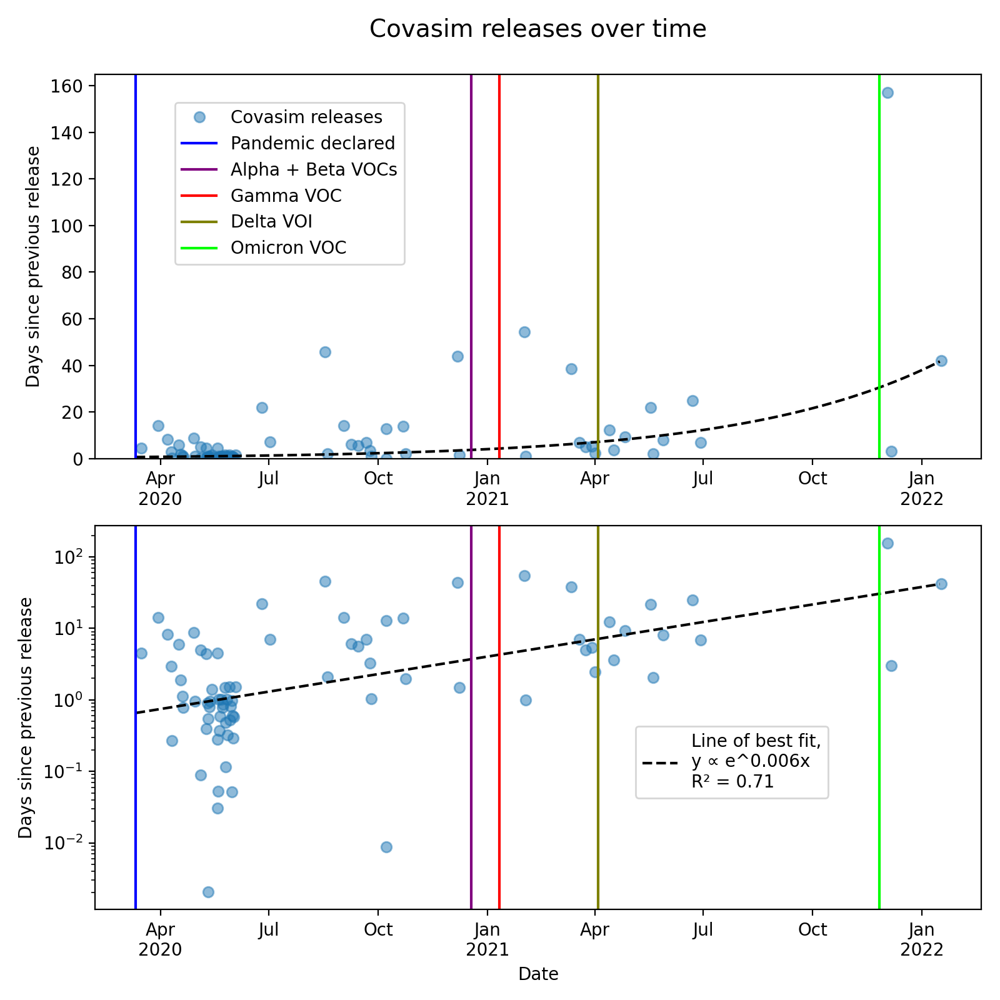
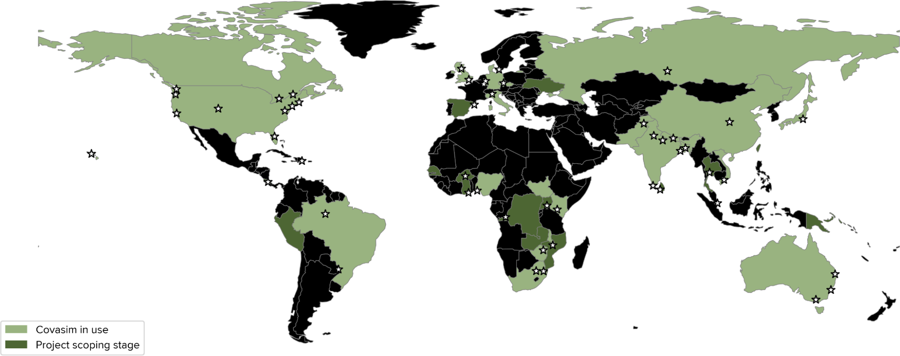
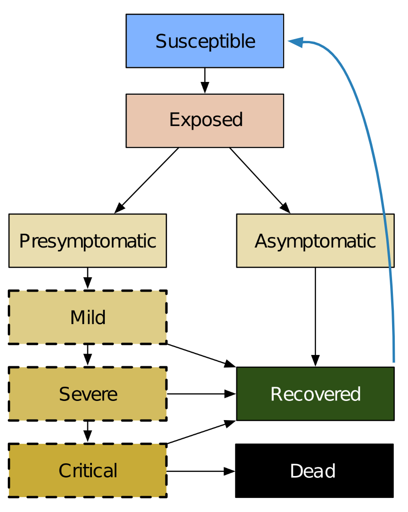
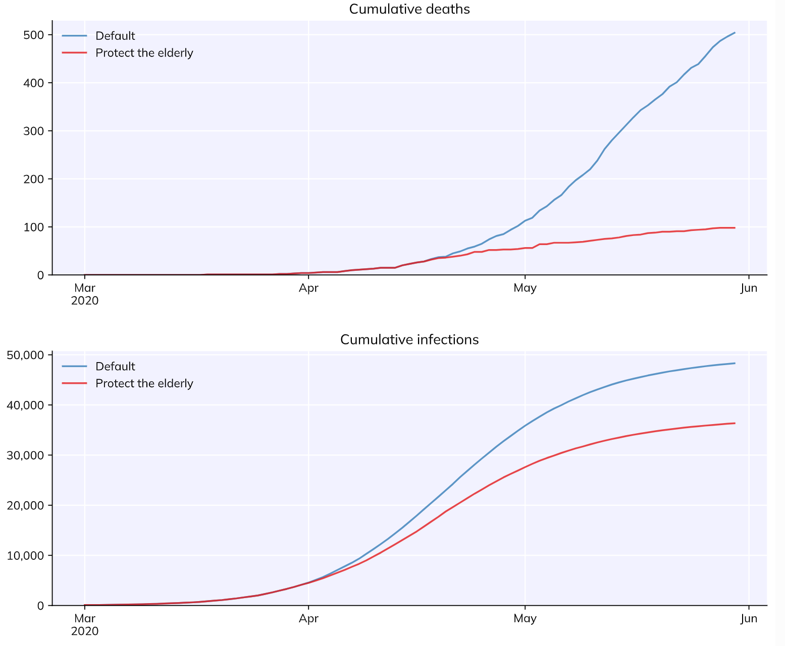
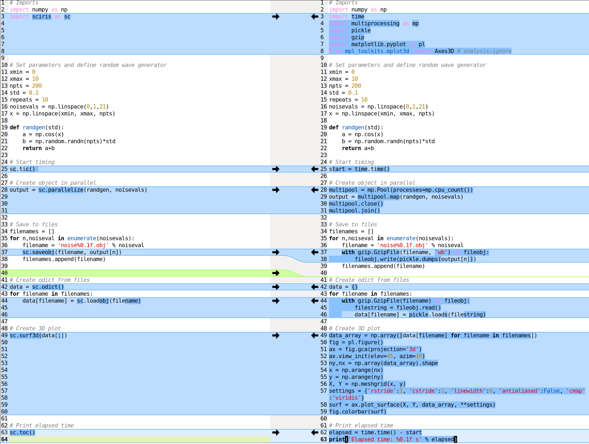
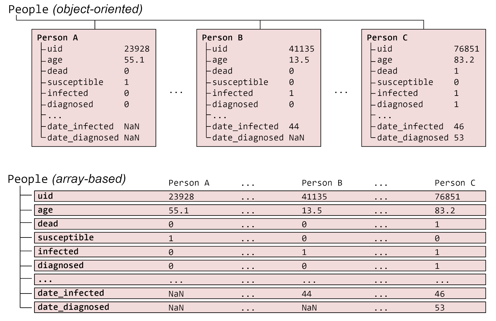
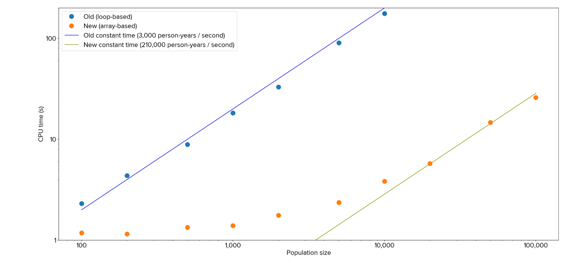
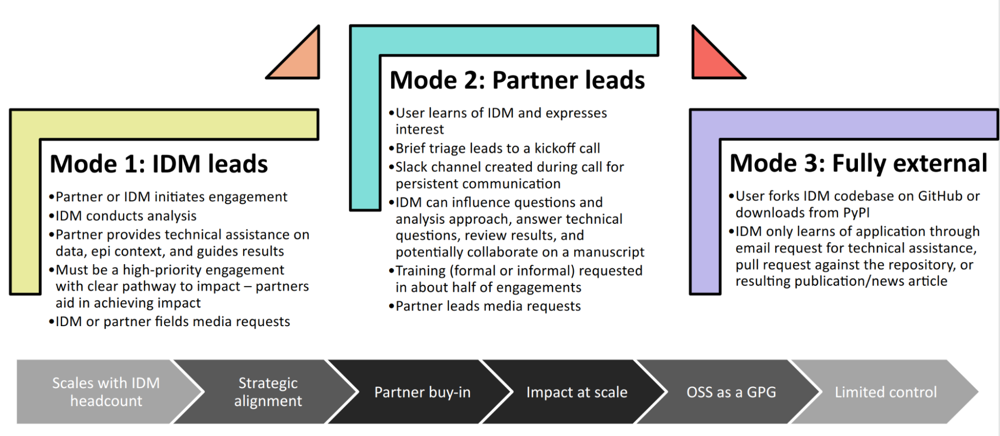

:author: Cliff C. Kerr 
:email: cliff@covasim.org
:institution: Institute for Disease Modeling, Bill & Melinda Gates Foundation
:institution: School of Physics, University of Sydney

:author: Robyn M. Stuart 
:email: robyn@math.ku.dk
:institution: Department of Mathematical Sciences, University of Copenhagen
:institution: Burnet Institute, Melbourne, Australia

:author: Dina Mistry 
:email: dina.c.mistry@gmail.com
:institution: Twitter, Seattle, USA

:author: Romesh G. Abeysuriya 
:email: romesh.abeysuriya@burnet.edu.au
:institution: Burnet Institute, Melbourne, Australia

:author: Jamie A. Cohen 
:email: jamie.cohen@gatesfoundation.org
:institution: Institute for Disease Modeling, Bill & Melinda Gates Foundation

:author: Lauren George 
:email: lauren.george@live.com
:institution: Microsoft, Seattle, USA

:author: Michał Jastrzębski 
:email: inc007@gmail.com
:institution: GitHub, San Francisco, CA

:author: Michael Famulare 
:email: mike.famulare@gatesfoundation.org
:institution: Institute for Disease Modeling, Bill & Melinda Gates Foundation

:author: Edward Wenger 
:email: edward.wenger@gatesfoundation.org
:institution: Institute for Disease Modeling, Bill & Melinda Gates Foundation

:author: Daniel J. Klein 
:email: daniel.klein@gatesfoundation.org
:institution: Institute for Disease Modeling, Bill & Melinda Gates Foundation

:bibliography: mybib

-------------------------------------------------------------------------
Python vs. the pandemic: a case study in high-stakes software development
-------------------------------------------------------------------------

.. class:: abstract

   When it became clear in early 2020 that COVID-19 was going to be a major public health threat, politicians and public health officials turned to academic disease modelers like us for urgent guidance. Academic software development is typically a slow and haphazard process, and we realized that business-as-usual would not suffice for dealing with this crisis. Here we describe the case study of how we built Covasim (covasim.org), an agent-based model of COVID-19 epidemiology and public health interventions, by using standard Python libraries like NumPy and Numba, along with less common ones like Sciris (sciris.org). Covasim was created in a few weeks, an order of magnitude faster than the typical model development process, and achieves performance comparable to C++ despite being written in pure Python. It has become one of the most widely adopted COVID models, and is used by researchers and policymakers in dozens of countries. Covasim's rapid development was enabled not only by leveraging the Python scientific computing ecosystem, but also by adopting coding practices and workflows that lowered the barriers to entry for scientific contributors without sacrificing either performance or rigor.

.. class:: keywords

   COVID-19, SARS-CoV-2, Epidemiology, Mathematical modeling, NumPy, Numba, Sciris

Background
----------

For decades, scientists have been concerned about the possibility of another global pandemic on the scale of the 1918 flu :cite:`garrett2005next`. Despite a number of "close calls" – including SARS in 2002 :cite:`anderson2004epidemiology`; Ebola in 2014-2016 :cite:`who2014ebola`; and flu outbreaks including 1957, 1968, and H1N1 in 2009 :cite:`saunders2016reviewing`, some of which led to 1 million or more deaths – the last time we experienced the emergence of a planetary-scale new pathogen was when HIV spread globally in the 1980s :cite:`cohen2008spread`. 

In 2015, Bill Gates gave a TED talk stating that the world was not ready to deal with another pandemic :cite:`hofman2020global`. While the Bill & Melinda Gates Foundation (BMGF) has not historically focused on pandemic preparedness, its expertise in disease surveillance, modeling, and drug discovery made it well placed to contribute to a global pandemic response plan. Founded in 2008, the Institute for Disease Modeling (IDM) has provided analytical support for BMGF (which it has been a part of since 2020) and other global health partners, with a focus on eradicating malaria and polio. Since its creation, IDM has built up a portfolio of computational tools to understand, analyze, and predict the dynamics of different diseases.

When "coronavirus disease 2019" (COVID-19) and the virus that causes it (SARS-CoV-2) were first identified in late 2019, our team began summarizing what was known about the virus :cite:`famulare2019ncov`. By early February 2020, even though it was more than a month before the World Health Organization (WHO) declared a pandemic :cite:`medicine2020covid`, it had become clear that COVID-19 would become a major public health threat. The outbreak on the *Diamond Princess* cruise ship :cite:`rocklov2020covid` was the impetus for us to start modeling COVID in detail. Specifically,  we needed a tool to (a) incorporate new data as soon as it became available, (b) explore policy scenarios, and (c) predict likely future epidemic trajectories.

The first step was to identify which software tool would form the best starting point for our new COVID model. Infectious disease models come in two major types: *agent-based models* track the behavior of individual "people" (agents) in the simulation, with each agent's behavior represented by a random (probabilistic) process. *Compartmental models* track populations of people over time, typically using deterministic difference equations. The richest modeling framework used by IDM at the time was EMOD, which is a multi-disease agent-based model written in C++ and based on JSON configuration files :cite:`bershteyn2018implementation`. We also considered Atomica, a multi-disease compartmental model written in Python and based on Excel input files :cite:`kedziora2019cascade`. However, both of these options posed significant challenges: as a compartmental model, Atomica would have been unable to capture the individual-level detail necessary for modeling the *Diamond Princess* outbreak (such as passenger-crew interactions); EMOD had sufficient flexibility, but developing new disease modules had historically required months rather than days. 

As a result, we instead started developing Covasim ("**COV**\ ID-19 **A**\ gent-based **Sim**\ ulator") :cite:`kerr2021covasim` from a nascent agent-based model written in Python, LEMOD-FP ("Light-EMOD for Family Planning"). LEMOD-FP was used to model reproductive health choices of women in Senegal; this model had in turn been based on an even simpler agent-based model of measles vaccination programs in Nigeria ("Value-of-Information Simulator" or VoISim). We subsequently applied the lessons we learned from developing Covasim to turn LEMOD-FP into a new family planning model, "FPsim", which will be launched later this year :cite:`o2022fpsim`.

Parallel to the development of Covasim, other research teams at IDM developed their own COVID models, including one based on the EMOD framework :cite:`selvaraj2022rural`, and one based on an earlier influenza model :cite:`chao2020modeling`. However, while both of these models saw use in academic contexts :cite:`koo2020interventions`, neither were able to incorporate new features quickly enough, or were easy enough to use, for widespread external adoption in a policy context.

Covasim, by contrast, had immediate real-world impact. The first version was released on 10 March 2020, and on 12 March 2020, its output was presented by Washington State Governor Jay Inslee during a press conference as justification for school closures and social distancing measures :cite:`kerr2021`.

Since the early days of the pandemic, Covasim releases have coincided with major events in the pandemic, especially the identification of new variants of concern (Fig. :ref:`releases`). Covasim was quickly adopted globally, including applications in the UK regarding school closures :cite:`panovska2020determining`, Australia regarding outbreak control :cite:`stuart2021role`, and Vietnam regarding lockdown measures :cite:`pham2021estimating`. 

   Daily reported global COVID-19-related deaths (top; smoothed with a one-week rolling window), relative to the timing of known variants of concern (VOCs) and variants of interest (VOIs), as well as Covasim releases (bottom). :label:`releases`

To date, Covasim has been downloaded from PyPI over 100,000 times :cite:`pepy`, has been used in dozens of academic studies :cite:`kerr2021`, and informed decision-making on every continent (Fig. :ref:`worldmap`), making it one of the most widely used COVID models :cite:`kerr2021covasim`. We believe key elements of its success include (a) the simplicity of its architecture; (b) its high performance, enabled by the use of NumPy arrays and Numba decorators; and (c) our emphasis on prioritizing usability, including flexible type handling and careful choices of default settings. In the remainder of this paper, we outline these principles in more detail, in the hope that these will provide a useful roadmap for other groups wanting to quickly develop high-performance, easy-to-use scientific computing libraries.

   Locations where Covasim has been used to help produce a paper, report, or policy recommendation. :label:`worldmap`

Software architecture and implementation
----------------------------------------

Covasim conceptual design and usage
+++++++++++++++++++++++++++++++++++

Covasim is a standard susceptible-exposed-infectious-recovered (SEIR) model (Fig. :ref:`seir`). As noted above, it is an agent-based model, meaning that individual people and their interactions with one another are simulated explicitly (rather than implicitly, as in a compartmental model).

The fundamental calculation that Covasim performs is to determine the probability that a given person, on a given time step, will change from one state to another, such as from susceptible to exposed (i.e., that person was infected), from undiagnosed to diagnosed, or from critically ill to dead. Covasim is fully open-source and available on GitHub (http://covasim.org) and PyPI (``pip install covasim``), and comes with comprehensive documentation, including tutorials (http://docs.covasim.org).

   Basic Covasim disease model. The blue arrow shows the process of reinfection. :label:`seir`

The first principle of Covasim's design philosophy is that "Common tasks should be simple" – for example, defining parameters, running a simulation, and plotting results. The following example illustrates this principle; it creates a simulation with a custom parameter value, runs it, and plots the results:

.. code-block:: python

   import covasim as cv
   cv.Sim(pop_size=100e3).run().plot()

The second principle of Covasim's design philosophy is "Uncommon tasks can't always be simple, but they still should be possible." Examples include writing a custom goodness-of-fit function or defining a new population structure. To some extent, the second principle is at odds with the first, since the more flexibility an interface has, typically the more complex it is as well.

To illustrate the tension between these two principles, the following code shows how to run two simulations to determine the impact of a custom intervention aimed at protecting the elderly in Japan, with results shown in Fig. :ref:`example`:

.. code-block:: python

   import covasim as cv

   # Define a custom intervention
   def elderly(sim, old=70):
       if sim.t == sim.day('2020-04-01'):
           elderly = sim.people.age > old
           sim.people.rel_sus[elderly] = 0.0

   # Set custom parameters
   pars = dict(
       pop_type = 'hybrid', # More realistic population
       location = 'japan', # Japan's population pyramid
       pop_size = 50e3, # Have 50,000 people total
       pop_infected = 100, # 100 infected people
       n_days = 90, # Run for 90 days
   )

   # Run multiple sims in parallel and plot key results
   label = 'Protect the elderly'
   s1 = cv.Sim(pars, label='Default')
   s2 = cv.Sim(pars, interventions=elderly, label=label)
   msim = cv.parallel(s1, s2)
   msim.plot(['cum_deaths', 'cum_infections'])

   Illustrative result of a simulation in Covasim focused on exploring an intervention for protecting the elderly. :label:`example`

Similar design philosophies have been articulated by previously, such as for Grails :cite:`abdul2009groovy` among others [1]_.

.. [1] Other similar philosophical statements include "The manifesto of Matplotlib is: simple and common tasks should be simple to perform; provide options for more complex tasks" (`Data Processing Using Python <https://pt.coursera.org/lecture/python-data-processing/2-fundamentals-of-python-plotting-xMQeE>`__) and "Simple, common tasks should be simple to perform; Options should be provided to enable more complex tasks" (`Instrumental <https://instrumental-lib.readthedocs.io/en/stable/developer.html>`__).

Simplifications using Sciris
++++++++++++++++++++++++++++

A key component of Covasim's architecture is heavy reliance on Sciris (http://sciris.org) :cite:`sciris`, a library of functions for scientific computing that provide additional flexibility and ease-of-use on top of NumPy, SciPy, and Matplotlib, including parallel computing, array operations, and high-performance container datatypes. 

As shown in Fig. :ref:`sciris`, Sciris significantly reduces the number of lines of code required to perform common scientific tasks, allowing the user to focus on the code's scientific logic rather than the low-level implementation. Key Covasim features that rely on Sciris include: ensuring consistent dictionary, list, and array types (e.g., allowing the user to provide inputs as either lists or arrays); referencing ordered dictionary elements by index; handling and interconverting dates (e.g., allowing the user to provide either a date string or a ``datetime`` object); saving and loading files; and running simulations in parallel.

   Comparison of functionally identical code implemented without Sciris (left) and with (right). In this example, tasks that together take 30 lines of code without Sciris can be accomplished in 7 lines with it. :label:`sciris`

Array-based architecture
++++++++++++++++++++++++

In a typical agent-based simulation, the outermost loop is over time, while the inner loops iterate over different agents and agent states. For a simulation like Covasim, with roughly 700 (daily) timesteps to represent the first two years of the pandemic, tens or hundreds of thousands of agents, and several dozen states, this requires on the order of one billion update steps.

However, we can take advantage of the fact that each state (such as agent age or their infection status) has the same data type, and thus we can avoid an explicit loop over agents by instead representing agents as entries in NumPy vectors, and performing operations on these vectors. These two architectures are shown in Fig. :ref:`array`. Compared to the explicitly object-oriented implementation of an agent-based model, the array-based version is 1-2 orders of magnitude faster for population sizes larger than 10,000 agents. The relative performance of these two approaches is shown in Fig. :ref:`perf` for FPsim (which, like Covasim, was initially implemented using an object-oriented approach before being converted to an array-based approach). To illustrate the difference between object-based and array-based implementations, the following example shows how aging and death would be implemented in each:

   The standard object-oriented approach for implementing agent-based models (top), compared to the array-based approach used in Covasim (bottom). :label:`array`

   Performance comparison for FPsim from an explicit loop-based approach compared to an array-based approach, showing a factor of ~70 speed improvement for large population sizes. :label:`perf`

.. code-block:: python

    # Object-based agent simulation

    class Person:

        def age_person(self):
            self.age += 1
            return

        def check_died(self):
            rand = np.random.random()
            if rand < self.death_prob:
                self.alive = False
            return

    class Sim:

        def run(self):
            for t in self.time_vec:
                for person in self.people:
                    if person.alive:
                        person.age_person()
                        person.check_died()

.. code-block:: python

    # Array-based agent simulation

    class People:

        def age_people(self, inds):
            self.age[inds] += 1
            return

        def check_died(self, inds):
            rands = np.random.rand(len(inds))
            died = rands < self.death_probs[inds]:
            self.alive[inds[died]] = False
            return

    class Sim:

        def run(self):
            for t in self.time_vec:
                alive = sc.findinds(self.people.alive)
                self.people.age_people(inds=alive)
                self.people.check_died(inds=alive)

Numba optimization
++++++++++++++++++

Numba is a compiler that translates subsets of Python and NumPy into machine code :cite:`lam2015numba`. Each low-level numerical function was tested with and without Numba decoration; in some cases speed improvements were negligible, while in other cases they were considerable. For example, the following function is roughly 10 times faster with the Numba decorator than without:

.. code-block:: python

    import numpy as np
    import numba as nb

    @nb.njit((nb.int32, nb.int32), cache=True)
    def choose_r(max_n, n):
        return np.random.choice(max_n, n, replace=True)

Since Covasim is stochastic, calculations rarely need to be exact; as a result, most numerical operations are performed as 32-bit operations.

Together, these speed optimizations allow Covasim to run at roughly 5-10 million simulated person-days per second of CPU time – a speed comparable to agent-based models implemented purely in C or C\+\+ :cite:`hinch2021openabm`. Practically, this means that most users can run Covasim analyses on their laptops without needing to use cloud-based or HPC computing resources.

Lessons for scientific software development
-------------------------------------------

Accessible coding and design
++++++++++++++++++++++++++++

Since Covasim was designed to be used by scientists and health officials, not developers, we made a number of design decisions that preferenced accessibility to our audience over other principles of good software design.

First, Covasim is designed to have as flexible of user inputs as possible. For example, a date can be specified as an integer number of days from the start of the simulation, as a string (e.g. ``'2020-04-04'``), or as a ``datetime`` object. Similarly, numeric inputs that can have either one or multiple values (such as the change in transmission rate following one or multiple lockdowns) can be provided as a scalar, list, or NumPy array. As long as the input is unambiguous, we prioritized ease-of-use and simplicity of the interface over rigorous type checking. Since Covasim is a top-level library (i.e., it does not perform low-level functions as part of other libraries), this prioritization has been welcomed by its users.

Second, "advanced" Python programming paradigms – such as method and function decorators, lambda functions, multiple inheritance, and "dunder" methods – have been avoided where possible, even when they would otherwise be good coding practice. This is because a relatively large fraction of Covasim users, including those with relatively limited Python backgrounds, need to inspect and modify the source code. A Covasim user coming from an R programming background, for example, may not have encountered the NumPy function ``intersect1d()`` before, but they can quickly look it up and understand it as being equivalent to R's ``intersect()`` function. In contrast, an R user who has not encountered method decorators before is unlikely to be able to look them up and understand their meaning (indeed, they may not even know what terms to search for). While Covasim indeed does use each of the "advanced" methods listed above (e.g., the Numba decorators described above), they have been kept to a minimum and sequestered in particular files the user is less likely to interact with.

Third, testing for Covasim presented a major challenge. Given that Covasim was being used to make decisions that affected tens of millions of people, even the smallest errors could have potentially catastrophic consequences. Furthermore, errors could arise not only in the software logic, but also in an incorrectly entered parameter value or a misinterpreted scientific study. Compounding these challenges, features often had to be developed and used on a timescale of hours or days to be of use to policymakers, a speed which was incompatible with traditional software testing approaches. In addition, the rapidly evolving codebase made it difficult to write even simple regression tests. Our solution was to use a hierarchical testing approach: low-level functions were tested through a standard software unit test approach, while new features and higher-level outputs were tested extensively by infectious disease modelers who varied inputs corresponding to realistic scenarios, and checked the outputs (predominantly in the form of graphs) against their intuition. We found that these high-level "sanity checks" were far more effective in catching bugs than formal software tests, and as a result shifted the emphasis of our test suite to prioritize the former. Public releases of Covasim have held up well to extensive scrutiny, both by our external collaborators and by "COVID skeptics" who were highly critical of other COVID models :cite:`skeptics`.

Finally, since much of our intended audience has little to no Python experience, we provided as many alternative ways of accessing Covasim as possible. For R users, we provide examples of how to run Covasim using the ``reticulate`` package :cite:`reticulate2017`, which allows Python to be called from within R. For specific applications, such as our test-trace-quarantine work (http://ttq-app.covasim.org), we developed bespoke webapps via Jupyter notebooks :cite:`jupyter` and Voilà :cite:`voila2019`. We also developed a generic JavaScript-based webapp for Covasim (http://app.covasim.org), although in practice its flexibility is too limited to answer real-world policy questions.

Workflow and team management
++++++++++++++++++++++++++++

Covasim was developed by a team of roughly 75 people with widely disparate backgrounds: from those with 20+ years of enterprise-level software development experience and no public health background, through to public health experts with virtually no prior experience in Python. Roughly 45% of Covasim contributors had significant Python expertise, while 60% had public health experience; only about half a dozen contributors (<10%) had significant experience in both areas. 

These half-dozen contributors formed a core group (including the authors of this paper) that oversaw overall Covasim development. Using GitHub for both software and project management, we created issues and assigned them to other contributors based on urgency and skillset match. All pull requests were reviewed by at least one person from this group, and often two, prior to merge. While the danger of accepting changes from contributors with limited Python experience is self-evident, considerable risks were also posed by contributors who lacked epidemiological insight. For example, several tests were written based on assumptions that were true for a given time and place, but not valid for other geographical contexts.

One surprising outcome was that even though Covasim is largely a software project, after the initial phase of development (i.e., the first 4-8 weeks), we found that relatively few tasks could be assigned to the developers as opposed to the epidemiologists and infectious disease modelers on the project. We believe there are several reasons for this. First, epidemiologists tended to be much more aware of knowledge they were missing (e.g., what a particular NumPy function did), and were more readily able to fill that gap (e.g., look it up in the documentation or on Stack Overflow). By contrast, developers were less able to identify gaps in their knowledge and address them (e.g., by finding a study on Google Scholar). As a consequence, many of the epidemiologists' software skills improved markedly over the first few months, while the developers' epidemiology knowledge increased more slowly. Second, and more importantly, we found that once transparent and performant coding practices had been implemented, epidemiologists were able to successfully adapt them to new contexts even without complete understanding of the code. Thus, for developing a scientific software tool, it appears that optimal staffing would consist of a roughly equal ratio of developers and domain experts during the early development phase, followed by a rapid (on a timescale of weeks) ramp-down of developer resources.

Acknowledging that Covasim's potential user base includes many people who have limited coding skills, we developed a three-tiered support model to maximize Covasim's real-world policy impact (Fig. :ref:`modes`). For "mode 1" engagements, we perform the analyses using Covasim ourselves. While this mode typically ensures high quality and efficiency, it is highly resource-constrained and thus used only for our highest-profile engagements, such as with the Vietnam Ministry of Health :cite:`pham2021estimating` and Washington State Department of Health :cite:`kerr2021`. For "mode 2" engagements, we offer our partners training on how to use Covasim, and let them lead analyses with our feedback. This is our preferred mode of engagement, since it balances efficiency and sustainability :cite:`panovska2020determining` :cite:`sanz2022risk`. Finally, "mode 3" partnerships, in which Covasim is downloaded and used without our direct input, are of course the default approach in the open-source software ecosystem. While this mode is by far the most scalable, in practice, relatively few state health departments or ministries of health have the time and internal technical capacity to use this mode; instead, most of the mode 3 uptake of Covasim has been by academic groups :cite:`li2021returning`. Thus, we provide mode 1 and mode 2 partnerships to make Covasim's impact more immediate and direct than would be possible via mode 3 alone.

   The three pathways to impact with Covasim, from high bandwidth/small scale to low bandwidth/large scale. IDM: Institute for Disease Modeling; OSS: open-source software; GPG: global public good; PyPI: Python Package Index. :label:`modes`

Future directions
-----------------

While the need for COVID modeling is hopefully starting to decrease, we and our collaborators are continuing development of Covasim by updating parameters with the latest scientific evidence, implementing new immune dynamics :cite:`cohen2021mechanistic`, and providing other usability and bug fix updates. We also continue to provide support and training workshops (including, for the first time, in person).

We are using what we learned during the development of Covasim to build a broader suite of Python-based disease modeling tools (tentatively named "\*-sim" or "Starsim"). The suite of Starsim tools under development includes models for family planning :cite:`o2022fpsim`, polio, respiratory syncytial virus (RSV), and human papillomavirus (HPV). To date, each tool in this suite uses an independent codebase, and is related to Covasim only through the shared design principles described above, and by having used the Covasim codebase as the starting point for development. 

A major open question is whether the disease dynamics implemented in Covasim and these related models have sufficient overlap to be refactored into a single disease-agnostic modeling library, which the disease-specific modeling libraries would then import. This "core and specialization" approach was adopted by EMOD and Atomica, and while both frameworks continue to be used, no multi-disease modeling library has yet seen widespread adoption within the disease modeling community. The alternative approach, currently used by the Starsim suite, is for each disease model to be a self-contained library. A shared library would reduce code duplication, and allow new features and bug fixes to be immediately rolled out to multiple models simultaneously. However, it would also increase interdependencies that would have the effect of increasing code complexity, increasing the risk of introducing subtle bugs. Which of these two options is preferable likely depends on the speed with which new disease models need to be implemented. We hope that for the foreseeable future, none will need to be implemented as quickly as Covasim.