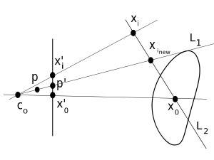
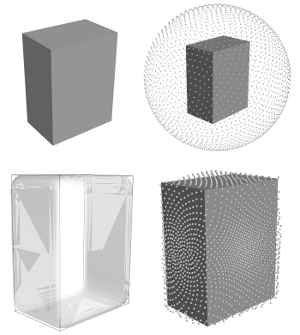
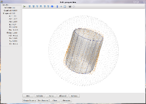
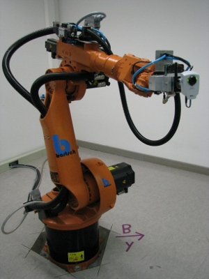
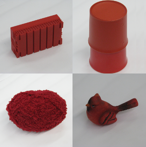
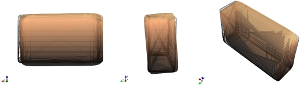
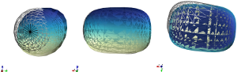
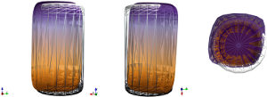
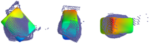

:author: Steven C. Colbert
:email: sccolber@mail.usf.edu
:institution: University of South Florida

:author: Gregor Franz
:email: franzg@hs-weingarten.de
:institution: University of Applied Sciences Ravensburg-Weingarten

:author: Konrad Woellhaf
:email: woellhaf@hs-weingarten.de
:institution: University of Applied Sciences Ravensburg-Weingarten

:author: Redwan Alqasemi
:email: alqasemi@eng.usf.edu
:institution: University of South Florida

:author: Rajiv Dubey
:email: dubey@eng.usf.edu
:institution: University of South Florida

===============================================================
A High Performance Robot Vision Algorithm Implemented in Python
===============================================================

ABSTRACT
--------

  A crucial behavior for assistive robots that operate in unstructured domestic 
  settings is the ability to efficiently reconstruct the 3D geometry of novel 
  objects at run time using no *a priori* knowledge of the object. This 
  geometric information is critical for the robot to plan grasping and other 
  manipulation maneuvers, and it would be impractical to employ database driven
  or other prior knowledge based schemes since the number and variety of 
  objects that system may be tasked to manipulate are large.

  We have developed a robot vision algorithm capable of reconstructing the 3D
  geometry of a novel object using only three images of the object captured from 
  a monocular camera in an eye-in-hand configuration. The reconstructions are 
  sufficiently accurate approximations such that the system can use the 
  recovered model to plan grasping and manipulation maneuvers. The three images 
  are captured from disparate locations and the object of interest segmented 
  from the background and converted to a silhouette. The three silhouettes are 
  used to approximate the surface of the object in the form of a point cloud. 
  The accuracy of the approximation is then refined by regressing an 11 
  parameter superquadric to the cloud of points. The 11 parameters of the 
  recovered superquadric then serve as the model of the object.

  The entire system is implemented in Python and Python related projects. Image 
  processing tasks are performed with NumPy arrays making use of Cython for 
  performance critical tasks. Camera calibration and image segmentation utilize 
  the Python bindings to the OpenCV library which are available in the 
  scikits.image project. The non-linear constrained optimization uses the 
  fmin_l_bfgs_b algorithm in scipy.optimize.  The algorithm was first vetted in 
  a simulation environment built on top of Enthought Traits and Mayavi.

  The hardware implementation utilizes the Python OpenOPC project to communicate 
  with and control a Kuka KR 6/2 six axis industrial manipulator. Images are
  captured via an Axis 207MW wireless network camera by issuing cgi requests  to 
  the camera with the urllib2 module. The image data is converted from JPEG to 
  RGB raster format with the Python Imaging Library. The core algorithm runs as 
  a server on a standalone machine and is accessed using the XML-RPC protocol. 
  Not including the time required for the robot to capture the images, the 
  entire reconstruction process is executed, on average, in 300 milliseconds.

1. Introduction
---------------

Recently, the robotics and automation literature has seen an increase in 
research focus on the autonomous pose and shape estimation of general objects. 
The intent of these studies is that the pose and shape information of objects 
can be used to plan grasping and manipulation maneuvers. In this context, such 
object recognition abilities have a plethora of applications that span multiple 
domains including, but not limited to: industrial automation, assistive devices, 
and rehabilitation robotics. Up to this point, a large portion of the research 
has focused on recognizing objects in which the system has some form of 
*a priori* knowledge; usually a 3D model or set of images of the object taken 
from various angles along with a database of information describing the objects. 
Recent examples of work in this area can be found in eg. [Kim09]_ [Effendi08]_ 
[Schlemmer07]_ [Liefhebber07]_ [Kragic05]_.

We approach this problem with the goal that the system need not have any prior 
knowledge of the object it wishes to manipulate. In the context of assistive or 
service robotics, requiring such 3D models or a database of information for 
every possible object would be prohibitively tedious and time consuming, thus 
severely limiting its usefulness and applicability. In order to achieve this 
goal, we attempt to describe generic objects in a bulk fashion. That is, to 
autonomously model an object's actual physical form at run time with a 
simplified shape that is an approximation; one which is also sufficiently 
accurate to allow for the planning and execution of grasping maneuvers. In our 
previous works [Colbert10_1]_ [Colbert10_2]_, we describe in detail the 
development of an algorithm that accomplishes just this. Only a brief overview 
of that theoretical work is presented here. Rather, the majority of this paper 
focuses on the implementation of that algorithm on an industrial manipulator and 
the accuracy of the reconstruction that results.

The paper progresses as follows: Section 2 provides the high level overview of
the algorithm with some diagrams and a step-by-step visual example to ease 
conceptual understanding, Section 3 describes the software implementation of the 
algorithm, Section 4 describes the robotic hardware implementation to include 
networking and control, Section 5 elaborates on the testing and overall 
accuracy of the platform and algorithm under real-world conditions. We round out 
the paper with some conclusions in Section 6.

2. Algorithm Overview
---------------------

This section provides a high-level overview of the theory behind our object 
reconstruction algorithm. No equations are presented. Rather the algorithm is
explained qualitatively and the interested reader is directed to one of our 
previous works that develop the theory in detail: [Colbert10_1]_, 
[Colbert10_2]_. 

2.1 Shape from Silhouettes
~~~~~~~~~~~~~~~~~~~~~~~~~~

The first phase or our algorithm generates a rough approximation to the surface
of an object using a method that falls under the category of 
*shape from silhouettes*. Algorithms of this class use a number of silhouettes 
of an object of interest captured from various vantage points and, by
back-projecting the visual cones and finding their union, reconstruct the 
geometry of the object. As the number of available silhouettes increases to 
infinity, the reconstruction converges on the *visual hull* of the object 
[Laurentini94]_. That is, the reconstruction will converge to the true shape of 
the object, minus any concavities. The method by which the visual cones are 
back projected varies from algorithm to algorithm, but most have typically used 
a variation of voxel coloring or space carving [Dyer01]_. Our method is a 
modified version of a recently introduced new method of shape from silhouettes
[Lippiello09]_. Our modification to this algorithm utilizes projective geometry
to eliminate the iteration step required in the original algorithm. The result 
is a shape from silhouettes algorithm that is conceptually easier to understand
and computationally more efficient than historical methods.

Our algorithm begins by capturing three images of the object of interest from
three disparate locations, and segmenting the object from the background. 
The segmented object is then converted to a silhouette. Then, using these
silhouettes along with the known camera parameters, the 3D centroid of the 
object of interest is estimated. Along with the centroid, we estimate a 
*radius* of the object, which we define as a distance from the estimated 
centroid that would define the radius of a sphere that would fully encompass 
the object. Once this centroid and radius are determined, a virtual sphere of 
points can be constructed which fully encompasses the object. For each of the 
points in the sphere, the point is projected into the silhouette image and 
tested for intersection. If the point intersects the silhouette, nothing is 
done. However, if the point does not intersect the silhouette, its position in 
3-space is modified such that its projected location in the image lies on the 
boundary of the silhouette. When this process is repeated for each silhouette, 
the resulting set of points will approximate the surface of the object. The 
geometry can be described with the following procedure and associated graphic:

.. raw:: latex

   \begin{enumerate}
   \item Let the center of the camera be $\mathbf{c}_{0}$.
   \item Let the center of the sphere be $\mathbf{x}_{0}$.
   \item Let $\mathbf{x}_{i}$ be any point in the sphere other than $\mathbf{x}_{0}$.
   \item Let $\mathbf{x}_{i_{new}}$ be the updated position of point $\mathbf{x}_{i}$.
   \item Let the projection of the center of the sphere into the image be $\mathbf{x}'_{0}$.
   \item Then, for each point $\mathbf{x}_{i}$:

      \begin{enumerate}
      \item Project $\mathbf{x}_{i}$ into the silhouette image to get $\mathbf{x}'_{i}$.
      \item If $\mathbf{x}'_{i}$ does not intersect the silhouette:

         \begin{enumerate}
         \item Find the pixel point $\mathbf{p'}$ that lies on the edge of the silhouette along the line segment $\mathbf{x}'_{i}\mathbf{x}'_{0}$.
         \item Reproject $\mathbf{p}'$ into $\mathbb{R}^{3}$ to get the point $\mathbf{p}$.
         \item Let the line $\mathbf{c}_{0}\mathbf{p}$ be $\mathbf{L}_{1}$.
         \item Let the line $\mathbf{x}_{0}\mathbf{x}_{i}$ be $\mathbf{L}_{2}$.
         \item Let $\mathbf{x}_{i_{new}}$ be the point of intersection of lines $\mathbf{L}_{1}$ and $\mathbf{L}_{2}$.
         \end{enumerate}
      \end{enumerate}
      \item Repeat steps 2-6 for each silhouette image. 
   \end{enumerate}

   The geometry of point :math:`\mathbf{x}_{i_{new}}`, which is the 
   intersection of lines :math:`\mathbf{L}_{1}` and :math:`\mathbf{L}_{2}`.
   The line :math:`\mathbf{L}_{2}` is defined by known points 
   :math:`\mathbf{x}_{i}` and :math:`\mathbf{x}_{0}`. The line 
   :math:`\mathbf{L}_{1}` is defined by point :math:`\mathbf{c}_{0}`, which 
   is the camera center, and point :math:`\mathbf{p}`, which is the 
   reprojection of the image point :math:`\mathbf{p}'` into   
   :math:`\mathbb{R}^{3}`.   

2.2 Superquadrics
~~~~~~~~~~~~~~~~~

The resulting set of points will, in general, be only a rough approximation of 
the surface of the object of interest. As previously mentioned, as the number 
of captured images becomes large, this approximation will become ever more 
accurate, but at the expense of increasingly long computation times. Our aim is 
to achieve usable results with a minimum number of images. To achieve a more 
accurate representation of the object using just three images, we fit a 
superquadric to the set of points which approximate the surface in such a 
manner that the superquadric largely rejects disturbances due to perspective 
projection effects and localized noise. The fitted superquadric then serves as 
a parametrized description of the object which encodes its position, 
orientation, shape, and size. 

Our fitting routine is based on the methods proposed in [Jaklic00]_, whose work 
on superquadrics is authoritative. We made a modification to their cost 
function which heavily penalizes points lying inside the boundaries of the 
superquadric. This modification has the effect of forcing the fitting routine to 
ignore disturbances caused by perspective projection effects. For a few number 
of images, these disturbances can be large, and thus this modification is 
crucial to achieving a satisfactory reconstruction with only three images.

The reconstruction of a simulated shape is shown in the following figure. From 
the figure, it is clear that the fitted superquadric provides a substantially
better approximation to the original shape than what can be achieved from the 
point cloud alone, when only three images of the object are available. 

   
   A simulated reconstruction. Clockwise from upper left: (1) The original 
   shape. (2) The generated sphere of points. (3) The point cloud after the 
   points have been shrunk to the silhouette boundaries. Error due to 
   perspective projection is clearly seen. (4) The superquadric that was fit 
   to the point cloud. Original shape shown as a wire frame. Notice the ability
   of the superquadric to ignore the perspective projection error.

3. Software Implementation
--------------------------

The algorithm was developed and implemented entirely in Python. Images take the
form of NumPy arrays with FOR loop dependent geometric image calculations 
performed in Cython. The Cython bindings to the OpenCV library (available in 
the scikits.image project) were used to build up the image segmentation 
routine. The fmin_l_bfgs_b non-linear constrained optimization routine 
(available in SciPy) was adopted for purposes of finding the best fitting 
superquadric for the point cloud. The gradient of the superquadric function (a
hefty 296 SLOC) was implemented in Cython. 

This software stack has proven to be quite performant. The average 
reconstruction time takes approximately 300 milliseconds. This includes image 
segmentation times but obviously does not include the time to actually capture
the images. Compare this to the time taken for the reconstruction in 
[Yamazaki08]_ where a reconstruction using over 100 images required ~100 seconds
of processing time for an equivalent accuracy.

A simulation environment was also developed in concert with the algorithm for 
testing purposes. The environment uses Mayavi as a rendering engine and 
TraitsUI for the GUI. The environment allows simulating a number of various
shapes and modifying their parameters in real-time. It also allows the images
of the object to be captured from any position. Once the images are captured, 
the simulator then performs the reconstruction and displays the recovered
superquadric as an overlay on the current shape. The computed accuracy of the 
reconstruction, based on the recovered superquadric parameters versus the known
ground truth, is shown in a sidebar. Various intermediate stages of the 
reconstruction process are also stored as hidden layers for debugging 
purposes. These layers can be turned on after the reconstruction via dialog 
options. All of the reconstruction images in this text were generated with
either the simulator or the underlying Mayavi engine. A screenshot of the 
simulator is shown below.

 
   A screenshot of the simulator which is built on Mayavi and TraitsUI.

4. Hardware Implementation
--------------------------
The implementation hardware consists of three main entities: the robotic 
manipulator which performs the required motions, the camera to capture the 
images, and the network which consists of the various components responsible 
for controlling the robot, the camera, and performing the actual object 
reconstruction computations. 

It is desired to have these various systems interconnected in the most 
decoupled and hardware/operating system agnostic manner in order to facilitate 
software reuse on and with other platforms, robots, and cameras. Thus, 
portability was a chief goal behind the system design. The following sections 
describe each subsystem component in detail.

4.1 Robot
~~~~~~~~~
The robotic arm used for testing is a KUKA KR6/2, manufactured by KUKA Roboter 
GmbH. It is a six axis, low payload, industrial manipulator with high accuracy 
and a repeatability of <0.1mm. It's smaller size (though still too large for use 
on a mobile platform) and large workspace makes it well suited for laboratory 
use and a wide range of experiments. The robot setup, including the camera 
described in Section 4.2 is shown in the following figure.

   The robot platform with the camera mounted in the gripper.

The KUKA control software provides a proprietary user interface environment 
developed in Windows XP Embedded, which in turn runs atop the real time VxWorks 
operating system. The platform provides a programming interface to the robot 
utilizing the proprietary KUKA Robot Language (KRL) as well as an OPC server 
that allows for connections from outside computers and the reading and writing 
of OLE system variables. As KRL does not provide facilities for communicating 
with outside processes or computers, the OPC server connection was used in 
conjunction with a simple KRL program to export control to an outside machine. 
The details of this are delayed until Section 4.3.

4.2 Camera
~~~~~~~~~~
The camera used for image acquisition is an Axis 207MW wireless network camera. 
It is relatively inexpensive and has megapixel resolution. The main beneficial 
feature of the camera is that it contains a built in HTTP web server with 
support for acquiring images via CGI requests. This means that the camera can 
be used by any programming language with libraries supporting HTTP connections. 
Needless to say, the list of qualifying languages is extensive. 

In order to transform the camera into a completely wireless component, a 
wireless power supply was developed. Namely, a custom voltage regulator was 
designed and fabricated to regulate the voltage of a battery pack down to the 
required 5V for the camera. The regulator will operate with any DC voltage from 
7 - 25V, allowing interoperation with a wide variety of battery packs.

4.3 Network
~~~~~~~~~~~
In order to achieve our goal of portability, the network was designed around 
distributed components that use free and open source standards for interprocess 
communication. Each component in the network is capable of operating 
independently on its own machine from anywhere that has access to the central 
switch. In the case of our experiments, the central switch is a local 802.11 
router providing WLAN access to the local computers in the laboratory. In our 
network setup, there are four components that share information across the LAN:
 
1. The KUKA robot computer running KRL programs and the OPC server

2. The Axis 207MW wireless network camera

3. The object reconstruction software

4. The external KUKA control software

The logical arrangement of these components, their interconnection, and the 
communication protocols used are illustrated in following figure and are 
explained in detail in the following sections.

.. figure:: network_diag.jpg
   
   Network and communication layout.

4.3.1 External KUKA Controller and the OPC Server
^^^^^^^^^^^^^^^^^^^^^^^^^^^^^^^^^^^^^^^^^^^^^^^^^
As previously mentioned, the KUKA robot software provides an OPC server that 
can be used to read and write system variables at run time. While OPC itself is 
an open standard, using it remotely requires extensive DCOM configuration which 
is both tedious and error prone, as well as limiting in that it requires the 
client machine to run a Microsoft Windows operating system. The OpenOPC project 
provides a solution to this problem. Built on Python, OpenOPC provides a 
platform agnostic method of making remote OPC requests. It runs a service on 
the host machine (in our case Windows XP embedded) which responds to requests 
from the client machine. The host service then proxies the OPC request to the 
(now local) OPC server, thus bypassing all DCOM related issues. The network 
communication transmits serialized Python objects ala the Pyro library.

A simple program was written in the KRL language and runs on the KUKA robot 
computer in parallel with the OPC server. This program sits in an idle loop 
monitoring the system variables until a command variable changes to True. At 
this point, the program breaks out of the loop and moves the robot to a 
position dictated by other system variables which are also set by the client 
machine. At the completion of the motion, the program re-enters the idle loop 
and the process repeats. 

The external KUKA controller (the client) runs on a separate machine under 
Ubuntu Linux. This machine makes a connection to the OpenOPC service running on 
the KUKA computer and makes the appropriate requests to read and write the 
system variables. In this manner, this external machine is able to specify a 
desired robot position, either absolute or relative, and then, by setting the 
command variable to True, forces the robot to execute the motion. This machine 
also acts as the main control logic, synchronizing the robot motion with the 
image capturing and object reconstruction.

4.3.2 Wireless Camera and Object Reconstruction
^^^^^^^^^^^^^^^^^^^^^^^^^^^^^^^^^^^^^^^^^^^^^^^
The wireless camera presents itself on the network as an HTTP server where 
images can be obtained by making CGI requests. These requests are trivial to 
make using the Python urllib2 module. The data is received in the form of raw 
JPEG data which must be converted to RGB raster format for purposes of image 
processing. This conversion is done using the Python Imaging Library. So that 
the data need not traverse the network twice, the connection to the camera is 
made from the object reconstruction program and images are captured and 
converted upon request by the main control program.

The connection between the main controller and object reconstruction program 
utilizes the XML-RPC protocol. The object reconstruction programs exports the 
majority of its capability in the form of methods on a SimpleXMLRPCServer 
instance from the Python xmlrpclib module.

5. Testing and Results
----------------------
After verifying the accuracy of the algorithm in simulation, it was implemented
on the hardware platform and tested on a variety of real world objects: a 
prismatic battery box, an elongated cylinder composed of two stacked cups, 
a ball of yarn, and a small cardinal statue. The first three objects represent 
the range of geometric shapes frequently encountered in domestic settings: 
cylindrical, prismatic, and ellipsoidal. It was expected that the algorithm 
would achieve accurate reconstructions for these shapes. The last object is 
amorphous and was included to test the robustness of the algorithm when 
presented with data that is incapable of being accurately described by the 
superquadric model. In all cases, the test objects were red in color to ease 
the task of segmentation and facilitate reliable silhouette generation. The 
four objects tested are shown in the following figure.

   The objects used for testing. Clockwise from upper-left: (1) A battery box.
   (2) A stack of cups. (3) A cardinal statue. (4) A ball of yarn.

As seen previously in the simulated reconstruction, the recovered superquadric 
models the original object to high a degree of accuracy. On the real world 
objects, the accuracy of the algorithm was seen to degrade only slightly. 
Indeed, most parameters were recovered to within few percent of known ground 
truth. It must be kept in mind, however, that there are several sources of 
error that are compounded into these reconstructions which are not present in 
the simulation:

- Uncertain camera calibration: intrinsics and extrinsics

- Robot kinematic uncertainty

- Imperfect segmentation

- Ground truth measurement uncertainty

The last bullet is particularly noteworthy. Since the object is placed randomly 
in the robot's workspace, the only practical way of measuring the ground truth 
position and orientation is to use a measuring device attached to the end 
effector of the robot. Though more accurate than attempting to manually measure 
from the robot base, the error is compounded by both machine inaccuracy and 
human error. 

In the following figures, the results of the reconstruction for each of the 
cases is shown by a rendering of the known ground truth of the object 
accompanied by an overlay of the calculated superquadric. The ground truth is 
shown as a wire frame and the reconstruction as an opaque surface.

   
   The reconstruction of the battery box.

   
   The reconstruction of the yarn ball. 

 
   The reconstruction of the cup stack.

   The reconstruction of the cardinal statue. This original object is shown in
   terms of the computed point cloud, given the difficulty of modeling the 
   amorphous shape as a wireframe.

We feel that the results of the cardinal statue reconstruction are due a bit of 
explanation. We included this case to test how our algorithm performs when 
provided with data that does not fit well with our reconstruction model and 
assumptions, e.g. that the original object can be modeled well by a 
superquadric. From the figure, it is clear that there would be no way to infer 
from the box shape that is the final reconstruction that the original object 
was a cardinal figurine. However, it is interesting to note that the 
reconstruction is very close to what a human would likely provide if asked to 
select a bounding box that best describes the object. That is, the 
reconstructed shape does an excellent job of capturing the bulk form of the 
statue despite the fact that the data is ill formed with respect to our 
modeling assumptions. 

This example shows that, even when the object does not take a form that can be 
accurately modeled by a single superquadric, our proposed algorithm still 
generates useful results.

6. Conclusions
--------------
We have given an overview of our robotic vision algorithm that is implemented 
in Python. Our algorithm enables the recovery of the shape, pose, position and
orientation of unknown objects using just three images of the object. The 
reconstructions have sufficient accuracy to allow for the planning of grasping
and manipulation maneuvers. 

Both the algorithm and software side of the hardware implementation are 
implemented entirely in Python and related projects. Notable libraries used
include: NumPy, SciPy, Cython, OpenOPC, and scikits.image. This software stack
was proven to provide high performance with our algorithm executing in less time
than other implementations in the literature.

References
----------

.. [Kim09] D. Kim, R. Lovelett, and A. Behal, *Eye-in-Hand Stereo Visual 
           Servoing on an Assistive Robot Arm in Unstructured Environments*, 
           International Conference on Robotics and Automation, pp. 2326-2331, 
           May 2009.

.. [Effendi08] S. Effendi, R. Jarvis, and D. Suter, *Robot Manipulation 
               Grasping of Recognized Objects for Assistive Technology Support 
               Using Stereo Vision*, Australasion Conference on Robotics and 
               Automation, 2008.

.. [Schlemmer07] M. J. Schlemmer, G. Biegelbauer, and M. Vincze, *Rethinking 
                 Robot Vision - Combining Shape and Appearance*, International 
                 Journal of Advanced Robotic Systems, vol. 4, no. 3, 
                 pp. 259-270, 2007.

.. [Liefhebber07] F. Liefhebber and J. Sijs, *Vision-based control of the Manus
                  using SIFT*, International Conference on Rehabilitation 
                  Robotics, June 2007.

.. [Kragic05] D. Kragic, M. Bjorkman, H. I. Christensen, and J. Eklundh, 
              *Vision for Robotic Object Manipulation in Domesting Settings*, 
              Robotics and Autonomous Systems, vol. 52, pp. 85-100, 2005.
              
.. [Colbert10_1] S. C. Colbert, R. Alqasemi, R. Dubey, *Efficient Shape and 
                 Pose Recovery of Unknown Objects from Three Camera Views*,
                 International Symposium on Mechatronics and its Applications, 
                 April 2010.

.. [Colbert10_2] S. C. Colbert, R. Alqasemi, R. Dubey, G. Franz, K. Woellhaf,
                 *Development and Evaluation of a Vision Algorithm for 3D 
                 Reconstruction of Novel Objects from Three Camera Views*,
                 IEEE International Conference on Intelligent Robots and 
                 Systems, 2010. *in-press*.

.. [Laurentini94] A. Laurentini, *The Visual Hull Concept for Silhouette-Based
                  Image Understanding*, Transactions of Pattern Analysis and 
                  Machine Intelligence, vol. 16, Feb. 1994.

.. [Dyer01] C. R. Dyer, *Volumetric Scene Reconstruction from Multiple Views*,
            Foundations of Image Understanding, Boston: Kluwer, pp. 469-489,
            2001. 
                 
.. [Lippiello09] V. Lippiello and F. Ruggiero, *Surface Model Reconstruction of
                 3D Objects from Multiple Views*, International Conference on 
                 Robotics and Automation, pp. 2400-2405, May 2009.

.. [Jaklic00] A. Jaklic, A. Leonardis, and F. Solina, *Segmentation and 
              Recovery of Superquadrics*, vol. 20 of Computational Imaging and 
              Vision. Kluwer Academic Publishers, 2000.

.. [Yamazaki08] K. Yamazaki, M. Tomono, T. Tsubouchi, *Picking up an Unknown
                Object Through Autonomous Modeling and Grasp Planning by a 
                Mobile Manipulator*, vol. 42/2008 of STAR. Springer Berlin / 
                Heidelberg, 2008.

