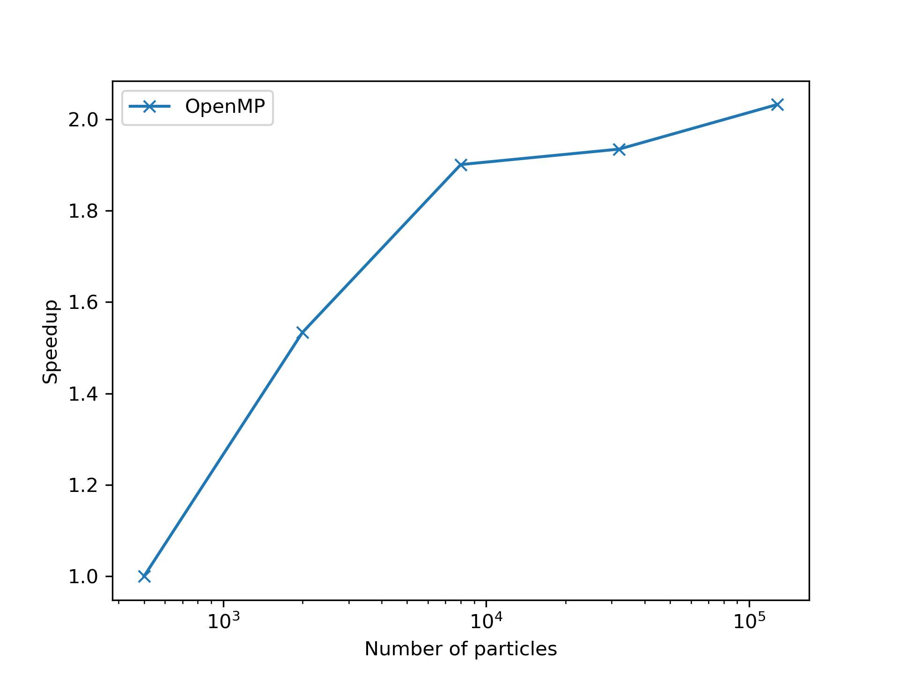
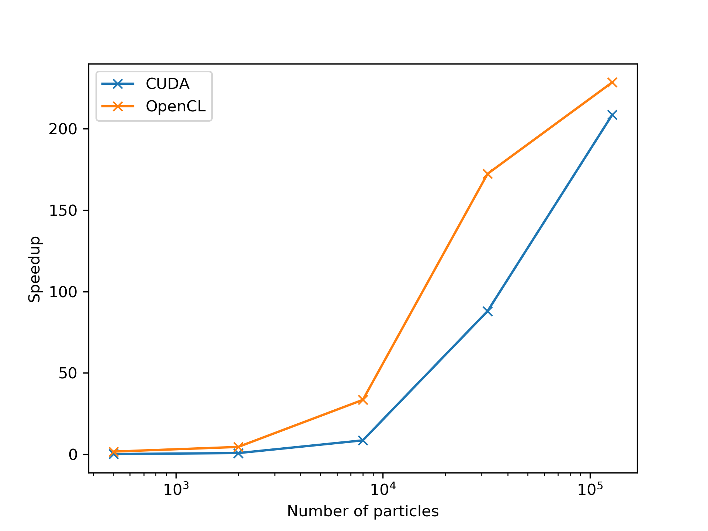
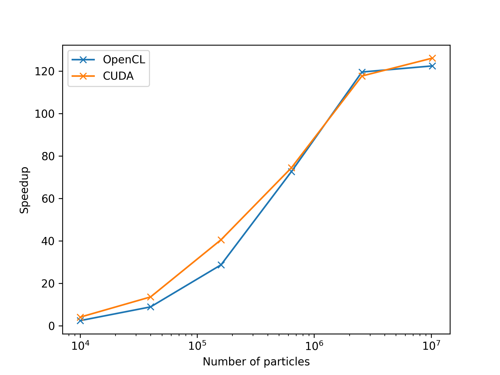
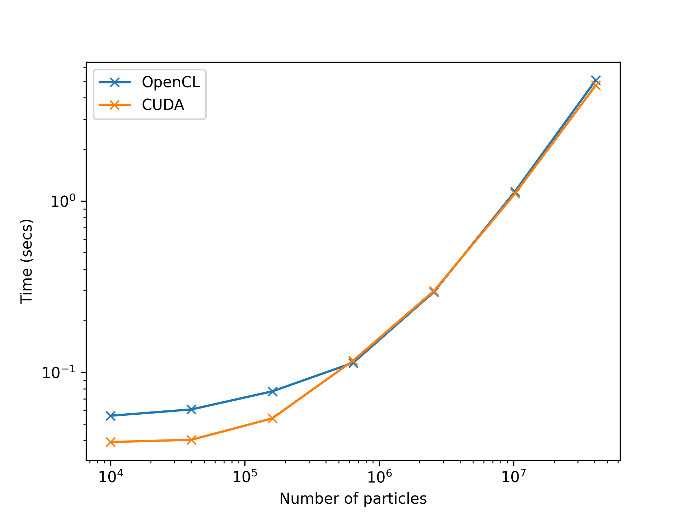

:author: Aditya Bhosale
:email: adityapb1546@gmail.com
:institution: Department of Aerospace Engineering
:institution: IIT Bombay, Mumbai, India

:author: Prabhu Ramachandran
:email: prabhu@aero.iitb.ac.in
:institution: Department of Aerospace Engineering
:institution: IIT Bombay, Mumbai, India
:corresponding:

:bibliography: references

------------------------------------
Compyle: Python once, HPC anywhere!
------------------------------------

.. class:: abstract

   Compyle allows users to execute a restricted subset of Python on a variety
   of HPC platforms. It currently supports multi-core execution using Cython,
   and OpenCL and CUDA for GPU devices. Users write low-level code in Python
   that is automatically transpiled to high-performance Cython or C. Compyle
   also provides a few very general purpose and useful parallel algorithms
   that allow users to write code once and have them run on a variety of HPC
   platforms.

   In this article, we show how to implement a simple two-dimensional
   molecular dynamics simulation package in pure Python using Compyle. The
   result is a fully parallel program that is relatively easy to implement and
   solves a non-trivial problem. The code transparently executes on multi-core
   CPUs and GPGPUs allowing simulations with millions of particles.

.. class:: keywords

   High-performance computing, multi-core CPUs, GPGPU accelerators, parallel
   algorithms, transpilation

Motivation and background
--------------------------

In this brief article we provide an overview of compyle
(https://compyle.rtfd.io). Compyle is a BSD licensed, Python package that
allows users to write code once in pure Python and have it execute
transparently on both multi-core CPUs or GPGPUs via CUDA or OpenCL. Compyle is
available on PyPI and hosted on github at https://github.com/pypr/compyle

Users often write their code in one language (sometimes a high-performance
language), only to find out later that the same performance is not possible on
newer hardware without making significant changes. For example, many
scientists do not make use of GPGPU hardware despite their excellent
performance and availability. One of the problems is that it is often hard to
reuse code developed in one language and expect it to work on all of the
platforms. Moreover, GPUs are parallel machines and extracting performance
from them requires the use of parallel algorithms. Unless the initial
development is done with this in mind, one cannot easily convert a serial code
into a parallel one.

There are many powerful tools available in the Python ecosystem today that
facilitate high-performance computing. PyPy_ is a Python implementation in
Python that features a JIT that allows one to execute pure Python code at
close to C-speeds. Numba_ uses the LLVM_ compiler infrastructure to generate
machine code that can rival native C code. Numba also supports execution on
GPUs. There are also libraries like Pythran_ that transpile a subset of Python
to C++ and support multi-core execution using OpenMP. Packages like cppimport_
and pybind11_ make it a breeze to integrate Python with C++ code. In addition,
there are powerful interfaces to GPUs via packages like PyOpenCL_ or PyCUDA_.
Of these, Numba has matured a great deal and is both easy to use and
versatile.

Given this context, one may wonder why Compyle exists at all. While compyle
grew out of a project that pre-dates numba, the real reason that compyle
exists is that solves a different problem from most of the existing tools.
Understanding this requires a bit of a context. As a prototypical example, we
look at a simple molecular dynamics simulation where :math:`N` particles
interact with each other via a Lennard-Jones potential. This problem is
discussed at length in :cite:`schroeder2015`.

In order to implement this, the typical workflow for a Python programmer would
be to prototype the molecular dynamics simulation code in pure Python and
obtain a proof of concept. One would then optimize this code so as to run
larger problems in a smaller amount of time. Very often this would mean
changing some data structures, writing vectorized code using NumPy arrays, and
then resorting to tools like numba to extract even more performance. Numba is
an impressive tool and one could say almost works magically well. In fact, for
some problems it will even do a good job of parallelizing the code to run on
multiple cores. However, one cannot execute this same code on a GPU without
making significant modifications, to the point of practically rewriting it.
While Numba offers some help here with the CUDA and ROCm support, one would
still have to change quite a lot of code to have it work on these
architectures. As such, the issue is that it is difficult to have the same
Python code execute well on CPUs and GPUs.

The reason for this difficulty is that GPUs are inherently parallel with many
thousands of cores. Writing code to effectively use such hardware requires a
significant re-think of the algorithms used. In particular the algorithm has
to be fully parallelized. While this is easy to do for simple problems, most
useful computational codes involve non-trivial algorithms, which are not
always easy to parallelize.

What compyle attempts to do is to allow one to write code **once** in a highly
restrictive subset of pure Python and have this run in parallel on both CPUs
and GPUs. This is a significant difference from all the tools that we have
mentioned above.

The difficulty in doing this is that it does require a change in approach and
also a loss of the typical conveniences with high-level Python.

Compyle provides important parallel programming algorithms that one typically
requires to in order to write parallel programs. These are the element-wise
operations (or maps), reductions, and parallel prefix scans. These primitives
are written such that the same program can be executed on both multi-core CPUs
and GPUs with minimal or no changes to the code.

This is currently not possible with any of the other tools. In addition,
compyle has the following features:

- Generates either Cython or ANSI C code depending on the backend and this
  code is quite readable (to a user familiar with Cython or C). This makes it
  much easier to understand and debug.
- Designed to be relatively easy to use as a code generator.
- Support for templated code generation to minimize repetitive code.
- Highly restrictive language that facilitates cross-platform execution.

Compyle is in principle very similar to the copperhead_ package described in
:cite:`copperhead2011`. The design of copperhead is very elegant. However, it
appears that copperhead is no longer under development, the package has no
commits after 2013 and is not available on PyPI (another unrelated package
with the same name is available). While it does support execution via C++ and
CUDA, it does not support OpenCL. We were not aware of copperhead until very
recently and are likely to try and incorporate ideas from it into compyle.

Compyle is actively used by a non-trivial, open source, SPH framework called
PySPH (https://pysph.rtfd.io) and discussed in some detail in
:cite:`pysph2019` and :cite:`pysph16`. Compyle makes it possible for users to
write their SPH codes in high-level Python and have it executed on multi-core
and GPU accelerators with negligible changes to their code. Unfortunately,
compyle is not used much outside of this context, so while it does solve many
problems, it is still under heavy development.

In this paper we write a simple two-dimensional molecular dynamics system that
is described and discussed in the article by :cite:`schroeder2015`. Our goal
is to implement this system in pure Python using Compyle. Through this we
demonstrate the ease of use and power of Compyle. We write programs that
execute efficiently in parallel on CPUs and GPUs without any modifications. We
use this as a way to illustrate the three important parallel algorithms and
show how they allow us to solve non-trivial problems.

.. _PyPy: https://pypy.prg
.. _Numba: http://numba.pydata.org/
.. _Pythran: https://pythran.readthedocs.io/
.. _PyOpenCL: https://documen.tician.de/pyopencl/
.. _PyCUDA: https://documen.tician.de/pycoda
.. _LLVM: https://llvm.org/
.. _pybind11: https://pybind11.readthedocs.io/
.. _cppimport: https://github.com/tbenthompson/cppimport
.. _copperhead: https://github.com/bryancatanzaro/copperhead

High-level overview
--------------------

We now provide a high-level overview of Compyle and its basic approach. This
is helpful when using compyle.

It is important to keep in mind that Compyle does **not** provide a greater
abstraction of the hardware but allows a user to write code in pure Python and
have that same code execute on multiple different platforms. We currently
support multi-core execution using OpenMP and Cython, and also transparently
support OpenCL and CUDA so the same could could potentially be reused on a
GPGPU. Compyle makes this possible by providing three important parallel
algorithms, an elementwise operation (a parallel map), a parallel scan (also
known as a prefix sum), and a parallel reduction. The Cython backend provides
a native implementation whereas the OpenCL and CUDA backend simply wrap up the
implementation provided by PyOpenCL and PyCUDA. These three algorithms make it
possible to write a variety of non-trivial parallel algorithms for high
performance computing. Compyle also provides the ability to write custom
kernels with support for local/shared memory specifically for OpenCL and CUDA
backends. Compyle provides simple facilities to annotate arguments and types
and can optionally make use of Python 3's type annotation feature as well.
Compyle also features JIT compilation and automatic type inference.

Compyle does not provide support for any high level Python and only works with
a highly restricted Python syntax. While this is not very user-friendly, we
find that in practice this is vitally important as it ensures that the code
users write will run efficiently and seamlessly execute on both a CPU and a
GPU with minimum or ideally no modifications. In addition, compyle allows
users to generate code using mako templates in order to maximize code reuse.
Since compyle performs source transpilation, it is also possible to use
compyle as a code-generation engine and put together code from pure Python to
build fairly sophisticated computational engines.

The functionality that Compyle provides falls broadly in two categories,

* Common parallel algorithms that will work across backends. This includes,
  elementwise operations, reductions, and prefix-sums/scans.
* Specific support to run code on a particular backend. This is for code that
  will only work on one backend by definition. This is necessary in order to
  best use different hardware and also use differences in the particular
  backend implementations. For example, the notion of local (or shared) memory
  only has meaning on a GPGPU. In this category we provide support to compile
  and execute Cython code, and also create and execute a GPU kernel. These
  features are not discussed in this article.

In general the subset of Python that compyle supports are:

- Functions with a C-syntax, this means no default or keyword arguments.

- Function arguments may be declared using either type annotation or using a
  decorator or with default arguments (which are only used to suggest the
  type).

- No Python data structures, i.e. no lists, tuples, sets, or dictionaries.

- Contiguous Numpy arrays are supported but must be one dimensional and must
  be a numerical data type.

- No memory allocation is allowed inside these functions.

- On OpenCL no recursion is supported but this will work with Cython or CUDA.

- Currently, all function calls must not use dotted names, i.e. don’t use
  ``math.sin``, instead just use ``sin``. This is because we do not perform
  any kind of name mangling of the generated code to make it easier to read.

- Compyle does support JIT compilation. If the type annotation is not
  explicitly supplied, the types can be automatically inferred when the
  functions are called.

- No support for classes and structs although this may change in a future
  release.

In what follows we provide a high-level introduction to the basic parallel
algorithms in the context of the prototypical molecular dynamics problem. By
the end of the article we show how easy it is to write the code with Compyle
and have it execute on multi-core CPUs and GPGPUs. The programs we document
here are also available as part of the compyle examples. We provide a
convenient notebook on google colab where users can run the simple examples on
a GPU as well.

Installation
-------------

Installation of compyle is by itself straightforward and this can be done with
pip_ using::

  pip install compyle

For execution on a CPU, Compyle depends on Cython and a C++ compiler on the
local machine. Multi-core execution requires OpenMP to be available. Detailed
instructions for installation are available at the `compyle installation
documentation <https://compyle.readthedocs.io/en/latest/installation.html>`_.
For execution on a GPU compyle requires that either PyOpenCL_ or PyCUDA_ be
installed. It is possible to install the required dependencies using the
extras argument as follows::

  pip install compyle[opencl]

Compyle is still under heavy development and one can install the package using
a git checkout from the repository on github at
https://github.com/pypr/compyle

.. _pip: https://pip.pypa.io/

Parallel algorithms
--------------------

We will work through a molecular dynamics simulation of N particles using the
Lennard-Jones potential energy for interaction. Each particle interacts with
every other particle and together the system of particles evolves in time. The
Lennard-Jones potential energy is given by,

.. math::
    u(r) = 4\epsilon \left( \left(\frac{\sigma}{r}\right)^{12} - \left(\frac{\sigma}{r}\right)^6 \right)

Each particle introduces an energy potential and if another particle is at a
distance of :math:`r` from it, then the potential experienced by the particle
is given by the above equation. The gradient of this potential energy function
produces the force on the particle. Therefore if we are given two particles at
positions, :math:`\vec{r}_i` and :math:`\vec{r}_j` respectively then the force
on the particle :math:`j` is dependent on the value of :math:`|\vec{r_j} -
\vec{r_i}|` and the gradient is:

.. math::
   \vec{F}_{i \leftarrow j} = \frac{24 \epsilon}{r_{ij}^2} \left( 2\left(\frac{\sigma}{r_{ij}}\right)^{12} - \left(\frac{\sigma}{r_{ij}}\right)^6 \right) \vec{r}_{ij}

Where :math:`r_{ij} = |\vec{r}_{ij}|` and :math:`\vec{r}_{ij} = \vec{r}_i -
\vec{r}_j`. The left hand side is the force on particle :math:`i` due to
particle at :math:`j`. Here, we use :math:`\sigma = \epsilon = m = 1` for our
implementation. We use the velocity Verlet algorithm in order to integrate the
system in time. We use a timestep of :math:`\Delta t` and as outlined in
:cite:`schroeder2015`, the position and velocity of the particles are updated
in the following sequence:

1. Positions of all particles are updated using the current velocities as
   :math:`x_i = x_i + v_i \Delta t + \frac{1}{2} a_i \Delta t^2`. The velocities
   are then updated by half a step as :math:`v_i = v_i + \frac{1}{2} a_i
   \Delta t`.

2. The new acceleration of all particles are calculated using the
   updated positions.

3. The velocities are then updated by another half a step.

In the simplest implementation of this, all particles influence all other
particles. This can be implemented very easily in Python and compyle. Our
implementation will be parallel from the get-go and will work on both CPUs and
GPUs.

Once we complete the simple implementation we consider a very important
performance improvement where particles that are beyond 3 natural units, i.e.
:math:`r_{ij} > 3` do not influence each other (beyond this distance the force
is negligible). This can be used to reduce the complexity of the computation
of the mutual forces from an :math:`O(N^2)` to an :math:`O(N)` computation.
However, implementing this easily in parallel is not so straightforward.

Due to the simplicity of the initial implementation, all of these steps can be
implemented using what are called "elementwise" operations. This is the
simplest building block for parallel computing and is also known as the
"parallel map" operation.

Elementwise
~~~~~~~~~~~

An elementwise operation can be thought of as a parallel for loop. It can be
used to map every element of an input array to a corresponding output. Here is
a simple elementwise function implemented using compyle to execute step 1 of
the above algorithm.

.. code-block:: python

    @annotate(float='m, dt',
              gfloatp='x, y, vx, vy, fx, fy')
    def integrate_step1(i, m, dt, x, y, vx, vy, fx, fy):
        axi, ayi = declare('float', 2)
        axi = fx[i] / m
        ayi = fy[i] / m
        x[i] += vx[i] * dt + 0.5 * axi * dt * dt
        y[i] += vy[i] * dt + 0.5 * ayi * dt * dt
        vx[i] += 0.5 * axi * dt
        vy[i] += 0.5 * ayi * dt

The annotate decorator is used to specify types of arguments and the declare
function is used to specify types of variables declared in the function. In
this case, ``gfloatp`` indicates a global double pointer data type. Compyle
also supports Python3 style type annotations using the types defined in
:code:`compyle.types`.

Specifying types can be avoided by using the JIT compilation feature which
infers the types of arguments and variables based on the types of arguments
passed to the function at runtime. Following is the implementation of steps 2
and 3 without the type declarations.

.. code-block:: python

    @annotate
    def calculate_force(i, x, y, fx, fy, pe,
                        num_particles):
        force_cutoff = 3.
        force_cutoff2 = force_cutoff * force_cutoff
        for j in range(num_particles):
            if i == j:
                continue
            xij = x[i] - x[j]
            yij = y[i] - y[j]
            rij2 = xij * xij + yij * yij
            if rij2 > force_cutoff2:
                continue
            irij2 = 1.0 / rij2
            irij6 = irij2 * irij2 * irij2
            irij12 = irij6 * irij6
            pe[i] += (4 * (irij12 - irij6))
            f_base = 24 * irij2 * (2 * irij12 - irij6)

            fx[i] += f_base * xij
            fy[i] += f_base * yij

    @annotate
    def integrate_step2(i, m, dt, x, y, vx, vy, fx, fy):
        vx[i] += 0.5 * fx[i] * dt / m
        vy[i] += 0.5 * fy[i] * dt / m

Finally, these components can be brought together to write
the step functions for our simulation,

.. code-block:: python

    @annotate
    def step_method1(i, x, y, vx, vy, fx, fy, pe, xmin,
                     xmax, ymin, ymax, m, dt,
                     num_particles):
        integrate_step1(i, m, dt, x, y, vx, vy, fx, fy)

    @annotate
    def step_method2(i, x, y, vx, vy, fx, fy, pe, xmin,
                     xmax, ymin, ymax, m, dt,
                     num_particles):
        calculate_force(i, x, y, fx, fy, pe,
                        num_particles)
        integrate_step2(i, m, dt, x, y, vx, vy, fx, fy)

These can then be wrapped using the :code:`Elementwise`
class and called as normal python functions.

.. code-block:: python

        step1 = Elementwise(step_method1,
                            backend=self.backend)
        step2 = Elementwise(step_method2,
                            backend=self.backend)

One can also use the :code:`@elementwise` decorator on the step
functions and those can then be directly called without having to
wrap them using :code:`Elementwise`.

Note that in the above, ``step_method1, step_method2`` are the ones that are
wrapped into an elementwise operation. The ``integrate_step`` methods are
merely called by these. For an elementwise kernel, the first argument is
always the index of the particular element being processed, in this case
``i``. One can think of the function as the block of code being executed by a
``for`` loop. The number of elements iterated over is always implicitly based
on the first array argument passed to the function, in this case, ``x``.

The simulation can then be executed simply as follows,

.. code-block:: python

    # Initialize x, y
    # Initialize vx, vy, fx, fy, pe to zeros

    num_steps = int(t // dt)
    for i in range(num_steps):
        step1(x, y, vx, vy, fx, fy, pe, xmin, xmax,
              ymin, ymax, m, dt, self.num_particles)
        step2(x, y, vx, vy, fx, fy, pe, xmin, xmax,
              ymin, ymax, m, dt, self.num_particles)
        curr_t += dt

We have used a fixed wall non-periodic boundary condition for our
implementation. The details on the implementation of the boundary condition
can be found in the example section of compyle's github repository
`here <https://github.com/pypr/compyle/blob/master/examples/molecular_dynamics/md_simple.py>`_.

The backend used is changed using the following code::

  from compyle.api import get_config
  # On OpenMP
  get_config().use_openmp = True

  # Run with OpenCL
  get_config().use_opencl = True

No other code changes are needed.

Reduction
~~~~~~~~~

To check the accuracy of the simulation, the total energy of the
system can be monitored.
The total energy for each particle can be calculated as the sum of
its potential and kinetic energy. The total energy of the system
can then be calculated by summing the total energy over all
particles.

The reduction operator reduces an array to a single value. Given an input array
:math:`(a_0, a_1, a_2, \cdots, a_{n-1})` and an associative binary operator
:math:`\oplus`, the reduction operation returns the
value :math:`a_0 \oplus a_1 \oplus \cdots \oplus a_{n-1}`.

Compyle also allows users to give a map expression to map the input before
applying the reduction operator. The total energy of our system can thus be
found as follows using reduction operator in compyle.

.. code-block:: python

    @annotate
    def calculate_energy(i, vx, vy, pe, num_particles):
        ke = 0.5 * (vx[i] * vx[i] + vy[i] * vy[i])
        return pe[i] + ke

    energy_calc = Reduction('a+b',
                            map_func=calculate_energy,
                            backend=backend)
    total_energy = energy_calc(vx, vy, pe, num_particles)

Here, in the expression ``'a+b'`` ``a, b`` represent :math:`a_i, a_{i+1}`
respectively. For the maximum for example one would write ``'max(a, b)'``.
Common reductions like sum, max and min are also available but we show the
general form above where we can also map the values using the function given
before the reduction is applied.

Initial Results
~~~~~~~~~~~~~~~~~

.. figure:: sim.png

    Snapshot of simulation with 500 particles. :label:`simulation`

    Speed up over serial cython using OpenMP. :label:`openmp`

    Speed up over serial cython using CUDA and OpenCL. :label:`gpu`

Figure :ref:`simulation` shows a snapshot of simulation using 500 particles
and bounding box size 50 with a non-periodic boundary condition.

For evaluating our performance, we ran our implementation on a dual core Intel
Core i5 processor and an NVIDIA Tesla T4 GPU. We used :math:`dt = 0.02` and
ran the simulation for 25 timesteps. Figures :ref:`openmp` and :ref:`gpu` show
the speedup achieved over serial execution using Cython by using OpenMP,
OpenCL and CUDA. As you can see on the CPUs we get close to a 2x speedup.
However, on the GPU we get over a 200x speedup. This is compared to very fast
execution on a single core. The fact that we can use both OpenCL and CUDA is
also very important as on some operating systems, there is no CUDA support
even though OpenCL is supported (like the GPUs on MacOS).

This is in itself remarkable given that all we do to run on the GPU or CPU is
to simply set the appropriate backend. In most of the compyle examples, we use
a command line argument to switch the backend. So with exactly the same code
we are able to immediately run our program fully in parallel and have it run
on both multi-core CPUs as well as GPUs.

Many problems can be solved using the map-reduce approach above. However,
almost all non-trivial applications require a bit more than that and this is
where the parallel scan becomes very important.

Scans
~~~~~

Up to now we have found the influence of all particles on each other. Since
the force on two particles is negligible when they are more than 3 units
apart, we do not have to loop over all the particles, we can therefore reduce
the computation to an :math:`O(N)` computation and increase performance
significantly. One way of doing this is to bin the particles into small boxes
and given a particle in a box, only interact with the box and its nearest
neighbor boxes.

Implementing this in serial is fairly easy, but if we want this to work fast
and scale on a GPU we must implement a parallel algorithm. This is where the
parallel scan comes in and why this parallel algorithm is so important. The
parallel prefix scan is described in detail in the excellent article by
Blelloch :cite:`blelloch90`. Compyle provides an implementation of the scan
algorithm on the CPU and the GPU.

Since the scan algorithm is a bit more complex and most folks are unfamiliar
with it, we first provide a simpler example application that we solve and then
move back to our molecular dynamics application.

Scans are generalizations of prefix sums / cumulative sums and can be used as
building blocks to construct a number of parallel algorithms. These include
but not are limited to sorting, polynomial evaluation, and tree operations.

Given an input array
:math:`a = (a_0, a_1, a_2, \cdots, a_{n-1})` and an associative binary operator
:math:`\oplus`, a prefix sum operation returns the following array

.. math::
   y = \left(a_0, (a_0 \oplus a_1), \cdots, (a_0 \oplus a_1 \oplus \cdots \oplus a_{n-1}) \right)

The scan semantics in compyle are similar to those of the
:code:`GenericScanKernel` in PyOpenCL. This allows us to construct generic
scans by having an input expression, an output expression and a scan operator.
The input function takes the input array and the array index as arguments.
Assuming an input function :math:`f`, the generic scan will return the
following array,

.. math::
   y_i = \bigoplus_{k=0}^{i} f(a, k)

Note that using an input expression :math:`f(a, k) = a_k` gives the same result as a
prefix sum.

The output expression can then be used to map and write the scan result as
required. The output function also operates on the input array and an
index but also has the scan result, the previous item and the last item
in the scan result available as arguments.

Below is an example of implementing a parallel "where".
This returns elements of an array where a given condition is satisfied.
The following example returns elements of the array that are smaller
than 50.

.. code-block:: python

    @annotate
    def input_expr(i, ary):
        return 1 if ary[i] < 50 else 0

    @annotate
    def output_expr(i, prev_item, item, N, ary, result,
                    result_count):
        if item != prev_item:
            result[item - 1] = ary[i]
        if i == N - 1:
            result_count[0] = item

    ary = np.random.randint(0, 100, 1000, dtype=np.int32)
    result = np.zeros(len(ary.data), dtype=np.int32)
    result = wrap(result, backend=backend)
    result_count = np.zeros(1, dtype=np.int32)
    result_count = wrap(result_count, backend=backend)
    ary = wrap(ary, backend=backend)

    scan = Scan(input_expr, output_expr, 'a+b',
                dtype=np.int32, backend=backend)
    scan(ary=ary, result=result,
         result_count=result_count)
    result.pull()
    result_count.pull()
    result_count = result_count.data[0]
    result = result.data[:result_count]

The argument :code:`i`, similar to elementwise
is the current index, the argument :code:`item` is the result
of the scan including the input at index :code:`i`. The
:code:`prev_item` is the result of the array at index
:code:`i-1`.

In the above example, the input expression returns 1 only
when the value at index i is less than 50. So as long as the
array elements are greater than 50, the value of :code:`item`
will remain the same and will only increase when an element
less than 50 is found at the index. Thus, the condition
:code:`item != prev_item` will only be satisifed for indices
at which the value of :code:`ary[i]` is less than 50.

The :code:`input_expr` could also be used as the map function
for reduction and the required size of result could be found
before running the scan and the result array can be allocated
accordingly.

Back to the MD problem
~~~~~~~~~~~~~~~~~~~~~~~~

To reduce the complexity of the problem from :math:`O(N^2)` to
:math:`O(N)`, we use a binning strategy as mentioned in the previous
section. We partition our domain into square bins of size 3 units.
Then for each particle, all the particles within a radius of 3 units
from it will lie inside of the 9 neighboring bins. For a bin with
coordinates :math:`c = (m, n)`, these 9 bins will be,

.. math::

    N(c) = \{ c + d \ | \ d \in \{-1, 0, 1\} \times \{-1, 0, 1\} \}

The idea is to for each query particle iterate over all particles in
these 9 bins and check if the distance between the particle and the
query particle is less than 3.
To implement this, we first find the bin to which each particle
belongs. This is done as follows,

.. math::

    c = \left( \left \lfloor{\frac{x}{h}} \right \rfloor, \left \lfloor{\frac{y}{h}} \right \rfloor \right)

where :math:`x` and :math:`y` are the coordinates of the particle
and :math:`h` is the required radius which in our case is 3.
We then flatten these bin coordinates to map each bin to a unique
integer we call the 'key'. We then sort these keys and an array of
indices of the particles such that the sorted indices have all
particles in the same cell as contiguous elements.
Compyle has a sort functionality which uses the PyOpenCL radix
sort for OpenCL backend, thrust sort for the CUDA
backend and simple numpy sort for the cython backend.

To find the particles belonging to the 9 neighboring bins,
we now need to find the index in the sorted indices array
at which each key starts.
This can be found in parallel using a scan as follows,

.. code-block:: python

    @annotate
    def input_scan_keys(i, keys):
        return 1 if i == 0 or keys[i] != keys[i - 1] else 0

    @annotate
    def output_scan_keys(i, item, prev_item, keys,
                         start_indices):
        key = keys[i]
        if item != prev_item:
            start_indices[key] = i

Once we have the start indices array, we can also find the number
of particles in each bin using a simple elementwise operation as
follows,

.. code-block:: python

    @annotate
    def fill_bin_counts(i, keys, start_indices,
                        bin_counts, num_particles):
        if i == num_particles - 1:
            last_key = keys[num_particles - 1]
            bin_counts[last_key] = num_particles - \
                    start_indices[last_key]
        if i == 0 or keys[i] == keys[i - 1]:
            return
        key = keys[i]
        prev_key = keys[i - 1]
        bin_counts[prev_key] = start_indices[key] - \
                start_indices[prev_key]

Now we can iterate over all neighboring 9 bins, find the key
corresponding to each of them, then lookup the start index for that
key in the start indices array and the number of particles in
the cell by looking up in the bin counts array. Then lookup the
sorted indices array to find the indices of the particles
belonging to these bins and find the particles within a distance
of 3 units.

However, note that we still have a challenge in storing these
neighboring particles as we do not know the number of neighboring
particles beforehand and so cannot allocate an array of that size.
Moreover, since each particle can have different number of
neighbors, it is also not straightforward to know where in the
neighbors array we need to look to find the neighbors of a particular
particle.

We use a two pass approach to solve this problem. In the first pass
we find the number of neighbors for each particle. We then run a
scan over this array to find the start indices for neighbors of
each particle in the neighbors array as follows,

.. code-block:: python

    @annotate
    def input_start_indices(i, counts):
        return 0 if i == 0 else counts[i - 1]

    @annotate
    def output_start_indices(i, item, indices):
        indices[i] = item

We then allocate the neighbors array of size equal to sum of
all neighbor lengths. The second pass is then another elementwise
operation where each particle writes its neighbors starting
from the start index calculated from the scan.

More details on this implementation can be found in the
examples section of our repository
`here <https://github.com/pypr/compyle/blob/master/examples/molecular_dynamics/md_nnps.py>`__.
We have also implemented a more efficient version of the nearest neighbor
searching algorithm using counting sort instead of radix sort
which is 30% faster that can be found
`here <https://github.com/pypr/compyle/blob/master/examples/molecular_dynamics/nnps.py>`__.

Performance comparison
----------------------

    Speed up over serial cython using CUDA and OpenCL.

    Time taken for simulation on GPU using CUDA and OpenCL.

As can be seen from figure, the algorithm is linear at
large values of number of particles.
Figure shows the speed up of the above implementation
using CUDA and OpenCL backend as compared to a serial cython backend.
We again see a speed up of about 120x when using the GPU
as compared to a serial cython implementation.

Limitations
------------

While compyle is really powerful and convenient, it does use a rather verbose
and low-level syntax. In practice we have found that this is not a major
problem. The more serious issue is the fact that we cannot directly use
external libraries in a platform neutral way. For example, there are ways to
use an external OpenCL or CUDA library but this will not be usable on a CPU.
Obviously one cannot use normal Python code and use basic Python data
structures. Furthermore, one cannot use well established libraries like scipy
from within the parallel constructs.

The low-level API that compyle provides turns out to be quite an advantage as
compyle code is usually very fast the first time it runs. This is because it
will simply refuse to run any code that uses Python objects. By forcing the
user to write the algorithms in a low-level way the code is very performant.
It also forces the user to think along the lines of parallel algorithms. This
is a major factor. We have used Compyle in the context of a larger scientific
computing project and have found that while the limitations are annoying, the
benefits are generally worth it.

Future work
-------------

In the future, we would like to improve the package by adding support for
simple "objects" that would allow users to compose their libraries in a more
object oriented manner. This would also open up the possibility of
implementing more high-level data structures in an easy way.

Conclusions
-----------

In this article we have shown how one can implement a simple molecular
dynamics solver using compyle. The code is parallel from the beginning and
runs effortlessly on multi-core CPUs and GPUs without any changes. We have
used the example to illustrate elementwise, reduction, and prefix sums. We
show how a non-trivial optimization of the example problem is possible using a
prefix scan.

The results clearly show that we are able to write the code once and have it
run on massively parallel architectures. This is very convenient and this is
possible because of our approach to the problem which puts parallel algorithms
first and forces the user to write code with a hard set of restrictions. With
this, we are able to make good use of multi-core CPUs and GPUs with pure
Python.
