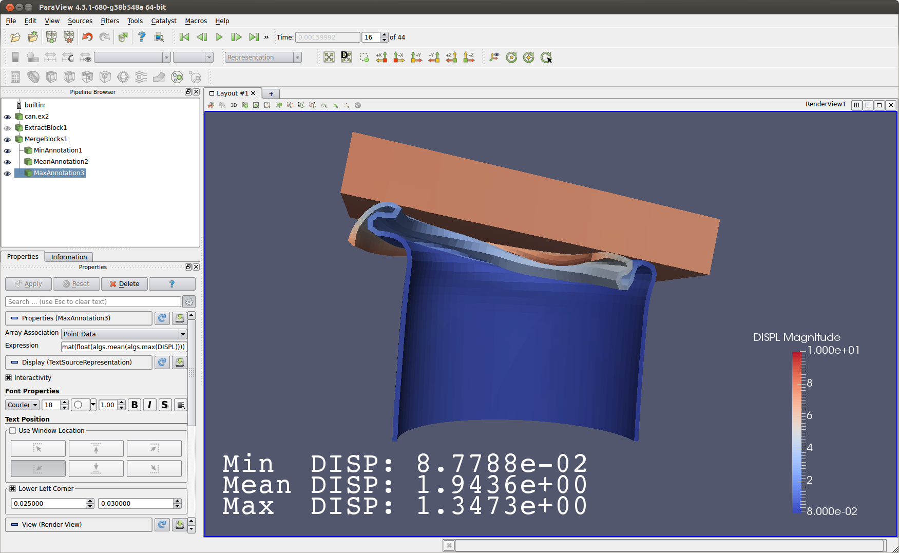

:author: Cory Quammen
:email: cory.quammen@kitware.com
:institution: Kitware, Inc.

-------------------------------------------------------------------------
Scientific Data Analysis and Visualization with Python, VTK, and ParaView
-------------------------------------------------------------------------

.. class:: abstract

   VTK and ParaView are leading software packages for data analysis
   and visualization. Since their early years, Python has played an
   important role in each package. In many use cases, VTK and ParaView
   serve as modules used by Python applications. In other use cases,
   Python modules are used to generate visualization components within
   VTK. In this paper, we provide an overview of Python integration in
   VTK and ParaView and give some concrete examples of usage. We also
   provide a roadmap for additional Python integration in VTK and
   ParaView in the future.

.. class:: keywords

   visualization, VTK, ParaView

Introduction
------------

The Visualization Toolkit (VTK) is an open-source, freely available
software system for 3D computer graphics and visualization. It
consists of a set of C++ class libraries and bindings for Python along
with several other languages. VTK supports a wide variety of
visualization algorithms for 2D and 3D scalar, vector, tensor,
texture, and volumetric data, as well as advanced modeling techniques
such as implicit modeling, polygon reduction, mesh smoothing, cutting,
contouring, and Delaunay triangulation. VTK has an extensive
information visualization framework and a suite of 3D interaction
widgets. The toolkit supports parallel processing and integrates with
various GUI toolkits such as Qt and Tk. Python bindings expose nearly
all VTK classes and class methods, making it possible to write full
VTK-based applications in Python. VTK also includes interfaces to
popular Python packages such as NumPy and matplotlib. Support for
writing custom VTK algorithms in Python is also available.

ParaView is a scalable visualization tool based on VTK that runs on a
variety of platforms ranging from PCs to some of the largest
supercomputers in the world. The ParaView package consists of a suite
of executables for generating data visualizations using the techniques
available in VTK. ParaView executables interface with Python in a
number of ways: data sources, filters, and integrated plots can be
defined via Python code, data can be queried with Python expressions,
and several executables can be controlled interactively with Python
commands in an integrated Python shell. Batch processing via Python
scripts that are either written by hand or generated as a trace of
events during an interactive visualization session is available for
offline visualization generation.

This paper is organized into two main sections. In the first section,
I describe the relationship between VTK and Python and describe some
interfaces between the two. In the second section, I detail the
relationship between ParaView and Python. Examples of Python usage in
both packages are provided throughout. I also provide a roadmap for
additional Python support in VTK and ParaView.

Python and VTK
--------------

VTK Data Model
~~~~~~~~~~~~~~

To understand Python usage in VTK, it is important to understand the
VTK data and processing models. At the most basic level, data in VTK
is stored in a data object. Different types of data objects are
available including graphs, trees, or grids/meshes representing
spatially embedded data from sensors or simulations. Types of
spatially embedded data sets include uniform rectilinear grids,
structured/unstructured grids, and Adaptive Mesh Refinement (AMR) data
sets. In this paper, I focus on the spatially embedded data sets.

Each spatially embedded data set has a set of *cells*, each of which
defines a geometric entity that defines a volume of space, and a set
of *points* that are used to define the vertices of the cells. Data
values that represent a quantity, e.g. pressure, temperature,
velocity, etc., may be associated with both cells and points. Each
quantity might be a scalar, vector, tensor, or string value. Vectors
and tensors typically have more than one numerical *component*, and
the quantity as a whole is known as a *tuple*.

The full collection of a quantity associated with points or cells is
known by a number of names including attribute, field, variable, and
array. VTK stores attributes in individual data arrays. For a
point-associated array, also known as a point array, the number of
tuples is expected to match the number of points. Likewise, for
cell-associated arrays (cell array) the number of tuples is expected
to match the number of cells.

VTK Pipeline
~~~~~~~~~~~~

Data processing in VTK follows the data-flow paradigm. In this
paradigm, data flows through a sequence of processing
algorithms. These algorithms are chained together in a *pipeline*. At
the beginning of a pipeline, a *source* generates a VTK data set. For
example, an STL file reader source reads an STL file and produces a
polygonal VTK data set as an output. A *filter* can be connected to
the file reader to process the raw data from the file. For example, a
smoothing filter may be used to smooth the data read by the
reader. The output of the smoothing filter can be further processed
with a clipping filter to cut away part of the smoothed data
set. Results from this operation can then be saved to a file with a
file writer.

An algorithm in a pipeline produces one or more data sets (described
in the previous section) that are passed to the next algorithm in the
pipeline. Algorithms need only update when one of their properties
changes (e.g., smoothing amount) or when the algorithm upstream of it
has produced a new data set. These updates are handled automatically
by an internal VTK pipeline executive whenever an algorithm is
updated.

Because the Visualization Toolkit is intended to produce 3D
interactive visualizations, output from the final algorithm in a
pipeline is typically connected to a *mapper* object. A mapper is
responsible for converting a data set into a set rendering
instructions. An *actor* represents the mapper in a scene, and has
some properties that can modify the appearance of a mapped data
set. One or more actors can be added to a *renderer* which executes
the rendering instructions to generate an image.

Python Language Bindings for VTK
~~~~~~~~~~~~~~~~~~~~~~~~~~~~~~~~

Since 1997, VTK has provided language bindings for Python. Over the
years, Python has become increasingly important to VTK, both as a
route to using VTK, as well as to the development of VTK itself.

The Python binding support in VTK has evolved so that today nearly
every semantic feature of C++ used by VTK has a direct semantic analog
in Python. C++ classes from VTK are wrapped into Python
equivalents. The few classes that are not wrapped are typically
limited to classes that are meant only for internal use in VTK.

Python Wrapping Infrastructure
~~~~~~~~~~~~~~~~~~~~~~~~~~~~~~

Python classes for VTK classes and special types are generated using a
shared lex/yacc-based parser tailored for VTK programming conventions
and custom code generation utilities for Python wrapping. VTK is
organized into a number of C++ modules. When built with shared
libraries enabled, a library containing C++ classes is generated at
build time for each module.  Each Python-wrapped source file is
likewise compiled into a shared library corresponding to the C++
module. All VTK C++ modules are provided in a single ``vtk`` Python
module.

VTK Usage in Python
~~~~~~~~~~~~~~~~~~~~~~~

VTK is provided as a single ``vtk`` package in both the binaries
available on the VTK download page [VTK15] and in the VTK build. For
convenience, an executable named ``vtkpython`` is provided with
VTK. This is the standard Python executable with environment variables
set to make it simple to import modules from the ``vtk`` package. It
is also possible to use the same ``python`` executable from the Python
installation against which VTK was built by prepending the location of
VTK's shared libraries and the location of VTK's ``__init__.py`` file
to the PYTHONPATH environment variable.

To access VTK classes, you simply import ``vtk``:

.. code-block:: python

   import vtk

Creation of VTK objects is straightforward:

.. code-block:: python

   contourFilter = vtk.vtkContourFilter()

Each Python object references an underlying VTK object.  Objects in
VTK are reference counted and automatically deleted when no longer
used. The wrapping interface updates the underlying VTK object's
reference count and alleviates the need for explicit memory
management within Python.

One particularly nice semantic equivalence between VTK's C++ and
Python interfaces involves methods that accept a pointer to a C++
array representing a small tuple of elements. Such methods are common
in VTK to, for instance, set a 3D Cartesian coordinate as a property
of a class. In Python, the corresponding method accepts a tuple or
list object. This works well as long as the list or tuple has the
expected number of elements.

.. code-block:: python

   sphere = vtk.vtkSphereSource()

   # Express point as list
   sphere.SetCenter([0, 1, 0])

   # Express point as tuple
   sphere.SetCenter((0, 1, 0))

Methods that return pointers to arrays with a fixed number of elements
are also supported. Such methods require a hint to the wrapping
infrastructure indicating how many elements are in the tuple that is
returned.

.. code-block:: python

   >>> center = sphere.GetCenter()
   >>> print center
   (0, 1, 0)

For VTK classes that have operators ``<``, ``<=``, ``==``, ``>=``, ``>``
defined, equivalent Python operators are provided.

Some class methods in VTK return information via parameters passed by
reference. For example, in the following code block, the parameter
``t`` is a return parameter from the method ``IntersectWithLine``.

.. code-block:: c++

   double t, x[3]
   plane->IntersectWithLine(point1, point2, t, x);

In Python, the equivalent is

.. code-block:: python

   t = mutable(0.0)
   plane.IntersectWithLine(point1, point2, t, x)

Class and method documentation is processed by the wrapping
infrastructure to make it available via Python's built-in help system.

.. code-block:: python

   >>> help(vtk.vtkSphereSource)

The above shows the full documentation of the ``vtkSphereSource``
class (too extensive to list here), while the code below produces help
for only the ``SetCenter`` method.

.. code-block:: python

   >>> help(vtk.vtkSphereSource.SetCenter)

   Help on built-in function SetCenter:

   SetCenter(...)
       V.SetCenter(float, float, float)
       C++: void SetCenter(double, double, double)
       V.SetCenter((float, float, float))
       C++: void SetCenter(double a[3])

Some less often used mappings between C++ and Python semantics, as
well as limitations, are described in the file
``VTK/Wrapping/Python/README_WRAP.txt`` in the VTK source code
repository in versions 4.2 and above.

Integration with NumPy
~~~~~~~~~~~~~~~~~~~~~~

There are limited functions within VTK itself to process or analyze
point and cell arrays. Since 2008, a low-level interface layer between
VTK arrays and NumPy array has been available in VTK. This interface
layer can be used to map VTK arrays to NumPy arrays and vice versa,
enabling the full power of NumPy operations to be used on VTK
data. For example, suppose that we have a data set from a
computational fluid dynamics simulation that we can load with a VTK
reader class, and suppose further that the data set has a point array
representing pressure. We can find several properties of this array
using NumPy, e.g.,

.. code-block:: python

   import numpy as np
   import vtk.util.numpy_support as nps

   # Load data with VTK reader
   reader.Update()

   ds = reader.GetOutput()
   pd = ds.GetPointData()
   pressure = pd.GetArray('pressure')
   np_pressure = nps.vtk_to_numpy(pressure)

   min_p = np.min(np_pressure)
   max_p = np.max(np_pressure)

This interface can also be used to add data arrays to loaded data
sets that can be handed off to VTK for visualization:

.. code-block:: python

   norm_pressure = (np_pressure - min_pressure) / \
       (max_pressure - min_pressure)
   vtk_norm_pressure = np.numpy_to_vtk(norm_pressure, 1)
   vtk_norm_pressure.SetName('normalized pressure')
   pd.AddArray(vtk_norm_pressure)

The second argument to ``np.numpy_to_vtk`` indicates that the NumPy
array should be deep copied to the VTK array. This is necessary if no
reference to the NumPy array will otherwise be kept. If a reference to
the numpy array will be kept, then the second argument can be omitted
and the NumPy array will be shallow copied instead, saving memory and
time because the array data does not need to be copied.

More recently, a higher-level NumPy-like interface layer has been
added to VTK. This ``numpy_interface`` was designed to combine the
ease of use of NumPy with the distributed memory parallel computing
capabilities and broad data set type support of VTK. The
straightforward interface between VTK data set arrays and NumPy
described above works only when the entire data set is available on
one node. However, data sets in VTK may be distributed across
different computational nodes in a parallel computer using the Message
Passing Interface [Sni99]. In this scenario, global reduction
operations using NumPy are not possible. For this reason, a NumPy-like
interface has been added to VTK that properly handles distributed data
sets [Aya14].

A key building block in VTK's ``numpy_interface`` is a set of classes
that wrap VTK data set objects to have a more Pythonic interface.

.. code-block:: python

   import vtk
   from vtk.numpy_interface import dataset_adapter as dsa

   reader = vtk.vtkXMLPolyDataReader()
   reader.SetFileName(filename)
   reader.Update()
   ds = dsa.WrapDataObject(reader.GetOutput())
   
In this code, ``ds`` is an instance of a ``dataset_adapter.PolyData``
class returned by the ``WrapDataObject`` function to handle the
``vtkPolyData`` output of the ``vtkXMLPolyDataReader``. Point and cell
arrays are available in member variables that provide the dictionary
interface.

.. code-block:: python

   >>> ds.PointData.keys()
   ['pressure']

   >>> pressure = ds.PointData['pressure']

Note that the ``pressure`` array here is an instance of ``VTKArray``
rather than a ``vtkAbstractArray``. ``VTKArray`` is a wrapper around
the VTK array object that inherits from ``numpy.ndarray``. Hence, all
the standard ``ndarray`` operations are available on this wrapped
array, e.g.,

.. code-block:: python

   >>> pressure[0]
   0.112

   >>> pressure[1:4]
   VTKArray([34.2432, 47.2342, 38.1211], dtype=float32)

   >>> pressure[1:4] + 1
   VTKArray([35.2432, 48.2342, 39.1211], dtype=float32)

   >>> pressure[pressure > 40]
   VTKArray([47.2342], dtype=float32)

The ``numpy_interface.algorithms`` module provides additional
functionality beyond the array interface.

.. code-block:: python

   import vtk.numpy_interface.algorithms as algs

   >>> algs.min(pressure)
   VTKArray(0.1213)

   >>> algs.where(pressure > 38)
   (array([2, 3]),)

In addition to most of the ufuncs provided by NumPy, the
``algorithms`` interface provides some functions to access quantities
that VTK can compute in the wide variety of data set types (e.g.,
surface meshes, unstructured grids, uniform grids, etc.) available in
VTK. This can be used to compute, for instance, the total volume of
cells in an unstructured grid:

.. code-block:: python

   >>> cell_volumes = algs.volume(ds)
   >>> algs.sum(cell_volumes)
   VTKArray(847.02)

This example illustrates nicely the power of combining a NumPy-like
interface with VTK's uniform API for computing various quantities on
different types of data sets.

Another distinct advantage of the ``numpy_interface.algorithms``
module is that all operations are supported in parallel when data sets
are distributed across computational nodes. [Aya14] describes this
functionality in more detail.

Integration with matplotlib
~~~~~~~~~~~~~~~~~~~~~~~~~~~

While VTK excels at interactive 3D rendering of scientific data,
matplotlib excels at producing publication-quality plots. VTK
leverages each toolkit's strengths in two ways.

First, as described earlier, convenience functions for exposing VTK
data arrays as NumPy arrays are provided in the
``vtk.util.numpy_support`` and ``numpy_interface.algorithms``
modules. These arrays can be passed to matplotlib plotting functions
to produce publication-quality plots.

Second, VTK itself incorporates some of matplotlib's rendering
capabilities directly when possible. When VTK Python wrapping is
enabled and matplotlib is available, VTK uses the
``matplotlib.mathtext`` module to render LaTeX math expressions to
either ``vtkImageData`` objects that can be displayed as images or to
paths that may be rendered to a ``vtkContextView`` object, VTK's
version of a canvas.

Qt applications with Python
~~~~~~~~~~~~~~~~~~~~~~~~~~~

Python support in VTK is robust enough to create full-featured
applications without writing a single line of C++ code. PyQt [PyQt15]
(or PySide [PyS15]) provide Python bindings for Qt. A simple PyQt
example adapted from an example by Michka Popoff is provided below:

.. code-block:: python

  import sys
  import vtk
  from PyQt4 import QtCore, QtGui
  from vtk.qt4.QVTKRenderWindowInteractor \
      import QVTKRenderWindowInteractor

  class MainWindow(QtGui.QMainWindow):

      def __init__(self, parent = None):
          QtGui.QMainWindow.__init__(self, parent)

          self.frame = QtGui.QFrame()

          layout = QtGui.QVBoxLayout()
          self.vtkWidget = \
              QVTKRenderWindowInteractor(self.frame)
          layout.addWidget(self.vtkWidget)

          self.renderer = vtk.vtkRenderer()
          rw = self.vtkWidget.GetRenderWindow()
          rw.AddRenderer(self.renderer)
          self.interactor = rw.GetInteractor()

          cylinder = vtk.vtkCylinderSource()
          mapper = vtk.vtkPolyDataMapper()
          mapper.SetInputConnection( \
              cylinder.GetOutputPort())
          actor = vtk.vtkActor()
          actor.SetMapper(mapper)

          self.renderer.AddActor(actor)
          self.renderer.ResetCamera()

          self.frame.setLayout(layout)
          self.setCentralWidget(self.frame)

          self.show()
          self.interactor.Initialize()
        
  if __name__ == "__main__":
      app = QtGui.QApplication(sys.argv)
      window = MainWindow()
      sys.exit(app.exec_())

This simple application does little besides what is possible with pure
VTK code alone. However, this example can easily be expanded to
provide interaction through UI elements such as a menu bar, buttons,
text entries, sliders, etc.

VTK filters defined in Python
~~~~~~~~~~~~~~~~~~~~~~~~~~~~~

While VTK sources and filters are available in Python, they cannot be
subclassed to create new sources or filters because the virtual
function table defined in C++ does not know about methods defined in
Python. Instead, one can subclass from a special ``VTKAlgorithm``
class defined in ``vtk.util.vtkAlgorithm``. This class specifies the
interface for classes that interact with ``vtkPythonAlgorithm``, a C++
class that delegates the primary VTK pipeline update methods to
equivalent pipeline update methods in the Python ``VTKAlgorithm``
class. Subclasses of ``VTKAlgorithm`` can (and usually should)
override these methods. By doing this, it is possible to implement
complex new sources and filters using Python alone. For more details
on the ``VTKAlgorithm`` class, see [Gev2014].

Python integration in VTK tests
~~~~~~~~~~~~~~~~~~~~~~~~~~~~~~~

As a project that follows a quality-software process, VTK has many
regression tests. At present, 26% of tests (544 out of 2046) are
written in Python. This integration of Python in VTK's testing
infrastructure shows how important Python is in VTK's development.

Python and ParaView
-------------------

Python is integrated into ParaView in a number of ways. This section
provides an overview of this integration.

Python Console
~~~~~~~~~~~~~~

ParaView includes a Python console available under the ``Tools ->
Python Console`` menu item. This console is a fully-featured Python
console with the environment set up so that the ``vtk``and a
``paraview`` package is available. When first started, the command

.. code-block:: python

   from paraview.simple import *

is automatically executed to import the ``paraview.simple``
module. This module provides a simplified layer of Python functions to
execute common commands in ParaView such as file reading, filter
creation, and chaining filters together to produce data
transformations and visualizations. This layer is described in more
detail later.

Running commands in ParaView's Python console is identical to running
commands in other Python consoles. The key difference is that commands
can be used to change the state of the ParaView application. This
gives a similar experience to using a Python console to change
matplotlib plots.

Another way to interact with the Python console is by loading a Python
script with ParaView commands to be executed. This feature is ideal
for Python script development for ParaView. A button within the Python
console brings up a file dialog used to select the Python script to
run.

Simple Layer
~~~~~~~~~~~~

ParaView can be run in several difference client/server
configurations. In a number of configurations, the client software
running on a local workstation connects to a remote process running on
a high-performance computing resource. In most cases, VTK objects of
the same type, such as a filter, exist on all processes in the overall
ParaView application. Because most VTK classes do not know how to
communicate among themselves, ParaView wraps designated VTK classes in
proxy classes that are able to communicate with each other among
distributed processes.

The proxy layer is exposed in the ``paraview.servermanager`` Python
module. This module provides direct access to a proxy manager
class. It can be used to create sources and filters

.. code-block:: python

  from paraview import sm

  pm = sm.vtkSMProxyManager.GetProxyManager()
  controller = \
      sm.vtkSMParaViewPipelineControllerWithRendering()

  ss = pm.NewProxy('sources', 'SphereSource')
  ss.GetProperty('Radius').SetElement(0, 2.0)
  controller.RegisterPipelineProxy(ss)

  view = pm.GetProxy('views', 'RenderView1')
  rep = view.CreateDefaultRepresentation(ss, 0)
  controller.RegisterRepresentationProxy(rep)
  rep.GetProperty('Input').SetInputConnection(0, ss, 0)
  rep.GetProperty('Visibility').SetElement(0, 1)

  controller.Show(ss, 0, view)
  view.ResetCamera()
  view.StillRender()

Creating a new data source, a representation for it (how it is
rendered), and adding the representation to the view (where it is
rendered), is an involved process. The ``paraview.simple`` layer
simplifies this process with a set of high-level functions that
take care of most of the tedium. The same example above expressed
in ``paraview.simple`` functions is reduced to

.. code-block:: python

   ss = Sphere(Radius=2.0)
   sd = Show(ss, rv)

Python State Files
~~~~~~~~~~~~~~~~~~

ParaView is able to save the current state of data, filters, and
rendering parameters to a Python source file that, when executed,
recreates the currrent state in ParaView. The Python state file is
generated in terms of ``paraview.simple`` module functions.

Python Tracing
~~~~~~~~~~~~~~

In addition to saving a snapshot of ParaView's state, live tracing of
user interactions with the ParaView user interface is also supported.
Each time a user performs an interaction that modifies ParaView's
state, Python code is generated that captures the event. This is
implemented via instrumenting the ParaView application with Python
generation code at various event handlers. The tracing mechanism can
record either the entire state of proxies or just modifications of
state to non-default values to reduce the trace size. It is also
possible to show the trace code as it is being generating, which can
be a useful way to learn Python scripting in ParaView.

One of ParaView's strenghts is the ability to connect data sources and
filters together into a workflow to perform some action. For example,
in scientific computing it is not uncommon to convert one file format
to another. If ParaView can read the source file format and write the
desitnation file format, it is easy to perform the conversion manually
with the ParaView user interface. For a large list of files, though, a
more automated approach is useful. The Python tracing mechanism
provides a way to generate a conversion script by performing actions in
the user interface, generating a trace, and then modifying the trace to
apply to a series of files that need to be converted.

pvpython and pvbatch
~~~~~~~~~~~~~~~~~~~~

Python scripts generated by either saving the state or tracing may be
used through the user interface. For offline data processing or
visualization, it may not be necessary or desirable to run the
ParaView user interface. In fact, it may not be possible to run the UI
if the system does not have Qt available. Two utility programs in the
ParaView application suite are provided for this
scenario. ``pvpython`` is a Python executable that can be used to run
Python scripts. It also serves as an interactive Python shell if not
supplied with a Python script argument. ``pvbatch`` is a
non-interactive executable that executes a Python script and is
intended to perform offline data processing and visualization
generation. Both ``pvpython`` and ``pvbatch`` can connect to remote
servers for parallel visualization.

Python Programmable Filter
~~~~~~~~~~~~~~~~~~~~~~~~~~

ParaView provides many data filters for transforming data and
performing analysis tasks. However, there are an infinite number of
operations one may want to perform on a data set. To address the need
for custom filters, ParaView supports a rich plugin architecture that
makes it possible to create additional filters in C++. Unfortunately,
creating a plugin this way is a relatively involved process.

Aside from the C++ plugin architecture, ParaView provides a
Programmable Filter that enables a potentially faster plugin
development path. This filter is more versatile than the Python
Calculator because it enables manipulation of the entire output data
set including the output data type, data set toplogy (i.e., type and
number of cells), as well as array manipulation.

The programmable filter is a VTK-derived class named
``vtkPythonProgrammableFilter`` that provides this functionality. The
class has a string property that holds a Python script executed when
the programmable filter is updated. The class
``vtkPythonProgrammableFilter`` passes a reference to itself to the
environment in which the script executes, making it available within
the script itself. This makes it possible to access the inputs and
outputs to the filter via:

.. code-block:: python

   input = self.GetInput()
   output = self.GetOutput()

Arbitrarily complex Python scripts can be executed to generate the
filter's output. The following example moves points in an input
``vtkPointSet`` along the surface normal if a point array with the
name "Normals" is defined.

.. code-block:: python

   ipd = self.GetInput()
   opd = self.GetOutput()

   # Output is shallow-copied by default
   # Deep copy the points so that we are not modifying
   # the input points.
   opd.DeepCopy(ipd)

   na = ipd.GetPointData().GetArray('Normals')
   if na != None:
       for i in xrange(ipd.GetNumberOfPoints()):
           pt = ipd.GetPoint(i)
           n = na.GetTuple(i)
           newPt = (pt[0]+n[0], pt[1]+n[1], pt[2]+n[2])
           opd.GetPoints().SetPoint(i, newPt)

Like the Python Calculator, the inputs are wrapped by the
``dataset_adapter`` module. The filter above expressed with the
wrapping becomes simply

.. code-block:: python

   ipts = inputs[0].Points
   normals = inputs[0].PointData['Normals']

   output.Points = ipts + normals

Python Programmable Source
~~~~~~~~~~~~~~~~~~~~~~~~~~

Within ParaView it is also possible to define Python script that
defines data sources using the Python Programmable Source. This source
functions much like the Python Programmable Filter, but without
requiring any input data sets.

Python Calculator
~~~~~~~~~~~~~~~~~

ParaView's Python Calculator filter provides a way to compute
additional point-based or cell-based data set attributes using NumPy
or the ``numpy_interface.algorithms`` module. This expression will
compute the norm of the Normal array associated with points:

.. code-block:: python

   numpy.linalg.norm(inputs[0].PointData['Normals'], \
                     axis=1)

Under the covers, the Python Calculator uses the
``vtk.numpy_interface.dataset_adapter`` module to wrap the inputs to
the filter. This provides compatibility between VTK arrays and
NumPy. All the wrapped input data sets are appended to a list named
``inputs`` that is available in the environment in which the Python
expression is executed.

Python Annotation
~~~~~~~~~~~~~~~~~

   Three annotation filters in the scene show the minimum, mean, and
   maximum value of the ``DISP`` array at the current time step. :label:`annotationfig`

It is often desirable to annotate visualizations with numerical values
either taken directly from the data set or computed from the data. The
Python Annotation filter in ParaView provides this capability in a
convenient way. The filter takes a Python expression that is evaluated
when the filter is executed and the result is displayed in the render
view. Importantly, these annotations can come from data analysis
results from NumPy or ``numpy_interface.algorithms``. Figure
:ref:`annotationfig` shows an example using the Python Annotation
filter.

Python View
~~~~~~~~~~~

While ParaView's roots are in the loading and display of traditional
3D scientific visualizations, it has grown over the years to support
more data set types and different displays of those data set types.
These different displays, or "Views" in ParaView parlance, include a
3D interactive rendering view, a histogram view, a parallel
coordinates view, and a large number of others.

One such view is the Python View. This view is similar to the
programmable filter in that the user supplies a Python script that
generates some data. In the case of the Python View, the data that is
generated is an image to display in the ParaView window. This makes it
possible to use Python plotting packages, such as matplotlib, to
generate plots that can be displayed directly in ParaView.

Scripts used in the Python view are required to define two functions,
a ``setup_data`` function and a ``render`` function. Because rendering
in the Python view is done on the local client, data that resides on
remote server processes must first be brought over to the client.
Because data sets may be larger than the client's RAM, only a subset
of the data arrays in a data set are copied to the client. By default,
no arrays are copied. Arrays can be requested using methods available
in the ``vtkPythonView`` class instance that is passed in as an
argument to the ``setup_data`` function, e.g.,

.. code-block:: python

   def setup_data(view):
       view.SetAttributeArrayStatus(0, \
           vtkDataObject.POINT, "Density", 1)

The actual generation of the plot image is expected to be done in the
``render`` function. This function is expected to take the same
``view`` object as is passed to the ``setup_data`` function. It also
takes a width and height parameter that tells how large the plotted
image should be in terms of pixels. This function is expected to
return an instance of ``vtkImageData`` containing the plot image. A
few utilities are included in the ``paraview.python_view`` module to
convert Python arrays and images to ``vtkImageData``. An example that
creates a histogram of an array named "Density" is provided here:

.. code-block:: python

   def render(view, width, height):
       from paraview \
           import python_view.matplotlib_figure
       figure = matplotlib_figure(width, height)

       ax = figure.add_subplot(1,1,1)
       ax.minorticks_on()
       ax.set_title('Plot title')
       ax.set_xlabel('X label')
       ax.set_ylabel('Y label')

       # Process only the first visible object in the
       # pipeline browser
       do = view.GetVisibleDataObjectForRendering(0)

       dens = do.GetPointData().GetArray('Density')

       # Convert VTK data array to numpy array
       from paraview.numpy_support import vtk_to_numpy

       ax.hist(vtk_to_numpy(dens), bins=10)

       return python_view.figure_to_image(figure)

Unified Server Bindings
~~~~~~~~~~~~~~~~~~~~~~~

To support communication among ParaView processes, ParaView generates
a special communication class for each of a subset of VTK classes
automatically during build time. These class are used to communicate
proxy state between different ParaView processes, to ensure, for
example, that each proxy for an instance of a file reader on each
process has the same file name. As we have described, a similar
wrapping process is also performed for Python when Python wrapping is
enabled.

Each wrapping adds to the size of the executable files and shared
libraries. On very large scale parallel computing resources, the
amount of RAM available per node is relatively limited. As a result,
when running ParaView on such a resource, it is important to reduce
the size of the executables as much as possible to leave room for the
data that we want to visualize. One way to do this is to use the
Python wrapping to communicate among processes instead of using the
custom communication class. When this is enabled, the process of
creating the special communication classes is not run. Instead,
communication is performed by sending strings with Python commands to
destination processes to change the state of local proxies.

Conclusions
-----------

Python has been integrated into VTK and ParaView since almost their
respective beginnings. The integration continues to expand as Python
is used in an increasing number of ways in both software packages. As
Python continues to grow in popularity among the scientific community,
so, too, does the need for providing easy-to-use Pythonic interfaces
to scientific visualization tools. As demonstrated in this paper, VTK
and ParaView are well-positioned to continue adapting to the future
needs of scientific Python programmers.

Future Work
-----------

VTK and ParaView currently support up to Python version 2.7. The VTK
and ParaView user bases have significant code written in 2.7.
Conversion from Python 2 to 3 will require significant work, but
support for it is targeted within the next year.

Acknowledgements
----------------

Contributions to Python support in VTK and ParaView have come from a
number of VTK community members. Deserving special recognition are the
following key contributors: David Gobbi, Prabhu Ramachandran, Ken
Martin, Berk Geveci, Utkarsh Ayachit, Ben Boeckel, Andy Cedilnik, Brad
King, David Partyka, George Zagaris, Marcus Hanwell, and Mathieu
Malaterre.

.. Customised LaTeX packages
.. -------------------------

.. Please avoid using this feature, unless agreed upon with the
.. proceedings editors.

.. ::

..   .. latex::
..      :usepackage: somepackage

..      Some custom LaTeX source here.

References
----------
.. [Aya14] U. Ayachit, B. Geveci, *Scientific data analysis and visualization at scale in VTK/ParaView with NumPy*,
           4th Workshop on Python for High Performance and Scientific Computing PyHPC 2014, November, 2014.

.. [Aya15] U. Ayachit, *The ParaView Guide: A Parallel Visualization Application*,
           Kitware, Inc. 2015, ISBN 978-1930934306.

.. [Gev14] B. Geveci, *vtkPythonAlgorithm is great*,
           Kitware Blog, September 10, 2014. http://www.kitware.com/blog/home/post/737

.. [PyQt15] *PyQt4 Reference Guide*,
            http://pyqt.sourceforge.net/Docs/PyQt4/

.. [PyS15] *PySide 1.2.2*,
           https://pypi.python.org/pypi/PySide

.. [Sch04] W. Schroeder, K. Martin, and B. Lorensen, *The Visualization Toolkit: An Object-Oriented Approach to 3D Graphics*,
           4th ed. Kitware, Inc., 2004, ISBN 1-930934-19-X.

.. [Sni99] M. Snir, S. Otto, S. Huss-Lederman, D. Walker, and J. Dongarra, *MPI - The Complete Reference: Volume 1, The MPI Core*,
           2nd ed., MIT Press, 1999, ISBN 0-262-69215-5.

.. [VTK15] *VTK- The Visualization Toolkit*,
           http://www.vtk.org/
