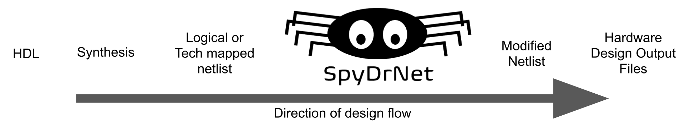
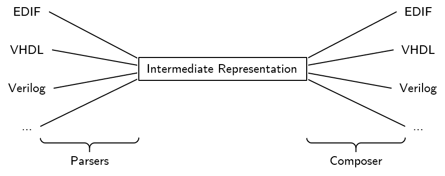
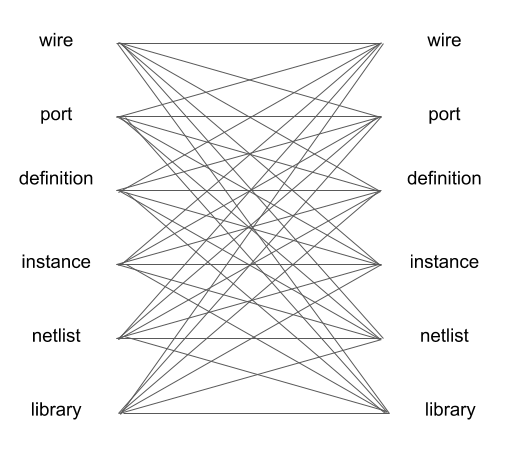
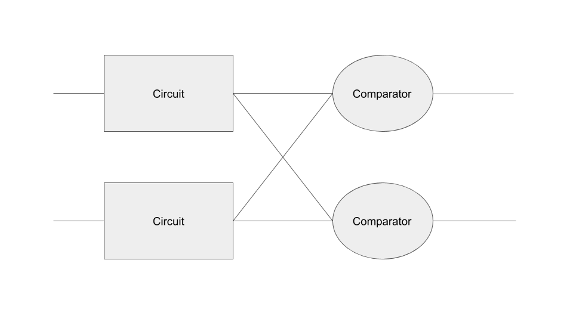

:author: Dallin Skouson
:email: dallinskouson@byu.edu
:institution: NSF Center for Space, High-Performance, and Resilient Computing (SHREC)
:institution: Department of Electrical and Computer Engineering, Brigham Young University

:author: Andrew Keller
:email: andrewmkeller@byu.edu
:institution: NSF Center for Space, High-Performance, and Resilient Computing (SHREC)
:institution: Department of Electrical and Computer Engineering, Brigham Young University

:author: Michael Wirthlin
:email: wirthlin@byu.edu
:institution: NSF Center for Space, High-Performance, and Resilient Computing (SHREC)
:institution: Department of Electrical and Computer Engineering, Brigham Young University
:bibliography: mybib

--------------------------------------------------------------
Performing Netlist Analysis and Transformations Using SpyDrNet
--------------------------------------------------------------

.. class:: abstract

   Hardware circuits can contain a large number of discrete components and connections. These connections are defined by
   a data strauture called a "netlist". Important information can be gained by analyzing the structure of the circuit 
   netlist and relationships between components. Many specific circuit manipulations require component reorganization in
   hierarchy and various circuit transformations.

   SpyDrNet is an open-source netlist analysis and transformation tool that performs many of these functions written in 
   Python. It provides a framework for netlist representation, querying, and modification. This tool is actively used to
   enhance circuit reliability in radiation environments through partial circuit replication.

.. class:: keywords

   Hardware Design, Netlists, SpyDrNet, EDIF

Introduction
------------

Hardware circuits can contain a large number of discrete components and connections. These components work together 
through their connections to implement a hardware design. Hardware circuits can be found on printed wiring boards or 
in very large scale integration (VLSI) as implemented in integrated circuits. Discrete components can be analog or 
digital in nature and each component and connection can be associated with specific attributes. All of this information
can be stored inside a graphlike data structure called a "netlist" which details each component, its attributes, and 
connections.

Netlists come in many different formats and organizational structures, but common constructs abound (within EDIF, 
structural Verliog, and structural VHDL, etc.) :cite:`edif_based,verilog_netlist`. Most netlist formats have a notion of
primitive or basic circuit components that form a basis from which any design can be created. If the contents of a 
circuit component is unknown, it treated as a blackbox. Primitive or basic components and blackboxes are viewed as leaf 
cells, modules, or definitions, which can then be instanced individually into larger non-leaf definitions. These 
definitions contains wires, nets, buses, or cables that together connect ports or pins on instances or on the definition
itself. Instancing definitions within definitions provides hierarchy up to the top hierarchical instance and definitions
can be further organized into libraries to keep things neat and tidy. 

SpyDrNet provides a common framework for representing, querying, and modifying netlists from which application specific
analysis and transformation functions can be built. The data structure used to represent netlists is designed to provide
quick pointer access to neighboring elements and it is designed to be extensible so that format specific constructs can 
be stored along with the netlist for preservation when the netlist is exported. SpyDrNet differs from most related tools
in that its focus is on structural netlists as opposed to the synthesis or simulation of hardware description languages.

SpyDrNet is currently implemented in pure Python and provides a Python interface so that it can easily integrate with
other Python packages such as NetworkX :cite:`networkx` and PyEDA :cite:`pyeda`. These library packages have been used
in tandem with SpyDrNet to prototype new analysis techniques for better understanding the connectivity and 
relationships between circuit components as part of reliability research. The Python platform also makes this tool 
readily available to anyone in the community that may be interested in using it. 

This paper presents the SpyDrNet framework, some of its use cases, and highlights its use in the development of 
advanced reliability enhancement techniques. This tool originates from a long line of reliability research focused on
improving the reliability of computer circuits implemented on SRAM-based field programmable gate arrays (FPGAs)
:cite:`johnson_dwc,pratt_2008,Johnson:2010`. The predecessor to this tool is BYU EDIF Tools :cite:`BYUediftools`. 
Development efforts moved towards SpyDrNet to bring the previous tools functionality to Python and open up its use to a
larger number of formats and unique applications.

Related Work
------------

SpyDrNet is not the first tool of its kind. The predecessor to SpyDrNet, BYU EDIF Tools :cite:`BYUediftools`, is a Java 
based tool released in 2008 intended primarily for use with netlists targeting FPGAs produced by Xilinx. Xilinx itself 
offers a robust tool command language (TCL) scripting environment for querying and modifying a netlist among other 
specialized implementation tasks; a custom CAD tool framework has taken advantange of this environment :cite:`tincr`. A 
tool similar to SpyDrNet built for hardware description languages (HDLs) is LiveHD :cite:`livehd`. LiveHD is an 
infrastructure focused on the synthesis and simulation of HDLs. It looks more at the whole design cycle (from synthesis,
to simulation, to place and route, and tapeout) with rapid turnaround for small changes, but it may also feasibly be 
used to work with structural netlists. A tool more specific to Xilinx FPGA implementation is RapidWright 
:cite:`rapid_wright`. It also contains a netlist representation, and is taylored towards low-level physical 
implementation.

SpyDrNet Tool Flow
---------------------------

   The path of a design using SpyDrNet. :label:`exteriorfig`

SpyDrNet avoids many of the complexities of hardware description design, including the synthesis, and platform specific functionality that is required to create a hardware device. It also positions itself in a unique place in the design flow to give users access to the structure of the design where changes they make are less likely to be optimized out. Figure :ref:`exteriorfig` represents how a design can be prepared and processed prior to and after using SpyDrNet.

   Universal representation capabilities of the intermediate representation :label:`flowfig`

Internally the SpyDrNet tool is composed of a flow that begins with a parser, accepting any of the supported languages. The parser creates an in memory data structure of the design stored in the intermediate representation. After this the tool can perform any of its analysis or modification passes on the design. Once the design is in a state where the user is satisifed a supported composer is used to pass the design back out. Figure :ref:`flowfig` represents the internal flow within SpyDrNet.

The Intermediate Representation
-------------------------------

The intermediate representation is a generic structural netlist representation employed by SpyDrNet.  Structural netlists refer to a class of netlists that represent circuit components but not necessarily their behaviour. These netlists are useful because when modifying netlists for reliability we are less concerned with the general purpose of the circuit and more concerned with how that circuit is implemented. SpyDrNet’s internal intermediate representation is an in-memory construct. Currently there is no serialization of the intermediate representation directly, although future work may create one. Instead users can manipulate the structure while in memory and write out a supported format using one of the composers that is included with SpyDrNet. More advanced users with special requrements could also create their own composer to support the format that they desire. The API is complete enough to support full parser and composer support. Users need not learn excess information about the internals of the netlist to create an effective composer or parser.

Constructs Employed
*******************

Representing netlist data structures presents a unique challenge. These data structures are highly connected. Maintaining bidirectional references is also helpful to end users by providing quick traversal of netlist components. The basic constructs behind a structural Netlist are Libraries, Definitions, Instances, Ports,and Cables. Figure :ref:`irfig` shows the connectivity between these components.

   Highlights the connectivity between components in the intermediate representation :label: `irfig`

A short description of some of the more complex components is provide here as background to help the reader more easily understand how the various applications are working on the netlist datastructure.

Element
+++++++

This is the base class for all components of a netlist. Components are further divided into first class elements and regular elements. First class elements have a name field as well as a properties field.

Definition
++++++++++

These objects are sometimes called cells or modules in other representations. They hold all of the information about what their instances contain.

Instance
++++++++

This element is a place holder to be replaced with the subelements of the corresponding definition upon build. It is contained in a different definition to its own. In the case of the top level instance it is the place holder that will be replaced by the entire netlist when it is implemented

Port
++++

The Port element can be thought of as containing the information on how a Definition connects the outside world to the elements (instances and cables) it contains.

Cable
+++++

Cables are bundles of wires that connect components within a definition. They connect ports to their destination pins.

Pin
+++

These objects represent points of connection between instances or ports and wires. Pins can be divided into inner and outer pin categories. The need for these distinctions lies in the fact that definitions may have more than one instance of itself. Thus components connected on the inside of a definition need to connect to pins related to the definition will connect to inner pins on the definition. Each of these inner pins will correspond to one or more outer pins on instances of the corresponding definition. In this way instances can be connected togehter while still allowing components within a definition to connect to the ports of that definition.

Wire
++++

Wires are grouped inside cables and are elements that help hold connection information between single pins on instances within a definition and within it’s ports.

.. figure:: ExampleCircuit.png

   Structure of the Intermediate Representation :label:`egfig`

Multiple Formats
****************

In addition to holding a generic netlist data structure, the universal netlist representation can hold information specific to individual formats. This is done through the inclusion of metadata dictionaries in many of the SpyDrNet objects. 

Parsers can take advantage of the flexibility of the metadata dictionary to carry extra information that source formats present through the tool. This includes information such as comments, parameters, and properties.

In addition, the metadata dictionary can be used to contain any desired user data. Because the tool is implemented in python, any data type can be used for the key value in these dictionaries, however we only guarantee future support of string objects.

Callback Framework
------------------

Additionally SpyDrNet includes a callback framework. These callbacks allow users to create plugins that can keep track of the current state of the netlist. Currently, a namespace manager is included with SpyDrNet. Plans exist to include a netlist visualizer that takes advantage of the callback framework to maintain an up to date visualization of the netlist as changes are made. The callback framework is able to watch changes to the netlist, including addition and removal of elements, as well as changes in namming and structure of the netlist.

Listeners may register to hear these changes as they happen. Each listener is called in the order in which it was registered and may update itself as it sees the netlist change. Plugins that implement listeners can be created and added through the api defined register functions. In general listener functions are expected to receive the same parameters as the function on which they listen.

Modularity by design
********************

In order to support expansion to a wide variety of netlists, our intermediate representation was designed to reflect a generic netlist data structure. Care was taken to ensure that additional user defined constructs could be easily included in the netlist.

Additionally, to maintain modularity, the intermediate representation can be built entirely using the existing API calls. These calls also allow the netlist to be written out or composed after modification. The existing parsers and composers use the API to achieve their functions.

Because of the generic nature of the netlist representation and the ability to build it using only the API additional netlist parsers and composers can be built separately and still take full advantage of the existing modification passes available in SpyDrNet. To build a parser or composer requires no more advanced knowledge than an end user may have from using the API to design a custom analysis or modification pass on the netlist.

Other functionality has been added on top of the core of SpyDrNet, including plugin support and the ability to modifiy the netlist at a higher level. These utility functions are used by applications. This layered approach aims to aid in code reusability and reliability allowing lower level functionality to be tested before the higher level functionality is added on.

Analysis and Transformation Capabilities
----------------------------------------

SpyDrNet was created with FPGA reliability in mind. One current application of SpyDrNet focuses on implementing duplication with compare and triple modular redundancy to circuit designs. Some of the design considerations that go into effect while choosing a tool to implement these reliability modifications, include avoiding optimizations, and algorithmic modification capability. It is desirable to have a flexible framework. Additionally behavioral modifications are not generally needed because the structural implementation is simple enough to be easily implemented directly.

SpyDrNet grew to fill these needs. Modifications made with SpyDrNet are less likely to be optimized away. Additionally SpyDrNet allows users to create custom algorithms that will modify components of the netlist. Modifications are done at the structural level which is simple for our reliability algorithms of interest.

Utility Functions
-----------------

SpyDrNet has several high level features currently included. All of these features have an impact on the overall netlist structure but several are most useful when included in other applications. This section will highlight some of the simpler high level features that are currently implemented in SpyDrNet. 

Base API
********
Functionality is provided through the api to allow for creation and modification of elements in the netlist datastructures. Sufficient functionality is provided to create a netlist from the ground up, and read all available information from a created netlist. Netlist objects are mutable and allow for on demand modification. This provides a flexible framework upon which users can build and edit netlists data structures. The base API includes functionality to create new children elements, modify the properties of elements, delete elements, and change the relationships of elements. All references bidirectional and otherwise are maintained behind the scenes to ensure the user can easily complete modification passes on the netlist while maintaining a valid representation.

Hierarchy
*********

Hierarchy is perhaps one of the most transparent features that is included in our tool. Hierarchy is by default a component of many netlist formats. One of the main advantages to including hierarchy in a design is the ability to abstract away some of the finer details on a level based system, while still including all of the information needed to build the design. The design’s hierarchy is represented in SpyDrNet by having instances of other definitions within existing definitions. This creates a structure similar to the file structure used by most modern computer file systems.

Hierarchy can slightly complicate some algorithms but it’s inclusion helps allow SpyDrNet to make the fewest possible changes to the design in an attempt to keep as much of the original format as possible. Additionally there are several advantages to maintaining hierarchy, smaller file sizes are possible in some cases, as sub components do not need to be replicated. Simulators may have an easier time predicting how the design will act once implemented :cite:`build_hierarchy`. Further research could be done to further analyze the impact of hierarchy on FPGA place and route steps.

Flattening
**********

SpyDrNet has the ability to flatten hierarchical designs. One method to remove hierarchy from a design is to move all of the sub components to the top level of the netlist repeatedly until each sub component at the top level is a terminal instance, where no more structural information is included below that instance’s level. In the example comparing hierarchy to files systems, flattening could be compared to moving each of the files in a file system directly into the root directory, then deleting the folders which contained them.

Flattening was added to SpyDrNet because there are some algorithms which can be applied more simply on a flat design. Algorithms in which a flat design may be simpler to work with are graph analysis, and other algorithms where the connections between low level components are of interest.

Uniquify
********

Uniquify is the name we give to the algorithm which helps ensure that each non-terminal instance is unique, meaning that it and it’s definition have a 1 to 1 relationship. Non-unique definitions and instances may exist in most netlist formats. One such example could be a 4 bit adder that is composed of 4 single bit adders. Assuming that each single bit adder is composed of more than just a single component on the target device, and that the single bit adders are all identical, the design may just define a single single bit adder which it uses in 4 places. To uniquify this design, new matching definitions for single bit adders would be created for each of the instances of the original single bit adder and the instances that correspond would be pointed to the new copied definitions. Thus each of the definitions would be left with a single instance. In our filesystem example, the uniquify algorithm could be thought of as a pass that removes all hard links in the filesystem, ensuring that when a file is edited in a given directory, files located in other directories are untouched, even if they contain all of the same information.

The uniquify algorithm is very useful when modifications are desired on a specific part of the netlist but not to all instances of the particular component. For example in the four bit adder, if we assume that the highest bit does not need a carry out, the single bit adder there could be simplified. However, if we make modifications to the single bit adder before uniquifying the modifications will apply to all 4 adders. If we instead uniquify first then we can easily modify only the adder of interest.

Currently Uniquify is implemented to ensure that the entire netlist contains only unique definitions. This is one approach to uniquify, however an interesting area for future exploration is that of uniquify on demand. Or some other approach to only ensure and correct uniquification of modified components only. This is left for future work.

Clone
*****

Cloning is another useful algorithm currently implemented in SpyDrNet. Currently all of the components in a netlist can be cloned from pins and wires to whole netlist objects. The relationship to filesystem operations for clone is straight forward, it is just a copy. However there is some complexity when it comes to the connections between individual components. Some explanation is provided here.

There is some play in how exactly a clone algorithm should work on the complex netlist datas structure, however we attempted to find the most logical method for cloning that would result in a logical method for our clone algorithm at each level of the data structure. Our overall guiding principles were that at each level, lower level objects should maintain their connections, the cloned object should not belong to any other object, and the cloned object should not maintain its horizontal connections. There are of course some exceptions to these rules which seemed judicious. One such example is that when cloning an instance, That instance will maintain its original corresponding definition, unless the corresponding definition is also being cloned as in the case of cloning a whole library or netlist (in which case the new cloned definition will be used).

Care was taken to make the behaviour consistent at all levels of cloning . This presented a challenge because clone on the lower levels need to take into account whether a higher level is being cloned simultaneously. This was accomplished by implementing clone at a lower level than our current API to ensure we could maintain control over references in a one way manner, allowing the references to act as dictionary lookups for other connected cloned objects.

The clone algorithm is very useful while implementing some of the higher level algorithms such as triple modular redundancy and duplication with compare that we use for reliability research. In these algorithms cloning is essential, and having it built into the tool helps simplify their implementation.

Hierarchical Refrerences
************************

SpyDrNet includes the ability to create a hierarchical reference graph of all of the instances, ports, cables, and other objects which may be instanciated. The goal behind hierarchical references is to create a graph on which other tools, such as NetworkX can more easily build a graph. each hierarchical reference will be unique, even if the underlying component is not unique. These components are also very light weight to minimize memory impact since there can be many of these in flight at one time.

Getter functions
****************

SpyDrNet includes getter functions which are helpful in the analysis of netlists. These functions were created as an extension to the base api to help a user more quickly traverse the netlist. These functions provide the user with quick access to adjacent components. A get call can get any other related elements from the existing element that the user has a handle to. Similar to clone there are multiple methods which could be used to implement a correct getter function. We again strove to apply the most logical and consistent rules for the getter functions. There are some places in which the object returned may not be the only possible object to be returned. In these cases generators are returned. In cases in which there are 2 possible classes of relationships upon which to return objects, the user may specify wether they would like to get the more inward related or outward related objects. For example a port may have outer pins on instances or inner pins within the port in the definition. Both of these pins can be obtained separately by passing a flag.

   Getter functions are able to get sets of any element related to any other element. :label:`egfig`

Applications
------------

SpyDrNet may be used for a wide varity of applications. SpyDrNet grew out of a lab that is focused primarily on 
improving circuit reliability and security.  An application that has had strong influence over its development is that 
of enhancing circuit reliability in harsh radiation environments through partial circuit replication :cite:`pratt_2008`.
When a particle of ionizing radiation passes through an integrated circuit, it can deposit enough energy to invert values 
stored in memory cells :cite:`JEDEC`. A field programmable gate array (FPGA) is a computer chip that can be used to implment 
custom circuits. SRAM-based FPGA stores a circuits configuration in a large array of memory. When radiation corrupts an FPGA 
configuration memory, it can corrupt the underlying circuit and cause failure.

One of our areas of research involves finding ways to design more reliable circuits to be programmed onto existing, non 
specialized, FPGAs. These modifications are useful for designers that deploy many FPGAs as well as designers that plan 
on deploying circuits in high radiation environments where single event upsets can disrupt the normal operation of devices. 
These reliability focused modifications require some analysis of netlist structure as well as modifications in the netlist. 

SpyDrNet was created to help automate this process and allow our researchers to spend more time studying the resulting 
improved circuitry and less time modifying the circuit itself. It is important to note that some care needs to be taken
to ensure that redundancy modifications are not removed by down stream optimizations in implmementaion. Reliability 
modifications to netlists are often optimized away. One common adjustment to a netlist for reliability purposes, is a 
replication of various components. Often when tools see the same functionality with a theoretical identical result they 
will attempt to remove the duplicated portion and provide two outputs on a single instance. This defeats the purpose of 
the reliability modifications. Using and modifying netlists allows us to bypass those optimizations and gives more 
control over how our design is built. Below are some details on using SpyDrNet for higher level transformation and 
analysis techniques applicable to reliability applications.

Triple Modular Redundancy 
*************************

.. figure:: tmr.png

   Triple modular redundancy with a single voter and triplicated voters. :cite:`tmrimage` :label:`tmrfig`

Triple modular redundancy or TMR is one method by which circuits can be made more reliable. TMR triplicates portions of the circuit to allow the circuit to continue to provide the correct result even under some cases of error. Voters are inserted between triplicated circuit components to pass the most common result on to the next stage of the circuit :cite:`pratt_2008`. Figure :ref:`tmrfig` shows 2 typical layouts for TMR. the top half of the image shows a triplicated circuit with a single voter that feeds into the next stage of the circuit. The bottom of the figure shows a triplicated voter layout such that even a single voter failure may be tolerated.
   
TMR has been applied using SpyDrNet. Subsections of the circuit have been chosen to be replicated. Then a voter insertion algoritim was implemented which created and inserted the voter logic between triplicated layers as well as the reduction voting on the output to terminate the triplicated portion of the circuit. The ability of SpyDrNet to carry hierarchy through the tool was taken advantage of by the TMR implementation. This allows the triplicated design to take advantage of the benefits of hiearachy including, improved place and route steps on the target FPGA. Previous work with the BYU EDIF Tools :cite:`BYUediftools`. required a flattened design to accomplish TMR on a netlist. The triplicated design was programmed to an FPGA after being processed using SpyDrNet.

Duplication With Compare 
************************

   
   Duplication with compare showing the duplicated circutry and duplicated violation flags.

Duplication with compare or DWC is a reliability algorithm in which the user will duplicate components of the design and include comparators on the output to try present a flag that will be raised when one of the circuits goes down :cite:`johnson_dwc`. Like TMR's voters, the comparators can be duplicated as well to ensure that if a comparator goes down at least one of the comparators will flag an issue.

DWC was again implemented on SpyDrNet. Once again this was able to take advantage of SpyDrNet's hiearachy and maintain that through the build. Comparators were created and inserted and the selected portion of the design was duplicated. The resulting circuits were programmed to an FPGA after being read into SpyDrNet, modified and written back out. As with TMR the existing implementation on the BYU EDIF Tools :cite:`BYUediftools` required that the design be flattened before being processed.

Clock Domain Analysis
*********************

In hardware various clocks are often used in different portions of the circuit. Sometimes inputs and outputs will come in on a different clock before they reach the main pipeline of the circuit. At the junctions between clock domains circutry should not be triplicated in TMR. If it is triplicated it may result in steady state error on the output because the signals from the 3 inputs may reach the crossing at different times and be registered improperly :cite:`tmr_sync`. This can make the overall reliability of the system lower than it otherwise would be. 

In order to find these locations. Clock domains have been examined using SpyDrNet. The basic methodology for doing this was to find the clock ports on the various components in the design which have them and trace those clocks through the netlist. The resulting connected components form a clock domain. When a triplication pass encountered the boundry between domains the triplicated circuit could be reduced to a single signal to cross the boundry.

Graph Analysis and Feedback
***************************

While triplictaing a design users must determine the best location to insert voters in the design. Voters could be inserted liberally at the cost of the timing of the critical path. Alternatively sparse voter insertion can yield a lower reliability. One consideration to take into account is that voters inserted on feedback loops in the directional graph represented by the netlist can help correct the circuit's state more readily. One study concluded that inserting voters after high fanout flip flops in a design yielded good results. :cite:`Johnson:2010` This voter insertion algorithm was implemented on SpyDrNet after doing analysis using NetworkX :cite:`networkx` to find the feedback loops.

Conclusion
----------

SpyDrNet is a framework created to be as flexible as possible while still meeting the needs of reliability related research. We have worked to ensure that this tool is capable of a wide variety of netlist modifications.

Although this tool is new, a few reliability applications have been built on SpyDrNet. Because of these applications we feel confident that this tool can be helpful to others. SpyDrNet is released on github under an open source licence. New users are welcome to use and contribute to the SpyDrNet tools.

Acknowledgment
--------------

This work was supported by the Utah NASA Space Grant
Consortium and by the I/UCRC Program of the National
Science Foundation under Grant No. 1738550.

