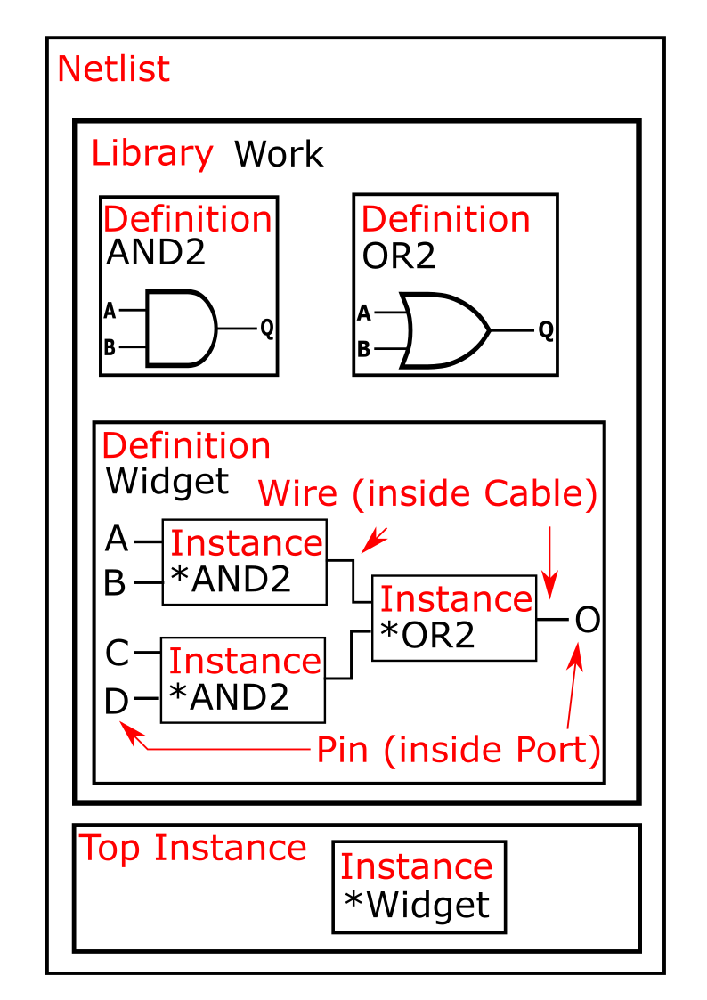
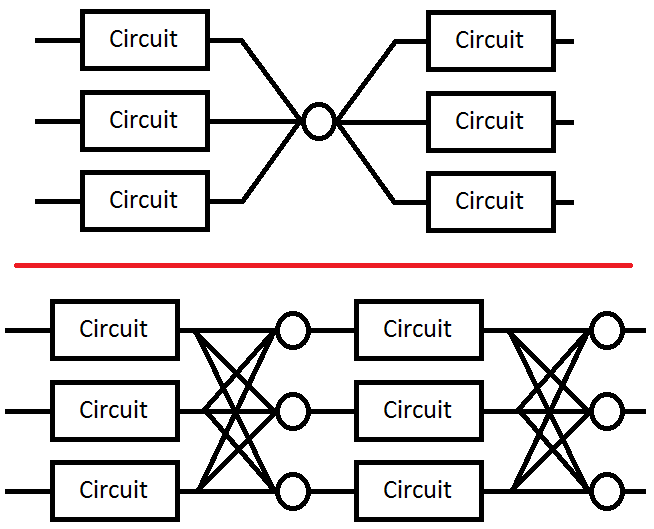

:author: Dallin Skouson
:email: dallinskouson@byu.edu
:institution: NSF Center for Space, High-Performance, and Resilient Computing (SHREC)
:institution: Department of Electrical and Computer Engineering, Brigham Young University

:author: Andrew Keller
:email: andrewmkeller@byu.edu
:institution: NSF Center for Space, High-Performance, and Resilient Computing (SHREC)
:institution: Department of Electrical and Computer Engineering, Brigham Young University
:orcid: 0000-0002-6285-5288

:author: Michael Wirthlin
:email: wirthlin@byu.edu
:institution: NSF Center for Space, High-Performance, and Resilient Computing (SHREC)
:institution: Department of Electrical and Computer Engineering, Brigham Young University
:bibliography: mybib
:orcid: 0000-0003-0328-6713

---------------------------------------------------
Netlist Analysis and Transformations Using SpyDrNet
---------------------------------------------------

.. class:: abstract

   Digital hardware circuits (i.e., for application specific integrated circuits or field programmable gate array 
   circuits) can contain a large number of discrete components and connections. These connections are defined by
   a data structure called a "netlist". Important information can be gained by analyzing the structure of the circuit 
   netlist and relationships between components. Many specific circuit manipulations require component reorganization in
   hierarchy and various circuit transformations. SpyDrNet is an open-source netlist analysis and transformation tool 
   written in Python that performs many of these functions. SpyDrNet provides a framework for netlist representation, 
   querying, and modification that is netlist format independent and generalized for use in a wide variety of 
   applications. This tool is actively used to enhance circuit reliability and error detection for circuits operating in
   harsh radiation environments.

.. class:: keywords

   Hardware Design, Netlists, EDA, CAD

Introduction
------------

Digital hardware circuits can contain a large number of discrete components and connections. These components work 
together through their connections to implement a digital hardware design. Digital hardware circuits are commonly 
implemented on application specific integrated circuits (ASICs) or on field programmable gate arrays (FPGAs). Discrete 
components and connections in a digital hardware circuit can be associated with a number of specific attributes. All of 
this information can be stored inside a graph-like data structure called a "netlist" which details each component and 
connection along with their respective attributes.

Netlists come in many different formats and organizational structures, but common constructs abound (within EDIF, 
structural Verliog, and structural VHDL, etc.) :cite:`edif_based,verilog_netlist`. Most netlist formats have a notion of
primitive or basic circuit components that form a basis from which any design can be created. If the contents of a 
circuit component is unknown, it is treated as a blackbox. Primitive or basic components and blackboxes are viewed as 
leaf cells. Cells are also referred to as modules, or definitions. Leaf definitions can then be instanced individually 
inside a larger non-leaf definitions. Definitions and instances contain connection points called pins, which are 
sometimes grouped together into ports. Nets connect pins together. Nets are also referred to as wires and can be grouped
into a collection of nets called a bus or cable.

SpyDrNet provides a common framework for representing, querying, and modifying netlists from which application specific
analysis and transformation functions can be built. The data structure used to represent netlists is designed to provide
quick pointer access to neighboring elements and it is designed to be extensible so that format specific constructs can 
be stored along with the netlist for preservation when the netlist is exported. This ability supports the
representation of a wide variety of netlist formats.

SpyDrNet is currently implemented in Python and provides a Python interface so that it can easily integrate with other 
Python packages such as NetworkX :cite:`networkx` and PyEDA :cite:`pyeda`. These library packages have been used in 
tandem with SpyDrNet to rapidly develop new analysis techniques for better understanding the connectivity and 
relationships between circuit components as part of reliability research. The Python platform also makes this tool 
readily available to anyone interested in the community and easily extensible.

This paper presents the SpyDrNet framework, a few use cases, and highlights its use in the development of 
advanced reliability enhancement techniques. This tool originates from a long line of reliability research focused on
improving the reliability of computer circuits implemented on static random access memory based (SRAM-based) FPGAs
:cite:`johnson_dwc,pratt_2008,Johnson:2010`.

.. figure:: SpyDrNetFlow.pdf
   :scale: 70%
   :align: center
   :figclass: w

   The path of a design using SpyDrNet. :label:`exteriorfig`

Related Work
------------

The predecessor to SpyDrNet, BYU EDIF Tools :cite:`BYUediftools`. The BYU EDIF tools provide two benefits. First, it 
provides an API for working with electronic design interchange format (EDIF) netlists. Second, the BYU EDIF Tools 
includes the Brigham Young University and Los Alamos National Laboratory Triple Modular Redundancy (BL-TMR) Tool. The 
BL-TMR tool provides a rich set of features for the automated insertion of circuit redundancy for the application of 
fault-tolerance techniques on digital hardware circuits. These tools have been used extensively in FPGA reliability 
research :cite:`johnson_dwc,pratt_2008,Johnson:2010`.

The BYU EDIF Tools have limitations that motivate the development of SpyDrNet. First, the framework of the BYU EDIF 
Tools is closely tied to the EDIF netlist format, which makes it challenging to use with alternate netlist formats. 
Second, the BYU EDIF Tools are primarily intended for use with netlists targeting specific FPGAs. Finally, though not a 
limitation per se, the BYU EDIF Tools are written in Java and migrating to Python is a motivating factor.

SpyDrNet aims to provide a framework that is netlist format independent and generalized for use in a wide variety of 
applications. Tools with functionality similar to SpyDrNet exist, but they tend to be tied to a specific device, 
architecture, netlist format, or vendor. Some tools with similar functionality such as Vivado :cite:`vivado` or Verific 
:cite:`verific` are proprietary. Other tools such as RapidWright :cite:`rapid_wright` and Tincr :cite:`tincr` are 
intended for customizing the low-level physical implementation of a netlist on a vendor specific hardware platform. 
LiveHD :cite:`livehd` is open-source tool that provides rapid synthesis and simulation updates to small changes in 
hardware description languages (HDLs). Its framework and language support focuses on the whole design cycle (from logic 
synthesis, to simulation, to place and route, and tapeout) whereas SpyDrNet focuses specifically on working with 
structural netlists (i.e., netlists that do not change based on netlist inputs).

SpyDrNet Tool Flow
------------------

Electronic designs may flow through a number of steps before they are built, packaged, or programmed into their target device. For example, these designs may be created in a hardware description language, synthesized into a netlist, then placed, routed, and packaged into a target file which will be used to fabricate the device. A CAD tool can modify the functionality of the final design at any of these stages. The earlier stages in the design flow are slightly less static. Constructs may be optimized out of the design, and the actual hardware implementation of a construct may be unknown. Later in the design process constructs are more stable, but the design is also generally harder to work with (binary files, complex device specific information, etc). By working at the netlist level, SpyDrNet is able to avoid many of the pitfalls of both aspects of the design process. 

Figure :ref:`exteriorfig` represents how a design can be prepared and processed prior to and after using SpyDrNet. Many designs start as a hand written hardware description language and are then converted into a netlist using a synthesizer. Netlists are then passed through additional tools to create a design file to be physically implemented.

SpyDrNet currently includes a *parser* and *composer* that imports and exports netlists written in EDIF. Figure 
:ref:`flowfig` shows how the SpyDrNet framework can be used to parse, analyze, transform, and compose netlists in many 
different formats. Parsers populate an intermediate representation of the netlist in memory using information provided 
by the input file. With the netlist in intermediate representation, analysis and transformation of the netlist can take 
place. Once the design is in a state where the user is satisfied, a composer exports the netlist into a desired 
format. Using the SpyDrNet framework, additional parsers and composers can be written for additional netlist formats.

.. figure:: flow.pdf
   :align: center
   :scale: 26%
   :figclass: htbp

   Processing a netlist in SpyDrNet. Note that Verilog and VHDL refer to the structural subset of these languages. :label:`flowfig`

The Intermediate Representation
-------------------------------

The intermediate representation is a generic structural netlist representation employed by SpyDrNet.  Structural 
netlists refer to a class of netlists that represent the interconnection of primative circuit components. These 
netlists are useful because when modifying netlists for reliability we are less concerned with the general purpose of 
the circuit and more concerned with how that circuit is implemented. Users can manipulate the structure while in memory and write out a supported format using one of
the export modules or *composers* that is included with SpyDrNet. Built into the intermediate representation is an API for manipulating the datastructure.

The data structure was built with a focus on simplifying access to adjacent points in the netlist. In some cases where simple accessors could be added at additional memory cost, the accessors were added. One example of this is the bidirectional references implemented throughout the netlist. This ideology resulted in a slightly longer running time in some cases (and shorter in others), but speed was taken into account as these decisions were made. If a feature significantly increased the run time of the tests, it was examined and optimized.

Primary Data Structures
***********************

A short description of some of the data structure components is provided. The constructs behind a structural Netlist are Libraries, Definitions, Instances, Ports, and Cables. Figure :ref:`irfig` shows the connectivity between these components. 

.. figure:: IR.pdf
   :align: center
   :figclass: htbp

   Highlights the connectivity between components in the intermediate representation. :label:`irfig`

**Element**
+++++++++++

This is the base class for all components of a netlist. Some components are further classified as *first class elements*. First class elements have a name field as well as a properties field.

**Definition**
++++++++++++++

These first class elements are sometimes called cells or modules in other representations. They hold all of the information about what their instances contain.

**Instance**
++++++++++++

This first class element is a place holder to be replaced with the sub-elements of the corresponding definition upon build. It is contained in a different definition to its own. In the case of the top level instance it is the place holder that will be replaced by the entire netlist when it is implemented

**Port**
++++++++

The Port element can be thought of as containing the information on how a Definition connects the outside world to the elements (instances and cables) it contains.

**Cable**
+++++++++

Cables are bundles of wires that connect components within a definition. They connect ports to their destination pins.

**Pin**
+++++++

These objects represent points of connection between instances or ports and wires. Pins can be divided into inner and outer pin categories. The need for these distinctions lies in the fact that definitions may have more than one instance of itself. Thus components connected on the inside of a definition need to connect to pins related to the definition will connect to inner pins on the definition. Each of these inner pins will correspond to one or more outer pins on instances of the corresponding definition. In this way instances can be connected togehter while still allowing components within a definition to connect to the ports of that definition.

**Wire**
++++++++

Wires are grouped inside cables and are elements that help hold connection information between single pins on instances within a definition and within it’s ports.

   Structure of the Intermediate Representation. An asterisk references a definition. :label:`egfig`

Support for Multiple Netlist Formats
************************************

In addition to holding a generic netlist data structure, the universal netlist representation can hold information specific to individual formats. This is done through the inclusion of metadata dictionaries in many of the SpyDrNet objects. 

Parsers can take advantage of the flexibility of the metadata dictionary to carry extra information that source formats present through the tool. This includes information such as comments, parameters, and properties.

In addition, the metadata dictionary can be used to contain any desired user data. Because SpyDrNet is implemented in Python, any data type can be used for the key value in these dictionaries.

Callback Framework
------------------

A callback framework was implemented in SpyDrNet to support real time analysis of netlist modifications. Callbacks can assist with applications that make incremental changes to the netlist followed with an analysis of the netlist to determine what more needs to changed. Alternatively users may wish to be warned of violations of design rules such as maintaining unique names. Without callbacks these checks could be performed over the whole netlist data structure on user demand which would add complexity for the end user.

SpyDrNet's callbacks allow users to create plugins that can keep track of the current state of the netlist as changes are made. Currently, a namespace manager is included with SpyDrNet. The callback framework is able to watch changes to the netlist, including addition and removal of elements, as well as changes in naming and structure of the netlist.

Listeners may register to hear these changes as they happen. Each listener is called in the order in which it was registered and may update itself as it sees the netlist change. Plugins that implement listeners can be created and added through the API defined register functions. In general listener functions are expected to receive the same parameters as the function on which they listen.

Modularity Within SpyDrNet
**************************

In order to support expansion to a wide variety of netlists, our intermediate representation was designed to reflect a generic netlist data structure. Care was taken to ensure that additional user defined constructs could be easily included in the netlist.

Because of the generic nature of the netlist representation, additional netlist parsers and composers can be built separately and still take full advantage of the existing modification passes available in SpyDrNet. To build a parser or composer requires no more advanced knowledge than an end user may have from using the API to design a custom analysis or modification pass on the netlist.

Other functionality has been added on top of the core of SpyDrNet, including plugin support and the ability to modifiy the netlist at a higher level. These utility functions are used by applications. This layered approach aims to aid in code reusability and reliability allowing lower level functionality to be tested before the higher level functionality is added on.

Analysis and Transformation
---------------------------

SpyDrNet provides a framework for the analysis and transformation of structural netlists. Structural netlists (i.e., a list of circuit components and their connects) capture a hardware design that is ready for physical implementation where hardware files can be generated (see Figure :ref:`exteriorfig`). Information such as component importance or influence can be understood by examining structural relationships between components. Modifications made to the structural netlist are reflected in the hardware implementation.

The analysis and transformation capabilities presented in section form a basis from which custom analysis and transformation functions can be built for specific applications. One current application that benefits from these capabilities is the implementation of duplication with compare (DWC) and triple modular redundancy (TMR) to circuit designs, which is discussed later on. Using SpyDrNet's analysis and transformations allows end-users to rapidly develop custom functions for specific needs.

Utility Functions
-----------------

SpyDrNet has several high level features currently included. All of these features have an impact on the overall netlist structure but several are most useful when included in other applications. This section will highlight some of the simpler high level features that are currently implemented in SpyDrNet. 

Basic Functionality
*******************
Functionality is provided through the API to allow for creation and modification of elements in the netlist data structures. Sufficient functionality is provided to create a netlist from the ground up, and read all available information from a created netlist. Netlist objects are completely mutable and allow for on demand modification. This provides a flexible framework upon which users can build and edit netlists data structures. The basic functionality includes functionality to create new children elements, modify the properties of elements, delete elements, and change the relationships of elements. All references bidirectional and otherwise are maintained behind the scenes to ensure the user can easily complete modification passes on the netlist while maintaining a valid representation.

The mutability of the objects in SpyDrNet is of special mention. Many frameworks require that the object's name be set on creation, and disallow any changes to that name. SpyDrNet, on the other hand, allows name changes as well as any other changes to the connections, and properties of the objects. The callback framework, as discussed in another section, provides hooks that allow checks for violations of user defined rules if desired.

Examples of some of the basic functionality are highlighted in the following code segment. Relationships, such as the reference member of the instances and the children of these references are members of the SpyDrNet objects. Additional key data can be accessed as members of the classes. Other format specific data can be accessed through dictionary lookups. Since the name is also key data but, is not required it can be looked up through either access method as noted in one of the single line comment.

.. code-block:: python
   
   import spydrnet as sdn

   netlist = sdn.load_example_netlist_by_name(
      'fourBitCounter')
   
   top_instance = netlist.top_instance
  
   def recurse(instance, depth):
      '''print something like this:
      top
         child1
             child1.child
         child2
             child2.child'''
      s = depth * "\t"
      
      #instance.name could also be instance["NAME"]
      print(
         s, instance.name,
         "(", instance.reference.name, ")")
      for c in instance.reference.children:  
         recurse(c, depth + 1)
   
   recurse(top_instance, 0)

Hierarchy
*********

Netlists can be hierarchical or they can be flat (see Figure :ref:`hierarchyflat`). Hierarchical netlists contain 
non-leaf instances, which instance a definition that contains additional instances. Flat netlists contain only leaf 
instances, which instance a definition that is void of additional instances. SpyDrNet supports hierarchy and performing 
analysis and transformations across hierarchical boundaries. SpyDrNet focuses on structural netlists that are static 
(i.e., netlists that do not change based on inputs to the netlist).

.. figure:: hierarchy_vs_flat_horizontal.pdf
   :scale: 68%
   :align: center
   :figclass: htbp
   
   A hierarchical netlist (left) versus a flat netlist (right). :label:`hierarchyflat`

Hierarchy is by default a component of many netlist formats. One of the main advantages to including hierarchy in a design is the ability to abstract away some of the finer details on a level based system, while still including all of the information needed to build the design. The design’s hierarchical information is maintained in SpyDrNet by having definitions instanced within other definitions.

SpyDrNet allows the user to work with the structure of a netlist directly, having only one of each instance per hierarchical level, but it also allows the user view the netlist instances in a hierarchical context through the use of hierarchical references as outlined below. Some other tools only provide the hierarchical representation of the design.

There are drawbacks and advantages to each view on the netlist, but the inclusion of a hierarchical view helps allow users to make the fewest possible unneeded changes to the design. Additionally there are several advantages to maintaining hierarchy, smaller file sizes are possible in some cases, as sub components do not need to be replicated. Simulators may have an easier time predicting how the design will act once implemented :cite:`build_hierarchy`. Further research could be done to analyze the impact of hierarchy on later compilation steps.

Flattening
**********

SpyDrNet has the ability to flatten hierarchical designs. One method to remove hierarchy from a design is to move all of the sub components to the top level of the netlist repeatedly until each sub component at the top level is a terminal instance, where no more structural information is included below that instance’s level.

Flattening was added to SpyDrNet because there are some algorithms which can be applied more simply on a flat design. Algorithms in which a flat design may be simpler to work with are graph analysis, and other algorithms where the connections between low level components are of interest.

Included is an example of how one might flatten a netlist in SpyDrNet.

.. code-block:: python

   import spydrnet as sdn
   from sdn.flatten import flatten

   netlist = sdn.load_example_netlist_by_name(
      'fourBitCounter')

   #flattens in place. netlist will now be flat.
   flatten(netlist)

Uniquify
********

Uniquify ensures that each non-terminal instance is unique, meaning that it and it’s definition have a one to one relationship. Non-unique definitions and instances may exist in most netlist formats. One such example could be a four bit adder that is composed of four single bit adders. Assuming that each single bit adder is composed of more than just a single component on the target device, and that the single bit adders are all identical, the design may just define a single single bit adder which it uses in four places. To uniquify this design, new matching definitions for single bit adders would be created for each of the instances of the original single bit adder and the instances that correspond would be pointed to the new copied definitions. Thus each of the definitions would be left with a single instance. 

The uniquify algorithm is very useful when modifications are desired on a specific part of the netlist but not to all instances of the particular component. For example in the four bit adder, highlighted in the previous paragraph of this section, if we assume that the highest bit does not need a carry out, the single bit adder there could be simplified. However, if we make modifications to the single bit adder before uniquifying the modifications will apply to all four adders. If we instead uniquify first then we can easily modify only the adder of interest.

Currently :code:`Uniquify` is implemented to ensure that the entire netlist contains only unique definitions. This is one approach to uniquify, however an interesting area for future exploration is that of uniquify on demand. Or some other approach to only ensure and correct uniquification of modified components only. This is left for future work.

The following code example shows uniquify being used in SpyDrNet.

.. code-block:: python

   import spydrnet as sdn
   from sdn.uniquify import uniquify

   netlist = sdn.load_example_netlist_by_name(
      'fourBitCounter')

   uniquify(netlist)

Clone
*****

Cloning is another useful algorithm currently implemented in SpyDrNet. Currently all of the components in a netlist can be cloned from pins and wires to whole netlist objects. Upon initial inspection clone seems simple. However, there is some complexity when it comes to the connections between individual components. Some explanation is provided here.

Clone could be implemented a number of ways. We attempted to find the logical method for our clone algorithm at each level of the data structure. Our overall guiding principles were that at each level, lower level objects should maintain their connections, the cloned object should not belong to any other object, and the cloned object should not maintain its horizontal connections. There are of course some exceptions to these rules which seemed judicious. One such example is that when cloning an instance, That instance will maintain its original corresponding definition, unless the corresponding definition is also being cloned as in the case of cloning a whole library or netlist (in which case the new cloned definition will be used).

Additionally connection modification was done at a level lower than the API in order to maintain consistency as different components were cloned. This promoted code reuse in the clone implementation and helped minimize the number of dictionaries used.

The clone algorithm is very useful while implementing some of the higher level algorithms such as TMR and DWC with compare that we use for reliability research. In these algorithms cloning is essential, and having it built into the tool helps simplify their implementation.

The example code included in this section will clone an element and then add that element back into the netlist which it originally belonged to. Comments are included for most lines in this example to illuminate why each step must be taken. 

.. code-block:: python

   import spydrnet as sdn

   netlist = sdn.load_example_netlist_by_name(
      'hierarchical_luts')

   #index found by printing children's names
   sub = netlist.top_instance.reference.children[2]
   sub_clone = 
      sub.clone()
   
   #renamed needed to be added back into the netlist
   sub_clone.name = "sub_clone"

   #this line adds the cloned instance into the netlist
   netlist.top_instance.reference.add_child(sub_clone)

Hierarchical References
************************

SpyDrNet includes the ability to create a hierarchical reference graph of all of the instances, ports, cables, and other objects which may be instantiated. The goal behind hierarchical references is to create a graph on which other tools, such as NetworkX can more easily build a graph. each hierarchical reference will be unique, even if the underlying component is not unique. These components are also very light weight to minimize memory impact since there can be many of these in flight at one time.

The code below shows how one can get and print hierarchical references. The hierarchical references can represent any spydrnet object that may be instantiated in a hierarchical manner.

.. code-block:: python

   top = netlist.top_instance
   child_instances = top.reference.children

   for h in sdn.get_hinstances(child_instances):
      print(h, type(h.item).__name__)

Getter Functions
****************

SpyDrNet includes getter functions which are helpful in the analysis and transformation of netlists. These functions were created to help a user more quickly traverse the netlist. These functions provide the user with quick access to adjacent components. A call to a getter function can get any other related elements from the existing element that the user has a handle to (see Figure :ref:`getterfuncs`). Similar to clone there are multiple methods which could be used to implement a correct getter function. We again strove to apply the most logical and consistent rules for the getter functions. There are some places in which the object returned may not be the only possible object to be returned. In these cases generators are returned. In cases in which there are two possible classes of relationships upon which to return objects, the user may specify whether they would like to get the more inward related or outward related objects. For example, a port may have outer pins on instances or inner pins within the port in the definition. Both of these pins can be obtained separately by passing a flag.

.. figure:: SpyDrNetConnectivity.pdf
   :scale: 100%
   :align: center
   :figclass: htbp

   Getter functions are able to get sets of any element related to any other element. :label:`getterfuncs`

In the example only a few of the possible getter functions are shown. The same pattern can be used to get any type of object from another however. Each call to a getter function returns a generator.

.. code-block::python

   import spydrnet as sdn

   netlist = sdn.load_example_netlist_by_name(
      'fourBitCounter')

   netlist.get_instances()

   netlist.top_instance.get_libraries()

   netlist.top_instance.get_ports()

Example Applications
--------------------

SpyDrNet may be used for a wide variety of applications. SpyDrNet grew out of a lab that is focused primarily on 
improving circuit reliability and security.  An application that has had strong influence over its development is that 
of enhancing circuit reliability in harsh radiation environments through partial circuit replication :cite:`pratt_2008`.
When a particle of ionizing radiation passes through an integrated circuit, it can deposit enough energy to invert values 
stored in memory cells :cite:`JEDEC`. An FPGA is a computer chip that can be used to implement 
custom circuits. SRAM-based FPGA stores a circuits configuration in a large array of memory. When radiation corrupts an FPGA 
configuration memory, it can corrupt the underlying circuit and cause failure.

One of our areas of research involves finding ways to design more reliable circuits to be programmed onto existing, non 
specialized, FPGAs. These modifications are useful for designers that deploy many FPGAs as well as designers that plan 
on deploying circuits in high radiation environments where single event upsets can disrupt the normal operation of devices. 
These reliability focused modifications require some analysis of netlist structure as well as modifications in the netlist. 

SpyDrNet was created to help automate this process and allow our researchers to spend more time studying the resulting 
improved circuitry and less time modifying the circuit itself. It is important to note that some care needs to be taken
to ensure that redundancy modifications are not removed by down stream optimizations in implementation. Reliability 
modifications to netlists are often optimized away. One common adjustment to a netlist for reliability purposes, is a 
replication of various components. Often when tools see the same functionality with a theoretical identical result they 
will attempt to remove the duplicated portion and provide two outputs on a single instance. This defeats the purpose of 
the reliability modifications. Using and modifying netlists allows us to bypass those optimizations and gives more 
control over how our design is built. Below are some details on using SpyDrNet for higher level transformation and 
analysis techniques applicable to reliability applications.

Triple Modular Redundancy 
*************************

TMR is one method by which circuits can be made more reliable. TMR triplicates portions of the circuit to allow the circuit to continue to provide the correct result even under some cases of error. Voters are inserted between triplicated circuit components to pass the most common result on to the next stage of the circuit :cite:`pratt_2008`. Figure :ref:`tmrfig` shows two typical layouts for TMR. The top half of the image shows a triplicated circuit with a single voter that feeds into the next stage of the circuit. The bottom of the figure shows a triplicated voter layout such that even a single voter failure may be tolerated.

   Triple modular redundancy with a single voter and triplicated voters. :cite:`tmrimage` :label:`tmrfig`
   
TMR has been applied using SpyDrNet. The current implementation selects subsets of the circuit to replicate. Then a voter insertion algorithm creates and inserts the voter logic between triplicated layers. Later, reduction voting is added to the output, connecting the triplicated logic in place of the original implementation. The ability of SpyDrNet to carry hierarchy through the tool was taken advantage of by the TMR implementation. This allows the triplicated design to take advantage of the benefits of hierarchy including, improved place and route steps on the target FPGA. Previous work with the BYU EDIF Tools :cite:`BYUediftools` required a flattened design to accomplish TMR on a netlist. The triplicated design was programmed to an FPGA after being processed using SpyDrNet.

Duplication With Compare 
************************

.. figure:: dwc.pdf
   :align: center
   :figclass: htbp
   
   Duplication with compare showing the duplicated circuitry and duplicated violation flags.

DWC is a reliability algorithm in which the user will duplicate components of the design and include comparators on the output to try present a flag that will be raised when one of the circuits goes down :cite:`johnson_dwc`. Like TMR's voters, the comparators can be duplicated as well to ensure that if a comparator goes down at least one of the comparators will flag an issue.

DWC was again implemented on SpyDrNet. Once again this was able to take advantage of SpyDrNet's hierarchy and maintain that through the build. Comparators were created and inserted and the selected portion of the design was duplicated. The resulting circuits were programmed to an FPGA after being read into SpyDrNet, modified and written back out. As with TMR the existing implementation on the BYU EDIF Tools :cite:`BYUediftools` required that the design be flattened before being processed.

Clock Domain Analysis
*********************

In hardware various clocks are often used in different portions of the circuit. Sometimes inputs and outputs will come in on a different clock before they reach the main pipeline of the circuit. At the junctions between clock domains circutry should not be triplicated in TMR. If it is triplicated it may result in steady state error on the output because the signals from the three inputs may reach the crossing at different times and be registered improperly :cite:`tmr_sync`. This can make the overall reliability of the system lower than it otherwise would be. 

In order to find these locations. Clock domains have been examined using SpyDrNet. The basic methodology for doing this was to find the clock ports on the various components in the design which have them and trace those clocks through the netlist. The resulting connected components form a clock domain. When a triplication pass encountered the boundry between domains the triplicated circuit could be reduced to a single signal to cross the boundry.

Graph Analysis and Feedback
***************************

While triplictaing a design users must determine the best location to insert voters in the design. Voters could be inserted liberally at the cost of the timing of the critical path. Alternatively sparse voter insertion can yield a lower reliability. One consideration to take into account is that voters inserted on feedback loops in the directional graph represented by the netlist can help correct the circuit's state more readily. One study concluded that inserting voters after high fanout flip flops in a design yielded good results. :cite:`Johnson:2010` This voter insertion algorithm was implemented on SpyDrNet after doing analysis using NetworkX :cite:`networkx` to find the feedback loops.

Future Direction
----------------

As SpyDrNet matures, several new features are planned to benefit SpyDrNet's users. Several of the upcoming features are discussed here but a more complete roadmap is maintained with the project's repository.

Additional netlist format parsers and composers are planned. Supplying additional parser and composers will open the door for users to more easily use SpyDrNet with a wider variety of technologies and device vendor tools. This work will enable conversion between formats as well, which will provide greater flexibility for end users. Some vendor tools only accept specific netlist formats. Converting netlist formats would provide further possibilities.

Plans to integrate more closely with other open source tools in analysis and hardware design have been made. These plans include further work to ensure NetworkX and other SciPy utilities can be easily leveraged by SpyDrNet. Integrating with additional open source electionic design tools is also of interest, which could help make SpyDrNet a useful part of an open source design flow.

SpyDrNet was designed to be generic and modular to allow for support of a wide variety of netlist formats. Device specific information is not included in SpyDrNet. Future work may include providing a framwork to maintain and make use of device specific data. Such a framework could simplify a number of different applications that require device specific information. Device data of interest may include device resource constraints, clock propagation behavior, and limitations on how components can be implemented on a specific technology. Providing users a simpler way of maintaining and utilizing this data will help improve the flexibility of the tool.

Several portions of SpyDrNet could be sped up by accelerating them in C/C++. Parseing netlists can take several minutes for very large designs using the current implementation. 
An accelerated verion of the current parser would be of use in the future as more users with increasingly complex designs become interested in SpyDrNet.

Conclusion
----------

SpyDrNet is a framework created to be as flexible as possible while still meeting the needs of reliability related research. We have worked to ensure that this tool is capable of a wide variety of netlist modifications.

Although this tool is new, a few reliability applications have been built on SpyDrNet. Because of these applications we feel confident that this tool can be helpful to others. SpyDrNet is released on github under an open source licence. New users are welcome to use and contribute to the SpyDrNet tools.

Acknowledgment
--------------

This work was supported by the Utah NASA Space Grant
Consortium and by the I/UCRC Program of the National
Science Foundation under Grant No. 1738550.

