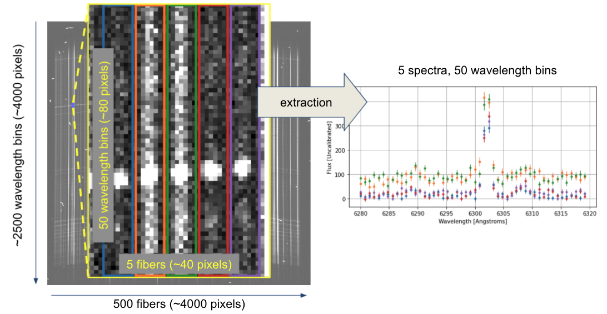
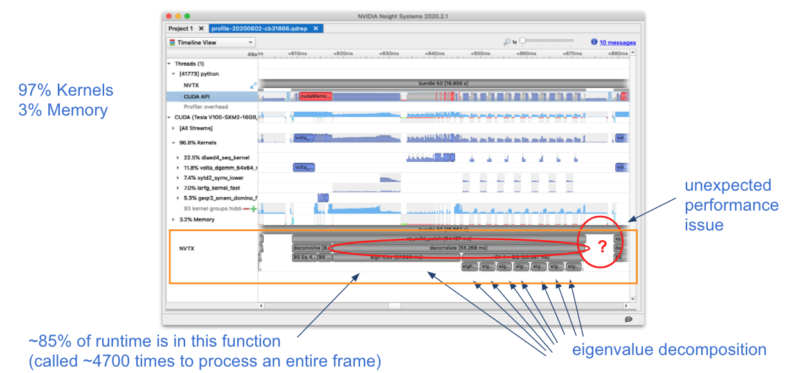
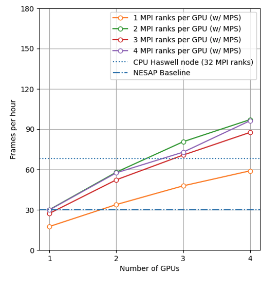
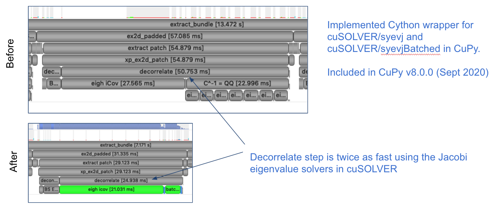
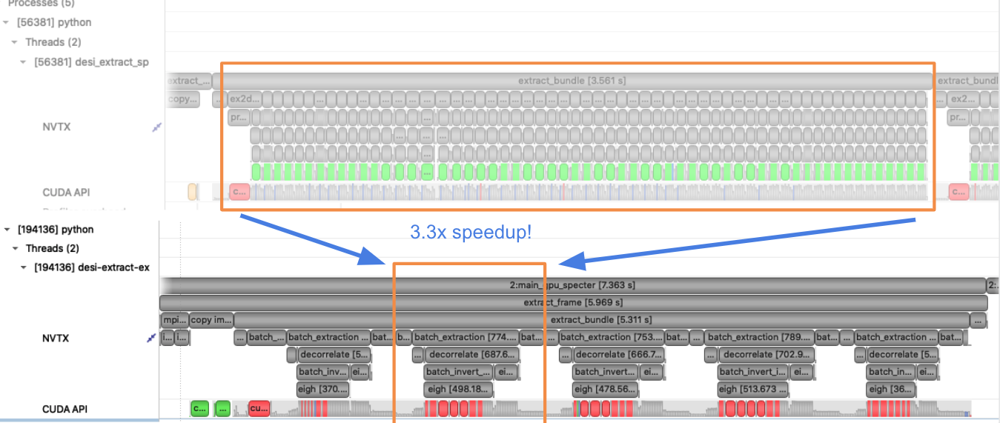
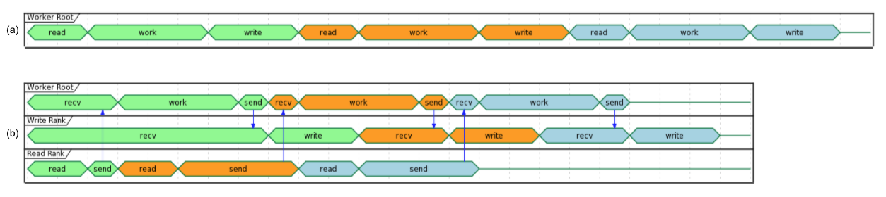
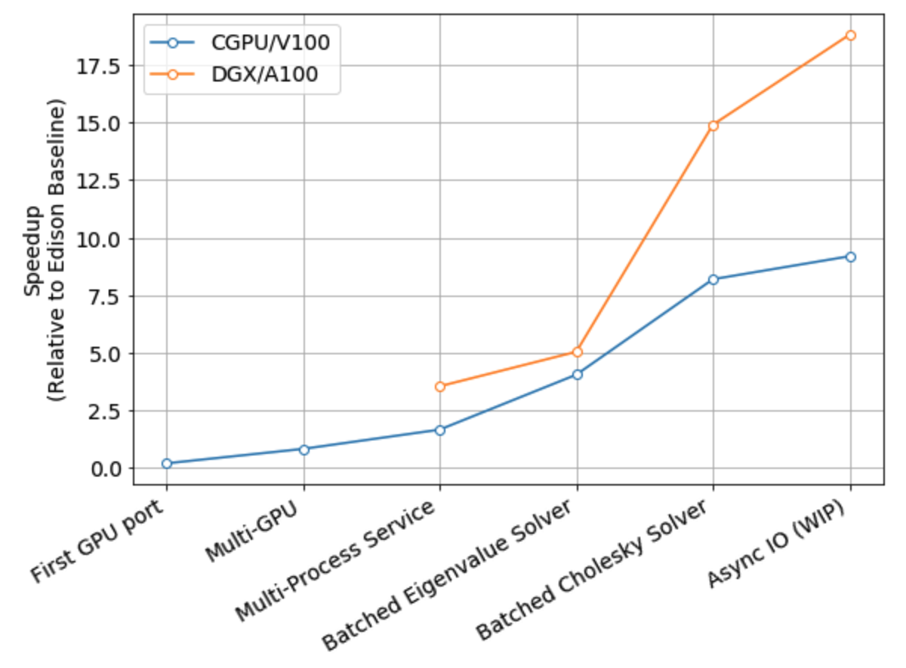

:author: Daniel Margala
:email: danielmargala@lbl.gov
:institution: Lawrence Berkeley National Laboratory: National Energy Scientific Research and Computing Center
:corresponding:

:author: Laurie Stephey
:email: lastephey@lbl.gov
:institution: Lawrence Berkeley National Laboratory: National Energy Scientific Research and Computing Center

:author: Rollin Thomas
:email: rcthomas@lbl.gov
:institution: Lawrence Berkeley National Laboratory: National Energy Scientific Research and Computing Center

:author: Stephen Bailey
:email: sbailey@lbl.gov
:institution: Lawrence Berkeley National Laboratory: Physics Division

:bibliography: references

----------------------------------------------------------------------------------------
Accelerating Spectroscopic Data Processing Using Python and GPUs on NERSC Supercomputers
----------------------------------------------------------------------------------------

.. class:: abstract

   The Dark Energy Spectroscopic Instrument (DESI) will create the most detailed 3D map of the Universe to date by measuring redshifts in light spectra of over 30 million galaxies. 
   The extraction of 1D spectra from 2D spectrograph traces in the instrument output is one of the main computational bottlenecks of DESI data processing pipeline, which is predominantly implemented in Python. 
   The new Perlmutter supercomputer system at the National Energy Scientific Research and Computing Center (NERSC) will feature over 6,000 NVIDIA A100 GPUs across 1,500 nodes. 
   The new heterogenous CPU-GPU computing capability at NERSC opens the door for improved performance for science applications that are able to leverage the high-throughput computation enabled by GPUs.
   We have ported the DESI spectral extraction code to run on GPU devices to achieve a 20x improvement in per-node throughput compared to the current state of the art on the CPU-only Haswell partition of the Cori supercomputer system at NERSC.

.. class:: keywords

   Python, HPC, GPU, CUDA, MPI, CuPy, Numba, mpi4py, NumPy, SciPy, Astronomy, Spectroscopy

Introduction
------------

The Dark Energy Spectroscopic Instrument (DESI) experiment is a cosmological redshift survey. 
The survey will create the most detailed 3D map of the Universe to date, using position and redshift information from over 30 million galaxies. 
During operation, around 1000 CCD frames per night (30 per exposure) are read out from the instrument and transferred to NERSC for processing and analysis. 
The data is processed in near-real time in order to monitor survey progress and update the observing schedule for the following night. 
Periodically, a complete reprocessing of all data observed to-date is performed and made available as data release to the collaboration and eventually released to the public.

The DESI spectral extraction code is an implementation of the *spectro-perfectionism* algorithm, described in :cite:`BS10`.
The process of extracting 1D spectra from 2D spectrograph traces for all 500 targets per frame is computationally intensive and has been the primary focus of optimization efforts for several years (:cite:`osti_1412701`, :cite:`stephey`).
The DESI data processing pipeline is predominantly implemented using the Python programming language.
A strict requirement from the DESI data processing team is to keep the code implementation in Python.

The existing state of the art implementation utilizes a divide and conquer framework to make *spectro-perfectionism* algorithm tractable on existing computing hardware, see Figure :ref:`patch-extraction`.
The code utilizes the Message Passing Interface (MPI) via `mpi4py` to exploit both multi-core and multi-node parallelism (:cite:`DALCIN20051108`).
The application uses multidimensional array data structures provided by NumPy along with several linear algebra and special functions from the NumPy and SciPy libraries (:cite:`harris2020array`, :cite:`2020SciPy-NMeth`).
Several expensive kernels are implemented using Numba just-in-time compilation (:cite:`numba`).
The application is parallelized by dividing an image into thousands of small patches, performing the extraction on each individual patch in parallel, and stitching the result back together.

   The goal of the algorithm is to extract spectra from raw telescope output.
   Here we show the raw telescope output for a single "patch" and the corresponding pieces of the extracted spectra.
   The divide and conquer strategy used in this application divides an image into roughly 5,000 patches which can be extracted in parallel.
   The extracted pieces are then stiched back together and written to disk for further processing by the data pipeline.  
   :label:`patch-extraction`

This has worked well for CPU-only computing architectures such as the Haswell (Intel Xeon Processor E5-2698 v3) and Knights Landing (Intel Xeon Phi Processor 7250) partitions on the Cori [#]_ supercomputer at NERSC.
The new Perlmutter [#]_ supercomputer system at NERSC will have a partition of GPU accelerated nodes (AMD EPYC 7763, NVIDIA A100 GPU).
The goal of this work is to speed up the DESI experiment's data processing pipeline by porting the spectroscopic extraction step to run on the GPU partition of the Perlmutter supercomputer at NERSC.

.. [#] https://docs.nersc.gov/systems/cori/
.. [#] https://docs.nersc.gov/systems/perlmutter/

In early 2020, the team began reimplementing the existing extraction code [#]_ by reconsidering the problem.
The DESI spectral extraction problem is fundamentally an image processing problem which historically have been well-suited to GPUs.
However, in many places, the existing CPU version of the code used loops and branching logic rather than vector or matrix-based operations.
We performed a significant refactor switching key parts of the analysis to matrix-based operations which would be well suited to massive GPU parallelism.
Additionally, the refactor enabled more flexible task partitioning and improved node utilization.
From this refactor alone, still running only on the CPU, we obtained 1.6x speedup compared to the original CPU version.
From here, we began our GPU implementation.

We describe our iterative approach to porting and optimizing the application using NVIDIA Nsight Systems for performance analysis. 
We use a combination of CuPy and JIT-compiled CUDA kernels via Numba for GPU-acceleration. 
In order to maximize use of resources (both CPUs and GPUs), we use MPI via mpi4py and CUDA Multi-Process Service.
We discuss the lessons we learned during the course of this work that will help guide future efforts of the team and inform other science teams looking to leverage GPU-acceleration in their Python-based data processing applications.
We project that new extraction code [#]_ running on Perlmutter will achieve a 20x improvement in per-node throughput compared to the current production throughput on Cori Haswell.

.. [#] https://github.com/desihub/specter
.. [#] https://github.com/desihub/gpu_specter

GPU Implementation
------------------

The existing CPU implementation uses NumPy and SciPy (BLAS and LAPACK) for linear algebra, numba just-in-time compilation for specialized kernels, and mpi4py (MPI) for multi-core and multi-node scaling.
The code is parallelized to run on multiple CPU cores and nodes using a Single Program Multiple Data (SPMD) programming pattern enabled by MPI through mpi4py. 
In order to leverage the compute capabilities of GPU devices and adhere to the DESI Python requirement, we decided to use a GPU-accelerated Python library.
The main considerations for heterogeneous CPU-GPU computing are to minimize data movement between the CPU host and the GPU device and to feed the GPU large chunks of data that can be processed in parallel.
Keeping those considerations in mind, we left rest of the GPU programming details to external libraries.
There are many rapidly maturing Python libraries that allow users to write code that will run on GPU hardware, such as CuPy, pyCUDA, pytorch, JAX, and Numba CUDA.
We chose to use CuPy :cite:`cupy_learningsys2017` and Numba CUDA based on our ability to easily integrate their API with our existing code.

The initial GPU port was implemented by off-loading compute intensive steps of the extraction to the GPU using CuPy in place of NumPy and SciPy.
A few custom kernels were also re-implemented using Numba CUDA just-in-time compilation.
In many cases, we merely replaced an existing API call from `numpy`, `scipy`, or `numba.jit` with equivalent GPU-accelerated version from `cupy`, `cupyx.scipy`, or `numba.cuda.jit`.

The example code below demonstrates how we integrated `cupy`, `numba.cuda`, and the NumPy API:

.. code-block:: python

   import cupy
   import numba.cuda
   import numpy

   # CUDA kernel
   @numba.cuda.jit
   def _cuda_addone(x):
      i = numba.cuda.grid(1)
      if i < x.size:
         x[i] += 1

   # convenience wrapper with thread/block configuration
   def addone(x):
      # threads per block
      tpb = 32
      # blocks per grid
      bpg = (x.size + (tpb - 1)) // tpb
      _cuda_addone[bpg, tpb](x)

   # create array on device using cupy
   x = cupy.zeros(1000)
   # pass cupy ndarray to numba.cuda kernel
   addone(x)
   # Use numpy api with cupy ndarray
   total = numpy.sum(x)

We found that this interopability gave us a lot of flexibility to experiment during development. 
This achieved our initial goal porting the application to run on GPU hardware.

In the following sub-sections, we will discuss the major development milestones that lead to the improved performance of the application on GPUs.

Profiling the Code
~~~~~~~~~~~~~~~~~~

As discussed in previous work :cite:`stephey`, the team found a lot of value using profiling tools such as the `cProfile` Python module.
In this work, we used NVIDIA's NSight Systems to profile the application, identify bottlenecks in performance, and focus optimization efforts.
We added CUDA NVTX markers (using the CuPy API) to label regions of our code using descriptions that we would be able to easily identify in the profile viewer.
Without these labels, it sometimes difficult to decipher the names of low-level kernels that are called indirectly by our application.
We generally used a following command to generate profiles of our application: 

.. code-block:: bash

   nsys profile --sample=none \
                --trace=cuda,nvtx \
                --stats=true \
                <optional mpirun/srun> \
                <optional mps-wrapper> \
                app.py <app args>

The `nsys profile` launches and profiles our application.
Usuaully, we disable CPU sampling (`--sample=none`) and only trace CUDA and NVTX APIs (`--trace=cuda,nvtx`) to limit noise in the profile output.
When using MPI, we add the `mpirun` or equivalent (`srun` on NERSC systems) executable with its arguments following the arguments to the `nsys profile` segment of the command.
Similarily, when using the CUDA Multi-Process Service, we include a wrapper shell script that ensures the service is launches and shutdowns from a single process per node.
Finally, we specify the executable we wish to profile along with its arguments. 
The `--stats=true` option generates a set of useful summary statistics that is printed to stdout.
For a more detailed look at runtime performance, it is useful view the generated report file using the NSight Systems GUI. 

In Figure :ref:`nsight-early-profile`, we show a screenshot from an early profile of our GPU port using the NSight Systems GUI.
Nsight Systems provides a zoomable timeline view that allows us to visualize the performance of our code.
Using Nsight Systems, we can see the regions of our code that we marked with NVTX wrappers, as well as the lower level memory and kernel operations.
From this profile, we identified that approximately 85% of the runtime of the application is spent in the "decorrelate" step of the algorithm.
We also discovered an unexpected performance issue near the end patch extraction that we were able to solve using NumPy advanced array indexing.
The execution time of the `decorrelate` method is dominated by the eigenvalue decomposition operations. 
Profiling also helped identify unexpected performance issues in code regions we did not expect.

   A screenshot of a profile from an early GPU port using NVIDIA Nsight Systems. 
   :label:`nsight-early-profile`

Maximizing Node Utilization
~~~~~~~~~~~~~~~~~~~~~~~~~~~

We use multiple GPUs in our application via MPI (`mpi4py`). 
Since the CPU implementation is already using MPI, minimal refactor was required.
Each MPI rank is assigned to a single GPU.
Mapping MPI ranks to GPUs can be handled using slurm options (`--gpu-bind`), setting environment variables such as `CUDA_VISIBLE_DEVICES`, or at runtime using the CuPy API (`cupy.cuda.Device.use()`).
We oversubscribe ranks to GPUs to saturate GPU utilization using CUDA Multi-Process Service (MPS), which allows kernel and memcopy operations from different processes to overlap on the GPU.
Some care must be taken to avoid over allocating memory on each device.
We use a shell script wrapper to ensure the CUDA MPS control daemon is started by a single process on each node process server before launching our application. 
At NERSC, we use the following script which references environment variables set by the slurm workload manager.

.. code-block:: bash

   #!/bin/bash
   # Example mps-wrapper usage:  
   # > srun -n 2 -c 1 mps-wrapper command arg1 ...
   export CUDA_MPS_PIPE_DIRECTORY=/tmp/nvidia-mps
   export CUDA_MPS_LOG_DIRECTORY=/tmp/nvidia-log
   # Launch MPS from a single rank per node
   if [ $SLURM_LOCALID -eq 0 ]; then
      nvidia-cuda-mps-control -d
   fi
   # Wait for MPS to start
   sleep 5
   # Run the command
   "$@"
   # Quit MPS control daemon before exiting
   if [ $SLURM_LOCALID -eq 0 ]; then
      echo quit | nvidia-cuda-mps-control
   fi

In Figure :ref:`multi-gpu-mpi-mps`, we show how performance scales with the number of GPUs used and the number of MPI ranks per GPU.
The solid colored lines indicate the improved performance as we increase the number of GPU used.
Different colors represent varying degrees of the number of MPI ranks per GPU.
In this case, using 2 MPI ranks per GPU seems to saturate performance and we observe a slight degradation in performance oversubscribing further.
The measurements for the analysis shown here were performed on test node at NERSC using 4 NVIDIA V100 GPUs.
The Perlmutter system will use NVIDIA A100 GPUs which have more cores and significantly more memory than the V100s.
A similar analysis showed that we could go up to 5 MPI ranks per GPU on a test system with A100s.
We note that while this configuration maximizes the expected GPU utilization on a Perlmutter with 4 A100 GPUs, the 64-core AMD Milan CPU is only at 31.25% utilization with 20 MPI ranks.
Later on, we will discuss one way to utilize a few of these spare CPU cores.

   Performance scaling with multiple NVIDIA V100 GPUs.
   The solid colored lines indicate the improved performance as we increase the number of GPU used.
   Different colors represent varying degrees of the number of MPI ranks per GPU as indicated in the legend.
   The horizontal blue lines representing CPU-only measurements were approximate and only used for reference.
   :label:`multi-gpu-mpi-mps`

Batching GPU Operations
~~~~~~~~~~~~~~~~~~~~~~~

Earlier, we observed that eigenvalue decomposition accounted for a significant portion of the execution time of our program.
In the *spectro-perfectionism* algorithm, an eigenvalue decomposition is performed on the inverse covariance matrix which is then used to calculate the covariance matrix followed by several smaller eigenvalue decompositions that are performaned on the diagonal blocks of the covariance matrix.
Since the small eigenvalue decompositions are performed on independent sub-matrices, we tried "batching" (or "stacking") the operations.
We noted the existance of a `syevjBatched` function in CUDA cuSOLVER library which could perform eigenvalue decomposition on batches of input matrices using a Jacobi eigenvalue solver.
This was not immediately available in Python via CuPy but we were able to implement Cython wrappers in CuPy using similar wrappers already present in CuPy as a guide.
We submitted our implementation as a pull-request to the CuPy project on GitHub [#cupy-3488]_.

.. [#cupy-3488] https://github.com/cupy/cupy/pull/3488

In Figure :ref:`nsight-batch-eig`, we show profile snippets of that demonstate the improved performance using the Jacobi eigenvalue solvers from the cuSOLVER library.
The execution time of the "decorrelate" method improved by a factor of two.

   The "decorrelate" is twice as fast using the Jacobi eigenvalue solvers from the cuSOLVER library.
   :label:`nsight-batch-eig`

This inspired us to look for opportunities to use batched operations in our program.
We found a significant speedup by refactoring the application to extract spectra from multiple patches in a subbundle using batched array and linear algebra operations.
This allowed us to leverage batched Cholesky decomposition and solver operations on the GPU (`potrfBatched` and `potrsBatched` in the cuSOLVER library).
We contributed `cupyx.linalg.posv` (named after LAPACK's xPOSV routines) to solve the linear equations `A x = b` via Cholesky factorization of A, where A is a real symmetric or complex Hermitian positive-definite matrix [#cupy-4291]_.
Our implementation was essentially a generalization of an existing method `cupyx.linalg.invh`, which was implemented as the special case where the right-hand side of the equation is the Identity matrix.
In Figure :ref:`nsight-batch-cholesky`, we compare the profile timelines before and after implementing batch Cholesky decomposition and solver operations. 
The runtime for extraction over an entire subbundle of 5 spectra is 3.3 times faster using batched Cholesky operations.

.. [#cupy-4291] https://github.com/cupy/cupy/pull/4291

   Profile demonstrating speedup from batch Cholesky solve.
   :label:`nsight-batch-cholesky`

Overlapping Compute and IO
~~~~~~~~~~~~~~~~~~~~~~~~~~

At this point, we observed that reading the input data and writing the output results accounted for approximately 25%-30% of the total wall time to process 30 frames from a single exposure in series using a single node.
Using spare CPU cores, we were able to hide most of this IO latency and better utilize the resources available on a node.
When there are multiple frames processed per node, the write and read steps between successive frames can be interleaved with computation.

In Figure :ref:`interleave-io`, we demonstrate how a subset of the MPI ranks communicate to achieve this functionality.  
At a high level, the processing of a single frame can be broken down into 3 distinct phases: read, work, and write. 
The frames are processed in series, frame one (green) is processed, then frame two (orange), and finally frame (three).
Panel a shows the non-overlapping sequence of steps to process 3 frames in series.
Panel b shows how the overlapping of IO and computation is orchestrated using two additional MPI ranks, dedicated reader and writer ranks.
At the start of the program, the reader rank reads the input data while all worker ranks wait. 
The reader rank performs some initial preprocessing and sends the data to the root computation rank.
Once the data has been sent, the reader rank begins reading the next frame.
After the worker root receives the input data, it performs the work which can involve broadcasting the data to additional worker ranks in the computation group (not shown in the diagram).
The result on the root computation rank is then sent to a specially designated writer rank.
The computation group ranks move on to processing the next frame which has already been read from disk by a specially designated read rank.
Meanwhile, the writer rank finishes writing the previous result and is now waiting to receive the next result.

Overlapping compute and IO in this manner effectively hides the intermediate read and write operations between frames processed serially on a node, reducing the wall time by over 60 seconds and providing a 1.34x speedup in per-node throughput.

   Overlapping IO and compute. 
   In panel a, we show an example timeline of the root worker MPI rank performing the read, work, and write steps to process 3 frames.
   In panel b, we show an example timeline of the root worker, read, and write MPI ranks performing the read, work, and write steps along with their inter-communication to process 3 frames.

   :label:`interleave-io`

Results
-------

Throughout development, we performed a standard benchmark after major feature implementations and to track progress over time. 
For DESI, a useful and practical benchmark of performance is the number of frames that can be processed per node-time on NERSC systems.
Specifically, we use the throughput measure *frames-per-node-hour* (FPNH) as the figure of merit (FoM) for this application.
The benchmark uses data from a single exposure containing 30 CCD frames.
The baseline FoM for this application on the Edison and Cori supercomputers is 27.89 FPNH and 40.15 FPNH, respectively.
Since the Perlmutter system is not available at the time of writing, we estimate the expected performance by running the benchmark on an NVIDIA DGX-A100.
A Perlmutter GPU node will have the same NVIDIA A100 GPUs as the DGX system and the newer AMD Milan CPU compared to the AMD Rome CPU on DGX.
The projected FoM for this application on the new Perlmutter supercomputer is 575.25 FPNH, a roughly 20x improvement over the Edison baseline.
A summary of benchmark results by major feature milestone is shown in Figure :ref:`fom-progress` and listed in Table :ref:`benchmarktable`.

   DESI Figure-of-Merit progress by major feature milestone. 
   :label:`fom-progress`

.. table:: Summary of benchmark results by major feature milestone.  
   :label:`benchmarktable`
   :class: w

   +--------------------+---------+--------------------+-------+---------------+--------------------+----------------+--------+
   | Note               | System  | Arch (CPU/GPU)     | Nodes | GPUs Per Node | MPI Ranks Per Node | Walltime (sec) | FPNH   |
   +====================+=========+====================+=======+===============+====================+================+========+
   | baseline           | Edison  | Xeon               | 25    | `-`           | 24                 |  154.9         |  27.89 |
   +                    +---------+--------------------+-------+---------------+--------------------+----------------+--------+
   |                    | Cori    | Haswell            | 19    | `-`           | 32                 |  141.6         |  40.15 |
   +--------------------+---------+--------------------+-------+---------------+--------------------+----------------+--------+
   | cpu-refactor       | Cori    | Haswell            | 2     | `-`           | 32                 |  830.2         |  65.05 |
   +--------------------+---------+--------------------+-------+---------------+--------------------+----------------+--------+
   | multi-gpu          | CoriGPU | Skylake/V100       | 2     | 4             | 8                  |  611.6         |  88.30 |
   +                    +---------+--------------------+-------+---------------+--------------------+----------------+--------+
   |                    | DGX     | Rome/A100          | 2     | 4             | 16                 |  526.8         | 102.51 |
   +--------------------+---------+--------------------+-------+---------------+--------------------+----------------+--------+
   | batch-eigh         | CoriGPU | Skylake/V100       | 2     | 4             | 8                  |  463.7         | 116.46 |
   +                    +---------+--------------------+-------+---------------+--------------------+----------------+--------+
   |                    | DGX     | Rome/A100          | 2     | 4             | 16                 |  372.7         | 144.90 |
   +--------------------+---------+--------------------+-------+---------------+--------------------+----------------+--------+
   | batch-subbundle    | CoriGPU | Skylake/V100       | 1     | 4             | 8                  |  458.9         | 235.36 |
   +                    +---------+--------------------+-------+---------------+--------------------+----------------+--------+
   |                    | DGX     | Rome/A100          | 1     | 4             | 20                 |  252.4         | 427.86 |
   +--------------------+---------+--------------------+-------+---------------+--------------------+----------------+--------+
   | interleave-io      | CoriGPU | Skylake/V100       | 1     | 4             | 10                 |  362.2         | 298.19 |
   +                    +---------+--------------------+-------+---------------+--------------------+----------------+--------+
   |                    | DGX     | Rome/A100          | 1     | 4             | 22                 |  187.7         | 575.25 |
   +--------------------+---------+--------------------+-------+---------------+--------------------+----------------+--------+

Conclusion
----------

The rising popularity of heterogenous CPU-GPU computing platforms offers an opportunity for improving the performance of science applications.
Adapting scientific Python applications to use GPU devices is relatively seamless due to the community of developers working on GPU-accelerated libraries that provide Numpy-compatible and SciPy-compataible APIs and, of course, the excellent foundation provided by NumPy and SciPy projects.
Profiling tools such as NVIDA Nsight Systems and the `cProfile` Python module often provide actionable insights to that can focus optimization efforts.
Refactoring code to expose parallelism and use more vectorized operations often improves performance on both CPU and GPU computing architectures.
For DESI, the transition to GPUs on Perlmutter will shorten the time it takes to process years worth of data from weeks to months down to hours to days.

Acknowledgements
----------------

This research used resources of the National Energy Research Scientific Computing Center (NERSC), a U.S. Department of Energy Office of Science User Facility located at Lawrence Berkeley National Laboratory, operated under Contract No. DE-AC02-05CH11231.

This research is supported by the Director, Office of Science, Office of High Energy Physics of the U.S. Department of Energy under Contract No. DE–AC02–05CH11231, and by the National Energy Research Scientific Computing Center, a DOE Office of Science User Facility under the same contract; additional support for DESI is provided by the U.S. National Science Foundation, Division of Astronomical Sciences under Contract No. AST-0950945 to the NSF’s National Optical-Infrared Astronomy Research Laboratory; the Science and Technologies Facilities Council of the United Kingdom; the Gordon and Betty Moore Foundation; the Heising-Simons Foundation; the French Alternative Energies and Atomic Energy Commission (CEA); the National Council of Science and Technology of Mexico; the Ministry of Economy of Spain, and by the DESI Member Institutions.  The authors are honored to be permitted to conduct astronomical research on Iolkam Du’ag (Kitt Peak), a mountain with particular significance to the Tohono O’odham Nation.

References
----------

