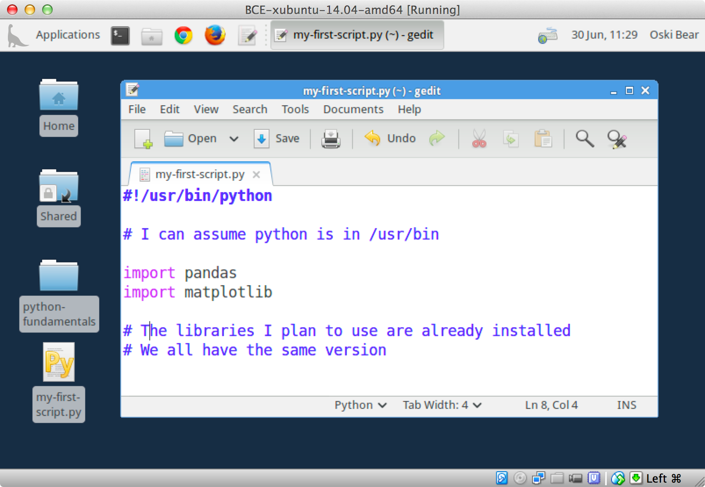

:author: Dav Clark
:email: davclark@berkeley.edu
:institution: UC Berkeley

:author: Aaron Culich
:email: aculich@berkeley.edu
:institution: UC Berkeley

:author: Brian Hamlin
:email: maplabs@light42.com
:institution: OSGeo California Chapter

:author: Ryan Lovett
:email: rylo@berkeley.edu
:institution: UC Berkeley

--------------------------------------------------------------------------------
BCE: Berkeley's Common Scientific Compute Environment for Research and Education
--------------------------------------------------------------------------------

.. class:: abstract

There are numerous barriers to the use of scientific computing toolsets. These
barriers are becoming more apparent as we
increasingly see mixing of different academic backgrounds, and compute ranging
from laptops to cloud platforms.
Members of the UC
Berkeley D-Lab, Statistical Computing Facility (SCF), and Berkeley Research
Computing (BRC) support such use-cases, and have developed
strategies that reduce the pain points that arise.
We begin by describing the variety of concrete training and research use-cases in which
our strategy might increase accessibility, productivity, reuse, and reproducibility.
We then introduce available tools for the “recipe-based” creation of compute
environments, attempting to demystify and provide a framework for thinking about
*DevOps* (along with explaining what “DevOps” means!).
As a counterpoint to novel DevOps tools, we'll also examine the success of
OSGeo-Live [OSGL]_ – a project that has
managed to obtain and manage developer contributions for a large number of geospatial projects.
This is enabled through the use of commonly
known skills like shell scripting, and is a model of complexity that can be
managed *without* these more recent DevOps tools.
Given our evaluation of a variety of technologies and
use-cases, we present our current strategy for constructing the Berkeley Common Environment [BCE]_, along with general recommendations for building environments for your own use-cases.

.. class:: keywords

   education, reproducibility, virtualization

Introduction
------------

Most readers of this paper will have dealt with the challenges of sharing
or using complex compute stacks – be that in the course of instruction,
collaboration, or shipping professional software. Here, we suggest an approach
for introducing novices to new software that reduces complexity by providing a
*standard reference* end-user environment. We'll discuss approaches to building
and using a common environment from any major OS, including an overview of the
tools available to make this easier. This approach can make it easier to provide
complete and robust instructions, and make it easier for students to follow
demos.

At a university, students often need to reproduce an environment required to run
the software for a course. Researchers need to reproduce their collaborator’s
workflows, or *anyone's* workflow in the name of reproducible research.
Recently, a new crop of tools-for-managing-tools has emerged under the *DevOps* banner – a contraction of software *development* and systems *operation* – with a general philosophy that instead of merely documenting systems operation tasks (configuration, deployment, maintenance, etc.), that developers can and should be scripting these tasks as much as possible.

In scientific computing the environment was commonly managed via
Makefiles & Unix-y hacks, or alternatively with monolithic software like Matlab.
More recently, centralized package management has provided curated tools that
work well together. But as more and more essential functionality is built out
across a variety of systems and languages, the value – and also the difficulty –
of coordinating multiple tools continues to increase. Whether we are producing
research results or web services, it is becoming increasingly essential to set
up new languages, libraries, databases, and more.

Documentation for complex software environments is stuck between two opposing
demands. To make things easier on novice users, documentation must explain
details relevant to
factors like different operating systems. Alternatively, to save time writing
and updating documentation, developers like to abstract over such details. A
DevOps approach to
“documenting” an application might consist of providing brief
descriptions of various install paths, along with *scripts* or “recipes” that
automate setup. This can be more *enjoyable* and certainly
easily and robustly reproducible for end-users – even if your setup instructions are wrong, they
will be reproducibly wrong!  As we’ll describe below, many readers will already
have tools and skills to do this, in the form of package management and basic
shell scripting. In other words, the primary shift that’s required is not one of
new tooling, as most developers already have the basic tooling they need.
Rather, the needed shift is one of *philosophy*.

We recognize that excellent tools have been developed to allow for
configuring *Python* environments, including environments that peacefully co-exist
on the same computer (e.g., pip, virtualenv, venv, conda, and buildout). These
specialized tools can increase our efficiency and provide ready access to a
broader range of options (such as different versions or compile-time settings).
But, we may also wish to coordinate the desktop
environment, including text editors, version control systems, and so on. As
such, these tools from the Python community to manage packages and run-time
environments cannot solve all of our problems. But any of them could be used
within the broader approach we’ll describe.

More recent configuration management tools are directed at solving this larger
problem of configuring nearly any aspect of a compute system, and yet other
DevOps tools provide efficient ways of managing environments across compute
contexts. Unfortunately, the variety and complexity of tools match the variety
and complexity of the problem space, and the target space for most of them was
*not* scientific computing. Thus, before discussing available tooling, we first
lay out a fuller set of concerns relevant to supporting scientific computing.

Issues for Scientific Computing
-------------------------------

The users of computational tools (and their collaborators) are often equipped
with a suite of informally learned foundational skills
(command line usage, knowledge of specific applications, etc.). Newcomers to a
field often lack these technical skills, which creates a boundary
between those who do and do not (and perhaps cannot) participate in that
discipline. However, we are entering an era where these boundaries are becoming
barriers to the research and educational mission of our university.
Our primary concern at present for the Berkeley Common Environment [BCE]_ is educational, particularly introductory computational science and statistics. However, where possible, we wish to build an environment that supports the broader set of uses we outline here.

For instruction
^^^^^^^^^^^^^^^

We are entering an era where experimental philosophers want to take courses in
advanced statistics and sociologists need best-of-breed text analysis. These
students are willing to work hard, and might sign up for the university courses
meant to provide these skills. But while the group that the course was
originally designed for (e.g., statistics or computer science students) have a
set of *assumed* skills that are necessary to succeed in the class, these skills
aren’t taught *anywhere* in the curriculum. In these cases, instructors may
spend a large amount of time addressing installation and setup issues – taking
time away from higher value instruction. Alternatively, students with divergent
backgrounds often drop these classes with the sense that they simply can’t
obtain these skills. This is not an equitable situation.

It’s difficult, however, to write instructions that would work for any potential
student. As mentioned above, students come to a course with many possible
environments (i.e., on their laptop or a server). But if a standardized
environment is provided, this task becomes much simpler. Written instructions
need fewer special cases, and illustrations can be essentially pixel-identical
to what students should be seeing on their screen.

Considering what expectations we’ll place on our audience, the most accessible
instructions will only require skills possessed by the broadest number of
people. In particular, many potential students are not yet fluent with notions
of package management, scripting, or even the basic idea of command-line
interfaces [SWC]_.
Thus, an accessible solution should require only GUI operations.
Once a common environment is installed, it becomes easier to scaffold students’
use of more challenging tools, as they will look and operate in a uniform way.
This “uniformity of the environment in which the user is clicking” cannot
be implemented without full control of the graphical environment, and systems
that configure only a self-contained set of libraries or computational tools
cannot do this. At the other end, it would be unreasonable to reconfigure
students’ desktop on their laptop. Thus, we need to set up an isolated, uniform
environment in it’s totality where instructions can provide essentially
pixel-identical guides to what the student will see on their own screen.

For scientific collaboration
^^^^^^^^^^^^^^^^^^^^^^^^^^^^

Across campus, we
encounter increasing numbers of researchers who wish to borrow techniques from
other researchers. These researchers often come from different domains with
different standards for tools. These would-be collaborators are increasingly
moving towards open-source tools – often developed in Python or R – which
already dramatically reduces financial barriers to collaboration.

The current situation, however, results in chaos, misery, and the gnashing of
teeth. It is common to encounter a researcher with three or more Python
distributions installed on their machine, and this user will have no idea how to
manage their command-line path, or which packages are installed where. In
particularly pathological cases, pip will install packages to an otherwise
inactive python distribution. These nascent scientific coders will have at
various points had a working system for a particular task, and often arrive at a
state in which nothing seems to work. A standard environment can eliminate this
confusion, and if needed, isolate environments that serve different projects.
Snapshots of working systems can provide even more resilience of the continued
functioning of already running projects. And it bears repeating that we don’t want to
disrupt the already productive environments that these researchers are using!

This issue becomes even more pronounced when researchers attempt to reproduce
published results without access to the expert who did the initial research. It
is unreasonable to expect any researcher to develop code along with instructions
on how to run that code on any potential environment. As with the instructional
case above, an easy way to do this is
to ensure others have access to the exact environment the original researcher
was working on, and again, “pixel-identical” instructions can be provided.

For administration
^^^^^^^^^^^^^^^^^^

At UC Berkeley, the D-Lab supports tools for courses and short trainings.
Similarly, the Statistical Computing Facility (SCF) supports an instructional
lab and “cloud” resources for some courses, and grad student assistants often
provide virtual machines for computer science courses (we’ll explain virtual
machines later). In each and every case, multiple technical challenges are
common. These technical glitches can delay or reduce the quality of instruction
as compared to an environment that students are already familiar with. It is
also a drag on the time of those supporting the course – time that could be
better directed at course content!

The more broadly a standard environment is adopted across campus, the more
familiar it will be to all students. Using infrastructure for collaborative
administration, technical glitches can be tracked or resolved by a community of
competent contributors, allowing course instructors to simply use a
well-polished end product, while reducing the complexity of instructions for
students to set up course-specific software. These environments can also be
tuned in ways that would be beyond the scope of what's worth doing for an
individual course – for example optimizations to increase the efficiency
of numeric computations or network bandwidth for remote desktops.

At this point that our use case starts to sound like the case in which product
developers are working together to deploy software on a production server, while
maintaining a useful development environment on their own machines, testing
servers, and so on. However, going forwards, we will suggest that novel tools
for building and managing compute environments be largely the domain of
specialized administrator-contributors to a common environment.
Technically skilled students, professors and researchers can continue to use the
tools they are familiar with, such as the Ubuntu package manager, pip, shell
scripts, and so on.

Technical challenges for a common environment
---------------------------------------------

Any common environment needs to provide a base of generally useful software, and
it should be clear how it was installed and configured. It should be equally
clear how one could set up additional software following the pattern of the
“recipe” for the environment, making it easy to share new software with
other users of the environment. More generally, we seek to address the following
challenges, though we have not definitely solved them! After each
problem, we list relevant tools, which will be described in full in a later
section.

Complex requirements
^^^^^^^^^^^^^^^^^^^^

The quote at the beginning of this paper illustrates a case in which
requirements are not explicitly stated and there is an assumption that all
collaborators know how to set up the necessary environment. The number of steps
or the time required is unknown, and regularly exceeds the time available. For
example, in the context of a 1.5 hour workshop or a class with only handful of
participants, if all cannot be set up within a fixed amount of time (typically
20 minutes at most) it will jeopardize successfully completing the workshop or
class materials and will discourage participation. All participants must be able
to successfully complete the installation with a fixed number of well-known
steps across all platforms within a fixed amount of time.

An additional difficulty arises when users are using different versions of the “same” software. For example, Git Bash on Windows lacks a ``man`` command.
We *cannot* control the base environment that users will have on their laptop or workstation, nor do we wish to! Thus, a useful environment should provide consistency and not depend on or interfere with users’ existing setup.

Relevant tools discussed below include Linux, virtual machines, and configuration management.

Going beyond the laptop
^^^^^^^^^^^^^^^^^^^^^^^

Laptops are widely used across the research and teaching space and in our
experience it is reasonable to assume most individuals will have at least a
64-bit laptop with 4GB of RAM.  Such a laptop is sufficient for many tasks,
however the algorithms or size of in-memory data may exceed the available memory
of this unit-of-compute and the participant may need to migrate to another
compute resource such as a powerful workstation with 128GB of RAM (even the most
advanced laptops typically max-out at 16GB at the time of this writing). Thus,
an environment should not be *restricted* to personal computers. Across systems,
a user should be able to to replicate the data processing, transformations, and
analysis steps they ran on their laptop in this new environment, but with better
performance.

Relevant tools discussed below include Packer and Docker.

Managing cost / maximizing value
^^^^^^^^^^^^^^^^^^^^^^^^^^^^^^^^

Imagine you have the grant money to buy a large workstation with lots of memory
and many processors, but you may only need that resource for a 1 to 2 week
period of time. Spending your money on a resource that remains unused 95% of the
time is a waste of your grant money! A homogeneous, familiar environment can
enable easier usage of the public cloud. A private cloud approach to managing
owned resources can also allow more researchers to get value out of those
resources. This is a critical enabler to allow us to serve less well-funded
researchers. In addition, more recent technologies can avoid exclusively
reserving system resources for a single environment.

Relevant tools discussed below are Packer, Docker (and LXC), and cloud-based virtual machines.

Existing Tools
--------------

As previously discussed, the problems outlined above are not unique to
scientific computing. Developers and administrators have produced a wide variety
of tools that make it easier to ensure consistent environments across all kinds
of infrastructure, ranging from a slice of your personal laptop, to a
dynamically provisioned slice of your hybrid public/private cloud. We cannot
cover the breadth of tooling available here, and so we will restrict ourselves
to focusing on those tools that we've found useful to automate the steps that
come before you start *doing science*. We’ll also discuss popular tools we’ve
found to add more complexity for our use-cases than they eliminate.

Table :ref:`tools` provides an overview from the perspective of the
DevOps engineer (i.e., contributor, maintainer, *you*, etc.).

.. table:: Recommended automation tools for *our* use-cases.
   :label:`tools`

   +------------------------------+-------------------------------------------+
   | **Goal**                     | **Relevant tools**                        |
   +------------------------------+-------------------------------------------+
   | Make Linux available as a VM | Local VM tool or public cloud             |
   | (regardless of host OS)      | (e.g., VirtualBox or Amazon EC2 – choose  |
   |                              | something supported by Packer)            |
   +------------------------------+-------------------------------------------+
   | Apply configurations in a    | Scripting, package managers (e.g.,        |
   | repeatable fashion           | apt, pip), configuration management       |
   |                              | (e.g., Ansible)                           |
   +------------------------------+-------------------------------------------+
   | Generate OS image for        |                                           |
   | multiple platforms           | Packer                                    |
   +------------------------------+-------------------------------------------+
   | Enable light-weight custom   |                                           |
   | environment (instead of      |                                           |
   | heavy-weight virtualization) | Docker, LXC                               |
   +------------------------------+-------------------------------------------+

Linux OS (Operating System)
^^^^^^^^^^^^^^^^^^^^^^^^^^^

A foundational tool for our approach is the Linux operating system. It is far
easier to standardize on a single OS instead of trying to manage cross-platform
support. It is relatively easy to install (or build) scientific code *and*
DevOps tools on
Linux. Moreover, Linux is not encumbered by licensing
constraints, which reduces barriers to collaboration, distribution, and reuse.
This choice of a single target OS is a primary reason to use *virtual machines*
(described below) because most people don't use Linux as their primary laptop OS.

Virtual machines (VMs)
^^^^^^^^^^^^^^^^^^^^^^

Virtual machine (VM) software enables running another OS (in BCE, Ubuntu server
with XFCE installed) as a *guest* OS inside the *host* OS – often Mac OS or
Windows. If a system is not virtualized (for example, the host OS), it is said
to be running on “bare metal.” For BCE, we have focused on VirtualBox and VMware
(the former of which is free) as they both run on Windows, Mac OS, *and* Linux.
Cloud providers like EC2 *only* provide virtual machines (there is no access to
“bare metal”), and similar concepts apply across local and cloud virtual
systems. A notable distinction is that web tools are often available for cloud
services, as opposed to a local GUI tool for systems like VirtualBox. Both kinds
of services provide command-line tools that can perform a superset of the tasks
possible with graphical interfaces.

For some users, a VM simply will not run locally, generally because they
have a very old operating system or computer. Thus, one should assume that any
VM solution will not work for some individuals and provide a fallback solution
(particularly for instructional environments) on a remote server. In this case,
remote desktop software may be necessary, or in the case of BCE, we are able to
enable all essential functionality via a web browser using IPython notebooks.
RStudio server would provide a similar approach to sidestepping the need for a
full remote desktop session.

One concern is that VMs reserve compute resources exclusively. Some approaches,
however, allow for more elastic usage of resources, most notably with LXC-like
solutions, discussed in the Docker section below. Another issue that can arise
is dealing with mappings between host and guest OS, which vary from system to
system – arguing for the utility of an abstraction layer for VM configuration
like Vagrant or Packer (discussed below).  This includes things like
port-mapping, shared files, enabling control of the display for a GUI vs.
enabling network routing for remote operation. These settings may also interact
with the way the guest OS is configured. Specifically with BCE we noticed that
some desktop environments interacted poorly with VirtualBox (for example, LXDE
did not handle resize events properly).

Note that if you are already running Linux on “bare metal”, it's still useful to run a
virtualized Linux guest OS. The BCE model relies on a well-known, curated set of
dependencies and default configurations. To ensure that it is possible to
consistently and reliably manage those elements no matter what flavor, variant,
or version of Linux you may be running as the host OS. However, we have
intentionally made choices that allow an informed developer set up a partial
environment that matches BCE. For example, python requirements are installed
with pip using a requirements file. This makes it easy to set up a virtualenv or
conda environment with those packages.

The easiest way to use a virtual machine is to use a pre-existing image – a file
that contains all relevant data and metadata about an environment (described
more fully at [images]_). It’s very easy to make modifications to an environment
and make a new image by taking a snapshot.  Note that while both local and
cloud-based VM systems often allow for easy snapshotting, it may be hard to
capture exactly how changes happened – especially changes and configuration that was
made “by hand.” So, snapshots are not necessarily
a good solution for reproducibility. You can also install an OS to a virtual
image in essentially the same manner you would install it to bare metal. The
primary difference is that you need to use specialized VM software to start this
process. For example, you can do this directly in VirtualBox simply by clicking
the “New” button, and you’ll be guided through all of the steps. There are more
automated ways, however, and we discuss these below.

Configuration management and automated image creation
^^^^^^^^^^^^^^^^^^^^^^^^^^^^^^^^^^^^^^^^^^^^^^^^^^^^^

Creating an image or environment is often called *provisioning*. The way this
was done in traditional systems operation was interactively, perhaps using a
hybrid of GUI, networked, and command-line tools. The DevOps philosophy
encourages that we accomplish as much as possible with scripts (ideally checked
into version control!). Most readers of this paper will already be able to
create a list of shell commands in a file and execute it as a script. So, if you
already know how to execute commands at the Bash prompt to configure Linux, this
can do *most* of the system setup for you.

Package managers in particular provide high-level commands to install and
configure packages. Currently, we use a combination of apt, pip, and shell
scripts. We also evaluated conda and found that it introduced additional
complexity. For example, it is still hard to install a list of pip requirements
with conda if some packages are not available for conda. Most package authors
currently make their packages available, however, for pip. Standard apt packages
were also adequate for things like databases, and ideal for the desktop
environment, where we could reap the benefit of the careful work that went into
the LTS Ubuntu distribution.

Steps like installing the base guest OS may be done manually. As we explored
managing the complexity and reducing the number of tools for the BCE development
process, one of the steps in the recipe was manual VM creation from an Ubuntu
installation ISO. It is straightforward to make a binary image from a snapshot
immediately after creating a base image, so this initial step could be done once
by a careful individual.

Ultimately, however, we decided it was better to automate installation from an
ISO, which is enabled by the Debian Installer [UDI]_, a system that allows a text
file to specify answers to the standard configuration prompts at install-time,
in addition to providing many more possibilities. You can find the BCE
configuration file for the debian-installer in the ``provisioning/http``
directory. Later, we’ll discuss how we’re coordinating all of the above using
Packer.

Ansible and related tools
^^^^^^^^^^^^^^^^^^^^^^^^^

Ansible is one of a number of recent DevOps tools for configuration management
[Ansible]_.
These tools enable automated management of customizations to the default status
and configuration of software. This replaces editing configuration files
directly by hand and provides checks and guarantees for applying changes that
would be hard to write as shell scripts alone (somewhat akin to a makefile).
This allows for a way to manage configuration complexity as an environment grows
in feature complexity. It may also allow an end-user to manage and reliably
apply personal customizations across multiple versions of an environment over
time.  For BCE development, we felt Ansible added the least complexity amongst
comparable tools. It may be used at build-time and also at run-time within the
guest OS, *or from any other location with SSH access to the target being
configured*.  The only requirements for the target are an SSH server and a
Python interpreter (yes, Ansible is Python-based). Ansible execution is also
more linear than some systems, which is a limitation, but also a simplification.

At this phase, however, the complexity of BCE doesn’t warrant contributors
learning even a simple configuration management tool. The maintainer of the
Software Carpentry VM, Matt Davis, has reported a similar observation. He has
used another tool, Puppet, to provision the Software Carpentry VM, but will
likely use shell scripts in the future. And as we will see below from the OSGeo
project, it is perhaps easier to coordinate certain kinds of complexity with
more commonly known tools like shell scripting.

While the syntax for each tool varies, the general concept is the same – one
describes the desired machine state with a tool-specific language. After
execution of this recipe – if you did a good job – the machine state is
guaranteed to be how you’ve requested it to be. Unfortunately, all DevOps tools
call their recipes something different. While the process certainly seems more
like baking than, say, coaching a football team, Ansible calls its scripts
“playbooks.” Alternate tools with similar functionality are Chef (which,
unsurprisingly *does* call it’s scripts “recipes”), Salt (also Python-based! and
uses “states”), and Puppet (which uses “manifests”). With any of these, a great
way to start learning would be to translate an existing configuration shell
script into one of these tools.

Packer
^^^^^^

Packer is used at build-time and enables creating identical machine images from
a single configuration targeting multiple machine image formats [Packer]_. It is
a relatively lightweight wrapper around many of the tools described above and
below. For example, from a single Ubuntu Linux installation configured using
shell scripts, we generate a BCE machine image in multiple formats including OVF
for VirtualBox and AMI for AWS EC2. The Packer script specifies the Ubuntu ISO
to install, automatically serves the Debian Installer configuration file over
HTTP, and configures the installed OS by copying files and running a shell
script. Packer can also readily use Ansible, Puppet, Chef, or Salt (and has a
plugin system if you want to use something more exotic). Images can be built for
many popular platforms, including a variety of local and cloud-based providers.

Packer made it possible for us to learn a relatively simple tool that executes
the entire image-creation process as a single logical operation. Moreover, end
users need have no knowledge of Packer. They can use the Amazon web console or
the VirtualBox GUI with no concerns for the complexity at build time.

It is worth noting that while indexes are available for a variety of images
(e.g, vagrantbox.es, the Docker index, and Amazon’s list of AMIs), we have
encountered surprisingly little effort to publish consistent environment that
allows one to readily migrate between platforms. This is, however, precisely the
goal of BCE, and it's enabled by Packer.

Vagrant
^^^^^^^

Vagrant is a run-time component that needs to be installed on the host OS of the
end user’s laptop [Vagrant]_. It can be considered a wrapper around
virtualization software that automates the process of configuring and starting,
e.g., VirtualBox running an image created via one of the above processes (for
example, with Packer). It eliminates the need to configure the virtualization
software by hand using the GUI interface, and more easily and generically than
command line tools provided by systems like VirtualBox or Amazon. It should be
noted that (like Packer) Vagrant does no work directly, but rather calls out to
those other platform-specific command-line tools.

The initial impetus for the BCE project came from a Vagrant-based
project called “jiffylab” [jl]_. With a single command, this project launches a
guest Linux OS in VirtualBox or on Amazon that provided both a shell and IPython
notebook through your native host web browser.  But while Vagrant is
conceptually very elegant (and cool), we are not currently using it for BCE.
In our evaluation, it introduced another piece of software, requiring
command-line usage before students were comfortable with it. Should a use-case
arise, however, it would be trivial to create a “vagrant box” (a Vagrant-tuned
virtual image) with our current approach using Packer. That said, other
“data-science” oriented VMs have chosen Vagrant as their method of distribution
[DSTb]_ [DSTk]_. Currently, Vagrant is most useful for experienced developers
to share environments with each other.

Docker
^^^^^^

Docker is a platform to build, distribute, and run images built on top of Linux
Containers (LXC) which provides a lightweight style of virtualization called
containerization [Docker]_. An important distinction of LXC-based containerization is that
the guest OS and the host OS both run the same underlying Linux kernel.

At run-time Docker adds to this containerization a collection of tools to manage
configuring and starting an instance in much the same way that Vagrant does for
a virtualization environment. Images are created using a simple build script
called a Dockerfile which usually runs a series of shell script commands which
might even invoke a configuration management system such as Ansible.

Another feature of the platform is the management and distribution of the images
built by docker, including incremental differences between images. Docker makes
it possible (albeit in a rudimentary way) to track changes to the binary image
in a manner similar to the way git allows you to track changes to source code.
This also includes the ability to efficiently maintain and distribute multiple
branches of binary images that may be derived from a common root.

Docker is also more than just a tool. It is a quickly growing community of open
source and industry developers with a rapidly evolving ecosystem of tools built
on core OS primitives. There is no clear set of best practices, and those that
emerge are not likely to fit all the use cases of the academic community without
us being involved in mapping the tools to our needs. However, providing better
access to hardware with containers is an important and active research topic for
performance [HPC]_.

Currently, Docker requires a Linux environment to host the Docker server. As
such, it clearly adds *additional* complexity on top of the requirement to
support a virtual machine. We also evaluated Docker as a way to potentially
provide around 30 students access to a VM on a reasonably powered server with
only 16GB of RAM. However, in our use-cases, we have full control of our Linux
compute environment and existing methods of isolating users with permissions was
less complex than using Docker, and of course allowed users to efficiently share
all available physical RAM. Moreover, the default method of deploying Docker (at
the time of evaluation) on personal computers was with Vagrant. This approach
would then *also* add the complexity of using Vagrant. However, recent
advances with *boot2docker* provide something akin to a VirtualBox-only,
Docker-specific replacement for Vagrant that eliminates *some* of this
complexity, though one still needs to grapple with the cognitive load of nested
virtual environments and tooling.

OSGeo-Live: A Successful Common Environment
-------------------------------------------

The OSGeo-Live VM is an example of a comprehensive geospatial compute
environment with a vibrant community process. It provides a successful example
of solving the problems of complex requirements described above – or in this case, perhaps more
properly called “dependency hell”. Notably, the project uses none of the recent DevOps
tools. OSGeo-Live is instead configured using simple and modular combinations of
Python, Perl and shell scripts, along with clear install conventions and
examples. Documentation is given high priority.

The VM project began around the same time as, and ultimately joined the Open
Source Geospatial Foundation (OSGeo), an international body modeled on the
Apache Foundation [2g]_. It started as a smaller open project that sought to
build an “easy to try and use” software environment for spatial data
applications. Initial efforts consisted of shell scripts to install core
geospatial packages. These examples provided guides to the projects that were
invited and ultimately contributed packages to the project. Many of these later
contributors spoke English as a second language, further highlighting the
importance of clear, working code examples. OSGeo-Live is not the only attempt
at building such an environment, but it is a highly successful one. More
than fifty open-source projects now contribute by actively maintaining and
improving their own install scripts, examples and documentation.

Tool Sets
^^^^^^^^^

OSGeo-Live itself is not a “Linux distribution” per se, rather
it relies on an apt-based ecosystem to handle
the heavy-lifting of system updates and upgrades. This is a win, as updates
are proven reliable over a very large Ubuntu community process, and
project participants can concentrate on adding value to its featured components.
Given the component architecture used to build the VM, individual software projects
can be installed as-needed on a generic apt-enabled base.

A key component of the success of the overall project has been the availability
of widely-known and reliable tools. Rather than require ``.deb`` installation
packages for each project, OSGeo-Live chose to use a simple install script
format, with ample examples. This choice proved crucial in the earliest stages,
as an outside open-source project evaluating participation in the Live ISO could
get started with fewer barriers to entry. Participating open-source projects
already had install scripts built for Linux, so they could almost immediately
adapt and iterate their own install scripts in a straightforward way, with the
flexibility to use the tools they were already using, such as shell, Perl, or
Python. Scripts may call package managers, and generally have few constraints
(apart from conventions like keeping recipes contained to a particular
directory). The project also maintains packages that support broader *kinds* of
packages, such as web-based applications. In this case, OSGeo-Live provides a
standard configuration for Apache, WSGI, and other components, along with a
standard layout for projects that rely on this core. As a result, there is very
little conflict among packages that share common resources. Some concerns, like
port number usage, have to be explicitly managed at a global level. But the
overhead of getting 50 projects to adopt a uniform configuration management tool
would likely be much greater.

All recipes are currently maintained in a common subversion repository, using
standardized asset hierarchies, including installation scripts [6g]_.
An OSGeo-Live specific report is maintained on the project trac ticketing system
[10g]_. And while OSGeo-Live primarily
targets a live/bootable ISO, the scripts that are used to build that ISO provide
a straightforward method for building OSGeo software in other contexts.

Community Awareness
^^^^^^^^^^^^^^^^^^^

The initial stages of the adoption of new technology include initial awareness
and trialability [4g]_. OSGeo-Live intentionally incorporates targeted outreach,
professional graphic design and “easy to try” structure to build participation
from both developers and end-users.  An original project design goal was to
provide tools to those doing geospatial fieldwork with limited resources around
the globe, and who often lack advanced programming and administration skills. In
other words, a community was built around tools that the desired members already
had.

Several years into the project, with a grant from the Australian
government, a professional-level documentation project was initiated for a
single-page overview and quick-start instructions for each application. Language
internationalization was rendered more efficient, specifically to support local
field work. Much later, a “percentage complete” graph for each human language
group was added, making translation into a sort of competitive game. This
translation has proven very successful.
The project has facilitated collaboration across developer communities. For
example, we have seen productive application of software developed by the U.S.
military to environmental applications [Army]_.

Steps to Contribute
^^^^^^^^^^^^^^^^^^^

All build scripts are organized in the open, in source control [6g]_. A new
contributors FAQ is maintained via wiki [7g]_ for software projects, and for
translation [8g]_. At it’s core, the OSGeo-Live project uses common skills
for system administration as opposed to more recent DevOps available, but it
very much adopts a DevOps *philosophy*. Contributors pay particular attention to
documenting each and every step, and standard approaches are encouraged across
the project. Gamification also played a role in spurring useful documentation
contributions. The low barrier to entry (allowing contributing projects to use
skills they likely already have), combined with guidelines to ensure
interoperability have led to OSGeo-Live becoming a standard way to evaluate and
install software in the geospatial community.

BCE: The Berkeley Common Environment
------------------------------------

The overarching, aspirational goal for the Berkeley Common Environment (BCE) is
to make it *easy* to do the “right” thing (or hard to do “wrong” things), where
“right” means you’ve managed to use someone else’s code in the manner that was
intended. In particular, it allows for targeted instructions that can assume all
features of BCE are present. BCE also aims to be stable, reliable, and reduce
complexity more than it increases it.

More prosaically, to be useful in the cases described above, BCE provides simple
things like a standard GUI text editor, and a command-line editor for when a GUI
is not available. BCE pre-configures applications with sensible defaults (e.g.,
spaces for tab-stops are set up for ``nano``). It also enables idiosyncratic
features on different VM platforms, for example, enabling simple access to
shared folders in VirtualBox and ensuring NFS functions properly on Amazon EC2.
The environment is also configured to make minimal demands on underlying
resources. For example, the BCE desktop is a solid color to minimize network
utilization for remote desktop sessions, and efficient numerics libraries are
configured.

BCE provides ready-made images for end-users, and the “recipe” for setting up
the image using Packer is maintained on GitHub. Lists of Python packages are
maintained in a separate requirements file, and all setup is done via a master
Bash script.  It is currently common for individuals to *only* distribute
scripts, which requires all potential users to install and configure the
relevant stack of DevOps tools. There are, however, free services for
distributing images for particular tools (e.g., the Docker index), and services
like Amazon can host AMIs for pennies a month. (For example, building on a free,
existing EBS-backed AMI, one need only save a snapshot, with charges only for
*changes* from the base AMI. One GB of extra tools onto a standard EBS-backed
Ubuntu server AMI, currently costs <$0.1 / GB-month to store.)
We strongly recommend
distributing a binary along with the recipe for any environment that includes
novices in its audience.

   The Berkeley Common Environment running in VirtualBox on OS X. The interface (and
   opportunities for confusion) are minimized. For example, all users have
   the same text editor available, and in particular, it’s easy to configure common
   gotchas like spaces for tabs. :label:`BCE-screenshot`

Using the BCE
^^^^^^^^^^^^^

You can see what BCE currently looks like (in a relatively small window) in
Figure :ref:`BCE-screenshot`. Throughout various iterations, students have found
working on a BCE VM to be confusing and counterproductive to being incredibly
useful and efficient – strong evidence that the details matter. It seems
critical both to provide a rationale for the use of VMs (i.e., explaining how a
standard, “pixel-identical” environment speeds instruction), and also a smooth
initial experience. Thus, we’ve worked to make BCE easy for students,
researchers, and instructors. Simple instructions are provided on our site for
things like opening a terminal (including a description of what the terminal
icon looks like). However, for an experienced programmer, the environment should
be obvious to navigate.

In our experience, some students will not be able to run the VM while others
have difficulty getting regular access to a stable network connection (though
fortunately, almost never both!). So, consistency across server and local
versions of the environment is critical to effectively support students with
either of these difficulties.

**If you’re using VirtualBox**, we require a 64-bit CPU with support for 64-bit
virtualization (note that some 32-bit *operating systems* will support this on
some hardware). A reasonable minimum of RAM is 4GB. The full instructions for
importing BCE from an OVA image into Virtualbox are available on our project
website [BCEVB]_. After starting the VM – a process that can be done entirely
with the mouse – a user will have all the software installed as part of BCE,
including IPython, RStudio, and useful packages.

**If you’re using BCE on EC2**, even a micro instance is sufficient for basic
tasks. Again, complete instructions are provided on the BCE website [BCEAMI]_.
In brief, you can find our image (AMI) in the public list. You can readily
launch in instance, and get instructions on connecting via the EC2 console.

Communicating with the maintainers of the BCE project
^^^^^^^^^^^^^^^^^^^^^^^^^^^^^^^^^^^^^^^^^^^^^^^^^^^^^

All development occurs in the open in our GitHub repository. This repository
currently also hosts the  project website, with links to all BCE
materials.
We provide channels for communication on bugs, desired features, and the like via the
repository and a mailing list (also linked from the project page), or if a user
is comfortable with it, via the GitHub issue tracker.
BCE will be clearly versioned for each semester, and versions will not be modified,
except for potential bugfix releases.

Contributing to the BCE project
^^^^^^^^^^^^^^^^^^^^^^^^^^^^^^^

BCE provides a fully scripted (thus, reproducible) workflow that creates the
standard VM/image. If the appropriate software is installed,
the recipe should run reliably.
However, you should generally not need to build the binary VM for BCE for a
given semester. If you wish to customize or extend BCE, the best way to do this
is by simply writing a shell script that will install requirements properly in
the context of BCE (for a complex example, see our ``bootstrap-bce.sh``
script [boot]_).
Much as with OSGeo-Live, we have chosen our approach to provisioning to be
relatively simple for users to understand.
It is our goal for instructors or domain experts to be able to easily extend the
recipe for building BCE VMs or images. If not, that’s a bug!

As described above, while we have experimented with Docker, Vagrant, and Ansible
for setting up the various BCE images (and evaluated even more tools), the only
foundationally useful tool for our current set of problems has been Packer.
Packer runs a shell script that uses standard installation mechanisms like
``pip`` and ``apt-get`` to complete the setup of our environment. Of central
importance, Packer does not require end-users to install or understand any of
the current crop of DevOps tools – it operates solely at build time. However,
should the need arise, Packer will readily target Vagrant, Docker, and many
other targets, and we are not opposed to adopting other tooling.

Conclusion
----------

If you use these recent DevOps tools, then realize that *you* are now at the
cutting edge of DevOps for the scientific
community. Your collaborators and students won't necessarily have needed
concepts, so extra care should be taken to make your tooling accessible. Where
appropriate, use tools that your collaborators already know –
shell, scripting, package management, etc.  That said, technologies that allow
efficient usage of available hardware stand to provide substantial savings, and
potential for re-use by researchers with less direct access to capital (e.g.,
Docker, or demand aggregation of cloud VM providers).

So, let’s be intentional about creating and using environments that are broadly
accessible.  Let’s follow the DevOps philosophy of being transparent and
explicit about our choices and assumptions.  That *doesn’t* have to mean “using
the latest tools”
– a simple text file or even a PDF can provide ample explanation that a human
can understand along with a simple reference script (in shell or Python).  In
this paper, we’ve made fairly strong recommendations based
on what we are actually using (we are eating our own dogfood!).  Central to our
process has been a willingness to adopt, adapt, change, and throw stuff out. As
we’ve seen with OSGeo-Live, such a process can allow many projects to
collaborate on a standard reference so we can focus on the interesting bits of
developing code and *doing science*.

BCE currently provides a standard reference, built with an easily understood
recipe, that eliminates the complexity of describing how to run a large variety
of projects across a wide variety of platforms. We can now target our
instruction to a single platform.  The environment is easy to deploy, and
should provide identical results across any base platform – if this is
not the case, it’s a bug! This environment is already available on VirtualBox
and Amazon EC2, and is straightforward to provision for other environments. We
welcome loose collaboration in the form of forks that are specialized for other
institutions, and eventually, perhaps standardizing across institutions.

References
----------

.. [BCE] http://collaboratool.berkeley.edu
.. [OSGL] http://www.osgeo.org/
.. [BCEVB] http://collaboratool.berkeley.edu/using-virtualbox.html
.. [BCEAMI] http://collaboratool.berkeley.edu/using-ec2.html
.. [Ubuntu] https://help.ubuntu.com/14.04/serverguide/serverguide.pdf
.. [images] http://docs.openstack.org/image-guide/content/ch_introduction.html
.. [Ansible] http://www.ansible.com/about
.. [Packer] http://www.packer.io/intro
.. [Vagrant] http://www.vagrantup.com/about.html
.. [Docker] http://www.docker.com/whatisdocker/
.. [HPC] M. G. Xavier, M. V. Neves, F. D. Rossi, T. C. Ferreto, T. Lange, and C. A. De
     Rose, “Performance evaluation of container-based virtualization for high performance
     computing environments,” in *the 21st Euromicro International Conference on Parallel,
     Distributed and Network-Based Processing (PDP)*, 2013, pp. 233–240.
.. [SWC] G Wilson, “Software Carpentry: lessons learned,” *F1000Research*, 2014.
.. [jl] http://github.com/ptone/jiffylab
.. [DSTb] http://datasciencetoolbox.org/
.. [DSTk] http://www.datasciencetoolkit.org/
.. [UDI] https://help.ubuntu.com/14.04/installation-guide/i386/apb.html
.. [2g]  http://www.osgeo.org/content/foundation/about.html
.. [4g] E M. Rogers, *Diffusion of Innovations*, 5th ed. New York: Free Press, 2003.
.. [6g]  http://svn.osgeo.org/osgeo/livedvd
.. [7g]  http://wiki.osgeo.org/wiki/Live_GIS_Add_Project
.. [8g]  http://wiki.osgeo.org/wiki/Live_GIS_Translate
.. [10g] http://trac.osgeo.org/osgeo/report/10
.. [Army] Army Corps of Engineers, “Army Corps of Engineers Wetlands Regulatory
     program,” presented at the FOSS4G, 2007.
.. [boot] https://github.com/dlab-berkeley/collaboratool/blob/master/provisioning/bootstrap-bce.sh

