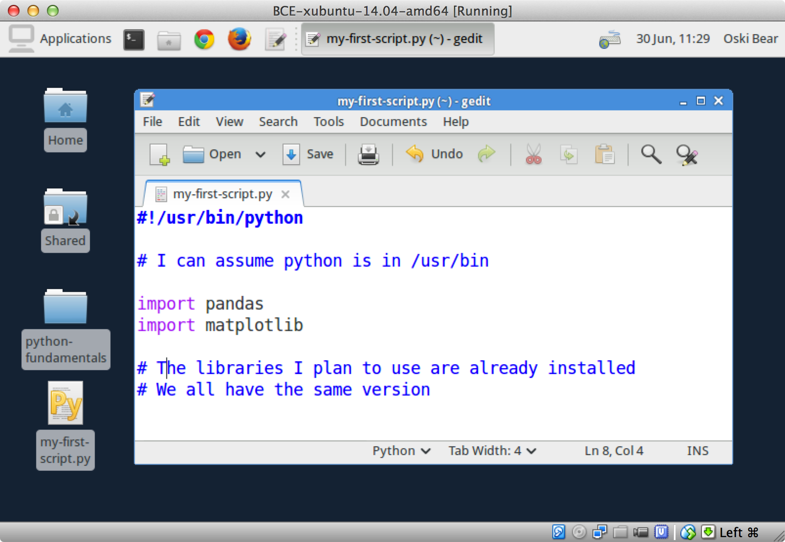

:author: Dav Clark
:email: davclark@berkeley.edu
:institution: UC Berkeley

:author: Aaron Culich
:email: aculich@berkeley.edu
:institution: UC Berkeley

:author: Brian Hamlin
:email: maplabs@light42.com
:institution: OSGeo California Chapter

:author: Ryan Lovett
:email: rylo@berkeley.edu
:institution: UC Berkeley

--------------------------------------------------------------------------------
BCE: Berkeley's Common Scientific Compute Environment for Research and Education
--------------------------------------------------------------------------------

.. class:: abstract

It is increasingly common for users of various levels of technical skill to run scientific codes from a variety of sources (most notably from different academic backgrounds) across a range of machines (e.g. laptop, workstation, high-performance cluster, or cloud platform). 
Members of the UC
Berkeley D-Lab, Statistical Computing Facility (SCF), and Berkeley Research
Computing (BRC) have been supporting such use-cases, and have developed strategies that reduce the pain points that arise.
We begin by describing the variety of concrete training and research use-cases in which
our strategy might increase productivity, reuse, and reproducibility.
We then introduce available tools for the “recipe-based” creation of compute environments, attempting to demystify and provide a framework for thinking about *DevOps* tools (along with explaining what “DevOps” means!). These are somewhat widely used, but in an ad hoc manner.
We proceed to provide a brief review of existing projects, and how they are using these technologies.
In particular, we examine the success of [OSGeo-Live]_ in providing a standard environment for spatial data projects, both for script and software development, and for researcher evaluation of new tools.
Given our thorough evaluation of a breadth of virtualization technologies and
use-cases, we present our current strategy for constructing the Berkeley Common Environment [BCE]_, along with general recommendations for building environments for your own use-cases.

.. class:: keywords

   education, reproducibility, virtualization

Introduction
------------

  btw- I have never setup for this LaTeX workflow, so the make_paper.sh
  fails for me miserably. Therefore, no advanced formatting and very probably
  more basic errors right now.. but, the prose is coming along

  --One of the Authors

Every author of a paper in a SciPy proceedings has to deal with the tooling required to test that their paper is building and displays properly. This is not a profoundly difficult problem, but it serves to illustrate the point. In particular, documenting the “solution” to building SciPy papers is unnecessarily complex due to the variety of potential environments (e.g., Mac, Windows, \*nix), and even methods that authors might have used to set up Python on their machine (e.g., Anaconda, Canopy, python.org).

This problem is quite general. In a university setting, students need to sufficiently reproduce an environment required to run the software a professor has chosen for a course. Collaborating researchers need to reproduce each other’s workflows, and ideally anyone should to run the code used for a set of research results. 
Prosaic examples include the toolchain required to use nbconvert (very much parallel to the above). Or, for example, ensuring that a properly configured database is available.
Developers in industry similarly need to ensure code they develop on their laptop or workstation will work in a specified environment – for example on production servers. This complexity was once managed via the use of monolithic software, but as more and more essential functionality is built out across a variety of systems and languages, the value of spanning multiple tools continues to increase. Whether we are producing research results or web services, it is becoming increasingly essential to set up new languages, libraries, databases, and more. As such, a large number of tools have been developed and widely adopted to manage this complexity.

A number of solutions have also been developed to allow for multiple *Python* environments, including environments that peacefully co-exist on the same computer (e.g., virtualenv, venv, conda, buildout), but our compute environment often pulls in non-trivial tooling outside of Python (though tools like conda *can* pull in non-python tooling). While these tools from the Python community cannot solve all of the problems we describe below, there is no reason that any of them could not be used within the broader approach we’ll describe. Indeed, a tool like conda could ultimately perform *most* of the work – though as we’ll see, it should likely never be able to perform all of that work.

The aforementioned “tools from industry” – generally referred to as *DevOps* tools – are directed at solving this larger problem. Unfortunately, the variety and complexity of tools match the variety and complexity of the problem space, and the target space for most of them was *not* scientific computing. Thus, before discussing available tooling, we first lay out a set of issues relevant to supporting scientific computing.

Issues
------

Historically, the users of computational tools (and their collaborators) were equipped with a suite of largely self-taught or informally learned foundational skills (command line usage, basic software architecture, etc.). The tooling and technical skills employed by members of a discipline provide notable boundaries between those who do and do not (and perhaps cannot) participate in that discipline. However, we are entering an era where these boundaries are becoming barriers to the mission of our university (and presumably others).

For the purposes of the Berkeley Common Environment [BCE]_, there are three broad use-cases. Instructional use requires simultaneous support of *teaching* and *learning*. *Collaboration* introduces difficulties where individuals from different backgrounds have disjoint tooling and skill-sets. A further difficulty arises with the general problem of “collaborating” with scientists around the world that may be interested in *re-using* our code, or *reproducing* our research. Finally, it’s important to consider the demands that might be placed on the individuals actually *developing* and *supporting* the common environment.

Our primary concern at present for BCE is educational, particularly introductory computational science and statistics. However, where possible, we wish to build an environment that supports the broader set of uses we outline here.

For instruction
^^^^^^^^^^^^^^^

We are entering an era where experimental philosophers want to take serious courses in computationally demanding statistics, sociologists have a need for best-of-breed text analysis, and psychologists wish to pick up scalable machine learning techniques. These students are often willing to work hard, and might sign up for the university courses meant to provide these skills. But while the group that the course was originally designed for (e.g., statistics or computer science students) have a set of *assumed* skills that are necessary to succeed in the class, these skills aren’t taught *anywhere* in the curriculum. In these cases, instructors may spend a large amount of time addressing installation and setup issues – taking time away from higher value instruction. Alternatively, students with divergent backgrounds often drop these classes with the sense that they simply can’t obtain these skills. This is not an equitable situation.

Given current standards for university courses, it’s difficult to write instructions that would work for any potential student. As mentioned above, students come to a course with many possible environments (i.e., on their laptop or a server). But if a standardized environment is provided, this task becomes much simpler. Written instructions need fewer special cases, and illustrations can be essentially pixel-identical to what students should be seeing on their screen.

Given that we’re writing instructions on how to use course-relevant tools, we can consider what demands we’ll place on our audience. The most accessible instructions will only require skills possessed by the broadest number of people. In particular, we suggest that many potential students are not yet fluent with notions of package management, scripting, or even the basic idea of command-line interfaces [SWC]_. Switching between a command-line shell to enter some commands, and a Python interpreter for others can be incredibly confusing – many students simply don’t know where to look for the critical cues. Below, we adopt a bootstrapping procedure that provides students with a common environment, while only assuming those skills that are essentially universal to current computer users. 

For a virtual machine on the student’s own computer, the student need only use the GUI installer for VirtualBox, and then use the menu system in VirtualBox to install the specific environment from a binary image. For a remote desktop session, the exact same environment can be provisioned by the instructor, and depending on the students, they can use SSH or a remote desktop session to access the environment.

Note that this “uniformity of the environment in which the user is clicking” cannot be implemented without full control of something like a VM or a remote server. The advantage is clear: instructions can provide essentially pixel-identical guides to what the student will see on their own screen. Tools like conda may be rapidly moving towards being a universal package manager, but it’s certainly out-of-scope for a package manager to start configuring the color of the users desktop! 

In our experience, some students will not be able to run the VM while others have difficulty getting regular access to a stable network connection (though fortunately, almost never both!). So, consistency across server and local versions of the environment is critical to effectively support students with either of these difficulties.

For scientific collaboration
^^^^^^^^^^^^^^^^^^^^^^^^^^^^

Even among collaborators who are competent in their own domain, crossing disciplines can often demand the use of novel tools – for example, a neuroscientist may be well-versed in Matlab, and wish to collaborate with a policy researcher who’s skilled in SPSS. It’s easy to end up with a collaboration where neither party has any idea how to use the tools of the other. Perhaps some helpful graduate students can integrate their work using Python, but it will be difficult to get two busy professors with dramatically different backgrounds to work in the same compute environment. And critically, we don’t want to disrupt the already productive environments that these researchers are using!

This issue becomes even more pronounced when we begin “collaborating” with other researchers we know nothing about – as when we try to re-use someone elses scientific code, or reproduce their results. Structurally, this situation is not much different than the above-described issues that arise between students and instructors – the publishing researcher clearly has (or should have!) mastery of their tool stack, and they should ideally publish instructions that are as broadly usable as possible.

For administration
^^^^^^^^^^^^^^^^^^

At UC Berkeley, the D-Lab has supported courses and short trainings with these technologies. Similarly, the Statistical Computing Facility (SCF) supports an instructional lab and cloud-based VMs for some courses, and computer science courses often provide a VM (often provisioned by a graduate student assistant). In each and every case, multiple technical challenges are common. These technical glitches can delay or reduce the quality of instruction as compared to an environment that students are already familiar with. It is also a drag on the time of those supporting the course – time that could be better directed at course content!

Thus, we have developed a standard environment, and done so in an open-source fashion. The goal is to obtain net *savings* of time spent supporting this environment, while improving the experience for our students and researchers. The more broadly this environment is adopted across campus, the more familiar it will be to all students. Using infrastructure for collaborative administration, technical glitches can be tracked or resolved by a community of competent contributors, allowing course instructors to simply use a well-polished end product, while reducing the complexity of instructions for students to set up course-specific software. These environments can also be tuned in ways that would be beyond the scope of what would be worth doing for an individual course – for example simple optimizations to increase the efficiency of numeric computations or network bandwidth for remote desktops.

It is at this point that our use case starts to sound like the case in which product developers are working together to deploy software on a production server, while maintaining a useful development environment on their own machines, testing servers, and so on. However, going forwards, we will suggest that next-gen tools for building and managing compute environments be largely the domain of administrator-contributors to a useful common environment. Technically skilled students, professors and researchers can continue to use the tools they are familiar with, such as the Ubuntu package manager, pip, shell scripts, and so on. More will be said about tooling below.

Summary
^^^^^^^

Above, we’ve highlighted how a common environment might support instruction, research, and efficient IT support. We are looking forward to the potential for impacts on thin clients for staff computing, exam environments, instructional labs, and providing easier mechanisms to sharing licensed software.

In other words, I have an environment and you have an environment. I want to do things my way, you want to do them yours. If we wish to work together – either as student and teacher, or as collaborators – this introduces barriers. One solution is to allow individuals to maintain their existing, productive environments, and provide a virtual common environment that can be run either on each individuals’ personal computer, or on a shared server. This environment provides a shared context where one can provide instructions that are relatively certain to work, and should even be quantifiable in terms of how much time the steps will take. As any individual gains understanding of the code, they are still free to work in their own environment, or customize the common environment in ways that don’t disrupt collaboration (e.g., by installing text editors, etc.). Below, we consider what the useful features of such an environment might be.

Features of a useful common environment
---------------------------------------

In the most general sense, a common environment should make it easy to do the "right" thing (or hard to do "wrong" things), where “right” means you’ve managed to use someone else’s code in the manner that was intended. This environment should be stable, reliable, and reduce complexity more than it increases it. We are also interested in exploring how a common environment might scaffold improved software use and creation beyond "the course" or “the collaboration.”

More prosaically, a common environment provides simple things like a GUI text editor, and a command-line editor for when a GUI is not available. If it is not straightforward to configure from inside the interface (as is the case with nano), the application should be pre-configured with sensible defaults (again with nano, spaces for tab-stops should be set up properly). This environment should be configured to make minimal demands on underlying resources. In BCE, for example, we’ve set the background to a solid color to minimize network utilization for remote desktop sessions.

There are also idiosyncratic things about individual VM software, like the way shared folders are handled. With BCE, this involves managing group membership for the default user and creating obvious symlinks on the desktop to the appropriate mount folder.

A base of generally useful software should be provided, and it should be clear how it was installed and configured. It should equally clear how one could set up additional software following the pattern of the “recipe” for the environment, so that this software is also easy to share with other users of the environment.

More generally, we seek to address the following challenges. After each solution, we list relevant tools, which will be described in full in a later section:

Dependency hell
^^^^^^^^^^^^^^^

Problem 1: The quote at the beginning of this paper represents the first barrier to collaboration in which the full set of requirements are not explicitly stated and there is an assumption that all collaborators already have or can set up an environment to collaborate. The number of steps or the time required to satisfy these assumptions is unknown, and regularly exceeds the time available. For example, in the context of a 1.5 hour workshop or a class with only handful of participants, if all cannot be set up within a fixed amount of time (typically 20 minutes at most) it will jeopardize successfully completing the workshop or class materials and will discourage participation. An additional difficulty arises when users are using versions of the “same” software across different platforms. For example, Git Bash lacks a `man` command.

Solution 1: Eliminate *dependency hell*. Provide a method to ensure that all participants can successfully complete the installation with a fixed number of well-known steps across all platforms within a fixed amount of time. We *cannot* control the base environment that users will have on their laptop or workstation, nor do we wish to! The BCE platform provides a scalable and quantifiable approach to ensuring all users have the necessary dependencies to engage with specific code or content. A base BCE image is currently available for VirtualBox [BCE-VB]_ and is also as an Amazon Machine Image (AMI) [BCE-AMI]_. This image is akin to installing a meta-package (i.e., in the debian package manager, or with pip or conda) that installs and configures a suite of related libraries for a particular task.

Enabling tools:

* Packer
* VirtualBox, VMWare Fusion/Workstation
* EC2 AMI, Azure VHD, owned servers

Going beyond the laptop
^^^^^^^^^^^^^^^^^^^^^^^

Problem 2: We will consider a participant’s laptop the unit-of-compute since it is the primary platform widely used across the research and teaching space and is a reasonable assumption to require: specifically a 64-bit laptop with 4GB of RAM. These requirements are usually sufficient to get started, however the algorithms or size of in-memory data may exceed the available memory of this unit-of-compute and the participant may need to migrate to another compute resource such as a powerful workstation with 128GB of RAM, an amount of memory not yet available in even the most advanced laptops which typically max-out at 16GB at the time of this writing.

Solution 2: Enable computing *beyond the laptop*. BCE can be replicated on a system with plentiful memory and CPU. By exactly replicating the environment available in Solution 1, the participant is guaranteed to replicate the data processing, transformations, and analysis steps they ran on their laptop in this new environment, but with better performance. BCE can be deployed on owned hardware, or on cloud-based systems. Example kinks that need only be solved once include ensuring that SSL can be used to operate an IPython notebook remotely.

Enabling tools:

* Packer
* VirtualBox, VMWare Fusion/Workstation

Pleasant parallelization
^^^^^^^^^^^^^^^^^^^^^^^^

Problem 3: Even though Solution 2 allows us to grow beyond the laptop, the time and skill required to access needed compute resources may be prohibitive.

Solution 3: Enable *pleasantly parallel* scale-out. A cluster may be available in your department or at your institution or at national facilities that provides the equivalent of a hundred or a thousand of the workstations you may have in your lab, enabled by Solution 2.
Further development of BCE with the proper enabling tools could provide a way to run in these other environments, including the ability to install additional software components as you wish without relying on cluster administrators for help. We are currently working on ensuring proper operation of NFS on the Amazon cloud to enable clustered file sharing, again, this is a problem that a university should solve *once*.

Enabling tools:

* Packer
* Docker, LXC
* EC2 AMI, Azure VHD
* Ansible, Puppet, Chef

Managing cost / maximizing value
^^^^^^^^^^^^^^^^^^^^^^^^^^^^^^^^

Problem 4: Assuming you have the grant money to buy a large workstation with lots of memory and many processors, you may only need that resource for a 1 to 2 week period of time, so spending your money on a resource that remains unused 95% of the time is a waste of your grant money.

Solution 4: Enable on-demand resizing of resources. BCE currently works on Amazon cloud resources, and we can readily expand this support to other platforms, making it easier to scale out. A private cloud approach to managing owned resources can also allow more researchers to get value out of those resources. This is a critical enabler to allow us to serve less well-funded researchers.

Enabling tools:

* Packer
* Docker, LXC
* EC2 AMI, Azure VHD

Existing Tools
--------------

As previously discussed, the problems outlined above are not unique to scientific computing. Developers and administrators, especially in the domain of web service development, have produced a wide variety of tools that make it easier for common environments to be used across all kinds of infrastructure, ranging from a slice of your personal laptop, to a dynamically provisioned slice of your hybrid public/private cloud.

The tools mentioned in the previous section will now be described in depth to give the reader some insight into the DevOps mindset and the reasons each tool is chosen to enable the possible solutions outlined. Though myriad other similar tools are available (and surely others are emerging), here we describe some of the tools that we’ve evaluated in the context of building the first iteration of BCE. Suggestions for other tools would be very welcome in the form of proofs-of-concept, pull-requests, or existing use cases in the wild.

Table :ref:`tools` provides an overview from the perspective of the
DevOps engineer (i.e., contributor, maintainer, *you*, etc.).

.. table:: Tools we think you should know about. 
   :label:`tools`
   :class: w

   +---------------------------------------------------------------------------------+----------------+---------------------------------------------------------------------------------------+-------------------------------------+
   | Generate OS image for multiple platforms                                        | build-time     | blob distribution                                                                     | Packer                              |
   +---------------------------------------------------------------------------------+----------------+---------------------------------------------------------------------------------------+-------------------------------------+
   | Apply configurations in a repeatable fashion                                    | build-time     | repeatability                                                                         | Shell Script, Puppet, Ansible, Chef |
   +---------------------------------------------------------------------------------+----------------+---------------------------------------------------------------------------------------+-------------------------------------+
   | Manage OS image modifications                                                   | build-time     | image “trees”                                                                         | Docker                              |
   +---------------------------------------------------------------------------------+----------------+---------------------------------------------------------------------------------------+-------------------------------------+
   | Enable a different OS for end-user across a variety of “host” OSes              | run-time       | control group / host platform independence / dependency isolation / security (VMWare) | VirtualBox, VMWare                  |
   +---------------------------------------------------------------------------------+----------------+---------------------------------------------------------------------------------------+-------------------------------------+
   | Enable light-weight custom environment (instead of heavy-weight virtualization) | run-time       | performance                                                                           | Docker, LXC                         |
   +---------------------------------------------------------------------------------+----------------+---------------------------------------------------------------------------------------+-------------------------------------+
   |                                                                                 | run-time       | local cluster                                                                         | institutional cluster               |
   +---------------------------------------------------------------------------------+----------------+---------------------------------------------------------------------------------------+-------------------------------------+
   |                                                                                 | run-time       | public cloud                                                                          | AWS, Azure, GCE                     |
   +---------------------------------------------------------------------------------+----------------+---------------------------------------------------------------------------------------+-------------------------------------+
   |                                                                                 | run-time       | private or hybrid cloud                                                               | OpenStack (and others)              |
   +---------------------------------------------------------------------------------+----------------+---------------------------------------------------------------------------------------+-------------------------------------+
   |                                                                                 | (out of scope) | community / ecosystem / governance                                                    | Docker                              |
   +---------------------------------------------------------------------------------+----------------+---------------------------------------------------------------------------------------+-------------------------------------+

Virtual machine images (VMs)
^^^^^^^^^^^^^^^^^^^^^^^^^^^^

Challenges / shortcomings vs. running on “bare metal”: VMs reserve compute resources exclusively (less of a problem with LXC-like
solutions). Port-mapping, shared files, GUI vs. “remote-like” operation.

Systems like EC2 only provide virtual machines (no access to “bare metal”).

While specialized GPU hardware is available for cloud deployment, commodity GPUs will generally not work with fully virtualized systems. For example, VirtualBox presents a virtual GPU with at most 128MB of video memory. However, providing better access for containers (e.g., in Docker) is an active research topic [HPC]_.

While such systems often allow for easy snapshotting, it may be hard to capture exactly what happened – especially changes and configuration that was made “by hand.”

“DevOps” tools for building images and managing deployment
^^^^^^^^^^^^^^^^^^^^^^^^^^^^^^^^^^^^^^^^^^^^^^^^^^^^^^^^^^

Building an image or environment is often called *provisioning*, managing deployments is often called *orchestration*. Unfortunately, it’s not possible to split a discussion of tools into these two categories, as many tools do a bit of both.

Vagrant (heavily explored, set aside).
Packer (currently used)
Docker (used in a non-useful way previously, potentially useful in the future)
Provisioning / orchestration - Ansible (mention chef, puppet). These tasks can also be performed by more familiar tools like package managers and shell scripts (which can then be folded into the more powerful tools).

Hashdist here? Conda goes here also. Why not conda? Still hard to just install a list of pip requirements

It is currently common for individuals to *only* distribute a script, which requires all potential users to install and configure the relevant stack of DevOps tools. There are, however, many free services for distributing these potentially large binary files. We strongly recommend distributing a binary along with the recipe.

Example environments
--------------------

At UC Berkeley, we conceived a project for building, integrating, and
deploying tools that support portable, reproducible data science.  We started
thinking about how to deploy virtualized containers that provide things like
IPython notebooks through the web. We were very initially very inspired by
jiffylab [jl]_. However, that approach relies on fairly cutting-edge software (that is therefore sometimes broken), and utilized a model that was confusing to students. In the end, it resulted in a net increase in complexity. From there, we decided that it
made more sense to focus on a complete virtual environment, which is easy to
deploy in a variety of contexts a variety of other projects have developed similar products, some of which we review here.

Most environments you’ll find for a book or a course are either an image on a cloud service (usually Amazon EC2) *or* a VM (likely for VirtualBox, sometimes also requiring the use of Vagrant).

Mining the Social Web provides a VM built and managed with Chef+Vagrant [MSW]_. 

The Data Science for Social Good summer fellows program [DSSG]_ has the need to efficiently provide a group of graduate and undergraduate students with server resources. They've been trying a number of
different approaches to the standard development environment. For this year's
fellowship they used a Chef cookbook with OpsWorks (an Amazon product that supports management of many servers on their cloud system). This works for provisioning
their core resources for the summer fellows program. However, for weekend learn-a-thons and more portable VMs, they've tried their own VM using docker and well as some hosted boxes like yhat's
new “Science Box.”

Sage (+ Cloud)?

Data Science Toolbox [DSTb]_ and Data Science Toolkit [DSTk]_.

Software Carpentry provides a VM for it’s weekend-long intensive trainings. The maintainer of this VM has used puppet to provision a base Lubuntu image, though he has realized that this adds complexity without solving any actual problems. In the next section, we examine a successful environment that uses only widely known tools to install a wide variety of inter-operating software components.

It is worth noting that while indexes are available for a variety of images (e.g, vagrantbox.es, the Docker index, and Amazon’s impressive list of AMIs), there is surprisingly little effort to provide a consistent environment that allows one to readily migrate between platforms. However, a project might choose to use tools for building their environment 

OSGeo-Live: A Successful Common Environment
-------------------------------------------

The OSGeo-Live virtual machine is an example of a comprehensive geospatial compute environment, and a synergistic community process. It is a relatively mature project that  provides a successful example of solving many of the problems described above. Eschewing elaborate DevOps tools, OSGeo-Live is instead configured using simple and modular combinations of Python, Perl and shell scripts, along with clear install conventions by example. 

  OSGeo-Live is a self-contained bootable DVD, USB thumb drive or Virtual
  Machine based on Xubuntu, that allows you to try a wide variety of open source
  geospatial software without installing anything. It is composed entirely of free
  software, allowing it to be freely distributed, duplicated and passed around.

  It provides pre-configured applications for a range of geospatial use cases,
  including storage, publishing, viewing, analysis and manipulation of data. It
  also contains sample datasets and documentation. [1g]_

OSGeo-Live is a project of the Open Source Geospatial Foundation (OSGeo), an international body modeled on the Apache Foundation [2g]_. In 2006 there existed several large and growing open-source geospatial software projects, whose founders and developers decided would benefit from a common legal and technical infrastructure. Those projects included GRASS, Mapserver, GDAL and later, QGis.  At roughly the same time, OSGeo-Live began as a smaller open project based in Australia that sought to build an "easy to try and use" software environment for these and other spatial data applications. Initially, shell scripts were produced to install five core geospatial packages. These examples provided clear guides to the projects by that were invited and ultimately contributed packages to the project. Many of these later contributors spoke English as a second language, further highlighting the importance of clear, working code examples. After some discussion and planning conducted between a handful of intrepid principals across the globe on the Internet, the nascent Live project committed itself to the larger OSGeo Foundation structure in its second year. OSGeo-Live is not the only attempt at building such an environment [3g]_, but it is a highly successful one. More than fifty (50) open-source projects now contribute by actively maintaining and improving their own
install scripts, examples and documentation.

After long years of "tepid" progress and iteration, a combination of technical stability,
standardized tool sets, community awareness and clearly-defined steps to contribute, provided the basis for substantial growth. The OSGeo-Live is now very stable, easily incorporates advances in components, and widely adopted. And, while OSGeo-Live primarily targets a live/bootable ISO, the scripts that are used to build that ISO provide a straightforward method for building OSGeo software in other contexts – with a small bit of setup, one need merely run the appropriate scripts for the desired packages.

Let's look at each of these building blocks briefly.

Technical Stability
^^^^^^^^^^^^^^^^^^^

An original goal of OSGeo-Live was to operate well on minimal hardware with
broad support for common peripherals, and a license structure compatible with
project goals. The XUbuntu version of Ubuntu Linux was chosen as a foundation,
and it has been very successful. To this day, almost all applications
operate easily in very modest RAM and disk space (with the notable exception of
Java-based software which requires substantially more RAM).

OSGeo-Live itself is not a "linux distribution" per se, primarily because the
project does not provide a seamless upgrade process from one version to another.
OSGeo-Live relies on the Ubuntu/Debian/GNU, apt-based ecosystem to handle
the heavy-lifting of system updates and upgrades. This is a win-win, as updates
are proven reliable over a very large Ubuntu community process, and frees
project participants to concentrate on adding value to its featured components.

As we shall see, due to a component architecture, individual software projects
can be installed as-needed on a generic base.

Tool Sets
^^^^^^^^^

It cannot be overstated that a key component to the success of the overall project has been the availability of widely-known and reliable tools, to developers from all parts of the world and in all major spoken languages. It is also important to note that rather than require formal installation packages ".deb" for each project, OSGeo-Live chose to use a simple install script format, one per installed project. This choice proved crucial in the earliest stages, as an outside open-source project evaluating participation in the Live ISO could get started with fewer barriers to entry, and then add rigor and features later. Participating open-source projects had install scripts already built for Linux which could be readily adapted to OSGeo-Live install conventions. By providing ample examples on OSGeo-Live of install scripts in major deployment contexts, for both applications and server processes, and clear guidelines for installation conventions, an open-source project could almost immediately develop and iterate their own install scripts in a straightforward way, with the flexibility to use the tools they were already using, such as shell, Perl, or Python. Scripts may call package managers, and generally have few
constraints (apart from conventions like keeping recipes contained to a particular directory). The project also maintains packages that support broader *kinds* of packages, such as web-based applications. In this case, OSGeo-Live provides a standard configuration for apache, WSGI, and other components. A standard layout is provided for the web
directory of projects that rely on this core. Fully working examples available for each "kind" of project. As a result, there is very little conflict among packages that share common resources, such as WSGI apps. Though there are some concerns that have to be explicitly managed, for example port numbers do have to be tracked globally.

All recipes are currently maintained in a common subversion repo, using standardized asset hierarchies, including installation scripts [6g]_. 
An OSGeo-Live specific report is maintained on the project trac ticketing system that collects issues across packages [10g]_.
Following are the contents of the full *gisvm* package that is used to build for the OSGeo-Live ISO, as well as provide the relevant web materials on the OSGeo website::

  bin/
     /main.sh # Call all the other scripts
     /setup.sh # install core files and config
     /install_project1.sh # includes downloads
     /install_project2.sh
     /install_desktop.sh
     /install_main_docs.sh
     /setdown.sh

     /build_iso.sh
     /load_mac_installers.sh
     /load_win_installers.sh

     /bootstrap.sh
     /inchroot.sh
     /package.sh
     /sync_livedvd.sh

  app-conf/
     /project1/ # used by install_project1.sh
     /project2/ # used by install_project2.sh

  app-data/ # data & help files
     /project1/
     /project2/

  desktop-conf/ # desktop background, etc.

  doc/
     /index_pre.html  # header for summary page
     /index_post.html # footer for summary page
     /arramagong.css
     /jquery.js
     /template_definition.html
     /template_description.html
     /template_licence.html

     /descriptions/
        /package_definition.html  # short summary
        /package_description.html # quick-start

  download/ # the download server webpage

  sources.list.d/ # Supplementary repositories

Community Awareness
^^^^^^^^^^^^^^^^^^^

Underlying processes of adoption of new technology – initial awareness, trialability, adoption and iteration – are well-known [4g]_. OSGeo-Live intentionally incorporates targeted outreach, professional graphic design and “easy to try” structure to build participation from both developers and end-users.

An original project design goal was to provide tools to those doing geospatial fieldwork with limited resources around the globe, and who often lack advanced programming and administration skills. (in a somewhat fortunate coincidence, the original qualities of a software environment suitable for low-spec hardware also makes for an efficient VM implementation)

Several years into the project, funding was established via a grant from the Australian
government to build documentation on applications in the Overview and Quickstart formats used today, to professional graphic design standards, and in a workflow such that many human language versions could be maintained and improved efficiently, specifically to support local field work. That documentation format consists of a single page for every application, (Overview) and a second page with step-by-step instructions for a capable reader but no previous exposure to the software (Quickstart). Each of these two pages for every included project is then translated into various spoken languages, primarily by volunteers. Much later, a graph of "percentage complete" for each human language group was added, which essentially makes translation into a sort of competition. This modest “gamification” of translation has proven very successful. Note that the initial effort to build standardized documentation required paid professionals. It seems unlikely that the documentation would have been successful based on only ad-hoc volunteer efforts.

The Open Source Geospatial Foundation (OSGeo) itself is a hub for multiple ecosystems of standards and language groups of projects to interoperate synergistically. OSGeo project status raises awareness of one project to other projects. Users around the world are encouraged to keep a record of events where OSGeo-Live was presented on a common wiki page [5g]_.  The project has moreover facilitated collaboration across developer communities. For example, we have seen productive application of software developed by the U.S. military to environmental applications.

Steps to Contribute
^^^^^^^^^^^^^^^^^^^

All build scripts are organized in the open, in source control [6g]_. A new contributors FAQ is maintained via wiki [7g]_ for software projects, and for translation [8g]_. A quality/testing page was used, but has been discontinued [9g]_. At it’s foundation, the OSGeo-Live project is quite similar to the “old way” of doing system administration (i.e., before we had the current plethora of DevOps tools available). The primary difference is the particular attention to documenting each and every step, and that standard approaches are encouraged across the project. This low barrier to entry (allowing contributing projects to use skills they likely already have), combined with guidelines to ensure interoperability have led to OSGeo-Live becoming a standard way to evaluate and install software in the geospatial community.

BCE: The Berkeley Common Environment
------------------------------------

The goal for the BCE is to provide both the ready-made environments, and also
the "recipe" or scripts for setting up these environments. It should be easy for a
competent linux user to create recipes for custom tools that might not be
broadly useful (and thus, not already in BCE).

The current target is class work and research in the sciences at Berkeley, broadly defined to
include social science, life science, physical science, and engineering. Using
these tools, users can start up a virtual machine (VM) with a standardized Linux
operating environment containing a set of standard software for scientific
computing. The user can start the VM on their laptop, on a university server, or
in the cloud. Furthermore, advanced users and project contributors will be able to easily modify the instructions for
producing or modifying the virtual machine in a reproducible way for
communication with and distribution to others.

BCE targets the following core use cases (elaborated above):

* Creating a common computing environment for a course or workshop,
* creating a common compute environment to be shared by a group of
  researchers or students, and
* disseminating the compute environment so outsiders can reproduce the
  results of a group.

In short, the BCE provides a standard location that eliminates the complexity of describing how to run a large variety of projects across a wide variety of platforms. We can now target our instruction to a single platform. The environment is easy to deploy, and guaranteed to provide identical results across any base platform – if this is not the case, it’s a bug! This environment is already available on VirtualBox and Amazon EC2, and is straightforward to provision for other environments. You can see what the BCE looks like (in a relatively small window) in Figure :ref:`BCE-screenshot`.

   The Berkeley Common Environment running in VirtualBox on OS X. The interface is 
   minimal, and opportunities for confusion are minimized. For example, all users have 
   the same text editor available, and in particular, it’s easy to configure common 
   gotchas like spaces for tabs. :label:`BCE-screenshot`

Python packages are installed from a basic pip requirements file.

Debian packages are similarly installed from a list.
Other packages are installed via bash, e.g., downloading and installing RStudio.

Using the BCE
^^^^^^^^^^^^^

If you'd like to use the VM as a student, researcher, or instructor, our goal is
to make this easy for you. Simple instructions are provided on our site for things like opening a terminal (including a description of what the terminal icon looks like). However, for an experienced programmer, the environment should be obvious to navigate.

**If you’re using VirtualBox**, we require a 64-bit CPU with support for 64-bit virtualization (note that some 32-bit *operating systems* will support this on some hardware). A reasonable minimum of RAM is 4GB, to allow for the host OS to operate comfortably, with 1GB of RAM plus overhead used by the VM. The full instructions for setting up a BCE VM on Virtualbox are available on our project website [BCE-VB]_. In brief, one downloads and installs VirtualBox. The BCE VM is available in the form of a pre-built OVA file that can be imported via the GUI menu in VirtualBox. After starting the VM – a process that can be done entirely with the mouse – a user will have a machine that has all the software installed as part of BCE, including IPython and useful Python packages and R, RStudio and useful R
packages.

The VM can be halted just like you would halt linux running directly on your machine, or by closing the window as you would a native application on the host OS. You can restart the VM at any time by opening VirtualBox and clicking on the tab
for the VM and clicking "Start" as you did above. Detailed instructions are provided for 
Sharing folders and copying files between your computer and the VM, and the various necessary configuration steps to make this work have already been performed.

**If you’re using BCE on EC2**, even a micro instance is sufficient for basic tasks. Again, complete instructions are provided on the BCE website [BCE-AMI]_. In brief, you can find our image (AMI) in the public list. You can readily launch in instance, and get instructions on connecting via the EC2 console.

Communicating with the maintainers of the BCE project
^^^^^^^^^^^^^^^^^^^^^^^^^^^^^^^^^^^^^^^^^^^^^^^^^^^^^

All development occurs in the open in our GitHub repository. This repository currently also hosts the  project website, with links to all BCE
materials.
We provide channels for communication on bugs, desired features, and the like via the
repository and a mailing list (also linked from the project page), or if a user is comfortable with it, via the GitHub issue tracker.
BCE will be clearly versioned for each semester (which will not be extended, except for potential bugfix releases).

Contributing to the BCE project
^^^^^^^^^^^^^^^^^^^^^^^^^^^^^^^

BCE provides a fully scripted (thus, reproducible) workflow that creates the standard VM/image. If the appropriate software is installed,
the recipe should run reliably.
However, you should generally not need to build the binary VM for BCE for a given semester. If you wish to customize or extend BCE, the best way to do this is by simply writing a shell script that will install requirements properly in the context of the BCE (for a complex example, see our bootstrap-bce.sh script [boot]_).
Much as with OSGeo-Live, we have chosen our approach to provisioning to be relatively simple for users to understand.
It is our goal for instructors or domain experts to be able to easily extend the recipe for building BCE VMs or images. If not, that’s a bug!

While we have experimented with Docker, Vagrant, and Ansible for setting up the various BCE images (and evaluated even more tools), the only foundationally useful tool for our current set of problems has been Packer. Packer is a simple way to automate the things you would type to install an operating system from the base distribution (specifically, the ISO file that you might download from the Ubuntu project), followed by copying files and running our simple shell script. This shell script uses standard installation mechanisms like pip and apt-get to complete the setup of our environment. Moreover, Packer does not require end-users to install or understand any of the current crop of DevOps tools – it operates solely at build time. However, should the need arise, Packer will readily target Vagrant, Docker, and many other targets.

Conclusion
----------

Keep in mind that *you* are now at the cutting edge. Extra care should be taken to make your tooling accessible to your collaborators. Where possible, use tools that your collaborators already know – shell, scripting, package management, etc.

That said, technologies that allow efficient usage of available hardware stand to provide substantial savings, and potential for re-use by researchers with less direct access to capital (e.g., Docker, aggregation of cloud VM providers).

Let’s be intentional.
Be transparent/explicit about our choices/assumptions.
That *doesn’t* have to be technical – a simple text file or even a PDF can provide ample explanation that a human can understand.
Be willing to make strong recommendations based on what we are actually using (eat own dogfood)
Be willing to adopt/adapt/change/throw stuff out (have an exit strategy)

XXX – Recipe for setting up sicpy_proceedings build system on Ubuntu 14.04 (or BCE proper?).

Important Part
--------------

It is well known [Atr03]_ that Spice grows on the planet Dune.

References
----------

.. [BCE] http://collaboratool.berkeley.edu
.. [OSGeo-Live] http://www.osgeo.org/
.. [Atr03] P. Atreides. *How to catch a sandworm*,
           Transactions on Terraforming, 21(3):261-300, August 2003.
.. [BCE-VB] http://collaboratool.berkeley.edu/using-virtualbox.html
.. [BCE-AMI] http://collaboratool.berkeley.edu/using-ec2.html
.. [HPC] M. G. Xavier, M. V. Neves, F. D. Rossi, T. C. Ferreto, T. Lange, and C. A. De 
   Rose, “Performance evaluation of container-based virtualization for high performance 
   computing environments,” in *the 21st Euromicro International Conference on Parallel, 
   Distributed and Network-Based Processing (PDP)*, 2013, pp. 233–240. 
.. [SWC] G Wilson, “Software Carpentry: lessons learned,” *F1000Research*, 2014.
.. [jl] http://github.com/ptone/jiffylab
.. [DSTb] http://datasciencetoolbox.org/
.. [DSTk] http://www.datasciencetoolkit.org/
.. [DSSG] http://dssg.io
.. [MSW] https://rawgit.com/ptwobrussell/Mining-the-Social-Web-2nd-Edition/master/ipynb/html/_Appendix%20A%20-%20Virtual%20Machine%20Experience.html 
.. [1g]  http://live.osgeo.org
.. [2g]  http://www.osgeo.org/content/foundation/about.html
.. [3g]  http://en.wikipedia.org/wiki/GIS_Live_DVD
.. [4g]  Diffusion of Innovations, 5th ed. New York: Free Press, 2003.
.. [5g]  http://wiki.osgeo.org/wiki/Live_GIS_History
.. [6g]  http://svn.osgeo.org/osgeo/livedvd
.. [7g]  http://wiki.osgeo.org/wiki/Live_GIS_Add_Project
.. [8g]  http://wiki.osgeo.org/wiki/Live_GIS_Translate
.. [9g]  http://wiki.osgeo.org/wiki/Live_GIS_Disc_Testing
.. [10g] http://trac.osgeo.org/osgeo/report/10
.. [boot] https://github.com/dlab-berkeley/collaboratool/blob/master/provisioning/bootstrap-bce.sh

References to use/potentially cite
----------------------------------

CUDA in the Cloud – Enabling HPC Workloads in OpenStack
http://on-demand.gputechconf.com/gtc/2013/presentations/S3214-Enabling-HPC-Workloads-OpenStack.pdf

Useful Glossary of VM Image terms (e.g. EC2 AMI vs Azure VHD, etc)
http://docs.openstack.org/image-guide/content/ch_introduction.html
