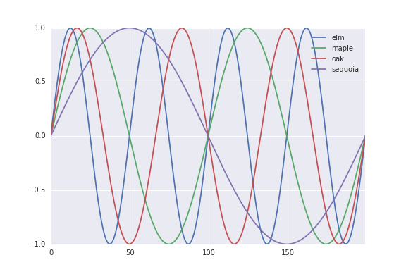

.. -*- mode: rst; mode: visual-line; fill-column: 9999; coding: utf-8 -*-

:author: David L. Dotson
:email: dldotson@asu.edu
:institution: Arizona State University, Tempe, Arizona, USA
:equal-contributor:
:corresponding:

:author: Sean L. Seyler
:email: slseyler@asu.edu
:institution: Arizona State University, Tempe, Arizona, USA

:author: Max Linke
:email: max.linke@biophys.mpg.de
:institution: Max Planck Institut für Biophysik, Frankfurt, Germany

:author: Richard J. Gowers
:email: richardjgowers@gmail.com
:institution: University of Manchester, Manchester, UK
:institution: University of Edinburgh, Edinburgh, UK

:author: Oliver Beckstein
:email: oliver.beckstein@asu.edu
:institution: Arizona State University, Tempe, Arizona, USA

-----------------------------------------------------------
datreant: persistent, Pythonic trees for heterogeneous data
-----------------------------------------------------------

.. class:: abstract

In science the filesystem often serves as a *de facto* database, with directory trees being the zeroth-order scientific data structure.
But it can be tedious and error prone to work directly with the filesystem to retrieve and store heterogeneous datasets.
**datreant** makes working with directory structures and files Pythonic with **Treants**: specially marked directories with distinguishing characteristics that can be discovered, queried, and filtered.
Treants can be manipulated individually and in aggregate, with mechanisms for granular access to the directories and files in their trees.
Disparate datasets stored in any format (CSV_, HDF5_, NetCDF_, Feather_, etc.) scattered throughout a filesystem can thus be manipulated as meta-datasets of Treants.
**datreant** is modular and extensible by design to allow specialized applications to be built on top of it, with **MDSynthesis_** as an example for working with molecular dynamics simulation data. http://datreant.org/

.. _CSV: https://docs.python.org/2/library/csv.html
.. _HDF5: https://www.hdfgroup.org/HDF5/
.. _NetCDF: http://www.unidata.ucar.edu/software/netcdf/
.. _Feather: https://github.com/wesm/feather
.. _MDSynthesis: http://mdsynthesis.readthedocs.io/

.. class:: keywords

   data management, science, filesystems

.. For example file, see ../00_vanderwalt/00_vanderwalt.rst
.. Shows how to do figures, maths, raw latex, tables, citations

Introduction
------------
.. must motivate datreant, and make a good sell as to why it is a useful and general-purpose tool

In many scientific fields, especially those analyzing experimental or numerical simulation data, there is an existing ecosystem of specialized tools and file formats which new tools must work around.
Consequently, the filesystem ends up serving as a *de facto* database, with directory trees the zeroth-order data structure for scientific data.
This is particularly true for fields centered around numerical simulation: simulation systems can vary widely in size, composition, rules, parameters, and starting conditions.
Furthermore, with ever-increasing computational power, it is often necessary to store intermediate results from large amounts of simulation data such that they may be accessed and explored interactively.

Managing the volume and complexity of these data is becoming increasingly difficult problem in and of itself; data management is a challenge to scientific reproducibility and ultimately presents a substantial barrier to answering scientific questions.
One approach to this problem is ``datreant``, a namespace package that provides a Pythonic interface to the filesystem and the data that lives within it.
By consolidating Python-based post-processing and analysis with the accessing, generation, and storage of raw and intermediate data, ``datreant`` is designed to solve a boring problem so we can focus more attention on interesting ones.

Treants as filesystem manipulators
----------------------------------
The central object of ``datreant`` is the ``Treant``.
A Treant is a directory in the filesystem that has been specially marked with a **state file**.
A ``Treant`` is also a Python object.
We can create a ``Treant`` with:

.. code-block:: python

   >>> import datreant.core as dtr
   >>> t = dtr.Treant('maple')
   >>> t
   <Treant: 'maple'>

This creates a directory ``maple/`` in the filesystem (if it did not already exist), and places a special state file inside which stores the Treant's state.
This file also serves as a flagpost indicating that this is more than just a directory::

    > ls maple
    Treant.1dcbb3b1-c396-4bc6-975d-3ae1e4c2983a.json

The name of this file includes the type of Treant to which it corresponds, as well as the ``uuid`` of the Treant, its unique identifier.
The state file contains all the information needed to generate an identical instance of this ``Treant``, so that we can start a separate Python session and immediately use the same Treant there:

.. code-block:: python

   # python session 2
   >>> import datreant.core as dtr
   >>> t = dtr.Treant('maple')
   >>> t
   <Treant: 'maple'>

Making a modification to the ``Treant`` in one session is immediately reflected by the same ``Treant`` in any other session.
For example we can add tags in the first python session, a ``Treant`` can store any number of descriptive tags that are useful for differentiating it from others:

.. code-block:: python

   # python session 1
   >>> t.tags.add('syrup', 'plant')
   >>> t.tags
   <Tags(['plant', 'syrup'])>

And in the other Python session, the same ``Treant`` with the same tags is visible:

.. code-block:: python

   # python session 2
   >>> t.tags
   <Tags(['plant', 'syrup'])>

Internally, advisory locking is done to avoid race conditions, making a ``Treant`` multiprocessing-safe.

Introspecting a Treant's Tree
~~~~~~~~~~~~~~~~~~~~~~~~~~~~~
A ``Treant`` can be used to introspect and manipulate its filesystem tree.
We can, for example, create directory structures rather easily:

.. code-block:: python

   >>> t['a/place/for/data/'].makedirs()
   <Tree: 'maple/a/place/for/data/'>
   >>> t['a/place/for/text/'].makedirs()
   <Tree: 'maple/a/place/for/text/'>

and so we now have::

   >>> t.draw()
   maple/
    +-- Treant.1dcbb3b1-c396-4bc6-975d-3ae1e4c2983a.json
    +-- a/
        +-- place/
            +-- for/
                +-- data/
                +-- text/

Accessing paths in this way returns ``Tree`` and ``Leaf`` objects, which refer to directories and files, respectively.
These paths may not point to directories or files that actually exist, but they can be used to create and work with ``Tree`` and ``Leaf`` elements.

We can, for example, easily store a Pandas_ [McK10]_ DataFrame somewhere in the tree for reference later:

.. todo: change to an example where we store a dataframe with arboreal data;
.. more fun, less space, fits theme

.. code-block:: python

   >>> import pandas as pd
   >>> df = pd.DataFrame(pd.np.random.randn(3, 2),
                         columns=['A', 'B'])
   >>> data = t['a/place/for/data/']
   >>> data
   <Tree: 'maple/a/place/for/data/'>
   >>> df.to_csv(data['random_dataframe.csv'].abspath)
   >>> data.draw()
   data/
   +-- random_dataframe.csv

and we can introspect the file directly:

.. code-block:: python

   >>> csv = data['random_dataframe.csv']
   >>> csv
   <Leaf: 'maple/a/place/for/data/random_dataframe.csv'>
   >>> print(csv.read())
   ,A,B
   0,-0.573730932177663,-0.08857033924376226
   1,0.03157276797041359,-0.10977921690694506
   2,-0.2080757315892524,0.6825003213837373

Using ``Treant``, ``Tree``, and ``Leaf`` objects, we can work with the filesystem Pythonically without giving much attention to *where* these objects live within that filesystem.
This becomes especially powerful when we have many directories/files we want to work with, possibly in many different places.

.. _Pandas: http://pandas.pydata.org/

Aggregation and splitting on Treant metadata
--------------------------------------------
What makes a ``Treant`` distinct from a ``Tree`` is its **state file**.
This file stores metadata that can be used to filter and split ``Treant`` objects when treated in aggregate.
It also serves as a flagpost, making Treant directories discoverable.

If we have many more Treants, perhaps scattered about the filesystem:

.. code-block:: python

   >>> for path in ('an/elm/', 'the/oldest/oak',
   ...              'the/oldest/tallest/sequoia'):
   ...     dtr.Treant(path)

we can gather them up with ``datreant.core.discover``:

.. code-block:: python

   >>> b = dtr.discover('.')
   >>> b
   <Bundle([<Treant: 'oak'>, <Treant: 'sequoia'>,
            <Treant: 'maple'>, <Treant: 'elm'>])>

A ``Bundle`` is an ordered set of ``Treant`` objects.
This collection gives convenient mechanisms for working with Treants as a single logical unit.
For example, it exposes a few basic properties for directly accessing its member data:

.. code-block:: python

   >>> b.relpaths
   ['the/oldest/oak/',
    'the/oldest/tallest/sequoia/',
    'maple/',
    'an/elm/']

   >>> b.names
   ['oak', 'sequoia', 'maple', 'elm']

A ``Bundle`` can be constructed in a variety of ways, most commonly using existing ``Treant`` instances or paths to Treants in the filesystem.

We can use a ``Bundle`` to subselect Treants in typical ways, including integer indexing and slicing, fancy indexing, boolean indexing, and indexing by name.
But in addition to these, we can use metadata features such as **tags** and **categories** to filter and group Treants as desired.

Filtering Treants with tags
~~~~~~~~~~~~~~~~~~~~~~~~~~~
Tags are individual strings that describe a Treant.
Settings the tags for each of our Treants separately:

.. code-block:: python

   >>> b['maple'].tags = ['syrup', 'furniture', 'plant']
   >>> b['sequoia'].tags = ['huge', 'plant']
   >>> b['oak'].tags = ['for building', 'plant', 'building']
   >>> b['elm'].tags = ['firewood', 'shady', 'paper',
                         'plant', 'building']

we can now work with these tags in aggregate:

.. code-block:: python

   # will only show tags present in *all* members
   >>> b.tags
   <AggTags(['plant'])>

   # will show tags present among *any* member
   >>> b.tags.any
   {'building',
    'firewood',
    'for building',
    'furniture',
    'huge',
    'paper',
    'plant',
    'shady',
    'syrup'}

and we can filter on them. For example, getting all Treants that are good
for construction work:

.. code-block:: python

   # gives a boolean index for members with this tag
   >>> b.tags['building']
   [False, False, True, True]

   # we can use this to index the Bundle itself
   >>> b[b.tags['building']]
   <Bundle([<Treant: 'oak'>, <Treant: 'elm'>])>

or getting back Treants that are both good for construction *and* used for
making furniture by giving tags as a list:

.. code-block:: python

   # a list of tags serves as an *and* query
   >>> b[b.tags[['building', 'furniture']]]
   <Bundle([])>

which in this case none of them are.

Other tag expressions can be constructed using tuples (for *or* operations) and sets (for *not and*), and nesting of any of these works as expected:

.. code-block:: python

   # we can get *or* by using a tuple instead of a list
   >>> b[b.tags['building', 'furniture']]
   <Bundle([<Treant: 'maple'>, <Treant: 'oak'>,
            <Treant: 'elm'>])>

   # and we can get *not and* by using a set
   >>> b[b.tags[{'building', 'furniture'}]]
   <Bundle([<Treant: 'sequoia'>, <Treant: 'maple'>,
            <Treant: 'oak'>, <Treant: 'elm'>])>

Using tag expressions, we can filter to Treants of interest from a ``Bundle`` counting many, perhaps hundreds, of Treants as members.
A common workflow is to use ``datreant.core.discover`` to gather up many Treants from a section of the filesystem, then use tags to extract only those Treants one actually needs.

.. todo: add a note on fuzzy matching (with a reference) if there's space

Splitting Treants on categories
~~~~~~~~~~~~~~~~~~~~~~~~~~~~~~~
Categories are key-value pairs that provide another mechanism by which Treants can be distinguished.
We can add categories to individual Treants:

.. code-block:: python

    # add categories to individual members
    >>> b['oak'].categories = {'age': 'adult',
                               'type': 'deciduous',
                               'bark': 'mossy'}
    >>> b['elm'].categories = {'age': 'young',
                               'type': 'deciduous',
                               'bark': 'smooth'}
    >>> b['maple'].categories = {'age': 'young',
                                 'type': 'deciduous',
                                 'bark': 'mossy'}
    >>> b['sequoia'].categories = {'age': 'old',
                                   'type': 'evergreen',
                                   'bark': 'fibrous',
                                   'home': 'california'}

    # add value 'north america' to category 'continent'
    # for all members
    >>> b.categories.add({'plant': 'tree'})

We can access categories for an individual member:

.. code-block:: python

    >>> b['sequoia'].categories
    <AggCategories({'home': ['california'],
                    'age': ['old'],
                    'type': ['evergreen'],
                    'bark': [u'fibrous'],
                    'plant': ['tree']})>

The *aggregated* categories for all members in a Bundle are accessible via `datreant.core.Bundle.categories`, which gives a view of the categories with keys present in (common to) *every* member Treant:

.. code-block:: python

    >>> b.categories
    <AggCategories({'age': ['adult', 'young',
                            'young', 'old'],
                    'type': ['deciduous', 'deciduous',
                             'deciduous', 'evergreen'],
                    'bark': ['mossy', 'smooth',
                             'mossy', 'fibrous'],
                    'plant': ['tree', 'tree',
                              'tree', 'tree']})>

Each element of the list associated with a given key corresponds to the value for each member, in member order.
Using `b.categories` is equivalent to `b.categories.all`; we can also access categories present among *any* member:

.. code-block:: python

    >>> b.categories.any
    {'age': ['adult', 'young', 'young', 'old'],
     'bark': ['mossy', 'smooth', 'mossy', 'fibrous'],
     'home': [None, None, None, 'california'],
     'type': ['deciduous', 'deciduous',
              'deciduous', 'evergreen']}

Members that do not have a given key will have `None` as the corresponding value in the list.
Accessing values for a list of keys:

.. code-block:: python

    >>> b.categories[['age', 'home']]
    [['adult', 'young', 'young', 'old'],
     [None, None, None, 'california']]

or a set of keys:

.. code-block:: python

    >>> b.categories[{'age', 'home'}]
    {'age': ['adult', 'young', 'young', 'old'],
     'home': [None, None, None, 'california']}

returns, respectively, a list or dictionary (corresponding to the inputted keys) of lists of values, where the list for a given key is in member order.
Perhaps the most powerful feature of categories is the `groupby()` method, which, given an inputted key, can be used to group specific members in a Bundle by their corresonding category values.
If we want to group members by their 'bark', we can use `groupby()` to obtain a dictionary of members for each value of 'bark':

.. code-block:: python

    >>> b.categories.groupby('bark')
    {'fibrous': <Bundle([<Treant: 'sequoia'>])>,
     'mossy': <Bundle([<Treant: 'oak'>, <Treant: 'maple'>])>,
     'smooth': <Bundle([<Treant: 'elm'>])>}

Say we would like to get members grouped by both their 'bark' and 'home':

.. code-block:: python

    >>> b.categories.groupby({'bark', 'home'})
    {('fibrous', 'california'): <Bundle([<Treant: 'sequoia'>])>}

We get only a single member for the pair of keys `('fibrous', 'california')` since 'sequoia' is the only Treant having the 'home' category.
It is clear that categories are useful by themselves as a means of labeling a Treant to, for instance, denote the types of data that it may contain or the manner in which the data were obtained.
By leveraging the `groupby()` method, one can then extract the Treants (and the data they contain) corresponding to selected categories without having to explicitly access each member (and its data).
This feature can be particularly powerful in cases where, say, many Treants have been created and categorized to handle incoming data over an extended period of time; one may then quickly gather the data one needs from a bird's-eye view using category selection mechanisms.

Treant modularity with attachable Limbs
---------------------------------------
``Treant`` objects manipulate their tags and categories using ``Tags`` and ``Categories`` objects, respectively.
These are examples of ``Limb`` objects: attachable components which serve to extend the capabilities of a ``Treant``.
While ``Tags`` and ``Categories`` are attached by default to all ``Treant`` objects, custom ``Limb`` subclasses can be defined to for additional functionality.

``datreant`` is a namespace package, with the dependency-light core components included in ``datreant.core``.
Another package currently in the ``datreant`` namespace is ``datreant.data``, which includes a set of convenience ``Limb`` objects for storing and retrieving Pandas and NumPy_ [vdW11]_ datasets.
We can attach a ``Data`` limb to a ``Treant`` with:

.. code-block:: python

   >>> import datreant.data
   >>> t = dtr.Treant('maple')
   >>> t.attach('data')
   >>> t.data
   <Data([])>

and we can immediately start using it to store e.g. a Pandas ``Series``:

.. code-block:: python

   >>> import numpy as np
   >>> sn = pd.Series(np.sin(
   ...     np.linspace(0, 8*np.pi, num=200)))
   >>> t.data['sinusoid'] = sn

and we can get it back just as easily:

.. code-block:: python

   >>> t.data['sinusoid'].head()
   0    0.000000
   1    0.125960
   2    0.249913
   3    0.369885
   4    0.483966
   dtype: float64

What's more, ``datreant.data`` also includes a corresponding ``AggLimb`` for ``Bundle`` objects, allowing for automatic aggregation of datasets by name across all member ``Treant`` objects.
If we collect and store a similar datasets for each member in our ``Bundle``:

.. code-block:: python

   >>> b = dtr.discover('.')
   >>> b
   <Bundle([<Treant: 'oak'>, <Treant: 'sequoia'>,
            <Treant: 'maple'>, <Treant: 'elm'>])>

   # we want to make each dataset a bit different
   >>> b.categories['frequency'] = [1, 2, 3, 4]
   >>> for mem in b:
   ...     freq = mem.categories['frequency']
   ...     mem.data['sinusoid'] = np.sin(
   ...         freq * np.linspace(0, 8*np.pi, num=200))

then we can retrieve all of them into a single, multi-index Pandas ``Series``:

.. code-block:: python

   >>> sines = b.data.retrieve('sinusoid', by='name')
   >>> sines.groupby(level=0).head()
   sequoia  0    0.000000
            1    0.125960
            2    0.249913
            3    0.369885
            4    0.483966
   oak      0    0.000000
            1    0.369885
            2    0.687304
            3    0.907232
            4    0.998474
   maple    0    0.000000
            1    0.249913
            2    0.483966
            3    0.687304
            4    0.847024
   elm      0    0.000000
            1    0.483966
            2    0.847024
            3    0.998474
            4    0.900479
   dtype: float64

which we can use for aggregated analysis, or perhaps just pretty plots (Figure :ref:`fig:sines`).

.. code-block:: python

   >>> for name, group in sines.groupby(level=0):
   ...     df = group.reset_index(level=0, drop=True)
   ...     df.plot(legend=True, label=name)

   Plot of sinusoidal toy datasets aggregated and plotted by source Treant. :label:`fig:sines`

The ``Data`` limb stores Pandas and NumPy objects in HDF5_ within a Treant's own tree.
It can also store arbitrary (but pickleable) Python objects as pickles, making it a flexible interface for quick data storage and retrieval.
However, it ultimately serves as an example for how ``Treant`` and ``Bundle`` objects can be extended to do complex but convenient things.

.. _NumPy: http://www.numpy.org/

Using Treants as the basis for dataset access and manipulation with the PyData stack
------------------------------------------------------------------------------------
Although it is possible to extend ``datreant`` objects with limbs to do complex operations on a Treant's tree, it isn't necessary to build specialized interfaces such as these to make use of the extensive PyData stack.
``datreant`` fundamentally serves as a Pythonic interface to the filesystem, bringing value to datasets and analysis results by making them easily accessible now and later.
As data structures and file formats change, ``datreant`` objects can always be used in the same way to supplement the way these tools are used.

Because a ``Treant`` is both a Python object and a filesystem object, they work remarkably well with distributed computation libraries such as dask.distributed_ [Roc15]_ and workflow execution frameworks such as Fireworks_ [Jai15]_.
Treant metadata features such as tags and categories can be used for automated workflows, including backups and remote copies to external compute resources, making work on datasets less imperative and more declarative when desired.

.. _dask.distributed: http://distributed.readthedocs.io
.. _Fireworks: https://pythonhosted.org/FireWorks/

Building domain-specific applications on datreant
-------------------------------------------------
Built-in ``datreant.core`` objects are general-purpose, while packages like ``datreant.data`` provide extensions to these objects that are more specific.
But it is possible, and very useful, for domain-specific applications to define their own domain-specific ``Treant`` subclasses, with tightly-coupled limbs for domain-specific needs.
Not only do objects such as ``Bundle`` work just fine with ``Treant`` subclasses and custom ``Limb`` classes; they are designed explicitly with this need in mind.

The first example of a domain-specific package built around ``datreant`` is MDSynthesis_, a module that enables high-level management and exploration of molecular dynamics simulation data.
MDSynthesis gives a Pythonic interface to molecular dynamics trajectories using MDAnalysis_ [MiA11]_, giving the ability to work with the data from many simulations scattered throughout the filesystem with ease.
It makes it possible to write analysis code that can work across many varieties of simulation, but even more importantly, MDSynthesis allows interactive work with the results from hundreds of simulations at once without much effort.

.. _MDAnalysis: http://www.mdanalysis.org/

Leveraging molecular dynamics data with MDSynthesis
~~~~~~~~~~~~~~~~~~~~~~~~~~~~~~~~~~~~~~~~~~~~~~~~~~~
MDSynthesis_ defines a ``Treant`` subclass called a ``Sim``.
A ``Sim`` featues special limbs for storing an MDAnalysis_ ``Universe`` definition and custom atom selections within its state file, allowing for painless recall of raw simulation data and groups of atoms of interest.

As an example of effectively using ``Sims``, say we have 50 biased molecular dynamics simulations that sample the conformational change of the ion transport protein NhaA from the inward-open to outward-open state.
Let's also say that we are interested in how many hydrogen bonds exist at any given time between the two domains as they move past each other.

We can use the MDAnalysis ``HydrogenBondAnalysis`` class to collect the data for each ``Sim`` using ``Bundle.map`` for process parallelism, and store it using the ``datreant.data`` limb:

.. code-block:: python

    import mdsynthesis as mds
    import MDAnalysis.analysis.hbonds as hbonds
    import pandas as pd
    import seaborn as sns

    b = mds.discover('NhaA_i2o_transitions')

    def get_hbonds(sim):
        dimerization = sim.atomselections['dimer']
        core = sim.atomselections['core']

        hb = hbonds.HydrogenBondAnalysis(
                sim.universe, dimerization, core)
        hb.run()
        hb.generate_table()

        sim.data['hbonds'] = pd.DataFrame(hb.table)

    b.map(get_hbonds, processes=16)

Then we can retrieve the datasets in aggregate using the ``Bundle`` ``datreant.data`` limb
and visualize the result:

.. code-block:: python

    df = b.data.retrieve('hbonds', by='name')

    counts = df['distance'].groupby(df.index).count()
    counts.index = pd.MultiIndex.from_tuples(
                            counts.index)
    counts.index = counts.index.droplevel(0)

    sns.jointplot(counts.index, counts, kind='hexbin')

   A cartoon rendering of an outward-open model (top) and an inward-open crystallographic structure (PDB ID: 4AU5) (bottom) of *Escherichia coli NhaA*. :label:`fig:nhaa`

.. figure:: figs/hbonds.pdf

   The number of hydrogen bonds between the core and dimerization domain during a conformational transition between the inward-open and outward-open state of EcNhaA :label:`fig:hbonds`

By making it relatively easy to work with what can often be many terabytes of simulation data spread over tens or hundreds of trajectories, MDSynthesis_ has greatly improved the time it takes to iterate on new ideas toward answering real biological questions.

Final thoughts
--------------
``datreant`` is a young project that started as a domain-specific package for working with molecular dynamics data, but has quickly morphed into a powerful, general-purpose tool for managing and manipulating filesystems and the data spread about them.
The dependency-light ``datreant.core`` package is pure Python, BSD-licensed, and openly developed, and the ``datreant`` namespace is designed to support useful extensions to the core objects.
It is the hope of the authors that ``datreant`` continues to grow in a way that benefits the wider scientific community, smoothing the common pain point of data glut and filesystem management.

Acknowledgements
----------------
DLD was in part supported by a Molecular Imaging Fellowship from the Department of Physics at Arizona State University.
SLS was supported in part by a Wally Stoelzel Fellowship from the Department of Physics at Arizona State University.
ML was supported by the Max Planck Society.
RG was supported by BBSRC grant BB/J014478/1.
OB was supported in part by grant ACI-1443054 from the National Science Foundation; computational resources for OB's work were in part provided by the Extreme Science and Engineering Discovery Environment (XSEDE), which is supported by National Science Foundation grant number ACI-1053575 (allocation MCB130177 to OB).

References
----------
.. [vdW11] Stéfan van der Walt, S. Chris Colbert and Gaël Varoquaux. The NumPy
           Array: A Structure for Efficient Numerical Computation, Computing in
           Science & Engineering, 13, 22-30 (2011)
.. [Roc15] Matthew Rocklin. Dask: Parallel Computation with Blocked algorithms
           and Task Scheduling, Proceedings of the 14th Python in Science Conference, 130-131 (2010)
.. [Jai15] Anubhav Jain, et. al. FireWorks: a dynamic workflow system designed
           for high-throughput applications. Concurrency Computat.: Pract.
           Exper., 27: 5037–5059. doi: 10.1002/cpe.3505 (2015)
.. [McK10] Wes McKinney. Data Structures for Statistical Computing in Python,
           Proceedings of the 9th Python in Science Conference, 51-56 (2010)
.. [MiA11] N. Michaud-Agrawal, E. J. Denning, T. B. Woolf and O. Beckstein.
           MDAnalysis: A toolkit for the analysis of molecular dynamics simulations.
           J Comp Chem, 32: 2319-2327. doi: 10.1002/jcc.21787 (2011)
