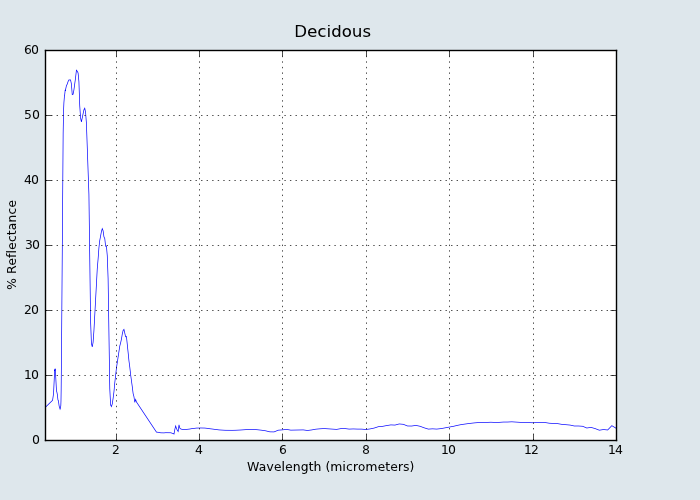

:author: David Lippa
:email: david.lippa@realmassive.com
:institution: RealMassive, Inc

:author: Jason Vertrees
:email: jason.vertrees@realmassive.com
:institution: RealMassive, Inc

.. |nbsp| unicode:: 0xA0
   :trim:

-----------------------------------------------------------------------------------------------------------------------------
Creating a Real-Time Recommendation Engine using Modified K-Means Clustering and Remote Sensing Signature Matching Algorithms
-----------------------------------------------------------------------------------------------------------------------------

.. class:: abstract

   RealMassive, the first open data provider and marketing platform for commercial real estate (CRE), encountered challenges while attempting to scale its recommendation engine to match its nationwide, multi-market expansion. To address this problem, we borrowed a conceptual model from spectral data processing to transform our domain-specific problem into one that the Google App Engine's (GAE) search engine could solve. Rather than using a more traditional heuristics-based relevancy ranking, we filtered and scored results using a modified version of a spectral angle. While this approach seems to have little in common with providing a recommendation based on similarity, there are important parallels: filtering to reduce the search space; independent variables that can be resampled into a signature; a signature library to identify meaningful similarities; and an algorithm that lends itself to an accurate but flexible definition of similarity. We implemented this as a web service that provides recommendations in sub-second time. The RealMassive platform currently covers over 4.5 billion square feet of CRE inventory and is expanding quickly.

.. class:: keywords

   algorithms, clustering, recommendation engine, remote sensing

Introduction
------------

RealMassive helps tenants and their representatives locate commercial real estate (CRE) space to lease or buy. Finding suitable space in a market can be difficult. Each tenant has specific requirements, and often the knowledge of the current market lives exclusively in the memory of domain experts. Automated recommendation tools have substantial value, provided that they operate in real time on an ever-increasing dataset and provide similar or better accuracy to the judgment of domain experts. Our initial recommendation engine could not scale to match our growing database of CRE listings, which now covers more than 30 markets and 4.5 billion square feet. We set out to create a new real-time recommendation engine to meet these needs while negotiating the restrictions of our platform, Google App Engine (GAE). This was a classic problem of pattern matching and information retrieval adapted to a specific domain of expertise coupled with engineering restrictions and product requirements.

GAE is a powerful platform built to scale, yet it brings along certain restrictions such as limited amounts of memory and a limited set of mathematical functions (addition, subtraction, multiplication, division, minimum, maximum, geographical distance, natural logarithm, and absolute value) that its search engine may use [Goo15]_. Additionally, Python libraries with C/C++ bindings are prohibited on Google's sandboxed platform, with the exception of those provided [Goo15]_. Our answer to these restrictions was to modify a simple computation from the domain of linear algebra and spectral analysis that changed the nature of the problem.

Spectral processing algorithms have been used with libraries of spectral signatures to automate the identification of materials with a variety of applications and domains including: determining the chemical composition of stars [Ric15]_, analyzing the health of vegetation [Zha09]_, measuring the quality of an RGB image, and detecting camouflage in times of war [Lan05]_. The basis for pattern matching starts with a library of high-resolution spectral signatures, such as the one depicted in Fig |nbsp| :ref:`spectral-signature`, which can be resampled for use against multi-spectral data with fewer than 20 bands, or hyper-spectral data that can have over 200 bands. The Spectral Angle Mapper (SAM) algorithm treats each pixel as an *n*-dimensional vector :math:`\vec{v_{ij}}` and computes the angle :math:`\theta` between :math:`\vec{v_{ij}}` and a resampled signature :math:`\vec{s}` for all rows *i* and all columns *j*: :math:`\cos^{-1}\left(\frac{\vec{s} \cdot \vec{v_{ij}}}{\left|\vec{s}\right| \left|\vec{v_{ij}}\right|} \right)`. A potential candidate match usually has an angle between 5 and 10 degrees. For remote sensing applications, SAM has a roughly 83% accuracy rate when predicting exact signature matches [Pet11]_, although a proportional match could show up as a false positive [#]_, requiring additional algorithmic steps.

   Reflectance spectral signature of a deciduous tree from the ASTER Spectral Library [Bal09]_ :label:`spectral-signature` showing almost complete energy absorption beyond 3 |nbsp| micrometers.

We can draw some important parallels between the recommendation algorithm and SAM. The "pixels" of the image are similar to the set of all possible candidate spaces. Spaces added to a CRE survey can represent a library of "signatures," with the intensity of each signature component taking its value from each item's orthogonal attributes. The dependence between variables (such as cost per unit, number of units, and total cost) are "within the same wavelength range," comparable to a band's center frequency and its full-width half maximum [#]_. The attributes contained within an object are like the wavelengths of a signature, provided each vector component is independent [#]_ of all others. Furthermore, the problem of a proportional match in remote sensing translates into an asset when used as a recommendation score: an angle of 0, regardless of vector magnitude, is indicative of proportional similarity.

.. [#] A signature whose vector is :math:`(1, 2, 3)` would show up as an exact match when compared against a candidate pixel of :math:`(10, 20, 30)`, since they are a linear combination of each other and therefore the angle between them is 0.

.. [#] The full-width half maximum value for a band expresses the difference between the extreme values that the center frequency could detect. For example, QuickBird detects blue in the range of 446-512, whose center frequency is 478 [War09]_.

.. [#] When attributes are not independent of each other, some elements of the signature are over-represented, skewing results. Mixing different types of units, such as rates and values, is another form of variable dependence.

Method
------

The implementation of the recommendation algorithm starts with *k*-means clustering: the process of breaking up *n* data points into *k* clusters. In the case of our recommendation algorithm, we are breaking up *n* inputs into *k* geographical clusters that each have their own unique signature :math:`\vec{s_k}`. Each cluster represents a search region, like an area of interest in a spectral data set. Each cluster also has its size maximized without intersecting any other, with the radii governed by the data's density using a global KDTree [#]_ of all building geo-coordinates [#]_, as can be shown from real market data in Fig |nbsp| :ref:`clusters-with-radii`. Each cluster's weighted centroid and smoothed signature are provided to the search engine to be matched against candidates using SAM.

.. [#] Since GAE restricts external libraries to be purely implemented in Python, we stripped out functionality from kdtree.py [Git15]_ that depended on native code.

.. [#] A modified version of the source code used for the clustering algorithm is in Appendix A, with sample data [Rea15]_ in the docstring.

.. [#] Some reasons to exclude are items that have insufficient data to be a valid comparison or user-declined recommendations.

.. [#] For a 4:3 image: :math:`4\sqrt{\frac{10000}{12}} \approx 115` x :math:`3\sqrt{\frac{10000}{12}} \approx 87`

.. [#] This can easily be proven graphically or by contradiction: if the angle :math:`\theta > \frac{\pi}{2}`, at least one component of :math:`\vec{v_i} < 0` or one component of :math:`\vec{s} < 0`.

.. figure:: figure1.png

   Clustering of 50 Spaces from across the US [Rea15]_ using `build_clusters()` from Appendix A. :label:`clusters-with-radii`

The next part of the algorithm involves classifing attributes into elastic and non-elastic categories. The non-elastic parameters, such as building type and location, along with exclusions [#]_ and other domain-specific business rules, become search criteria to reduce the data set to a reasonable size of no more than 10,000 results. This subset can be matched against signatures built from the elastic criteria (e.g. cost, space available, and number of parking spaces). Executing the SAM algorithm on a reduced dataset of 10,000 items is comparable to performing material identification on a 115 x 87 pixel data collection [#]_ from a multi-spectral sensor, easily accomplished in sub-second time. The sample Python code below illustrates the process of executing SAM on a 2-dimensional array of pixels in :math:`\mathbb{R}^3`:

.. code-block:: python

  from math import acos
  import numpy as np

  def SAM(img, sig):
    """
    >>> sig = [2, 2, 2]
    >>> img = np.array([[(1, 2, 3), (1, 1, 0)],
                        [(4, 3, 2), (0, 1, 1)],
                        [(1, 1, 1), (4, 4, 1)]])
    >>> SAM(img, sig)
    """
    matches = []
    sig_norm = sig/np.linalg.norm(sig)
    for r in range(len(img)):
      for c in range(len(img[r])):
        pix = img[r][c]
        cos_theta = pix.dot(sig_norm)/np.linalg.norm(pix)
        theta = acos(round(cos_theta, 7))
        if theta < .1745329:  # 10 degrees
          matches.append((r, c, theta))
    return sorted(
      matches,
      cmp=lambda x, y: cmp(x[-1], y[-1]))

This solution fails our speed requirement, since it requires loading the subset of candidates into memory. GAE's search service provides a faster mechanism in the form of a sort expression, but lacks the inverse cosine function [Goo15]_. Our solution uses the cosine ratio as a proxy for the angle. Since the components :math:`s_1, s_2, \ldots, s_n` of the signature vector :math:`\vec{s}` and the components of all of the candidate vectors :math:`\vec{v_1}, \vec{v_2}, \ldots, \vec{v_n}` are all non-negative, the cosine ratio between :math:`\vec{s}` and :math:`\vec{v_i} = \frac{\vec{s} \cdot \vec{v_i}}{|\vec{s}||\vec{v_i}|} \in [0, 1]` and is monotonically increasing. From this, we can deduce :math:`\theta \in [0, \frac{\pi}{2}]` [#]_ and is monotonically decreasing. This means that sorting by the cosine ratio in descending order is functionally equivalent to sorting by the angle :math:`\theta` in ascending order to find the best match.

Conclusions
--------------------------

Google App Engine provides a scalable infrastructure with an advanced search engine that can be utilized for purposes beyond typical search use cases. In this paper, we present a novel approach to recommendation systems by drawing parallels between domain-specific recommendation matching and material identification processes used in remote sensing. Remapping independent object attributes into vectors allows for sub-second scoring and sorting. This implementation enables RealMassive to scale its recommendation engine and continue to innovate in an industry that is currently hampered by closed data and its dependence upon domain experts.

Our experience with implementing a recommendation engine on Google's App Engine platform shows that the structure, and not just the content, of a problem is significant, and may be the key to a new breed of solutions. The seemingly overly restrictive toolbox provided by App Engine was a catalyst for a mathematically simpler solution that yielded the speed and accuracy required. In an era where the amount of data gathered is outstripping our ability to process it in real-time, we should consider being more selective with the quantity of data processed, and to creatively apply techniques from other domains.

Appendix A: Source Code
-----------------------

.. code-block:: python

  from collections import namedtuple
  from google.appengine.api.search.geo_util import (
    LatLng)
  import numpy
  from scipy.spatial import KDTree

  Circle = namedtuple(
    'Circle', ['centroid', 'radius', 'count'])

  def build_clusters(user_cart):
    """
    Example
    -------
    >>> pts = numpy.array([(47.6188749, -122.1964424),
                           (29.488525, -98.5706012),
                           (37.277239, -121.8802856),
                           (32.1702437, -110.9105262),
                           (42.4868621, -71.1970282),
                           (30.3129618, -97.8534453),
                           (36.024881, -79.8760405),
                           (26.0922468, -80.3677063),
                           (47.769761, -122.1856538),
                           (33.385969, -84.173788),
                           (38.628792, -90.1947766),
                           (28.001427, -82.571682),
                           (42.5089162, -71.1505938),
                           (35.930585, -78.8824199),
                           (37.380601, -122.020508),
                           (34.1005853, -118.3449945),
                           (29.7330038, -95.4194112),
                           (33.916299, -118.282807),
                           (26.2638812, -80.1419505),
                           (34.013343, -118.27794),
                           (35.1611, -106.6375),
                           (41.939233, -87.8777829),
                           (42.012114, -87.9695607),
                           (42.0475073, -88.1221286),
                           (37.3555082, -121.8512972),
                           (35.765258, -78.731181),
                           (29.9227876, -95.686416),
                           (35.3457389, -80.7885829),
                           (30.1691711, -97.7966084),
                           (33.446348, -112.043772),
                           (39.6779607, -105.0047397),
                           (37.3992311, -122.0455178),
                           (33.7387326, -117.8220235),
                           (38.6207, -90.2658),
                           (37.7922523, -122.3941085),
                           (28.386643, -81.403954),
                           (38.694616, -90.4323432),
                           (38.5538501, -90.4129878),
                           (33.7449806, -117.8376244),
                           (30.263074, -97.7434838),
                           (39.7344926, -105.0000469),
                           (47.61653, -122.1334055),
                           (29.6011042, -98.5384865),
                           (27.8575209, -82.8299094),
                           (35.0875527, -89.930835),
                           (44.9300485, -93.385583),
                           (42.3251265, -71.5850258),
                           (32.9287661, -97.0196609),
                           (35.332892, -80.819076),
                           (25.795235, -80.378046)])
    >>> build_clusters(pts)
    """
    if len(user_cart) == 1:
      return [Circle(u[0], u[1], 0.082)
              for u in user_cart]
    else:
      cart_tree = KDTree(user_cart)
      geo_clusters = cluster(cart_tree, max_clusters=20)
      return merge_clusters(geo_clusters)

  def radius_in_meters(degrees):
      return degrees * LatLng._EARTH_RADIUS_METERS

  def cluster(tree, init_rad_deg=0.082, max_clusters=10):
    if max_clusters < 1: max_clusters = 1
    processed = set()
    geo_clusters = []
    for p in tree.data:
      if tuple(p) not in processed:
        r = max(init_rad_deg, init_rad_deg)
        current_clus = [tree.data[n] for n in \
          tree.query_ball_point(p, r)]

        cir = get_circle(current_clus, max_nn_dist=1.0)
        geo_clusters.append((current_clus, cir))

        processed.update([tuple(k)
                          for k in current_clus])
    if len(geo_clusters) > max_clusters:  # too many!
      return cluster(
          tree, init_rad_deg * 2, max_clusters)
    return geo_clusters

  def get_circle(geos, max_nn_dist):
    centr, num_uniques = get_centroid(geos)
    radius = max_nn_dist
    if num_uniques > 1:
      if len(geos) <= 1:
        radius = 1.4 * max_nn_dist
      else:
        radius = max([numpy.linalg.norm(centr - g)
                      for g in geos])
    return Circle(centroid=centr, radius=radius,
                  count=len(geos))

  def get_centroid(geos):
    centr = numpy.array([0.0, 0.0])
    uniques = set()
    for g in geos:
      centr += g
      uniques.add(tuple(g))
    if len(geos) > 0:
      centr = centr / len(geos)
    else:
      centr = LatLng(float('nan'), float('nan'))
    return centr, len(uniques)

  def merge_clusters(clusters):
    cluster_info = []
    c_tree = KDTree(
      [circle.centroid for cluster, circle in clusters])
    for _, cir in clusters:
      nn_q2 = c_tree.query(cir.centroid, 2)
      radius = cir.radius
      if len(nn_q2[0]) > 1:
        radius = min(nn_q2[0][1] / 2., radius)
        radius = radius_in_meters(radius)
        cluster_info.append(
          Circle(cir.centroid, radius, cir.count))
    return cluster_info

References
----------
.. [Bal09] Baldridge, A. M., S.J. Hook, C.I. Grove and G. Rivera, 2009.. The ASTER Spectral Library Version 2.0. Remote Sensing of Environment, vol 113, pp. 711-715

.. [Git15] Github. (2015, June 11). SciPy source code. Retrieved from https://github.com/scipy/scipy/blob/master/scipy/spatial/kdtree.py

.. [Goo15] Google. (2015, June 11). Google App Engine for Python 1.9.21 Documentation. Retrieved from https://cloud.google.com/appengine/docs/python

.. [Lan05] Landgrebe, David A (2005). Signal Theory Methods in Multispectral Remote Sensing. Hoboken, NJ: John Wiley & Sons.

.. [Pet11] G. Petropoulos, K. Vadrevu, et. al. *A Comparison of Spectral Angle Mapper and Artificial Neural Network Classifiers Combined with Landsat TM Imagery Analysis for Obtaining Burnt Area Mapping*,
       Sensors. 10(3):1967-1985. 2011.

.. [Rea15] RealMassive. (2015, June 10). Retrieved from https://www.realmassive.com

.. [Ric15] M. Richmond. Licensed under Creative Commons. Retrieved from http://spiff.rit.edu/classes/phys301/lectures/comp/comp.html

.. [War09] T. Warner, G. Foody, M. Duane Nellis (2009). The SAGE Handbook of Remote Sensing. Thousand Oaks, CA: SAGE Publications Inc.

.. [Zha09] H. Zhang, Y. Lan, R. Lacey, W. Hoffmann, Y. Huang. *Analysis of vegetation indices derived from aerial multispectral and ground hyperspectral data*,
       International Journal of Agricultural and Biological Engineering. 2(3): 33. 2009.

For a demonstration of RealMassive's clustering service, you may use the search query language described in our `Apiary documentation <http://docs.realmassive.apiary.io/#reference/spaces/search-for-a-space-by-full-text-query>`_ with the clustering endpoint `https://www.realmassive.com/api/v1/spaces/cluster`, such as `this <https://www.realmassive.com/api/v1/spaces/cluster?building.address.city=Austin&limit=1000>`_.
