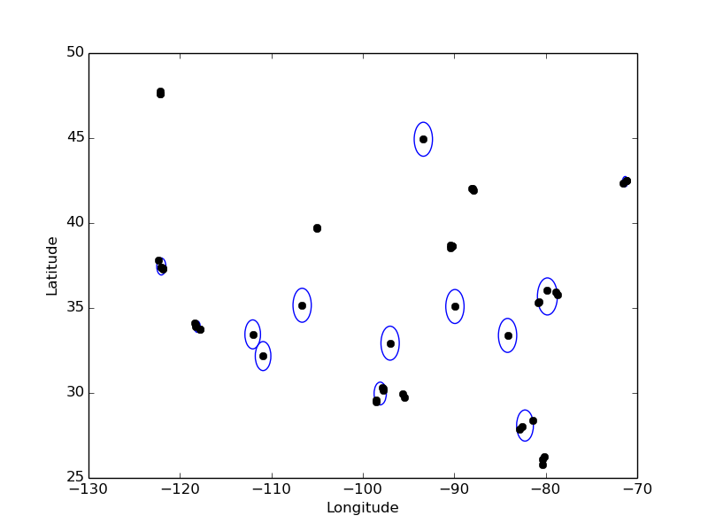

:author: David Lippa
:email: david.lippa@realmassive.com
:institution: RealMassive, Inc.

:author: Jason Vertrees
:email: jason.vertrees@realmassive.com
:institution: RealMassive, Inc.

:copyright_holder: RealMassive, Inc.

.. |nbsp| unicode:: 0xA0
   :trim:

-----------------------------------------------------------------------------------------------------------------------------
Creating a Real-Time Recommendation Engine using Modified K-Means Clustering and Remote Sensing Signature Matching Algorithms
-----------------------------------------------------------------------------------------------------------------------------

.. class:: abstract

   Built on Google App Engine (GAE), RealMassive encountered challenges while attempting to scale its recommendation engine to match its nationwide, multi-market expansion. To address this problem, we borrowed a conceptual model from spectral data processing to transform our domain-specific problem into one that the GAE's search engine could solve. Rather than using a more traditional heuristics-based relevancy ranking, we filtered and scored results using a modified version of a spectral angle. While this approach seems to have little in common with providing a recommendation based on similarity, there are important parallels: filtering to reduce the search space; independent variables that can be resampled into a signature; a signature library to identify meaningful similarities; and an algorithm that lends itself to an accurate but flexible definition of similarity. We implemented this as a web service that provides recommendations in sub-second time. The RealMassive platform currently covers over 4.5 billion square feet of commercial real estate inventory and is expanding quickly.

.. class:: keywords

   algorithms, clustering, recommendation engine, remote sensing

Introduction
------------

RealMassive helps tenants and their representatives locate commercial real estate (CRE) space to lease or buy. Finding suitable space in a market can be difficult. Each tenant has specific requirements, and often, the knowledge of the current market lives exclusively in the memory of domain experts. Automated recommendation tools have substantial value, provided that they operate in real time on an ever-increasing dataset and provide similar or better accuracy to the judgment of domain experts. Our initial recommendation engine attempted to use a variance-based calculation that could not scale to match our growing database of CRE listings, which now covers more than 30 US markets and 4.5 billion square feet. We set out to create a new real-time recommendation engine to meet these needs while negotiating the restrictions of our platform, Google App Engine (GAE). This is a classic problem of pattern matching and information retrieval adapted to a specific domain of expertise coupled with engineering restrictions and product requirements.

GAE is a powerful platform built to scale, yet it brings along certain challenges that make implementing algorithms, such as a recommendation engine, more difficult. Several of these constraints are particularly difficult to overcome. Instances are outfitted with at most 1 GB of memory and prohibited from executing native code with the exception of a few provided libraries, such as numpy [Goo15]_. Though fast for relevance-based search operations, the GAE search engine trades speed for limited functionality: only a small subset of mathematical functions (addition, subtraction, multiplication, division, minimum, maximum, geographical distance, natural logarithm, and absolute value) are available [Goo15]_. Implementing algorithms via the GAE search infrastructure keeps memory usage low, provided that the only functionality needed is a very limited math toolbox.

We set out to implement our recommendation engine using GAE search to produce a solution that fits within the constraints of our platform. The search results are ordered not by search term relevance, but by a modified version of a spectral angle |---| a simple computation borrowed from the domain of linear algebra and spectral analysis. The Spectral Angle Mapper (SAM) algorithm treats each pixel of an image as an *n*-dimensional vector :math:`\vec{v_{ij}}` and computes the angle :math:`\theta` between :math:`\vec{v_{ij}}` and a vector :math:`\vec{s}` for all rows *i* and all columns *j*: :math:`\cos^{-1}\left(\frac{\vec{s} \cdot \vec{v_{ij}}}{\left|\vec{s}\right| \left|\vec{v_{ij}}\right|} \right)`. A potential candidate match usually has an angle between 5 and 10 degrees, while a collinear match has an angle of 0. For remote sensing applications, SAM has a roughly 83% accuracy rate when predicting exact signature matches [Pet11]_ in a variety of applications and domains including: determining the chemical composition of stars [Ric15]_, analyzing the health of vegetation [Zha09]_, measuring the quality of an RGB image, and detecting camouflage in times of war [Lan05]_. Unfortunately, one of the weaknesses of the SAM algorithm is that a collinear match can show up as a false positive [#]_, requiring additional algorithmic steps that takes vector magnitude into account.

.. [#] A signature whose vector is :math:`(1, 2, 3)` is an exact match when compared against a candidate pixel of :math:`(10, 20, 30)`, since they are collinear and therefore the angle between them is 0.

We can draw some important parallels between the recommendation algorithm and SAM. The "pixels" of an image are similar to the pool of candidates to match against. User inputs, which in our case are spaces added to a CRE survey, can represent a library of "signatures," with the intensity of each signature component taking its value from each item's orthogonal attributes. The dependence between variables, such as cost per unit, number of units, and total cost, are "within the same wavelength range," comparable to a spectral sensor's center frequency and full-width half maximum [#]_. The attributes contained within an object are like the wavelengths of a spectral signature, provided each vector component is independent [#]_ of all others. Furthermore, the false positives observed from using SAM in remote sensing applications translates into an asset when used as a recommendation score: an angle of 0, regardless of vector magnitude, is indicative of similarity.

.. [#] The full-width half maximum value for a band expresses the difference between the extreme values that the center frequency could detect. For example, QuickBird detects blue in the range of 446-512, whose center frequency is 478 [War09]_.

.. [#] When attributes are not independent of each other, some elements of the signature are over-represented, skewing results. Mixing different types of units, such as rates and values, is another form of variable dependence.

.. [#] Since GAE restricts external libraries to be purely implemented in Python, we have stripped out functionality from kdtree.py [Git15]_ that depends on native code. Since the building KDTree is limited in size, we maintain a KDTree singleton that periodically updates, following GAE's guidelines of eventual consistency.

.. [#] The maximum number of iterations is determined by :math:`\lceil\log_2\left(\frac{402.5}{x}\right)\rceil`, where x is the starting radius.

Method
------
The implementation of our recommendation engine transforms a domain-specific problem into a modified version of SAM. This expands the potential use of Google App Engine to solve a subset of linear algebra based problems using its search engine. There are three phases of the algorithm: dynamically clustering user data to produce signatures, applying fixed filters to limit search results, and scoring those results based on a signature match instead of search term relevance. Each are necessary to overcome one or more constraints imposed by GAE: clustering reduces the length of query strings and sort expressions, which are restricted to 2,000 and 5,000 characters respectively, and filtering keeps the results within the 10,000 hit sort limit [Goo15]_.

   Clustering of 50 Spaces from across the US [Rea15]_. :label:`clusters-with-radii`

The first phase starts with *k*-means clustering: the process of breaking up *n* data points into *k* discrete clusters. Traditionally, one divides the *n* data points into an initial set of clusters, whose new center points are calculated as an unweighted average, causing the clusters to shift in response to the distribution of their contents. Iteratively, clusters are merged and center points are re-calculated until no cluster intersects any other [Vat11]_. We chose not to use an iterative approach which has a worst-case complexity of :math:`2^{\Omega(n)}` even in 2 dimensions [Vat11]_. Though the worst case scenario doesn't seem to arise in practice, we use a quick guess-and-check method that has good asymptotic complexity and converges quickly, even though another algorithm may produce better results. The algorithm takes advantage of a few known attributes of the data: there is a limited amount of overlap between data points because they represent physical objects in 3-dimensional space; the data points have a limited range since they are latitude and longitude coordinates; and since we use the clusters as a geofence in our search parameters, using a global KDTree of all building coordinates in our datastore allows us to make a good estimation of the initial cluster sizes. The algorithm executes as follows:

1. Create a set *P* of points :math:`p_1, p_2, \ldots, p_n`, each representing an office space.
2. Create a KDTree *K* using the set *P*.
3. Iterating while *P* is not empty, take the first point :math:`p_i` and compute the radius :math:`r_i` of the circle containing the nearest 50 neighboring buildings using a pre-built SciPy KDTree [#]_ with a starting maximum distance :math:`d = 0.082^\circ \approx 9` |nbsp| km. Using *K*, find all nearest neighbors within :math:`r_i`, adding them to cluster :math:`c_i` and removing them from *P*. Merge :math:`c_i` if it intersects any other cluster.
4. If the number of clusters is greater than *k*, recursively perform the previous step with the original set *P* and :math:`2d` as the new maximum distance. Otherwise, merge intersecting clusters and compute a weighted centroid and radius for each cluster.

The maximum number of recursive calls is determined by the maximum distance between latitude and longitude points, which if treated as cartesian coordinates, is :math:`\sqrt{180^2 + 360^2} \approx 402.5`, and would have at most 26 calls [#]_ when starting with an initial radius of 1 meter :math:`\approx 9 \cdot 10^{-6}` degrees. This never happens in practice, since we take the nearest 50 buildings to compute the starting radius. At worst, the radius, at its smallest, falls between 0.5 and 1 km, which would result in at most 17 recursive calls. The worst case has a high constant, but is still asymptotically acceptable at :math:`O(kn \log_k n)`. Since building the KDTree takes :math:`O(kn \log_k n)` time [Man01]_ and the clustering algorithm requires at most 26 passes, each computing at most *n* lookups in the KDTree per pass at a total cost of :math:`26n\log_k n` operations, the overall asymptotic complexity is unchanged. The final result is similar to the mapless representation of clusters shown in Fig |nbsp| :ref:`clusters-with-radii`. Once the spaces have been clustered, it is trivial to compute each cluster's aggregated characterization, such as an average of each vector component, to produce its signature :math:`\vec{s_k}`.

The next part of the algorithm involves applying fixed filters informed by domain expertise. For commercial real estate, this includes the building type (such as "office", "industrial", etc.) and location, along with any necessary exclusions [#]_. These constraints produce a reasonably sized subset of no more than 10,000 results that can be matched against the signatures generated during the clustering phase.

Executing the SAM algorithm on a reduced dataset of 10,000 items is comparable to performing material identification on a 115 x 87 pixel data collection [#]_ from a 3-band multi-spectral sensor, easily accomplished in sub-second time. The sample Python code below illustrates the process of executing SAM on a 2-dimensional array of pixels in :math:`\mathbb{R}^3`:

.. code-block:: python

  from math import acos
  import numpy as np

  def SAM(img, sig):
    """
    >>> sig = [2, 2, 2]
    >>> img = np.array([[(1, 2, 3), (1, 1, 0)],
                        [(4, 3, 2), (0, 1, 1)],
                        [(1, 1, 1), (4, 4, 1)]])
    >>> SAM(img, sig)
    """
    matches = []
    sig_norm = sig/np.linalg.norm(sig)
    for r in range(len(img)):
      for c in range(len(img[r])):
        pix = img[r][c]
        cos_theta = pix.dot(sig_norm)/np.linalg.norm(pix)
        theta = acos(round(cos_theta, 7))
        if theta < .1745329:  # 10 degrees, in radians
          matches.append((r, c, theta))
    return sorted(
      matches,
      cmp=lambda x, y: cmp(x[-1], y[-1]))

This solution fails our speed requirement, since it requires loading the subset of candidates into memory and sorting the results. GAE's search service provides a faster mechanism in the form of a sort expression, but it lacks the inverse cosine function [Goo15]_. Our solution uses the cosine ratio as a proxy for the angle. Since the components :math:`s_1, s_2, \ldots, s_n` of a signature vector :math:`\vec{s}` and the components of all of the candidate vectors :math:`\vec{v_1}, \vec{v_2}, \ldots, \vec{v_n}` are all non-negative, the cosine ratio between :math:`\vec{s}` and :math:`\vec{v_i} = \frac{\vec{s} \cdot \vec{v_i}}{|\vec{s}||\vec{v_i}|} \in [0, 1]` and is monotonically increasing. From this, we can deduce :math:`\theta \in [0, \frac{\pi}{2}]` and is monotonically decreasing [#]_. This means that sorting by the cosine ratio in descending order is functionally equivalent to sorting by the angle :math:`\theta` in ascending order to find the best match.

.. [#] Some reasons to exclude are items that have insufficient data to be a valid comparison or have been declined by a user.

.. [#] For a 4:3 image: :math:`4\sqrt{\frac{10000}{12}} \approx 115 \times 3\sqrt{\frac{10000}{12}} \approx 87`

.. [#] This can easily be proven graphically or by contradiction: if the angle :math:`\theta > \frac{\pi}{2}`, at least one component of :math:`\vec{v_i} < 0` or one component of :math:`\vec{s} < 0`.

Results
-------
From design to production, the recommendation engine took 3 weeks to complete, and in practice, has been performant, executing on every page view of a space [Rea15]_ and on-demand in the survey view. To date, it has generated more than 302,925 recommendations, sifting through over 80,000 spaces at sub-second speeds. The workload averaged in the thousands per work day, with loads peaking at 18,327 per day and 1,407 per minute [#]_. These speeds were reached when deployed as part of the RealMassive API [#]_ on F4_1G instances, each outfitted with a 2.4 Ghz proecssor, 1 GB RAM, and configured with automatic scaling on a per-request basis [Goo15]_. Benchmarks of the GAE search service showed that search queries limited to 100 results clocked in between 6-600 |nbsp| ms depending on caching and query complexity. The clustering and SAM algorithm added up to 200 |nbsp| ms, mostly in the form of reads from the datastore prior to building clusters. At 6-800 |nbsp| ms, GAE performed nearly 8 times slower than consumer hardware [#]_ but scaled well during traffic spikes. Recently, we performed a stress test outside of a standard use case: 80+ recommendations generated from 100+ user inputs lagged at an unacceptable 3 seconds |---| a performance hit caused by returning entire objects rather than utilizing a projection query, an optimization that would lower response time back to sub-second speeds.

.. [#] Results were calculated as of Jun 27, 2015 from KeenIO event data.
.. [#] http://docs.realmassive.apiary.io
.. [#] Benchmarks were performed with the Opticks toolkit [Opt15]_ on a 614 x 512 pixels x 224 band AVARIS spectral data cube [AVA15]_, courtesy of NASA/JPL-Caltech. Processing time was no larger than 3 seconds using a memory-mapped file.

Future Work
-----------
There are three improvements that we can make to the recommendation algorithm. First, we can use a 3-dimensional projection for the geo-coordinates rather than cartesian coordinates. Earth-Centered Earth-Fixed coordinates would make nearest-neighbor calculations in the KDTree more accurate, especially with extreme coordinates that are adjacent, but do not appear to be so when represented in 2 dimensions. Second, we can consider generating the clusters in parallel using a tasklet [Goo15]_. And lastly, we may investigate other cluster signature calculations, though averaging vector components works well in practice and is simple to implement.

Conclusions
-----------
Google App Engine provides a scalable infrastructure with an advanced search engine that can be utilized for purposes beyond typical search use cases. In this paper, we present a novel approach to recommendation systems by drawing parallels between domain-specific recommendation matching and material identification processes used in remote sensing. Remapping independent object attributes into vectors allows for sub-second scoring and sorting. This implementation enables RealMassive to scale its recommendation engine and continue to innovate in an industry that is currently hampered by closed data and its dependence upon a select few domain experts.

Though our specific problem is a case of pattern matching, the strategy of leveraging, rather than fighting, constraints can produce innovations that prefer satisficing over optimizing [Bra00]_. Rather than simply considering only the input dataset, we used a related dataset to inform initial cluster sizes, sacrificing some speed in the average case to put an upper bound on the worst-case. Instead of continuing to use a variance-based approach to signature matching, the simpler Spectral Angle Mapper suffices for positive vectors whose magnitude are irrelevant. The seemingly restrictive toolbox provided by Google App Engine became a catalyst for a mathematically simpler solution that yielded the speed and accuracy required. Our experience with implementing a recommendation engine on Google's App Engine platform shows that the structure, and not just the content, of a problem is significant, and may be the key to a new breed of solutions.

Acknowledgments
---------------

The authors would like to thank Fatih Akici, Natalya Shelburne, and Hannah Kocurek for providing suggestions and edits for this paper.

References
----------
.. [AVA15] AVARIS Home page. (2015, June 26). Retrieved from http://aviris.jpl.nasa.gov/data/free_data.html

.. [Bra00] Bradley, P. S., Bennett, K. P., & Demiriz, A. (2000). Constrained k-means clustering. Microsoft Research, Redmond, 1-8.

.. [DeC00] De Carvalho, O. A., & Meneses, P. R. (2000, February). Spectral correlation mapper (SCM): an improvement on the spectral angle mapper (SAM). In Summaries of the 9th JPL Airborne Earth Science Workshop, JPL Publication 00-18 (Vol. 9). Pasadena, CA: JPL Publication.

.. [Git15] Github. (2015, June 11). SciPy source code. Retrieved from https://github.com/scipy/scipy/blob/master/scipy/spatial/kdtree.py

.. [Goo15] Google. (2015, June 11). Google App Engine for Python 1.9.21 Documentation. Retrieved from https://cloud.google.com/appengine/docs/python

.. [Lan05] Landgrebe, David A (2005). Signal Theory Methods in Multispectral Remote Sensing. Hoboken, NJ: John Wiley & Sons.

.. [Man01] Maneewongvatana, S., & Mount, D. M. (2001). On the efficiency of nearest neighbor searching with data clustered in lower dimensions (pp. 842-851). Springer Berlin Heidelberg.

.. [Opt15] Opticks. (2015, June 26). Opticks remote sensing toolkit. Retrieved from https://opticks.org

.. [Pet11] G. Petropoulos, K. Vadrevu, et. al. *A Comparison of Spectral Angle Mapper and Artificial Neural Network Classifiers Combined with Landsat TM Imagery Analysis for Obtaining Burnt Area Mapping*,
       Sensors. 10(3):1967-1985. 2011.

.. [Rea15] RealMassive. (2015, June 10). Retrieved from https://www.realmassive.com

.. [Ric15] M. Richmond. Licensed under Creative Commons. Retrieved from http://spiff.rit.edu/classes/phys301/lectures/comp/comp.html

.. [Vat11] A. Vattani. *k-means Requires Exponentially Many Iterations Even in the Plane*, Discrete Comput Geom. 45(4): 596–616. 2011.

.. [War09] T. Warner, G. Foody, M. Duane Nellis (2009). The SAGE Handbook of Remote Sensing. Thousand Oaks, CA: SAGE Publications Inc.

.. [Zha09] H. Zhang, Y. Lan, R. Lacey, W. Hoffmann, Y. Huang. *Analysis of vegetation indices derived from aerial multispectral and ground hyperspectral data*,
       International Journal of Agricultural and Biological Engineering. 2(3): 33. 2009.

Appendix
--------

For a demonstration of RealMassive's clustering service used by the recommendation engine, you may use the search query language described in our `Apiary documentation <http://docs.realmassive.apiary.io/#reference/spaces/search-for-a-space-by-full-text-query>`_ with the clustering endpoint `https://www.realmassive.com/api/v1/spaces/cluster`, such as `this <https://www.realmassive.com/api/v1/spaces/cluster?building.address.city=Austin&limit=1000>`_.
