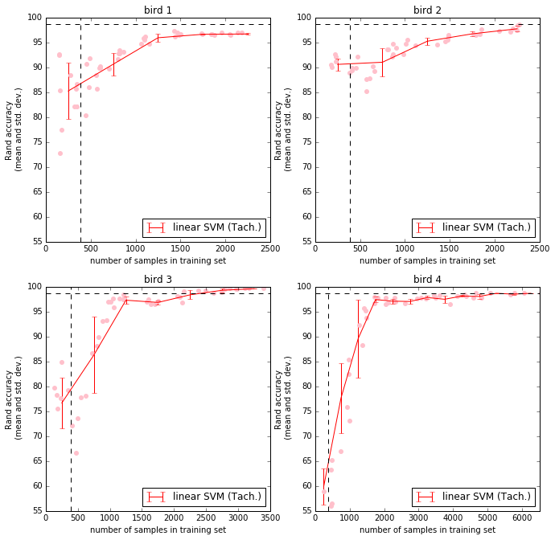
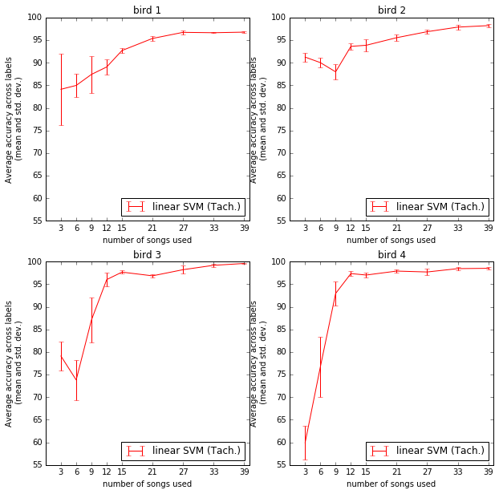
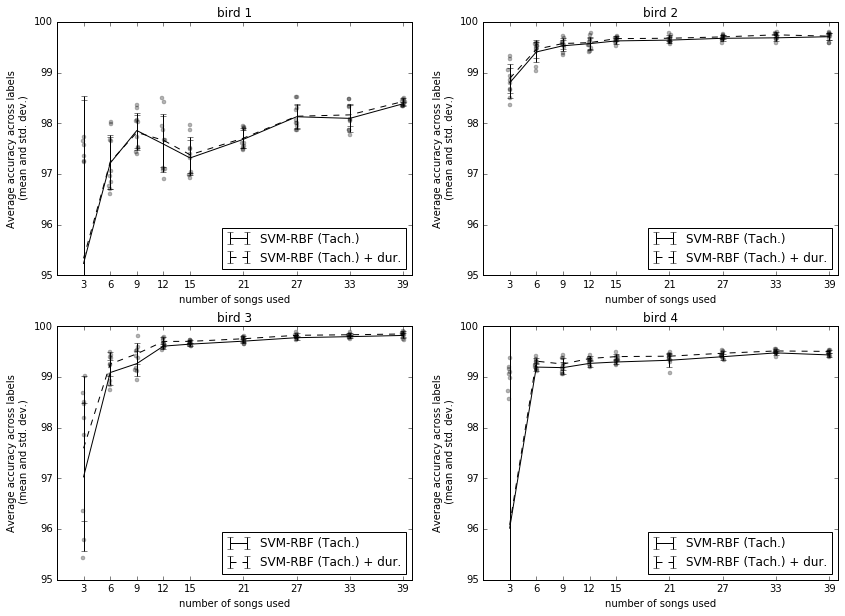

:author: David Nicholson
:email: dnicho4@emory.edu
:institution: Emory University, graduate program in Neuroscience, Biology department

---------------------------------------------------------------------------------
Comparison of machine learning methods applied to birdsong element classification
---------------------------------------------------------------------------------

.. class:: abstract

    Songbirds provide neuroscience with a model system for understanding how the brain learns and produces
    motor skills, such as speech. Similar to humans, songbirds learn their vocalizations from social 
    interactions during a critical period in development. Each bird’s song consists of repeated elements 
    referred to as “syllables”. To analyze song, scientists label syllables by hand, but songbirds can 
    produce hundreds of songs a day, many more than can be labeled. Several groups have developed machine 
    learning algorithms that automate labeling of syllables, but little work has been done comparing these 
    various methods. For example, there are methods using support vector machines (SVM), K-nearest 
    neighbors (KNN), and even a hybrid deep learning system to automate labeling of Bengalese finch song (a 
    species whose behavior has made it the subject of an increasing number of neuroscience studies). Here I 
    compare approaches to classifying Bengalese finch syllables (building on my previous work 
    [https://youtu.be/ghgniK4X_Js]). I propose that the best method is the one that yields the highest accuracy
    from the smallest amount of hand-labeled data. My results show that the previously published SVM method is 
    impaired by syllables in some individuals’ songs, but I can get it to outperform KNN by using a non-
    linear kernel. I then show domain-specific features can be used to further increase accuracy, and that 
    this increase is large enough to affect analysis for data sets of the size used in actual experiments. 
    Testing of machine learning algorithms was carried out using Scikit-learn and Numpy/Scipy via Anaconda. 
    This paper in Jupyter notebook form, as well as code and links to data, are here: 
    https://github.com/NickleDave/ML-comparison-birdsong
    

.. class:: keywords

    machine learning,birdsong,scikit-learn

Introduction
------------

Songbirds provide a model system for the study of learned vocalizations
~~~~~~~~~~~~~~~~~~~~~~~~~~~~~~~~~~~~~~~~~~~~~~~~~~~~~~~~~~~~~~~~~~~~~~~

Like humans, songbirds learn to vocalize during a critical period in development. During that critical period, they require social interactions, sensory feedback, and practice to learn their vocalizations--again, just like humans. Songbirds have a network of brain areas dedicated to learning and producing their song, known as the song system. These brain areas occur only in songbirds, not in birds that do not learn their song. At the same time, the bird brain contains most of the major regions found in the human brain, and studies of songbirds have changed our understanding of certain brain areas, e.g., the basal ganglia. Because of these shared behaviors and brain areas, songbirds provide an excellent model system through which we can understand how the brain learns and produces motor skills like speech that are learned during a critical period in development.

Machine-learning methods for labeling elements of song
~~~~~~~~~~~~~~~~~~~~~~~~~~~~~~~~~~~~~~~~~~~~~~~~~~~~~~~~~~~~~~~~~~~~~~~~

Each bird’s song consists of repeated elements referred to as “syllables”, as shown in :ref:`fig1`.

.. figure:: spect_birdsong.png
    :align: center
    :figclass: w

    **Spectrogram of Bengalese finch song.** *Letters below the time axis, e..g, *i*,*a*,*b*,..., are labels for syllables, discrete elements of song separated by brief silent intervals. Frequency (kHz) on the y axis and time on the x axis.* :label:`fig1`

Each individual has a unique song which usually bears some similarity to the song of the bird that tutored it, but is not a direct copy. To analyze song, experimenters label syllables by hand. However, songbirds produce thousands of songs a day, more than can be labeled.

In order to deal with this mountain of data, some labs have developed automated analyses of birdsong. One popular approach scores songs based on similarity of spectrograms, without labeling syllables [TCHER2000]. Another method uses semi-automated clustering to label syllables, and then measures changes in acoustic and temporal structure of song over days using a distance metric [WU2008]. Other approaches make use of standard supervised learning algorithms to classify syllables, such as hidden Markov Models [KOGAN2008]. While code for some of these automated analyses is freely available, and there are some repositories of song on-line, to my knowledge almost no work has been done to compare the different methods.

I set out to compare methods using one species, the Bengalese finch. This species is of interest for several reasons. For example, Bengalese finches depend heavily on auditory feedback throughout life to maintain their vocalizations, much like humans ([SOBER2009] and references therein). In addition, their song tends to have relatively easy-to-quantify acoustic features (e.g., many of the syllables are *low entropy*, having a pitchy, whistle-like timbre). Several previously-published studies or open-sourced libraries have applied various machine learning techniques to Bengalese finch song, including: support vector machines (SVMs) [TACH2014], and k-Nearest Neighbors (kNNs) [TROYER2012]. Again, no study has compared these methods with open-source code and freely shared data.

Rationale
~~~~~~~~~
In this paper I compare the accuracy and amount of training data required for SVMs and kNNs. My criteria for the *best* algorithm is one which yields the highest accuracy across syllables, i.e., labels, and does so with the smallest amount of training data. To machine learning researchers, it might seem like a foregone conclusion that SVMs would perform better than kNNs, so let me explain why. My initial experiments sought to reproduce the results of Tachibana et al. 2014, using a linear SVM. I found impaired accuracy for some individual birds' songs. This led me to test methods that can yield non-linear decision boundaries, such as kNN, inspired by the Troyer lab's approach [TROYER2012]. Ultimately, as I show below, I find that SVMs yield the highest accuracy with the least amount of training data, if a non-linear kernel is used, along with the features I found that improved accuracy.

Results
----------

Note that all results can be reproduced with the Jupyter Notebook at https://github.com/NickleDave/ML-comparison-birdsong/blob/master/figure_code/ML_comparison_birdsong.ipynb. 

Intro syllables impair the accuracy of linear SVMs
~~~~~~~~~~~~~~~~~~~~~~~~~~~~~~~~~~~~~~~~~~~~~~~~~~~~~~~~~~~~~~~~~~~~~~~~

In initial experiments, I applied the method of Tachibana et al. 2014 to song recorded from Bengalese Finches in our lab. As shown in :ref:`fig2`, I was not able to achieve the same label of accuracy that they reported. This in spite of the fact that I used the exact same features and hyperparameters as Tachibana et al., 2014., and the same library for SVMs [FAN2008]. The black horizontal dashed line on the plots indicates their estimate of accuracy for a *large* data set, and the black vertical line indicates the average number of training samples they used to achieve this accuracy. An important difference between their experiments and mine is that I used actual hand-labeled data sets of the size typically needed for songbird studies, instead of using a smaller hand-labeled set and estimating the accuracy based on how well the smaller set was classified. Please note that I am not saying their results are not reproducible. The authors include feature sets from some birds and scripts with their paper that reproduce the results. I am saying that the method does not work as well on song from some birds recorded in our lab. All the birds I recorded had typical song--there's no reason to expect that something about their song would affect the accuracy. For this reason I set out to compare different methods.

Note that in all figures, the exact same training samples--originally drawn randomly from the training set--are used to train every type of classifier.

    **Accuracy vs. number of songs used to train linear SVM.** *Y axis: Overall accuracy, x axis: number of samples in training set. Dashed horizontal line: average number of training samples used by Tachibana et al 2014. Vertical horizontal line: estimated accuracy using that number of samples.* Note that in no case is the red line near the vertical dashed line. :label:`fig2`

In :ref:`fig3` I show the same data in the way I will present results from now on, where the y axis is accuracy averaged across labels (i.e., syllable types), and the x axis is number of hand-labeled songs used to train the algorithm. I chose accuracy averaged across labels as a metric because the ideal case would be to have all syllables classified well, and the metric should take that into account. I selected a number of songs to train models because typically researchers will label complete songs instead of labeling e.g., "two minutes worth of syllables". Note that in :ref:`fig3` it appears in some cases using more songs gives lower accuracy. Two possible reasons for this effect are: (1) different songs can have different number of syllables, and (2) some syllables will be less ideal for training models than other. With respect to (1), compare :ref:`fig3` with :ref:`fig2` where I plot accuracy v. the number of samples. When plotted by number of samples (binned), the accuracy almost always increases and in fact for two birds does so monotonically. With respect to (2), consider again :ref:`fig2` where the variance is much greater for lower sample numbers, because the effect of a few "less than ideal" training samples can dominate.

    **Accuracy vs. number of songs used to train linear SVM.** *Y axis: average accuracy across labels, x axis: number of songs used to train the linear SVM. Error bars: standard deviation across five replicates.* Note that accuracy is plotted as average accuracy across labels, and that this accuracy is unweighted, i.e., a syllable labeled with low accuracy drops the overall accuracy and does so proportional to the number of times it apears in the test set. :label:`fig3`

One possible reason for this impaired accuracy is the presence of “introductory notes”, low-amplitude, high-entropy syllables that often occur at the start of song (as shown in :ref:`fig4`). Because these syllables have low amplitude, it can be hard to detect their onset and offset, so they will have a much more variable duration than other syllabes. Likewise because they are high entropy, any feature derived from the spectrum will also be more variable. For example, measuring the "pitch" of an intro syllable by finding the frequency where the power spectrum peaks would yield wildly varying values, because there is no consistent peak to measure across renditions of the syllable. These sources of variability probably make it harder to separate intro syllables from other types.

.. figure:: spect_birdsong_intro_notes.png

    **Introductory notes are low-amplitude noisy syllables that often occur at the start of song** *Red boxes indicate introductory notes.* :label:`fig4`

For that reason I tested whether removing intro syllables (as I will refer to them from now on) from the training and test sets would rescue the accuracy of the linear SVM. In their initial experiments, Tachibana et al. 2014 removed intro syllables from song. Removing the intro syllables greatly increased the accuracy I achieved, as shown in :ref:`fig5`.

.. figure:: linsvm_avg_acc_without_intro.png

    **Accuracy vs. number of songs used to train linear SVM, with intro syllables removed from training and test sets.** *Y axis: average accuracy across labels, x axis: number of songs used to train the linear SVM.* Removing intro syllables greatly increased accuracy for three of four birds. :label:`fig5`

k-Nearest Neighbors using domain-specific features produces high accuracy syllable classifcation
~~~~~~~~~~~~~~~~~~~~~~~~~~~~~~~~~~~~~~~~~~~~~~~~~~~~~~~~~~~~~~~~~~~~~~~~~~~~~~~~~~~~~~~~~~~~~~~~

Because I could not achieve a high enough accuracy using linear SVM, I looked for other candidate algorithms, and found that the Troyer lab had previously described the use of k-nearest neighbors (k-NN) as I described above. The feature vectors I fed the k-NN algorithm contained acoustic parameters commonly measured for birdsong analyses, e.g., entropy, amplitude, pitch. My preliminary results using this approach did not yield the accuracy required. I improved accuracy by including in each feature vector the durations of preceding and following syllables and silent gaps that separate syllables (illustrated in :ref:`fig6`). 

.. figure:: features.png

    **Duration features of preceding and following syllables and silent gaps that were added to the vector of features representing each syllable.** :label:`fig6`

As shown in :ref:`fig7`, addition of these features was sufficient to achieve classification accuracy better than the linear SVM with less training samples for three of the four birds.

.. figure:: linsvm_v_knn_avg_acc_by_song

    **Accuracy v. number of songs used to train linear SVM and k-NN algorithms** *Y axis: average accuracy across labels, x axis: number of songs used to train.* In three out of four cases, k-NN yields higher accuracy than linear SVM, and in every case, k-NN yielded higher accuracy with less training data, although linear SVM outperformed k-NN for bird 4 given 15 songs or more. :label:`fig7`

Use of a radial basis function (RBF) rescues SVM accuracy
~~~~~~~~~~~~~~~~~~~~~~~~~~~~~~~~~~~~~~~~~~~~~~~~~~~~~~~~~

Results of the previous experiments suggest that accurate syllable classification requires a non-linear decision boundary, like those provided by k-NN, probably because of the variability in intro syllables. Commonly, the radial basis function (RBF) is used as a non-linear kernel with SVMs to deal with such situations. I again used the same features that Tachibana et al. 2014 used, but replaced the linear SVM with an SVM using an RBF. Hyperparameters for the RBF ('C' and 'gamma') were found for each subset of training samples using grid search. The RBF rescued SVM accuracy.

.. figure:: svmrbf_v_knn_avg_acc_by_song

    **Accuracy v. number of songs used to train k-NN and SVM-RBF algorithms** *Y axis: average accuracy across labels, x axis: number of songs used to train.* SVM-RBF performs better than k-NN for two of the four birds, and for three of the four birds achieves higher than 99% accuracy. :label:`fig8`

Addition of duration features from preceding and following syllables and silent gaps further improves SVM-RBF accuracy
~~~~~~~~~~~~~~~~~~~~~~~~~~~~~~~~~~~~~~~~~~~~~~~~~~~~~~~~~~~~~~~~~~~~~~~~~~~~~~~~~~~~~~~~~~~~~~~~~~~~~~~~~~~~~~~~~~~~~~

If features from preceding and following syllables improve k-NN performance, they might improve the SVM-RBF performance as well. I also tested this. Adding the durations yielded a small (on the order of 0.1%) improvement in average accuracy, but it did improve accuracy in every case (results shown in :ref:`fig9`).

    **Accuracy v. number of songs used to train SVM-RBF and SVM-RBF with duration features added** *Y axis: average accuracy across labels, x axis: number of songs used to train.* In all cases, the added duration features yielded a higher accuracy. :label:`fig9`

Conclusion
----------

The results suggest SVM-RBF provides the highest accuracy across different birds' songs. For three of four birds, labeling as few as fifteen songs by hand provides enough training data to achieve greater than 99.2% average accuracy with SVM-RBF. This is approximately 40 seconds of song (assuming 50 milliseconds per syllable and 50 syllables per song), in comparison to previous papers that reported using a minute of song to achieve such accuracies. The success of SVM-RBF is likely because the kernel allows for non-linear decision boundaries that can separate more variable types of syllables, such as the low-amplitude, high entropy *intro* syllables. Further experiments should determine how well these algorithms deal with the presence of sounds that are not part of song, e.g., calls, movement of the bird on its perch, etc. Such experiments are necessary to further reduce the amount of work required on the part of the experimenter. I expect that the SVM-RBF will succeed in the face of these non-songbird elements as well. As the results above demonstrate, it is important to actually test how the algorithms compare with each other on varied data sets, and to present the results and code used to obtain those results in as accessible a manner as possible.

Methods
----------

Data acquisition
~~~~~~~~~~~~~~~~

Song was recorded from four birds, and two to four days worth of songs from each bird were labeled by hand, using custom software written in Labview and Matlab (the Labview program EvTAF for recording, and associated Matlab code for labeling and analysis [TUMER2007]). In some cases more than one person labeled song from a given bird, but using an agreed upon rubric for the labels given to syllables. Extraordinary attention was given to the labels because the song was used in behavioral experiments that could have potentially changed syllable acoustics and sequence. All the song used in this study, however, was *baseline* song recorded before the behavioral experiments. Hence I am very confident in this ground truth set.

Raw audio files were bandpass filtered to retain signal between 500 hz and 10 kHz, then smoothed with a Hanning filter. The smoothed signal was segmented into syllables by finding where its amplitude crossed a threshold and where the resulting segments were a minimum duration with a minimum interval between them. The threshold, minimum segment duration, and minimum interval between segments were kept constant for all songs from a given bird except in occassional cases where this method segmented the syllable incorrectly (e.g. because of background noise in the recording). 

Feature extraction for use with machine learning algorithms
~~~~~~~~~~~~~~~~~~~~~~~~~~~~~~~~~~~~~~~~~~~~~~~~~~~~~~~~~~~

Once syllables were segmented, features were extracted from them to be used by the machine learning algorithms. Feature extraction was also done with Matlab scripts. See https://github.com/NickleDave/ML-comparison-birdsong/master/feature_extraction_code/ for this code and for equivalents written in Python using the Matplotlib [HUNTER2007] and Numpy [VANDERWALT2011] packages. The Python versions of the code return slightly different values because of floating point error. I do not expect that using the Python code would qualitatively change the results, but I did not test this and mainly include this code to make the Matlab code easier to understand for programmers accustomed to Python. Duration and amplitude features were based on the raw signal; all other features were extracted from spectrograms.

Experiments based on [TACH2014] used the features in that paper, extracted via the code kindly provided by R.O. Tachibana.

For the k-Nearest Neighbor experiments, I used a feature set consisting of: the syllable duration, as well as the duration of the preceding and following syllables, and the preceding and following 'silent gaps' separating the syllables; the Root-Mean-Square amplitude; the spectral entropy; the 'high-low ratio' (power in the 5-10 kHz range / power in the 0-5 kHz range); delta entropy (entropy at 80% of the syllable's duration - entropy at 20% of the syllable's duration); delta high-low ratio (again the difference at 80% and 20% of the syllable's duration).

Comparison of machine learning algorithms
~~~~~~~~~~~~~~~~~~~~~~~~~~~~~~~~~~~~~~~~~

In general, the comparison consisted of an overall script that drew a random sample from a training set, and then used that sample to train all of the machine learning algorithms. The goal was to determine which algorithm could achieve the highest accuracy with the smallest amount of hand-labeled training data. By amount of data, I mean the number of songs used to train the models. I chose "number of songs" as a metric because it is most natural for an experimenter to hand-label a set number of songs. This also guaranteed that the representative number of samples for each syllable in the training set approximated their frequency in the population. Typically less common syllables apparead ~10^3 times in the training set vs. ~10^4 examples for the more common syllables. Preliminary experiments where the same number of samples for each syllable did not produce evidence that this difference in training samples would affect the results. I trained each type of model with (3,6,9,...15,21,27,33,39) songs, and generated 5 replicates for each number of songs. There were three types of models I tested: the linear support vector machine as described in [TACH2014], the k-Nearest Neighbors algorithm, and a support vector machine with a radial basis function as the kernel. Comparison of all machine learning algorithms was greatly facilitated by Scikit-learn [PEDREGOSA2011]. Hence, for the 3-song condition, I picked 3 different songs 5 times, and each time I trained all 3 models with the syllables from those songs, then calculated the accuracy. All feature sets were z-standardized before training.

To ensure that I made every effort to replicate the results from [TACH2014], I used the Liblinear package [FAN2008] directly (as those authors did) instead of the implementation in Scikit-learn (see http://scikit-learn.org/stable/modules/linear_model.html#liblinear-differences). My results were obtained using the Python API (https://github.com/ninjin/liblinear/tree/master/python) compiled for a 64-bit system. I used the exact same hyperparameters for training models that were used in [TACH2014]: L2-regularized L2-loss support vector classification with the cost parameter fixed at 1.

References
----------
.. [TCHER2000] Tchernichovski, Ofer, et al. *A procedure for an automated measurement of song similarity.* Animal Behaviour 59.6 (2000): 1167-1176.

.. [WU2008] Wu, Wei, et al. *A statistical method for quantifying songbird phonology and syntax.* Journal of neuroscience methods 174.1 (2008): 147-154.

.. [KOGAN2008] Kogan, Joseph A., and Daniel Margoliash. *Automated recognition of bird song elements from continuous recordings using dynamic time warping and hidden Markov models: A comparative study.* The Journal of the Acoustical Society of America 103.4 (1998): 2185-2196.

.. [SOBER2009] Sober, Samuel J., and Michael S. Brainard. *Adult birdsong is actively maintained by error correction.* Nature neuroscience 12.7 (2009): 927-931.

.. [TACH2014] Tachibana, Ryosuke O., Naoya Oosugi, and Kazuo Okanoya. *Semi-automatic classification of birdsong elements using a linear support vector machine.* PloS one 9.3 (2014): e92584.

.. [TROYER2012] http://www.utsa.edu/troyerlab/software.html

.. [FAN2008] Fan, Rong-En, et al. *LIBLINEAR: A library for large linear classification.* The Journal of Machine Learning Research 9 (2008): 1871-1874.

.. [TUMER2007] Tumer, Evren C., and Michael S. Brainard. *Performance variability enables adaptive plasticity of ‘crystallized’adult birdsong.* Nature 450.7173 (2007): 1240-1244.

.. [VANDERWALT2011] Van Der Walt, Stefan, S. Chris Colbert, and Gael Varoquaux. *The NumPy array: a structure for efficient numerical computation.* Computing in Science & Engineering 13.2 (2011): 22-30.

.. [HUNTER2007] Hunter, John D. *Matplotlib: A 2D graphics environment.* Computing in science and engineering 9.3 (2007): 90-95.

.. [PEDREGOSA2011] Pedregosa, Fabian, et al. *Scikit-learn: Machine learning in Python.* The Journal of Machine Learning Research 12 (2011): 2825-2830.
