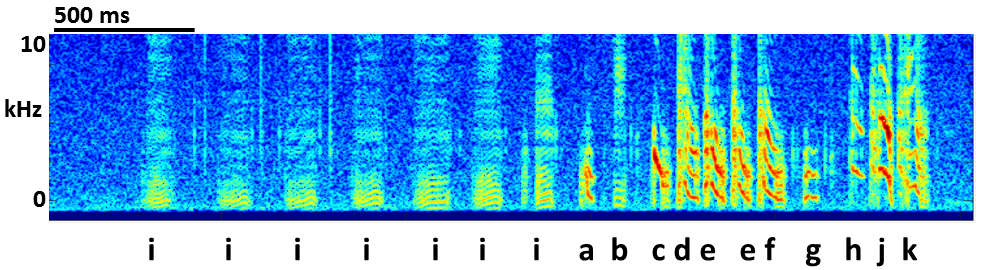
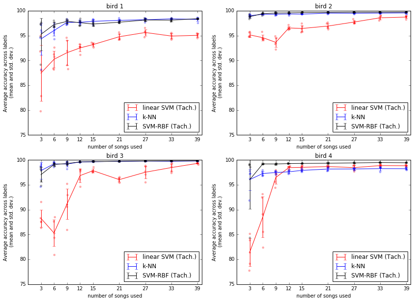
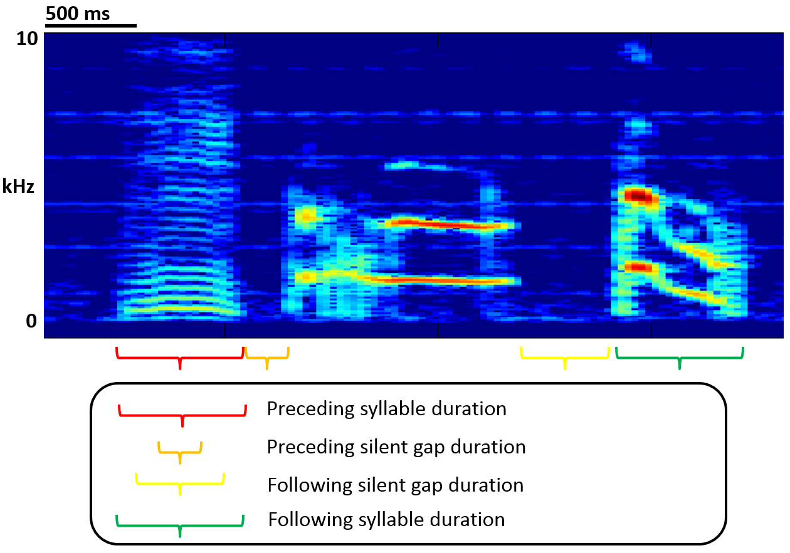
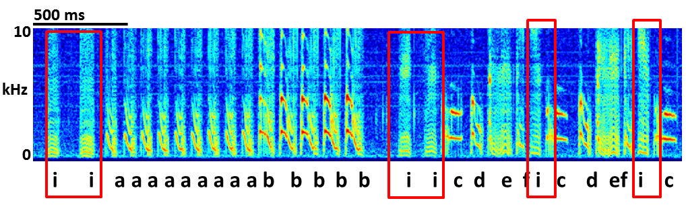
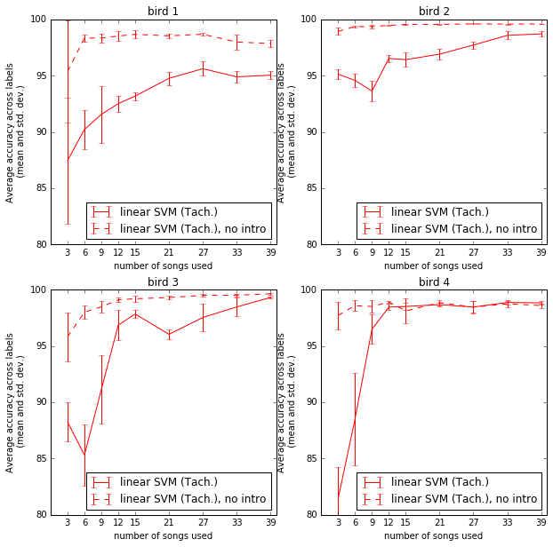
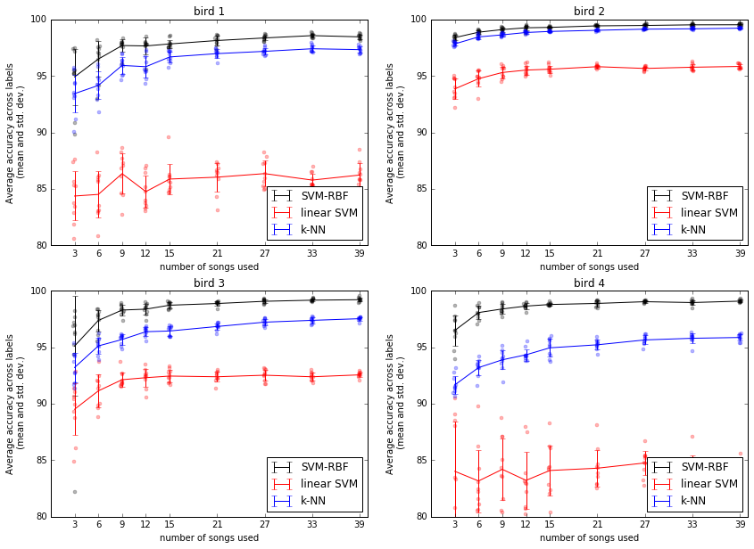
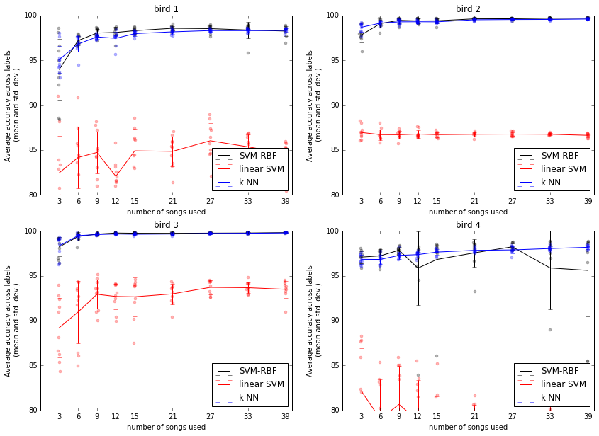

:author: David Nicholson
:email: dnicho4@emory.edu
:institution: Emory University, graduate program in Neuroscience, Biology department

---------------------------------------------------------------------------------
Comparison of machine learning methods applied to birdsong element classification
---------------------------------------------------------------------------------

.. class:: abstract

    Songbirds provide neuroscience with a model system for understanding how the brain learns and produces
    a motor skill similar to speech. Much like humans, songbirds learn their vocalizations from social 
    interactions during a critical period in development. Each bird’s song consists of repeated elements 
    referred to as “syllables”. To analyze song, scientists label syllables by hand, but a bird can 
    produce hundreds of songs a day, many more than can be labeled. Several groups have applied machine 
    learning algorithms to automate labeling of syllables, but little work has been done comparing these 
    various algorithms. For example, there are articles that propose using support vector machines (SVM), K-nearest 
    neighbors (k-NN), and even deep learning to automate labeling song of the Bengalese Finch (a 
    species whose behavior has made it the subject of an increasing number of neuroscience studies). This paper 
    compares algorithms for classifying Bengalese Finch syllables (building on previous work 
    [https://youtu.be/ghgniK4X_Js]). Using a standard cross-validation approach, classifiers were trained on
    syllables from a given bird, and then classifier accuracy was measured with large hand-labeled testing datasets for
    that bird. The results suggest that both k-NN and SVM with a non-linear kernel achieve higher accuracy than
    a previously published linear SVM method. Experiments also demonstrate that the accuracy of linear SVM
    is impaired by "intro syllables", a low-amplitude high-noise syllable found in all Bengalese Finch songs.
    Testing of machine learning algorithms was carried out using Scikit-learn and Numpy/Scipy via Anaconda. 
    Figures from this paper in Jupyter notebook form, as well as code and links to data, are here: 
    https://github.com/NickleDave/ML-comparison-birdsong
    
.. class:: keywords

    machine learning,birdsong,scikit-learn

Introduction
------------

Songbirds as a model system for the study of learned vocalizations
~~~~~~~~~~~~~~~~~~~~~~~~~~~~~~~~~~~~~~~~~~~~~~~~~~~~~~~~~~~~~~~~~~~~~~~

Songbirds provide an excellent model system through which we can understand how the brain learns and produces motor skills like speech [FEE2010]_. Like humans, songbirds learn to vocalize during a critical period in development. During that critical period, they require social interactions, sensory feedback, and practice to learn their vocalizations, just like humans.
The songbird brain contains a network of areas specialized for learning and producing song, known as the song system. These brain areas occur only in songbirds, not in birds that do not learn song (e.g., a pigeon). At the same time, all bird brains contains most of the major regions found in the human brain, and the song system sits within these regions that are conserved across evolution. Because of these similarities, we can learn about how our own brains work by studing the songbird brain. For example, studies of songbirds have contributed greatly to our understanding of the basal ganglia [DOUPE2005]_.

Machine-learning methods for labeling elements of song
~~~~~~~~~~~~~~~~~~~~~~~~~~~~~~~~~~~~~~~~~~~~~~~~~~~~~~~~~~~~~~~~~~~~~~~~

Analysis of birdsong (for neuroscience or the many other fields that study this behavior) typically focuses on "syllables" or "notes", recurring elements in the song. An example song is shown in :ref:`fig1`.

    **Spectrogram of Bengalese Finch song.** *Letters below the time axis, e..g, "i","a","b",..., are labels for syllables, the discrete elements of song separated by brief silent intervals. Frequency (kHz) on the y axis and time on the x axis.* :label:`fig1`

Each individual has a unique song that bears some similarity to the song of the bird that tutored it, but is not a direct copy. To analyze song, experimenters label syllables by hand. Typically the experimenter records one bird at a time while carrying out a behavioral experiment. However, each songbird produces thousands of songs a day, more than can be labeled.

In order to deal with this mountain of data, some labs have developed automated analyses. One popular approach scores songs based on similarity of spectrograms, without labeling syllables [TCHER2000]_. Another method uses semi-automated clustering to label a birds' syllables, and then measures changes in acoustic and temporal structure of song over days using a distance metric [WU2008]_. Other approaches make use of standard supervised learning algorithms to classify syllables, such as Hidden Markov Models [KOGAN2008]_. While code for some of these automated analyses is freely available, and there are some repositories of song on-line, to my knowledge almost no work has been done to compare the different algorithms. Note that the studies in this paper are concerned with training a classifier on *syllables* of *one bird's* song to automate labeling of those syllables, **not** with training a classifier to distinguish the song of one bird from another. 

The experiments in this paper compare three classifiers applied to one species, the Bengalese Finch. This species is of interest for several reasons. Bengalese Finches depend heavily on auditory feedback throughout life to maintain their vocalizations, much like humans ([SOBER2009]_ and references therein). In addition, their song tends to have relatively easy-to-quantify acoustic features (e.g., many of the syllables are "low entropy", having a pitchy, whistle-like timbre). Several previously-published studies or open-sourced packages have applied various machine learning techniques to Bengalese Finch song, including support vector machines (SVMs) [TACH2014]_, and k-Nearest Neighbors (k-NNs) [TROYER2012]_. Again, to my knowledge no study has compared these methods with open source code and openly shared data. This study compares the accuracy and amount of training data required for SVMs and k-NNs, since at the time of the experiments they were the most recently published methods where code was available. As described in the methods section, for linear SVMs the same C-language library and the same features were used as in [TACH2014]_, and for k-NN a set of features similar to those used by [TROYER2012]_ and other songbird researchers was used. The Sci-Kit Learn library [PEDREGOSA2011]_ provided a convenient API to train both k-NN and support vector machines with non-linear kernels for comparison with the linear SVM results.

Methods
----------

All code used can be found at https://github.com/NickleDave/ML-comparison-birdsong/. Instructions to repeat the experiments are in https://github.com/NickleDave/ML-comparison-birdsong/tree/master/experiment_code. Results and data can be downloaded from http://www.nicholdav.info/data. That page includes files of the features used with the machine learning algorithms to train classifiers, and an example day of raw song files from one bird presented in this paper. Instructions for how to use the feature extraction scripts to reproduce the related file of features from that day of song are in https://github.com/NickleDave/ML-comparison-birdsong/tree/master/feature_extraction_code.

Data acquisition
~~~~~~~~~~~~~~~~

Song was recorded from four birds, and two to four days worth of songs from each bird were labeled by hand, using custom software written in Labview and Matlab (the Labview program EvTAF for recording, and associated Matlab code for labeling and analysis [TUMER2007]_). In some cases more than one person labeled song from a given bird, but everyone that labeled song referred to an agreed-upon rubric for the labels given to syllables. Extra attention was given to the labels because the song was used in behavioral experiments that could have potentially changed syllable acoustics and sequence. All the song used in this study, however, was "baseline" song recorded before the behavioral experiments. Hence I am very confident in this ground truth set.

Raw audio files were bandpass filtered to retain signal between 500 hz and 10 kHz, then smoothed with a Hanning filter. The smoothed signal was segmented into syllables by finding where its amplitude crossed a threshold and where the resulting segments were a minimum duration with a minimum interval between them. The threshold, minimum segment duration, and minimum interval between segments were kept constant for all songs from a given bird except in occassional cases where this method segmented the syllable incorrectly (e.g. because of background noise in the recording). 

Feature extraction for use with machine learning algorithms
~~~~~~~~~~~~~~~~~~~~~~~~~~~~~~~~~~~~~~~~~~~~~~~~~~~~~~~~~~~

Once syllables were segmented, features were extracted from them to be used by the machine learning algorithms. Matlab scripts were used for feature extraction. See https://github.com/NickleDave/ML-comparison-birdsong/master/feature_extraction_code/ for this code and for equivalents written in Python using the Matplotlib [HUNTER2007]_ and Numpy [VANDERWALT2011]_ packages. The Python versions of the code return slightly different values because of floating point error. I do not expect that using the Python code would qualitatively change the results, but I did not test this. Duration and amplitude features were based on the raw signal; all other features were extracted from spectrograms.

Experiments based on [TACH2014]_ used the features in that paper, calculated with the code kindly provided by R.O. Tachibana.

For the k-Nearest Neighbor experiments, I used a feature set consisting of: the syllable duration, as well as the duration of the preceding and following syllables, and the preceding and following 'silent gaps' separating the syllables; the Root-Mean-Square amplitude; the spectral entropy; the 'high-low ratio' (power in the 5-10 kHz range / power in the 0-5 kHz range); delta entropy (entropy at 80% of the syllable's duration - entropy at 20% of the syllable's duration); and delta high-low ratio (again the difference at 80% and 20% of the syllable's duration).

Comparison of machine learning algorithms
~~~~~~~~~~~~~~~~~~~~~~~~~~~~~~~~~~~~~~~~~

The goal of comparing algorithms was to determine which could achieve the highest accuracy with the smallest amount of hand-labeled training data. The amount of training data took the form of the number of songs used to train the classifiers. Algorithms were trained by number of songs instead of number of samples because it is most natural for an experimenter to hand-label a set number of songs. This also guaranteed that the frequency of each class of syllable in the training set approximated its frequency in the population. Roughly speaking, less common syllables appeared ~10^3 times in the entire training set while more common syllables appeared ~10^4 times. Preliminary experiments comparing the accuracy of this method to accuracy when the same number of samples for each class was used did not suggest that there was any effect of class imbalance.

Each type of classifier was trained with *k* songs where *k* belongs to the set {3,6,9,...27,33,39}. For each *k*, 5-fold cross validation was used to estimate the accuracy of every classifier. Accuracy was measured as average accuracy across all classes of syllable, because the goal is to achieve the highest accuracy possible for all classes. For every fold, *k* songs were chosen at random from the training set. This training set consisted of one full day of song, ranging from 100-500 songs depending on the bird. After a classifier was trained with the samples in the *k* randomly chosen songs, its accuracy was determined on a separate testing set. The testing set consisted of 1-3 additional days of hand-labeled song; no songs from the training data were used in the testing data.

There were three types of models tested: the linear support vector machine as described in [TACH2014]_, the k-Nearest Neighbors algorithm, and a support vector machine with a radial basis function as the kernel. Hence, for the 3-song condition, 3 different songs were drawn randomly 5 times, and each time all 3 algorithms were trained with the syllables from those songs, and lastly the accuracy was calculated. All feature sets were z-standardized before training.

Comparison of all machine learning algorithms was greatly facilitated by Scikit-learn [PEDREGOSA2011]_. I did use the Liblinear package [FAN2008]_ directly, instead of the implementation in Scikit-learn, to follow as closely as possible the methods in [TACH2014]_ (see http://scikit-learn.org/stable/modules/linear_model.html#liblinear-differences). I interacted with Liblinear through the Python API (https://github.com/ninjin/liblinear/tree/master/python) compiled for a 64-bit system. The hyperparameters were those used in [TACH2014]_: L2-regularized L2-loss with the cost parameter fixed at 1. Both k-Nearest Neighbors (k-NN) and the support vector machine with radial basis function (SVM-RBF) were implemented via Scikit-learn. For k-NN, I weighted distances by their inverse because I found empirically that this improved classification. I did not test other weightings. For SVM, the RBF hyperparameters 'C' and 'gamma' were found for each set of training samples using grid search.

Results
----------

Both k-NN and SVM with a nonlinear kernel yield higher average accuracy than linear SVM
~~~~~~~~~~~~~~~~~~~~~~~~~~~~~~~~~~~~~~~~~~~~~~~~~~~~~~~~~~~~~~~~~~~~~~~~~~~~~~~~~~~~~~~~

The main result of this paper is presented in :ref:`fig2`. It shows that the average accuracy across classes, i.e. song syllables, was higher for k-NN and for SVM with a non-linear kernel than for linear SVM. (The non-linear kernel is a radial basis function, so the classifier will be abbreviated SVM-RBF). The validation curves for k-NN (blue line) and SVM-RBF (black line) rise more quickly than the curve for linear SVM (red line), indicating they achieve higher accuracy with less training data. Also notice that all the curves reach an asymptote, and that for three of four birds, both k-NN and SVM-RBF achieve higher accuracy at this asymptote than linear SVM. For bird 4 (lower right axis), linear SVM eventually achieved higher accuracy than k-NN, given enough training data, but never reached the accuracy of the SVM-RBF classifier.

    **Validation curves showing accuracy vs. number of songs used to train classifiers.** *Y axis: average accuracy across labels, x axis: number of songs used to train the classifiers.* Points are accuracy for each fold of 5-fold cross validation. Validation curves are mean, and error bars are standard deviation across five folds. Red line: linear support vector machine (linear SVM); blue line: k-Nearest Neighbors (k-NN); black line: support vector machine with radial basis function as kernel (SVM-RBF). Note that accuracy is average accuracy across classes, i.e., song syllables. :label:`fig2`

As explained in the Methods section, accuracy was estimated with cross validation. Briefly: random samples were drawn from the training data and accuracy was measured on a completely separate set of testing data. Importantly, the number of samples in the testing data set was roughly on the order of the number of syllables that are hand-labeled for a typical songbird behavioral experiment. (Some previous studies have estimated accuracy for large data sets by bootstrapping from a smaller set of hand-labeled testing data.) Note that the comparison uses accuracy averaged across classes as a metric, because the ideal case would be to have each type of syllable classified perfectly. Note also that classifiers were trained with a number of songs instead of number of samples, because it is typical for a songbird reseacher to label complete songs instead of labeling e.g., 100 samples or "sixty seconds" of syllables. Each time a Bengalese Finch sings its song, it may sing a varying number of syllables. Hence one set of three songs drawn at random from the training data might have a different number of samples than another set. This difference in number of training samples accounts for some of the variance in accuracy scores, but k-NN and SVM-RBF clearly achieve higher accuracy than linear SVM in spite of this added variance.

It is also important to note that the k-NN classifier used a distinct set of features from those used in [TACH2014]_ because of concerns that the number of dimensions would impair k-NN accuracy. (In high-dimensional spaces, everything is close to everything, so the distances used by k-NN to determine nearest neighbor become uninformative, see [BEYER1999]_.) Instead, the k-NN algorithm used a small set of acoustic parameters that are commonly measured in songbird research, in addition to features from neighboring syllables that greatly improved the accuracy of the algorithm. These features from neighboring syllables are schematized in :ref:`fig3`. The SVM-RBF classifier used the exact same features as the linear SVM. Experiments below address the question of whether the differences between classifiers shown in :ref:`fig2` arise from a difference in features used or a difference in the classifiers themselves.

    **Features added that improved k-NN accuracy** :label:`fig3`

Intro syllables impair the accuracy of linear SVMs
~~~~~~~~~~~~~~~~~~~~~~~~~~~~~~~~~~~~~~~~~~~~~~~~~~~~~~~~~~~~~~~~~~~~~~~~

The result in :ref:`fig2` was suprising, given the previously reported accuracy for linear SVMs applied to Bengalese finch song [TACH2014]_. One potential cause for the impaired accuracy of the linear SVM method is the presence in song of “introductory notes”, low-amplitude, high-entropy syllables that often occur at the start of song, hence their name. Examples are shown in :ref:`fig4`. Because these syllables have low amplitude, it can be hard to detect their onset and offset, so the distribution of their duration will have much more variance than other syllabes. Likewise because they are high entropy, any feature derived from the spectrum will also be more variable. For example, measuring the "pitch" of an intro syllable by finding the peak in its power spectrum would yield wildly varying values, because there is no consistent peak to measure across renditions of the syllable. These sources of variability probably make it harder to separate intro syllables from other types.

    **Introductory notes are low-amplitude high-noise syllables that often occur at the start of song** *Red boxes indicate introductory notes.* :label:`fig4`

The next experiment determined whether removing intro syllables from the training and test sets would rescue the accuracy of the linear SVM. For the song of the birds used in this study, removing intro syllables greatly increased accuracy, as shown in :ref:`fig5`. Note that this result is consistent with the findings of [TACH2014]_. In their final set of experiments they found that the syllables most likely to be misclassified were those at the beginning and end of song, i.e., intro syllables. 

    **Accuracy vs. number of songs used to train linear SVM, with intro syllables removed from training and test sets.** *Y axis: average accuracy across labels, x axis: number of songs used to train the linear SVM.* Removing intro syllables greatly increased accuracy for three of four birds. :label:`fig5`

When using the same features to train all models, SVM-RBF still outperforms k-NN that in turn outperforms linear SVM
~~~~~~~~~~~~~~~~~~~~~~~~~~~~~~~~~~~~~~~~~~~~~~~~~~~~~~~~~~~~~~~~~~~~~~~~~~~~~~~~~~~~~~~~~~~~~~~~~~~~~~~~~~~~~~~~~~~~

The results in :ref:`fig2` showed that k-NN and SVM-RBF can yield higher average accuracy than linear SVM. However, the feature set for training the k-NN differed from the feature set for the SVM classifiers. As described above, a different feature set was used for k-NN because of concerns that the 536-dimensional feature vector would yield poor results (see [BEYER1999]_ for an in-depth study of how the number of features affects k-NN accuracy).

This leaves unanswered the question of whether differences in accuracy are due to the features used, or due to the ability of the algorithms to fit models to the feature space (or some combination of both). To address this question, the same approach was used to compare all three algorithms, but this time classifiers were trained with a set of 20 acoustic features from [TACH2014]_. For all 4 birds tested, SVM-RBF acheived higher average accuracy with less training data than k-NN, and k-NN outperformed linear SVM, as shown in :ref:`fig6`.

    **Accuracy v. number of songs used to train SVM-RBF, k-NN, and linear SVM, all trained with the same acoustic features** *Y axis: average accuracy across labels, x axis: number of songs used to train.* :label:`fig6`

All three algorithms were also compared with the feature set originally used for training k-NN classifiers. Here, the results were less clear. As shown in :ref:`fig7`, for three birds, SVM-RBF performed about as well as k-NN, and both performed better than linear SVM. For bird 4, k-NN on average performed better but the replicates showed high variance in the average accuracy.

    **Accuracy v. number of songs used to train SVM-RBF, k-NN, and linear SVM, all trained with features originally used for k-NN** *Y axis: average accuracy across labels, x axis: number of songs used to train.* :label:`fig7`

Conclusion
----------

There are two clear results from these experiments. First, the linear SVM method proposed in [TACH2014]_ is impaired by intro syllables in the songs of Bengalese Finches. Second, use of the radial basis function as a kernel can improve SVM performance when applied to the features in [TACH2014]_.

These results do not answer the question of how often the method of [TACH2014]_ will be impaired by any given bird's song. What can be said is that for two of the four birds tested, average accuracy for linear SVM did not approach 99% until at least 33 songs were used to train the classifier (birds 2 and 3, :ref:`fig2`), and for one bird, average accuracy never went above 97% (bird 1, :ref:`fig2`). By comparison, when training SVM-RBF classifiers with the same feature set, 6 songs was enough to achieve >99% average accuracy for 3 of the 4 birds (as shown in :ref:`fig2`). 

When the feature set is held constant, for all four birds, linear SVM is always outpeformed by k-NN and SVM-RBF. Again, it can not be said based on the results how often this would be the case for any given Bengalese finch's song. But the large difference in average accuracy between linear SVM and the other two methods for the four birds tested here (:ref: `fig6` and :ref: `fig7`) certainly suggests that in general the other two methods will outperform linear SVM. Interestingly, the set of twenty acoustic features developed by [TACH2014]_ yielded what appears to be a large difference in accuracy between the three algorithms. This result shows that instead of using a 536-feature vector with the linear SVM, one can use the 20 features with SVM-RBF, and achieve higher accuracy with less training time and data. (Training time was not measured for each classifier but the experiments in :ref:`fig2` took a week to run while the experiments in :ref:`fig6` took two days to run. This difference was due mainly to the time required for the grid search for SVM-RBF hyperparameters.)

It remains to be tested whether any differences in accuracy translate into meaningful differences in results obtained from analysis of song. That is to say that linear SVMs trained with the original [TACH2014]_ feature set might yield good enough classifiers to detect some changes in song that experimenters care about. Data sets from songbird behavioral experiments, not just from baseline song, should be used to determine whether this is the case.

There are also other issues to be dealt with to make machine learning methods practical for birdsong researchers. One is how well each method can provide an estimate that a given classification is correct. The libSVM library, for example, can provide probability estimates using a computationally expensive 5-fold cross-validation. But, because the soft margin in support vector machine training algorithms allows some misclassifications, some samples will be misclassified yet still appear to have a high probability of being correct. As [KOGAN2008]_ recognized in their study, it is also important to determine how well all of these algorithms deal with the presence of sounds that are not part of song, e.g., calls, wing flaps, etc. Such events are rare enough that they may be difficult to detect without changes to the training algorithm, but frequent enough that if misclassified as syllables they could affect analyses of song.

Taken together, the results here demonstrate the importance of comparing how different classifiers perform in a given problem domain. This comparison is an attempt to build upon the previous studies cited, studies that showed that machine learning methods can facilitate much more fine-grained analyses of birdsong. The results here suggest there are still some issues with practical application of machine learning to birdsong, however. Sharing code, results, and raw data will help resolve these issues and lead to better results for the biologists and machine learning scientists studying birdsong.

Acknowledgements
----------------

Thank you to Samuel J. Sober for supporting this work in every way. I would also like to acknowledge helpful input from Shamim Nemati, Supreeth Prajwal, Alex Dunlap, and Kyle Srivastava. Thanks also to all members of the Sober lab, my science family, especially to Jonah Queen, undisputed champion and reigning king of syllable labeling.

References
----------

.. [DOUPE2005] Doupe, Allison J., et al. *Birdbrains could teach basal ganglia research a new song.* Trends in neurosciences 28.7 (2005): 353-363.

.. [FEE2010] Fee, Michale S., and Constance Scharff. *The songbird as a model for the generation and learning of complex sequential behaviors.* ILAR journal 51.4 (2010): 362-377.

.. [TCHER2000] Tchernichovski, Ofer, et al. *A procedure for an automated measurement of song similarity.* Animal Behaviour 59.6 (2000): 1167-1176.

.. [WU2008] Wu, Wei, et al. *A statistical method for quantifying songbird phonology and syntax.* Journal of neuroscience methods 174.1 (2008): 147-154.

.. [KOGAN2008] Kogan, Joseph A., and Daniel Margoliash. *Automated recognition of bird song elements from continuous recordings using dynamic time warping and hidden Markov models: A comparative study.* The Journal of the Acoustical Society of America 103.4 (1998): 2185-2196.

.. [SOBER2009] Sober, Samuel J., and Michael S. Brainard. *Adult birdsong is actively maintained by error correction.* Nature neuroscience 12.7 (2009): 927-931.

.. [TACH2014] Tachibana, Ryosuke O., Naoya Oosugi, and Kazuo Okanoya. *Semi-automatic classification of birdsong elements using a linear support vector machine.* PloS one 9.3 (2014): e92584.

.. [TROYER2012] http://www.utsa.edu/troyerlab/software.html

.. [BEYER1999] Beyer, Kevin, et al. *When is “nearest neighbor” meaningful?.* Database theory—ICDT’99. Springer Berlin Heidelberg, 1999. 217-235.

.. [FAN2008] Fan, Rong-En, et al. *LIBLINEAR: A library for large linear classification.* The Journal of Machine Learning Research 9 (2008): 1871-1874.

.. [TUMER2007] Tumer, Evren C., and Michael S. Brainard. *Performance variability enables adaptive plasticity of ‘crystallized’adult birdsong.* Nature 450.7173 (2007): 1240-1244.

.. [VANDERWALT2011] Van Der Walt, Stefan, S. Chris Colbert, and Gael Varoquaux. *The NumPy array: a structure for efficient numerical computation.* Computing in Science & Engineering 13.2 (2011): 22-30.

.. [HUNTER2007] Hunter, John D. *Matplotlib: A 2D graphics environment.* Computing in science and engineering 9.3 (2007): 90-95.

.. [PEDREGOSA2011] Pedregosa, Fabian, et al. *Scikit-learn: Machine learning in Python.* The Journal of Machine Learning Research 12 (2011): 2825-2830.
