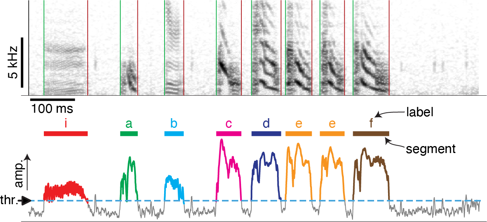
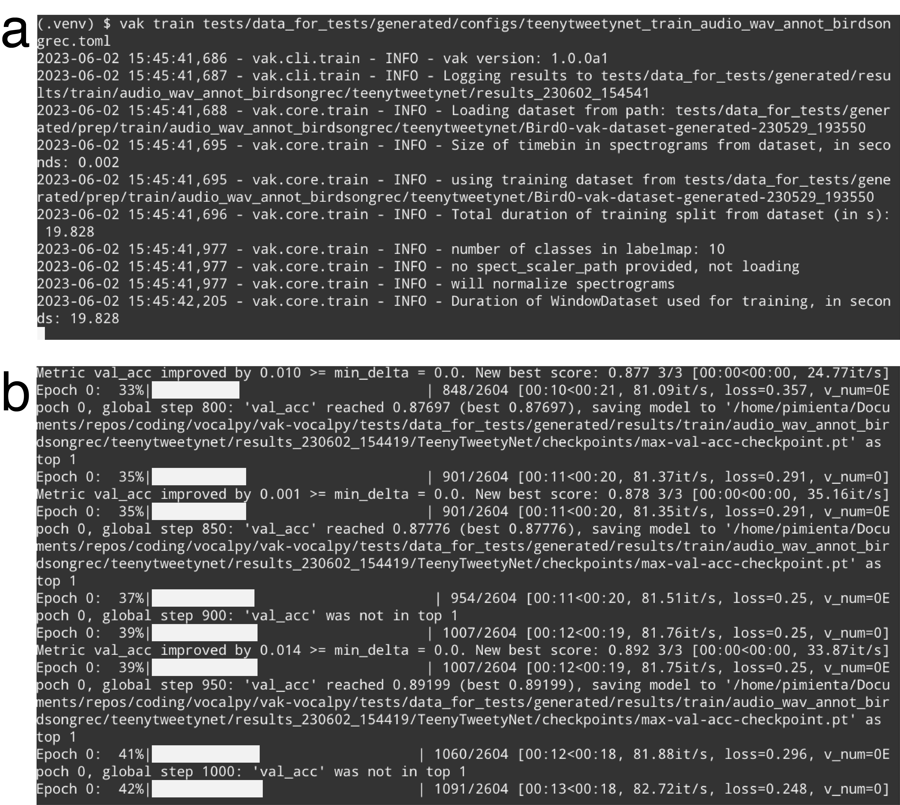
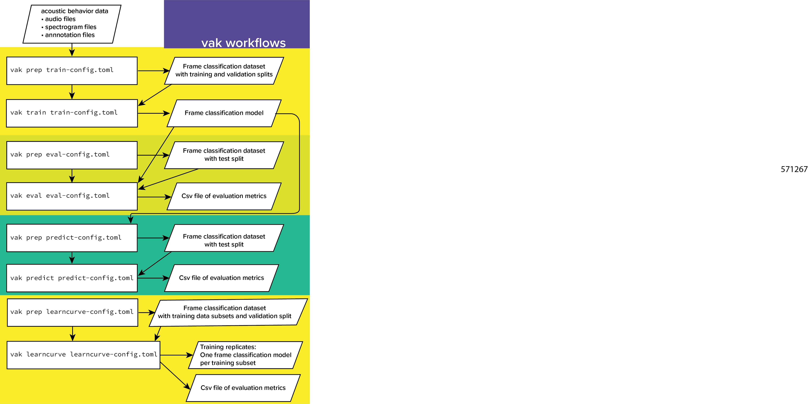
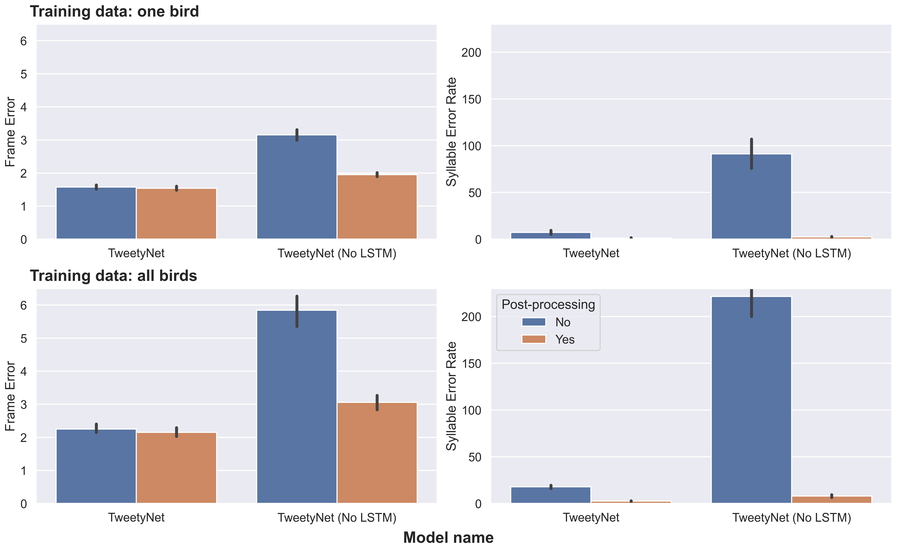
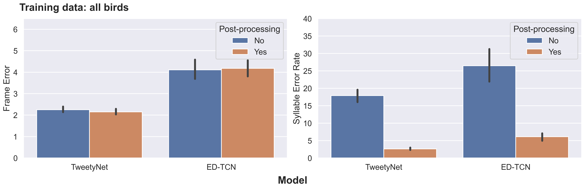
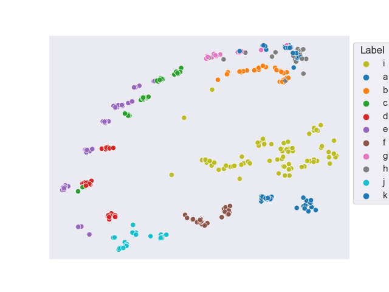

:author: David Nicholson
:email: nicholdav@gmail.com
:institution: Independent researcher, Baltimore, Maryland, USA

:author: Yarden Cohen
:email: yarden.j.cohen@weizmann.ac.il
:institution: Weizmann Institute of Science, Rehovot, Israel

:bibliography: mybib

--------------------------------------------------------------------------------------
vak: a neural network framework for researchers studying animal acoustic communication
--------------------------------------------------------------------------------------

.. class:: abstract

How is speech like birdsong? What do we mean when we say an animal learns their vocalizations?
Questions like these are answered by studying how animals communicate with sound.
As in many other fields, the study of acoustic communication is being revolutionized by deep neural network models.
These models enable answering questions that were previously impossible to address,
in part because the models automate analysis of very large datasets. Acoustic communication researchers
have developed multiple models for similar tasks, often implemented as research code with one of several libraries,
such as Keras and Pytorch. This situation has created a real need for a framework
that allows researchers to easily benchmark multiple models,
and test new models, with their own data. To address this need, we developed vak (https://github.com/vocalpy/vak),
a neural network framework designed for acoustic communication researchers.
("vak" is pronounced like "talk" or "squawk" and was chosen
for its similarity to the Latin root *voc*, as in "vocal".)
Here we describe the design of the vak,
and explain how the framework makes it easy for researchers to apply neural network models to their own data.
We highlight enhancements made in version 1.0 that significantly improve user experience with the library.
To provide researchers without expertise in deep learning access to these models,
vak can be run via a command-line interface that uses configuration files.
Vak can also be used directly in scripts by scientist-coders. To achieve this, vak adapts design patterns and
an API from other domain-specific PyTorch libraries such as torchvision, with modules representing
neural network operations, models, datasets, and transformations for pre- and post-processing.
vak also leverages the Lightning library as a backend,
so that vak developers and users can focus on the domain.
We provide proof-of-concept results showing how vak can be used to
test new models and compare existing models from multiple model families.
In closing we discuss our roadmap for development and vision for the community of users.

.. class:: keywords

   animal acoustic communication, bioacoustics, neural networks

Introduction
------------

Are humans unique among animals?
We seem to be the only species that speaks languages :cite:`hauserFacultyLanguageWhat2002`,
but is speech somehow like other forms of acoustic communication in other animals,
such as birdsong :cite:`doupeBIRDSONGHUMANSPEECH1999`?
How should we even understand the ability of some animals to learn their vocalizations
:cite:`wirthlinModularApproachVocal2019`?
Questions like these are answered by studying how animals communicate with sound :cite:`hopp2012animal`.
As others have argued, major advances in this research will require
cutting edge computational methods and big team science across a wide range of disciplines,
including ecology, ethology, bioacoustics, psychology, neuroscience, linguistics, and genomics
:cite:`sainburgComputationalNeuroethologyVocal2021, stowellComputationalBioacousticsDeep2022, wirthlinModularApproachVocal2019, hauserFacultyLanguageWhat2002`.

Research on animal acoustic communication is being revolutionized by
deep learning algorithms :cite:`sainburgComputationalNeuroethologyVocal2021, stowellComputationalBioacousticsDeep2022, cohen2022recent`.
Deep neural network models enable answering questions that were previously impossible to address,
in part because these models automate analysis of very large datasets.
Within the study of animal acoustic communication, multiple models have been proposed
for similar tasks--we review these briefly in the next section.
These models have been implemented using a range of frameworks for neural networks,
including PyTorch (as in :cite:`cohenAutomatedAnnotationBirdsong2022` and :cite:`goffinetLowdimensionalLearnedFeature2021`),
Keras and Tensorflow (as in :cite:`steinfathFastAccurateAnnotation2021` and :cite:`sainburgFindingVisualizingQuantifying2020`),
and even in programming environments outside Python such as Matlab (as in :cite:`coffeyDeepSqueakDeepLearningbased2019`).
Because of this, it is difficult for researchers to directly compare models,
and to understand how each performs on their own data.
Additionally, many researchers will want to experiment with their own models
to better understand the fit between tasks defined by machine learning researchers and their own question of interest.
All of these factors have created a real need for a framework that allows researchers to easily benchmark models
and apply trained models to their own data.

To address this need, we developed vak :cite:`nicholsonVak2022` (https://github.com/vocalpy/vak),
a neural network framework designed for researchers studying animal acoustic communication.
vak is already in use in at least 10-20 research groups to our knowledge,
and has already been used in several publications, including
:cite:`cohenAutomatedAnnotationBirdsong2022, goffinetLowdimensionalLearnedFeature2021, mcgregorSharedMechanismsAuditory2022, provostImpactsFinetuningPhylogenetic2022`.
Here we describe the design of the vak framework, and explain how vak makes it easy
for acoustic communication researchers to work with neural network models.
We have also recently published an alpha release of version 1.0 of the library,
and throughout this article we highlight enhancements made in this version
that we believe will significantly improve user experience.

Related work
============

First, we briefly review related literature, to further motivate the need for a framework.
A very common workflow in studies of acoustic behavior is to take audio recordings of one individual animal
and segment them into a sequence of units, after which further analyses can be done,
as reviewed in :cite:`kershenbaumAcousticSequencesNonhuman2016`.
Some analyses require further annotation of the units to assign them to one of some set of classes,
e.g. the unique syllables within an individual songbird's song.
An example of segmenting audio of Bengalese finch song into syllables and annotating those syllables is shown in
Figure :ref:`fig:annotation`.

   Schematic of analyzing acoustic behavior as a sequence of units.
   Top panel shows a spectrogram of an individual Bengalese finch's song,
   consisting of units, often called syllables, separated by brief silent gaps.
   Bottom panel illustrates one method for segmenting audio into syllables that are annotated:
   a threshold is set on the audio amplitude to segment it into syllables
   (a continuous period above the threshold), and then a human annotator labels each syllable
   (e.g., with a GUI application).
   Adapted from :cite:`cohenAutomatedAnnotationBirdsong2022`
   under `CC BY 4.0 license <https://creativecommons.org/licenses/by/4.0/>`_. :label:`fig:annotation`

Several models have been developed to detect and classify a large dataset of vocalizations from an individual animal.
These are all essentially supervised machine learning tasks. Some of these models seek to align a neural network task
with the common workflow just described :cite:`kershenbaumAcousticSequencesNonhuman2016`,
where audio is segmented into a sequence of units
with any of several methods :cite:`fukuzawaComputationalMethodsGeneralised2022`,
that are then labeled by a human annotator.
The first family of neural network models reduces this workflow to a
frame classification problem :cite:`graves_framewise_2005, graves_supervised_2012`.
That is, these models classify a series of *frames*,
like the columns in a spectrogram.
Sequences of units (e.g., syllables of speech or birdsong) are recovered from this series of frame classifications with post-processing.
Essentially, the post-processing finds the start and stop times of each continuous run of a single label.
Multiple neural network models have been developed for this frame classification approach,
including :cite:`cohenAutomatedAnnotationBirdsong2022` and :cite:`steinfathFastAccurateAnnotation`.
A separate approach from frame classification models has been to formulate recognition of individual vocalizations
as an object detection problem. To our knowledge this has been mainly applied to mouse ultrasonic vocalizations
as in :cite:`coffeyDeepSqueakDeepLearningbased2019`.

Another line of research has investigated the use of unsupervised models
to learn a latent space of vocalizations. This includes the work of :cite:`sainburgFindingVisualizingQuantifying2020`
and :cite:`goffinetLowdimensionalLearnedFeature2021`. These unsupervised neural network models allow for
clustering vocalizations in the learned latent space, e.g., to efficiently provide a human annotator
with an estimate of the number of classes of vocalizations
in an animal's repertoire :cite:`sainburgFindingVisualizingQuantifying2020`,
and/or to measure similarity between vocalizations
of two different animals :cite:`goffinetLowdimensionalLearnedFeature2021, zandbergBirdSongComparison2022`.
It is apparent that unsupervised approaches are complementary to supervised models
that automate labor-intensive human annotation. This is another reason that a single framework
should provide access to both supervised and unsupervised models.

Methods
-------
In this section we describe the design of vak: its application programming interface (API)
and its command-line interface (CLI). We begin by introducing the design of vak at the highest level.

Design
======

vak relies on PyTorch :cite:`paszkeAutomaticDifferentiationPyTorch2017` for neural networks,
because PyTorch accommodates Pythonic idioms and low-level control flow within networks when needed.
In version 1.0, we have additionally adopted the Lightning library :cite:`falconPyTorchLightning2023` as a backend,
freeing us up as developers to focus on the research domain while benefiting
from the Lightning team's engineering expertise.
Of course, vak relies heavily on the core libraries of the scientific Python stack.
Many functions make use of numpy :cite:`walt_numpy_2011,harris2020array`, scipy :cite:`virtanen_scipy_2019`,
and matplotlib :cite:`Hunter:2007, thomas_a_caswell_2020_4030140`.
In particular, the built-in workflows for preparing datasets make frequent use of pandas :cite:`team_pandas-devpandas_2020`
to work with tabular data formats, and dask :cite:`dask_development_team_dask_2016`
to enable scalable, distributed processing of very large datasets with mixed file formats,
which are common in acoustic communication research.
Functionality for preparing datasets is specifically tailored to the needs of acoustic communication researchers
in other ways as well.
For example, to parse the wide range of annotation formats used by
acoustic communication researchers across disciplines,
we use the pyOpenSci package crowsetta :cite:`nicholson2023crowsetta`.

In terms of its API,
the design of vak is most similar to other domain-specific libraries developed with torch,
such as torchvision :cite:`torchvision2016`, but here the domain is animal acoustic communication research.
(Perhaps surprisingly, many of the models proposed to date in this area are essentially adopted from computer vision.)
Thus, similar to the torchvision API, vak provides modules for
neural network models, operations, transformations for loading data, and datasets.

In addition to its torchvision-like API, vak provides a simple command-line interface
(CLI) that allows researchers to work with neural network models
without requiring significant expertise in Python programming or deep learning.
We first describe the API, so that key concepts have been introduced
when we explain the usage of the CLI.

Models
======

As its name implies, the ``models`` module is where implementations
of neural network models are found.
Our design is focused on a user who wants to benchmark different models
within an established task and data processing pipeline as defined by our framework.
In version 1.0 of vak, we have introduced abstractions that make it easier
for researchers to work with the built-in models
and with models they declare in code outside of the library, e.g., in a script or notebook.
At a high level, we achieved this by adopting the Lightning library as a backend.
By sub-classing the core ``lightning.LightningModule`` class,
we provide users with per-model implementations of methods for training, validation,
and even for forwarding a single batch or sample through the model.
We briefly describe the abstractions we have developed to make it easier to work with models.

Abstractions for declaring a model in vak
=========================================

Our goal is to make it so that a scientist-coder is able to use any of the built-in models,
and experiment with their own models, without needing to contribute code to vak
or to use a developer-focused mechanism like
`entry points <https://packaging.python.org/en/latest/specifications/entry-points/>`_.
To achieve this, we provide a decorator, ``vak.models.model``,
that is applied to a *model definition* to produce a sub-class
of a *model family*.
The ``vak.models.model`` decorator additionally adds any class it decorates to a *registry*.
In the rest of the section we explain these abstractions and how they make it possible to
easily test different models.

A model definition takes the form of a class with four required class variables:
``network``, ``loss``, ``optimizer``, and ``metrics``.
In other words, our abstraction asserts that the definition of a neural network model
consists of the neural network function, the loss function used to optimize the network's parameters,
the optimizer, and the metrics used to assess performance.

To relate a model as declared with a definition to the machine learning tasks
that we implement within the vak framework, we introduce the concept of model *families*.
A model family is represented by a sub-class of the core ``lightning.LightningModule`` class.
Each class representing a family implements family-specific methods:
``training_step``, ``validation_step``, ``prediction_step``, and ``forward``.
In this way, model families are defined operationally:
a model can belong to a family if it accepts the inputs provided by logic
within the training, validation, and prediction steps,
and the model also produces the appropriate outputs needed within those same steps.

With these two abstractions in hand,
we can add models to vak as follows:
we start by applying the ``model`` decorator
to create a new subclass of a model family.
This new subclass has the same name as the class that it decorates,
which is the class representing the model definition.
The decorator then adds a single attribute to this sub-class, the ``definition``,
that is used when initializing a new instance of the specific model.
After creating this sub-class and adding this attribute,
the ``model`` decorator finally registers the model
within the ``vak.models.registry`` module.
This allows other functions within vak
to find the model by its name in the registry.
The registry is implemented with its own helper functions
and module-level ``dict`` variables that are updated by those functions.
We present a listing that demonstrates usage of the abstractions just described.

.. code-block:: python

   from vak.models import (
       model,
       FrameClassificationModel
   )
   from vak.metrics import (
       Accuracy,
       Levenshtein,
       SegmentErrorRate,
   )

   @model(family=FrameClassificationModel)
   class TweetyNoLSTMNet:
       """TweetyNet model without LSTM layer"""
       network = TweetyNetNoLSTM
       loss = torch.nn.CrossEntropyLoss
       optimizer = torch.optim.Adam
       metrics = {
           'acc': Accuracy,
           'levenshtein': Levenshtein,
           'segment_error_rate': SegmentErrorRate,
           'loss': torch.nn.CrossEntropyLoss}
       default_config = {
           'optimizer':
               {'lr': 0.003}
       }

This example is used in an experiment accompanying this paper,
as described below in Results.
That experiment demonstrates how the decorator
enables models to be declared and used in a script outside of vak.
Here we can notice that we apply the ``model`` decorator to the class
``TweetyNoLSTMNet``, which is the model definition.
Notice also that we pass in as an argument to the decorator
the name of the model family that we wish to sub-class,
``FrameClassificationModel``.
When Python's import machinery parses the script,
the model class will be created and added to vak's registry,
so that it can be found by other functions
for training and evaluating models.
The models that are built in to vak use the exact same decorator.

Model families
==============

Having introduced the abstraction needed to declare models within the vak framework,
we now describe the families we have implemented to date.

**Frame classification.** As stated in the Related Work section,
one way to formulate the problem of segmenting audio into sequences of units
so that it can be solved by neural networks
is to classify each frame of audio, or a spectrogram produced from that audio,
and to then recover segments from this series of labeled frames :cite:`graves_framewise_2005, graves_supervised_2012`.

This problem formulation works,
but an issue arises from the fact that audio signals used by acoustic communication
researchers very often vary in length.
E.g., a bout of Bengalese finch birdsong can vary from 1-10 seconds,
and bouts of canary song can vary roughly from 10 seconds to several minutes.
In contrast, the vast majority of neural network models assume a "rectangular" tensor as input and output,
in part because they were originally developed for computer vision applications applied to batches.
One way to work around this issue is to convert inputs of varying lengths into rectangular batches
with a combination of windowing and padding.
E.g., pick a window size :math:`w`, find the minimum number of consecutive non-overlapping strides
:math:`s` of that window that will cover an entire input :math:`x` of length :math:`T`,
:math:`s * w \ge T`, and then pad :math:`x` to a new length :math:`T_{padded} = s * w`.
This approach then requires a post-processing step where the outputs are stitched back together
into a single continuous sequence :math:`x_{padded}`.
The padding is removed by tracking which time bins are padded,
e.g., with a separate vector that acts as a "padded" flag for each time bin.
Of course there are other ways to address the issue of varying lengths,
such as using the ``torch.nn.utils.rnn`` API to pad and unpad tensors
(or using a different family of neural network models).

Because more than one model has been developed that uses this post-processing approach
to solve the problem of frame classification,
we define this as a family of models within vak, the ``FrameClassification`` model.
Both the TweetyNet model from :cite:`cohenAutomatedAnnotationBirdsong2022`
and the Deep Audio Segmenter (DAS) from :cite:`steinfathFastAccurateAnnotation2021` are examples of such models.
We provide an implementation of TweetyNet now built directly into vak in version 1.0.
We also provide a PyTorch implementation of the Encoder Decoder-Temporal Convolutional (ED-TCN) Network,
that was previously applied to frames of video features for an action segmentation task :cite:`lea2017temporal`.
Below in Results we show how vak can be used to benchmark and compare both models on the same dataset.

**Parametric UMAP.**
To minimally demonstrate that our framework is capable of providing researchers
with access to multiple families of models,
we have added an initial implementation of a Parametric UMAP model family.
The original algorithm for UMAP (Uniform Manifold Approximation and Projection)
consists of two steps: computing a graph on a dataset,
and then optimizing an embedding of that graph in a lower dimensional space
that preserves local relationships between points :cite:`mcinnes2018umap`.
The parametrized version of UMAP replaces the second step
with optimization of a neural network architecture :cite:`sainburg2021parametric`.
Because the parametrized version can be used with a wide variety
of neural network functions, we declare this as a family.
We provide an implementation of a single model,
an encoder with a convolutional front-end
that can map spectrograms of units extracted from audio to a latent space.
Our implementation is adapted from https://github.com/elyxlz/umap_pytorch
and https://github.com/lmcinnes/umap/issues/580#issuecomment-1368649550.

Neural network layers and operations
====================================

Like PyTorch, vak provides a module for neural network operations and layers named ``nn``.
This module contains layers used by more than one network.
For example, it includes a 2-D convolutional layer with the ``'SAME'`` padding provided by Tensorflow,
that is used both by the TweetyNet model :cite:`cohenAutomatedAnnotationBirdsong2022`
and by our implementation of the ED-TCN model :cite:`lea2017temporal`.
(PyTorch has added this padding from version 1.10 on, but we maintain our original implementation
for purposes of replicability.)
Another example of an operation in ``vak.nn`` is a PyTorch implementation of the normalized ReLu activation
used by :cite:`lea2017temporal` with their ED-TCN model.

.. _transformations:

Transformations
===============

Like torchvision, vak provides a module for transformations of data
that will become input to a neural network model or will be applied
to the outputs of model, i.e., pre- and post-processing.

**Standardization of spectrograms.** A key transform that we provide for use during training is
the ``StandardizeSpect`` class,
that standardizes spectrograms so they are all
on the same scale, by subtracting off a mean and dividing by a
standard deviation
(often called "normalization").
This transform is distinct from the normalization
done by computer vision frameworks like torchvision,
because it normalizes separately for each frequency bin in the spectrogram,
doing so across all time bins.
Using a scikit-learn-like API,
this ``StandardizeSpect``
is fit to a set of spectrograms,
such as the training set.
The fit transform is saved during training as part of the results
and then loaded automatically by vak for evaluation
or when generating predictions for new data.

**Transforms for frame labels.**
Many of the transforms we provide relate to
what we call *frame labels*,
that is, vectors where each element represents
a label for a time bin from a spectrogram or a sample in an audio signal.
These vectors of class labels are used as targets
when training models in a supervised setting to perform frame classification.

The ``from_segments`` transform is used when loading annotations
to produce a vector of labeled timebins from the segmented units,
which are specified in terms of their onset and offset times
along with their label.

Conversely, the ``to_segments`` takes a vector of labeled timebins
and returns segments, by finding each continuous run of labels
and then converting the onset and offsets from indices in the timebins vector
to times in seconds.
This post-processing transformation can be configured to perform
additional clean-up steps:
removing all segments shorter than a minimum duration,
and taking a "majority vote" within each series of labels
that are bordered by a "background" or "unlabeled" class.

In version 1.0,
we have added the ability to evaluate models
with and without the clean-up steps of the ``to_segments`` transform applied,
so that a user can easily understand
how the model is performing before and after these steps.
This enhancement allows users to replicate a finding
from :cite:`cohenAutomatedAnnotationBirdsong2022`,
which showed, while the TweetyNet model achieved quite low segment error rates
without post-processing, these simple clean-up steps
allowed for significant further reduction of error.
This finding was originally shown with an ad hoc analysis done with a script,
but is now available directly through vak.
This makes it easier for users to compare their model
to a sort of empirical upper bound on performance,
a strong baseline that indicates
the "room for improvement" any given model has.

One more transformation worth highlighting here is the ``to_labels``
transformation, that converts a vector of labeled timebins directly
to labels without recovering the onset or offset times.
Essentially this transform consists of a ``numpy.diff`` operation,
that we use to find the start of each run of continuous labels,
and we then take the label at the start of each run.
This transformation can be efficient when evaluating models
where we want to measure just the segment error rate.
(Of course we preclude the use of other metrics related to onset and offset times
when throwing away that information, but for some research questions the main goal is to simply
have the correct labels for each segment.)

Metrics
=======

Vak additionally declares a ``metrics`` module
for evaluation metrics that are specific to acoustic communication models.
The main metric we have found it necessary to implement at this time
is the (Levenshtein) string edit distance, and its normalized form,
known in speech recognition as the word error rate.
Our results have shown that edit distances such as this are crucial
for evaluating frame classification models.
We provide a well-tested implementation
tailored for use with neural network models.
In version 1.0 of vak,
we have additionally adopted as a dependency the
``torchmetrics`` library,
that makes it easier to compute a wide array of metrics for models.

.. _datasets:

Datasets
========

Lastly, vak provides a ``dataset`` module,
again similar in spirit to the module of the same name in torchvision.
Each family of models has its own dataset class or classes.
We introduce these below,
but first we describe our standardized dataset format.

**Dataset directory format.**
In version 1.0 of vak we have adopted a standard for datasets
that includes a directory structure and associated metadata.
This addressed several limitations from version 0.x:
datasets were not portable because of absolute paths,
and certain expensive computations were done by other commands
that should really have been done when preparing the dataset,
such as validating the timebin size
in spectrograms or generating multiple random subsets
from a training set for learning curves.
A listing that demonstrates the directory structure
and some key contents is shown below.

.. code-block:: bash

   dataset/
     train/
         song1.wav.npz
         song1.csv
         song2.wav.npz
         song2.csv
     val/
         song3.wav.npz
         song3.csv
     dataset.csv
     config.toml  # config used to generate dataset
     prep.log  # log from run of prep
     metadata.json  # any metadata

We can observe from the listing that, after collating files
and separating them into splits as just described,
the files are either moved (if we generated them)
or copied (if a user supplied them) to directories corresponding to each split.
For annotation formats where there is a one-to-one mapping from annotation file
to the file that it annotates, we copy the annotation files to the split
subdirectories as well.
For annotation formats that place all annotations in a single file,
we place this file in the root of the dataset directory.
After moving these files, we change the paths in the pandas dataframe
representing the entire dataset so that they are written relative
to the root of the directory. This makes the dataset portable.
In addition to these split sub-directories containing the data itself,
we note a few other files.
These include a csv file containing the dataset files and the splits they belong to,
whose format we describe next.
They also include the ``metadata.json`` file
that captures important parameters that do not fit well
in the tabular data format of the csv file.
For example, the metadata file for a frame classification dataset
contains the duration of the timebin in every spectrogram.
Finally, we note two other files in a dataset as shown above.
The first is the configuration file used to generate it,
copied into the dataset as another form of metadata.
The second is a log file that captures any other data about choices made during dataset preparation,
e.g., what files were omitted because they contained labels
that were not specified in the labelset option of the configuration file.

**Dataset csv file format.** Next we outline the format of the csv file that represents a dataset.
This csv (and the dataframe loaded from it) has four essential columns:
``'audio_path'``, ``'spect_path'``, ``'annot_path'``, and ``'split'``.
These columns serve as provenance for the prepared dataset.
Each row represents one sample in the dataset,
where the meaning of sample may vary depending on the model family.
For example, a sample for a frame classification model is typically an entire bout of vocalizations,
whereas a sample for a Parametric UMAP model is typically a single unit from the bout.
The csv format allows for tracing the provenance of each sample
back to the source files used to generate the dataset.
Each row must minimally contain either an ``audio_path`` or a ``spectrogram_path``;
if a user provides pre-computed spectrograms, the ``audio_path`` column is left empty.
For models that use these files directly,
the files will be copied into a sub-directory for each split,
and the paths are written relative to the dataset root.
The ``'annot_path'`` column points to annotation files.
These again may be in the split sub-directories with the file that each annotates,
or in the case of a single file will be in the root of the dataset directory,
meaning that this single path will be repeated for every row in the csv.
Logic in vak uses this fact to determine whether annotations can be loaded from a single file
or must be loaded separately for each file when working with models.

Frame classification datasets
==============================

There are two generalized dataset classes for frame classification models in vak.
Both these classes can operate on a single dataset prepared
by the ``vak prep`` command; one class is used for training
and the other for evaluation.
We describe the workflow for preparing this dataset
so that the difference between classes is clearer.
The initial step is to pair data that will be the source of
inputs :math:`x` to a neural network model with the annotations that will be the
source of training targets :math:`y` for that model.
This is done by collecting audio files or array files containing spectrograms from a "data directory",
and then optionally pairing these files with annotation files.
For models that take spectrograms as input,
vak can use audio files to generate spectrograms that are then saved in array files and paired with any annotations.
Alternatively a user can provide pre-computed spectrograms.
This dataset can also be prepared without the targets :math:`y`,
for the case where a model is used to predict annotations for previously unseen data.

**WindowDataset.**
This dataset class represents all possible time windows of a fixed width
from a set of audio recordings or spectrograms.
It is used for training frame classification models.
Each call to ``WindowDataset.__getitem__`` with an ``index`` returns
one window :math:`x` from an audio signal or a spectrogram loaded into a tensor,
along with the annotations that will be the target for the model :math:`y`.
Because this is a frame classification dataset,
the annotations are converted during dataset preparation to vectors of frame labels,
and :math:`y` will be the window from this vector
that corresponds to the window :math:`x`.
This is achieved by using a set of vectors to represent indices of valid windows from the total dataset,
as described in detail in the docstring for the class.
This use of a set of vectors to represent valid windows
also enables training on a dataset of a specified duration
without modifying the underlying data.

**FramesDataset.** As with the ``WindowDataset``,
every call to ``FramesDataset.__getitem__`` returns a single sample from the dataset.
Here though, instead of a window,
the sample will be the entire audio signal or spectrogram :math:`x`
and a corresponding vector of frame labels :math:`y`.
The default transforms used with this dataset
apply additional pre-processing to the sample that facilitate evaluation.
Specifically, the frames :math:`x` and the frame labels :math:`y` in a single sample are
transformed to a batch of consecutive, non-overlapping windows.
This is done by padding both :math:`x` and :math:`y` so their length
is an integer multiple :math:`w` of the window size used when training the model,
and then returning a ``view`` of the sample as a stack of those :math:`w` windows.
Post-processing the output batch allows us to compute metrics on a per-sample basis,
to answer questions such as "what is the average segment error rate per bout of vocalizations?".

Parametric UMAP datasets
========================

For the parametric UMAP model,
we provide a single dataset class, ``ParametricUMAPDataset``.
The underlying dataset consists of single units
extracted from audio with a segmenting algorithm.
The parameters of the dataset class
configure the first step in the UMAP algorithm,
that of building a graph on the dataset before embedding.

.. _cli-config:

Command-line interface and configuration file
=============================================

Having described the API, we now walk through vak's CLI.
An example screenshot of a training run started from the command line is shown in Figure :ref:`fig:cli`.
A key design choice is to avoid any sub-commands or even options for the CLI,
and instead move all such logic to a configuration file.
Thus, commands through the CLI all take the form of ``vak command configuration-file.toml``,
e.g., ``vak train gy6or6_train.toml``.
This avoids the need for users to understand options and sub-commands,
and minimizes the likelihood that important metadata about experiments will be lost because
they were specified as options.
The configuration file follows the TOML format
(`Tom's Obvious Minimal Language <https://toml.io/en/>`_)
that has been adopted by the Python and Rust communities among others.

   Screenshots of vak, demonstrating the command-line interface and logging.
   In top panel (a), an example is shown of using the command-line interface to train a model with a configuration file.
   In the bottom panel (b) an example is shown of how vak logs progress
   and reports metrics during training :label:`fig:cli`

The few commands available through the CLI correspond to built-in,
model-specific workflows.
There are five commands: ``prep``, ``train``, ``eval``, ``predict``, and ``learncurve``.
These commands are shown in :ref:`fig:workflows`
as part of a chart illustrating the built-in workflows,
using as an example a frame classification model as we define them below.
As their names suggest, the commands ``train``, ``eval``, and ``predict``
are used to train a model, evaluate it, and
generate predictions with it once trained.
The ``prep`` and ``learncurve`` commands require more explanation.
A user makes a separate configuration file for each of the other four commands,
but ``prep`` can be used with any configuration file.
As can be seen in the figure,
the typical workflow starts with a call to ``vak prep``,
which prepares a canonicalized form of a dataset
for the specific machine learning task associated with a model,
and then adds the path to that dataset to the configuration file.
Thus, there is a ``prep_frame_classification_dataset`` function
that will be called for the example model in the figure.
If a dataset has already been prepared and is being re-used for another experiment,
this step would not be necessary.
Once any needed dataset is prepared,
the user can run the command related to the model, using the same configuration file.

   A chart showing workflows in vak, using an example a frame classification model
   as defined below. See text for description of workflows. :label:`fig:workflows`

The ``learncurve`` command is used to generate results for a learning curve,
that plots model performance as a function of training set size in seconds.
Although technically a learning curve, its use is distinct from common uses in machine learning,
e.g., looking for evidence of high bias or high variance models.
Instead, the learning curve functionality allows vak users to answer important practical questions for their research.
Most importantly, what is the optimal performance that can be achieved
with the minimum amount of labor-intensive, hand-annotated training data?

Results
-------

In this section we present proof-of-concept results demonstrating the utility of our framework.
The project that produced these results can be found at: https://github.com/vocalpy/scipy-proceedings-2023-vak

Ablation experiment
===================

We first show how vak allows researchers to
experiment with a model not built into the library.
For this purpose, we carry out an "ablation experiment"
as the term is used in the artificial neural network literature,
where an operation is removed from a neural network function
to show that operation plays an important role
in the model's performance.
Using a script, we define a version of the TweetyNet model in
:cite:`cohenAutomatedAnnotationBirdsong2022` without the recurrent
Long Short Term Memory (LSTM) layer (thus "ablating" it).
This model without the LSTM makes a prediction for each frame
using the output of the convolutional layers,
instead of using the hidden state of the recurrent layer
at each time step.
If the hidden state contains features that are useful
for predicting across time steps,
we would expect that "ablating" (removing) it would impair performance.
To show that removing the LSTM layer impairs performance,
we compare with the full TweetyNet model (now built into vak).
For all experiments, we prepared a single dataset
and then trained both models on that same dataset.
We specifically ran learning curves as described above,
but here we consider only the performance using 10 minutes of data for training,
because as we previously reported :cite:`cohenAutomatedAnnotationBirdsong2022`
this was the minimum amount of training data required
to achieve the lowest error rates.
As shown in the top row of Figure :ref:`fig:ablation-experiment`,
ablating the recurrent layer increased the frame error rate
(left column, right group of bars), and this produced
an inflated syllable error rate (right column, right group of bars).

   Ablation experiment carried out by declaring a model in a script using the vak framework.
   Bar plots show frame error (left column) and syllable error rate (right column),
   without post-processing clean-up (blue bars) and with (orange bars).
   Within each axes, the grouped bars on the left indicate results from the TweetyNet
   model built into the vak library, and the grouped bars on the right indicate results from
   a model declared in a script where the recurrent LSTM layer has been removed ("ablated")
   from the TweetyNet architecture.
   In the top row, values are the average across models trained on data from four different
   Bengalese finches, with five training replicates per bird (see text for detail).
   In the bottom row, single models were trained to classify syllables
   from all four birds. :label:`fig:ablation-experiment`

This first result is the average across models trained on datasets
prepared from individual birds in the Bengalese finch song repository dataset :cite:`nicholson_bengalese_2017`,
as we did previously in :cite:`cohenAutomatedAnnotationBirdsong2022`.
(There are four birds, and five training replicates per bird,
where each replicate is trained on different subsets from a larger pool of training data.)
Other studies using the same benchmark data repository
have trained models on datasets prepared from all four birds
:cite:`steinfathFastAccurateAnnotation2021` (so that the model predicts 37 classes,
the syllables from all four birds, instead of 5-10 per bird).
We provide this result for the TweetyNet model with and without LSTM
in the bottom row of Figure :ref:`fig:ablation-experiment`.
It can be seen that asking the models to predict a greater number of classes
further magnified the difference between them (as would be expected).
TweetyNet without the LSTM layer
has a syllable error rate greater than 230%.
(Because the syllable error rate is an edit distance,
it can be greater than 1.0. It is typically
written as a percentage for readability of smaller values.)

Comparison of TweetyNet and ED-TCN
==================================

We next show how vak allows researchers to compare models.
For this we compare the TweetyNet model in :cite:`cohenAutomatedAnnotationBirdsong2022`
with the ED-TCN model of :cite:`lea2017temporal`.
As for the ablation experiment,
we ran full learning curves,
but here just focus on the performance of models trained on 10 minutes of data.
Likewise, the grouped box plots are as in Figure :ref:`fig:ablation-experiment`,
with performance of TweetyNet again on the left and in this case the ED-TCN model
on the right.
Here we only show performance of models trained on data from all four birds
(the same dataset we prepared for the ablation experiment above).
We observed that on this dataset the ED-TCN had a higher frame error and syllable error rate,
as shown in Figure :ref:`fig:TweetyNet-v-EDTCN`.
However, there was no clear difference when training models on individual birds
(results not shown because of limited space).
Our goal here is not to make any strong claim about either model,
but simply to show that our framework makes it possible to more easily compare
two models on the exact same dataset.

   Comparison of TweetyNet model :cite:`cohenAutomatedAnnotationBirdsong2022`
   with ED-TCN model.
   Plots are as in :ref:`fig:ablation-experiment`.
   Each axes shows results for one individual bird from the
   Bengalese finch song repository dataset :cite:`nicholson_bengalese_2017`.
   Bar plots show frame error (left column) and syllable error rate (right column),
   without post-processing clean-up (blue bars) and with (orange bars). :label:`fig:TweetyNet-v-EDTCN`

Applying Parametric UMAP to Bengalese finch syllables with a convolutional encoder
==================================================================================

Finally we provide a result demonstrating that a researcher can apply multiple families of models
to their data with our framework.
As stated above, the vak framework includes an implementation of a Parametric UMAP family,
and one model in this family, a simple encoder network with convolutional layers on the front end.
To demonstrate this model, we train it on the song of an individual bird from
the Bengalese finch song repository.
We use a training set with a duration of 40 seconds total, containing clips of
all syllable classes from the bird's song, taken from songs that were drawn at random
from a larger data pool by the vak dataset preparation function.
We then embed a separate test set.
It can be seen in Figure :ref:`fig:parametric-UMAP` that points that are close to each other
are almost always the same color, indicating that syllables that were given the same label
by a human annotator are also nearer to each other after mapping to 2-D space
with the trained parametric UMAP model.

   Scatter plot showing syllables from the song of one Bengalese finch,
   embeeded in a 2-D space using a convolutional encoder
   trained using the Parametric UMAP algorithm.
   Each marker is a point produced from a spectrograms
   of a single syllable rendition, mapped down to the 2-D space,
   from 40 seconds of training data.
   Colors indicate the label applied to each syllable
   by an expert human when annotating the spectrograms
   with a GUI. :label:`fig:parametric-UMAP`

Discussion
-----------

Researchers studying acoustic behavior need to benchmark multiple
neural network models on their data,
evaluate training performance for different training set sizes,
and use trained models to make predictions on newly acquired data.
Here we presented vak, a neural network framework developed to meet these needs.
In the Methods we described its design and development.
Then in the Results we provide proof-of-concept results demonstrating
how researchers can easily use our framework.

Finally, we summarize the roadmap for further development of version 1.0 of vak.
In the spirit of taking an open approach,
we are tracking issues related to this roadmap on GitHub:
https://github.com/vocalpy/vak/issues/614.
A key goal will be to add benchmark datasets,
generated by running the vak prep command,
that a user can download and use
to benchmark models with publicly shared configuration files.
Another key goal will be to add models that are pre-trained on these benchmark datasets.
Additionally we plan to refactor the prep module
to make use of the vocalpy package :cite:`nicholson_vocalpyvocalpy_2023`,
developed to make acoustic communication research code
in Python more concise and readable.
Another key step will be inclusion of additional models
like those reviewed in the Related Work.
Along with this expansion of existing functionality,
the final release of version 1.0 will include several quality-of-life
improvements, including a revised schema for the configuration file format
that better leverages the strengths of TOML,
and dataclasses that represent outputs of vak,
such as dataset directories and results directories,
to make it easier to work with outputs programmatically.
It is our hope that these conveniences
plus the expanded models and datasets
will provide a framework that
can be developed collaboratively by the entire
research community studying acoustic communication in animals.
