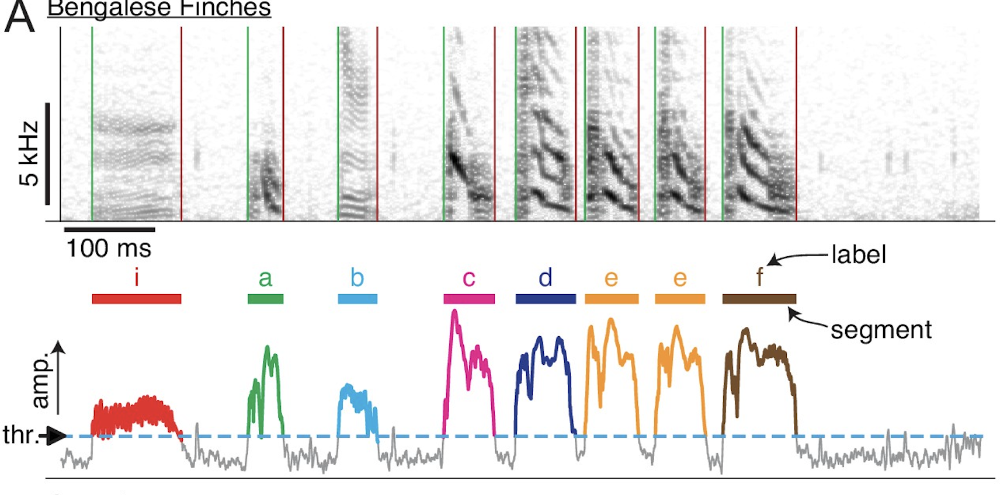
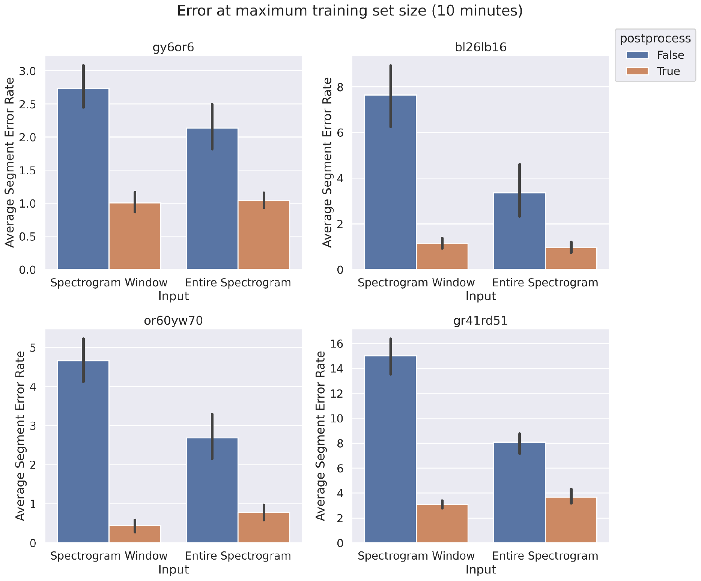

:author: David Nicholson
:email: nicholdav@gmail.com
:institution: Independent researcher

:author: Yarden Cohen
:email: yarden.j.cohen@weizmann.ac.il
:institution: Weizmann Institute of Science

:bibliography: mybib

:video: "https://www.youtube.com/watch?v=Hz1JWzyvv8A"

--------------------------------------------------------------------------------------
vak: a neural network framework for researchers studying animal acoustic communication
--------------------------------------------------------------------------------------

.. class:: abstract

How is speech like birdsong? What does it mean for animal to learn their vocalizations?
Questions like these are answered by studying how animals communicate with sound.
As in many other fields, the study of acoustic communication is being revolutionized by deep neural network models.
These models enable answering questions that were previously impossible to address,
in part because the models automate analysis of very large datasets. Acoustic communication researchers
have developed multiple models for similar tasks, often implemented as research code with several different libraries,
such as Keras and Pytorch. This situation has created a real need for a framework
that allows researchers to easily test models with their own data and to benchmark
and adapt multiple models to their use cases. To address this need, we developed vak (https://github.com/vocalpy/vak),
a neural network framework designed for acoustic communication researchers. Here we describe the design of the vak,
and explain how vak makes it easy for researchers to apply neural network models to their own data.
We highlight improvements made in version 1.0 that we believe will significantly improve user experience with the library.
To provide researchers without expertise in deep learning access to these models,
vak can be run via a command-line interface that uses configuration files.
Vak can also be used directly in scripts by scientist-coders. To achieve this, vak adopts design patterns and
an API from other domain-specific PyTorch libraries such as torchvision, with modules representing
neural network operations, models, datasets, and transformations for pre- and post-processing.
vak also leverages the lightning framework as a backend, so that researchers and developers can focus on the domain.
We provide proof-of-concept results showing how vak can be used with benchmark datasets to compare models.
In closing we discuss our roadmap for development and vision for the community of users.

.. class:: keywords

   animal acoustic communication, bioacoustics, neural networks

.. _intro:

Introduction
------------

Are humans unique among animals? We seem to be the only species that speak languages :cite:`hauserFacultyLanguageWhat2002`,
but is speech somehow like other forms of acoustic communication in other animals, such as birdsong :cite:`doupeBIRDSONGHUMANSPEECH1999`?
How should we even understand the ability of some animals to learn their vocalizations? 
Is it a spectrum :cite:`petkovBirdsPrimatesSpoken2012`, 
a multi-dimensional behavior :cite:`vernesMultidimensionalNatureVocal2021`, 
a set of modular abilities :cite:`wirthlinModularApproachVocal2019`, 
or even a continuum :cite:`martinsSoundProductionLearning2020, martinsVocalLearningContinuum2020`? 
Questions like these are answered by studying how animals communicate with sound :cite:`hopp2012animal`. 
This research requires cutting edge computational methods and big team science across a wide range of disciplines, 
including ecology, ethology, bioacoustics, psychology, neuroscience, linguistics, 
and genomics :cite:`sainburgComputationalNeuroethologyVocal2021, stowellComputationalBioacousticsDeep2022, wirthlinModularApproachVocal2019, hauserFacultyLanguageWhat2002`.

As in many other domains, this research is being revolutionized by
deep learning algorithms :cite:`sainburgComputationalNeuroethologyVocal2021, stowellComputationalBioacousticsDeep2022`.
Deep neural network models enable answering questions that were previously impossible to address,
in part because these models automate analysis of very large datasets.
Within the study of animal acoustic communication, multiple models have been proposed
for similar tasks--we review these briefly in the next section.
These models have been implemented using a range of frameworks for neural networks,
including PyTorch (as in :cite:`cohenAutomatedAnnotationBirdsong2022` and :cite:`goffinetLowdimensionalLearnedFeature2021`),
Keras and Tensorflow (as in :cite:`steinfathFastAccurateAnnotation2021` and :cite:`sainburgFindingVisualizingQuantifying2020`),
and even in programming environments outside Python such as Matlab (as in :cite:`coffeyDeepSqueakDeepLearningbased2019`).
Because of this, it is difficult for researchers to directly compare models,
and to understand how each performs on their own data.
Additionally, many researchers will want to experiment with their own models
to better understand the fit between tasks defined by machine learning researchers and their own question of interest.
All of these factors have created a real need for a framework that allows researchers to easily benchmark models
and apply trained models to their own data.

To address this need, we developed vak :cite:`nicholsonVak2022` (https://github.com/vocalpy/vak),
a neural network framework designed for researchers studying animal acoustic communication.
vak is already in use in at least 10-20 research groups to our knowledge,
and has played a key role in publications that
benchmark a neural network model for segmenting and annotating birdsong :cite:`cohenAutomatedAnnotationBirdsong2022`;
develop dimensionality reduction models for animal vocalizations :cite:`goffinetLowdimensionalLearnedFeature2021`
(where models trained with vak were used to segment song for downstream processing by another model);
for behavioral experiments studying the basis of vocal learning  :cite:`mcgregorSharedMechanismsAuditory2022`;
and to study how transfer learning in neural network models trained on bioacoustics data
is impacted by phylogenetic distance between species :cite:`provostImpactsFinetuningPhylogenetic2022`.
Here we describe the design of the vak framework, and explain how vak makes it easy
for acoustic communication researchers to work with neural network models.
We have also recently released version 1.0 of the library (currently in alpha),
and throughout we highlight improvements made in version 1.0 that we believe will significantly improve user experience
with the library.

.. _related-work:

Related work
============

First, we briefly review related work, to further motivate the need for a framework
to compare neural network models designed for acoustic communication researchers.
We begin by explaining how the study of acoustic communication is distinct from bioacoustics more generally.
Readers may be familiar with the use of approaches from bioacoustics to identify species present from a sound recording,
as is done in passive acoustic monitoring. In contrast, the study of acoustic communication
is often focused on how an individual communicates within a population.
In species that are capable of vocal learning, such as songbirds, each individual will have a unique vocalization,
often similar to the song of the tutor it learned from,
and so many analyses measure the similarity of the vocalizations
between individuals :cite:`tchernichovskiProcedureAutomatedMeasurement2000, kershenbaumQuantifyingSimilarityAnimal2015`.
For this reason, a very common workflow is to segment sounds from one animal into a sequence of units,
e.g., the syllables of birdsong, after which further analyses can be done :cite:`kershenbaumAcousticSequencesNonhuman2016`.
Many such analyses require further annotation of the units to assign them to one of some set of classes,
e.g. the unique syllables within an individual bird's repertoire.
An example of segmenting audio and annotating is shown in
Figure :ref:`fig:annotation`. These analyses include describing the repertoire size of individuals
and species :cite:`robinsonSpecieslevelRepertoireSize2019, elieVocalRepertoireDomesticated2016`,
fitting statistical models of the sequences :cite:`markowitz_long-range_2013, kakishitaEthologicalDataMining2009`.
Such data can also form the basis of further modeling,
e.g. agent-based models of how birdsong evolves
in a population :cite:`youngbloodContentBiasCultural2022, hudsonModelingHowPopulation2022`,
or machine learning models that ask what information is present
in the calls of individuals :cite:`smith-vidaurreIndividualSignaturesOutweigh2020, pratEverydayBatVocalizations2016`
or in populations :cite:`barkerCulturalTransmissionVocal2021,petersonUnsupervisedDiscoveryFamily2023`.
It should be said that in bioacoustics more generally, there is very much interest in identifying
individual animals :cite:`linhartPotentialAcousticIndividual2022`.
We recognize that there is probably more overlap than difference between these disciplines,
and emphasize that we are simply illustrating these questions
for the benefit of a general reader that may not be acquainted with them.

   Representative example of an individual Bengalese finch's song.
   Top panel shows a spectrogram of the song, consisting of units often called syllables
   separate by brief silent gaps.
   Bottom panel shows a typical workflow used to locate syllables and then annotate them:
   a threshold is set on the audio amplitude to segment it into syllables
   (a continuous period above the threshold), and then a human annotator labels each syllable
   (e.g., with a GUI application) :label:`fig:annotation`

Several models have been developed to detect and classify a large dataset of vocalizations from an individual animals.
These are all essentially supervised learning tasks. Some of these models seek to align a neural network task
with the common workflow just described :cite:`kershenbaumAcousticSequencesNonhuman2016`,
where audio is segmented into a sequence of units
with any of several methods :cite:`fukuzawaComputationalMethodsGeneralised2022`,
and those units are then often be labeled by a human annotator.
The first family of neural network models reduces this segmenting task to a
frame classification problem :cite:`graves_framewise_2005, graves_supervised_2012`.
That is, these models classify every frame in audio or time bin in a spectrogram.
Sequences of units are received from this series of predictions for each time step in a post-hoc manner.
Essentially, the post-processing finds the start and stop times of each continuous run of a single label.
Multiple architectures have been developed for this frame classification approach alone.
:cite:`koumura_automatic_2016-1` developed a convolutional network with a sliding window,
and combined this with clean up of the predictions by Hidden Markov Models applied to the sequences of segment labels.
:cite:`cohenAutomatedAnnotationBirdsong2022` train an end-to-end neural network model with a
combined convolutional-recurrent neural network architecture to map from spectrogram windows to labeled time bins,
and show that this provides both segmenting and annotation of new data.
Importantly, they compare with standard machine learning models such as those in scikit-learn
that have been applied to features extracted from segments :cite:`nicholson2016comparison, tachibana2014semi`.
:cite:`steinfathFastAccurateAnnotation` similarly propose a temporal convolutional network
that maps directly from audio to predictions for each frame, with an optional trainable layer
for converting audio to spectrograms.
These authors demonstrate the applicability of their method to a wide range of species.
Other similar works include those of :cite:`trouvainCanarySongDecoder2021`
and :cite:`renteriaBirdsongPhraseVerification2021`.
We note here that the same problem could of course be solved by
sequence-to-sequence models :cite:`sutskeverSequenceSequenceLearning2014,vaswaniAttentionAllYou2017`,
which as the name implies solve the problem of mapping from one sequence to another
without being limited to the case where each sequence has the same cardinality
(i.e., one output :math:`y_t` for each input :math:`x_t`).
A main goal of vak is to provide an experimental testbed to directly compare such models
for the use cases of acoustic communication researchers.
Especially for researchers that are working with relatively small datasets :cite:`arnaudImprovingWorkflowCrack2022`
in resource-constrained environments, it may prove more accessible for them to use well-established models,
regardless of whether such models are considered state-of-the-art by the neural network research community.
A separate approach from frame classification models has been to formulate recognition of individual vocalizations
as an object detection problem. To our knowledge this has been mainly applied to mouse ultrasonic vocalizations
as in :cite:`coffeyDeepSqueakDeepLearningbased2019`. A related line of research uses unsupervised models
to learn a latent space of vocalizations. This includes the work of :cite:`sainburgFindingVisualizingQuantifying2020`
and :cite:`goffinetLowdimensionalLearnedFeature2021`. These unsupervised neural network models allow for
clustering vocalizations in latent space, e.g., to efficiently provide a human annotator
with an estimate of the number of classes of vocalizations
in an animal's repertoire :cite:`sainburgFindingVisualizingQuantifying2020`,
and/or to measure similarity between vocalizations
of two different animals :cite:`goffinetLowdimensionalLearnedFeature2021`.
It is apparent that unsupervised approaches are complementary to supervised models
that can automate costly human annotations, and this is another reason that a single framework
should provide access to both supervised and unsupervised models.

.. _methods:

Methods
-------

.. _design:

Design
======

First we describe the design of vak at a high level.
It relies on PyTorch :cite:`paszkeAutomaticDifferentiationPyTorch2017` for neural networks,
because that library allows for Pythonic idioms and low-level design when needed.
In version 1.0, we have additionally adopted the Lightning framework :cite:`falconPyTorchLightning2023` as a backend,
freeing us up as developers to focus on the research domain while benefiting
from the Lightning team's engineering expertise. In terms of its top-level API,
the design of vak is most similar to other domain-specific libraries developed with torch,
such as torchvision :cite:`torchvision2016`, but here the domain is animal acoustic communication research.
(Perhaps surprisingly, many of the models proposed to date in this area are essentially adopted from computer vision,
and we have not to date found a need to rely on the torchaudio library, although this could change in future versions.)
Thus, similar to the torchvision API, vak provides modules for
neural network models, operations, transformations for loading data, and benchmark datasets.

In addition to this torchvision-like API, vak provides a command-line interface
that allows researchers to work with neural network models
without requiring significant coding and deep learning expertise.
We also provide built-in workflows for preparing datasets for use with neural network models.
The built-in workflows for preparing datasets rely heavily on pandas :cite:`team_pandas-devpandas_2020`
for tabular data formats, and dask :cite:`dask_development_team_dask_2016` for scalable, distributed processing
of very large datasets like those that form the basis of acoustic communication research.
This functionality is specifically tailored to the needs of acoustic communication researchers.
For example, to parse the wide range of annotation formats used by
acoustic communication researchers across disciplines,
we use the pyOpenSci package crowsetta :cite:`nicholsonCrowsetta2022`.
Finally we emphasize that vak depends heavily on the core libraries of the scientific Python stack,
such as numpy :cite:`walt_numpy_2011,harris2020array`, scipy :cite:`virtanen_scipy_2019`,
and matplotlib :cite:`Hunter:2007, thomas_a_caswell_2020_4030140`.

.. _models:

Models
======

Abstraction for declaring a model in vak
~~~~~~~~~~~~~~~~~~~~~~~~~~~~~~~~~~~~~~~~

In the initial version of vak, we developed a ``Model`` class with methods
for training and evaluating a neural network model and for generating new predictions for unseen data with a trained model.
However, this class exhibited some limitations; notably it was designed so that a user would instantiate 
with a class method that requires a configuration in the form of a Python ``dict``. 
This works fine when loading the configuration from a declarative file, 
but it is cumbersome to construct such a configuration in an interactive environment such as a Jupyter notebook. 
Another limitation was that this model class could only run methods like ``train`` on an entire dataset, 
and could not for example run inference on a single data sample or a single batch. 
Furthermore, the class did not fully leverage hardware and the training capabilities of PyTorch, 
as it was simply a lightweight design that abstracted away details of an imperative training script.
In version 1.0 we have addressed these issues by adopting the lightning library as a backend. 
This allows us to leverage the engineering strengths of the lightning developers while we focus on the domain-specific details 
that our framework needs to provide. We additionally sought to make it possible for researchers 
to make use of this framework as simply as possible. 
Our design is focused on a user who wants to explore how different architectures impact performance, 
within an established task and data processing pipeline as defined by our framework. 
To achieve this, we declare a set of abstractions.
First, we require that a model be defined using a ``vak.models.ModelDefinition``. 
This model definition takes the form a dataclass with four required attributes: ``network``, ``loss``, ``optimizer``, and ``metrics``. 
In other words, this abstraction considers the minimum definition of a neural network model 
to include not only the network architecture but additionally the loss function, the optimizer, and metrics. 
This definition is in line with those adopted by other frameworks, notably the Lightning library itself.

To relate a model as declared with a ``ModelDefinition`` to the machine learning tasks that we implement within the vak framework,
we introduce the concept of model *families*. A model family is represented by a sub-class of the core ``LightningModel`` class,
with each class representing a family having set implementations of the training step, validation step, and prediction step. 
In this way, model families are defined operationally: a model can belong to a family if it accepts the inputs provided by logic 
within the training, validation, and prediction steps, and the model also produces the appropriate outputs needed within those same steps.
To link a ``ModelDefinition`` to a family, we provide a decorator, ``vak.models.model``,
that is applied to the dataclass representing the model definition, 
and takes as an argument the name of one of the classes representing a family of models. 
To make this abstraction slightly clearer, we include in the following listing the definition of the TweetyNet model within our framework:

.. code-block:: python

   from vak.models import (
       model,
       WindowedFrameClassificationModel
   )
   
   @model(family=WindowedFrameClassificationModel)
   class TweetyNet:
       network = nets.TweetyNet
       loss = torch.nn.CrossEntropyLoss
       optimizer = torch.optim.Adam
       metrics = {'acc': metrics.Accuracy,
                  'levenshtein': metrics.Levenshtein,
                  'segment_error_rate': metrics.SegmentErrorRate,
                  'loss': torch.nn.CrossEntropyLoss`
       default_config = {
           'optimizer':
               {'lr': 0.003`
               {'lr': 0.003}
           }

.. _model-families:

Model families
~~~~~~~~~~~~~~

Having introduced the abstraction needed to declare models within the vak framework,
we now describe the families we have implemented to date.

**Windowed frame classification model.** As described in Section :ref:`related-work`,
one way to formulate the problem of segmenting audio into sequences of units
so that it can solved by neural networks
is to classify each frame of audio, or a spectrogram produced from that audio,
and to then recover segments from this series of labeled frames.

This problem formulation works,
but an issue arises from the fact that audio signals used by acoustic communication
researchers very often vary in length.
E.g., a bout of Bengalese finch birdsong can vary from 1-10 seconds,
and bouts of canary song can vary roughly from one to several minutes.
In contrast, the vast majority of neural network models assume a "rectangular" tensor as input and output,
in part because they were originally developed for computer vision applications applied to batch.
The simplest fix for this issue is to convert inputs of varying lengths into rectangular batches
with a combination of windowing and padding.
E.g., pick a window size $w$, find the minimum number of consecutive non-overlapping strides :math:`s` of that window
that will cover an entire input :math:`x` of length :math:`T`, :math:`s * w \ge T`, and then pad :math:`x`
to a new length :math:`T_{padded} = T + ((s * w) - T`.
This approach then requires a post-processing step where the outputs are stitched back together
into a single continuous sequence :math:`x_padded`, and the padding is removed by somehow tracking or denoting which time bins are padded,
e.g., with a separate vector that acts as a "padded" flag for each time bin.

Because more than one model has been developed that uses this post-processing approach to solve the problem of frame classification,
we define this as a family of models within vak, the ``WindowedFrameClassification`` model.
Both the TweetyNet model from :cite:`cohenAutomatedAnnotationBirdsong2022`
and the Deep Audio Segmenter (DAS) from :cite:`steinfathFastAccurateAnnotation2021` are examples of such models,
and we provide implementations of both in vak.

**Frame classification model.**

Of course, one need not assume that inputs are rectangular.
Many neural network libraries offer functionality for dealing with this in various ways.
For example, PyTorch provides an API for "packing" and "unpacking" sequences
that are fed into recurrent neural networks.
This is mainly meant for NLP researchers
that are training models on sequences of tokens of varying lengths,
but the same API can in principle be used for other modalities of data
such as the audio and spectrogram inputs we are concerned with here.
To provide a model that can accept inputs of varying lengths,
and remove the need for post-processing steps that stitch these batches of windows
back together into single sequences,
we provide a ``FrameClassificationModel``.
Below in Section :ref:`results` we compare the original TweetyNet,
that was trained on batches of random spectrogram windows,
with a new implementation that operates on entire bouts of song.
I.e., the original implementation is now a
``WindowedFrameClassification`` model within version 1.0 of vak,
and this new version is simply a ``FrameClassification`` model.

Neural network layers and operations
====================================

Like PyTorch, vak provides a module for neural network operations and layers.
At this time we offer a single operation,
a specialized cross-entropy loss function,
``vak.nn.loss.CrossEntropyLoss``.
This function is standard cross-entropy loss,
but it is adapted to work with the output of frame classification networks
that are padded because they use the pad-pack API of PyTorch.
This is needed for our ``FrameClassification`` family of models.

.. _transformations:

Transformations
===============

Like torchvision, vak provides a module for transformations of data
that will become input to a neural network model or will be applied
to the outputs of model, i.e., pre- and post-processing.

**Standardization of spectrograms.** A key transform that we provide for use during training is
the ``StandardizeSpect`` class,
that standardizes spectrograms so they are all
on the same scale, by subtracting off a mean and dividing by a
standard deviation
(often called "normalization").
This transform is distinct from the normalization
done by computer vision frameworks like torchvision,
because it normalizes separately for each frequency bin in the spectrogram,
doing so across all time bins.
Using a scikit-learn-like API,
this ``StandardizeSpect``
is fit to a set of spectrograms,
such as the training set.
The fit model is saved during training as part of the results
and then loaded automatically by vak for evaluation
or when generating predictions for new data.

**Transforms for labeled timebins.**
Many of the transforms we provide relate to
what we call *labeled timebins*,
that is, vectors where each element represents
a label for a time bin from a spectrogram or a sample in an audio signal.
These vectors of class labels are used as targets
when training models in a supervised setting to perform frame classification.

The ``from_segments`` transform is used when loading annotations
to produce a vector of labeled timebins from the segmented units,
which are specified in terms of their onset and offset times
along with their label.

Conversely, the ``to_segments`` takes a vector of labeled timebins
and returns segments, by finding each continuous run of labels
and then converting the onset and offsets from indices in the timebins vector
to times in seconds.
This post-processing transformation can be configured to perform
additional clean-up steps:
removing all segments less than a minimum duration,
and taking a "majority vote" within each series of labels
that are bordered by a "background" or "unlabeled" class.

In version 1.0,
we have added the ability to evaluate models
with and without the clean-up steps of the ``to_segments`` transform applied,
so that a user can easily understand
how the model is performing before and after these steps.
This enhancement allows users to replicate a finding
from :cite:`cohenAutomatedAnnotationBirdsong2022`,
which showed, while the TweetyNet model achieved quite low segment error rates
without post-processing, these simple clean-up steps
allowed for significant further reduction of error.
This finding was originally shown with an ad hoc analysis done with a script,
but is now available directly through vak.
This makes it easier for users to compare their model
to a sort of empirical upper bound on performance,
a strong baseline that indicates
the "room for improvement" any given model has.

One more transformation worth highlighting here is the ``to_labels``
transformation, that converts a vector of labeled timebins directly
to labels without recovering the onset or offset times.
Essentially this transform consists of a ``numpy.diff`` operation,
that we use to find the start of each run of continuous labels,
and we then take the label at the start of each run.
This transformation can be efficient when evaluating models
where we want to measure just the segment error rate.
(Of course we preclude the use of other metrics related to onset and offset times
when throwing away that information, but for some research questions the main goal is to simply have the correct labels for each segment.)

Metrics
=======

Vak additionally declares a ``metrics`` module
for evaluation metrics that are specific to acoustic communication models.
The main metric we have found it necessary to implement at this time
is the (Levenshtein) string edit distance, and its normalized form,
known in speech recognition as the word error rate.
Our results have shown that this metric is crucial
when evaluating frame classification models.
We provide a well-tested implementation
that fixes some errors in example implementations
and that is tailored to use with neural network models.
In version 1.0 we have additionally adopted as a dependency the
``torchmetrics`` library,
that mmakes it easier to compute metrics
for ``FrameClassification`` models.

.. _datasets:

Datasets
========

In this section we describe the current workflow that vak provides for
preparing datasets for use with neural networks.
The workflow we now provide assumes a supervised learning setting where inputs :math:`x`
consisting of spectrograms are paired with annotations :math:`y`, and it consists of several steps.
Essentially a user sets options in the configuration file to control each of these steps.

The initial step is to pair data that will be the source of
inputs :math:`x` to a neural network model with the annotations that will be the
source of training targets $y$ for that model.
This is done by collecting audio files or array files containing spectrograms from a "data directory",
and then optionally pairing
these files with annotation files.
If audio files are provided, then vak uses these to generate
spectrograms that are then saved in array files and paired with any annotations
in the same way that would be done if a user provided
pre-computed spectrograms.
For the predict command, no annotation files are needed,
and this command assumes the goal is to generate annotations
for previously unseen data.

**Dataset directory format.** In version 1.0 of vak we have adopted a standard for datasets
that includes a directory structure and associated metadata.
This addressed several limitations from version 0.x:
datasets were not portable because of absolute paths,
and certain expensive computations were done by other commands
that should really have been done when preparing the dataset,
such as validating the timebin size
in spectrograms or generating multiple random subsets
from a training set for learning curves.
An additional goal of standardizing the dataset format,
and normalizing/canonicalizing user data to this format,
is so that we can in the future add the functionality of
downloading benchmark datasets
which are prepared by vak itself.
A listing that demonstrates the directory structure
and some key contents is shown in the following listing.

.. code-block:: bash

   dataset/
     train/
         song1.wav.npz
         song1.csv
         song2.wav.npz
         song2.csv
     val/
         song3.wav.npz
         song3.csv
     test/
         song4.wav.npz
         song4.csv
     dataset.csv
     learncurve/
         traindur-30s-replicate-1.csv
         traindur-30s-replicate-1-source-id.npy
         traindur-30s-replicate-1-source-inds.npy
         traindur-30s-replicate-1-window-inds.npy
     config.toml  # config used to generate dataset
     prep.log  # log from run of prep
     metadata.json  # any metadata

Briefly we describe key features of this standardized formats.
We can observe from the listing that, after collating files
and separating them into splits as just described,
the files are copied to directories corresponding to each split.
In cases where audio files provide the source data,
this operation consists of just moving the spectrogram files
inside the dataset directory where they were generated.
If a user instead provides array files containing spectrograms,
we make copies of these inside the directory.
For annotation formats where there is a one-to-one mapping from annotation file
to the file that it annotates, we copy the annotation files to the split
subdirectories as well.
For annotation formats that place all annotations in a single file,
we place this file in the root of the dataset directory.
After moving these files, we change the paths in the pandas dataframe
representing the entire dataset so that they are written relative
to the root of the directory. This makes the dataset portable.
In addition to these split sub-directories containing the data itself,
we notice a handful of other files.
These include a csv file containing the dataset files and the splits they belong to, whose format we describe next.
Other files also include a metadata.json
which captures important parameters that do not fit well
in the tabular data format of the csv file.
For example, the metadata file contains the duration of the timebin
in every spectrogram, a value it is not necessary to repeat
for every row of the dataframe.
The prep command also copies the configuration file used to generate the dataset
into the directory, as a form of provenance,
and finally saves a log file
that captures any other data about choices made during dataset preparation,
e.g., what files were ommitted because they contained labels
that were not specified in the labelset option of the configuration file.

**Dataset csv file format.** Very briefly we note the format of the csv file that represents the dataset.
This csv (and the dataframe loaded from it) has four essential columns:
``'audio_path'``, ``'spect_path'``, ``'annot_path'``, and ``'split'``.
Because the primary workflow in vak consists of pairing spectrograms with annotations,
the ``'audio_path'`` does not refer to a file in the dataset directory,
but instead allows for tracing provenance back to the source files used to generate the spectograms in the dataset.
If a user provides pre-computed spectrograms, this column is left empty.
The ``'spect_path'`` contains the relative paths to array files containing spectrograms
within the split subdirectories created when running vak prep; this is the column used
when working with models to load the inputs to networks.
Finally the ``'annot_path'`` column points to annotation files,
which again as just stated may reside in the split sub-directories with the files that each annotates,
or in the case of a single file will be in the root of the dataset directory,
meaning that this single path will be repeated for every row in the csv.
Logic in vak uses this fact to determine whether annotations can be loaded from a single file
or must be loaded separately for each file when working with models.

Types of datasets
~~~~~~~~~~~~~~~~~

**VocalDataset.** This dataset can be thought of the "base" dataset in vak.
It assumes that the dataset consists of spectrograms of
vocalizations or other animal sounds and, optionally, annotations
for those vocalizations.
This class contains logic for loading the dataframe
representing a dataset from the csv file saved by the prep command.
Additionally, the class can load annotations
using the crowsetta library.
The class returns audio or spectrograms,
and when the dataset includes annotations,
the returned item includes labels for each
time bin in the window, derived from those annotations,
using the transforms described in  :ref:`transformations`.

**WindowDataset.** This dataset class represents all possible time windows of a fixed width
from a set of audio recordings or spectrograms.
As with the ``VocalDataset`` class, the underlying dataset consists of audio files or spectrogram files of vocalizations, and an optional set of annotations for those vocalizations.
Distinct from ``VocalDataset``,
this class returns windows from the audio or spectrograms,
and when the dataset includes annotations,
the returned labeled timebins are also windowed.
The ``WindowDataset`` also enables training on a dataset of a specified duration,
without needing to modify the underlying data,
by virtue of using a set of vectors to represent indices of valid windows from the total dataset.

.. _cli-config:

Command-line interface and configuration file
=============================================

To provide acoustic communication researchers easier access to neural network models,
vak provides a simple command-line interface (CLI).
A key design choice is to avoid any sub-commands or even options,
and instead move all such logic to a configuration file.
This avoids the need for users to understand options and sub-commands,
and minimizes the likelihood that important metadata about experiments will be lost because
they were specified as options. An example screenshot of a training run started from the command line is shown
in  :ref:`fig:cli`.

.. figure:: vak-cli-screenshot.png

   Screenshots of vak, demonstrating the command-line interface and logging.
   In top panel (a), an example is shown of using the command-line interface to train a model with a configuration file.
   In the bottom panel (b) an example is shown of how vak logs progress
   and reports metrics during training :label:`fig:cli`

The configuration file follows the TOML format that has been adopted among others by Python and Rust.
Commands through the CLI take the form of vak command configfile, e.g., ``vak train gy6or6_train.toml``.
There are five commands: prep, train, eval, predict, and learncurve.
As their names suggest, the commands train, eval, and predict are used to train a model, evaluate it, and
generate predictions with it once trained. The prep and learncurve commands require more explanation.
The prep command is used to prepare datasets for use with neural networks.
With this command the user can generate a dataset from any of the built-in workflows,
that will be saved in the standardized directory format as described above in Section :ref:`datasets`.
The learncurve command is used to generate results for a learning curve,
that plots model performance as a function of training set size in seconds.
Although this is technically a learning curve, its use is distinct from common uses in machine learning,
e.g., looking for evidence of high bias or high variance models.
Instead, the learning curve functionality allows our users to answer very important practical questions for their research.
For example, what is the optimal performance I can achieve with the minimum amount of hand-annotated training data?

.. _results:

Results
-------

In this section we present proof-of-concept results demonstrating the utility of our framework.

Comparison of frame classification model with and without windowing
===================================================================

We first show how vak allows researchers to compare models.
For this we consider the TweetyNet model in :cite:`cohenAutomatedAnnotationBirdsong2022`.
We compare the original model, that is trained on batches of spectrogram windows
drawn at random from an entire training set, to another model that is trained on entire bouts.
Thus the first is a ``WindowedFrameClassificationModel`` and the second is a ``FrameClassificationModel``,
using the naming scheme from above in Section :ref:`model-families`.

As in :cite:`cohenAutomatedAnnotationBirdsong2022`,
we generated learning curves for performance on the Bengalese finch song repository :cite:`BengaleseFinchSong2017`,
training separate models for each individual bird (each has a unique song).
Those learning curves suggested that both models need 10 minutes of training data to approach an asymptotic error rate,
as reported in :cite:`cohenAutomatedAnnotationBirdsong2022`.
Because of space considerations we omit plots of the learning curves
and instead focus on error for models trained with 10 minutes of data.
Importantly, we find a reduction in error when training on entire bouts of song,
instead of randomly drawn spectrogram windows from any possible song in the training set.
This reduction in error becomes quite obvious when we compare metrics with and without the post-processing steps.
Below in the discussion we address possible reasons for this.

   Comparison of TweetyNet models trained on either randomly-drawn spectrogram windows or entire spectrograms.
   Each axes shows results for one individual bird from the
   Bengalese finch song repository dataset :cite:`BengaleseFinchSong2017`.
   Bar plots show segment error rate without post-processing clean-up (blue, left bar in grouped plots)
   and with the clean-up (orange, right bar in grouped plots). :label:`fig:compare-tweetynets`

.. _discussion:

Discussion
-----------

Here we presented vak, a neural network framework for researchers studying acoustic communication.
In Section :ref:`methods` we described its design and development.
Then in Section :ref:`results` we provide proof-of-concept results demonstrating
how this framework might be used to benchmark and compare models with a researchers' data.
Specifically, we found that training a frame classification model on entire bouts of birdsong
reduced the segment error rate, when compared with the exact same neural network architecture
trained on batches of spectrogram windows sampled at random from the entire dataset,
as shown in Figure :ref:`fig:compare-tweetynets`. These preliminary results suggest that distributions of data
induced by different ways of sampling the training set could impact performance of frame classification models.
This finding will need to be bolstered by more significant numerical simulations,
but it provides a hint of what we have designed the vak framework to achieve.

Finally, we summarize the roadmap for further development of version 1.0 of vak.
In the spirit of taking an open approach,
we are tracking issues related to this roadmap on GitHub:
https://github.com/vocalpy/vak/issues/614.
A key goal will be to add benchmark datasets,
generated by running the vak prep command,
that a user can download and use
to benchmark models with publicly shared configuration files.
Additionally we plan to refactor the prep module
to make use of the vocalpy package (cite),
developed to make acoustic communication research code
in Python more concise and readable.
Another key step will be inclusion of additional models
like those reviewed in Section :ref:`related-work`.
Along with this expansion of existing functionality,
the final release of version 1.0 will include several quality-of-life
improvements, including a revised schema for the configuration file format
that better leverages the strenghts of TOML,
and dataclasses that represent outputs of vak,
such as dataset directories and results directories.
Taken together both of those enhancements
will allow users to generate new configuration files
from existing results,
e.g., one can say ``vak config predict gy6or6_train.toml``
and get a config file for prediction
without needing to manually copy paths
for the checkpoint, input scaler, labelmap and so on.
It is our hope that this convenience
plus the expanded models and datasets
will provide a framework that
can be developed collaboratively by the entire
acoustic communication research community.
