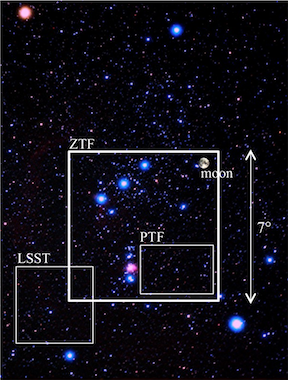
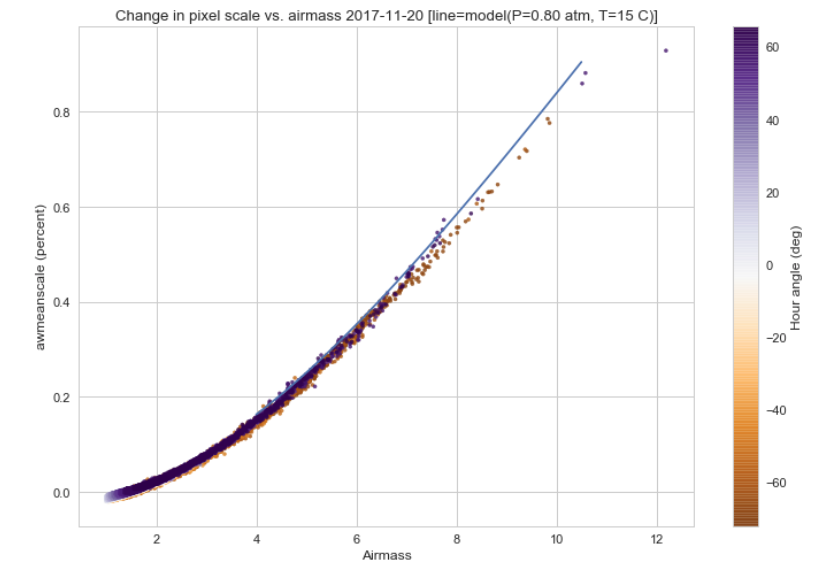
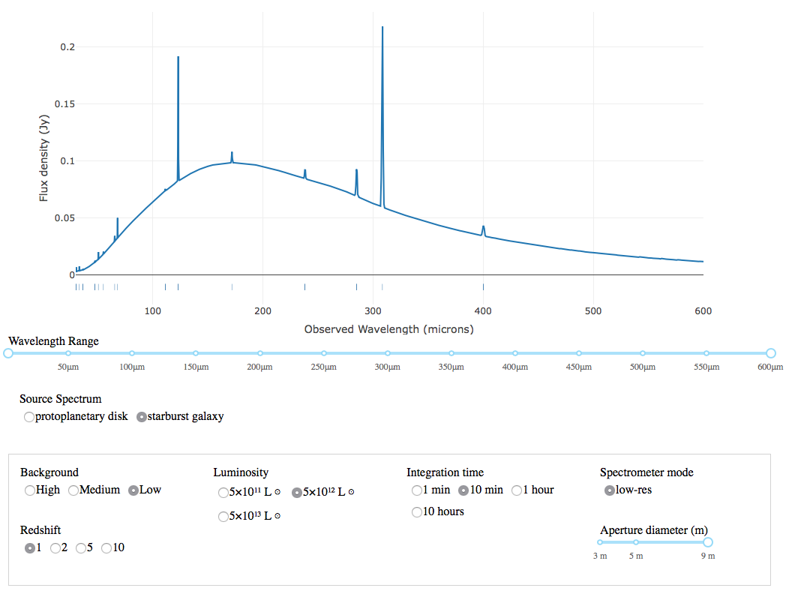

:author: David Shupe
:email: shupe@ipac.caltech.edu
:institution: Caltech/IPAC

:author: Frank Masci
:email: fmasci@ipac.caltech.edu
:institution: Caltech/IPAC

:author: Russ Laher
:email: laher@ipac.caltech.edu
:institution: Caltech/IPAC

:author: Ben Rusholme
:email: rusholme@ipac.caltech.edu
:institution: Caltech/IPAC

:author: Lee Armus
:email: armus@ipac.caltech.edu
:institution: Caltech/IPAC

:bibliography: mybib

---------------------------------
Practical Applications of Astropy
---------------------------------

.. class:: abstract

Packages developed under the auspices of the Astropy Project (:cite:`astropy2013`,
:cite:`astropy2018`) address many common problems faced by astronomers in their
computational projects.
In this paper we describe how capabilities
provided by Astropy have been employed in two current projects. The data system for the
Zwicky Transient Facility processes a terabyte of image data every night, with a lights-out
automated pipeline that produces difference images about ten minutes after the receipt of
every exposure. Astropy is used extensively in the astrometry and light-curve-generation
modules, making especially heavy use of world coordinate systems, FITS header manipulation,
table I/O, and coordinate conversion and matching. The second project is a web application
made with Plotly Dash for proposal studies for the Origins Space Telescope. The astropy.cosmology
module provides easy redshifting of our template galaxy spectrum, and astropy.units enabled
the porting of an instrument sensitivity function to Python, with verification that a very
complex combination of units resulted in a dimensionless signal-to-noise value.

.. class:: keywords

   astronomy, data processing

Introduction
------------

The Astropy Project is a community-driven effort to provide both a core Python package of
functionality commonly used by astronomers, and an extended ecosystem of interoperable
packages, with high standards for documentation and testing. The astropy core package
includes subpackages for representing and manipulating space and time coordinates;
I/O for astronomical file formats; world coordinate systems in images (e.g. converting
between celestial coordinates and image pixels); cosmological calculations; and
manipulating numerical quantities with units. Most astronomers using the astropy
core package have used it for interactive analyses. In this paper we highlight use
of astropy in two production environments: the data system for the Zwicky Transient
Facility (ZTF), and a web application for the proposed Origins Space Telescope.

The ZTF Project
---------------

The Zwicky Transient Facility (ZTF) is a new robotic survey now underway, using the 48-inch
Samuel Oschin Telescope at Palomar Observatory in southern California. This telescope
was originally constructed to take images with photographic plates, in large part to
provide targets for the 200-inch Hale Telescope at the same observatory. The ZTF camera
fills the focal plane of the 48-inch telescope with sixteen 6000x6000 charge-coupled
devices (CCDs) with an active detector area of 47 square degrees. ZTF is conducting a fast,
wide-area time-domain survey designed to discove fast, young and rare flux transients;
counterparts to gravitational wave sources; low-redshift Type Ia supernovae for cosmology;
variable stars and eclipsing binaries; and Solar System objects. The entire visible sky
can be imaged each night to declinations about -28 degrees. The survey began in March
2018 and will continue for three years.

   Field of view of the ZTF camera, compared to the predecessor Palomar Transient
   Factory (PTF) camera, and the forthcoming Large Synoptic Survey Telescope (LSST).
   The background image shows the Orion constellation.

A typical night of ZTF observations includes about 750 exposures totaling about 1
Terabyte of image data when uncompressed. Each quadrant of the CCDs is processed
separately for a total of about 55,000 calibrated science images per night. Depending
on sky location, 0.5 to 1 billion point source measurements are extracted per
night. Within a few minutes of receipt of an exposure at IPAC, a real-time pipeline
outputs alert packets including image subtractions of potential transient objects, at
rates already nearing 1 million per night.

The ZTF data system (Masci et al. in prep) is operated by the IPAC data center
on the Caltech campus.
The data system is mostly scripted in Perl, with job management relying on
a Postgres database. A cluster of 66 drones handles the processing. Astropy
is used in several key components of the pipeline. In the following subsections
we outline Astropy use and what we've learned from operational experience.

Astropy in the astrometry module
++++++++++++++++++++++++++++++++

Assigning coordinates to ZTF images is challenging for several reasons. The accuracy
of the pointing of the boresight (center of the field-of-view) is about 20 arcseconds
rms. Atmospheric effects cause distortions on small scales, and these effects are
exacerbated at low elevations. ZTF employs the SCAMP astrometric solver from the
Astromatics suite (:cite:`Bertin2006`) to fit a 4th-order distortion polynomial.
SCAMP is written in C and requires inputs in a very specialized format. We have
developed a procedure that has significantly reduced the rate of incorrect solutions
in crowded fields.

SCAMP requires both the input catalog of detections and the reference catalog to
be provided in LDAC FITS format. This format consists of header information encoded in
a binary format in an image extension, followed by a table extension. Recent versions
of SCAMP will use a prior WCS solution provided to the program. Providing a distortion
prior derived from many observations makes it much easier for SCAMP to converge on
the global minimum, i.e. the correct distortion solution. Our efforts to include
the WCS in the LDAC file of detections using astropy.io.fits were unsuccessful.
However, the header information in the LDAC file can be overridden by a text file
of header information.

Our distortion prior is constructed from an offline analysis of images taken at high
elevations (low airmasses), the same conditions used in the ZTF survey. For selected
fields, we set up idealized WCS objects with 1 degree per "pixel":

.. code-block:: python

    from astropy.wcs import WCS
    field_ra = {619:143.619,
                620:151.101,
                665:133.35,
                667:149.057}
    field_dec = {619:26.15,
                 620:26.15,
                 665:33.35,
                 667:33.35}

    wdict = {}
    for field in field_ra.keys():
        w = WCS(naxis=2)
        w.wcs.crpix = [0.0, 0.0]
        w.wcs.cdelt = np.array([1.0, 1.0])
        w.wcs.crval = [field_ra[field],
                       field_dec[field]]
        w.wcs.ctype = ["RA---TAN", "DEC--TAN"]
        wdict[field] = w

Then when reading in a catalog of sources with positions for each field, we convert
the right ascensions and declinations to eta, nu in the tangent plane:

.. code-block:: python

    w = wdict[ifield]
    plane_coords = w.wcs_world2pix(
           np.vstack(
                 [tab['ra'],tab['dec']]).T,1)
    eta = plane_coords[:,0]
    nu = plane_coords[:,1]

The statsmodels package is used to fit a linear model relating image pixel values
to the computed eta and nu values, while allowing offsets and linear terms for
each exposure and readout channel. This fit yields the CRPIX1 and CRPIX2 values
(pixel offsets) from the telescope boresight
to each of the 64 readout channels. This linear solution yields residuals of about
four arcseconds in magnitude. Then "global" pixel coordinates are constructed and
a quadratic fit relating these to eta and nu is computed. This second fit is used
to find :math:`eta` and :math:`nu` for the center of each quadrant-image. For each quadrant-image,
a linear fit is made to yield CD-matrix values for each quadrant. This procedure
transfers the pointing to the center of each individual qudrant-image.

Parameters for each quadrant are saved to be used by the astrometry pipeline. The
parameters are read and inserted into a text file that initializes SCAMP. For each
image, a first run of SCAMP is made using 'PRE-DISTORTED' mode. This performs
pattern-matching of detected stars and reference stars. SCAMP is allowed only a little
freedom to rotate and change scale. A second pass of SCAMP skips the pattern-matching
and fits a fourth-degree distortion polynomial as part of the output WCS.

A problem that plagued previous surveys was not being able to readily tell whether
a solution output by SCAMP was of poor quality. Astrometric problems will greatly
increase the number of spurious transients produced by image subtraction and later
steps of the pipeline and scanning processes. SCAMP does output a chi-squared
statistic. When provided with realistic errors, most good solutions result in a
chi-squared statistic of about five. To ensure that the system catches the case
of a distortion polynomial that is unconstrained in the corner of an image, we
developed a scale check test of the final solution against the prior.

First we generate a grid over the detector, and then make pixel coordinates
at each grid point:

.. code-block:: python

    y_pix1 = np.arange(1, 3082, 140)
    x_pix1 = np.arange(1, 3074, 128)
    m1 = np.meshgrid(x_pix1, y_pix1)
    mx = np.array(m1[0].flat)
    my = np.array(m1[1].flat)
    pcoords = np.vstack([mx,my]).T
    pcoordsb = np.vstack([mx+1,my+1]).T
    pcoordsr = np.vstack([mx+1,my]).T
    pcoordsd = np.vstack([mx,my+1]).T

Then using the WCS objects from the prior and from the final solution, we calculate
pixel areas:

.. code-block:: python

    finalcoords = SkyCoord(wcs_final.all_pix2world(
                    pcoords, 1), unit=u.deg, frame='icrs')
    finalcoordsb = SkyCoord(wcs_final.all_pix2world(
                    pcoordsb, 1), unit=u.deg, frame='icrs')
    finalcoordsr = SkyCoord(wcs_final.all_pix2world(
                    pcoordsr, 1), unit=u.deg, frame='icrs')
    finalcoordsd = SkyCoord(wcs_final.all_pix2world(
                    pcoordsd, 1), unit=u.deg, frame='icrs')
    finalareas = (finalcoords.separation(finalcoordsb)*
                  finalcoordsr.separation(finalcoordsd)/2

These steps are repeated for the prior. Finally we compute a percentage change in pixel scale:

.. code-block:: python

    pctscaledif = 100*(np.sqrt(finalareas) -
          np.sqrt(priorareas))/np.sqrt(priorareas)

If the percentage scale difference changes by more than a percent, the image is marked
as unusable.

   Mean pixel scale versus airmass for one night of commissioning data. The line shows
   model points for pressure and temperature appropriate for Palomar Observatory.
   :label:`scaleairmass`

A future update to the astrometry module, now being tested, distorts the CD-matrix
along the azimuthal direction and by a magnitude determined from the differential
refraction model. The correction is not needed for the main survey and will only
help find solutions for targets of opportunity at high airmass.

A peculiarity for ZTF is that with a field-of-view that is seven degress on a side,
the airmass reported by the telescope control system does not apply well for the
outer CCDs. We use an AltAz model to recompute airmass when analyzing statistics:

.. code-block:: python

    palomar = EarthLocation.of_site('palomar')
    time = Time(df.obsmjd, format='mjd')
    coords = SkyCoord(ra=df.ra0, dec=df.dec0,
                 unit=u.deg, frame='icrs',
                 obstime=time,
                 location=palomar)
    altaz = coords.transform_to(
                AltAz(obstime=time,
                      location=palomar))
    df['secz'] = altaz.secz

Another critical speed improvement was in pre-fetching static copies of
the Gaia DR1 catalog and storing these in the LDAC FITS format, in a
static area, to be available as static catalogs for SCAMP. We did not use
astroquery but instead a custom TAP query to our IRSA archive, using
astropy.io.fits to write out each file.

What are the important "tips" or "lessons learned"?

* It is possible to make code that knows nothing about Astropy or Python,
  work by using Astropy.
* LDAC files can be faked, well enough. The key insight is combining LDAC
  with a text file header which is easily manipulated with Astropy.
* Astropy.wcs supports TPV distortions now which enables this scheme to work.
* When you have a 7-degree field of view, the elevation, azimuth, and airmass
  reported by the telescope system aren't good enough anymore.

Astropy in source-matching
++++++++++++++++++++++++++

For ZTF, the PSF-fitting photometry that is extracted from every image is
periodically combined into matchfiles in HDF5 format. These matchfiles form
the basis of the lightcurve service that will be deployed by IPAC's Infrared
Science Archive. The matchfiles are also used to provide light curves for
variable star studies.

The matchfiles are seeded by PSF-fitting photometry extracted from reference
images. The reference images are coadds of between 15 and 40 exposures of
a ZTF field. Astropy's SkyCoord class is employed to perform the matching of
input sources to reference objects.

Astropy is also used to provide heliocentric julian dates for each source.
The difference between heliocentric Julian date and observed Julian date is
the light-travel time difference between the Earth-to-coordinate direction
and the Sun-to-coordinate direction. It is computationally prohibitive to
compute this time difference for each individual source. Instead, a SkyOffset
frame is defined at the maximum coordinate for a field, and then a 9x9 grid
is set up on that offset grid. A fit is made of light-travel-time
difference as a quadratic function of longitude and latitude in the offset
frame. This provides an accuracy in the calculation of the heliocentric date
that is much less than a ZTF exposure time of 30 seconds.

.. code-block:: python

    max_ra = np.max(ra)
    max_dec = np.max(dec)
    # Make calculations in sky offset frame
    max_coord = SkyCoord(ra=max_ra*u.deg,
                         dec=max_dec*u.deg)
    aframe = max_coord.skyoffset_frame()
    psfcoords = SkyCoord(ra=ra*u.deg,
                         dec=dec*u.deg)
    psfcoords = psfcoords.transform_to(aframe)
    min_lon = np.min(psfcoords.lon)
    max_lon = np.max(psfcoords.lon)
    min_lat = np.min(psfcoords.lat)
    max_lat = np.max(psfcoords.lat)
    grid_lon = np.linspace(min_lon.value,
                           max_lon.value,
                           endpoint=True,
                           num=9)
    grid_lat = np.linspace(min_lat.value,
                           max_lat.value,
                           endpoint=True,
                           num=9)
    glon, glat = np.meshgrid(grid_lon, grid_lat)
    glon, glat = glon.flatten(), glat.flatten()
    gcoords = SkyCoord(lon=glon*u.deg,
                       lat=glat*u.deg,frame=aframe)
    palomar = coord.EarthLocation.from_geocentric(
                    -2410346.78217658,
                    -4758666.82504051,
                     3487942.97502457, u.m)
    mytime = time.Time(mjd, format='mjd', scale='utc',
                       location=palomar)
    ltt_helio = mytime.light_travel_time(gcoords,
                                   'heliocentric')
    A = np.c_[np.ones(glon.shape), glon, glat,
                     glon*glat, glon**2, glat**2]
    coeffs,_,_,_ = np.linalg.lstsq(A, ltt_helio.sec)
    fitted = np.dot(np.c_[np.ones(psfcoords.lon.shape),
                psfcoords.lon.value,
                psfcoords.lat.value,
                psfcoords.lon.value*psfcoords.lat.value,
                psfcoords.lon.value**2,
                psfcoords.lat.value**2],
                coeffs).reshape(psfcoords.lon.shape)
    hjd = mytime + fitted*u.s

Here are the important lessons learned:

* Relying on coord.EarthLocation.of_site proved to be problematic because it
  requires a network connection. **Eliminate network calls as much as possible.**
* Note that the above lesson applies as well to pre-fetching Gaia catalogs for
  the astrometry step.
* SkyCoord.offset_frame is needed to get around zero-wrapping problems. In fact,
  offset_frame is very usefel when working on a patch of sky.

Performance issue
+++++++++++++++++

In the course of running the ZTF pipeline in production, we encountered a serious
problem caused by the $HOME/.astropy/config file. This file would randomly corrupt,
causing every Astropy import to fail. The cause of the problem was different
Astropy versions installed in our Python 2 & 3 virtual environments. The config
file is overwritten every time a different versions of Astropy version is imported.
Our pipeline contained a mixture of Python 2 and Python 3 code, running in parallel
at enough scale, that a collision would eventually occur. The problem was solved by
installing the same version of Astropy in both versions of python.

Lessons learned include:
* Configuration files can cause problems at scale.
* Technical debt from not converting everything to Python 3 will bite you.

Origins Space Telescope
-----------------------

The Origins Space Telescope is a space observatory concept under study as part
of NASA's astrophysics roadmap. The first design includes a 9-meter primary
mirror with all components cooled to less than 6 K, to provide orders of magnitude
more sensitivity than previous space infrared missions.

As part of the concept study, a web application has been constructed to
showcase the potential of one of the spectroscopic instruments. The purpose of
the application is to allow trade studies of different observational
parameters, including the telescope diameter, the exposure time, and the
distance to the star or galaxy of interest. Plotly Dash was chosen as the
technology for constructing the project.

Part of the project involved converting a complicated function for instrument
sensitivity to Python. The astropy.units and astropy.constants packages made it
relatively easy to check the results of the calculation.

   The web application for the Origins Space Telescope, showing the galaxy spectrum
   and controls for changing source characteristics and instrument parameters.

Many astronomers are used to working with "magic numbers" that are constants or
combinations of constants that we keep in our heads. Here is an example:

.. code-block:: idl

    freq=double(2.9979e5/wave) ; in GHz
    h=double(6.626e-18) ; h in erg / GHz
    c=double(2.9979e10) ; c in cm / sec

With astropy.units and affiliated packages:

.. code-block:: python

    import astropy.constants as const
    import astropy.units as u

    freq = const.c/wave

Here is another example:

.. code-block:: python

    def occnum_bkg(wave, background):
        """
        returns photon occupation
        number, as is required for
        nef function.
        """

        freq=const.c/wave

        occnum = (u.sr*const.c**2*background/
                   (2*const.h*freq**3)
        # background is provided in MJy / sr
        assert occnum.unit.is_equivalent(
                  u.dimensionless_unscaled)
        return occnum

The assertion ensures that the occupation number is dimensionless.

Consider another example in the middle of the nef function:

.. code-block:: python

    sigma = (const.h*freq*
              np.sqrt(npol/int_time*freq/res*
              total_nbar*(total_nbar+1.)))
    nep_det = (sigma*np.sqrt(int_time)*
                np.sqrt(2)) # in W/sqrt(Hz)
    assert nep_det.unit.is_equivalent(u.W*u.Hz**-0.5)

Additionally, the astropy.cosmology module was used to redshift the spectrum.
The Planck 2015 cosmology is one of the built-in cosmologies in the package.
For each user-selected value of redshift, we computed the luminosity distance
to scale the flux values of the spectrum.

For re-gridding the wavelength spectrum, we used the pysynphot package to interpolate
the redshifted spectrum onto the observed wavelength channels.

The application has been deployed on the Heroku platform [#]_.

.. [#] https://ost-mrss.herokuapp.com

Conclusions
-----------

This paper highlights the use of Astropy in two production environments: the
Zwicky Transient Facility data system, and a web application for the Origins
Space Telescope. 
