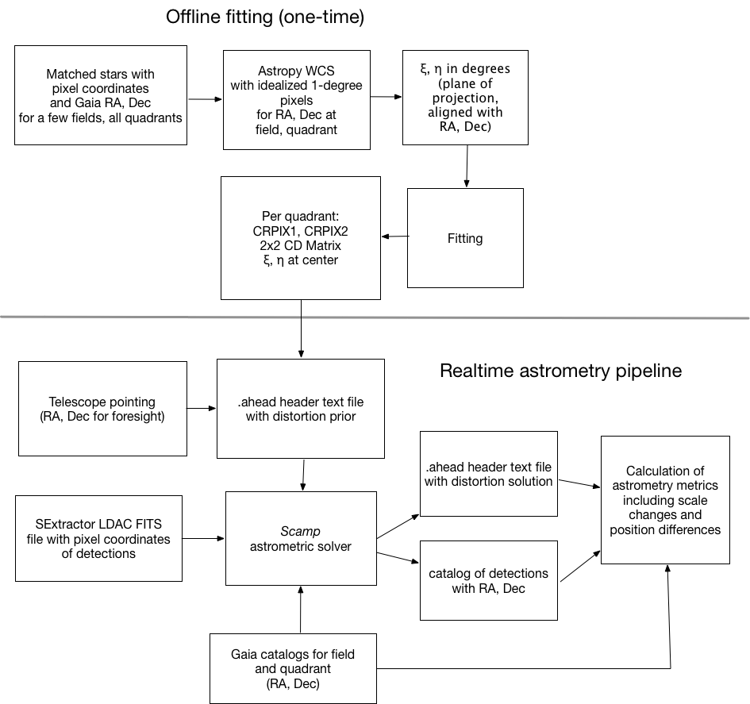

:author: David Shupe
:email: shupe@ipac.caltech.edu
:institution: Caltech/IPAC

:author: Frank Masci
:email: fmasci@ipac.caltech.edu
:institution: Caltech/IPAC

:author: Russ Laher
:email: laher@ipac.caltech.edu
:institution: Caltech/IPAC

:author: Ben Rusholme
:email: rusholme@ipac.caltech.edu
:institution: Caltech/IPAC

:author: Lee Armus
:email: armus@ipac.caltech.edu
:institution: Caltech/IPAC

:bibliography: mybib

:video: https://youtu.be/2GTLkH5sfJc

---------------------------------
Practical Applications of Astropy
---------------------------------

.. class:: abstract

Packages developed under the auspices of the Astropy Project (:cite:`astropy2013`,
:cite:`astropy2018`) address many common problems faced by astronomers in their
computational projects.
In this paper we describe how capabilities
provided by Astropy have been employed in two current projects. The data system for the
Zwicky Transient Facility processes a terabyte of image data every night, with a lights-out
automated pipeline that produces difference images about ten minutes after the receipt of
every exposure. Astropy is used extensively in the astrometry and light-curve-generation
modules, making especially heavy use of FITS header manipulation,
table I/O, and coordinate conversion and matching. The second project is a web application
made with Plotly Dash for proposal studies for the Origins Space Telescope. The astropy.cosmology
module provided easy redshifting of our template galaxy spectrum, and astropy.units enabled
the porting of an instrument sensitivity function to Python, with verification that a very
complex combination of units resulted in a dimensionless signal-to-noise value.

.. class:: keywords

   astronomy, data processing

Introduction
------------

The Astropy Project is a community-driven effort to provide both a core Python package of
functionality commonly used by astronomers, and an extended ecosystem of interoperable
packages, with high standards for documentation and testing (:cite:`astropy2013`,
:cite:`astropy2018`). The astropy core package
includes subpackages for representing and manipulating space and time coordinates;
I/O for astronomical file formats; world coordinate systems in images (e.g. converting
between celestial coordinates and image pixels); cosmological calculations; and
manipulating numerical quantities with units. Most astronomers using the astropy
core package use it for interactive analyses. In this paper, we highlight the importance
of astropy in two production environments: the data system for the Zwicky Transient
Facility (ZTF), and a web application for the proposed Origins Space Telescope.

The ZTF Project
---------------

The Zwicky Transient Facility (ZTF) is a new robotic survey now underway, using the 48-inch
Samuel Oschin Telescope at Palomar Observatory in southern California. This telescope
was originally constructed to take images with photographic plates, in large part to
provide targets for the 200-inch Hale Telescope at the same observatory. The ZTF camera
fills the focal plane of the 48-inch telescope with sixteen 6k :math:`\times` 6k charge-coupled
devices (CCDs) with an active detector area of 47 square degrees (Dekany et al in prep;
:cite:`ztf_camera_2016`).
ZTF is conducting a fast, wide-area time-domain survey (Bellm et al in prep) designed
to discover fast, young and rare flux transients;
counterparts to gravitational wave sources; low-redshift Type Ia supernovae for cosmology;
variable stars and eclipsing binaries; and moving objects in our Solar System such as
asteroids (Graham et al in prep). The entire sky visible to Palomar
can be imaged each night to declinations above -30 degrees. The survey began in March
2018 and will continue for three years. Figure :ref:`size` shows a field-of-view
comparison of ZTF with its predecessor at Palomar, the Palomar Transient Factory
(PTF; :cite:`ptf_2009`), and the forthcoming Large Synoptic Survey Telescope (LSST).

.. figure:: ztf_size_comparison.png

   Field of view of the ZTF camera, compared to the predecessor Palomar Transient
   Factory (PTF) camera, and the forthcoming Large Synoptic Survey Telescope (LSST).
   The background image shows the Orion constellation. :label:`size`

A typical night of ZTF observations includes about 750 exposures totaling about 1
Terabyte of image data when uncompressed. Each quadrant of the CCDs is processed
separately for a total of about 55,000 calibrated science images per night. Depending
on sky location, 0.5 to 1 billion individual source measurements are extracted per
night. The ZTF data system (Masci et al. 2018, in review, :cite:`laher_robotics2017`)
is operated by the IPAC data center
on the Caltech campus. Within a few minutes of receipt of an exposure at IPAC, a real-time image
subtraction pipeline outputs alert packets of potential transient objects, at
rates already nearing 1 million per night. Alert packets from the public portion
of the survey have just become available [#]_, along with a repository of
the schema and code examples [#]_.

.. [#] https://ztf.uw.edu/alerts/public

.. [#] https://github.com/ZwickyTransientFacility/ztf-avro-alert

The data system is mostly scripted in Perl, with job management relying on
a Postgres database. A cluster of 66 compute nodes handles the processing. Astropy
is used in several key components of the pipeline. In the following subsections
we outline Astropy use and what we've learned from operational experience.

Improving reliability of the astrometric solver
+++++++++++++++++++++++++++++++++++++++++++++++

Assigning coordinates to ZTF images is challenging for several reasons. The accuracy
of the pointing of the boresight (center of the field-of-view) is about 20 arcseconds
rms. Atmospheric effects cause image distortions on small scales, and these effects are
exacerbated at low elevations. ZTF employs the *Scamp* astrometric solver from the
Astromatics suite (:cite:`Bertin2006`) to match star positions from the Gaia Data Release 1 (DR1)
catalog (:cite:`gaia_mission`, :cite:`gaia_dr1`) and ultimately fit a 4th-order polynomial to the image distortions.
*Scamp* is written in C and requires inputs in a very specialized format. We have
developed a procedure that has significantly reduced the rate of incorrect solutions
in crowded fields, by providing *Scamp* with an accurate starting point (see Figure
:ref:`astrometryflow`).

*Scamp* requires both the input catalog of detections and the reference catalog to
be provided in LDAC (Leiden Data Analysis Center) [#]_ FITS format. This format consists of header information encoded in
a binary format in a table extension, followed by another table extension of detections. Recent versions
of *Scamp* will start from a prior World Coordinate System (WCS; :cite:`wcs_paper_ii`) solution provided to the program. Providing a distortion
prior derived from many observations makes it much easier for *Scamp* to converge on
the global minimum, i.e. the correct distortion solution. Our efforts to include
the WCS in the LDAC file of detections using astropy.io.fits were unsuccessful.
However, the WCS information in the LDAC file can be overridden by a text file
of header information provided separately to *Scamp*.

.. [#] https://marvinweb.astro.uni-bonn.de/data_products/THELIWWW/LDAC/LDAC_concepts.html

   Processing diagrams for ZTF astrometry. An offline analysis (top) is performed on
   a few exposures to make a prior model for each of the 64 quadrants in the focal
   plane. These terms are combined with telescope pointing to make an accurate prior
   for *Scamp* in the realtime pipeline (bottom), resulting in a calibrated header
   text file with the full coordinate solution including distortions, and a catalog
   of the detected stars with assigned RA and Dec coordinates. These outputs of the
   astrometric fitting are matched again with the Gaia reference catalog to produce
   metrics for assessing the quality of the astrometric fit. :label:`astrometryflow`

Our distortion prior is constructed from an offline analysis of images taken at high
elevations (low airmasses), the same conditions used in the ZTF survey. For selected
fields, we set up idealized WCS objects with 1 degree per "pixel":

.. code-block:: python

    from astropy.wcs import WCS
    field_radec = {619: (143.619, 26.15),
                620: (151.101, 26.15),
                665: (133.35, 33.35),
                667: (149.057, 33.35)}

    wdict = {}
    for field, (ra, dec) in field_radec.items():
        w = WCS(naxis=2)
        w.wcs.crpix = [0.0, 0.0]
        w.wcs.cdelt = np.array([1.0, 1.0])
        w.wcs.crval = [ra, dec]
        w.wcs.ctype = ["RA---TAN", "DEC--TAN"]
        wdict[field] = w

Then when reading in a catalog of sources with positions for each field, we convert
the right ascensions and declinations to projection plane coordinates
(:cite:`wcs_paper_ii`) :math:`\xi`, :math:`\eta` in units of degrees in the tangent plane:

.. code-block:: python

    w = wdict[field]
    plane_coords = w.wcs_world2pix(
           np.vstack([tab['ra'],tab['dec']]).T,1)
    xi = plane_coords[:,0]
    eta = plane_coords[:,1]

A linear model is fit relating image pixel values
to the computed :math:`\xi` and :math:`\eta` values, while allowing offsets and linear terms for
each exposure and readout channel. This fit yields the CRPIX1 and CRPIX2 values
(pixel offsets) from the telescope boresight
to each of the 64 readout channels. This linear solution yields residuals of about
four arcseconds in magnitude. Then "global" pixel coordinates are constructed and
a quadratic fit relating these to :math:`\xi` and :math:`\eta` is computed. This second fit is used
to find :math:`\xi` and :math:`\eta` for the center of each quadrant-image. For each quadrant-image,
a linear fit is made to yield the multiplicative terms for pixel scale and rotation
(CD-matrix values; :cite:`wcs_paper_ii`)  for each quadrant. This procedure
transfers the pointing to the center of each individual quadrant-image.

The CD-matrix, CRPIX1, CRPIX2, and :math:`\xi`, :math:`\eta` values
for each quadrant are saved to be used by the astrometry pipeline. The
parameters are read and inserted into a text file (.ahead file) that initializes *Scamp*. For each
image, a first run of *Scamp* is made using 'PRE-DISTORTED' mode. This performs
pattern-matching of detected stars and reference stars from Gaia DR1. *Scamp* is allowed only a little
freedom to rotate and change scale. A second pass of *Scamp* skips the pattern-matching
and fits a fourth-degree distortion polynomial as part of the output WCS.
An essential speed improvement was pre-fetching static copies of
the Gaia DR1 catalog and storing these in the LDAC FITS format using astropy.io.fits, in a
static area, to be available as static catalogs for *Scamp*.

Assessing the quality of the astrometric solution
+++++++++++++++++++++++++++++++++++++++++++++++++

A problem encountered often in the PTF survey was not being able to readily tell whether
a solution output by *Scamp* was of poor quality. Astrometric problems greatly
increase the number of spurious transients produced by image subtraction and later
steps of the pipeline and scanning processes. *Scamp* does output a chi-squared
statistic. When provided with realistic errors, most good solutions result in a
chi-squared statistic of about five. To ensure that the system catches the case
of a distortion polynomial that is unconstrained in the corner of an image, we
developed a scale check test of the final solution against the distortion prior
that we initially provided to *Scamp*.

First we generate a grid over the detector, and then make pixel coordinates
at each grid point:

.. code-block:: python

    y_pix1 = np.arange(1, 3082, 140)
    x_pix1 = np.arange(1, 3074, 128)
    m1 = np.meshgrid(x_pix1, y_pix1)
    mx = np.array(m1[0].flat)
    my = np.array(m1[1].flat)
    pcoords = np.vstack([mx,my]).T
    pcoordsb = np.vstack([mx+1,my+1]).T
    pcoordsr = np.vstack([mx+1,my]).T
    pcoordsd = np.vstack([mx,my+1]).T

Then using the WCS objects from the prior and from the final solution, we calculate
pixel areas:

.. code-block:: python

    from astropy.coordinates import SkyCoord
    import astropy.units as u
    finalcoords = SkyCoord(wcs_final.all_pix2world(
            pcoords, 1), unit=u.deg, frame='icrs')
    finalcoordsb = SkyCoord(wcs_final.all_pix2world(
            pcoordsb, 1), unit=u.deg, frame='icrs')
    finalcoordsr = SkyCoord(wcs_final.all_pix2world(
            pcoordsr, 1), unit=u.deg, frame='icrs')
    finalcoordsd = SkyCoord(wcs_final.all_pix2world(
            pcoordsd, 1), unit=u.deg, frame='icrs')
    finalareas = (finalcoords.separation(finalcoordsb)*
                  finalcoordsr.separation(finalcoordsd)/2

These steps are repeated for the prior. Finally we compute a percentage change in pixel scale:

.. code-block:: python

    pctscaledif = 100*(np.sqrt(finalareas) -
          np.sqrt(priorareas))/np.sqrt(priorareas)

If the percentage scale difference changes by more than a percent, the image is marked
as unusable. Figure :ref:`scaleairmass` shows the mean value of the percentage scale
difference for a night of ZTF commissioning exposures, showing the changes follow
a model [#]_ for differential atmospheric refraction.

.. [#] http://wise-obs.tau.ac.il/~eran/Wise/Util/Refraction.html

.. figure:: ztf_scale_airmass.png

   Mean pixel scale versus airmass for one night of commissioning data. The line shows
   model points for pressure and temperature appropriate for Palomar Observatory.
   :label:`scaleairmass`

A peculiarity for ZTF is that with a field-of-view that is seven degrees on a side,
the airmass reported by the telescope control system does not apply well for the
outer CCDs. We use an AltAz model to recompute airmass when analyzing metric values
for the pixel scale change.

.. code-block:: python

    palomar = EarthLocation.of_site('palomar')
    time = Time(df.obsmjd, format='mjd')
    coords = SkyCoord(ra=df.ra0, dec=df.dec0,
                 unit=u.deg, frame='icrs',
                 obstime=time,
                 location=palomar)
    altaz = coords.transform_to(
                AltAz(obstime=time,
                      location=palomar))
    df['secz'] = altaz.secz

A future update to the astrometry module, now being tested, distorts the CD-matrix
along the azimuthal direction and by a magnitude determined from the differential
refraction model. The correction is not needed for the main survey and will
help find solutions for targets of opportunity at high airmass.

Accounting for light-travel-time in ZTF light curves
++++++++++++++++++++++++++++++++++++++++++++++++++++

For ZTF, the PSF-fitting photometry that is extracted from every image is
periodically combined into matchfiles in HDF5 format. These matchfiles form
the basis of the lightcurve service that will be deployed by IPAC's Infrared
Science Archive. The matchfiles are also used to provide light curves for
variable star studies.

The matchfiles are seeded by PSF-fitting photometry extracted from reference
images. The reference images are coadds of between 15 and 40 exposures of
a ZTF field. Astropy's SkyCoord class is employed to perform the matching of
input sources to reference objects.

Astropy is also used to provide heliocentric Julian dates for each source.
The difference between heliocentric Julian date and observed Julian date is
the light-travel time difference between the Earth-to-coordinate direction
and the Sun-to-coordinate direction. It is computationally prohibitive to
compute this time difference for each individual source. Instead, a SkyOffset
frame is defined at the maximum coordinate for a field, and then a 9x9 grid
is set up on that offset grid. A fit is made of light-travel-time
difference as a quadratic function of longitude and latitude in the offset
frame. This provides an accuracy in the calculation of the heliocentric date
that is much less than a ZTF exposure time of 30 seconds.

Since some ZTF fields straddle RA=0, a mean or median of RA yields misleading
values. For our nearly-degree-sized fields, we use the maximum values
and define an offset frame:

.. code-block:: python

    import numpy as np
    from astropy.coordinates import SkyCoord
    import units as u

    max_ra = np.max(ra)
    max_dec = np.max(dec)
    # Make calculations in sky offset frame
    max_coord = SkyCoord(ra=max_ra*u.deg,
                         dec=max_dec*u.deg)
    aframe = max_coord.skyoffset_frame()

The PSF-fitting catalog coordinates are transformed to the offset frame and
a bounding box in that frame is computed:

.. code-block:: python

    psfcoords = SkyCoord(ra=ra*u.deg,
                         dec=dec*u.deg)
    psfcoords = psfcoords.transform_to(aframe)
    min_lon = np.min(psfcoords.lon)
    max_lon = np.max(psfcoords.lon)
    min_lat = np.min(psfcoords.lat)
    max_lat = np.max(psfcoords.lat)

A 9x9 grid is set up in the SkyOffset frame:

.. code-block:: python

    grid_lon = np.linspace(min_lon.value,
                           max_lon.value,
                           endpoint=True,
                           num=9)
    grid_lat = np.linspace(min_lat.value,
                           max_lat.value,
                           endpoint=True,
                           num=9)
    glon, glat = np.meshgrid(grid_lon, grid_lat)
    glon, glat = glon.flatten(), glat.flatten()
    gcoords = SkyCoord(lon=glon*u.deg,
                       lat=glat*u.deg,frame=aframe)

Although coord.EarthLocation.of_site was used in our offline astrometry
analysis, its network fetch of coordinates is not reliable for many
parallel processes. The hard-coded observatory location is combined with the modified
Julian date of the observation to compute light-travel-time over our
9x9 grid:

.. code-block:: python

    from astropy import time

    palomar = coord.EarthLocation.from_geocentric(
                    -2410346.78217658,
                    -4758666.82504051,
                     3487942.97502457, u.m)
    mytime = time.Time(mjd, format='mjd', scale='utc',
                       location=palomar)
    ltt_helio = mytime.light_travel_time(gcoords,
                                   'heliocentric')

Coefficients for a least-squares fit of a 2-dimensional quadratic surface
are computed and applied to our catalog coordinates to yield light-travel-times
for each source, and then added to our observed times to result in heliocentric
Julian dates:

.. code-block:: python

    A = np.c_[np.ones(glon.shape), glon, glat,
                     glon*glat, glon**2, glat**2]
    coeffs,_,_,_ = np.linalg.lstsq(A, ltt_helio.sec)
    fitted = np.dot(np.c_[np.ones(psfcoords.lon.shape),
                psfcoords.lon.value,
                psfcoords.lat.value,
                psfcoords.lon.value*psfcoords.lat.value,
                psfcoords.lon.value**2,
                psfcoords.lat.value**2],
                coeffs).reshape(psfcoords.lon.shape)
    hjd = mytime + fitted*u.s

Configuration file issue
++++++++++++++++++++++++

In the course of running the ZTF pipeline in production, we encountered a serious
problem caused by the $HOME/.astropy/config file. This file would randomly corrupt,
causing every Astropy import to fail. The cause of the problem was different
Astropy versions installed in our Python 2 & 3 virtual environments. The configuration
file is overwritten every time a different versions of Astropy version is imported.
Our pipeline contained a mixture of Python 2 and Python 3 code, running in parallel
at enough scale, that a collision would eventually occur. The problem was solved by
installing the same version of Astropy in both versions of Python.

Lessons learned from the ZTF experience
+++++++++++++++++++++++++++++++++++++++

* Python and Astropy worked very well to wrap the *Scamp* solver and to
  provide its specialized inputs to make it converge reliably on correct
  astrometric solutions.
* The key to working with the LDAC format is providing an additional text
  file header that is easily manipulated with Astropy.
* Astropy.wcs supports TPV distortions since version 1.1, enabling us to
  compute metrics assessing the quality of the astrometric fits.
* When you have a 7-degree field of view, the elevation, azimuth, and airmass
  reported by the telescope system lack sufficient precision.
* Elminiate network calls as much as possible, by pre-fetching the astrometric
  catalogs, and bypassing astropy.coordinates.EarthLocation.of_site.
* SkyCoord.offset_frame is essential to avoid zero-wrapping problems in celestial
  coordinates, and is very useful when working on a patch of sky.
* Configuration files can cause problems at scale.
* Technical debt from not converting everything to Python 3 will bite you.

Origins Space Telescope
-----------------------

The Origins Space Telescope is a space observatory concept under study as part
of NASA's astrophysics roadmap. The first design includes a 9-meter primary
mirror with all components cooled to less than 6 K, to provide orders of magnitude
more sensitivity than previous space infrared missions.

As part of the concept study, a web application has been constructed to
showcase the potential of one of the spectroscopic instruments, the Mid-Resolution
Survey Spectrometer (:cite:`Bradford_MRSS`). The purpose of
the application is to allow trade studies of different observational
parameters, including the telescope diameter, the exposure time, and the
distance to the star or galaxy of interest. Plotly Dash [#]_ was chosen as the
technology for constructing the project.

.. [#] https://plot.ly/products/dash/

Part of the project involved converting a complicated function for instrument
sensitivity to Python. The astropy.units and astropy.constants packages made it
relatively easy to check the results of the calculation.

Many astronomers are used to working with "magic numbers" that are constants or
combinations of constants that we keep in our heads. Here is an example:

.. code-block:: idl

    freq=double(2.9979e5/wave) ; in GHz
    h=double(6.626e-18) ; h in erg / GHz
    c=double(2.9979e10) ; c in cm / sec

With astropy.units and affiliated packages:

.. code-block:: python

    import astropy.constants as const
    import astropy.units as u

    freq = const.c/wave

The noise equivalent flux calculation for the spectrometer depends in part on
the numbers of photons (occupation number) coming from the background at a particular
wavelength.

.. math::

    \bar{n} = {{c^2I_{\nu}} \over {2 h \nu^3}}

where :math:`I_{\nu}` is the background intensity in MJy/sr. An assertion in
the calculation of occupation number ensures it is dimensionless:

.. code-block:: python

    def occnum_bkg(wave, background):
        """
        returns photon occupation
        number from background
        """

        freq=const.c/wave

        occnum = (u.sr*const.c**2*background/
                   (2*const.h*freq**3)
        # background is provided in MJy / sr
        assert occnum.unit.is_equivalent(
                  u.dimensionless_unscaled)
        return occnum

The assertion ensures that the occupation number is dimensionless.

The noise equivalent power for an element in the spectrometer depends
the frequency, bandwidth and photon occupation number at that frequency:

.. math::

    NEP = h\nu \sqrt{\Delta\nu \bar{n} (\bar{n} + 1)}

where the bandwidth :math:`\Delta\nu = \nu / R` and :math:`R` is the
spectrometer resolution.
In the instrument sensitivity function, this is implemented with an
assertion to check units at an intermediate stage:

.. code-block:: python

    delta_freq = freq / resolution
    nep_det = (const.h*freq*
               np.sqrt(delta_freq*nbar*(nbar+1))
               *sqrt(2)) # in W/sqrt(Hz)
    assert nep_det.unit.is_equivalent(u.W*u.Hz**-0.5)

For the extragalactic example in the application, the astropy.cosmology module
was used to redshift the spectrum.
The Planck 2015 cosmology (:cite:`Planck_2015_cosmology`)
is one of the built-in cosmologies in the package.
For each user-selected value of redshift, we computed the luminosity distance
to scale the flux values of the spectrum.

For re-gridding the wavelength spectrum, we used the pysynphot package (not
an astropy package but developed in part by Astropy developers)
(:cite:`pysynphot`) to interpolate
the redshifted spectrum onto the observed wavelength channels.

.. figure:: ost_galaxy.png
   :align: center
   :scale: 50%
   :figclass: w

   The web application for the Origins Space Telescope, showing the galaxy spectrum
   and controls for changing source characteristics and instrument parameters. :label:`ost-galaxy`

The application has been deployed on the Heroku platform [#]_. A screenshot of
the galaxy spectrum is shown in Figure :ref:`ost-galaxy`. To ensure good performance
when changing parameters, the instrument sensitivity was pre-computed for the
lines in the spectra, for different backgrounds and redshifts.

.. [#] https://ost-mrss.herokuapp.com

The astropy.units package is broadly useful outside astronomy; to that end, the
unyts package (:cite:`unyts_2018`) is a newly-available standalone alternative.

Lessons learned include:

* Using a units package together with assertions at intermediate stages helped
  to validate a complex instrument sensitivity function.
* However, a units package does not help get factors of (1+z) correct.
* Pre-computing sensitivities for several parameter choices sped up the application.
* The pysynphot functionality for regridding spectra would be useful to break
  out into a more accessible Astropy-affiliated package.

Conclusions
-----------

This paper highlights the use of Astropy in two production environments: the
Zwicky Transient Facility data system, and a web application for the Origins
Space Telescope. Astropy's capabilities for manipulating FITS files and image
headers, coupled with its coordinate conversion capabilities, helped us implement
a scheme to greatly improve the reliability of ZTF astrometry, and provided
other conveniences. The astropy.units and astropy.cosmology packages provided
essential transformations for the Origins study application. We found that some
care needs to be taken with minimizing or eliminating network calls, and with
handling configuration files that assume a single package version is in use.

Acknowledgments
---------------

We are grateful to D. Levitan, W. Landry, S. Groom, B. Sesar, J. Surace, E. Bellm,
A. Miller, S. Kulkarni, T. Prince and many other contributors to the PTF and ZTF projects.
The Origins Space Telescope app includes significant contributions from C.M Bradford, K. Pontopiddan,
K. Larson, J. Marshall, and T. Diaz-Santos.

ZTF is led by the California Institute of Technology, US and includes IPAC, US;
the Joint Space-Science Institute (via the University of Maryland, College Park), US;
Oskar Klein Centre of the University of Stockholm, Sweden; University of Washington, US;
Weizmann Institute of Science, Israel; DESY and Humboldt University of Berlin, Germany;
University of Wisconsin at Milwaukee, US; the University System of Taiwan, Taiwan;
and Los Alamos National Labora- tory, US; ZTF acknowledges the generous support of
the National Science Foundation under AST MSIP Grant No 1440341. The alert distribution
service is provided by the DIRAC Institute at the University of Washington.
The High Performance Wireless Research & Education Network (HPWREN; https://hpwren.ucsd.edu)
is a project at the University of California, San Diego and the
National Science Foundation (grant numbers 0087344 (in 2000), 0426879 (in 2004),
and 0944131 (in 2009)).

This work has made use of data from the European Space Agency (ESA) mission Gaia
(https://www.cosmos.esa.int/gaia), processed by the Gaia Data Processing and
Analysis Consortium (DPAC, https://www.cosmos.esa.int/web/gaia/dpac/consortium).
Funding for the DPAC has been provided by national institutions, in particular
the institutions participating in the Gaia Multilateral Agreement.
