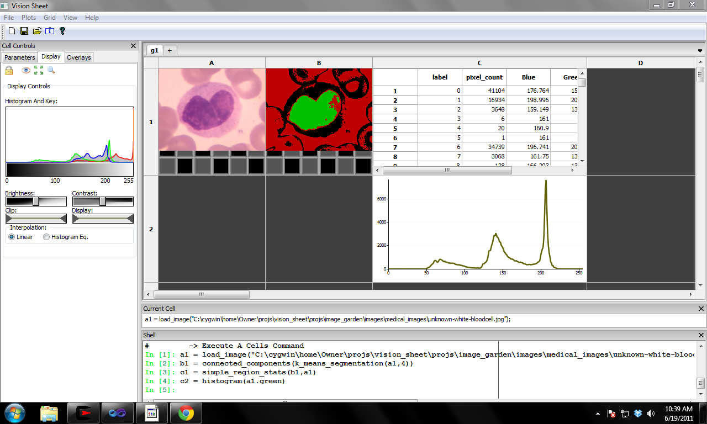

:author: Scott Determan
:email: scott.determan@gmail.com
:institution: Vision Spreadsheet

------------------------------------------------------
Vision Spreadsheet: An Environment for Computer Vision
------------------------------------------------------

.. class:: abstract

   Vision Spreadsheet is an environment for computer vision. It combines a
   spreadsheet with computer vision and scientific python. The cells in the
   spreadsheet are images, computations on images, measurements, and plots. There
   are many built in image processing and machine learning algorithms and it
   extensible by writing python functions and importing them into the
   spreadsheet.
   
.. class:: keywords

   computer vision, spreadsheet, OpenCV

Introduction
------------

Vision Spreadsheet is an application designed to explore and solve computer
vision problems. It provides a visual environment and a familiar computational
tool set to enable creative prototyping of computer vision algorithms. A novel
interface using a spreadsheet of images encourages interactive and exploratory
algorithm design. Computational scientists can leverage their existing knowledge
of python, NumPy, SciPy, OpenCV, VIGRA, and other familiar technologies. Vision
Spreadsheet aims to make the techniques of computer vision accessible to a wider
audience.

Vision Spreadsheet is modeled after familiar numerical spreadsheets, such as MS
Excel and Apple Numbers. In a numerical spreadsheet, each cell contains a number,
with cells relating to each other by numerical expressions. In Vision
Spreadsheet, each cell contains an image, with cells relating to each other by
computer vision operations. As in a traditional spreadsheet, changes propagate
automatically through the cells. Complex vision algorithms can be built-up
cell-by-cell, interactively, with continuous visual feedback into the
intermediate steps.

The cells within Vision Spreadsheet relate to each other through expressions that
operate on images. For example, if the image in cell a2 is the dilation of the
image in cell a1, this is expressed as "dilate(a1)". The power of these
expressions comes from the large library of functions available, including all of
the image processing and machine learning algorithms from OpenCV. Furthermore,
users can easily add their own functions using python, NumPy, and SciPy.

Vision Spreadsheet provides many tools to make it easier to explore the solution
space of a vision problem.

- source images can be loaded, reload or looped through
- all cell expression can be edited interactively
- all changes to cells are automatically propagated through the spreadsheet
- function parameters can be bound to GUI controls for interactive exploration
- cells can contain graphs and tables containing measurements and statistics from images

Vision Spreadsheet is the product of years of development and many more years of
experience working in the field of computer vision. I feel it provides an
excellent environment for exploring solutions to computer vision problems. It is
difficult to get a feel for an interactive environment by reading a paper. Visit
http://visionspreadsheet.com to download the application for free or to watch
videos of Vision Spreadsheet in action.

Overview of Vision Spreadsheet
------------------------------

Figure :ref:`bloodcells` shows a screen shot of Vision Spreadsheet. There are
four main areas to the GUI: the grid of cells, the current cell's statement, the
shell, and the current cell's GUI controls.

   Vision Spreadsheet cells contain images, measurements, and plots. :label:`bloodcells`

Numerical spreadsheets contain a grid of numbers and labels. Vision Spreadsheet's
grid of cells contains images, computations on images, measurements, and
plots. In a numerical spreadsheet, if a cell contains the sum of a column of
numbers and a number in the column changes then the total automatically updates
itself. Similarly, in Vision Spreadsheet if a cell changes (for instance by
loading a new image or changing an algorithm parameter) then all of the cells
that depend on the changed cell will update themselves.

The current cell's statement is a single-line control used to show what statement
was used to create the current cell. This statement may be edited and updated in
this control.

The shell is a modified IPython shell used to specify what a cells contains. The
shell is also used to write new spreadsheet functions in python.

The GUI controls area contains display parameters, overlays, and controls bound
to algorithm parameters for the current cell.

Specifying a Cell's Content
---------------------------

Just like in a numerical spreadsheet, the content of each cell in the spreadsheet
grid is defined by an expression. Expressions are entered by typing them into the
shell or current cell's statement control. The syntax of Vision Spreadsheet's
cell expressions should feel familiar to any spreadsheet user. But unlike a
numerical spreadsheet, Vision Spreadsheet's expressions operates on images. A
typical statement looks like this:

.. code-block:: python

   some_cell = some_function(parameter1,parameter2)

For example, to define cell b1 as the erosion of the image in cell a1 you would
enter the following expression into the shell:

.. code-block:: python

   b1 = erode(a1)

After entering this expression, cell b1 will display the image which is an
erosion of the image in cell a1. If you manually load a new image into cell a1,
then the image in cell b1 will automatically update as the erosion of the new
image.
   
The power in the expression language comes from the large library of available
computer vision functions. In fact, all of the image processing and machine
learning functions from OpenCV are available. This allows professionals to
leverage their existing knowledge of this powerful library.

The arithmetic operators are available and follow the usual syntax and precedence
rules. A typical call with an operator looks like (where someop is +, -, <, etc.):

.. code-block:: python

   some_cell = parameter1 someop parameter2

Functions may be nested, so one way to run a morphological open would be:

.. code-block:: python

   b1 = dilate(erode(a1))

Morphological open is already a built in functions; the above was only an
example.

There are also a few special functions, like if and select.

Vision Spreadsheet supports multiple tabs per sheet. Cells in another tab are in
another namespace, and can be referenced using the namespace syntax:

.. code-block:: python

   namespace_name::variable_name
   ::variable_name # global namespace

Sheets start with g and are sequentially numbered, so the following code is used to refer
to sheet g1 cell a1:

.. code-block:: python

   g1::a1

Literal data sets are specified with the following syntax:

.. code-block:: python

   [1,2,3,4]
   [[1,2,3],[4,5,6],[7,8,9]]

Literal dictionaries are specified with the following syntax:

.. code-block:: python

   {'name':'Scott','weight':150,'location':[512,700]}

Keys must be a string. Values can be any supported data type (dictionaries, data sets, data frames, etc.).   

Expressions can be an arbitrarily complex combination of functions and arithmetic
operators. But just like in a numerical spreadsheet, cell expressions work best
as simple one-line expressions. For more complex programs, use python mode within
Vision Spreadsheet.

Binding Parameters to GUI Controls
----------------------------------

A primary goal of Vision Spreadsheet is to allow interactive exploration of
vision problems. One of the most powerful tools to do this is to bind GUI
controls to parameters in a cell expression. This allows users to have a value in
a cell expression that comes from a GUI control, such as a slider control. The
user can manipulate the GUI control to affect the value in the
expression. Because Vision Spreadsheet automatically propagates this change
through the spreadsheet, users can very quickly see the effect that a particular
parameter has on the result of an algorithm.

The best way to explain this feature is to look at an example. Consider
thresholding an image. There are a couple of threshold operators, but the
simplest is the '>.' operator. Load an image in cell a1. Next, threshold it by
typing:

.. code-block:: python

   b1 = a1 >. 128

This creates an image where values greater than 128 are set to 255 and values
less than or equal to 128 are set to zero. One way to decide on a threshold value
would be to keep typing in numbers until the threshold image looked good. A
better way is to bind the parameter to a GUI control, like a slider. The
following command does this:

.. code-block:: python

   b1 = a1 >. slider(128,0,255)

This creates a slider with a default value of 128, a min value of 0, and a max
value of 255. If the threshold image is the current cell, then the cell controls
pane on the left of the GUI will contain a slider (see figure :ref:`slider`).
This slider is used to interactively change the parameter to the threshold
function.

.. figure:: slider.png
   :scale: 25%
   :figclass: bht

   GUI controls may be bound to algorithm parameters. Here a slider is bound to a threshold. :label:`slider`

There are many other types of GUI controls that may be bound to parameters, such
as: radio buttons, sliders, spin controls, combo boxes and movie controls (radio
button are particularly useful to bind to file names so different images may be
easily loaded into a cell).

Multiple GUI controls may be used to control a single function parameter. If the
function calls to create the GUI controls are nested, then they will control the
same parameter. For example, to have a spin control and a slider control the
threshold:

.. code-block:: python

   b1 = a1 >. spin(slider(128,0,255))

Python Mode
-----------

Python is a fantastic language for exploratory computer vision.  Vision
Spreadsheet is tightly integrated with python and gives users full access to an
IPython shell within Vision Spreadsheet.  This integration gives users all of the
power and familiarity of python combined with the visual feedback and
interactivity of Vision Spreadsheet.  Users can extend Vision Spreadsheet by
adding new functions they implement in python.  Users also have full access to
the Vision Spreadsheet environment from within python, allowing them to access
and update cells interactively from within the IPython shell.

To toggle the shell to/from IPython mode, type "##" in the shell. Inside the
IPython shell, you will have access to the vis_sheet module. The vis_sheet module
provides full access to the Vision Spreadsheet environment from within python.
The IPython shell at the bottom of the GUI supports two modes, cells mode and
python mode. To toggle between the two modes, type '##' and hit return. Cells
mode is the default mode. Python mode is just a regular IPython shell with two
differences: typing '##' will toggle to cells mode and there is a module called
'vis_sheet' that can be used to interact with the spreadsheet.

There are at least two interesting activities to do in python mode:

#. Extend the spreadsheet with new functions.
#. Get values from the spreadsheet, muck around with them interactively in
   python, and set the values back into the spreadsheet.

Here is how to add a new function to the spreadsheet. Change to python mode by
typing '##'. The shell should now have a black background. Define a subtraction
function as follows:

.. code-block:: python

   def my_subtract(a,b): return a-b
   import vis_sheet
   vis_sheet.add_python_op(my_subtract)

Change back to cells mode by typing '##' (the shell should now have a white
background). Load an image in cell a1, erode it an put it in b1, and subtract b1
from a1 using the new function:

.. code-block:: python

   c1 = my_subtract(a1,b1)

Cell c1 will contain the edges from the image in cell a1. Note that the images in
the spreadsheet are automatically converted to NumPy arrays before they are
passed to user defined functions. The parameters a and b will be NumPy arrays. If
the result is a NumPy array, it will automatically be converted to an image.

To get or set values in the spreadsheet from python mode, use the following
functions:

.. code-block:: python

   import vis_sheet
   vis_sheet.get_var_data('a1')
   vis_sheet.set_var_data('b1',some_python_var)

Data Structures
---------------

There are three main data structures in vision spreadsheet: images, data frames,
and statistical models.

Images are the most important data structure. An image is a two dimensional array
of vectors. All the elements of an image are of the same numeric type. Images
with element types of uchar through double are supported. Many image types are
supported, for example: grayscale, color (rgb, brg, hsi, cie lab, etc.), and
depth images (from the Kinect camera, for example). When an image is passed to a
user defined python function it is automatically converted into a NumPy array.

Data frames are modeled after R's data frame structure. Data frames are used to
store measurements on images and to overlay images with shapes and regions of
interest. It is a table where each column in the table may
have a different type. So a single data frame may have a column of numbers and a
column of strings. Supported column types are: numeric (uchar through double),
boolean, string, and region of interest. Like R's data frames, rows may contain
missing data. Data frames also support R's notion of factor columns. Factor
columns are usually used to specify responses when training classifiers. Unlike
R, vision spreadsheet supports grouping columns into a hierarchy. This is useful
for storing higher-level objects in a data frame.  For example, rectangles are
stored in a data frame by grouping together four numeric columns. These
rectangles may then be overlaid and edited on an image.

The last major data structure is a statistical model. Statistical models are used
to classify objects in images. There are two main functions to a statistical
model: train and predict. The train function takes a statistical model, a data
frame of features, and a data frame of responses. It returns the newly trained
model. The predict function takes a model and data frame. It returns a prediction
for each row in the data frame.

There are other data types in vision spreadsheet, but many problems in computer
vision can be solved using only these three data types.

Conclusion
----------

I described a new environment for interactively working with computer vision. I
am optimistic that this will be a useful and productive environment for many
types of users. However, at this point no one except myself has used Vision
Spreadsheet. The key to making the environment useful is to have real users try
to solve real problems with it. My goal in presenting this paper is to get people
using the spreadsheet so they can provide the feedback I need to make Vision
Spreadsheet as useful as I know it can be. Please try it out.

I had planned on releasing Vision Spreadsheet shortly before the conference. I
did not make this deadline, but I am very close. When it is released, you can go
to http://visionspreadsheet.com to download it for free.

Thank You
---------

I owe thanks to many great open source projects. I especially want to thank the
following projects (alphabetical order): ANTLR [1]_, boost [2]_, CMake [3]_,
IPython [4]_ [IPy]_, OpenKinect [5]_, NumPy [6]_, OpenCV [7]_, python [8]_, SciPy
[9]_, SWIG [10]_, VIGRA [11]_, wxPython [12]_, and wxWidgets [13]_.

References
----------
.. [IPy] Fernando Perez, Brian E. Granger, "IPython: A System for Interactive Scientific Computing," Computing in Science and Engineering, vol. 9, no. 3, pp. 21-29, May/June 2007, doi:10.1109/MCSE.2007.53.
.. [1] http://www.antlr.org ANTLR is used to build the parser for the cells language.
.. [2] http://www.boost.org. Boost is used for many utility routines in the c++ code.
.. [3] http://www.cmake.org. CMake is the build/test/package system.
.. [4] http://ipython.org IPython is the shell.
.. [5] http://openkinect.org OpenKinect is the interface to the Kinect camera.
.. [6] http://numpy.scipy.org NumPy arrays are used to interface between the internal data structures in vision spreadsheet and python.
.. [7] http://opencv.willowgarage.com OpenCV provides many of the image processing and machine learning algorithms.
.. [8] http://python.org. The spreadsheet is extended through python.
.. [9] http://www.scipy.org SciPy makes it easy and efficient for the user to extend the spreadsheet and manipulate images and data frames.
.. [10] http://www.swig.org SWIG is used to wrap OpenCV functions into Vision Spreadsheet.
.. [11] http://hci.iwr.uni-heidelberg.de/vigra VIGRA provides many image processing algorithms.
.. [12] http://www.wxpython.org. wxPython is the python interface to the wxwidgets library.
.. [13] http://wxwidgets.org. wxWidgets is the GUI library.

