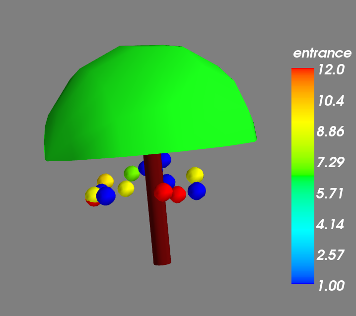
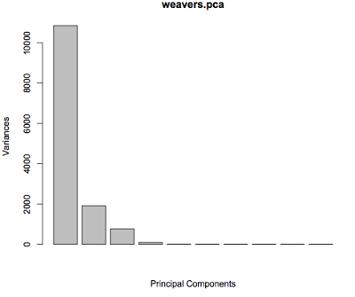
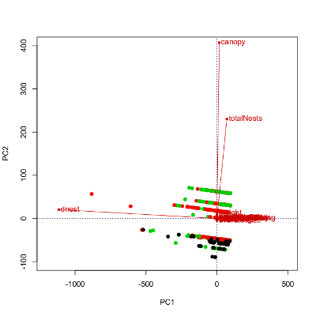
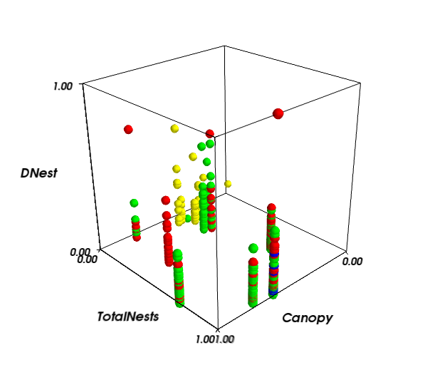

:author: Kadambari Devarajan
:email: kadambari.devarajan@gmail.com
:institution: 
    Department of Computer Science, 

    University of Illinois at Chicago.
:author: Maria A. Echeverry-Galvis
:institution: 
    Department of Ecology and 
    
    Evolutionary Biology, 
    
    Princeton University.
:author: Rajmonda Sulo
:institution: 
    Department of Mathematics, 
    
    Statistics and Computer Science,

    University of Illinois at Chicago.
:author: Jennifer K. Peterson
:institution: 
    Department of Ecology and 
    
    Evolutionary Biology,
    
    Princeton University.

------------------------------------------------
Unusual Relationships : Python and Weaver Birds
------------------------------------------------

.. class:: abstract

    As colonial birds, weaver birds nest in groups in very particular trees and face specific challenges in the selection and establishment of their    
    nests. Socially-living individuals may organize themselves in particular configurations to decrease the probability of events that could be  
    detrimental to their own fitness. This organization within a selected area could be dictated by biotic factors (such as predation, parasite invasion  
    and/or thievery), or abiotic ones (like solar radiation, and protection from rain, among others), leading to a variety of arrangements. The parameters 
    that individuals might evaluate while establishing/joining a colony help pick the main evolutionary drivers for colonial living. Here, the factors 
    that determine the spatial relationships between the nests in a given tree are computationally modeled. We have built a computational model that 
    explains the spatial arrangement of the nests with bird species, tree morphology, and the environment as factors. 

    Python has been used significantly in the construction of the model, particularly the machine learning libraries and visualization toolkits. Python 
    is used for the initial data processing, based on which, statistical analysis and visualization are done. We use the PCA and regression tree 
    algorithms to build a model that describes the main factors affecting the spatial arrangement of the nests and classify the nests based on these 
    factors. Visualization is used for determining key attributes in the tree morphology, and nest characteristics, that might be better predictors of 
    overall nest distribution. This aids in guiding other modeling questions. NumPy arrays are used extensively, during the visualization. Mayavi2 is used 
    for the 3-D visualization and matplotlib is used for the representation of the results of statistical analysis.

Introduction
------------

Group living is a strategy that confers various advantages and disadvantages. These may include better access to mates and protection from predation, but also increases competition for resources and higher visibility. As an evolutionary response to these challenges, socially-living individuals have come to display certain patterns of organization, such as uniform or clumped distributions, to decrease the probability of events detrimental to their own fitness. However, each of these distributions can be modified or adjusted, depending  on the scale at which the pattern is analyzed [Jovani07]_ and the physical space to which the group is confined. Of particular importance are nesting and/or roosting sites, whose spatial arrangement can be very informative about the type of biological and environmental pressures that can determine an organism’s life history.  Thus, the aggregation patterns of organisms living in groups should be carefully assessed from the individual’s perspective as well as a communal point of view.

Determining the key factor(s) that drive the selection of nesting sites and their location poses a challenge because often the boundaries defining the group are unclear.  However, birds nesting in a single tree present a unique opportunity to study a group that shares a single space with discrete edges. Some of the most extensive (and studied) colonies are found among sea birds, where it has been established that foraging and predation are the ultimate factors determining colony structure [Burger85]_. In terrestrial birds however, it has been proposed that weather, competition, and predation may be the key factors for determining site selection and nest architecture [Crook62]_ [Schnell73]_. Abiotic factors, such as weather and temperature, present challenges for the location of the nest [Ferguson89]_, while biotic factors like intra- and inter-specific competition and predator deterrence may also play a role [Pitmanc58]_ [Collias78]_.

The biological aim of this study was to determine if the location of each weaver bird nest was influenced more by structural or environmental (abiotic) factors, or by the social and behavioral interactions (biotic) of the weaver species studied. We have used computational tools for the analysis of a large dataset and elucidate the main factors determining the complex nest organization in weaver colonies. This provides a unique opportunity to incorporate many computational tools and techniques such as machine learning and visualization for analyzing various aspects of such problems. The approach discussed in this paper has widespread applications in a number of fields and can be modified or extrapolated easily for a range of similar ecological and biological problems involving analysis and modeling. 

Python has been used extensively at every stage of computation, from the data processing to the analysis and visualizations. It was the programming language of choice for the data processing due to the simplicity and ease of use of the language. Similarly, for the visualization, Python was preferred, with Matplotlib's [Hunter07]_ usability and functionality from a plotting perspective, and Mayavi2's [Ramachandran08]_ scriptability, ease of use, and compatibility with NumPy, being the driving factors. On the other hand, R was initially used for the statistical analysis but later Orange [Orange]_ (a data mining tool that uses visual programming and Python scripting for the analysis and visualization), Rpy [RPy]_ (a Python interface to the R programming language), and Mayavi2 [Ramachandran08]_ (a Pythonic 3-D visualization toolkit) were used for the Principal Component Analysis and the Random Forest methods, since Python seemed to be the perfect umbrella for encompassing the data processing, analysis, and visualization of data. Moreover, Python's vast array of libraries and the different Python-based tools available are appropriate for the diverse set of techniques that were required for the scientific computing [Oliphant07]_ involved.

Study Area and Methods
-----------------------

Nest surveys were conducted at the 20,000 ha Mpala Research Center in the Laikipia District of central Kenya (:math:`0^{\circ}20'` N, :math:`36^{\circ} 53'` E).

We surveyed a total of sixteen trees and 515 nests. For each nest, its distance from the ground, distance from the trunk, estimated size, entrance direction (entrance facing north, south, west, east, down or so on), distance to its closest neighbor, and general condition (ranging from “dilapidated” to “in construction”) were recorded. All measurements were taken with a telescopic graded bar and a decameter, along with compasses. We also determined the species of the bird for each nest, as several trees were cohabited by more than one species. When assessment by field observation was not possible, the bird species was determined based on the nest descriptions given by Zimmerman et al. [Zimmerman96]_. Additionally, each tree was mapped and photographed for further reference.

Studied species
~~~~~~~~~~~~~~~~

1. Grey-capped Weaver (*Pseudonigrita arnaudi*): a gregarious weaver that lives in small dense colonies. It is a common resident of African woodlands below 1400m elevation [Zimmerman96]_. 

2. Black-capped Weaver (*Pseudonigrita cabanisi*): a gregarious species that feeds on the ground. They have strong nests, which are tightly anchored to a single branch. They are commonly found in grassy savannas below 1300m elevation [Zimmerman96]_.

3. White-browed Sparrow Weaver (*Plocepasser mahali*): a highly social species that lives in noisy flocks. It feeds on the ground, mainly on insects, but will also eat seeds. It is common in bush savannas and dry woodlands below 1400m elevation [Zimmerman96]. This species is known to have feeding grounds that are defended by the colony [Collias78]_.

Computational Methods
~~~~~~~~~~~~~~~~~~~~~~~~~~

The Python programming language was used for the cleaning of collected data and also for the processing of this cleaned data to obtain the requisite features in a proper format. This cleaned, formatted data is used as input for the machine learning and statistical analysis tools applied. Analysis was done predominantly using the Principal Component Analysis (PCA) and the Random Forest (RF) methods, which were initially implemented in R. This was later completely converted to RPy, and subsequently implemented using Mayavi2. The process of conversion to RPy can be avoided in future studies. Since we want to completely Pythonize the tool suite that we use, we also implemented this using Orange and while Orange simplifies the obtaining of results using PCA and RF, our results are not as clean as in RPy, and require a lot of rework and a better understanding of Orange. Moreover, having the scripting power of Python combined with the statistical power of R was instrumental in the data analysis and speaks volumes of the extensibility of Python. On the other hand, Mayavi2 simplified process of analysis and all the visuals required for the analysis were later rewritten using Mayavi2 and Matplotlib, thereby completely Pythonising the implementation. The visualization was done using Mayavi2 as the primary tool for simulating the trees with the weaver bird nests. NumPy was essential for different aspects of the visualization generation and analysis, and NumPy arrays were crucial for this. All these helped bring the whole suite of tools required for scientific computing under the aegis of Python, where finding another umbrella language to incoporate all these different computational techniques and libraries would have been cumbersome.

Analyses and Interpretation
----------------------------

In order to identify the main factors that explained the local arrangement of the nests of the weaver birds, we applied two machine learning techniques: Principal Component Analysis and Random Forests.

Principal Component Analysis (PCA) is a method for dimensionality-reduction that identifies the underlying factors (or components) that explain most of the variance in data. One of the most widely used versions of this method is the Linear PCA, which assumes a linear relationship between the new factors and the original variables, such that 

.. raw:: latex

    \begin{eqnarray*}
    P_{1} &=& a_{11} x_{1} + a_{12} x_{2}  + \ldots + a_{1n} x_{n} \\
    P_{2} &=& a_{21} x_{1} + a_{22} x_{2}  + \ldots + a_{2n} x_{n} \\
    \ldots & \\
    P_{d} &=& a_{d1} x_{1} + a_{d2} x_{2}  + \ldots + a_{dn} x_{n} \\
    \end{eqnarray*}
    
On the other hand, the Random Forest (RF) method constructs an ensemble of decision trees (non-linear models) and outputs an average of their results.  Each decision tree uses a bootstrap sample from the original dataset. Also, each node in each tree considers a randomized subset of the original variables. Averaging and randomization are two critical components that make RF a very robust machine learning method [Breiman01]_. One important feature of the RF is the computation of variable importance with respect to prediction.

In order to represent the local arrangement of the weaver nests, we used the following variables as the predicted (dependent) variables: normalized nest height with respect to the tree height, normalized nest height with respect to the height of highest nest, and normalized distance of nest with respect to distance of farthest nest. 

Visualization
---------------

The objective of the visualization was to automate the visualization of each tree using the parameters from the dataset. This was implemented predominantly using the 3D visualization toolkit, Mayavi2, along with Python scripts.  

   3-D visualization of a real tree with weaver bird nests studied at the Mpala Research Station, based on parameters recorded.

The 3-D visualization of the scientific data was used to explore if any attributes of the tree morphology and nest characteristics could be predictors of the distribution of the nests in a tree and also analyze the distribution of nests among trees in a grove. It provided an opportunity to view the data from an alternative perspective and aided greatly in the analysis.  Initially, an idealized high-level model of a tree was made using just the Mayavi2 user interface, with the canopy approximated to a hemisphere and the trunk approximated to a cylinder, with standardized tree coloring. In order to visualize the nests in the trees though, some scripting functionality was required and the user interface alone was insufficient. 

The visualization obtained in Fig. 1 involves nests obtained using Python (and the IPython interface [Perez07]_), NumPy, and Mayavi2's mlab interface along with a tree generated using mlab. This involves as input a file containing different parameters such as the number of nests, the height of the nest from the ground, the distance of the nests from the trunk, inter-nest distances, etc., and any tree with the requisite parameters can be simulated.  This is automated so that each tree is simulated from the parameters in the dataset. This input from the dataset ensured a geometric view of a tree, with the trunk as a cylinder, the canopy represented as a hemisphere, and nests represented by spheres.  As a result of this, we could see the relative position of the nests in each tree and some additional work included the color coding of the nests according to species, the climactic conditions, etc.,  in an attempt to extend the model for better evaluation and analysis.

Results and Discussion
-------------------------

As shown in Figure 2, there appear to be two or possibly three main factors explaining as much as 99% of the variance in the dataset gathered. Based on spatial constraints, our initial prediction was that tree architecture and requirements of the specific weaver birdspecies would play the most important roles in determining nest arrangement. To test this, we looked into the individual characteristics of the variables predicted by the PCA analysis.
	

   The proportion of variance explained by the top five principal components of the weavers nest arrangement at Mpala Research Station.

When looking for variables that explain most of the variance, canopy size (total length of the farthest branches in 2 dimensions), number of nests (within each tree), and distance between closer nests emerge as the main variables determining the arrangement (Figure 3). These variables point to tree architecture and structure as the main drivers in the organization and nest disposition within a tree, since they are closely related to the actual space available for placing of the nests. It is important to notice that the bird species played no strong role with respect to the arrangement, alluding to the fact that regardless of the species identity the location of each nest is determined by common “rules” among weaver birds. In biological terms however, it would be interesting to further look into the availability of nesting materials and living resources to determine if the importance of tree architecture deals with its location in the landscape, or if the parameters hold true regardless of the proximity and availability of resources, and then to look at competition between individuals for them.

Of the species analyzed, Grey-capped Weavers and Black-capped Weavers show closest relations with respect to the importance of the variables (Fig. 3), which was also evident in the field since these two species tend to nest in tree together (85.7% of the trees examined with one species had the other present), while the White-browed Sparrow Weaver nests cluster independently in the PCA analysis (Fig. 3).
	

   Projection of data on the top two principal component axes. Data points are colored by the bird species they represent.

If we look at the species difference, we can see that the White-browed Sparrow Weaver clearly distinguishes itself from the other studied species (Fig. 4) by building nests closer to one another, in trees with smaller canopies and fewer nests.  In contrast, Grey-capped Weavers and Black-capped Weavers present a wide variety of spatial conditions for the nest location (the scattered points in the tri-dimensional cube shown in Fig 4), with a lot of overlap between the data points representing the two species, indicating similar characteristics of the local arrangements of their nests colonies.

   3-D plot of the canopy (Canopy), number of nests (TotalNests), and distance between nests (DNest) for each species of weaver bird. Data points are colored-coded for the bird species they represent, with Red denoting the Black-capped Weaver, Green denoting the Grey-capped Weaver, Blue denoting the Speke's Weaver, and Yellow denoting the White-browed Sparrow Weaver.

When analysing specific trees, 67% of the trees in which nests were found, are represented by *Acacia mellifera*, which generally has a bigger canopy than the other trees studied, that supports a larger number of nests (Fig 5). Another tree species widely surveyed (25% of the total trees) was the *Acacia xanthophloea*, where the canopy is taller but smaller than the former. However, due to its height, it allows for the establishment of nests in multiple levels, creating a different vertical distribution. Finally, *Acacia etbaica* presents a small canopy with reduced number of nests that are closer to each other, which was overall mostly occupied by the White-browed sparrow weaver. 

.. figure:: fig5_treesp.png

   3-D plot of canopy (Canopy), number of nests (TotalNests), and distance between nests (DNest). Data points are colored-coded for the tree species in which they exist, with Red denoting *Acacia xanthophloea*, Green denoting *Acacia mellifera*, and Blue denoting *Acacia etbaica*.

Summary and Future Work
--------------------------

The data collected from the Mpala Research Station was compiled into a table based on different parameters. Apart from this data set, a working database of digital pictures from all trees, rough visualizations and maps, sketches of the trees, and a bibliography was also created. This data was used as input for computational analysis so as to solve different problems such as finding key predictors of the spatial arrangment of the weaver bird nests and evaluating if there exists an “algorithm” that weaver bird follows in choosing a nesting site and building a nest. Machine learning and statistical analysis techniques were used for this. Visualization of the scientific data was also done. 

Python was used significantly for the cleaning and pre-processing of the data, the machine learning, and the visualization. The Python programming language and packages associated with it, such as Mayavi2, Orange, RPy, IPython [Perez07]_, NumPy, etc., were involved in various stages of the scientific computing. Python's power as a general-purpose glue language is also brought out by the variety of tasks it was used for, and also by it's ability to interface easily with R. Under the aegis of Python, the data was visualized, and models for the analysis were built. The visualization is also used to summarize the results obtained visually, apart from aid model the tree-bird-nest system along with other parameters.   

A number of features can be built on top of this base model. For instance, a thermal model can be built using the sun's azimuth, wind, rain, and other factors, similar to weather visualization. From a biological perspective, these results grant further research on the specific location of each tree. This might help elucidate if selected trees present specific characteristics within the landscape that grant them as more suitable for the weavers. It would also be interesting to be able to differentiate temporal patterns of occupation in a given tree. It would be informative to determine if nests are located based on the space available or an active preference for clustering. From a computational angle, ongoing work involves the construction of 3D visualizations of the trees with the nests, with information on orientation to the sun, wind, and other climate data, to determine if any of the variation in the nest arrangement could be due to environmental artifacts. Moreover, one of the goals of the visualization is to automate generation of the trees and nests using a user interface with simply some standard parameters from the dataset. As more data flows in, different problems will be addressed and additional functionality required and Python is thus the perfect environment for a bulk of the computation considering it's extensibility, ability to interface with a variety of packages, the variety of packages available, and it's extensive documentation.
	
Acknowledgements
-----------------

We would like to extend out gratitude to professors Tanya Berger-Wolf (the University of Illinois at Chicago, IL), Daniel Rubenstein (Princeton University, Princeton, NJ), and Iain Couzin (Princeton University, Princeton, NJ) for all their input, ranging from the field setup to the computer analysis in this research. We would also like to thank our fellow graduate students in the Department of Computer Science at the University of Illinois at Chicago and the Department of Ecology and Evolutionary Biology at Princeton University.  Additionally, the authors would like to thank Prof. Prabhu Ramachandran of the Indian Institute of Technology Bombay and author of Mayavi2 for his help in using Mayavi2, and input (and troubleshooting) for all things Pythonic. Funding for this project was granted by the NSF (CAREER Grant No. 0747369) and by the Department of Ecology and Evolutionary Biology at Princeton University.

References
-----------

.. [Breiman01] Breiman, L. Random forests. Machine Learning 45, 5–32.

.. [Burger85] Burger, J. & Gochfeld, M. Nest site selection by laughing gulls: comparison of tropical colonies (Culebra, Puerto Rico) with temperate colonies (New Jersey). Condor 87: 364-373.

.. [Collias78] Collias, N. & Collias E.  1978. Nest building and nesting behaviour of the Sociable Weaver (*Philetairus socius*). Ibis 120: 1-15.

.. [Collias80] Collias, N. & Collias E.  1980. Behavior of the Grey-capped social weaver (*Pseudonigrita arnaudi*) in Kenya. Auk 97: 213-226

.. [Crook62] Crook, J. H. 1962.  A Comparative Analysis of Nest Structure in the Weaver Birds (*Ploceinae*)

.. [Ferguson89] Ferguson, J.W. & Siegfried, W. 1989.  Environmental factors influencing nest-site preference in White-Browed Sparrow-Weavers (*Plocepasser mahali*). The Condor 91: 100-107

.. [Hunter07] Hunter, J. D. Matplotlib: A 2D Graphics Environment#, Computing in Science & Engineering, vol. 9, 2007, pp. 90-95.

.. [Jovani07] Jovani, R. & Tella, J. L. 2007. Fractal bird nest distribution produces scale-free colony sizes. Proc. R. Soc. B 274: 2465-2469 

.. [Oliphant07] Oliphant, T. Python for Scientic Computing, Computing in Science & Engineering, vol. 9, 2007, pp 10-20.

.. [Orange] Orange – Open source data visualization, mining and analysis using visual progamming and Python scripting. http://www.ailab.si/orange/

.. [Perez07] Pérez, F. and Granger, B.E. IPython: A System for Interactive Scientific Computing, Computing in Science & Engineering, vol. 9, 2007, pp. 21-29.

.. [Picman88] Picman, J. 1988. Experimental-study of predation on eggs of ground-nesting birds - effects of habitat and nest distribution. The Condor 90: 124-131.

.. [Pitmanc58] Pitmanc, R. S. 1958. Snake and lizard predators of birds. Bull. Brit. Om. Club. 78: 82-86.

.. [Pringle07] Pringle, R. M., Young, T. P., Rubenstein, D. I. & McCauley, D. J. 2007. Herbivore-initiated interaction cascades and their modulation by productivity in an African savanna. PNAS 104: 193-197

.. [Ramachandran08] Ramachandran, P., Varoquaux, G., 2008. Mayavi: Making 3D data visualization reusable. In: Varoquaux, G., Vaught, T., Millman, J. (Eds.), Proceedings of the 7th Python in Science Conference. Pasadena, CA USA, pp. 51-56.

.. [RPy] RPy – A Python interface to the R programming language. http://rpy.sourceforge.net/

.. [Schnell73] Schnell, G. D. 1973. Reanalysis of nest structure in weavers (Ploceinae) using numerical taxonomic techniques. Ibis 115: 93-106

.. [Zimmerman96] Zimmerman, D. A., Turner, D. A. Y Pearson, D. J. 1996. Birds of Kenya and Northern Tanzania. Princeton University Press, New Jersey

