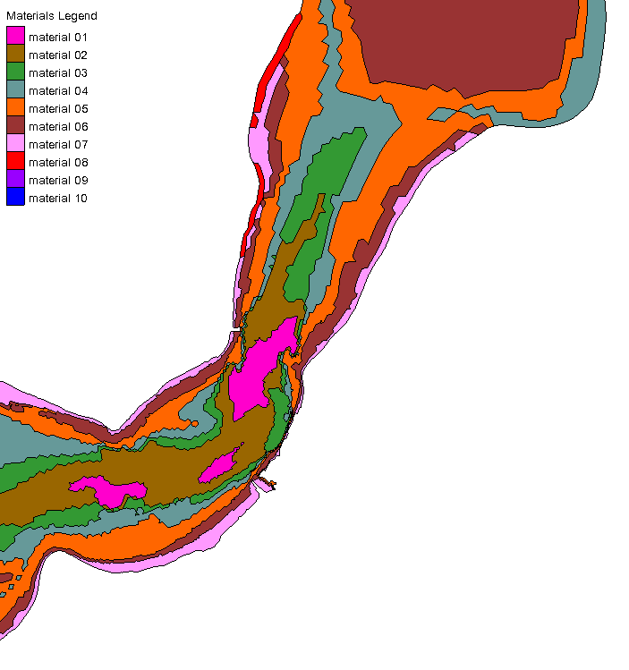
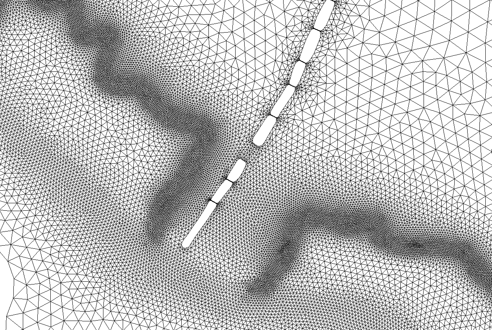
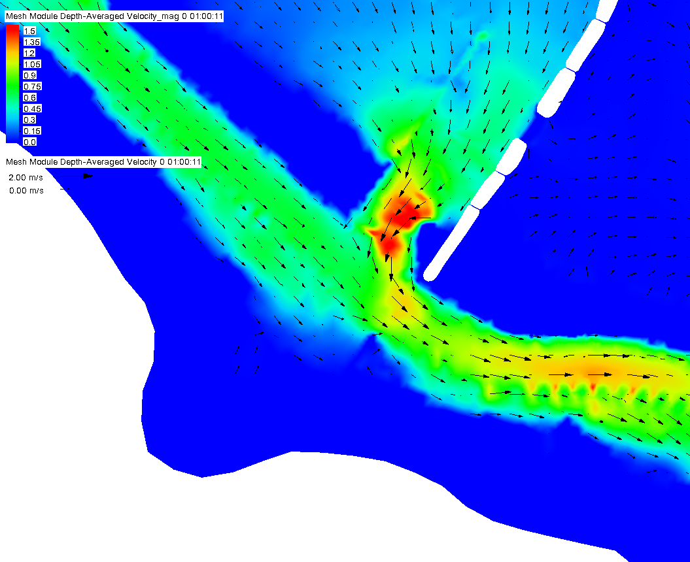
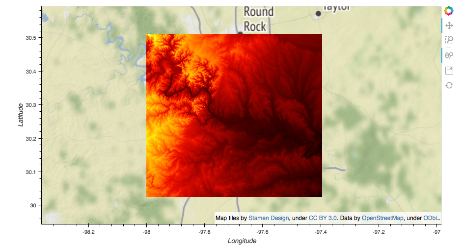
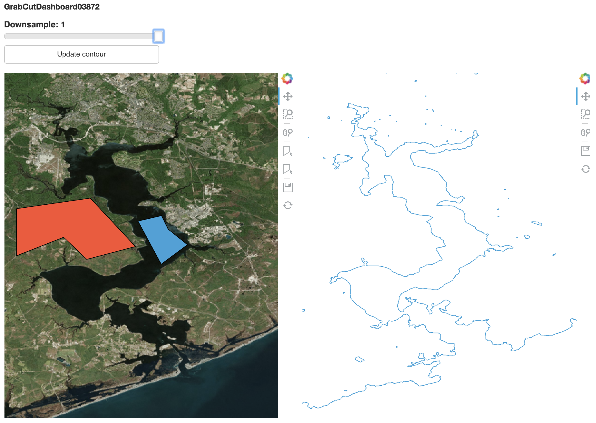
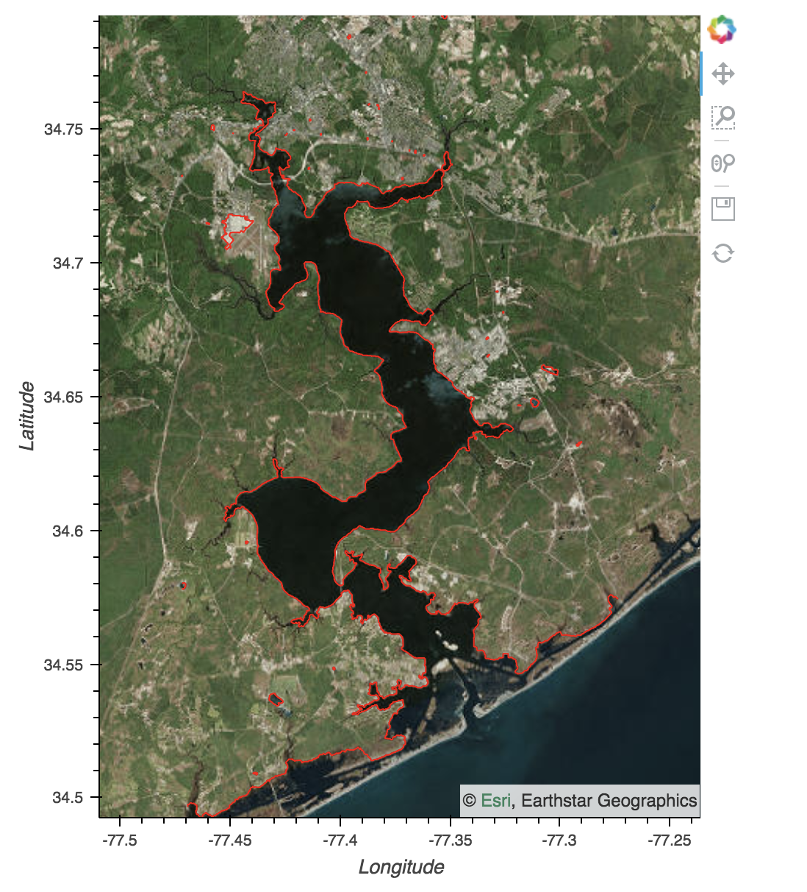

:author: Dharhas Pothina
:email: Dharhas.Pothina@erdc.dren.mil
:institution: US Army Engineer Research and Development Center
:corresponding:

:author: Philipp J. F. Rudiger
:email: prudiger@anaconda.com
:institution: Anaconda, Inc.

:author: James A Bednar
:email: jbednar@anaconda.com
:institution: Anaconda, Inc.

:author: Scott Christensen
:email: Scott.Christensen@erdc.dren.mil
:institution: US Army Engineer Research and Development Center
:equal-contributor:

:author: Kevin Winters
:email: Kevin.Winters@erdc.dren.mil
:institution: US Army Engineer Research and Development Center
:equal-contributor:

:author: Kimberly Pevey
:email: Kimberly.C.Pevey@erdc.dren.mil
:institution: US Army Engineer Research and Development Center
:equal-contributor:

:author: Christopher E. Ball
:email: cball@anaconda.com
:institution: Anaconda, Inc.
:equal-contributor:

:author: Gregory Brener
:email: gregshipssoftware@gmail.com
:institution: Anaconda, Inc.
:equal-contributor:

:video: https://youtu.be/KTbd_oUkP4Q

---------------------------------------------------------------------------------------
EarthSim: Flexible Environmental Simulation Workflows Entirely Within Jupyter Notebooks
---------------------------------------------------------------------------------------

.. class:: abstract

   Building environmental simulation workflows is typically a slow process involving multiple
   proprietary desktop tools that do not interoperate well. In this work, we demonstrate building
   flexible, lightweight workflows entirely in Jupyter notebooks. We demonstrate these capabilities
   through examples in hydrology and hydrodynamics using the AdH (Adaptive Hydraulics) and
   GSSHA (Gridded Surface Subsurface Hydrologic Analysis) simulators. The goal of this work is
   to provide a set of tools that work well together and with the existing scientific python ecosystem,
   that can be used in browser based environments and that can easily be reconfigured and repurposed
   as needed to rapidly solve specific emerging issues such as hurricanes or dam failures.

   As part of this work, extensive improvements were made to several general-purpose open source
   packages, including support for annotating and editing plots and maps in Bokeh and HoloViews,
   rendering large triangular meshes and regridding large raster data in HoloViews, GeoViews, and
   Datashader, and widget libraries for Param. In addition, two new open source projects are being
   released, one for triangular mesh generation (Filigree) and one for environmental data access (Quest).

.. class:: keywords

   python, visualization, workflows, environmental simulation, hydrology, hydrodynamics, grid generation

Introduction
------------

Environmental Simulation consists of using historical, current and forecasted environmental data in conjunction
with physics-based numerical models to simulate conditions at locations across the globe. The simulations of
primary interest are weather, hydrology, hydrodynamics, soil moisture and groundwater transport. These simulations
combine various material properties such as soil porosity and vegetation types with topology such as land surface
elevation and bathymetry, along with forcing functions such as rainfall, tide, and wind, to predict quantities of
interest such as water depth, soil moisture, and various fluxes. Currently, the primary methodology to conduct
these simulations requires a combination of heavy proprietary desktop tools such as Surface-water Modeling System (SMS) [Aquaveo]_
and Computational Model Builder (CMB) [Hines09]_, [CMB]_ that are tied to certain platforms and do not interoperate
well with each other.

The process of building and running environmental simulations using these tools is time consuming, requiring
a large amount of manual effort and a fair amount of expertise. Typically, the time required to build a
reasonable model is measured in months. These workflows support some use cases well, especially multi-year projects
where there is often the need for highly accurate, high-resolution physical modeling. But these existing tools and workflows
are too heavyweight for other potential applications, such as making short-term operational decisions in novel
locations. They also make it difficult to flexibly switch between desktop and remote high-performance-computing (HPC)
systems as needed for scaling up and for interactive use.

An additional limitation of the existing desktop tools (i.e. CMB and SMS) are that the users are limited to the functionality
and algorithms that are available in the tool. Adding new functionality requires expensive development efforts as well as
cooperation of the tool vendors. For example, adding a coastline extraction tool to CMB based on the grabcut algorithm
[Carsten04]_ required contracting with the vendor and several months of development time. As shown later in this paper, the
functionality can be quickly put together using existing packages within the scientific python ecosystem.

In this work, we demonstrate building flexible, lightweight workflows entirely in Jupyter notebooks with the aim of
timely support for operational decisions, providing basic predictions of environmental conditions quickly and flexibly
for any region of the globe.  For small datasets these notebooks can operate entirely locally, or they can be run with
local display and remote computation and storage for larger datasets. We demonstrate these capabilities through examples
in hydrology and hydrodynamics using the AdH [McAlpin17]_ and GSSHA [Downer08]_ simulators. The goal of this work is to provide
a set of tools that work well together and with the existing scientific python ecosystem, can be used in browser based
environments and that can easily be reconfigured and repurposed as needed to rapidly solve specific emerging issues. A
recent example of this was during Hurricane Harvey when ERDC was required at short notice to provide flood inundation
simulations of the cities of San Antonio, Houston and Corpus Christi to emergency response personnel. This required rapid
assembly of available data from disparate sources, generation of computational grids, model setup and execution as well
as generation of custom output visualizations.

An explicit decision was made to avoid creation of new special-purpose libraries as much as possible and to instead enhance existing
tools with the capabilities required. Hence, as part of this work, extensive improvements were made to several
general-purpose open source packages, including support for annotating and editing plots and maps in Bokeh and
HoloViews, rendering large triangular meshes and regridding large raster data in HoloViews, GeoViews, and Datashader,
and widget libraries for Param [Bokeh]_, [Holoviews]_, [Geoviews]_, [Datashader]_, [Param]_. In addition, two new open source projects are being released for
triangular mesh generation and environmental data access [Filigree]_, [Quest]_.

Background
----------

The traditional workflow for building environmental simulations can be broken down into the following stages:

   Example of a Region of Interest sectioned into multiple polygons each with a specific material property. :label:`materials`

1. Model specification: Building a human-specified conceptual model that denotes regions of interest (ROIs) and their properties. Typically, this involves drawing of points, lines and polygons to define the ROIs and define features, boundary types and material properties (land surface elevation, soil type, bottom friction, permeability, etc.). See Figure :ref:`materials`.

2. Data Retrieval: Material properties, hydrology and climatology datasets are retrieved from various public web-based and local-data stores.

3. Computational mesh generation: The ROIs are partitioned into a computational mesh that is used by the environmental simulation engine. The simulation types that we are focused on in this work use a 2D structured/regular rectangular grid or an unstructured 2D triangular mesh (See Figure :ref:`mesh`). 3D meshes are obtained by extruding the 2D mesh in the z direction in the form of layers. Initial generation of a computational mesh is typically automated and controlled by attributes in the model specification process. After this an iterative approach is used to build a high-quality mesh based on the needs of the numerical algorithms and to resolve key physical properties in certain regions. Often mesh vertices and elements need to be adjusted manually.

   Example of an unstructured 2D triangular computational mesh of a river that is transected by a roadway embankment with culvert and bridge openings. :label:`mesh`

4. Data gridding: Based on the model specification, any spatially varying material properties, initial conditions and time-varying forcing functions (i.e. boundary conditions) are regridded from the original data sources to the computational mesh.

5. Simulation: The computational mesh along with the re-gridded data, plus any model parameters (turbulence model, etc.) and forcings required (rainfall, etc.) needed for a specific simulation are written to files formatted for a particular environmental simulation engine. This model is then run with the simulation engine (i.e. AdH, GSSHA). For larger simulations, this is run on an HPC system.

6. Visualization/analysis: The results of environmental simulations typically consist of time varying scalar and vector fields defined on the computational mesh, stored in binary or ASCII files. Analysts first render an overall animation of each quantity as a sanity check, typically in 2D or 3D via a VTK-based Windows app in current workflows. For more detailed  analysis, analysts typically specify certain lower-dimensional subsets of this multidimensional space, such as:

   - Virtual measurement stations: A specific point on the Earth's surface where e.g. water level can be computed for every time point and then compared with historical data from nearby actual measurement stations
   - Cross-sections: A 1D curve across the surface of the Earth, where a vertical slice can be extracted and plotted in 2D
   - Iso-surfaces: Slices through the multidimensional data where a certain value is held constant, such as salinity. Associated quantities (e.g. temperature) can then be plotted in 2D as a color.

   Figure :ref:`velocityfield` shows an example visualization of a water circulation field.

   Water velocity color contours overlain with velocity quiver plot showing river flow bypassing roadway embankment. :label:`velocityfield`

This overall pipeline can give very high quality results, but it takes 3-6 months to build and run a model, which is
both expensive and also precludes the use of this approach for modeling emergent issues quickly enough to affect
operational decisions.  Most of these stages are also locked into particular Windows-based GUI applications that are
typically tied to execution only on specific desktop machines where they are installed. In most cases, once the model
input files are generated, they can be manually moved to an HPC cluster and run from the command line, but then no GUI is
available.  This linkage of computation and visualization can be very problematic, because the local machine may not
have enough processing power to simulate the model in a reasonable time, but if the model is simulated remotely, the
resulting data files can be too large to be practical to transfer to the local machine for analysis. To give an example of
the data sizes and timescales involved, simple example/tutorial hydrodynamic model runs on idealized domains using AdH
can take up to an hour. The largest simulation that can be run on a local workstation generate files of the order of a few
gigabytes and can take several days to run. Realistic, regional scale models are almost always run on HPC systems typically using
500 to a 1000 processors and generate up to a terabyte worth of data. HPC runs typically take anywhere from several hours to a day
to complete. An example of the type of HPC systems used for AdH model runs are the Department of Defences supercomputers Topaz and Onyx.
Topaz is an SGI ICE X System. Standard compute nodes have two 2.3-GHz Intel Xeon Haswell 18-core processors (36 cores) and 128 GBytes of DDR4 memory.
Compute nodes are interconnected by a 4x FDR InfiniBand Hypercube network. Onyx is a Cray XC40/50. Standard compute nodes have
two 2.8-GHz Intel Xeon Broadwell 22-core processors (44 cores) and 128 GBytes of DDR4 memory. Compute nodes are interconnected
by a Cray Aries high-speed network. Both systems have dedicated GPU compute nodes available. [ERDCHPC]_

Moreover, the tools that implement the current workflow are primarily "heavyweight" approaches that encode a wide
set of assumptions and architectural decisions specific to the application domain (environmental simulation), and
changing any of these assumptions or decisions will typically require an extensive vendor-implemented project of
C/C++ software development.  These constraints make it difficult for end users who are experts in the application
domain (but not necessarily full-time software developers) to develop and test architectural improvements and the
effects of different modeling approaches that could be suitable for specific applications.

Because much of the functionality required to implement the above workflow is already available as general-purpose
libraries in the Python software ecosystem, we realized that it was feasible to provide a lightweight, flexible alternative
for most of these stages, with rapid iterative refinement of a conceptual model, simulation on whatever hardware
is available, and fast, flexible, primarily 2D visualization of remote or local data in a local browser.  The idea
is to put power and flexibility into the hands of domain experts so that they can respond quickly and easily to
emerging issues that require input to help decision making throughout their organizations, without requiring a
lengthy period of model development and without requiring external software contractors to make basic changes to
assumptions and modeling mechanisms. In this paper, we show how we have built such a system.

EarthSim
--------

EarthSim is a website and associated GitHub repository that serves two purposes. First, it is a location to work on
new tools before moving them into other more general purpose python libraries as they mature. Second, it contains examples of how
to solve the common Earth Science simulation workflow and visualization problems outlined above. EarthSim aims to demonstrate building
flexible, lightweight workflows entirely in Jupyter notebooks with the goal of timely support for operational
decisions, providing basic predictions of environmental conditions quickly and flexibly for any region of the globe.
The overall goal is to provide a set of tools that work well together and with the wider scientific python ecosystem.
EarthSim is not meant to be a one-size-fits-all solution for environmental simulation workflows but a library of tools
that can be mixed and matched with other tools within the python ecosystem to solve problems flexibly and quickly. To that
end, the specific enhancements we describe are targeted towards areas where existing tools were not available or were
insufficient for setting up an end to end simulation.

EarthSim primarily consists of the core PyViz tools (Bokeh, HoloViews, GeoViews, Datashader, and Param) as well as two
other new open source tools Filigree and Quest. Short descriptions of these tools follow:

**Bokeh** provides interactive plotting in modern web browsers, running JavaScript but controlled by Python.  Bokeh allows Python users to construct interactive plots, dashboards, and data applications without having to use web technologies directly.

**HoloViews** provides declarative objects for instantly visualizable data, building Bokeh plots from convenient high-level specifications so that users can focus on the data being explored.

**Datashader** allows arbitrarily large datasets to be rendered into a fixed-size raster for display, making it feasible to work with large and remote datasets in a web browser, either in batch mode using Datashader alone or interactively when combined with HoloViews and Bokeh.

**Param** allows the declaration of user-modifiable values called Parameters that are Python attributes extended to have features such as type and range checking, dynamically generated values, documentation strings, and default values. Param allows code to be concise yet robustly validated, while supporting automatic generation of widgets for configuration setting and for controlling visualizations (e.g. using ParamBokeh).

All of the above tools are fully general, applicable to *any* data-analysis or visualization project, and establish a baseline capability for running analysis and visualization of arbitrarily large datasets locally or remotely, with fully interactive visualization in the browser regardless of dataset size (which is not true of most browser-based approaches).
The key is concept is that the local client system will always be cabable of performing the visualization, i.e. can deliver it to the user in a browser, regardless of the dataset size.  The assumption is that the remote server will be able to handle the datasets, but because Datashader is based on the Dask parallel library, it is possible to  assemble a remote system out of as many nodes as required need to handle a given dataset, also work can be done out of core if the user is prepared to wait.
Based on this architecture, this software stack will not be a limiting factor, only the users' ability to procure nodes or the time taken to render. This is in contrast to other software stacks that typically have a hard size limit. It can be clarified that we have achieved this claim by a three-level implementation: Dask, which can distribute the computation across arbitrarily many user-selected nodes (or multiplexed over time using the same node) to achieve the required computational power and memory, Datashader, which can make use of data and compute managed by dask to reduce the data into a fixed-size raster for display, and Bokeh, to render the resulting raster along with other relevant data like maps.

In addition, the data is not encoded, compressed, modeled, or subsampled, it's just aggregated (no data is thrown away, it's simply summed or averaged), and the aggregation is done on the fly to fit the resolution of the screen. This provides the experience of having the dataset locally, without actually having it and allows for responsive interactive exploration of very large datasets.

The other libraries involved are specialized for geographic applications:

**GeoViews** extends HoloViews to support geographic projections using the Cartopy library, making it easy to explore and visualize geographical, meteorological, and oceanographic datasets.

**Quest** is a library that provides a standard API to search, publish and download data (both geographical and non-geographical) across multiple data sources including both local repositories and web based services. The library also allows provides tools to manipulate and manage the data that the user is working with.

**Filigree** is a library version of the computational mesh generator from Aquaveo's XMS software suite [Aquaveo]_. It allows for the generation of high quality irregular triangular meshes that conform to the constraints set up by the user.

In surveying the landscape of existing python tools to conduct environmental simulations entirely within a Jupyter notebook
environment, four areas were found to be deficient:

1. Interactively drawing and editing of glyphs (Points, Lines, Polygons etc) over an image or map.
2. Interactive annotation of objects on an image or map.
3. Efficient visualization of large structured and unstructured grid data in the browser.
4. Setup of interactive dashboards.

In the next few sections, we describe how this functionality is now available from Python without requiring custom Javascript code.

Enhancements: Drawing Tools
---------------------------

The Bokeh plotting library has long supported extensive interactive operations for exploring existing data.  However, it did not previously offer any facilities for generating or editing new data interactively, which is required when constructing inputs for running new simulations.  In this project, we added a set of Bokeh editing/drawing tools (See Figure :ref:`drawingtools`), which are sophisticated multi-gesture tools that can add, delete, or modify glyphs on a plot. The edit tools provide functionality for drawing and editing glyphs client-side (in the user's local browser) and synchronizing the changes with data sources on the Python server that can then be accessed in Python. The individual tools can be enabled as needed for each particular plot:

-  **BoxEditTool**: Drawing, dragging and deleting rectangular glyphs.
-  **PointDrawTool**: Adding, dragging and deleting point-like glyphs.
-  **PolyDrawTool**: Drawing, selecting and deleting Polygon (patch) and Path (polyline) glyphs.
-  **PolyEditTool**: Editing the vertices of one or more Polygon or Path glyphs.

To make working with these tools easy, HoloViews was extended to define "streams" that provide an easy bidirectional connection between the JavaScript plots and Python (See Figure :ref:`drawingtoolspython`). This allows for definition of geometries in Python and editing in the interactive plot, or creation/modification of geometries in the interactive plot with subsequent access of the data from Python for
further processing.

.. figure:: images/drawing_tools.png

   Visualization of drawing tools showing drawn polygons, points, paths, and boundary boxes overlaying a web tile service. :label:`drawingtools`

.. figure:: images/drawing_tools_python.png

   Drawing tools provide a dynamic link to source data accessible via python backend. :label:`drawingtoolspython`

Similar tools allow editing points, polygons, and polylines.

As a simple motivating example, drawing a bounding box on a map now becomes a simple 7-line program:

.. code-block:: python

   import geoviews as gv
   import geoviews.tile_sources as gts
   import holoviews.streams as hvs

   gv.extension('bokeh')
   box = gv.Polygons(hv.Box(0, 0, 1000000))
   roi = hvs.BoxEdit(source=box)
   gts.StamenTerrain.options(width=900, height=500) * box

In a Jupyter notebook, this code will display a world map and let the user move or edit a box to cover the region of interest (ROI), which can then be accessed from Python as:

.. code-block:: python

   roi.data

For example, Figure :ref:`drawingtoolsoutputdata` demonstrates how USGS National Elevation Dataset (NED) data can then be retrieved for the ROI as:

.. code-block:: python

   import quest
   import xarray as xr
   import holoviews as hv
   import cartopy.crs as ccrs

   element = gv.operation.project(hv.Polygons(
        roi.element), projection=ccrs.PlateCarree()
     )
   xs, ys = element.array().T
   bbox = list(gv.util.project_extents(
       (xs[0], ys[0], xs[2], ys[1]),
       ccrs.GOOGLE_MERCATOR,
       ccrs.PlateCarree())
     )

   collection_name = 'elevation_data'
   quest.api.new_collection(name=collection_name)
   service_features = quest.api.get_features(
       uris='svc://usgs-ned:19-arc-second',
       filters={'bbox': bbox}
     )
   collection_features = quest.api.add_features(
       collection=collection_name,
       features=service_features
     )
   datasets = quest.api.stage_for_download(
       uris=collection_features
     )
   quest.api.download_datasets(datasets=datasets)
   elevation_dataset = quest.api.apply_filter(
       name='raster-merge',
       options={'datasets': datasets, 'bbox': bbox}
     )['datasets'][0]
   elevation_file = quest.api.get_metadata(
       elevation_dataset
     )[elevation_dataset]['file_path']

   elevation_raster = xr.open_rasterio(
       elevation_file
     ).isel(band=0)
   img = gv.Image(elevation_raster, ['x', 'y'])
   gts.StamenTerrain.options(width=600) * img

   Visualization data downloaded with quest for a ROI specified with the drawing tools. :label:`drawingtoolsoutputdata`

Enhancements: Annotations
-------------------------

The drawing tools allow glyphs to be created graphically, which is an essential first step in designing a simulation.  The next step is then typically to associate specific values with each such glyph, so that the user can declare boundary conditions, parameter values, or other associated labels or quantities to control the simulation. Examples of how to do this are provided in EarthSim as "annotators", which show an editable table alongside the plot that has drawing tools (See Figure :ref:`annotationtools`), allowing users to input text or numerical values to associate with each glyph. The table and plots are interlinked, such that editing either one will update the other, making it simple to edit data however is most convenient.

.. figure:: images/annotation_tools.png

   The Point Annotation tool provides for indexing and grouping of points :label:`annotationtools`

Using an annotator currently requires defining a new class to control the behavior, but work on simplifying this process is ongoing, and if it can be made more straightforward the code involved will move into GeoViews or HoloViews as appropriate.

Enhancements: Efficient Raster regridding
-----------------------------------------

Many of the datasets used in Earth-related workflows come in the form of multidimensional arrays holding values sampled regularly over some portion of the Earth's surface.  These rasters are often very large and thus slow to transfer to a client browser, and are often too large for the browser to display at all. To make it feasible to work naturally with this data, efficient regridding routines were added to Datashader.  Datashader is used by HoloViews to re-render data at the screen's resolution before display, requiring only this downsampled version to be transferred to the client browser. The raster support is described at `datashader.org <http://datashader.org/user_guide/5_Rasters.html>`__, using all available computational cores to quickly render the portions of the dataset needed for display.  The same code can also be used to re-render data into a new grid spacing for a fixed-sized rectangular simulator like GSSHA.

The Datashader code does not currently provide reprojection of the data into a different coordinate system when that is needed. A separate implementation using the xESMF library was also developed for GeoViews to address this need and to provide additional Earth-specific interpolation options.  The `geoviews.org website <http://geoviews.org/user_guide/Resampling_Grids.html>`__ explains how to use either the Datashader or xESMF regridding implementations developed in this project.

Enhancements: Triangular mesh visualization
-------------------------------------------

Although Earth imaging data is typically measured on a regular grid, how quickly the values change across the Earth's surface is highly non-uniform.  For instance, elevation changes slowly in many regions, but very quickly in others, and thus when simulating phenomena like water runoff it is often necessary to use very high resolution in some locations and relatively sparse sampling in others.  To facilitate working with irregularly gridded data, the Bokeh, HoloViews, GeoViews, and Datashader libraries were extended to support "TriMesh" data, i.e., irregular triangle grids. For very large such grids, Datashader allows them to be rendered into much smaller rectangular grids for display, making it feasible to explore meshes with hundreds of millions of datapoints interactively.  The other libraries provide additional interactivity for smaller meshes without requiring Datashader, while being able to use Datashader for the larger versions (Figure :ref:`trimesh`).

.. figure:: images/chesbay_detail.png

   Example of a datashader visualization of triangular unstructured mesh of a portion of Chesapeake Bay :label:`trimesh`

Interactive Dashboards
----------------------

The drawing tools make it possible to generate interactive dashboards quickly and easily to visualize and interact with source data. Figure :ref:`dashboardanimation` shows hydrodynamic model simulation results displayed in an animation on the left. Users are able to query the results by annotating paths directly on the results visualization. As annotations are added, the drawing on the right dynamically updates to show the depth results along the annotated paths. The animation tool is dynamically linked to both drawings to demonstrate changes over time.

.. figure:: images/dashboard_animation.png

   Dashboard with animation demonstrating the ability to dynamically visualize multiple looks at a single source dataset. :label:`dashboardanimation`

The drawing tools allow for specification of source data as key dimensions (independent variables or indices) or as value dimensions (dependent values or results data). Value dimensions can be visualized using widgets that are dynamically linked to the drawing. This allows for simplified visualizations of multi-dimensional datasets such as parameter sweeps (Figure :ref:`dashboardsweep`).

.. figure:: images/dashboard_sweep.png

   Dynamic interaction with drawing via interactive widgets. :label:`dashboardsweep`

Drawings can be both the sender and receiver of dynamic information. Dashboards can be created that visualize data, allow users to specify paths in which to query data (e.g. river cross-sections), and visualize the results of the query in a dynamic manner. In Figure :ref:`dashboardcrosssection`, the user-drawn cross-sections on the image on the left query the underlying depth data and generate the image on the right. Users can then interact with the right image sliding the vertical black bar along the image which simultaneously updates the left image with a marker to denote the location along the path.

.. figure:: images/dashboard_cross_section.png

   Dynamic linking provides interaction between drawings as both sender and receiver. :label:`dashboardcrosssection`

Crucially, note that very little of the code involved here is customized for hydrology or geographic applications specifically, which means that the same techniques can be applied to different problems as they arise in practice, even if they require changing the domain-specific assumptions involved.

GSSHA Hydrology Workflow Example
--------------------------------

Using many of the tools described here, we have created a notebook workflow to setup, execute, and visualize the results of the GSSHA hydrology model. This workflow uses the drawing tools to specify an area of interest, and then Quest to download elevation and landuse data. Param is used to specify the model inputs, and finally GeoViews and Datashader are used to visualize the results. This flexible workflow can easily be applied to any location in the globe, and the specific output visualizations can easily be modified to meet specific project needs. The complete workflow can be found at http://earthsim.pyviz.org/topics/GSSHA_Workflow.html.

AdH Dambreak Workflow Example
-----------------------------

The drawing tools, coupled with AdH, allow for rapid development of dambreak simulations to analyze potential hazard situations. In this example, as seen in Figure :ref:`dambreak`, the Polygon tool is used to delineate the boundary of a watershed, a dam centerline is specified with the Path tool, and a reservoir level specified with the Point tool.

.. figure:: images/dambreak.png

   User-specification of boundary, dam centerline, and reservoir level with the drawing tools. :label:`dambreak`

Data from all three user-specified data sources can also be accessed and described via tables that are dynamically linked to the drawing. Additionally, Param widgets allow for users to specify the reservoir level as either a water depth or an elevation and whether to use an existing inital water depth file.

Available elevation data to describe the watershed is collected via Quest. Filigree is then called to develop a unstructured 2D triangular mesh within the boundary polygon. Using the basic information about the dam and the dynamically generated mesh, a reservoir is created behind the dam centerline. This is achieved by setting AdH water depths on the mesh to reflect the reservoir level. AdH then simulates the instantaneous breaching of the dam. The resulting simulation of water depths over time can then be visualized in the drawing tools as an animation.

Coastline Extraction (GrabCut) Workflow Example
-----------------------------------------------

The GrabCut algorithm provides a way to annotate an image using polygons or lines to demark the foreground and background. The algorithm estimates the color distribution of the target object and that of the background using a Gaussian mixture model. This is used to construct a Markov random field over the pixel labels, with an energy function that prefers connected regions having the same label, and running a graph cut based optimization to infer their values. This procedure is repeated until convergence, resulting in an image mask denoting the foreground and background.

In this example this algorithm is applied to satellite imagery to automatically extract a coast- and shoreline contour. First we load an Image or RGB and wrap it in a HoloViews element, then we can declare a GrabCutDashboard (See Figure :ref:`grabcut1`). Once we have created the object we can display the widgets using ParamBokeh, and call the view function to display some plots.

The toolbar in the plot on the left contains two polygon/polyline drawing tools to annotate the image with foreground and background regions respectively. To demonstrate this process in a static paper there are already two polygons declared, one marking the sea as the foreground and one marking the land as the background.

   Demonstration of a interactive widget for coastline extraction using the grabcut algorithm. :label:`grabcut1`

We can trigger an update in the extracted contour by pressing the Update contour button. To speed up the calculation we can also downsample the image before applying the Grabcut algorithm. Once we are done we can view the result in a separate cell. See Figure :ref:`grabcut2`

  Final image with extracted coastline show in red. :label:`grabcut2`

The full coastline extraction with Grabcut Jupyter notebook is available at the EarthSim website: https://pyviz.github.io/EarthSim/topics/GrabCut.html

Future Work
-----------

Through the work presented here, we have shown that it is possible to build flexible, lightweight workflows entirely within Jupyter notebooks. However, there is still room for improvement.
Current areas being targeted for development are:

-  Performance enhancements for GIS & unstructured mesh datasets
-  Making annotation and drawing tools easier to use (i.e. requiring less custom code)
-  Layout of Jupyter Notebooks in Dashboard type form factors with code hidden
-  Integration with non Jupyter notebook web frontends (i.e. Tethys Platform [Swain14]_ )
-  Prototype bidirectional visual programing environment (e.g. ArcGIS Model Builder)

References
----------

.. [Downer08] Downer, C. W., Ogden, F. L., and Byrd, A.R. 2008, GSSHAWIKI User’s Manual, Gridded Surface Subsurface Hydrologic Analysis Version 4.0 for WMS 8.1, ERDC Technical Report, Engineer Research and Development Center, Vicksburg, Mississippi.

.. [McAlpin17] McAlpin, J. T. 2017, Adaptive Hydraulics 2D Shallow Water (AdHSW2D) User Manual (Version 4.6), Engineer Research and Development Center, Vicksburg, Mississippi. Available at https://chl.erdc.dren.mil/chladh

.. [Hines09] Hines, A. et al., Computational Model Builder (CMB): A Cross-Platform Suite of Tools for Model Creation and Setup, 2009 DoD High Performance Computing Modernization Program Users Group Conference, San Diego, CA, 2009, pp. 370-373.

.. [Carsten04] Carsten Rother, Vladimir Kolmogorov, and Andrew Blake. 2004. "GrabCut": interactive foreground extraction using iterated graph cuts. ACM Trans. Graph. 23, 3 (August 2004), 309-314. DOI: https://doi.org/10.1145/1015706.1015720

.. [Aquaveo] “Introduction | Aquaveo.com.” [Online]. Available: https://www.aquaveo.com/. [Accessed: 05-Jul-2018].

.. [CMB] “CMB Hydro | CMB.” [Online]. Available: https://www.computationalmodelbuilder.org/cmb-hydro/. [Accessed: 05-Jul-2018].

.. [Bokeh] “Welcome to Bokeh — Bokeh 0.13.0 documentation.” [Online]. Available: https://bokeh.pydata.org/en/latest/. [Accessed: 05-Jul-2018].

.. [Holoviews] “HoloViews — HoloViews.” [Online]. Available: http://holoviews.org/. [Accessed: 05-Jul-2018].

.. [Geoviews] “GeoViews — GeoViews 1.5.0+g63ddd7c-dirty documentation.” [Online]. Available: http://geoviews.org/. [Accessed: 05-Jul-2018].

.. [Datashader] “Installation — Datashader 0.6.6+geb9218c-dirty documentation.” [Online]. Available: http://datashader.org/. [Accessed: 05-Jul-2018].

.. [Param] “Param — Param 1.4.1-dev documentation.” [Online]. Available: http://param.pyviz.org/. [Accessed: 05-Jul-2018].

.. [Filigree] TODO talk to Aquaveo for correct Filigree reference

.. [Quest] “Welcome to Quest’s documentation! — Quest 0.5 documentation.” [Online]. Available: https://quest.readthedocs.io/en/latest/. [Accessed: 05-Jul-2018].

.. [EarthSim] “EarthSim — EarthSim 0.0.1 documentation.” [Online]. Available: http://earthsim.pyviz.org/. [Accessed: 05-Jul-2018].

.. [ERDCHPC] “ERDC DSRC - Hardware.” [Online]. Available: https://www.erdc.hpc.mil/hardware/index.html. [Accessed: 05-Jul-2018].

.. [Swain14] Swain, N., S. Christensen, N. Jones, and E. Nelson (2014), Tethys: A Platform for Water Resources Modeling and Decision Support Apps, paper presented at AGU Fall Meeting Abstracts.
