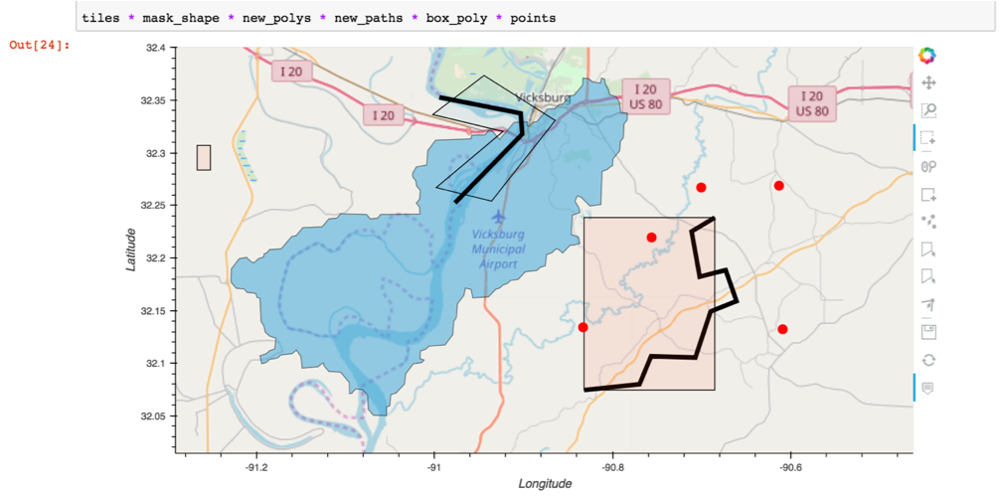
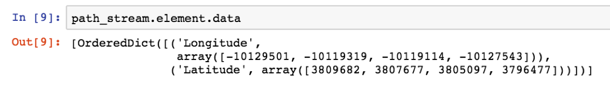
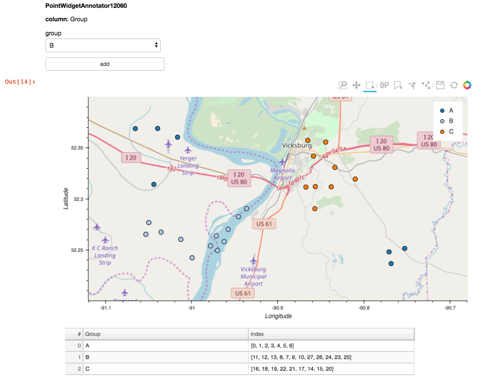
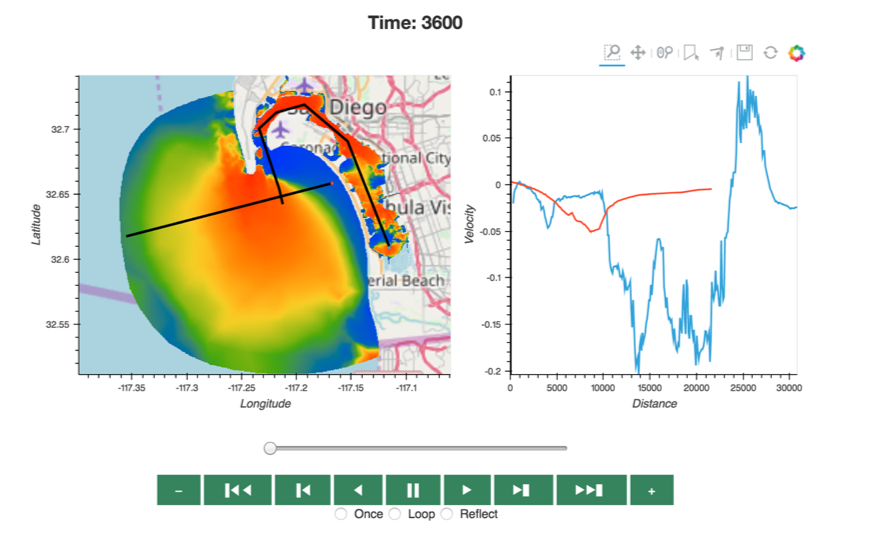
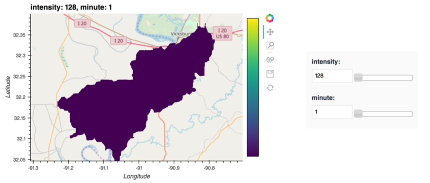
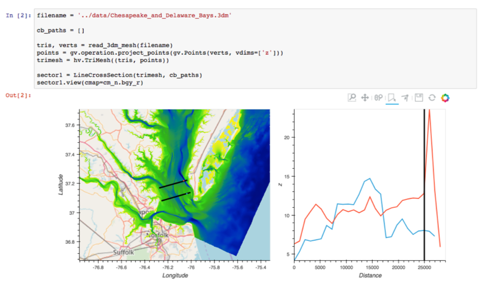

:author: Dharhas Pothina
:email: Dharhas.Pothina@erdc.dren.mil
:institution: US Army Engineer Research and Development Center
:corresponding:

:author: James A Bednar
:email: jbednar@anaconda.com
:institution: Anaconda, Inc.
:institution: University of Edinburgh

:author: Scott Christensen
:email: Scott.Christensen@erdc.dren.mil
:institution: US Army Engineer Research and Development Center
:equal-contributor:

:author: Kevin Winters
:email: Kevin.Winters@erdc.dren.mil
:institution: US Army Engineer Research and Development Center
:equal-contributor:

:author: Christopher Ball
:email: cball@anaconda.com
:institution: Anaconda, Inc.
:equal-contributor:

:author: Gregory Brener
:email: gregshipssoftware@gmail.com
:institution: Unaffiliated
:equal-contributor:

---------------------------------------------------------------------------------------
EarthSim: Flexible Environmental Simulation Workflows Entirely Within Jupyter Notebooks
---------------------------------------------------------------------------------------

.. class:: abstract

   Building environmental simulation workflows is typically a slow process involving multiple 
   proprietary desktop tools that do not interoperate well. In this work, we demonstrate building
   flexible, lightweight workflows entirely in Jupyter notebooks. We demonstrate these capabilities
   through examples in hydrology and hydrodynamics using the AdH and GSSHA simulators. The goal is 
   to provide a set of tools that can easily be reconfigured and repurposed as needed to rapidly 
   solve specific emerging issues.

   As part of this work, extensive improvements were made to several general-purpose open source 
   packages, including support for annotating and editing plots and maps in Bokeh and HoloViews, 
   rendering large triangular meshes and regridding large raster data in HoloViews, GeoViews, and 
   Datashader, and widget libraries for Param. In addition, two new open source projects are being 
   released for triangular mesh generation and environmental data access. 

.. class:: keywords

   python, visualization, workflows, environmental simulation, hydrology, hydrodynamics, grid generation

Introduction
------------

Environmental Simulation consists of using historical, current and forecasted environmental data in conjunction
with physics-based numerical models to simulate conditions at locations across the globe. The simulations of 
primary interest are weather, hydrology, hydrodynamics, soil moisture and groundwater transport. These simulations
combine various material properties such as soil porosity and vegetation types with topology such as land surface 
elevation and bathymetry, along with forcing functions such as rainfall, tide, and wind, to predict quantities of
interest such as water depth, soil moisture, and various fluxes. Currently, the primary methodology to conduct 
these simulations requires a combination of heavy proprietary desktop tools [cite SMS & CMB] that do not interoperate
well with each other. 

The process of building and running environmental simulations using these tools is a time-consuming process that 
requires a large amount of manual effort and a fair amount of expertise. Typically, the time required to build a 
reasonable model is measured in months. These workflows support some use cases well, especially multi-year projects 
where there is often the need for highly accurate, high-resolution physics. But the existing tools and workflows 
are too heavyweight for other potential applications, such as making short-term operational decisions in novel 
locations. 

In this work, we demonstrate building flexible, lightweight workflows entirely in Jupyter notebooks with the aim of
timely support for operational decisions, providing basic predictions of environmental conditions quickly and flexibly
for any region of the globe.  We demonstrate these capabilities through examples in hydrology and hydrodynamics using 
the AdH and GSSHA simulators [cite adh & gssha. The goal is to provide a set of tools that can easily be reconfigured and repurposed 
as needed to rapidly solve specific emerging issues. 

An explicit decision was made to avoid creation of new libraries as much as possible and to instead enhance existing
tools with the capabilities required. Hence, as part of this work, extensive improvements were made to several 
general-purpose open source packages, including support for annotating and editing plots and maps in Bokeh and 
HoloViews, rendering large triangular meshes and regridding large raster data in HoloViews, GeoViews, and Datashader, 
and widget libraries for Param [cite all software]. In addition, two new open source projects are being released for 
triangular mesh generation and environmental data access [cite filigree & quest].

Background
----------

The traditional workflow for building environmental simulations can be broken down into the following stages:

1. Model specification: Building a human-specified conceptual model that denote regions of interest (ROIs) and their properties. Typically, this involves drawing of points, lines and polygons to define to partition
 the ROIs and define features, boundary types and material properties (land surface elevation, soil type, bottom 
 friction, permeability, etc.) 
 
 [Fig: example image AdH model showing areas with material properties & some BC's]

2. Data Retrieval: Material properties, hydrology and climatology datasets are retrieved from various public web based 
and local data stores.

3. Computational mesh generation: The ROIs are partitioned into a computational mesh that is used by the environmental 
simulation engine. The simulation types that we are focused on in this work uses a 2D structured/regular grid or an 
unstructured 2D triangular mesh. 3D meshes are obtained by extruding the 2D mesh in the z direction in the form of layers.
Initial generation of a computational mesh is typically automated and controlled by attributes in the model specification process.
After this an iterative approach is used to build a good quality mesh based on the needs of the numerical 
algorithms and to resolve certain physics in certain regions. Often mesh vertices and elements need to be adjusted manually. 

 [Fig: show an example mesh]

4. Data gridding: Based on the model specification, any spatially varying material properties, initial conditions and 
time-varying forcing functions (i.e. boundary conditions) are regridded from the original data sources to the 
computational mesh.
     
5. Simulation: The computational mesh along with the re-gridded data, plus any model parameters (turbulence model etc.) 
and forcings required (rainfall, etc.) needed for a specific simulation are written to files formatted for a particular 
environmental simulation engine. This model is then run with the engine (i.e. AdH, GSSHA). For larger simulations, this 
is run on an HPC system. 

     
6. Visualization/analysis: The results of environmental simulations, typically consist of time varying scalar and 
vector fields defined on the computational mesh stored in binary or ascii files. Analysts first render an overall 
animation of each quantity as a sanity check, typically in 2D or 3D via a VTK-based Windows app. For more detailed 
analysis, analysts typically specify certain lower-dimensional subsets of this multidimensional space. i.e.: 
 - Virtual measurement station: A specific point on the Earth's surface where e.g. water level can be computed for 
 every time point and then compared with historical data from nearby actual measurement stations
 - Cross-sections: A 1D curve across the surface of the Earth, where a vertical slice can be extracted and plotted in 2D
 - Iso-surfaces: Slices through the multidimensional data where a certain value is held constant, such as salinity. Associated 
 quantities (e.g. temperature) can then be plotted in 2D as a color. 
 
    [fig: show some sample results from sms or cmb]

This overall pipeline can give very high quality results, but it takes 3-6 months to build and run a model, which is 
both expensive and also precludes the use of this approach for modeling emergent issues quickly enough to affect 
operational decisions.  Most of these stages are also locked into a particular Windows-based GUI application that is 
typically tied to execution only on specific desktop machines where it is installed. In most cases, once the model 
input files are generated, they can be moved to an HPC cluster and run from the command line.  This linkage of 
computation and visualization can be very problematic, because the local machine may not have enough processing 
power to simulate the model in a reasonable time, but if the model is simulated remotely, the resulting data files 
can be too large to be practical to transfer to the local machine for analysis. 

Moreover, the tools that implement the current workflow are primarily “heavyweight” approaches that encode a wide 
set of assumptions and architectural decisions specific to the application domain (environmental simulation), and 
changing any of these assumptions or decisions will typically require an extensive vendor-implemented project of 
C/C++ software development.  These constraints make it difficult for end users who are experts in the application 
domain (but not necessarily full-time software developers) to develop and test architectural improvements and the 
effects of different modeling approaches that could be suitable for specific applications.

Because much of the functionality required to implement the above workflow is already available as general-purpose 
libraries in the Python software ecosystem, it should be feasible to provide a lightweight, flexible alternative 
for most of these stages, with rapid iterative refinement of a conceptual model, simulation on whatever hardware 
is available, and fast, flexible, primarily 2D visualization of remote or local data in a local browser.  The idea 
is to put power and flexibility into the hands of domain experts so that they can respond quickly and easily to 
emerging issues that require input to help decision making throughout their organizations, without requiring a 
lengthy period of model development and without requiring external software contractors to make basic changes to 
assumptions and modeling mechanisms. In this paper, we show how we have built such a system.

EarthSim
--------

EarthSim is a website and associated GitHub repository that serves two purposes. First, it is a location to mature 
new tools before moving them into other more general purpose python libraries. Second, it contains examples of how 
to solve common Earth Science simulation workflow and visualization problems. EarthSim aims to demonstrate building
flexible, lightweight workflows entirely in Jupyter notebooks with the aim of timely support for operational 
decisions, providing basic predictions of environmental conditions quickly and flexibly for any region of the globe. 
The goal is to provide a set of tools that work well together and can easily be reconfigured and repurposed
as needed to rapidly solve specific emerging issues.

EarthSim primarily consists of the core PyViz tools (Bokeh, HoloViews, GeoViews, Datashader, and Param) as well as two
other open source tools Filigree and Quest. Short descriptions of these tools follow:

Bokeh is an interactive visualization library that targets modern web browsers for presentation. Its goal is to provide elegant, concise construction of versatile graphics, and to extend this capability with high-performance interactivity over very large or streaming datasets. Bokeh can help anyone who would like to quickly and easily create interactive plots, dashboards, and data applications.

HoloViews is an open-source Python library designed to make data analysis and visualization seamless and simple. With HoloViews, you can usually express what you want to do in very few lines of code, letting you focus on what you are trying to explore and convey, not on the process of plotting.

GeoViews is a Python library that makes it easy to explore and visualize geographical, meteorological, and oceanographic datasets, such as those used in weather, climate, and remote sensing research. GeoViews is built on the HoloViews library for building flexible visualizations of multidimensional data. GeoViews adds a family of geographic plot types based on the Cartopy library, plotted using either the Matplotlib or Bokeh packages.

Datashader is a graphics pipeline system for creating meaningful representations of large datasets quickly and flexibly. Datashader breaks the creation of images into a series of explicit steps that allow computations to be done on intermediate representations. This approach allows accurate and effective visualizations to be produced automatically without trial-and-error parameter tuning, and also makes it simple for data scientists to focus on particular data and relationships of interest in a principled way.

Param is a library providing Parameters: Python attributes extended to have features such as type and range checking, dynamically generated values, documentation strings, default values, etc., each of which is inherited from parent classes if not specified in a subclass. Param lets you program declaratively in Python, by just stating facts about each of your parameters, and then using them throughout your code. With Parameters, error checking will be automatic, which eliminates huge amounts of boilerplate code that would otherwise be required to verify or test user-supplied values.

Quest is a library that provides a standard API to search, publish and download data (both geographical and non-geographical) across multiple data sources including both local repositories and web based services. The library also allows provides tools to manipulate and manage the data that the user is working with.

Filigree is a library version of the computational mesh generator from Aquaveo's XMS software suite [cite XMS]. It allows for the generation of high quality computational meshes that conform to the constraints setup by the user. 

Enhancements: Drawing Tools
---------------------------

Bidirectional Connection between Javascript plots and Python

   This is the caption1. :label:`drawing_tools`

   This is the caption2. :label:`drawing_tools_python`

Enhancements: Annotations
-------------------------

Stuff about Annotations

   This is the caption2. :label:`annotation_tools`

Enhancements: Efficient Raster regridding
-----------------------------------------

Enhancements: Triangular mesh vizualization
-------------------------------------------

Addition of a TriMesh element to holviews. + Efficient Viz through DataShader

Interactive Dashboards
----------------------

Stuff about Annotations

   This is the caption3. :label:`dashboard_animation`

   This is the caption4. :label:`dashboard_sweep`

   This is the caption5. :label:`dashboard_cross_section`

GSSHA Hydrology Workflow Example
--------------------------------

AdH Dambreak Workflow Example
-----------------------------

Coastline Definition (GrabCut) Workflow Example
-----------------------------------------------

Conclusions and Future Work
---------------------------

Performance enhancements for GIS & Unstructured mesh datasets
Making annotation and drawing tools easier to use (i.e. less code)
Layout of Jupyter Notebooks in Dashboard type form factor
Integration with Tethys platform & other web frontends
Prototype bidirectional visual programing environment (a.k.a ArcGIS Model Builder)

