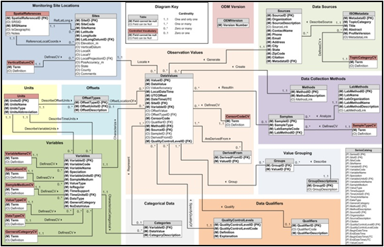
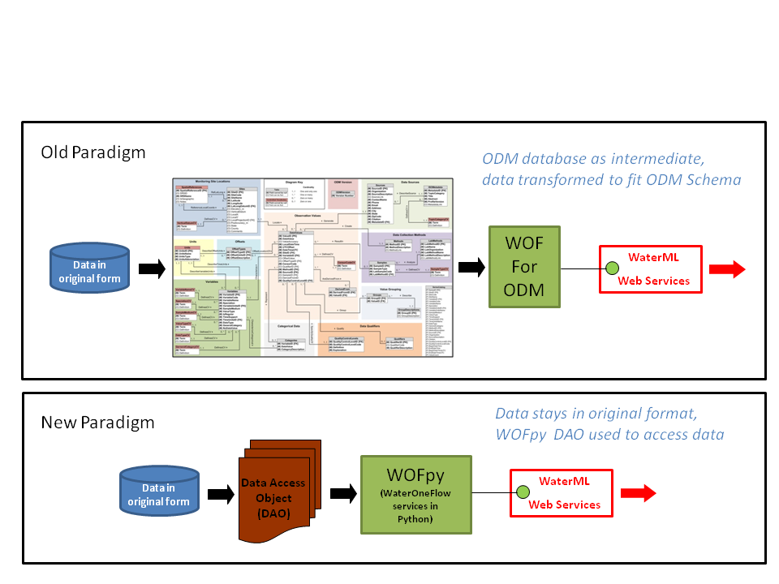
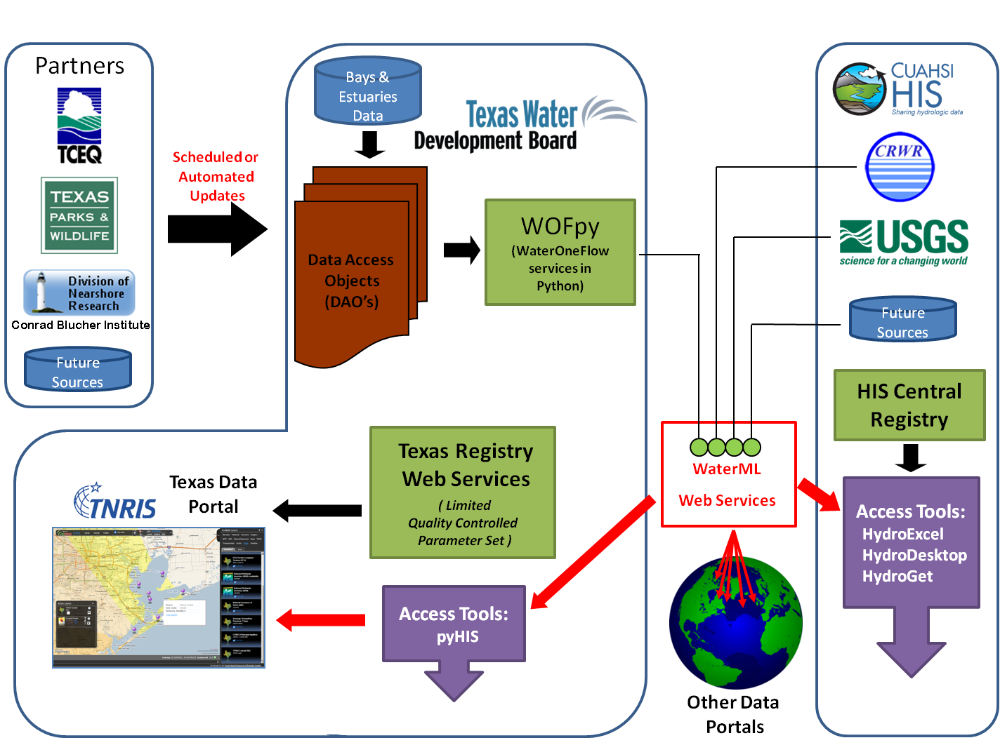
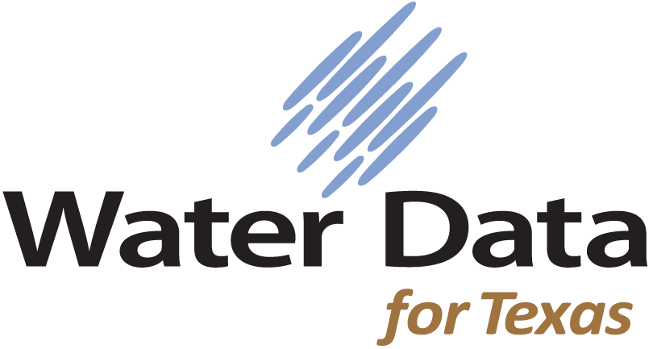

:author: Dharhas Pothina
:email: dharhas.pothina@twdb.state.tx.us
:institution: Texas Water Development Board

:author: Andrew Wilson
:email: andrew.wilson@twdb.state.tx.us
:institution: Texas Water Development Board

---------------------------------------------------------------------------------------
Using Python, Partnerships, Standards and Web Services to provide Water Data for Texans
---------------------------------------------------------------------------------------

.. class:: abstract

   Obtaining time-series monitoring data in a particular region often requires a significant effort involving visiting multiple websites, contacting multiple organizations and dealing with a variety of data formats. Although there has been a large research effort nationally in techniques to share and disseminate water related time-series monitoring data, development of a usable system has lagged. The pieces have been available for some time now, but a lack of vision,expertise, resources and software licensing requirements have hindered uptake outside of the academic research groups. The Texas Water Development Board is both a data provider and large user of data collected by other entities. As such, using the lessons learned from the last several years of research, we have implemented an expandable infrastructure for sharing water data in Texas. In this paper, we discuss the social, institutional and technological challenges in creating a system that allows discovery, access, and publication of water data from multiple federal, state, local and university sources and how we have used Python to create this system in a resource limited environment.

.. class:: keywords

   time-series, web services, waterml, data, wofpy, pyhis, HIS,
   hydrologic information system, cyberinfrastructure

Introduction
------------

A wealth of physical, chemical and biological data exists for Texas’ lakes, rivers, coastal bays and estuaries and the near-shore Gulf of Mexico, but unfortunately much of it remains unused by researchers and governmental entities because it is not widely disseminated and its existence not advertised. Historical data is typically stored by multiple agencies in a variety of incompatible formats, often poorly documented. Locating, retrieving and assembling these datasets into a form suitable for use in scientific studies often consumes a significant portion of many studies. Hence, despite having access to this information, much of the data remain underutilized in the hydrologic sciences due in part to the time required to access, obtain, and integrate data from different sources [Goodall2008]_ .

As both a consumer of water related data delivered by other entities and as a data provider whose data needs to be disseminated to external users the Texas Water Development Board (TWDB) has been researching the use of new technologies for data sharing for several years. The Texas Hydrologic Information System (Texas HIS) was born as a research project funded by the Texas Water Development Board (TWDB) and implemented by the University of Texas at Austin’s Center for Research in Water Resources (UT-CRWR) as a working prototype to facilitate data discovery, access, and publication of water related time-series monitoring data from multiple entities [Whiteaker2010]_. It was built as an extension of the national Hydrologic Information System (HIS) that was developed by the Consortium of Universities for the Advancement of Hydrologic Science, Inc. (CUAHSI) [Tarboton2009]_. This prototype proved the viability of using web services along with xml based data format standards to reliably exchange data and showed how once the infrastructure was put in place, powerful standards based tools could be developed to facilitate data discovery and access [Ames2009]_.

Using Standards - WaterML, WaterOneFlow and the Observations Data Model
-----------------------------------------------------------------------

CUAHSI-HIS provides web services, tools, standards and procedures that enhance access to more and better data for hydrologic analysis [Tarboton2009]_. CUAHSI-HIS has established a web service design called WaterOneFlow as a standard mechanism for the transfer of hydrologic data between hydrologic data servers (databases) and users. Web services streamline the often time-consuming tasks of extracting data from a data source, transforming it into a usable format and loading it in to an analysis environment [Maidment2009]_. All WaterOneFlow web services return data in a standard format called WaterML. The specifics of WaterML are documented as an Open Geospatial Consortium, Inc., discussion paper [Zaslavski2007]_.

To publish data in CUAHSI-HIS, a data source provides access to their data via a WaterOneFlow web service. CUAHSI-HIS also includes mechanisms for registering WaterOneFlow web services so that users can discover and use them. Data sources often store their data locally in a CUAHSI-HIS Observations Data Model (ODM) database, where ODM is a
database design for storing hydrologic time series data reported at discrete point locations [Horsburgh2008]_. ODM databases, ODM data loaders, and a special version of the WaterOneFlow web service specifically designed to work with ODM as its underlying data source are all available for free on the HIS website (http://his.cuahsi.org).

HydroExcel and HydroGet and HydroDesktop

   The Observations Data Model Schema. :label:`odmschema`

Barriers to Adoption
--------------------

Building on lessons learned during the development of the Texas HIS,
an attempt was made to expand this prototype into a productioninfrastructure that could be used reliably by the scientificcommunity. In order for this to happen, data providers needed to beconvinced to supply 

Understanding technology, resource issues, license issues,
platform compatibility

Changing Paradigms
------------------

Blah Blah.

   Comparison of changing paradigms. :label:`paradigm`

Using Python to serve data - WOFpy
----------------------------------

Using python to retrieve data - pyhis
-------------------------------------

Importance of Community
-----------------------

Water Data For Texas
--------------------

design

   Water Data for Texas Framework. :label:`wdftframework`

Blah de Blah.

   Water Data for Texas logo. :label:`wdftlogo`

Software Availability
---------------------

Conclusions
-----------

.. Customised LaTeX packages
.. -------------------------

.. Please avoid using this feature, unless agreed upon with the
.. proceedings editors.

.. ::

..   .. latex::
..      :usepackage: somepackage

..      Some custom LaTeX source here.

References
----------
.. [Goodall2008] Goodall, J. L., J. S. Horsburgh, T. L. Whiteaker, D. R. Maidment and I. Zaslavsky, *A first approach to web services for the National Water Information System*, Environmental Modeling and Software, 23(4): 404-411, doi:10.1016/j.envsoft.2007.01.005.

.. [Ames2009] Ames, D. P., J. Horsburgh, J. Goodall, T. Whiteaker, D. Tarboton and D. Maidment, (2009), *Introducing the Open Source CUAHSI Hydrologic Information System Desktop Application (HIS Desktop)*, 18th World IMACS Congress and MODSIM09 International Congress on Modelling and Simulation, ed. R. S. Anderssen, R. D. Braddock and L. T. H. Newham, Modelling and Simulation Society of Australia and New Zealand and International Association for Mathematics and Computers in Simulation, July 2009, p.4353-4359, http://www.mssanz.org.au/modsim09/J4/ames.pdf.

.. [Tarboton2009] Tarboton, D. G., J. S. Horsburgh, D. R. Maidment, T. Whiteaker, I. Zaslavsky, M. Piasecki, J. Goodall, D. Valentine and T. Whitenack, *Development of a Community Hydrologic Information System*, 18th World IMACS Congress and MODSIM09 International Congress on Modelling and Simulation, ed. R. S. Anderssen, R. D. Braddock and L. T. H. Newham, Modelling and Simulation Society of Australia and New Zealand and International Association for Mathematics and Computers in Simulation, July 2009, p.988-994.

.. [Whiteaker2010] Whiteaker, T. L., D. R. Maidment, D. Pothina, J. Seppi, E. Hersh, W. Harrison, *Texas Hydrologic Information System*, Proceedings of VI AWRA Spring Specialty Conference GIS and Water Resources, March 2010.

.. [Pothina2011] Pothina D., A. Wilson *Building a Coastal Geodatabasefor the State of Texas*, Report submitted to the Texas General LandOffice and the Mineral Management Service, Coastal Impact AssistanceProgram  Grant Award #M09AF15208, July 2011.

