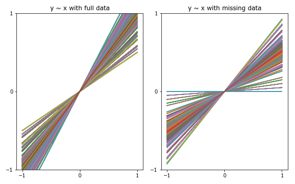
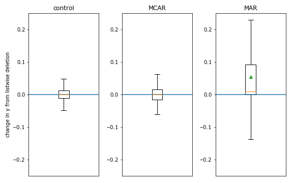
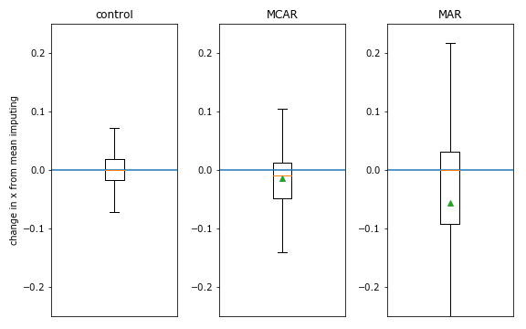
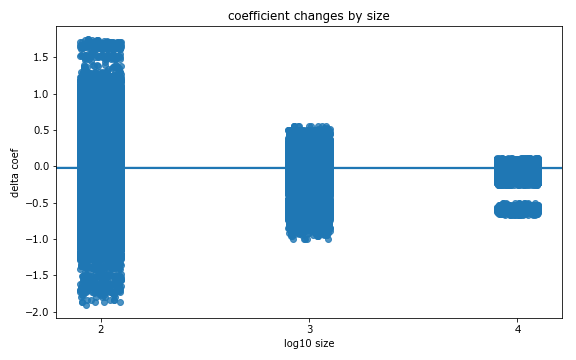

:author: Dillon Niederhut
:email: dniederhut@enthought.com
:institution: Enthought, Inc.
:corresponding:

:video: http://www.youtube.com/watch?v=dhRUe-gz690

-------------------------------------------
Safe handling instructions for missing data
-------------------------------------------

.. class:: abstract

   In machine learning tasks, it is common to handle missing data by removing observations with missing values, or replacing missing data with the mean value for its feature. To show why this is problematic, we use listwise deletion and mean imputing to recover missing values from artificially created datasets, and we compare those models against ones with full information. Unless quite strong independence assumptions are met, we observe large biases in the resulting coefficients and an increase in the model's prediction error. We conclude with a set of recommendations for handling missing data safely.

.. class:: keywords

   data science, missing data, imputation

Introduction
------------

It is common in data analytics tasks to encounter missing values in datasets, where by *missing* we mean that some particular values does or should exist, and failed to be observed or recorded [little-rubin-2002]_. There are several causes for missingness in datasets, which in vary in theoretical difficulty from bit flipping (less problematic) to participant dropout in extended experimental studies (more problematic). According to the Inglis Conjecture [#]_, the best way to handle missing data is to apply corrections to the acquisition of that data. Because strategies for doing this tend to be domain specific, we will not be addressing this topic further in this paper.

In a similar vein, there are several different strategies for handling the presence of missing values which tend to vary between fields, although they should not [newman-2014]_. At one end of this spectrum is the epidemiological community, who are both unusual and commendable for their principled stance and clear guidelines regarding the handling and reporting of missingness [perkins-et-al-2018]_. At the other end of the spectrum are research communities who handle missingness ad hoc often fail to report the presence of missingess at all.

Safe handling instructions are needed because the presence of unobserved data causes two theoretical problems with statistical models [schafer-graham-2002]_. One of these is inferential: when data are missing from a particular feature or variable, estimates of the variance of that feature are unreliable and therefore so are any tests that use those variances. The second of these is descriptive: when data are missing according to a particular pattern, model parameters that learn from the remaining data become biased.

Anecdotally, the machine learning community appears less concerned with statistical inference, and feels relatively comfortable with the idea of replacing missing values with the mean value for each feature. The justification appears to be that mean imputing (called single imputation in the missingness literature) preserves the central tendency for that feature. However, statistical learning procedures are not determined by the mean values of their features |---| indeed, we often scale these down to zero |---| but rather by the the relationship between variability between two features, which is modified by the presence of missing values.

This is the key theoretical problem with missing values: that they modify the covariance in datasets. To illustrate this, let's imagine that we have a dataset with no missing values and a linear relationship between one feature and one target. We'll remove 30% of the data, specifically the records at low values of our target, and then run a few models on the fully attested dataset and the dataset with missingness to see how the models compare.

   Best fit lines across experiments for a fully-attested dataset compared to best fit lines and for a dataset with missigness imposed at random. Note the bias in the differences in slope. :label:`prediction-lines`

What we see in Fig. :ref:`prediction-lines` is that the models run over the dataset with missing values have a very particular kind of error. Specifically, the error in estimating the coefficient of the feature is not distributed as a gaussian around the true value, but is always a reduction in the true value. This is bias, and it's being caused by a specific missingness process that we imposed on our data.

There are a theoretically infinite number of physical process that generate missingness in datasets, so in practice we will bin them into one of three categories that characterizes the input to the process which generates missing values [rubin-1976]_. If the probability that a value is missing is independent of any input, the process is stochastic and we call it Missing Completely At Random (MCAR). If the probability that a value is missing depends on another feature in our dataset, we call this Missing At Random (MAR) [#]_. If the probability that a value is missing depends on that value itself, we call this Missing Not At Random (MNAR). In theory, it is impossible to be certain whether values are MAR or MNAR, so they tend to be handled together.

Methods
-------

To demonstrate when and how this bias appears, 1890 datasets were randomly generated with linear, quadratic, and sinusoidal relationships between two features and one target, at sizes that ranged between 100 and 10000 rows, and with an error term that varied in strength between factors of 0.0 (no error) and 0.5 (half of the magnitude of the data). Missingness regimes were imposed on only one of these two features, which we will refer to as the principle feature (x). The equations for generating the targets are given in Eqs. :ref:`linear`, :ref:`quadratic`, and :ref:`sinusoidal`. The datasets were supplemented with two auxiliary features [#]_ whose correlation strength with the principal feature varied between 0.0 and 0.5.

.. math::
   :label: linear

   t = 2 * x + y + \varepsilon

.. math::
   :label: quadratic

   t = x^2 - y + \varepsilon

.. math::
   :label: sinusoidal

   t = 2 * sin(x) - y + \varepsilon

A fractional amount of values was removed from the principal feature for each of the three missingness regimes, MCAR, MAR, and MNAR. For data missing completely at random, this was done with np.random.choice. For data missing at random and not at random, this was done by using the index of the N smallest values of the target and the principle feature, respectively. The amount of data removed varied between 0% (no missingness) and 50% of attested values, which is typical of the amount of missingness reported in experimental studies (50% is on the high end, more likely to be observed in longitudinal studies [sullivan-et-al-2017]_).

Missing values were corrected using three different strategies. The first of these was to remove entire rows where any data is nonpresent |---| this is called listwise deletion. The second was single imputation. We used the mean imputer from scikit-learn, but prior research shows that more complicated single imputation has the same theoretical problems. The third strategy was an expectation maximizatino routine implemented in impyute [impyute]_, which estimates replacements for missing values given the full information in the dataset.

These datasets were fit with four models |---| linear regression, lasso regression, ridge regression, and support vector regression from scikit-learn. For stability when generating statistical summaries, each experimental combination for datasets with less than 10,000 rows was run through ten trials. This resulted in a total of 3,628,800 experiments.

For each experiment, difference scores were calculated for model coefficients between experiments with fully attested data and experiments with missing values for both the primary feature (the one with values removed by missingness) and the secondary feature (no data removed). We also calculated the difference in the mean squared error of the models between the full datasets and those with missingness applied.

Pairwise independent Welch's t-tests were performed on differences in the model coefficients and model error between the fully attested data and the three strategies for imputing missing values for each of the three kinds of missingness regimes, for a total of 9 tests. To avoid inflating the overall error rate for each family of comparisons, we used the Bonferroni correction and set the alpha for each individual test to 0.005.

Experiments were completed on a server with an AMD Phenom II X4 955 3.2 GHz processor running Ubuntu 16.04, under Anaconda Python 3.5.4, impyute 0.0.4, Numpy 1.13.1, scikit-learn 0.19.0. The code used to run these experiments, the data they generated, a Jupyter notebook containing the code for generating the statistics and plots in this paper, and frozen requirements for the code environment is publicly available at https://github.com/deniederhut/safe-handling-instructions-for-missing-data.

Results
-------

.. table:: Results of pairwise t-tests comparing difference scores for the primary coefficient. :label:`df-x-table`

    +----------+---------------+----------+----------+
    | regime   | strategy      | t        | p        |
    +==========+===============+==========+==========+
    | mcar     | listwise_del  | 0.389    | 0.697    |
    +----------+---------------+----------+----------+
    | mcar     | mean_imputer  | 7.684    | 0.0      |
    +----------+---------------+----------+----------+
    | mcar     | em_imputer    | 12.336   | 0.0      |
    +----------+---------------+----------+----------+
    | mar      | listwise_del  | 27.859   | 0.0      |
    +----------+---------------+----------+----------+
    | mar      | mean_imputer  | 28.509   | 0.0      |
    +----------+---------------+----------+----------+
    | mar      | em_imputer    | 48.919   | 0.0      |
    +----------+---------------+----------+----------+
    | mnar     | listwise_del  | 0.331    | 0.741    |
    +----------+---------------+----------+----------+
    | mnar     | mean_imputer  | 9.535    | 0.0      |
    +----------+---------------+----------+----------+
    | mnar     | em_imputer    | 36.687   | 0.0      |
    +----------+---------------+----------+----------+

Pairwise t-tests conducted on the coefficients of the primary feature show significant differences from zero in seven of the nine cases (Table :ref:`df-x-table`). The only cases where the model learned a similar coefficient involved the use of listwise deletion as a strategy for handling missing data. The smallest difference was observed for cases missing completely at random (stochastically). The largest differences were observed when data were missing at random.

.. table:: Results of pairwise t-tests comparing difference scores for the secondary coefficient. :label:`df-y-table`

  +----------+---------------+----------+----------+
  | regime   | strategy      | t        | p        |
  +==========+===============+==========+==========+
  | mcar     | listwise_del  | 0.005    | 0.996    |
  +----------+---------------+----------+----------+
  | mcar     | mean_imputer  | -2.28    | 0.023    |
  +----------+---------------+----------+----------+
  | mcar     | em_imputer    | -3.745   | 0.0      |
  +----------+---------------+----------+----------+
  | mar      | listwise_del  | -29.256  | 0.0      |
  +----------+---------------+----------+----------+
  | mar      | mean_imputer  | -2.437   | 0.015    |
  +----------+---------------+----------+----------+
  | mar      | em_imputer    | -2.876   | 0.004    |
  +----------+---------------+----------+----------+
  | mnar     | listwise_del  | -3.486   | 0.0      |
  +----------+---------------+----------+----------+
  | mnar     | mean_imputer  | -0.128   | 0.898    |
  +----------+---------------+----------+----------+
  | mnar     | em_imputer    | 0.072    | 0.943    |
  +----------+---------------+----------+----------+

Pairwise t-tests conducted on the difference scores for the secondary coefficient show a similar pattern of results (Table :ref:`df-y-table`). Specifically, the only case in which the estimated parameter for the feature without any missingness applied to it was close to zero was when data were missing completely at random, and the missing cases were removed listwise. The largest differences in the coefficient for the secondary feature were observed for data missing at random or missing not at random, also when the missingness strategy employed was listwise deletion. Listwise deletion tends to cause the coefficient for the secondary feature to be underestimated, while both imputation strategies tend to cause the coefficient to be overestimated.

.. table:: Results of pairwise t-tests comparing difference scores for the model error. :label:`df-error-table`

    +----------+---------------+----------+----------+
    | regime   | strategy      | t        | p        |
    +==========+===============+==========+==========+
    | mcar     | listwise_del  | -1.332   | 0.183    |
    +----------+---------------+----------+----------+
    | mcar     | mean_imputer  | -5.643   | 0.0      |
    +----------+---------------+----------+----------+
    | mcar     | em_imputer    | -7.297   | 0.0      |
    +----------+---------------+----------+----------+
    | mar      | listwise_del  | -46.945  | 0.0      |
    +----------+---------------+----------+----------+
    | mar      | mean_imputer  | -54.322  | 0.0      |
    +----------+---------------+----------+----------+
    | mar      | em_imputer    | -52.646  | 0.0      |
    +----------+---------------+----------+----------+
    | mnar     | listwise_del  | -9.102   | 0.0      |
    +----------+---------------+----------+----------+
    | mnar     | mean_imputer  | -12.127  | 0.0      |
    +----------+---------------+----------+----------+
    | mnar     | em_imputer    | -17.626  | 0.0      |
    +----------+---------------+----------+----------+

Pairwise t-tests applied to the overall model error show a similar pattern of results, where the only difference score that is close to zero is for the case of listwise deletion applied to a dataset where values are missing completely at random (Table :ref:`df-error-table`). The largest increases in model error is observed when data are missing at random, no matter which strategy for handling missingness is used.

Discussion
----------

   Changes in the coefficient of y when using listwise deletion across different missingness regimes. :label:`listwise-del`

We find that deleting records with missing values is only safe when data are missing completely at random. Under other missingness regimes, this strategy produced biased coefficients for all features, and significantly worse model errors. Interestingly, listwise deletion as a strategy produced the largest bias of all tested strategies in features with no missing data, significantly overestimating their importance to the model (Fig. :ref:`listwise-del`). This suggests that unsafe use of listwise deletion may be one contributing factor in spurious correlations and findings that otherwise fail to replicate.

   Changes in the coefficient of x when using single imputation across different missingness regimes. :label:`mean-imputing`

Single imputation, or using a feature mean or median as replacement for missing data, results in biased coefficients and significantly larger model errors no matter what kind of process created the missingness in the dataset (Fig. :ref:`mean-imputing`). As such, it is our recommendation that it not be used. However, in this set of experiments single imputation did produce smaller biases in model features that were not missing any data.

We were surprised by the poor performance of expectation maximization in this experiment given the widespread evidence of its effectiveness in prior literature [shah-et-al-2014]_. This discrepancy could be due to a mistake in the design of the experiment, or due to the algorithms implementation in impyute. As far as we are aware, well-tested multiple imputation libraries like MICE [vanbuuren-groothuisoudshoorn-2011]_, Amelia  [blackwell-honaker-king-2017]_, and MissForest [stekhoven-buhlmann-2012]_, have yet to be ported to Python.

   Changes in the coefficient of x by the size of the total dataset. :label:`df-x-by-size`

As a final comment, we often hear that the solution for missing values is simply to collect more data. However, unless this additional data collection explcitly addresses missingness by correcting the acquisition process (per Inglis), the additional data has the paradoxical effect of making the biases *worse*. The expected magnitude of the bias does not change with data size |---| this is goverened by the missingness regime and the fraction of missing data. However, the variance in the bias across repeated experiments will shrink, leading to confidence in the estimated coefficients that is both misplaced and inflated (fig. :ref:`df-x-by-size`).

Guidelines
----------

We include here guidelines for researchers to use when handling missing data to ensure that it is done safey.

1. Try to construct your acquisition step such that there will not be missing values. This may involve following up with individual cases to find why they are nonpresent, so plan to track to provenance of your data.
2. In addition to your primary features of interest, collect data that are known to be causally related or correlated. These are called auxiliary features and will help you establish the missingness regime for your data and generate realistic estimates for missing values if needed.
3. Once your data have been collected, examine them for patterns of missingness. A common approach is to build a missingness indicator for each feature with missing values, and run pairwise correlations against other features in the dataset. This is more effective with good auxilliary features.
4. If you are 100% sure that your missingness is MCAR, you have the option of using listwise deletion, keeping in mind that this should not be done for analyses with low statistical power.
5. Otherwise use a modern multiple imputation technique like MICE or MO, and generate 5-10 imputed datasets. Be sure to create any derived features that you plan on including in your final model before you do this.
6. Run the rest of your analysis as planned for each of the imputed datasets, and report the average parameters of all of the imputed models.
7. When you report your results, include the fraction of missing values, the pattern of missing values, and the strategy used to handle them. If your imputed models have widely diverging results, you should report descriptive statistics for parameters are highly variable.

Conclusion
----------

Missing values are a widespread issue in many analytical fields. To handle them safely, there must be some understanding of the kind of process that generated them. Data that are missing completely at random (stochastically) do not create bias during parameter estimation, and can be handled by removing rows with missing values. Missing values that exhibit a definite pattern or dependency need to be replaced by reasonable estimates using a modern multiple imputation technique. Finally, to ensure reproducibility, statistics and decisions at each of these steps should be reported.

.. [#] Named after Dr. Ben Inglis of the University of California, the Inglis Conjecture states that it requires less effort to fix the data acquisition step than to perform post hoc statistical corrections.

.. [#] *Random* in the sense of a random variable, which is a statistical designation roughly corresponding to a dependent variable.

.. [#] An auxiliary feature is one which measures a related variable but is not necessarily included in the final model.

References
----------

.. [blackwell-honaker-king-2017] M. Blackwell, J. Honaker, and G. King.
    *A unified approach to measurement error*, Sociological Methods & Research,
    46:303-341, 2017. doi:10.1177/0049124115585360.

.. [vanbuuren-groothuisoudshoorn-2011] S. van Buuren and K. Groothuis-Oudshoorn.
    *mice: multivariate imputation by chained equations in R*,
    Journal of Statistical Software, 45, 2011.

.. [impyute] E. Law. *impyute*,
          https://pypi.org/project/impyute/.

.. [little-rubin-2002] R. Little and D. Rubin.
    *Statistical analysis with missing data (2nd ed.).*
    New York, NY: Wiley. 2002. doi:10.1002/9781119013563.

.. [newman-2014] D. Newman, *Missing data: five practical guidelines*,
    Organizational Research Methods, 17:372-411. doi:10.1177/1094428114548590.

.. [perkins-et-al-2018] N. Perkins, S. Cole, O. Harel, E. Tchetgen, B. Sun,
    E. Mitchell, and E. Schisterman.
    *Principled approaches to missing data in epidemiological studies*.
    American Journal of Epidemiology, 187:568-575, 2018.
    doi: 10.1093/aje/kwx348.

.. [rubin-1976] D. Rubin. *Inference and missing data*,
    Biometrika, 63:581-592, 1976. doi:10.1093/biomet/63.3.581.

.. [schafer-graham-2002] J. Schafer and J. Graham.
    *Missing data: Our view of the state of the art.*
    Psychological Methods, 7:147-177, 2002. doi:10.1037/1082-989X.7.2.147.

.. [shah-et-al-2014] A. Shah, J. Bartlett, J. Carpenter, O. Nicholas, and
    H. Hemingway. *Comparison of random forest and parametric imputation models for imputing missing data using MICE: A CALIBER study.*
    American Journal of Epidemiology, 179:764-774, 2014.
    doi:10.1093/aje/kwt312

.. [stekhoven-buhlmann-2012] D. Stekhoven and P. Bühlmann.
    *MissForest - non-parametric missing value imputation for mixed-type data*,
    Bioinformatics, 28:112-118, 2012. doi:10.1093/bioinformatics/btr597.

.. [sullivan-et-al-2017] T. Sullivan, L. Yelland, K. Lee, P. Ryan, and
    A. Salter. *Treatment of missing data in follow-up studies of randomised controlled trials: A systematic review of the literature*. Clinical Trials, 14:387-395, 2017. doi:10.1177/1740774517703319.
