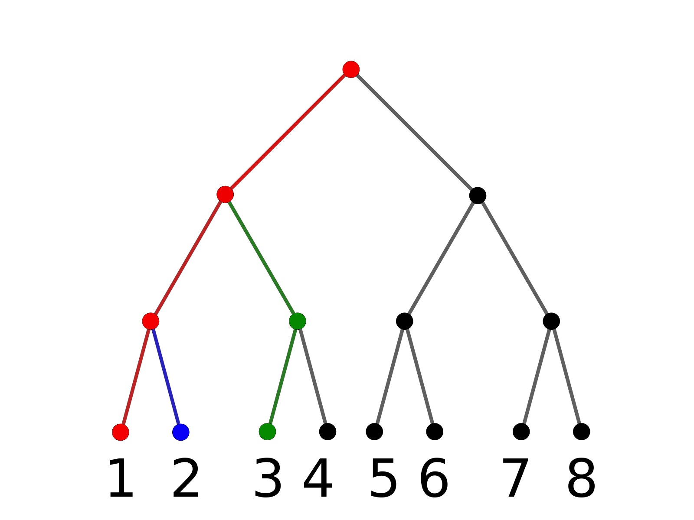

:author: Dmitry Petrov
:email: to.dmitry.petrov@gmail.com
:institution: Imaging Genetics Center, University of Southern California, Los Angeles, USA
:institution: The Institute for Information Transmission Problems, Moscow, Russia
:corresponding:
:equal-contributor:

:author: Alexander Ivanov
:email: alexander.radievich@gmail.com
:institution: The Institute for Information Transmission Problems, Moscow, Russia
:institution: Skoltech Institute of Science and Technology, Moscow, Russia
:equal-contributor:

:author: Daniel Moyer
:email: dcmoyer@gmail.com
:institution: Imaging Genetics Center, University of Southern California, Los Angeles, USA

:author: Mikhail Belyaev
:email: belyaevmichel@gmail.com
:institution: Skoltech Institute of Science and Technology, Moscow, Russia

:author: Paul Thompson
:email: pthomp@usc.edu
:institution: Imaging Genetics Center, University of Southern California, Los Angeles, USA

:video: https://github.com/neuro-ml/reskit

--------------------------------------------------------------------------------------------------
Reskit: a library for creating and curating reproducible pipelines for scientific machine learning
--------------------------------------------------------------------------------------------------

.. class:: abstract

In this work we introduce Reskit (researcher’s kit), a library for creating and
curating reproducible pipelines for scientific machine learning. A natural
extension of the Scikit-learn Pipelines to general classes of pipelines, Reskit
allows for the efficient and transparent optimization of each pipeline step.
Its main features include data caching, compatibility with most of the
scikit-learn objects, optimization constraints such as forbidden combinations,
and table generation for quality metrics. Reskit’s design will be especially
useful for researchers requiring pipeline versioning and reproducibility, while
running large volumes of experiments.

.. class:: keywords

   data science, reproducibility, python

Introduction
------------

A central task in machine learning and data science is the comparison and
selection of models. The evaluation of a single model is very simple, and can
be carried out in a reproducible fashion using the standard scikit pipeline.
Organizing the evaluation of a large number of models is tricky; while there
are no real theory problems present, the logistics and coordination can be
tedious. Evaluating a continuously growing zoo of models is thus an even more
painful task. Unfortunately, this last case is also quite common.

The task is simple: find the best combination of pre-processing steps and
predictive models with respect to an objective criterion. Logistically this can
be problematic: a small example might involve three classification models, and
two data preprocessing steps with two possible variations for each — overall 12
combinations. For each of these combinations we would like to perform a grid
search of predefined hyperparameters on a fixed cross-validation dataset,
computing performance metrics for each option (for example ROC AUC). Clearly
this can become complicated quickly. On the other hand, many of these
combinations share substeps, and re-running such shared steps amounts to a loss
of compute time.

Reskit [1] is a Python library that helps researchers manage this problem.
Specifically, it automates the process of choosing the best pipeline, i.e.
choosing the best set of data transformations and classifiers/regressors. The
researcher specifies the possible processing steps and the scikit objects
involved, then Reskit expands these steps to each possible pipeline, excluding
forbidden combinations. Reskit represents these pipelines in a convenient
pandas dataframe, so the researcher can directly visualize and manipulate the
experiments.

Reskit then runs each experiment and presents results which are provided to the
user through a pandas dataframe. For example, for each pipeline’s classifier,
Reskit could  grid search on cross-validation to find the best classifier’s
parameters and report metric mean and standard deviation for each tested
pipeline. Reskit also allows you to cache interim calculations to avoid
unnecessary recalculations.

Main features of Reskit
-----------------------

- En masse experiments with combinatorial expansion of step options, running
  each option and returning results in a convenient format for human
  consumption (Pandas dataframe).

- Step caching. Standard SciKit-learn pipelines cannot cache temporary steps.
  Reskit includes the option to save fixed steps, so in next pipeline
  specified steps won’t be recalculated.

- Forbidden combination constraints. Not all possible combinations of pipelines
  are viable or meaningfully different. For example, in a classification task
  comparing the performance of logistic regression and decision trees the
  former requires feature scaling while the latter may not. In this case you
  can block the unnecessary pair. Reskit supports general tuple blocking as
  well.

- Full compatibility with scikit-learn objects. Reskit can use any scikit-learn
  data transforming object and/or predictive model, and many other libraries
  that uses the scikit template.

- Evaluation of multiple performance metrics simultaneously. Evaluation is
  simply another step in the pipeline, so we can specify a number of possible
  evaluation metrics and Reskit will expand out the computations for each
  metric for each pipeline.

- The DataTransformer class, which is Reskit’s simplfied interface for
  specifying fit/transform methods in pipeline steps. A DataTransformer
  subclass need only specify one function.

- Tools for learning on graphs. Due to our original motivations, Reskit
  includes a number of operations for network data. In particular, it allows  a
  variety of normalization choices for adjacency matrices, as well as built in
  local graph metric calculations. These were implemented using DataTransformer
  and in some cases the BCTpy (the Brain Connectivity Toolbox python version)

.. csv-table:: A plan of the experiment we set in our example.
  :file: papers/dmitry_petrov/plan_table.csv
  :widths: 1 10 15 15

How Reskit works
----------------

Let's consider an example of Reskit usage in a classification problem. Let's
say we want to try two scalers, two dimension reduction techniques and three
classifiers for our classification problem. We want to make grid search of
models parameters on stratified 5-fold cross-validation and validate found best
parameters on another stratified 5-fold cross-validation. Also, we don't want
to use ``MinMaxScaler`` for ``KernelPCA`` in our pipelines. Using Reskit for
this task the code has the clear structure and looks as follows:

.. code-block:: python

    from sklearn.preprocessing import StandardScaler
    from sklearn.preprocessing import MinMaxScaler

    from sklearn.svm import SVC
    from sklearn.linear_model import LogisticRegression
    from sklearn.linear_model import SGDClassifier
    from sklearn.decomposition import PCA
    from sklearn.decomposition import KernelPCA

    from sklearn.model_selection import StratifiedKFold
    from sklearn.datasets import make_classification

    from reskit.core import Pipeliner

.. code-block:: python

    # Setting variants for steps by lists of tuples
    scalers = [('standard', StandardScaler()),
               ('minmax', MinMaxScaler())]
    dim_reduction = [('pca', PCA()),
                     ('k_pca', KernelPCA())]

    # Setting models
    classifiers = [('LR', LogisticRegression()),
                   ('SVC', SVC()),
                   ('SGD', SGDClassifier())]

    # Reskit needs to define steps in this manner
    steps = [('scaler', scalers),
             ('dim_reduction', dim_reduction),
             ('classifier', classifiers)]

    # Grid search parameters for our models
    param_grid = {'LR': {'penalty': ['l1', 'l2']},
                  'SVC': {'kernel': ['linear', 'poly', 
                                     'rbf', 'sigmoid']},
                  'SGD': {'penalty': ['elasticnet'],
                          'l1_ratio': [0.1, 0.2, 0.3]}}

    # Setting a quality metric that we want to optimize
    scoring='roc_auc'

    # Setting cross-validations
    grid_cv = StratifiedKFold(n_splits=5, 
                              shuffle=True, 
                              random_state=0)
    eval_cv = StratifiedKFold(n_splits=5, 
                              shuffle=True, 
                              random_state=1)

    banned_combos = [('minmax', 'k_pca')]
    pipe = Pipeliner(steps=steps, 
                     grid_cv=grid_cv, 
                     eval_cv=eval_cv, 
                     param_grid=param_grid, 
                     banned_combos=banned_combos)

.. csv-table:: Grid Search results in our example in 'results' variable.
  :file: papers/dmitry_petrov/results_grid_search.csv
  :widths: 1 20 17 45

We specified needed parameters, ``Pipeliner`` combined possible steps to
different pipelines and wrote it to self ``plan_table`` parameter as `pandas
DataFrame`. You can view it (`Table 1`) to check further calculation plan.

To start calculations run ``get_results`` method of ``Pipeliner``:

.. code-block:: python

    X, y = make_classification(random_state=0)
    results = pipe.get_results(X, y, scoring=scoring)

Thus, in ``results`` variable we have grid search (`Table 2`) and validation
(`Table 3`) results in a table. This table includes `Tables 1, 2 and 3`.  

For curating pipelines we used ``Pipeliner`` class. The following section describes
this class in details.

   A tree of caching temporary results. Let's say each branch is a pipeline
   labelled by a number.  Then after the first pipeline is calculated (red
   colour)  you need to recalculate in the second pipeline only last step (blue
   colour). And in the third pipeline, you already need to recalculate two
   steps (green colour).

Pipeliner class
---------------

Heart of Reskit — an object which allows you to test different data
preprocessing pipelines and prediction models at once. You will need to specify
a name of each preprocessing and prediction step and possible objects
performing each step as in the example above. Then ``Pipeliner`` will combine
these steps to different pipelines, excluding forbidden combinations; perform
experiments according to these steps and present results in convenient CSV
table. For example, for each pipeline’s classifier, ``Pipeliner`` will grid
search on cross-validation to find the best classifier’s parameters and report
metric mean and std for each tested pipeline. ``Pipeliner`` also allows you to
cache interim calculations to avoid unnecessary recalculations.

``Pipeliner`` initializes with following parameters:

``steps`` is a list of `(step_name, transformers)` tuples, where `transformers`
is a list of tuples `(step_transformer_name, transformer)`. ``Pipeliner`` will
create ``plan_table`` from this ``steps``, combining all possible combinations
of transformers, switching transformers on each step.

``eval_cv`` and ``grid_cv`` determine the grid search and the evaluation
cross-validation splitting strategies.

``param_grid`` is a dictionary with classifiers names (string) as keys. The keys are
possible classifiers names in steps. Each key corresponds to grid search
parameters.

``banned_combos`` is a list of `(transformer_name_1, transformer_name_2)` tuples.
Each row with both transformers will be removed from plan_table.

The main method of ``Pipeliner`` that starts all calculations is ``get_results``.
After we ran calculations through this method ``Pipeliner`` passes through
``plan_table`` and makes three steps for each row.

Firstly, ``Pipeliner`` makes transformations according to specified
``caching_steps``.  If ``caching_steps`` isn't set , it just returns ``X`` and
``y``, otherwise it makes all transformations with caching temporary results in
``_cached_X`` parameter of ``Pipeliner``. The process of caching temporary
results may be considered on a tree example (look at `Fig.  1`), where the same
parts of previous and current branches won't be recalculated (red colour), but
different --- will be recalculated (blue and green colour).

Secondly, ``Pipeliner`` creates usual `scikit-learn` pipeline and makes grid
search to find best parameters. The mean and standard deviation with found best
parameters on defined ``grid_cv`` cross-validation are written to the table of
results (`Table 2`). Best parameters also are written to the table of results.

Thirdly, ``Pipeliner`` evaluates found in previous step best parameters on
another ``eval_cv`` cross-validation. It writes mean, standard deviation and
scores of quality metric on ``eval_cv`` to the table of results (`Table 3`).

.. csv-table:: Validation results in 'results' variable.
  :file: papers/dmitry_petrov/results_evaluation.csv
  :widths: 1 18 18 30

DataTransformer class
---------------------
 
For convenience of the researchers we added ``DataTransformer`` class — a simple 
class which allows researcher to make sklearn-like transformers through usual
functions. 

Here is example of normalizing by mean of three matrices.

.. code-block:: python

    import numpy as np

    from reskit.normalizations import mean_norm
    from reskit.core import DataTransformer

    matrix_0 = np.random.rand(5, 5)
    matrix_1 = np.random.rand(5, 5)
    matrix_2 = np.random.rand(5, 5)
    y = np.array([0, 0, 1])

    X = np.array([matrix_0,
                  matrix_1,
                  matrix_2])

    output = np.array([mean_norm(matrix_0),
                       mean_norm(matrix_1),
                       mean_norm(matrix_2)])

    def mean_norm_trans(X):
        X = X.copy()
        N = len(X)
        for i in range(N):
            X[i] = mean_norm(X[i])
        return X

    result = DataTransformer(
                func=mean_norm_trans).fit_transform(X)

    prin((output == result).all())

And the output will be:

.. code-block:: bash

    True

With the support of ``DataTransformer``, you can implement a needed to you
transformation and use it general ``Pipeliner`` workflow, that give more
flexibility in calculation methods.

MatrixTransformer class
-----------------------

Particular case of ``DataTransformer`` is a ``MatrixTransformer``.

Here is the same example, but for ``MatrixTransformer`` usage. Input ``X`` for transformation
with ``MatrixTransformer`` should be a 3 dimensional array (array of matrices). So,
``MatrixTransformer`` just transforms each matrix in ``X``.

.. code-block:: python

    from reskit.core import DataTransformer

    result = MatrixTransformer(
                func=mean_norm).fit_transform(X)

    print((output == result).all())

Answer:

.. code-block:: bash

    True

Brain Connectivity Toolbox functions wrapper
--------------------------------------------

We provide some basic graph metrics in Reskit. To access most state of the art
graph metrics you can use Brain Connectivity Toolbox. You should install it via
pip in terminal:

.. code-block:: bash

    pip3 install bctpy

With support of ``bctpy`` we can simply calculate `Pagerank` for previous
matrices ``X``.

.. code-block:: python

    from bct.algorithms import centrality

    pagerank = centrality.pagerank_centrality
    featured_X = MatrixTransformer(
            d=0.85,
            func=pagerank).fit_transform(X)

So, using ``Pipeliner`` with `Brain Connectivity Toolbox` provides you
convenient functionality for your research.

Applications
------------

Reskit was originally developed for a brain network classification task. We
have successfully applied it in our own research several times [PRNI2016,
ISBI2017, MICCAI2017]. Code from two of these projects can be found at
[PRNI_code] and [ISBI_code].

In first one we proposed a combination of geometric network normalization by
squared Euclidean distance between zones and topological normalization by the
geometric mean of adjacent nodes' weighted degrees. Reskit helped us to try
needed normalizations and figure out how these normalizations boost network
classification.

In second work we studied the extent to which brain networks and topological
derivative measures are unique to individual changes within human brains. To do
so, we classify brain networks pairs as either belonging to the same individual
or not. Here, we used Reskit already for pairwise classification task and we
reach it with ease through using ``DataTransformer`` with implemented
especially for this task functions.

There is no consensus on how to construct brain networks. How variations in
pre-processing steps affect network reliability and its ability to distinguish
subjects remains opaque. In third work, we address this issue by comparing 35
structural connectome-building pipelines. Again, we classify network pairs as
either belonging to the same individual or not. We also compare pariwise
classification results to a commonly used parametric test-retest measure.
Intraclass Correlation Coefficient (ICC). Thus, except pairwise classification,
we also just calculated ICC for each pipeline. To solve this two type of tasks
we used Reskit caching feature and clean code structure, that we a lot of time
with little changes. Finally, we presented a straight-forward method for
evaluating brain connectivity construction pipelines that may be useful in
identifying overall trends in brain network usefulness.

We believe the library is general enough to be useful in a variety of data
science contexts, and we hope that other researchers will find this library
useful in their studies.

Dependencies
------------

- Python 3.4 and higher.
- Scikit-learn [scikit] 0.18.1 and its dependencies. Our library was heavily
  inspired by scikit-learn Pipeline class and overall architecture of this
  library. One can think of Reskit as an extension of  scikit-learn pipelines.
- Pandas [pandas].
- SciPy [scipy], Python-Igraph [igraph] and NetworkX [networkx] for machine learning on networks.

Future plans
------------

- Ability to merge  multiple experiment plans.
- Distributed computing for calculation on computing clusters.
- Ability to calculate different quality metrics after one optimization.
- Public repository of DataTransformers for various purposes.
- Option to save best models/pipelines according to external criteria.
- Support for Python 2.7

Conclusion
----------

In this abstract we introduced Reskit, a library for creating and curating
reproducible pipelines for scientific machine learning. Reskit allows for the
efficient and transparent optimization of each pipeline step. Its main features
include data caching, compatibility with most of the scikit-learn objects,
optimization constraints, and table generation for quality metrics. Reskit’s
design will be especially useful for researchers requiring pipeline versioning
and reproducibility, while running large volumes of experiments.

References
----------

.. [reskit] https://github.com/neuro-ml/reskit/tree/master

.. [scikit] http://scikit-learn.org/stable/

.. [bct] https://sites.google.com/site/bctnet/

.. [pandas] http://pandas.pydata.org/

.. [scipy] https://www.scipy.org/

.. [igraph] http://igraph.org/python/

.. [networkx] https://networkx.github.io/

.. [PRNI2016] D. Petrov, Y. Dodonova, L. Zhukov, M. Belyaev, Boosting Connectome Classification via Combination of Geometric and Topological Normalization, 6th International Workshop on
   Pattern Recognition in Neuroimaging - 2016

.. [ISBI2017]  https://arxiv.org/abs/1701.07847

.. [PRNI_code] https://github.com/neuro-ml/PRNI2016

.. [ISBI_code] https://github.com/neuro-ml/structural-connectome-validation-pairwise
