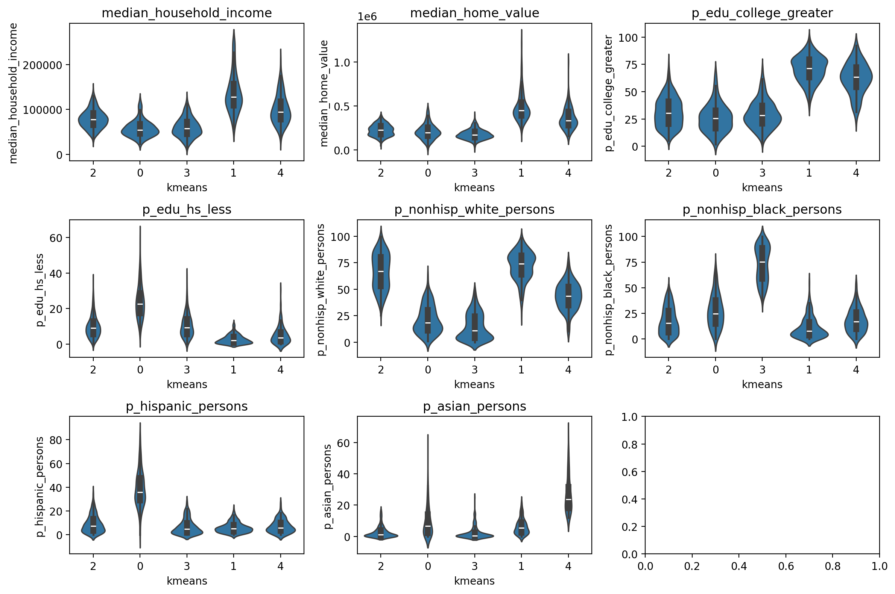

---
# Ensure that this title is the same as the one in `myst.yml`
title: "geosnap: The Geospatial Neighborhood Analysis Package"
subtitle: Open Tools for Urban, Regional, and Neighborhood Science
abstract: |
  Understanding neighborhood context is critical for social science research, public
  policy analysis, and urban planning. The social meaning, formal definition, and formal
  operationalization of "neighborhood" depends on the study or application, however, so
  neighborhood analysis and modeling requires both flexibility and adherence to a formal
  pipeline. Maintaining that balance is challenging for a variety of reasons. To address
  those challenges, `geosnap`, the Geospatial Neighborhood Analysis Package provides a
  suite of tools for exploring, modeling, and visualizing the social context and spatial
  extent of neighborhoods and regions over time. It brings together state-of-the-art
  techniques from geodemographics, regionalization, spatial data science, and
  segregation analysis to support social science research, public policy analysis, and
  urban planning. It provides a simple interface tailored to formal analysis of
  spatiotemporal urban data.

---

## Introduction

Quantitative research focusing on cities, neighborhoods, and regions is in high
demand. On the practical side, city planners, Non-Governmental Organizations
(NGOs), and commercial businesses all have increasing access to georeferenced
datasets and spatial analyses can turn these data into more efficient,
equitable, and profitable, decision-making [@cortes2020OpensourceFramework;
@finio2022SmartGrowth; @Kang2021; @Knaap2017; @knaap2023SegregatedDesign;
@Rey2022a; @wei2022ReducingRacial]. On the academic side, many of the
era's pressing problems are spatial or urban in form, requiring
bespoke statistical methods and simulation techniques to produce accurate
inferences. Thus, while data science teams in industries across the planet race
to conquer 'geospatial data science' few practitioners have expertise in the
appropriate data sources, modeling frameworks, or data management techniques
necessary for wrangling and synthesizing urban data.

To address these challenges we introduce `geosnap`, the geospatial neighborhood analysis
package, which is a unique Python package sitting at the intersection of spatial science
and practical application. In doing so, it provides a bridge between formal spatial
analysis and the applied fields of neighborhood change, access to
opportunity, and the social determinants of health. The package provides fast
and efficient access to hundreds of socioeconomic, infrastructure, and environmental
quality indicators that allow researchers to move from zero data to an informative model
in a few short lines of code. 

It is organized into layers for data acquisition, analysis, and visualization, and 
includes tools for harmonizing disparate datasets into consistent geographic boundaries,
creating "geodemographic typologies" that summarize and predict multidimensional
segregation over time, and network analysis tools that generate rapid (locally
computed) service areas and travel isochrones. We expect the tool will be immediately
useful for any analyst studying urban areas.

## The Geospatial Neighborhood Analysis Package (geosnap)

`geosnap` provides a suite of tools for exploring, modeling, and visualizing the social
context and spatial extent of neighborhoods and regions over time. It brings together
state-of-the-art techniques from geodemographics, regionalization, spatial data science,
and segregation measurement to support social science research, public policy analysis, and
urban planning. It provides a simple interface tailored to formal analysis of
spatiotemporal urban data, and its primary features include

- Quick access to a large database of commonly used neighborhood indicators from
  U.S. providers including the U.S. Census, the Environmental Protection Agency
  (EPA), Longitudinal Household-Employment Dynamics (LEHD), the National Center
  for Education Statistics (NCES), and National Land Cover Database (NLCD),
  streamed efficiently from the cloud or stored for repeated use.
- Fast, efficient tooling for standardizing data from multiple time periods into a
  shared geographic representation appropriate for spatiotemporal analysis
- Analytical methods for understanding sociospatial structure in neighborhoods, cities,
  and regions, using unsupervised ML from scikit-learn and spatial optimization from
  PySAL
- Classic and spatial analytic methods for diagnosing model fit, and locating (spatial)
  statistical outliers
- Novel techniques for understanding the evolution of neighborhoods over time, including
  identifying hotspots of local neighborhood change, as well as modeling and simulating
  neighborhood conditions into the future
- Unique tools for measuring segregation dynamics over space and time
- Bespoke visualization methods for understanding travel commute-sheds, business
  service-areas, and neighborhood change over time

The package is organized into four layers providing different aspects of functionality,
namely `io` for data ingestion and storage, `analyze` for analysis and modeling
functions, `harmonize` for geographic boundary harmonization, and `viz` for
visualization.

```python
import geopandas as gpd
import matplotlib.pyplot as plt
import pandas as pd
from geosnap import DataStore
from geosnap import analyze as gaz
from geosnap import io as gio
from geosnap import visualize as gvz
from geosnap.harmonize import harmonize
```

### Data

Neighborhoods, cities, and regions can be characterized by a variety of data. Researchers use the social, environmental,
institutional, and economic conditions of the area to understand change in these places and the people who inhabit them. The geosnap
package tries to make the process of collecting and wrangling these various
publicly available datasets simpler, faster, and more reproducible by
repackaging the most commonly used into modern formats and serving (those we are
allowed to) over fast web protocols. This makes it much faster to conduct,
iterate, and share analyses for better urban research and public policy than the
typical method of gathering repeated datasets from disparate providers in old
formats. Of course, these datasets are generally just a starting place, designed
to be used alongside additional information unique to each study region.

Toward that end, many of the datasets used in social science and public policy research
in the U.S. are drawn from the same set of resources, like the Census, the Environmental
Protection Agency (EPA), the Bureau of Labor Statistics (BLS), or the National Center
for Education Statistics (NCES), to name a few. As researchers, we found ourselves
writing the same code to download  the same data repeatedly. That works in some cases, but it is also cumbersome, and can
be extremely slow for even medium-sized datasets (tables with roughly 75 thousand rows and 400 columns representing Census Tracts in the USA can take several hours or even days to download from Census servers). While there are nice tools like
[cenpy](https://github.com/cenpy-devs/cenpy) or
[pyrgris](https://walker-data.com/pygris/), these tools cannot overcome a basic
limitation of many government data providers, namely that they use old technology, e.g.,
File Transfer Protocol (FTP) and outdated file formats (like shapefiles).

Thus, rather than repetitively querying these slow servers, geosnap takes the
position that it is preferable to store repeatedly-used datasets in
[highly-performant formats](https://github.com/opengeospatial/geoparquet),
because they are usually small and fast enough to store on disk. When not on
disk, it makes sense to stream these datasets over
[S3](https://aws.amazon.com/s3/), where they can be read very quickly (and
directly). For that reason, geosnap maintains
[a public S3 bucket](https://open.quiltdata.com/b/spatial-ucr), thanks to the
[Amazon Open Data Registry](https://github.com/awslabs/open-data-registry), and
uses [quilt](https://www.quiltdata.com/) to manage data under the hood. A
national-level dataset of more than 200 Census variables at the blockgroup scale
(n=220333), *including geometries* can be downloaded in under two minutes,
requires only 921MB of disk space, and can be read into GeoPandas in under four
seconds. A comparable dataset stored on the Census servers takes more than an
hour to download from the Census FTP servers in compressed format, requires more
than 15GB of uncompressed disk space, and is read into a GeoDataFrame in 6.48
seconds, including only the geometries.

The `DataStore` class is a quick way to access a large database of social, economic, and
environmental variables tabulated at various geographic levels. These data are not
required to use the package, and `geosnap` is capable of conducting analysis anywhere in
the globe, but these datasets are used so commonly in U.S.-centric research that
the developers of `geosnap` maintain this database as an additional layer.

```python
datasets = DataStore()
```


#### Demographics

Over the last decade, one of the most useful resources for understanding socioeconomic
changes in U.S. neighborhoods over time has been the
[Longitudinal Tract Database (LTDB)](https://s4.ad.brown.edu/Projects/Diversity/researcher/bridging.htm),
which is used in studies of neighborhood change [@Logan_2014]. One of the most
recognized benefits of this dataset is that it standardizes boundaries for census
geographic units over time, providing a consistent set of units for time-series
analysis. A benefit of these data is the ease with which researchers
have access to hundreds of useful intermediate variables computed from raw Census data
(e.g. population rates by race and age). Unfortunately, the LTDB data is only available
for a subset of Census releases (and only at the tract level), so geosnap includes
tooling that computes the same variable set as LTDB, and it provides access to those
data for every release of the 5-year ACS at both the tract and blockgroup levels
(variable permitting). Note: following the Census convention, the 5-year releases are
labelled by the terminal year.

Unlike LTDB or the National Historical Geographic Information System
([NHGIS](https://www.nhgis.org/)), these datasets are created using code that collects raw
data from the Census FTP servers, computes intermediate variables according to the
codebook, and saves the original geometries-- and is
[fully open and reproducible](https://github.com/oturns/geosnap/blob/main/tools/process_census_gdb.ipynb).
This means that all assumptions are exposed, and the full data processing pipeline is
visible to any user or contributor to review, update, or send corrections. Geosnap's
approach to data provenance reflects our view that open and transparent analysis is
always preferable to black boxes, and is a much better way to promote scientific
discovery. Further, by formalizing the pipeline using code, the tooling is re-run to
generate new datasets each time ACS or decennial Census data is released.

To load a dataset, e.g. 2010 tract-level census data, call it as a method to return a geodataframe. Geometries are available for all of the commonly used administrative units,
many of which have multiple time periods available:

- metropolitan statistical areas (MSAs)
- states
- counties
- tracts
- blockgroups
- blocks

Datasets can be queried and subset using an appropriate Federal Information Processing
Series
[(FIPS) Code](https://www.census.gov/library/reference/code-lists/ansi.html),
which uniquely identifies every federally defined geographic unit in the U.S.

```python
# blockgroups in San Diego county from the 2014-2018 American Community Survey
# (San Diego county FIPS is 06073)
sd = gio.get_acs(datasets, year=2018, county_fips=['06073'])
```

There is also a table that maps counties to their constituent Metropolitan Statistical Areas (MSAs). Note that
blockgroups are not exposed directly, but are accessible as part of the ACS and the Environmental Protection Agency's  Environmental Justic Screening Tool (EJSCREEN)
data. If the dataset exists in the `DataStore` path, it will be loaded from disk,
otherwise it will be streamed from S3 (provided an internet connection is available).
The geosnap `io` module (aliased here as `gio`) has a set of functions for creating
datasets for different geographic regions and different time scales, as well as
functions that store remote datasets to disk for repeated use.

#### Environment

The Environmental Protection Agency (EPA)'s
[envrironmental justice screening tool (EJSCREEN)](https://www.epa.gov/ejscreen) is a
national dataset that provides a wealth of environmental (and some demographic) data at
a blockgroup level. For a
full list of indicators
and their metadata, see [this EPA page](https://www.epa.gov/ejscreen/overview-environmental-indicators-ejscreen). This dataset includes important variables like
air toxics cancer risk, ozone concentration in the air, particulate matter, and proximity
to superfund sites.

#### Education

Geosnap provides access to two related educational data sources. The National Center for
Education Statistics
[(NCES)](https://nces.ed.gov/programs/edge/Geographic/DistrictBoundaries) provides
geographic data for schools, school districts and (some time periods) of school
attendance boundaries. The
[Stanford Education Data Archive](https://exhibits.stanford.edu/data/catalog/db586ns4974) (SEDA)
is a collection of standardized achievement data, available at multiple levels (from
state to district to school) with nearly complete national coverage. These data were
released by researchers at Stanford to "help us—scholars, policymakers, educators,
parents—learn how to improve educational opportunity for all children," and are an
incredible resource for social science research. For more information on how to use the
SEDA data, see their website, or the
[Educational Opportunity Project](https://edopportunity.org/). These can be combined
quickly to visualize or conduct further spatial analyses of educational achievement at
multiple geographic scales.

#### Employment

The LEHD Origin-Destination Employment Statistics (LODES) data contain job
counts tabulated for home and workplace census block. These data are broken down by
industrial sector and a handful of demographic characteristics like race and
education. LODES also provides flow matrices that show the origin and
destination blockgroups, and the number of commuters who travel between the two.

### Harmonization

A common issue in spatial analysis is that geographic tabulation units can (and
often do) change over time. For instance the U.S. census boundary polygons like
tracts and blocks are re-drawn with each census to accomodate population growth
and change. That means it's impossible to see if a given tract has changed over
time because the label assigned to each tract means something different in each
time period. To help solve that problem `geosnap` leverages the PySAL
[`tobler`](https://pysal.org/tobler) package to harmonize spatial boundaries
over time. We do so by calling the `harmonize()` function.

The simplest way to harmonize boundaries is to use areal interpolation, meaning we use
the area of overlap between consecutive years to create a weighted sum of intersecting
polygons. This approach assumes each polygon has constant density of each attribute so
its most useful when the polygons are small and homogenous.

When harmonizing boundaries over time, we need to distinguish between
[intensive and extensive](https://en.wikipedia.org/wiki/Intensive_and_extensive_properties)
variables because each needs to be handled differently during the interpolation
process. An extensive variable is one whose "magnitude is additive for
subsystems, where "the system" this context, refers to the collection of
geographic units (which serve as statistical sampling units), and each
subsystem is a single geographic unit. Thus, geographically-extensive
attributes include those such as population counts, land area, or crop yield,
and geographically-intensive variables typically include ratio or interval
functions of extensive variables, e.g. density (total population *per unit of
land*), average income (total income *per person*), or the share of a particular
population subcategory (total population in category *per unit of population*).
Median income is a statistic (so intensive), whereas total population is a count
(extensive), so we make sure to pass each to the appropriate list.

To standardize the San Diego Census data into consistent boundaries
(specifically those defined in 2020), we can use the following code, focusing on
median contract rent and the share of Hispanic/Latino population in each unit:

#### Harmonizing to a Common Census Boundary

```python
sd_harm20 = harmonize(
    sd,
    intensive_variables=["median_contract_rent", "p_hispanic_persons"],
    extensive_variables=["n_total_pop"],
    weights_method="area",
    target_year=2020,
)
gvz.plot_timeseries(
    sd_harm20,
    "median_contract_rent",
    title="Median Rent, 2010 Boundaries",
    cmap="Greens",
    dpi=200,
    figsize=(12, 10),
    nrows=2,
    ncols=2,
)
plt.tight_layout()
```


#### Harmonizing to an Alternative Polygon

In some cases, it can be useful to discard the original boundaries altogether and
instead harmonize all time periods to a consistent geographic unit defined elsewhere
(like a school district, or congressional district, or a regular hexgrid).


```python
from tobler.util import h3fy
# create a hexgrid that covers the surface of the san diego dataframe
sd_hex = h3fy(sd[sd.year == 2010], resolution=7)
# interpolate the census data (source) to the hexgrid (target)
sd_hex_interp = harmonize(
    sd, target_gdf=sd_hex, intensive_variables=["median_contract_rent"]
)
# plot the result
gvz.plot_timeseries(
    sd_hex_interp,
    "median_contract_rent",
    title="Median Rent, Regular Hexgrid",
    dpi=200,
    cmap="Greens",
    figsize=(12, 10),
    nrows=2,
    ncols=2,
)
plt.tight_layout()

```


After the harmonization process, each polygon represents a distinct portion of the study
area whose boundaries are unchanging, and can be conceived as a discrete unit in
temporal analyses. That is, unlike the original decennial census data whose polygons are
different in each time period, the harmonized data can be used directly in studies of
neighborhood change, for example those using Markov-based methods [@Agovino2019; @gallo_space-time_2004-1; @kang_rey_2018_ars; @rey_2016_jgs; @Rey2014] or
sequence-analysis methods [@Kang2021; @Lee2017] (both of which are built into `geosnap`).

### Analysis

#### Geodemographic Clustering & Regionalization

[Geodemographic analysis](https://en.wikipedia.org/wiki/Geodemographic_segmentation),
which includes the application of unsupervised learning algorithms to demographic and
socioeconomic data, is a widely-used technique that falls under the broad umbrella of
"spatial data science"
[@Abbas2009; @Adnan2010; @anderson2010UsingGeodemographics; @DeSabbata2019; @singleton2009CreatingOpen; @singleton2009GeodemographicsVisualisation].
Technically there is no formal *spatial analysis* in traditional geodemographics,
however given its emphasis on geographic units of analysis (and subsequent mapping of
the results) it is often viewed as a first (if not requisite step) in exploratory
analyses of a particular study area.

The intellectual roots of geodemographics extend from analytical sociology and classic
studies from factorial ecology
[@Berry1971; @Hunter1972; @lebowitz1977CriticalExamination; @Perle1979; @Rees1969] and
social area analysis
[@Bell1962; @Brindley1979; @green1971SocialArea; @Shevky1955; @Spielman2008]. Today,
geodemographic analysis is routinely applied in academic studies of neighborhood
segregation and neighborhood change, and used extremely frequently in industry,
particularly marketing where products like
[tapestry](https://www.esri.com/en-us/arcgis/products/data/data-portfolio/tapestry-segmentation)
and
[mosaic](https://www.experian.com/small-business/geodemographic-segmentation-mailing-lists)
are sold for their predictive power. Whereas social scientists often look at the
resulting map of neighborhood types and ask how these patterns came to be, practitioners
often look at the map and ask how they can use the patterns to inform better strategic
decisions.

In urban social science, a primary goal is often to study the social composition
of neighborhoods in a region (e.g. the racial and ethnic makeup, the
population's age distribution and fertility rates, or the socioeconomic
disparities or commercial and industrial mix, to name only a few), and
understand whether they have changed over time (and where) and whether these
neighborhood types are consistent over time and across places. That requires a
common pipeline of collecting the same variable sets, standardizing them (often
within the same time period, so they can be pooled with other time periods) then
clustering the entire long-form dataset followed by further analysis and
visualization of the results. Most often, this process happens repeatedly using
different combinations of variables or different algorithms or cluster outputs
(and in different places at different times). Geosnap provides a set of tools to
simplify this pipeline making it trivial to construct, interrogate, and
visualize a large swath of models (e.g. using different subsets of variables)
for rapid exploration.

To create a simple geodemographic typology, use the `cluster` function from
geosnap's `analyze` module and pass a geodataframe, a set of columns to include
in the cluster analysis, the algorithm to use and the number of clusters to fit
(though some algorithms require different arguments and/or discover the number
of clusters endogenously. By default, this will z-standardize all the input
columns, drop observations with missing values for input columns, realign the
geometries for the input data, and return a geodataframe with the cluster labels
as a new column (named after the clustering algorithm). Using the `return_model`
argument specifies that the underlying object from scikit-learn or PySAL's
`spopt` package is returned for further diagnostic inspection.


```python
# collect data for the atlanta MSA (12060) at the tract level
atl = gio.get_acs(datasets, msa_fips="12060", years=2021, level="tract")
# create a neighborhood typology with 5 clusters via kmeans
atl_kmeans, atl_k_model = gaz.cluster(
    gdf=atl, method="kmeans", n_clusters=5, columns=columns, return_model=True
)
```

To understand what the clusters are identifying, another data visualization
technique is useful. Here, we rely on the Tufte-ian principle of “small
multiples” (i.e. where each bivariate visualization is repeatedly displayed,
conditional on a third variable [@tufte1983visual], and create a set of violin
plots that show how each variable is distributed across each of the clusters.
Each of the inset boxes shows a different variable, with cluster assignments on
the x-axis, and the variable itself on the y-axis The boxplot in the center
shows the median and inter-quartile range (IQR), and the “body” of the “violin”
is a kernel-density estimate reflected across the x-axis. In short, the fat
parts of the violin show where the bulk of the observations are located, and the
skinny “necks” show the long tails.

```python
# plot the distribution of each input variable grouped by cluster
gvz.plot_violins_by_cluster(atl_kmeans, columns, cluster_col="kmeans")
```



Regionalization is a similar exercise that attempts to define groups of homogenous
tracts, but also enforces a contiguity constraint so that similar geographic units must
also be proximate to one another. As with geodemographic clustering, when carrying out a
regionalization exercise, we are searching for groups of observations (census tracts in
this case) which are similar in socioeconomic and demographic composition. If the goal
of geodemographics is to identify neighborhood *types* that could exist anywhere in the
region, the goal of regionalization is to identify *specific neighborhoods* that exist
at a distinct place in the region.

Following that concept, we can use constrained clustering to develop an
empirical version of geographically bounded neighborhoods, where the
neighborhoods are defined by internal social homogeneity. This is similar to the
historic and well-defined neighborhood zones in places like Chicago and
Pittsburgh. Similar to the cluster analysis above, the following cell creates a
regionalization solution, grouping observations in Los Angeles into categories
that are both socially and spatially distinct using a spatially-constrained
hierarchical clustering algorithm (with Ward's linkage).

```python
# collect data for Los Angeles county
la = gio.get_acs(datasets, county_fips="06037", years=2021, level="tract")
# generate a regionalization using constrained hierarchical clustering
# return both the dataframe and the ModelResults class
la_ward_reg, la_ward_model = gaz.regionalize(
    gdf=la,
    method="ward_spatial",
    n_clusters=25,
    columns=columns,
    return_model=True,
    spatial_weights="queen",
)
# generate an interactive plot showing the regionalization solution
la_ward_reg[columns + ["geometry", "ward_spatial"]].explore(
    "ward_spatial", categorical=True, cmap="Accent", tiles="CartoDB Positron"
)
```


#### Transitional Dynamics

With geosnap, it’s possible to look at temporal geodemographics without writing
much code. The package provides tools for scaling each dataset
within its own time period, adjusting currency values for inflation, and
ensuring that times, variables, and geometries stay aligned properly. Together
those tools make it easy to explore how different portions of the region
transition into different neighborhood types over time, and if desired, model
the evolution of neighborhood change as a spatial Markov process. The following
cell creates a neighborhood typology in Chicago using four mutually exclusive
race and ethnicity categories (defined by the U.S. Census) along with median
home values and household incomes, which yields a set of cluster labels that
change over time for each geographic unit. The `plot_timeseries` function
arranges the maps of neighborhood category labels in sequential order.

```python
# define a set of socioeconomic and demographic variables
columns = ['median_household_income', 'median_home_value', 'p_asian_persons', 'p_hispanic_persons', 'p_nonhisp_black_persons', 'p_nonhisp_white_persons']
# create a geodemographic typology using the Chicago data 
chicago_ward = cluster(gdf=chicago, columns=columns, method='ward', n_clusters=5)
# plot the result
plot_timeseries(chicago_ward, 'ward', categorical=True, nrows=2, ncols=2, figsize=(12,16))
plt.tight_layout()
```


In this example, the vast majority of tracts are assigned to the same geodemographic
type in each time period, but some transition into different types over time. The ones
that do transition tend to be those on the edges of large contiguous groups (i.e. change
tends to happen along the periphery and move inward, implying a certain kind of spatial
dynamic). Following, we can also use the sequence of labels to create a spatial Markov
transition model. These models examine how often one neighborhood type transitions into
another type, then how these transition rates change under different conditions of
spatial context.

Here, a key question of interest concerns whether there is spatial patterning in the
observed neighborhood transition. If neighborhood transitions are influenced by what
occurs nearby, then it suggests the potential influence of spatial spillovers. Although
there is nothing ‘natural’ about it, this phenomenon would be akin to classic
sociological models of neighborhood change from the 1920s
[@Park1925; @Park1936; @Park1952]. Further, if there is evidence that space matters for
transitions, then any attempt to understand neighborhood processes in this region
*should also consider the importance of spatial interaction*.

A natural way to understand the transition matrix between two neighborhood types is to
plot the observed transition rates as a heatmap. The rows of the matrix define the
origin neighborhoods (i.e. the neighborhood type at $i$) and the columns define the
“destination” neighborhood type (the neighborhood type at $j$), for each of the types and
the values of the cells are the fraction of transitions between these two types over all
time periods:

$$
\hat{p}_{i,j} = \frac{n_{i,j}}{\sum_{k=1}^k n_{i,k} }
$$

```python
# plot the global and conditional transition matrices
from geosnap.visualize import plot_transition_matrix
plot_transition_matrix(chicago_ward, cluster_col='ward')
```


The “Global” heatmap in the upper left shows the overall transition rates
between all pairs of neighborhood clusters, and the successive heatmaps show the
transition rates conditional on different spatial contexts. The “Modal Neighbor
0” graph shows how the transition rates change when the most common unit
surrounding the focal unit is Type 0. The strong diagonal across all heatmaps
describes the likelihood of stability; that is, for any neighborhood type, the
most common transition is remaining in its same type. The fact that the
transition matrices are not the same provides superficial evidence that
conditional transition rates may differ. A formal significance test can be
conducted using the returned `ModelResults` class which stores the fitted model
instance from scikit-learn or `spopt` and includes some additional diagnostic
convenience methods (which shows significantly different transition dynamics in
this example).

Further, the transition rates can be used to simulate future conditions (note this
feature is still experimental). To simulate labels into the future, we determine the
spatial context for each unit (determined by its local neighborhood via a PySAL Graph)
and draw a new label from the conditional transition matrix implied by the units local
neighborhood. This amounts to a simple cellular automata model on an irregular lattice,
where there is only a single (stochastic) transition rule, whose transition
probabilities update each round. 


#### Travel Isochrones

As a package focused on "neighborhoods", much of the functionality in geosnap is
organized around the concept of 'endogenous' neighborhoods. That is, it takes a
classical perspective on neighborhood formation: a "neighborhood" is defined loosely by
its social composition, and the dynamics of residential mobility mean that these
neighborhoods can grow, shrink, or transition entirely.

But two alternative concepts of "neighborhood" are also worth considering. The first,
posited by social scientists, is that each person or household can be conceptualized as
residing in *its own* neighborhood which extends outward from the person's household
until some threshold distance. This neighborhood represents the boundary inside which we
might expect some social interaction to occur with one's "neighbors". The second is a
normative concept advocated by architects, urban designers, and planners (arguably still
the goal for [new urbanists](http://www.newurbanism.org)): that a neighborhood is
[a discrete pocket of infrastructure](https://en.wikipedia.org/wiki/Neighbourhood_unit)
organized as a small, self-contained economic unit. A common shorthand today is the "20
minute neighborhood" [@Calafiore2022]. 

](https://upload.wikimedia.org/wikipedia/en/e/e3/New_York_Regional_Survey%2C_Vol_7.jpg?20170410025533)


The difference between these two perspectives is what defines the origin of the
neighborhood (the "town center" or the person's home), and whether "neighborhood" is
universal to all neighbors or unique for each resident. Both of them rely abstractly on
the concept of an isochrone: the set of destinations accessible within a specified
travel budget. Defining an isochrone is a network routing problem, but its spatial
representation is usually depicted as a polygon that encloses the set of reachable
locations. That polygon is also sometimes called a walk-shed (or bike/transit/commute
etc. "shed", depending on the particular mode of travel). For the person at the center
of the isochrone, whose "neighborhood" the isochrone represents, the polygon is
sometimes conceived as an "egohood" or "bespoke neighborhood"
[@hipp2013EGOHOODSWAVES; @Kim2019; @knaap2023SegregatedDesign].

Urban transportation planning often adopts the term "isochrone" referring to a
line of equal time that demarcates an extent reachable within a certain travel
budget (e.g. the "20 minute neighborhood" can be depicted as a 20-minute
isochrone of equal travel time from a given origin. Travel isochrones are a
useful method for visualizing these bespoke concepts of the "neighborhood", but
they can be computationally difficult to create because they require rapid
calculation of shortest-path distances in large travel networks. Fortunately, a
travel network is a special kind of network graph, and routing through the graph
can be increased dramatically using pre-processing techniques known as
contraction hierarchies that eliminate inconsequential nodes from the routing
problem [@geisberger2012ExactRouting]. `geosnap` uses the `pandana` library
[@Foti2012] which provides a Python interface to the contraction hierarchies
routine and works extremely fast on large travel networks. This means geosnap
can construct isochrones from massive network datasets in only a few seconds,
thanks to `pandana`.

```python
# download an openstreetmap network of the San Diego region
import quilt3 as q3
b = q3.Bucket("s3://spatial-ucr")
b.fetch("osm/metro_networks_8k/41740.h5", "./41740.h5")
# create a (routeable) pandana Network object
sd_network = pdna.Network.from_hdf5("41740.h5")
# select a single intersection as an example
example_origin = 1985327805
# create an isochrone polygon
iso = isochrones_from_id(example_origin, sd_network, threshold=1600 ) # network is expressed in meters
iso.explore()
```


These accessibility isochrones can then be used as primitive units of inquiry in further
spatial analysis. For example the isochrones can be conceived as "service areas" that
define a reachable threshold accessible from a given provider (e.g., healthcare, social
services, or healthy food).

### Conclusion

In this paper we introduce the motivation and foundational design principles of the
geospatial neighborhood analysis package `geosnap`. Intended for researchers, public
policy professionals, urban planners, and spatial market analysts, among others, the
package allows for rapid development and exploration of different models of
"neighborhood". This includes tools for data ingestion and filtering from commonly-used
public datasets in the U.S., as well as tools for boundary harmonization, transition
modeling, and travel-time visualization (all of which are applicable anywhere on the
globe).

