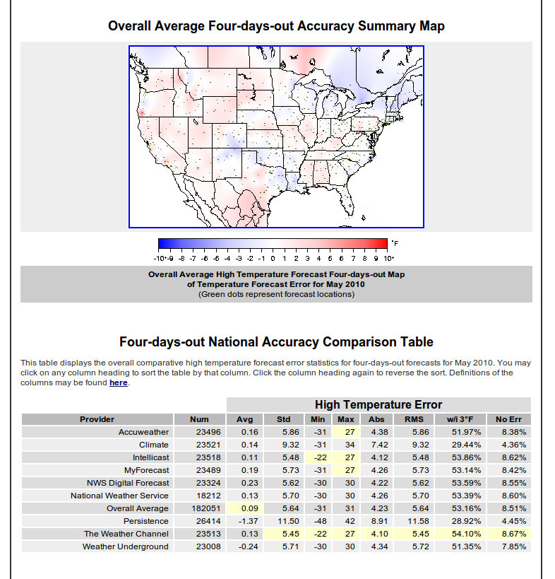
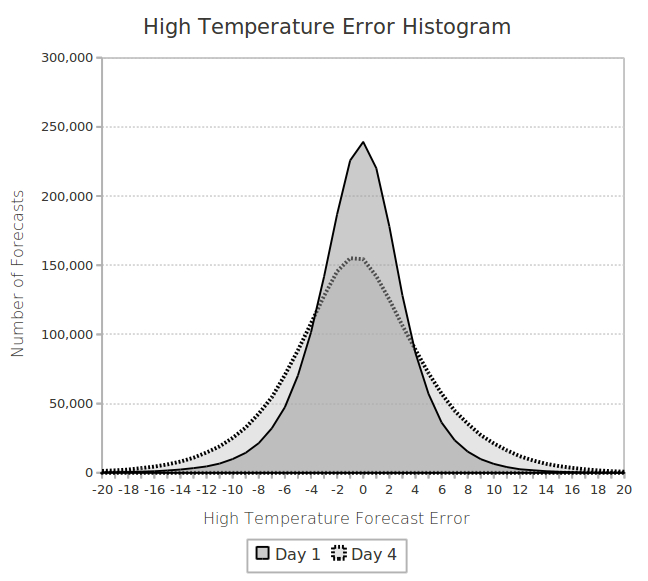
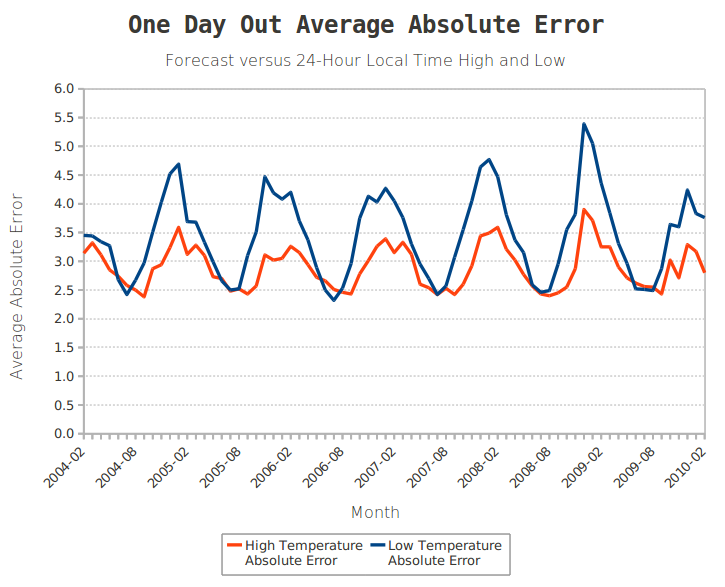
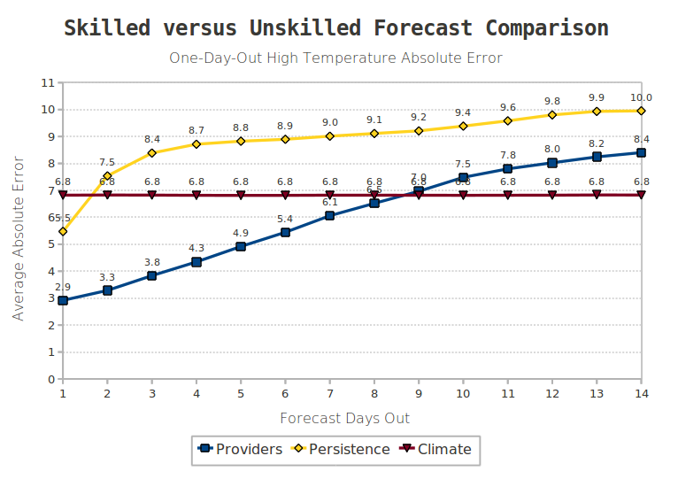

:author: Eric Floehr
:email: eric@intellovations.com
:institution: Intellovations, LLC

----------------------------------
Weather Forecast Accuracy Analysis
----------------------------------

.. class:: abstract

   ForecastWatch is a weather forecast verification and accuracy analysis system that collects over 70,000 weather forecasts per day.  The system consists of data capture, verification, aggregation, audit and display components.  All components are written in Python.  The display component consists of two websites, ForecastWatch.com, the commercial offering, and ForecastAdvisor.com, the free consumer version, both implemented using the Django web application framework.  In addition to providing comparative forecast accuracy analysis to commercial weather forecast providers like The Weather Channel, ForecastWatch data and systems have been instrumental in a number of research endeavors.  Dr. Eric Bickel, of the University of Texas at Austin, Dr. Bruce Rose of The Weather Channel, and Jungmin Lee of Florida International University have published research using data from ForecastWatch and software written by Intellovations.

Introduction
------------

The author of this paper has been interested in the weather for all of his life.  In 2003, he was curious if there was any difference between forecasts from Accuweather.com, weather.gov (National Weather Service), and weather.com (The Weather Channel).  He was also interested in just how accurate weather forecasts were, as there was very little comprehensive data available on the subject.  There were a few small studies, comprising a single location or a few locations, and usually only for a period of a few weeks or months.  The National Weather Service had comprehensive data on accuracy of their own forecasts, but not others, and the data was not easy to retrieve.  At the same time, the author was looking for a new project, and was just exploring new dynamic programming languages like Ruby and Python, after having spent most of career programming in C, C++, and Java.  Thus, ForecastWatch was born.

John Hunter, creator of the popular matplotlib library, mentioned in a talk to the Chicago Python group that there is a "great divide" within the people who use Python, with the scientific and financial programming people on one side, and the web application people on the other [Hun09]_.  I'd like to think my company, Intellovations, through products like ForecastWatch [FW]_, helps bridge that "great divide".  ForecastWatch consists of much back-end calculations, calculating metrics like bias, absolute error, RMS error, odds-ratio skill scores, Brier, and Brier skill scores.  However, it also consists of front-end web components.  ForecastWatch.com is the commercial front-end to all the calculated quality, verification, and accuracy data, while ForecastAdvisor.com [FA]_ provides some limited statistics to help consumers make better sense of weather forecasts and their expected accuracy.

Architectural Overview
----------------------

All front-end and back-end processes are in Python.  Forecasts are collected through FTP or SFTP feeds from the providers (usually pull), or via scraping public forecasts from provider websites.  Observations are pulled from a product by the National Climatic Data Center, consisting of quality-controlled daily and hourly observations from the ASOS and AWOS observation networks.  Both forecasts and observations are stored in a MySQL database, along with station meta-data and information that describes how to collect forecasts from each provider and for each station.  All data is saved in the form it was collected, so that audits can trace the data back to the source file.  Additionally, if errors in parsing are discovered, the source data can be re-parsed and the data corrected in place.

Forecasts are pulled from provider feeds and the web at the same time to ensure that no provider has an unfair advantage.  Each provider forecast request is a separate thread, so that all forecasts requests occur at the same moment.  This also considerably improves collection times for public forecasts, as network requests are made in parallel.  Once the raw file has been collected, either via HTTP, FTP, or SOAP, it is parsed.  Text forecasts are normalized and forecast measurements standardized by unit.  At time of insertion, a number of sanity checks are performed (low temperature greater than -150 degrees Fahrenheit, for example) and the forecast flagged as invalid if any check fails.

Actual observation files are pulled from an FTP site (U.S.) or via HTTP (Canada) once per month and inserted into the database.  Both daily and hourly observations are inserted.  The hourly values are used to generate values that do not fall in the 24-hour local time window of the daily observations.  For example, some weather forecast providers POP forecasts are for 24-hour local time, others are for 7am to 7pm local time, and the National Weather Service precipitation forecast is for 1200-0000 UTC.  The hourly data is also used and as a audit check against the daily values.  For example, if the high temperature for the 24-hour local day derived from the hourly data is not within five degrees of recorded daily high temperature, a flag is raised.  If there are not enough hourly observations, the entire record is flagged invalid.  All this is done in Python using Django's ORM.

Once the monthly actual observations are in the database, each forecast is scored.  Error values are calculated for high temperature, low temperature, probability of precipitation, icon and text forecasts, as well as wind and sky condition forecasts (if available).  Once the scores are calculated a second set of audit checks are performed.  Outlier checks are performed on forecast errors, to determine the validity of the forecast.  Forecasts with high error are not automatically flagged as invalid, but outliers are often a good indication of an invalid forecast.  It has been argued that invalid forecasts should remain, as these forecasts did go out and were potentially viewed, but keeping them severely reduces the utility of the aggregated statistics, as invalid outliers unnecessarily skew the statistics.  For example, queries to the National Digital Forecast Database (NDFD) [NDFD]_ via the National Weather Service web service interface occasionally return a temperature of three degrees Fahrenheit for both high and low.  While that is indeed the forecast that was retrieved, it is obviously invalid for most locations and dates.  Unfortunately, outlier checking does not catch invalid forecasts that do not result in outlier error.  In the three degree forecast example above, it would be difficult to determine an invalid three degree forecast from a valid three degree forecast in far northern U.S. climates in the winter.

Outlier checking is also used to uncover invalid actual observations that were not flagged in the initial sanity checks.  It is assumed that forecasts are "reasonable" approximations of observations, with one day out high temperature forecasts, for example, averaging only about 3 degrees Fahrenheit of error.  Large one-day out forecast error for any particular observation is flagged as suspect and checked.  Sometimes, large forecast error is just a blown model that affected every forecast provider, but other times it is a bad observation.  If an observation with large one-day-out forecast error is flagged, it is checked against observations on days before and after, as well as nearby observation sites.  One must be careful however, because it is often the outliers that have the most economic value if they can be better predicted.  An energy utility, for example, is far more interested in days that fall outside the norm, than the days that are near-normal.  Once the audit is complete, aggregations are performed on the raw scores.  The scores are aggregated by month, and sliced by nation, state/province, and location, as well as by days out and type.  This is performed with raw SQL generated from Python code.  The complexity is such that an ORM does not provide any benefit, and in most cases is incapable of generating the queries at all.  These aggregations are then used to generate surface plots of error and skill using the mapping tools in the GMT (Generic Mapping Tools) package [GMT]_.

The aggregate data and maps are primarily displayed in a web application, used by a number of forecast providers, such as The Weather Channel, Telvent DTN, The Weather Network, and CustomWeather.  Figure 1 shows a screenshot of how the aggregated data and generated maps are used in a web interface.  Not shown in the screenshot for space reasons are navigation tabs above and drill-down links below the screen capture.  The user can click on the map to drill-down to the state (or province) level, or view the state summary table (not shown) and click on an individual state in the table to view a list of locations within the state that can be viewed.

     Figure 1. screenshot of portion of ForecastWatch web interface.

Using Django
------------

Django [DJ]_ is the web front-end for both ForecastWatch and ForecastAdvisor.com.  It can be used to quickly build robust, dynamic websites.  For example, Dr. Bruce Rose, Principal Scientist and Vice President at The Weather Channel, is studying snowfall forecast accuracy [Ros10]_.  There is a common perception that snowfall forecasts are "overdone".  Specifically, that forecasts of snowfall generally predict more snowfall than actually occurs.  Despite this common perception, little scientific research has been done to verify snowfall forecasts.  Dr. Rose wanted a public site that would collect the snowfall forecasts and observations, and provide an intuitive, easy-to-use, dynamic data-driven site that updated automatically when data came in.  One of the big challenges in science and scientific research is the increasingly large amounts of data research is based on.  Challenges of curation, storage, and accessibility are becoming more frequent.  "Climategate" brought the issue of reproducibility of research when large amounts of data are used, as the raw data on which several papers were based was found to have been deleted.  While this does not invalidate the research, it does present a credibility issue, and puts roadblocks in one of the tenets of the scientific method: that of reproducibility.

Django provides a built-in ORM, templating system, URL dispatch, and administration components in a model-view-controller (MVC) architecture that makes building data-driven websites easy.  The snowfall accuracy data ingest system is in Python, using the Django ORM to populate the database and perform the scoring calculations.  The public-facing website [SNOW]_ is written using Django as well.  It is instructive to take a more detailed look at this site as it is less complex than either the ForecastWatch or ForecastAdvisor websites, while having a similar architecture.

A Django project is made up of a number of "applications".  A Django application is a logically-related set of functionality that share models, views (the controller in the MVC sense), and templates (the view in the MVC sense).  Applications can be dependent on other applications, but keeping each application, or group of applications, as self-contained as possible, helps improve reusability and keeps code clean.  Applications need not be complex, in the sense of a desktop application.  The snowfall website needs to display daily forecast data, observation data, and forecast error calculations.  Therefore, "forecast", "observation", and "error" applications were created.  Each application contains the database model code, the views, and the templates to display the daily forecasts, observations, and error respectively.

The website needs to present a day of data as a table on a web page, thus it would be convenient to have a navigation mechanism to move from month to month, and select a specific day to display.  Therefore there is also a "calendar view" application whose sole responsibility is to provide the navigation pages to get to the daily forecasts, observations, and error pages.  There is also a "station" application that displays information on the location and name of each observation station.  Finally, there is a "source" application that holds all data sources.  There are currently no views associated with the "source" application, just a model that stores filenames that the forecast and observation rows reference along with a line number.  This is for audit and traceability of data.  However, in the future this application could also have templates and views that might let a user traverse to the raw file and the specific line each data element originated from.  All told, there are six applications within the snowfall website.

Within an application there are models (which are the database table access classes), views (which are the code that controls the loading and display of the data), and templates (which control the look and feel of the presented page).  The station application is a representative illustration.  A station has a name, a location (both an address and a latitude/longitude), and an elevation.  The station model code looks like: ::

  class Station(models.Model):
    # Identification (ICAO is id)
    id = models.CharField(max_length=4, primary_key=True)
    name = models.CharField(null=True, blank=True)

    # Address and station information
    ... city_name, state, lat/long, etc. ...

    @property
    def city_state(self):
      if self.city_name:
        return "{c}, {s}".format(s=self.state.id,
	  c=self.city_name.title())
      else:
        return "Unknown"
        
Models can also have additional, derived properties.  The "city_state" property is once such example.  For display on the web page, all that is required is to show the station information along with a Google Map pinpointing it's location.  Stations are identified by their ICAO code, which is a four-digit assigned identifier.  The ICAO code is used as the primary key in the database, and is represented by the "id" member variable in the code above.  The ICAO code for the observation station at Port Columbus International Airport in Columbus, Ohio, is "KCMH".  We'd like the URL structure to be http://..something../KCMH/.  This is a very simple view.  It is just displaying information that is in a single row of the station table, which is just an instance of the Station model class.  Django provides scaffolding for simple views like this, called "generic views".  Generic views require no view code to be written.  In this case, the generic view used is the "object detail" view, which provides the template with an instance of the requested object.  All that needs done is to create an URL dispatcher with proper URL structure: ::

  station_dict = { 'queryset': Station.objects.all() }
  url(r'^(?P<object_id>\w+)/$', 
       'django.views.generic.list_detail.object_detail',
       station_dict)

The station_dict variable holds the query set that is searched into.  In this case it will search over all stations, but it could just as easily be a subset of all stations.  This queryset is lazy instantiated.  It does *not* bring the entire table into memory.  Additional query parameters can be appended to the queryset in order to further limit the number of objects returned.  The object detail generic view will add a query parameter to return a single record object with the ICAO id passed in.

The next line is the URL dispatcher object.  It is comprised of the URL regular expression pattern, the view method (controller), and the extra data to pass to the view method.  The URL pattern matches a set of alphanumeric characters followed by a forward-slash at the end of an URL string.  The set of alphanumeric characters is named 'object_id', and the matched value will be passed to the view method as a parameter with that name.  The view method itself is a Django generic view.  When the view is passed in a parameter named 'object_id' (in this case via the named regular expression match) and a parameter named 'queryset' (in this case via the dictionary of extra parameters), it will look for a template called "{model name}_detail.html" and provide it with a variable named "object".  The object is an instance of the Station class, by searching for the row with the id equal to object_id in the set of rows described by the passed in queryset.

The last needed item is a template called station_detail.html which will be displayed when a browser requests http://..something../KCMH/ (or any other ICAO id).  The template is very simple: ::

  
  
    Station {{object.id}} ({{object.city_state}})
  
  
    <h1>{{ object.id }} &mdash; {{ object.name }}</h1>
    <h2>{{ object.city_state }}</h2>
    
      
{{ object.address }}

    
    
Station Elevation:
       {{ object.station_elevation }} feet 
    Coordinates:
       {{ object.latitude }}, {{ object.longitude }}

    
..Google Map Display..

  

The "extends" tag incorporates the base.html template, which in this case contains the header, footer, CSS import, etc.  It also has placeholders for the "title" and "body" blocks, which are defined immediately following.  Those blocks will be seamlessly inserted into the proper place in the base.html template.  The variable named "object" is passed to the template from the view, and that "object" is a Station class instance.  In order to display the station name all that is needed is to reference it with '{{ object.name }}'.  The same holds true for any member variable on the object instance.  There are also conditional tags available.  For example, this template will only create a paragraph and display the station's address if there is one.

This "stations" application is complete and can now be dropped into any Django project.  It will create the station table if it does not exist, and the application can even supply custom SQL to allow Django to build indexes or populate the table, by simply dropping an appropriately named file in a directory named "sql" in the application.  There are only two things that are required before we can use this application.  First, we need to create the "base.html" file that defines the "title" and "body" blocks, and we need to hook the application into the project's URL structure.  Right now, our application will match the URL 'http://..something../KCMH/' (with KCMH being any station id), but we need to figure out what that "something" is.  In the snow accuracy site's case, it will be 'http://snow.forecastwatch.com/stations'.  Our base project therefore needs to define the 'station' path and hook it into the station URL dispatcher.  At that point, the station application is completely in charge of the URL name-space below "/stations/", so if we later want to add additional URLs in the station application, we do not have to change the project code, just the application.  To hook up the stations application to our project, we just add the following to the project url.py file: ::

  urlpatterns = patterns('',
    ...
    (r'^stations/', include('stations.urls')),
    ...)

The result of this is shown in Figure 2.  This is the result of retrieving the URL 'http://snow.forecastwatch.com/stations/KCMH/'.

.. figure:: snow_stations_detail.png

     Figure 2. screenshot of station detail web page

The current station application only shows the location of one station on the Google map.  One possible extension would be to also display nearby stations, perhaps with a different marker color.  For more complex location-type applications like that, Django comes bundled with a set of geospatial extensions called GeoDjango.  GeoDjango interfaces nicely with geospatial-aware databases like PostgreSQL with PostGIS extensions.  Using these extensions one can perform distance, intersection, within, and other types of geospatial queries.  For example, in addition to the latitude and longitude location, the station table has a location column, which is a geometry field of type 'POINT' in PostGIS: ::

  location = models.PointField()

Performing a distance query with GeoDjango is just like performing a regular query, with the addition of special operators.  In the following example, the operator "distance_lte" (distance less than or equal to) is used to find stations within 30 miles of station KCMH.  This will get converted into a SQL query that, in the case of PostGIS, will perform an ST_distance_sphere() function call. ::

  kcmh = Station.objects.get(id='KCMH')
  nearby_stations = Station.objects.filter(
      location__distance_lte=(kcmh.location, D(mi=30)))

Some Findings
-------------

ForecastWatch started as an answer to the question "Is there any difference between weather forecasts from different providers?"  It turns out there is a difference.  As an amateur scientist, it has been interesting to look at all the data in a number of different ways.  While many forecast providers perform continuous internal verification of forecasts, and the National Weather Service has an entire group devoted to it, there has been little information communicated at the popular level regarding weather forecast accuracy.  One of the goals of ForecastWatch is to help meteorologists educate their customers as to their accuracy, and begin to help dissipate some of the skepticism that is reflected in comments such as "I wish I could have a job where I'm wrong half the time an still keep my job".

Figure 3 shows a histogram of one-day-out and four-day-out high temperature forecast forecast error against 24-hour high observations from all providers over all of 2009.  There are nearly two million forecasts represented in each day's histogram.  As expected, but nice to confirm, the histogram of high temperature forecast error follows a normal distribution.  As also might be expected, the histogram for four-day-out forecasts is more spread out than that of the one-day-out forecasts.  The further out the forecast is for, the greater the standard deviation of error.  Eagle-eyed readers may notice that the histogram "leans" slightly negative, meaning that average error has a light negative bias.  The reason for this is subtle, and demonstrates the care that must be taken when interpreting results.

    Figure 3. High temperature error histogram.

This histogram represents the error of forecasts when compared against the 24-hour high temperature reported in the daily observations.  However, some forecasters' valid time for high temperature is 7am to 7pm local standard time.  While nearly all high temperatures for the day fall in this period, very rarely they do not.  In this case, the 24-hour high observation will be higher than the high temperature between 7am and 7pm.  Thus, the forecast will under-predict the high from the perspective of the 24-hour high temperature verification.  This leads to the slight negative bias.  In general, short-term temperature forecasts are well-calibrated and bias corrected.  Generating a high or low temperature observation between an hourly range (for example, 7am to 7pm) also results in a slight error bias.  This is because hourly observations are taken at a specific time.  The odds are high that the true high or low temperature in a span will occur intra-hour.  The probability that a single observation each hour will capture the true high temperature is small, and thus the generated high or low temperature will be lower than the actual high.  The 24-hour high and low temperature observations are nearly continuous and reflect the true high and low temperatures of the day.

One fact of weather forecasts that consistently surprises people, even people using weather forecasts in quantitative modeling and decision-making is that weather forecast accuracy is seasonal, and varies greatly geographically.  There are many people using weather forecasts as input to risk and prediction models that do not factor in seasonality or location along with the temperature forecast.  Figure 4 shows the accuracy of U.S. and Canadian temperature forecasts for the past six years.  Temperatures are more accurate in the summer than winter, with high temperature accuracy swinging by one degree and low temperature accuracy even more.  Additionally, a high temperature forecast for Atlanta in July has less error on average than a high temperature forecast for Chicago in December.

    Figure 4. High and low temperature forecast error by month.

ForecastWatch also generates skill measures, by comparing unskilled forecasts with skilled predictions.  An unskilled forecast is a forecast that requires no skill to produce.  The two unskilled forecasts that are used by ForecastWatch are persistence forecasts and climatology forecasts.  A persistence forecast is a forecast that says "tomorrow, and the next day, and the next, etc. will be exactly like today".  If the high temperature is 95 degrees Fahrenheit today, the persistence forecast will be for 95 degrees Fahrenheit tomorrow.  If it is raining today, the prediction will be that it will be raining tomorrow.  The climatology forecast will predict that the high and low temperature will be exactly "average".  Specifically, the ForecastWatch climatology forecast uses the daily climatic normals (CLIM84) from the National Climatic Data Center [NCDC]_ which are statistically fitted daily temperatures smoothed through monthly values.

Figure 5 shows high temperature forecast accuracy by days-out for 2009 between the two unskilled forecasts, and the average accuracy of all providers' forecasts.  The climatic unskilled forecast is a straight line because the climatic forecast for a given day never changes.  It is always the calculated 30-year average temperature as expressed by the nearest station in the CLIM84 product.  The two intersections between the forecast error lines are the most interesting features of this figure.  The first intersection, between the unskilled persistence forecast and the climatology forecast, occurs between the one- and two-day-out forecasts.  This means that a persistence forecast is only better than climatology at predicting high temperature one day out.  After one day out, climatology has more influence than local weather perturbations.  

    Figure 5. High temperature skilled versus unskilled forecasts.

Possibly the more interesting intersection is between skilled forecast providers and climatology forecasts between eight and nine days out.  What this graph is saying is that weather forecasts from weather forecast providers are **worse** than an unskilled climatology forecast beyond eight days out.  The American Meteorological Society said in 2007 that "the current skill in forecasting daily weather conditions beyond eight days is relatively low" [AMS07]_ in a statement on weather analysis and forecasting.  This graphs shows how "relatively low" the skill really is.  One question that is asked about this is why do forecasters not replace their forecast with the climatology forecast for their nine-day and beyond forecasts?  One reason is that these extended forecasts might be skillful in forecasting temperature trends (above or below normal) which the climatology forecast cannot do.  Research is ongoing on this aspect of longer-term forecasts.

References
----------

.. [FW] `ForecastWatch Website <http://www.forecastwatch.com/>`_
.. [FA] `ForecastAdvisor Website <http://www.forecastadvisor.com/>`_
.. [SNOW] `Snowfall Research Website <http://snow.forecastwatch.com/>`_
.. [GMT] `Generic Mapping Tools <http://gmt.soest.hawaii.edu/>`_
.. [DJ] `Django Web Application Framework <http://www.djangoproject.com/>`_
.. [NDFD] `NWS National Digitial Forecast Database <http://www.nws.noaa.gov/ndfd/>`_
.. [NCDC] `National Climatic Data Center <http://www.ncdc.noaa.gov>`_
.. [Hun09] `"Matplotlib, the popular 2D Plotting Library." <http://blip.tv/file/2557425/>`_ blip.tv. 04 September 2009
.. [Tim09] `"Climate change data dumped" <http://www.timesonline.co.uk/tol/news/environment/article6936328.ece>`_ The Times Online. 29 November 2009
.. [Ros10] `"Are Snow Accumulation Forecasts Generally Overdone?" <http://ams.confex.com/ams/90annual/techprogram/paper_164417.htm>`_
.. [Bic08] Bickel, J. Eric and Eric Floehr. 2008. "Calibration of Probability of Precipitation Forecasts", INFORMS Annual Conference, Decision Analysis Track, Washington, DC.
.. [Bik10] `"Comparing NWS POP forecasts to third-party providers" <http://ams.confex.com/ams/90annual/techprogram/paper_161669.htm>`_
.. [Lee08] `"Economic Bias of Weather Forecasting: A Spatial Modeling Approach" <http://econpapers.repec.org/paper/dkneconwp/eco_5f2008_5f12.htm>`_
.. [AMS07] `"AMS Statement on Weather Analysis and Forecasting" <http://www.ametsoc.org/POLICY/2007weatheranalysisforecasting.html>`_

