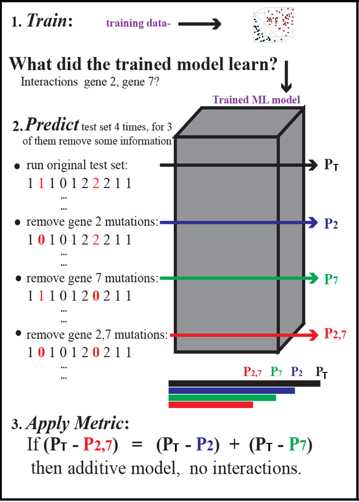
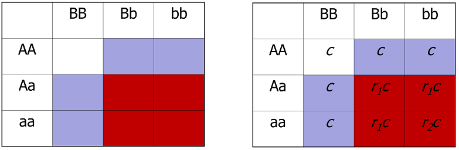

:author: Patricia Francis-Lyon
:email: pfrancislyon@cs.usfca.edu
:institution: University of San Francisco

:author: Shashank Belvadi
:institution: University of San Francisco

:author: Fu-Yuan Cheng
:institution: University of San Francisco

:video: http://www.youtube.com/wa?v=IA09mZRCCA8

----------------------------------------------------------------------------------
Detection and characterization of interactions of genetic risk factors in disease 
----------------------------------------------------------------------------------

.. class:: abstract

   It is well known that two or more genes can interact so as to enhance or suppress incidence of disease, 
   such that the observed phenotype differs from when the genes act independently.   The effect of a gene allele 
   at one locus can mask or modify the effect of alleles at one or more other loci. Discovery and characterization 
   of such gene interactions is pursued as a valuable aid in early diagnosis and treatment of disease.  
   Also it is hoped that the characterization of such interactions will shed light on biological and biochemical pathways 
   that are involved in a specific disease, leading to new therapeutic treatments. 

   Much attention has been focused on the application of machine learning approaches to detection of gene interactions.  
   Our method is based upon training a supervised learning algorithm to detect disease, and then quantifying the effect
   on prediction accuracy when alleles of two or more genes are perturbed to unmutated in patterns so as to reveal and
   characterize gene interactions.  We utilize this approach with a support vector machine.
  
   We test the versatility of our approach using seven disease models, some of which model gene interactions and some of 
   which model biological independence.  In every disease model we correctly detect the presence or absence of 2-way and 
   3-way gene interactions using our method. We also correctly characterize all of the interactions as to the epistatic 
   effect of gene alleles in both 2-way and 3-way gene interactions.  This provides evidence that this machine learning approach  
   can be used to successfully detect and also characterize gene interactions in disease. 

.. class:: keywords

   machine learning, support vector machine, genetic risk factors,  gene interactions

Introduction
============

The mapping of an input vector of features to an output value is well-studied as applied to both regression and classification. 
In both cases there is great interest in detecting  the presence or absence of interactions of input parameters.  
In the case of human disease, the interest is accompanied by the hope that knowledge of such interactions 
could reveal basic information about biochemical functioning that could inform therapies. 
For example, we can search for interactions among genes that code for proteins that are involved in metabolism of estrogen 
in breast tissue for their effect on susceptibility to  ER positive  breast cancer. If we found such interactions, 
whether enhancing or diminishing cancer susceptibility, this could provide information on  protein pathways that 
could be the target of therapies for this cancer. 

Since biological interaction is difficult to quantify, approaches for discovering gene interactions in disease typically use a
definition of interaction of parameters borrowed from statistics: interaction is seen as departure from a linear model [Cordell09]_.   
For example, the following would be a linear model of disease penetrance (Y) as a function of 
allele values of gene A  (:math:`G_{\alpha}`) and gene B (:math:`G_{\beta}`):

.. math::

    Y = \chi + \alpha G_\alpha + \beta G_\beta

If parameters :math:`\alpha` and  :math:`\beta` could be trained so that the model accurately represented penetrance 
(probability that an individual of a given genotype would exhibit disease), then the function would be considered linear 
and the input parameters :math:`G_{\alpha}` and :math:`G_{\beta}` would be regarded as statistically independent (not interacting).  
This approach is widely used in multiple linear regression.  While the principle is the same, a more general genotype model  
employs different parameters to represents the effects of having  either one copy of the risk allele or two for each of 
gene A and gene B [Cordell09]_. A graphical representation of penetrance factor as the vertical axis and 
input parameters along horizontal axes help convey understanding. Figure :ref:`figADD`  is such a graphical representation 
of statistical independence, patterned on Risch's additive disease model (described below), which represents 
biological independence. Figure :ref:`figMULT`, illustrating statistical interaction, is patterned after Risch's multiplicative model, 
which represents biological interaction. 

.. figure:: ADD.pdf

   **Penetrance factor with independent input parameters**.
   Here the two input parameters separately influence penetrance, neither enhancing nor diminishing 
   the effect of the other. Their effects on penetrance are merely additive. :label:`figADD`

.. figure:: MULT.pdf

   **Penetrance factor with interacting input parameters**.
   Here the two input parameters interact so as to enhance incidence of disease. 
   As their effect is multiplicative, the effect on penetrance is greater 
   than the mere additon of separate main effects of the input parameters. :label:`figMULT` 

Background
==========

Supervised machine learning (ML) algorithms learn a function that maps an input vector  of parameters to  labeled output. 
This is accomplished by utilizing knowledge of the correct result (label) while training the model. 
In regression, the algorithm learns to  produce continuous values  of the dependent (output) variable given input vectors.  
In classification, the output is prediction of which of two or more classes an input vector will fall into depending on its features. 

While ML algorithms such as artificial neural network (ANN) and support vector machine (SVM) are valuable merely 
as black box classifiers or for producing correct regression output, it is also a goal to understand relationships 
among features that have been discovered by the trained ML model. Some approaches, such as examining neural network weights, 
are dependent on the workings of the particular ML method, and expose how the method makes a prediction.  

Other approaches however, are agnostic to the workings of the ML method even as they open up the 'black box' to reveal
what relationships among input parameters were discovered. Our method falls within this category. Such methods, 
that focus on what is learned rather than how it is learned have been surveyed [Francis02]_. These include 
visualization methods and the computation of a sensitivity value for each parameter. Sensitivities are determined 
by calculating the change in average square error in predicting the test set when that input value in each example 
is perturbed to a constant value (ex: mean or median) [Potts00]_. Visualization methods perturb input parameters 
in specified ways designed to reveal information about the function learned by the ML method. They have been used 
with a variety of ML methods, and have been used successfully, particularly with continuous output tasks. 
One such method plots  a two-dimensional surface  of ANN output  as two particular inputs are varied while 
the rest are held constant [Mose93]_. Pairwise plots are produced in this way to visualize the relationships 
between input parameters.  Another visualization approach, most suited to models with continuous inputs, 
discovers interactions of parameters by displaying  deviation from linear function. This method utilizes 
graphical plots of generalized additive models to find interactions of environmental risk factors (smoking, drinking) 
in lung cancer [Plate97]_. While these methods were used with an ANN they do not depend on internal structure of the network 
and could be used with other supervised learning approaches.
 
Our approach observes  the effect of perturbing input gene allele values to unmutated (ie: 0,1,2 -> 0) in patterns designed  
to reveal whether susceptibility to disease is independently or epistatically affected by inputs. We have developed a metric 
to quantify deviation in prediction accuracy produced by epistatic inputs as opposed to independent inputs. 
Here we apply our method to an SVM, although it is also applicable to other ML algorithms, such as neural networks. 

Support Vector Machines
-----------------------

The Support Vector Machines (SVM) is a supervised learning algorithm  introduced by Vapnik which began to be widely used 
in classification in the 1990's.  SVMs are trained with a learning algorithm from optimization theory that 
searches a hypothesis space of linear functions operating on data that has been pushed into a high dimensional feature space [Crist97]_.  
Basically, an SVM is a hyperplane classifier which finds the optimal hyperplane to separate data into classes. 
When dividing two classes, the optimal hyperplane is orthogonal to the shortest line connecting the convex hulls of the two classes, 
and intersecting it halfway between the two classes at a perpendicular distance :math:`d` from either class. 
The support vectors are those elements of the training set that lie on the margins of either class 
(at a distance :math:`d` from the decision line). It is these training examples, rather than the centers of clusters, 
that are relevant to the algorithm and are critical for finding the margins between the classes. 
Complexity of the algorithm may be reduced by removing the other training examples from the kernel expansion 
(described below). The unique optimal hyperplane is found by solving the optimization problem:

.. math::

    \mbox{minimize } \frac{1}{2} ||w||^2

.. math::

    \mbox{subject to } y_i.((w.x_i) + b) >= 1

This optimization problem is solved using Lagrange multipliers and minimizing the Lagrangian. 

To allow for noise in the data that would preclude perfect classification, a slack variable :math:`\epsilon` can be introduced 
in order to relax the constraints:

.. math::

    \mbox{subject to } y_i.((w.x_i) + b) >= 1-\epsilon_i

.. math::

    \mbox{where } \epsilon_i >= 0,   i= 1,2,...,m

The amount of slack is specified by the user of an SVM in the variable :math:`C`, known as the regularization or soft-margin parameter, 
which controls the error penalty according to the equation below. Higher :math:`C` weights classification errors more, 
allowing them more influence on the selection of the optimal hyperplane. With very high :math:`C`, a hyperplane 
must be chosen such that there is virtually no misclassification of training examples, which can lead to overfitting.  
A lower value of :math:`C` limits the influence of outliers on the solution, allowing a hyperplane with a wider margin 
and a decision function with a smoother surface that may misclassify some of the training examples. 
The optimization problem that is solved when allowing for slack :math:`\epsilon` is:
   
.. math::

        \mbox{minimize } \frac{1}{2} ||w||^2 + C \sum_{i=1}^{m} \epsilon_i

.. math::

        \mbox{subject to } y_i.((w.x_i) + b) >=  1-\epsilon_i

.. math::

        \mbox{where } \epsilon_i >= 0,   i= 1,2,...,m

SVMs have the ability to find a separating hyperplane even if one does not exist in the space of the input vector, 
as long as the training data may be mapped into a higher dimensional feature space in which such a 
separating hyperplane exists. A kernel function may be employed for non-linear classification. 
A kernel is a function :math:`k(x_i,x_j`) that given two vectors in input space, returns the dot product 
of their images in feature space. This is used to compute the separating hyperplane without actually 
having to carry out the mapping into higher dimensional space.  The common kernels used are radial basis, 
polynomial, sigmoidal, and inverse quadratic.

Perhaps most commonly used is the radial basis kernel, which finds the maximum margin classifier 
based upon the Euclidean distance between vectors in input space.  After training, 
the support vectors will occupy the center of the RBF and the parameter gamma will determine how much influence  
each one has over the data space.  With smaller gamma the influence of each support vector is extended to cover more area, 
so fewer support vectors are needed. Smaller gamma also allows for higher generalization and a
smoother decision function. Larger gamma allows for a more detailed decision surface, but is prone to overfitting.  

Methods
=======

Data models and sets 
--------------------

For this study we used genomeSimla to create datasets to simulate 7 disease models from the literature, 
some of which exhibit biological independence and some of which exhibit epistasis. 
For each of these disease models we created datasets to investigate both 2-way and 3-way interactions: 14 datasets in all.   
Each dataset contained 10 gene loci, of which 2 (or 3 when investigating 3-way interactions) were functional genes, 
constructed with penetrance matrices according to the disease model under investigation. Each gene locus was 
encoded as the number of mutated alleles (0,1,or 2).  For each dataset a population of 1 million individuals 
was constructed such that the overall disease prevalence of the population was .01 with case or control status 
designated according to the penetrance matrix of the functional genes modeling the disease.  It was assumed that 
genes were in linkage equilibrium and the Hardy-Weinberg equilibrium held. From these populations 
samples were randomly drawn of 1000 case (diseased) and 1000 control individuals for each disease model.

The  seven disease models investigated included three introduced by Risch, three introduced by Gunther et al 
and one introduced by Ritchie et al. Additionally, we extended each of these models to three functional genes. 
Each disease model specifies the penetrance matrix, that is, the probability 
for each genotype that the disease phenotype is observed. Details below are for the version of the disease models 
with two functional genes. Each gene value sums up the number of mutated alleles, for example, AA (unmutated) = 0, 
Aa (one allele mutated) = 1 and aa (both alleles mutated) = 2.  Note that these designations are codominant, 
so  that capitalization does not indicate  a  dominant gene. 

For the three Risch models each element :math:`f_{ij}` of penetrance matrix :math:`f` is specified by formulation [Risch90]_:

.. math::

    f_{ij} =  P(Y=1 | G_\alpha=i, G_\beta=j) \; i,j \in \{0,1,2\}.    

Here P(Y=1)indicates the probability that an individual of the genotype indicated by row i (gene A) and column j (gene B) 
of the penetrance matrix is diseased, as determined by the values of gene A = i and gene B = j.

For the Risch models, let :math:`a_i` a_i and :math:`b_j` denote the individual penetrance values for genes A and B respectively.

1.  Additivity model (biological independence):

.. math::

    f_{ij} = a_i + b_j  \mbox{ such that }  0 <= a_i, b_j <= 1, a_i + b_j < 1 

2. Heterogeneity model (biological independence):

.. math::

    f_{ij} = a_i + b_j - a_ib_j \mbox{ such that }  0 <= a_i, b_j <= 1

3. Multiplicative model (biological interaction): 

.. math::

    f_{ij} =  a_ib_j 

Three epistatic models are given by Gunther et al [Günther09]_ as penetrance matrices. In each case  
the constant :math:`c` denotes the baseline risk of disease and :math:`r`, :math:`r_1`, :math:`r_2` denote risk increase or decrease

4. EPIRR models an epistatic relationship between two recessive genes, such that disease is not impacted 
unless both genes are fully mutated, in which case penetrance is multiplied by  the factor :math:`r`. 
This may increase or decrease risk of disease:

.. math::

   f = \bordermatrix{~ & BB & Bb & bb \cr
                     AA & c & c & c \cr
                     Aa & c & c & c \cr
                     aa & c & c & rc \cr}

5. EPIDD models an epistatic relationship between two dominant genes, such that penetrance is multiplied by :math:`r_1` 
if both genes are mutated, but not fully. When both alleles of both genes are mutated, then penetrance 
is multiplied by :math:`r_2`, typically a factor causing more impact on disease risk:

.. math::

   f = \bordermatrix{~ & BB & Bb & bb \cr
                     AA & c & c & c \cr
                     Aa & c & r_1c & r_1c \cr
                     aa & c & r_1c & r_2c \cr}

6. EPIRD models an epistatic relationship between one dominant and one recessive gene. If the recessive gene 
is fully mutated, penetrance will be multiplied by :math:`r_1`. If additionally the dominant gene is fully mutated 
then penetrance is multiplied by  :math:`r_2`, causing a different impact on disease. Interactions are more difficult to detect
for this disease model than for the other Gunther et al models since there is both a main effect and an epistatic effect:  

.. math::

   f = \bordermatrix{~ & BB & Bb & bb \cr
                     AA & c & c & c \cr
                     Aa & c & c & c \cr
                     aa & r_1c & r_1c & r_2c \cr}

7. MDR: This final disease model is specified by Ritchie et al [Ritchie01]_ to exhibit XOR (exclusive or) interactions.  
The specification is supplied as a penetrance matrix:

.. math::

   f = \bordermatrix{~ & BB & Bb & bb \cr
                     AA & 0 & 0 & .2 \cr
                     Aa & 0 & .2 & 0 \cr
                     aa & .2 & 0 & 0 \cr}

Machine Learning Algorithm
--------------------------

Our novel method to detect gene interactions in a disease is based upon detecting deviation in prediction accuracy when information
is removed from our entire test set by perturbing gene allele values to zero (unmutated). Upon removing mutation 
information for a functional gene, we would expect prediction accuracy to drop. Yet when a non-functional gene
is similarly perturbed, we would expect change in prediction accuracy to be insignificant. If mutation information
is removed for two non-interacting genes, we would expect the change in prediction accuracy to be additive.
However, if the genes are interacting, we would expect that deviation in prediction accuracy would 
depart from the linear model, as described in the Introduction and illustrated in Figures :ref:`figADD` and :ref:`figMULT`.

   **Detecting gene interactions with supervised machine learning**.
   1. Train the model (in this case SVM) to detect disease. If there were gene interactions, we assume the model learned them.
   2. Perturb input genes of test set to unmutated in patterns selected to reveal interactions via the effect on prediction accuracy.
   3. Apply the metric to determine if there were or were not interacting genetic risk factors in the disease.  :label:`detectfig`

Our method is illustrated in Figure :ref:`detectfig`. For each disease model we train a supervised ML algorithm 
to distinguish examples that are diseased from those that are not. The disease phenotype is learned by the ML algorithm 
as a function of the input vector of ten gene loci. If the disease model under investigation contains gene interactions, 
then we assume the ML algorithm learned them, and we attempt to uncover this knowledge utilizing perturbations and our metric. 
Our method applies to a variety of supervised learning algorithms. In this paper we use it with a Support Vector Machine (SVM) [Crist97]_, 
utilizing the RBF kernel. The SVM we used is part of the scikit-learn package [scikit-learn]_, and is derived from libsvm [LIBSVM]_.

We use a radial basis function (RBF) kernel, and need to determine parameters :math:`C` and gamma, discussed above. 
We utilize cross validation grid search for model selection. An SVM is constructed with the parameters  
from the grid search best estimator, and is trained with the entire training set.  
(Refitting the entire dataset to the CV model having best parameters is done by default in the  call to GridSearchCV fit). 
Because our method is based on detecting deviation in prediction accuracy when we later perturb the test set, 
we constrain the soft margin parameter :math:`C` so as to be somewhat intolerant of error: 
our grid search is of :math:`C` values from 100 up to 10000. By mandating higher :math:`C`, we also 
favor a less smooth decision surface over tolerance of error, enabling us to learn functions with more complexity. 
Our grid search is of gamma values [0.01, 0.1, 1, 10]. 

After the model is selected by cross-validation grid search and trained, then we run the test set and establish :math:`P_T`, 
which is prediction accuracy of the test set with total information, no perturbations. 
Single-gene perturbations are then run on the test set for each of the ten gene loci in turn, 
perturbing that gene to unmutated. Figure 3 depicts the single genes 2 and 7 being perturbed, 
with resulting prediction accuracies :math:`P_2` and :math:`P_7`. After single-gene perturbations, 
then all possible pairs are perturbed. In the case of ten genes this is: 

.. math::

    {10 \choose 2}  = 45 \mbox{ pairs }. 

Figure 3 shows genes 2 and 7 being together perturbed to unmutated for the entire test set,
resulting in prediction accuracy :math:`P_{2,7}` 
With the mutation information of these two genes removed, we expect a drop in prediction accuracy 
from the unperturbed set accuracy, :math:`P_T`. This deviation, :math:`P_T` - :math:`P_{2,7}` 
is compared with the deviations in prediction accuracy that result from the same genes being singly perturbed. 
We quantify this as the metric:
 
.. math::

    m = |(P_T - P_{2,7}) - ((P_T - P_2)+ (P_T - P_7))| / P_T

If the deviations in prediction accuracy with the single gene perturbations sum up to the deviation of 
the double gene perturbation then this supports a claim that there are no interactions. 
We allow .03 error in each of the three deviations, so  m = .09 is our cutoff for determining if there are 2-way interactions. 
If m exceeds .09 we claim that the effects on disease of gene mutations at the separate loci are not additive, 
and we have found interactions.  When the selected (best predicting) model finds no interactions, 
then we take an additional step. As stated above, our approach assumes that if interactions exist, 
they will be found by the ML algorithm.  We found that in some cases a machine learning algorithm 
could find interactions, but the best classifier among its models might detect disease with 
a decision function that did not include interactions. To address this we take a second look for interactions with 
an alternate gamma. Our alternative is the gamma that is closest to the selected gamma, 
an order of magnitude larger, except when the selected gamma is  >= .1, in which case we set gamma 
to an order of magnitude smaller.  We rerun cross validation grid search to find the best C with this  alternative gamma, 
construct an SVM with these new parameters, and train on the entire training set. We apply the metric 
to the test set to look again for interactions. In most cases where rerun is done the gamma is larger, 
which limits the influence of single training examples, so that in cases where interactions are difficult 
to detect a perturbation will more likely result in a classification change which we will detect as error.  
If both the best predicting and the alternative gamma model find no interactions, then we claim that there are none. 
Otherwise, we note the gene perturbations of the test data that resulted in a metric above the cutoff as an interaction found. 
The principle is the same for 3-way interactions, where the metric is:

.. math::
                              
    m = |(P_T - P_{abc}) - ((P_T - P_a)+ (P_T - P_b) + (P_T - P_c))| / P_T

and the cutoff is .12, since there are 4 deviations, for each we again allow .03.

If interactions are found, we next apply a mask and perturb masked genes to unmutated in order to characterize the interaction.  
In this study we applied 2 masks: an AND mask to determine if interacting genes are both mutated, and 
an XOR mask to determine if interacting genes have one gene mutated and the other unmutated. 
Figure 4 on the left shows the regions of a penetrance matrix  that are AND in red and those that are XOR in lavender.   
For example, an AND mask will only perturb genes where neither gene A nor gene B is zero (unmutated). 
On the right we see that the interacting genes of the disease model EPIDD are all in the AND region. 
In our characterization runs, then, we find as expected AND interactions but no XOR interactions (see Results). 

   **Characterizing the gene interactions that were detected**.
   To characterize the interactions that were detected: perturb masked area to unmutated, observe effect on prediction accuracy. 
   If prediction accuracy changes significantly with a specific mask, then there are interactions of that type.
   On the left we see AND mask (red) and XOR mask (lavender). On the right we see the *EPIDD* disease model, exhibiting interactions
   of type AND, but none of type XOR. This correlates with the interactions that were characterized by our method (see table :ref:`R2table`)
   :label:`maskfig`

Results
=======

Our method correctly identified all gene pairs (2-way) in the 7 disease models as either interacting 
or independent. In the case of the 5 disease models with 2-way interactions only the correct pair was found to interact, 
the other 44 pairs were found to not be interacting. In the 2 disease models with no interactions, all 45 pairs were found to not interact. 
Additionally, all interacting pairs were characterized correctly. (see Table :ref:`R2table`).

.. table:: Results for 2-Loci. :label:`R2table`

   +-------+------+-------------+-------+-------+
   |Disease|Metric|Interactions |  Found| Actual|
   +-------+------+------+------+---+---+---+---+
   | Model |      |Found |Actual|AND|XOR|AND|XOR|
   +-------+------+------+------+---+---+---+---+
   | ADD   | .07  | none | none |N/A|N/A|N/A|N/A|
   +-------+------+------+------+---+---+---+---+
   | MULT  | .19  |(4,9) |(4,9) |yes|no |yes|no |
   +-------+------+------+------+---+---+---+---+
   | HET   | .05  | none | none |N/A|N/A|N/A|N/A|
   +-------+------+------+------+---+---+---+---+
   | EPIRR | .41  |(4,9) |(4,9) |yes|no |yes|no |
   +-------+------+------+------+---+---+---+---+
   | EPIDD | .15  |(4,9) |(4,9) |yes|no |yes|no |
   +-------+------+------+------+---+---+---+---+
   | EPIRD | .10  |(4,9) |(4,9) |yes|no |yes|no |
   +-------+------+------+------+---+---+---+---+
   | MDR   | .48  |(4,9) |(4,9) |yes|yes|yes|yes|
   +-------+------+------+------+---+---+---+---+

Our method also correctly identified all gene triplets (3-way) as either interacting or independent. 
In the case of the 2 disease models with no interactions, all 120 triplets were found to be non-interacting.
In the case of the 5 disease models with interactions, only the correct triplet and also triplets containing 
two of the correct three interacting genes were found to be interacting, as expected. 
Additionally, all interacting triplets were characterized correctly. (see Table :ref:`R3table`). 

.. table:: Results for 3-Loci. :label:`R3table`

   +-------+------+---------------+-------+-------+
   |Disease|Metric|Interactions   |Found  | Actual|
   +-------+------+-------+-------+---+---+---+---+
   |Model  |      |Found  |Actual |AND|XOR|AND|XOR|
   +-------+------+-------+-------+---+---+---+---+
   |ADD    | .11  |  none |  none |N/A|N/A|N/A|N/A|
   +-------+------+-------+-------+---+---+---+---+
   |MULT   | .36  |(0,4,9)|(0,4,9)|yes|no |yes|no |
   +-------+------+-------+-------+---+---+---+---+
   |HET    | .08  |  none |  none |N/A|N/A|N/A|N/A|
   +-------+------+-------+-------+---+---+---+---+
   |EPIRRR | .69  |(0,4,9)|(0,4,9)|yes|no |yes|no |
   +-------+------+-------+-------+---+---+---+---+
   |EPIDDD | .38  |(0,4,9)|(0,4,9)|yes|no |yes|no |
   +-------+------+-------+-------+---+---+---+---+
   |EPIRRD | .24  |(0,4,9)|(0,4,9)|yes|no |yes|no |
   +-------+------+-------+-------+---+---+---+---+
   |MDR    | .87  |(0,4,9)|(0,4,9)|yes|yes|yes|yes|
   +-------+------+-------+-------+---+---+---+---+

References
==========
.. [Cordell09] H. Cordell. *Detecting gene-gene interactions that underlie human diseases*,
           Nature Reviews Genetics 10:392-404, doi:10.1038/nrg2579, June 2009.         
.. [Günther09] F. Günther, N Wawro and K Bammann. *Neural networks for modeling gene-gene interactions in association studies*, 
           BMC Genetics, 10:87, 2009. 
.. [Francis02] L. Francis. *Neural Networks Demystified*,
           Casualty Actuarial Society, 2002
.. [Potts00]  W. Potts. *Neural Network Modeling: Course Notes*, 
           SAS Institute, 2000
.. [Plate97] T. Plate, P. B and, J. Bert and J. Grace. *Visualizing the function computed by a feedforward neural network*, 
           J ICONIP, 1:306-309, Springer Verlag, 1997.
.. [Crist97] N. Cristianini and J. Shawe-Taylor. *Support Vector Machines and other kernel-based learning methods*, 
           Cambridge University Press, 2000.
.. [Ritchie01] D. Ritchie D et al. * Multifactor-Dimensionality Reduction Reveals High-Order Interactions among Estrogen-Metabolism Genes in Sporadic Breast Cancer*, 
           Am J Hum Genet, 69:138-1 2001.
.. [Risch90] N. Risch. *Linkage Strategies for genetically complex traits. I. Multilocus models*, 
           Am J Hum Genet, 46:222-228, 1990.
.. [Baxt95] W G. Baxt and H. White. *Bootstrapping confidence intervals for clinical input variable effects in a network trained to identify the presence of acture myocardial infarction*. 
           Neural Computation 7:624-638, 1995
.. [Mose93] L. Moseholm, E. Taudorf and A. Frosig. *Pulmonary function changes in asthmatics associated with low-level SO2 and NO2, air pollution, weather, and medicine intake*.
           Allergy 48:34-344, 1993
.. [scikit-learn] Pedregosa et al. *Scikit-learn: Machine Learning in Python*, 
           JMLR 12:2825-2830, 2011
.. [LIBSVM] C. Chang and C Lin. *LIBSVM : a library for support vector machines*,
           ACM Trans on Intelligent Systems and Tech (TIST), 2:27:1--27:27, 2011
           Software available at http://www.csie.ntu.edu.tw/~cjlin/libsvm
.. [gSIMLA] genomeSIMLA site:  http://chgr.mc.vanderbilt.edu/ritchielab/method.php?method=genomesimla
