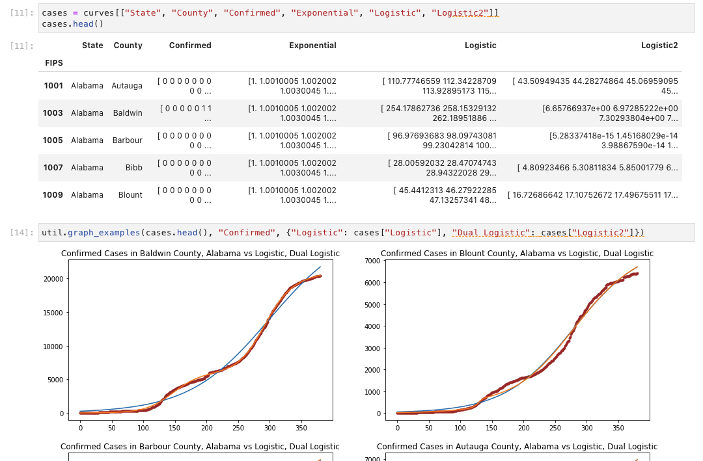
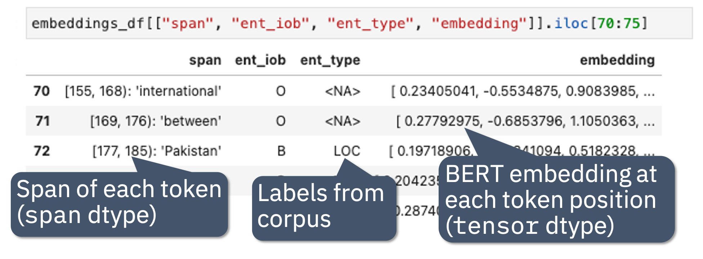
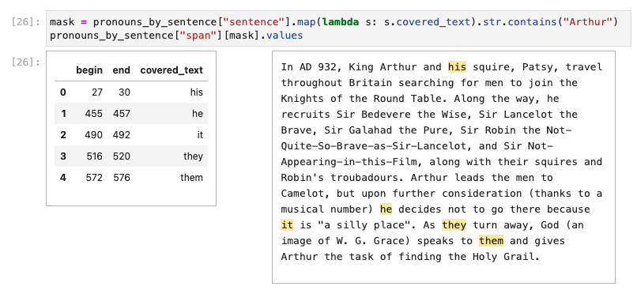
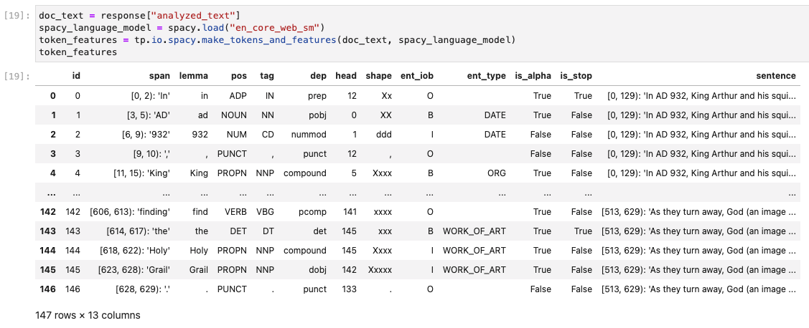
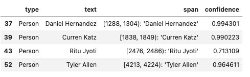
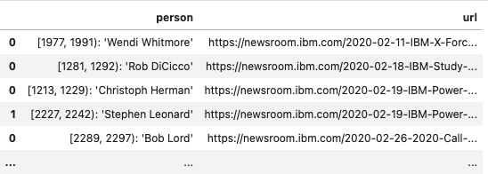
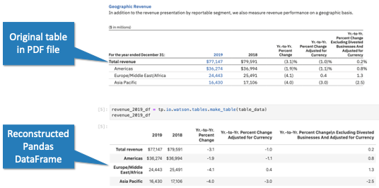
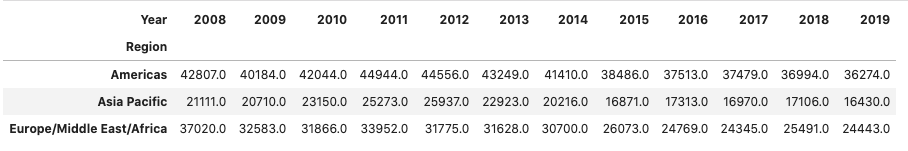
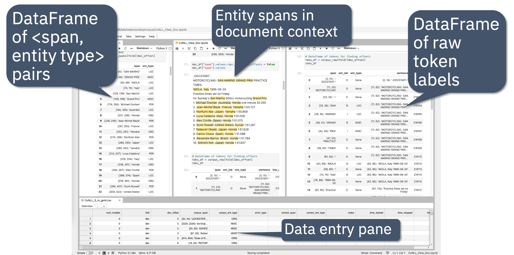

:author: Frederick Reiss
:email: frreiss@us.ibm.com
:institution: IBM Research

:author: Bryan Cutler
:email: bjcutler@us.ibm.com
:institution: IBM

:author: Zachary Eichenberger
:email: zachary.eichen@gmail.com
:institution: University of Michigan
:institution: IBM Research

:bibliography: references

.. :video: https://youtu.be/dQw4w9WgXcQ

--------------------------------------------------
Natural Language Processing with Pandas DataFrames
--------------------------------------------------

.. class:: abstract

    Most areas of Python data science have standardized on using Pandas
    DataFrames for representing and manipulating structured data in memory.
    Natural Language Processing (NLP), not so much.
    
    We believe that Pandas has the potential to serve as a universal data
    structure for NLP data. DataFrames could make every phase of NLP easier,
    from creating new models, to evaluating their effectiveness, to building
    applications that integrate those models.  However, Pandas currently lacks
    important data types and operations for representing and manipulating
    crucial types of data in many of these NLP tasks.

    This paper describes *Text Extensions for Pandas*, a library of extensions
    to Pandas that make it possible to build end-to-end NLP applications while
    representing all of the applications' internal data with DataFrames.
    We leverage the extension points built into Pandas library to add new data
    types, and we provide important NLP-specfific operations over these data
    types and and integrations with popular NLP libraries and data formats.
    
.. class:: keywords

   natural language processing, Pandas, DataFrames

Background and Motivation
-------------------------

This paper describes our work on applying general purpose data analysis tools
from the Python data science stack to Natural Language Processing (NLP)
applications.  This work is motivated by our experiences working on NLP
products from IBM's *Watson* portfolio, including IBM Watson Natural Language
Understanding :cite:`nlu` and IBM Watson Discovery :cite:`discovery`.  

These products include many NLP components, such as state-of-the-art machine
learning models, rule engines for subject matter experts to write business
rules, and user interfaces for displaying model results.  However, the bulk of
the development work on these products involves not the core NLP components,
but data manipulation tasks, such as converting between the output formats of
different models, manipulating training data, analyzing the outputs of models
for correctness, and serializing data for transfer across programming language
and machine boundaries.

Although the raw input to our NLP algorithms is text in a natural language, most of
the code in our NLP systems operates over machine data. Examples of this
machine data include:

* Relational tables of training data in formats like CoNLL-U :cite:`DBLP:journals/corr/abs-2004-10643`
* Model outputs formatted as tables for comparison against training data
* Arrays of dense tensors that represent BERT embeddings :cite:`devlin-etal-2019-bert`
* Graphs that represent dependency-based parse trees 
* Relational tables that represent document structure

This focus on data manipulation tasks instead of core AI algorithms is
not unique to IBM, or indeed to NLP :cite:`10.5555/2969442.2969519`.
However, NLP is unique in the quantity of redundant data structures and
low-level algorithms that different systems reimplement over and over again.
One can see this trend clearly in open source NLP libraries, where free access
to internal code also exposes the internal data structures.  Each of the major
NLP libraries implements its own custom data structures for basic NLP concepts. 

Consider the concept of a *span*: a region of a document, usually expressed as
a range of characters or tokens.  NLP systems use spans to represent the
locations of information they extract from text. This information includes
tokens, named entities, arguments to semantic role labeling predicates, and
many others.

Here is how some popular Python NLP libraries represent spans:

* *spaCy* :cite:`spacy` has a Python class named ``Span`` that represents a range of tokens. The
  locations of these tokens are stored inside the class ``Doc``. The  
  ``__getitem__`` method of ``Doc`` returns instances of the class ``Token``, which
  encodes the location of the token as a beginning character offset and a
  length in characters :cite:`spacy-api`.
* *Stanza* :cite:`DBLP:journals/corr/abs-2003-07082` has a Python class also
  named
  ``Span`` that represents a range of *characters*.  Information about the
  tokens that are contained within the character range is stored in the
  ``tokens`` property of the ``Span`` as objects of type ``Token``
  :cite:`stanza-src`.  These classes, ``Span`` and ``Token``, are different from
  the ``spaCy`` classes with the same names.
* ``nltk`` :cite:`Loper02nltk:the` models text as a Python list. Depending on the stage of processing, the elements of the list can be Python strings or tuples. Spans over tokens are represented by slices of the list, and information about character locations is generally not available
  :cite:`10.5555/1717171`.
* ``transformers`` :cite:`wolf2020huggingfaces` does not generally model spans; 
  instead it leaves that choice up to the user.  One exception to this policy is the library's
  ``TokenClassificationPipeline`` class, which has a method ``group_entities`` that
  returns a Python dictionary for each entity.  The fields ``start`` and
  ``end`` in this dictionary hold the span of the entity, measured in
  characters :cite:`transformers-api`.
* *TensorFlow Text* :cite:`tftext` represents lists
  of spans as either a pair of one-dimensional tensors (for tokenization) or as
  a single two-dimensional tensor (for span comparison operations).  The
  elements of the tensors can represent byte, character, or token offsets.
  Users need to track which type of offset is stored in a given tensor
  :cite:`tftext-api`.

All of these representations are incompatible with each other. Users who want
to use any two of these libraries together will need to write code to convert
between their outputs.  Users are also left to invent their own algorithms for
even the most basic operations over spans, including serializing them, finding
their covered text, determining whether two spans overlap, and finding matches
between two sets of spans.

The redundancy that these libraries display at the level of individual spans is
pervasive across all the more complex structures that they extract from text.
Both users and library developers spend considerable amounts of time reading
the documentation for these different data structures, writing code to convert
between them, and reimplementing basic operations over them.

An Alternative Approach
-----------------------

The Python data science community has developed effective tools for managing
and analyzing data in memory, chief among them being the DataFrame library
*Pandas* :cite:`jeff_reback_2021_4681666`.  Could we use these general-purpose
tools instead of continually reinventing data structures and algorithms for
basic NLP tasks?

We prototyped some use cases and quickly discovered that NLP-related data
involves domain-specific concepts; and some of these concepts are inconvenient
to express in Pandas.  For example, the *span* concept that we described in the
previous section is a crucial part of many applications.  The closest analog to
a span in Pandas' data model is the ``interval`` type, which represents an
interval using a pair of numbers.  When we prototyped some common NLP
applications using ``interval`` to represent spans, we needed additional code
and data structures to track the relationships between intervals and target
strings; as well as between spans and different tokenizations.  We also needed
code to distinguish between intervals measured in characters and in tokens. All of
this additional code negated much of the benefit of the general-purpose tool.

To reduce the amount of code that users would need to write, we started working
on extensions to Pandas to better represent NLP-specific data and to
support key operations over that data.  We call the library that we eventually
developed *Text Extensions for Pandas*.

Extending Pandas
++++++++++++++++

Text Extensions for Pandas includes three types of extensions:

* NLP-specific **data types (dtypes)** for Pandas DataFrames
* NLP-specific **operations** over these new data types
* **Integrations** between Pandas and common NLP libraries

Pandas includes APIs for library developers to add new data types to Pandas,
and we used these facilities to implement the NLP-specific data types in Text
Extensions for Pandas.

The core component of the Pandas extension type system is the *extension
array*. The Python class ``pandas.api.extensions.ExtensionArray`` defines key
operations for a columnar array object that backs a Pandas ``Series``
:cite:`pandas-extending`.  Classes
that extend ``ExtensionArray`` and implement a relatively short list of
required operations can serve as the backing stores for Pandas ``Series``
objects while supporting nearly all the operations that Pandas
built-in types support, including filtering, slicing, aggregation, and binary
I/O.

Indeed, many of the newer built-in types in Pandas, such as the ``interval`` 
and ``categorical``, are implemented as subclasses of ``ExtensionArray``.
Text Extensions for Pandas includes three different extension types based on
this API. The first two extension types are for spans with character- and
token-based offsets, respectively. The third extension type that we add
represents tensors.

Spans
-----

We implement character-based spans with a Python class called ``SpanArray``,
which derives from Pandas' ``ExtensionArray`` base class.  A ``SpanArray``
object represents a column of span data, and it stores this data internally
using three NumPy :cite:`harris2020array` arrays, plus a shared reference to
the underlying text.

The three arrays that represent a column of span data consist of arrays of
begin and end offsets (in characters), plus a third array of indices into a
table of unique target strings. The ``SpanArray`` object also stores a
shared reference to this table of strings.

The string table is necessary because a Pandas Series can contain spans over
many target strings. The spans in the Series might come from multiple
documents, or they may come from multiple fields of the same document.  Users
need to be able to perform operations over the containing DataFrames without
performing many string equality checks or creating many copies of the text of
each document.  Representing the target text of each span as an index into the
table allows us to quickly check whether two spans are over the same string.
The string table also allows the ``SpanArray`` class to track exactly which
unique strings the array's spans cover. Keeping track of this set of strings is
important for efficient serialization, as well as for efficiently appending one
``SpanArray`` to another. As an additional optimization, slicing and filtering
operations over a ``SpanArray`` do not modify the string table; a slice of an
array will share the same table as the original array.

In addition to spans with character offsets, we also support spans whose begin
and end offsets are measured in tokens.  Most machine learning models and rule
engines for NLP do not operate over sequences of characters but over sequences
of *tokens* |---| ranges of characters that correspond to elements like words,
syllables, or punctuation marks.  Character-based spans are useful for
comparing, visualizing, and combining the outputs of multiple models, because
those models may use different tokenizations internally.  When analyzing the
inputs and outputs of a single model (or rule set, in the case of a rule-based
NLP system), tokens are a more appropriate unit for the begin and end offsets
of spans.  Representing spans with token offsets allows for operations like
computing token distances between spans and can prevent errors that could lead
to spans not starting or ending on a token boundary.  The loss functions used
to train most NLP models also tend to operate over tokens.

There can be multiple different tokenizations of the same document, even within
a single application. When storing token-based span offsets, it is important to
retain information about which tokenization of which document each token offset
corresponds to.  The ``TokenSpanArray`` class represents each distinct
tokenization of a document with an instance of ``SpanArray`` containing the
locations of the tokens.  The representation of the token-based spans
themselves consists of three NumPy arrays, holding begin and end offsets (in
tokens) and a pointer to the ``SpanArray`` containing the token offsets.

Although it stores the locations of spans as token offsets, the
``TokenSpanArray`` class can generate character-based begin and offsets on
demand from its internal tables of token locations.  This facility allows
``TokenSpanArray`` to be used in any code that works over instances of
``SpanArray``. For example, code that detects pairs of overlapping spans can
easily work over arbitrary combinations of token- and character-based spans,
which is useful when merging the outputs of models that represent span offsets
differently. 

The internal structure of our ``SpanArray`` and ``TokenSpanArray`` extension
arrays allows for efficient vectorized implementations of common Pandas
operations like slicing, filtering, and aggregation.  Slicing operations over a
``SpanArray`` produce a new ``SpanArray`` with views of the original
``SpanArray`` object's internal NumPy arrays, avoiding unnecessary copying of
span data.

Tensors
-------

*Tensors* |---| dense n-dimensional arrays |---| are another common concept in
modern NLP.  The deep learning models that drive much
of state-of-the-art NLP today take tensors as inputs and outputs and operate
internally over other tensors.  Embeddings |---| data structures that encode
information about a block of text as a dense vector amenable to analysis with 
algorithms that expect dense input |---| are a key part of many NLP algorithms and can be efficiently represented with tensors.  Tensors are also useful for more
traditional types of NLP data, such as n-grams and one-hot-encoded feature
vectors.

Our ``TensorArray`` extension array class represents a Pandas Series where each
element is a tensor.  Internally, we represent the entire Series' data as a
single dense NumPy array. The TensorArray class translates Pandas array
operations to vectorized operations over the underlying NumPy array.  
Because CPython :cite:`cpython`, the most common runtime for Python, uses an intepreter to run
Python code, these
vectorized operations are much more efficient than iterating over a list of
tensors.

Since the individual data items in a ``TensorArray`` are actually slices of a
larger NumPy array, our tensor data type integrates seamlessly with third
party libraries that accept NumPy arrays.  For example, Figure
:ref:`matplotlib` shows how our tensor data type works with the ``matplotlib``
:cite:`Hunter:2007` plotting library in a Jupyter notebook.

   Example of using our tensor data type to store a time series while
   visualizing those time series with the ``matplotlib`` :cite:`Hunter:2007`
   library in a Jupyter notebook. In the top half of the window is a
   DataFrame where each cell of the rightmost four columns contains an entire
   time series of COVID-19 case data as a tensor.  The bottom half of the
   screen shows the results of plotting these tensors directly out of the
   DataFrame.  This example notebook is available at
   `<https://github.com/CODAIT/covid-notebooks/blob/master/notebooks/analyze_fit_us_data.ipynb>`_.
   :label:`matplotlib`

Some libraries, notably ``xarray`` :cite:`hoyer2017xarray`, provide Pandas-like
dataframes specialized for numeric tensor or array data. These libraries are
useful for cases where dataframes consist almost entirely of tensor data.  Our
``TensorArray`` extension type is a complementary alternative for applications
where the data is a mixture of tensors, spans, and built-in Pandas data types
with a wide variety of different schemas.  For example, figure :ref:`bert`
shows an example of a DataFrame that mixes spans, tensors, and Pandas
categorical types to store features of the tokens in a document.  For
applications that need this kind of mixture of data, our tensor type allows
users to leverage Pandas' collection of built-in operations and third-party
visualizations, while still operating efficiently over tensor-valued data
series.

   Slice of a DataFrame of information about tokens constructed with our
   library's integration with the ``transformers`` library for masked language
   models.  Each row of the DataFrame represents a token in the document. The
   leftmost column uses our span extension type to store the position of the
   token.  The rightmost column stores a BERT embedding at that token position.
   The columns in between hold token metadata that was created by aligning the
   corpus' original tokenization with the language model's tokenization, then
   propagating the corpus labels between pairs of aligned tokens.  The notebook
   in which this example appears (available at
   `<https://github.com/CODAIT/text-extensions-for-pandas/blob/master/notebooks/Model_Training_with_BERT.ipynb>`_)
   shows how to use this DataFrame as the input for training a named entity
   recognition model with the ``sklearn`` library.
   :label:`bert`

Serialization
-------------

Many areas of modern NLP involve large collections of documents, and common NLP
operations can expand the size of this data by orders of magnitude.  Pandas
includes facilities for efficient serialization of Pandas data types using
Apache Arrow :cite:`arrow`. Text Extensions for Pandas uses this support to
convert data from the library's extension types into Arrow format for
efficient storage and transfer.

Efficient binary I/O can make reading and writing NLP corpora orders of
magnitude faster.  Figure :ref:`readtimes` compares the amount of time required
to read the training fold of the CoNLL-2003 corpus
:cite:`tjong-kim-sang-de-meulder-2003-introduction` from a local filesystem
when the corpus is stored in three different formats.  Reading the corpus with
Pandas and the Apache Parquet binary file format is 60 times faster than
reading the original CoNLL-format text file with ``nltk`` and 800 times faster
than reading the corpus in DocBin format with spaCy.

.. figure:: figures/read_times.pdf

   Comparison of the amount of time required to read the training fold of the
   CoNLL-2003 named entity recognition corpus into memory, when the corpus is
   stored in three different file formats. Binary I/O with Pandas and the
   Apache Parquet file format is 2-3 orders of magnitude faster than the other
   file formats tested.
   :label:`readtimes`

Text Extensions for Pandas also supports reading files in the text-based
formats known as CoNLL and CoNLL-U.  Many benchmark datasets for NLP
are released in these formats. Text Extensions for Pandas
can convert these files into DataFrames with one line per token, using our span
extension type to store the location of a given token and the location of the sentence
that contains the token.

Spanner Algebra
---------------

In addition to representing span data, NLP applications need to filter,
transform, and aggregate this data, often in ways that are unique to 
NLP.

The *document spanners* formalism :cite:`10.1145/2699442` extends the
relational algebra with additional operations to cover a wide gamut of
critical NLP operations.

Since it is an extension of the relational algebra, much of document spanners
can already be expressed with Pandas core operations.  We have implemented
several of the remaining parts of document spanners as operations over Pandas
Series of data type Span.

Specifically, we have NLP-specific *join* operations (sometimes referred to as
"merge") for identifying matching pairs of spans from two input sets, where the
spans in a matching pair have an overlap, containment, or adjacency
relationship.  These join operations are crucial for combining the results of
multiple NLP models, and they also play a role in rule-based business logic.
For example, a domain expert might need to find out matches of one model that
overlap with matches of a different model. If the output spans are in the
"span" columns of two DataFrames, ``model_1_out`` and ``model_2_out``, then the
user can find all such matching pairs by running the following line of code:

.. -----------------------------------------------------|
.. code-block:: python

    import text_extensions_for_pandas as tp

    # Find output spans of model 1 that contain output
    # spans of model 2.
    # This expression returns a DataFrame with two 
    # columns, span_1 and span_2, both of type span.
    span_pairs = tp.spanner.contain_join(
        model_1_out["span"], model_2_out["span"],
        "span_1", "span_2")

We include two implementations of the *extract* operator, which produces a set
of spans over the current document that satisfy a constraint.  Our current
implementations of *extract* support extracting the set of spans that match a
regular expression or a gazetteer (dictionary).

We include a version of the *consolidate* operator, which takes as input a
set of spans and removes overlap among the spans by applying a consolidation
policy.  This operator is useful for business logic that combines the results
of multiple models and/or extraction rules as well as for resolving ambiguity
when a single model produces overlapping spans in its output.

Other Span Operations
+++++++++++++++++++++

We support span operations that are not part of the document spanners
formalism but are important for key NLP tasks. These operations include:

* aligning spans based on one tokenization of the document to a different
  tokenization

* *lemmatizing* spans |---| that is, converting the text that the span covers to
  a normalized form

* converting sequences of tokens tagged with inside-outside-beginning (IOB)
  tags :cite:`DBLP:journals/corr/cmp-lg-9505040` into spans of entities, and vice versa.

Jupyter Notebook Integration
----------------------------

Jupyter notebooks have built-in facilities for displaying Pandas DataFrames.
Our extensions to Pandas also work with these facilities.
If the last line of a notebook cell returns a DataFrame containing span and
tensor data, then Jupyter will display an HTML representation of the DataFrame,
including cells that contain our extension types. Figure :ref:`bert` shows how
a DataFrame containing a column of spans and a column of tensors renders as
HTML when shown in a Juypter notebook.

Other Python development tools, including Visual Studio Code, PyCharm, and
Google Colab, use extended versions of the Jupyter DataFrame display facilities
to show DataFrames in their own user interfaces. Our extension types also work
with these interfaces.

There is also an ecosystem of interactive libraries for exploring and
visualizing Pandas DataFrames. Examples of such libraries include D-Tale
:cite:`dtale`, Qgrid :cite:`qgrid`, and the Spyder :cite:`spyder` Variable
Explorer.
These libraries also work with our extension
types. Figure :ref:`dtale` shows an example of using Text Extensions for Pandas
to display span data with the *D-Tale* interactive data analysis tool
:cite:`dtale`.

.. figure:: figures/dtale.png

   Displaying a DataFrame containing span data in the *D-Tale* interactive
   visualizer :cite:`dtale`. Our extension types for NLP work with third-party libraries 
   without requiring any changes to those libraries.
   :label:`dtale`

Because our extension types for tensors use NumPy's `ndarray` type for
individual cell values, these extension types work with many tools that accept
NumPy arrays.  Figure :ref:`matplotlib` shows an example of storing time series
in the cells of a DataFrame and plotting those time series directly out of the
DataFrame using the graphics library ``matplotlib`` in a Jupyter notebook.

It is often useful to visualize spans in the context of the source text.  We
use Jupyter's built-in application programming interface (API) for HTML
rendering to facilitate this kind of visualization.  If the last expression in
a notebook cell returns a `SpanArray` or `TokenSpanArray` object, then Jupyter
will automatically display the spans in the context of the target text, as
shown in Figure :ref:`spandisplay`.

   Displaying the contents of a Pandas Series of span data in the context of
   the target document, using the integration between Text Extensions for
   Pandas and Jupyter's APIs for HTML display.  The spans shown in this example
   represent all pronouns in sentences that contain the name "Arthur". We
   generated this set by cross-referencing the outputs of two models using Pandas operations.
   This notebook can be found at `<https://github.com/CODAIT/text-extensions-for-pandas/blob/master/notebooks/Analyze_Text.ipynb>`_.
   :label:`spandisplay`

Taken together with JupyterLab's ability to display multiple widgets and views
of the same notebook, these facilities allow users to visualize NLP data from
several perspectives at once, as shown in Figure :ref:`labeling`.

NLP Library Integrations
------------------------

Text Extensions for Pandas provides facilities for transforming the outputs of
several common NLP libraries into Pandas DataFrames to represent NLP concepts.

spaCy
+++++

*spaCy* :cite:`spacy` is a Python library that provides a suite of NLP
models intended for production use.  Users of spaCy access
most of the library's functionality through spaCy *language models*, Python
objects that encapsulate a pipeline of rule-based and machine learning models.
A spaCy language model takes natural language text as input and extracts  
features such as parts of speech, named entities, and dependency relationships
from the text. These features are useful in various downstream NLP tasks.

Our spaCy integration converts the output of a spaCy language model into a
DataFrame of token information. Figure :ref:`spacymodel` shows an example of using this
integration to process the first paragraph of the Wikipedia article for the
film *Monty Python and the Holy Grail*.

   Example of converting the output of a spaCy language model.
   Each row of the DataFrame holds information about a single token, including
   the span of the token and the span of the containing sentence. The code for
   this example is available at `<https://github.com/CODAIT/text-extensions-for-pandas/blob/master/notebooks/Integrate_NLP_Libraries.ipynb>`_.
   :label:`spacymodel`

Converting from spaCy's internal representation to DataFrames allows usage of
Pandas operations to analyze and transform the outputs of the language
model.  For example, users can use Pandas' filtering, grouping, and aggregation
to count the number of nouns in each sentence:

.. -----------------------------------------------------|
.. code-block:: python

    # Filter tokens to those that are tagged as nouns
    nouns = tokens[tokens["pos"] == "NOUN"]

    # Compute the number of nouns in each sentence
    nouns.groupby("sentence").size() \
        .to_frame(name="num_nouns")

.. .. figure:: figures/nouns_wide.png
..   :figclass: h

Or they could use our span-specific join operations and Pandas' `merge`
function to match all pronouns in the document with the person entities that
are in the same sentence:

.. code-block:: python

    import text_extensions_for_pandas as tp

    # Find person names
    entities = tp.io.conll.iob_to_spans(tokens)
    person_names = entities[
        entities["ent_type"] == "PERSON"]["span"]

    # Find all pronouns
    pronouns = tokens[tokens["tag"] == "PRP"] \
        [["span", "sentence"]]

    # Find all sentences
    sentences = tokens[["sentence"]].drop_duplicates() \
        ["sentence"]

    # Match names and pronouns in the same sentence
    pronoun_person_pairs = (
        pronouns.rename(columns={"span": "prounoun"})
            .merge(tp.spanner.contain_join(
                sentences, person_names, 
                "sentence", "person")))

We also support using spaCy's `DisplaCy` visualization library to display
dependency parse trees stored in DataFrames.  Users can filter the output of
the language model using Pandas operations, then display the resulting subgraph
of the parse tree in a Jupyter notebook.  This display facility will work with
any DataFrame that encodes a dependency parse as a Pandas Series of token spans,
token IDs, and head IDs.

`transformers`
++++++++++++++

``transformers`` :cite:`wolf2020huggingfaces` is a library that provides
implementations of many state of the art masked language models such as BERT
:cite:`devlin-etal-2019-bert` and RoBERTa
:cite:`DBLP:journals/corr/abs-1907-11692`.  In addition to the language models
themselves, ``transformers`` includes dedicated tokenizers for these models,
most of which use subword tokenizers like *SentencePiece*
:cite:`kudo-richardson-2018-sentencepiece` to improve accuracy.

Text Extensions for Pandas can transform two types of outputs from the
``transformers`` library for masked language models into Pandas DataFrames.  We
can convert the output of the library's tokenizers into DataFrames of token
metadata, including spans marking the locations of each token.

Our tensor data type can also represent embeddings from the encoder stage of a
``transformers`` language model.  Since the language models in ``transformers``
have a limited sequence length, we also include utility functions for dividing
large DataFrames of token information into fixed-size windows,
generating embeddings for each window, and concatenating the resulting
embeddings to produce a new column for the original DataFrame.
Figure :ref:`bert` shows a DataFrame of token features that includes both a
span column with token location and a tensor column with embeddings at each
token position.

IBM Watson Natural Language Understanding
+++++++++++++++++++++++++++++++++++++++++

Watson Natural Language Understanding :cite:`nlu` is an API that provides access to
prebuilt NLP models for common tasks across a wide variety of natural
languages.  Users can use these APIs to process several thousands documents per
month for free, with paid tiers of the service available for higher data rates.

Our Pandas integration with Watson Natural Language Understanding can translate
the outputs of all of Watson Natural Language Understanding's information
extraction models into Pandas DataFrames. The supported models are:

* `syntax`, which performs syntax analysis tasks like tokenization,
  lemmatization, and part of speech tagging.
* `entities`, which identifies mentions of named entities such as persons,
  organizations, and locations.
* `keywords`, which identifies instances of a user-configurable set of keywords
  as well as information about the sentiment that the document expresses
  towards each keyword.
* `semantic_roles`, which performs *semantic role labeling*, extracting
  subject-verb-object triples that describe events which occur in the text.
* `relations`, which identifies relationships betwen pairs of named entities.

Converting the outputs of these models to DataFrames makes building notebooks
and applications that analyze these outputs much easier.  For example, with two
lines of Python code, users can produce a DataFrame with information about all
person names that a document mentions:

.. -----------------------------------------------------|
.. code-block:: python

    import text_extensions_for_pandas as tp

    # The variable "response" holds the JSON output 
    # of the Natural Language Understanding service.
    # Convert to DataFrames and retrieve the DataFrame
    # of entity mentions.
    entities = tp.io.watson.nlu.parse_response(response) \
               ["entity_mentions"]

    # Filter entity mentions down to just mentions of
    # persons by name.
    persons = entities[entities["type"] == "Person"]
    
Figure :ref:`nluperson` shows the DataFrame that this code produces when
run over an IBM press release.

   DataFrame of person names in a document created by converting the output of
   the Watson Natural Language Understanding's ``entities`` model to a
   DataFrame of entity mentions. We then used Pandas filtering operations to
   select the entity mentions of type "Person". The first column holds spans
   that tell where in the document each mention occurred.  The original press 
   release can be found at `<https://newsroom.ibm.com/2020-12-02-IBM-Named-a-Leader-in-the-2020-IDC-MarketScape-For-Worldwide-Advanced-Machine-Learning-Software-Platform>`_.
   :label:`nluperson`

With a few additional steps, users can combine the results of multiple models
to produce sophisticated document analysis pipelines.  Figure :ref:`nlu` 
shows a DataFrame with the names of 301 executives extracted from 191 IBM press
releases by cross-referencing the outputs of Watson Natural Language
Understanding's ``entities`` and ``semantic_roles`` models.
All of the analysis steps that went into producing this result were done with
high-level operations from Pandas and Text Extensions for Pandas. Source code 
for this example is available on our blog post about this use case :cite:`marketintel`.

   Excerpt from DataFrame containing the names of 301 executives extracted
   from 191 IBM press releases. To generate this table, we first converted the 
   outputs of Watson Natural Language Understanding's ``entities`` model, which 
   finds mentions of person names, and the product's ``semantic_roles`` model,
   which extracts information about the context in which words occur.
   Then we used a series of standard Pandas operations, plus operations from
   spanner algebra, to cross-reference the outputs of the two models. Code and
   a full explanation of this use case can be found in the article "Market
   Intelligence with Pandas and IBM Watson on the IBM Data and AI blog 
   :cite:`marketintel`.
   :label:`nlu`

IBM Watson Discovery
++++++++++++++++++++

IBM Watson Discovery :cite:`discovery` is a document management platform that
uses intelligent search and text analytics to eliminate barriers to sharing
data between teams and to retrieve
information buried inside enterprise data.  One of the key features of the IBM
Watson Discovery product is *Table Understanding*, a document enrichment model
that identifies and parses human-readable tables of data in PDF and HTML
documents.

Text Extensions for Pandas can convert the output of Watson Discovery's Table
Understanding enrichment into Pandas DataFrames.  This facility allows users to
reconstruct the contents and layout of the original table as a DataFrame, which
is useful for debugging and analysis of these outputs. Figure
:ref:`tabletodf` shows an example DataFrame from this process next to the
original table in the source PDF document.

   An example table from a PDF document in its original, human-readable form
   (left) and after using Text Extensions for Pandas to convert the output of
   Watson Discovery's Table Understanding enrichment into a Pandas DataFrame.
   :label:`tabletodf`

Our conversion also produces the "shredded" representation of the table as a
DataFrame with one line for each cell of the original table. This data format
facilitates data integration and cleaning of the extracted information.
Pandas' facilities for data cleaning, filtering, and aggregation are extremely
useful for turning raw information about extracted tables into clean,
deduplicated data suitable to insert into a database. Figure :ref:`revenue`
shows how, by cleaning and merging this shredded representation of a revenue
table across multiple IBM annual reports, one can construct a DataFrame with
ten years of revenue information broken down by geography.

   DataFrame containing ten years of IBM revenue broken down by geography,
   obtained by loading ten years of IBM annual reports int IBM Watson
   Discovery; converting the outputs of Watson Discovery's Table Understanding
   enrichment to DataFrames; then cleaning and deduplicating the resulting data
   using Pandas. The code that produced this result can be found at `<https://github.com/CODAIT/text-extensions-for-pandas/blob/master/notebooks/Understand_Tables.ipynb>`_.
   :label:`revenue`

Usage in Natural Language Processing Research
---------------------------------------------

We are using Text Extensions for Pandas in ongoing research on semisupervised
identification of errors in NLP corpora.
Pandas' data analysis facilities provide a powerful substrate
for cross-referencing and analyzing the outputs of NLP models in order to
pinpoint potentially-incorrect labels. 

One example of this type of application is work that we and several other
coauthors recently published on correcting errors in the highly-cited
CoNLL-2003 corpus for named entity recognition :cite:`reiss-etal-2020-identifying`.
We identified over 1300 errors in the corpus and published a corrected version
of the corpus. We also revisited recent results in named entity recognition
using the corrected corpus.

Nearly every step of our analysis used Text Extensions for Pandas.  We started
by using our library's input format support to read the model results from the
16 teams in the dataset's original 2003 competition.  Then we used Text
Extensions for Pandas to convert these outputs from labeled tokens to
DataFrames of <span, label> pairs, with one such pair for each entity mention.
Using spanner algebra, we cross-referenced these entity mentions with the
entity mentions to find cases where there was strong agreement among the
teams' models coupled with *disagreement* with the corpus labels.  A large
fraction of these cases involved incorrect corpus labels. 

Since we did not have model outputs for the training fold of the corpus, we
used our library's integration with the ``transformers`` library to retokenize
this part of the corpus with the BERT tokenizer. Then we used spanner algebra
to match the corpus's token labels with the corresponding subword tokens from
the BERT tokenizer. Again, we used our library's integration with
``transformers`` to add a column to our DataFrame of tokens containing BERT
embeddings at each token position as tensors.  Then we used ``scikit-learn`` :cite:`scikit-learn` to
train an ensemble of 17 token classification models over multiple different
Gaussian random projections. By cross-referencing the outputs of these models,
again using Pandas and spanner algebra, we were able to identify a large number
of additional incorrect labels in the test fold.

We also used Text Extensions for Pandas' integration with Jupyter to build an
interface for human review of the suspicious labels that our analysis of model
outputs had flagged. Figure :ref:`labeling` shows this interface in action.

   Example of using our extensions to Pandas and JupyterLab to create an ad-hoc
   interface for inspecting potentially incorrect labels in a named entity
   recognition corpus. The top three panes of this JupyterLab session display
   three different views of a collection of named entities for human
   evaluation. All of these views are driven off of Pandas DataFrames of <span,
   entity type> pairs. The bottom pane is where human evaluators flag
   incorrectly labeled entities.  This Jupyter notebook is part of an in-depth
   tutorial available at
   `<https://github.com/CODAIT/text-extensions-for-pandas/tree/master/tutorials/corpus>`_.
   :label:`labeling`

The code that we used in this paper is available as a collection of Jupyter
notebooks at
`<https://github.com/CODAIT/text-extensions-for-pandas/tree/master/tutorials/corpus>`_.
We are currently working to extend the techniques we
developed in order to cover a wider variety of token classification corpora and
to incorporate several of the techniques used in our paper into the Text
Extensions for Pandas library :cite:`dash-la`.

Conclusion
----------

This paper has introduced our library, Text Extensions for Pandas. Text
Extensions for Pandas provides a collection of extension data types,
NLP-specific operations, and NLP library integrations that turn Pandas
DataFrames into a universal data structure for managing the machine data that
flows through NLP applications.

Text Extensions for Pandas is freely available as both an installable Python
package and as source code.  We publish packages on the PyPI and Conda-Forge
package repositories. Since our library is implemented in pure Python, these
packages work on most operating systems.

The source code for Text Extensions for Pandas is available at
`<https://github.com/CODAIT/text-extensions-for-pandas>`_ under version 2 of
the Apache license.  We welcome community contributions to the code as well as
feedback from users about bugs and feature requests.

