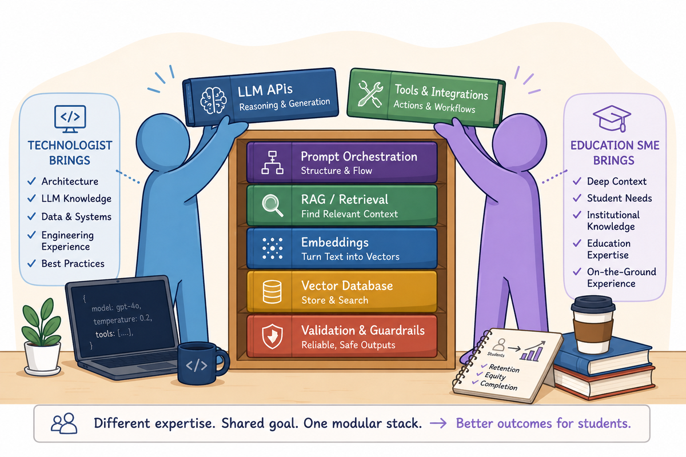
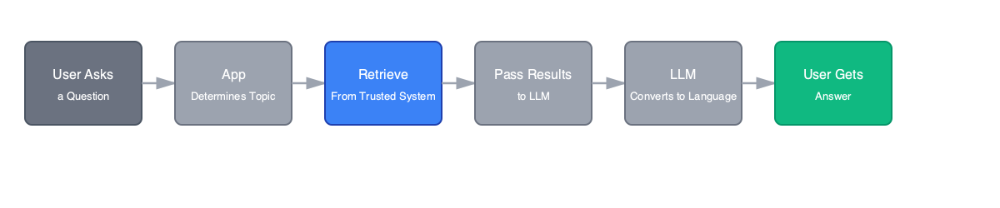

## What We Learned Building AI Tools with Python

Most Python developers already know how to build real systems, APIs, scripts, services, and pipelines. During a social impact AI hackathon, we applied those same engineering skills to rapidly build AI-powered tools that helped educational institutions become more comfortable using AI to improve student success outcomes.

Like many developers entering the AI space, we had to quickly navigate a growing ecosystem of frameworks, APIs, vector databases, and agent tooling while still shipping working software under tight time constraints.

Here we share the lessons learned, tooling decisions, and implementation patterns that helped us move from experimentation to working applications.

Rather than treating AI as magic, we'll break it down into familiar engineering concepts:

- validation
- retrieval
- orchestration
- structuring inputs
- structured outputs

We'll walk through:

- the core concepts behind modern AI applications
- common Python libraries and tooling
- reusable code snippets and implementation patterns
- understanding how and when to use these patterns in real systems

## The Shift: AI as a System Component, Not Magic

The biggest shift here is the greater accessibility for anyone to build. You no longer need to train models yourself as modern large language model (LLM) APIs, embedding models, and vector databases are available with minimal setup. We view AI as not replacing your application stack, but another component to be added to existing systems that are useful for ambiguity, language, reasoning, and search. Think of an LLM like a non-deterministic but powerful external API that needs structure, validation, retries, and observability.

AI collapses the gap between expertise and execution. In our hackathon, we paired technologists (who bring architecture, LLM knowledge, data systems, and engineering experience) with education experts (who bring deep context, student needs, institutional knowledge, and on-the-ground experience). Together, through a modular LLM stack (prompts, tools, retrieval, embeddings, vector databases, and guardrails), we delivered working solutions in 3 days.



## The Modern AI Stack in Python

Most AI-powered Python applications are assembled from a small set of reusable components:

**LLM APIs:** ollama-python, litellm, transformers, vllm, llama-cpp-python

**Embedding models:** sentence-transformers, transformers, InstructorEmbedding, FlagEmbedding (BGE models)

**Vector databases:** faiss, chromadb, qdrant-client, weaviate-client, milvus

**Prompt orchestration:** LangGraph, LangChain, Haystack, PydanticAI, CrewAI

**Structured output validation:** Pydantic, Instructor, Guardrails AI, jsonschema

**Tool calling:** PydanticAI, LangGraph, LangChain, smolagents, CrewAI

The key takeaway: You are still writing Python. LLMs are another system dependency your application coordinates and manages. We'll show how these pieces connect in practice using code snippets and examples from our social impact hackathon project.

## Key Terms

For our purposes, during the hackathon, we used the following concepts:

- **LLM:** Generates text from prompts
- **Embeddings:** Turn words or sentences into numbers that capture meaning. Things with similar meanings end up close together ("dog" ≈ "puppy", "pizza" ≈ "burger"). That's how AI can find related ideas, not just exact word matches.
- **RAG:** Retrieve context before generating answers
- **Agent:** A loop where the model can use tools and react to results

These concepts cover most real-world AI applications.

## Requirements Gathering Before Hacking

Before we began using AI, we spent time understanding what our stakeholders considered a good result.

Requirements gathering was an important step to help us understand the goals of our educational institutions. This involved journey mapping. Before building, we worked with educational staff to journey-map their workflows, questions, and pain points. That process helped define:

- What kinds of questions the system should answer
- What data it was allowed to access
- What topics were out of scope
- How responses should be phrased

Once we documented the needs and criteria our stakeholders (educational institutions and staff) had for success, we could begin development work. With the requirements distilled from our clients with this method of planning, we were able to identify LLM patterns for our respective institution's use case. With that in mind, we'll explore patterns of LLM usage with hands-on examples.

## Core Pattern 1: System Prompts + Data Dictionaries

Jasmine's team used system prompts and a data dictionary to ground the LLM in institutional data and terminology. This created a control layer between user questions, language, and underlying datasets.

**Key components:**

- **System prompt** defines rules, scope, and response behavior
- **Data dictionary** defines approved institutional terms and metrics
- Together, they constrain interpretation and reduce hallucinations
- Ensures data is used at the correct grain and in the correct context

Jasmine's hackathon project involved building a chatbot to help higher education staff understand a pivotal student success dataset. The university had an institutional research department that was overwhelmed with data requests that took days to answer. AI was an opportunity to make this self-service, but institutions were concerned about data privacy and security.

Prompting became the primary way we defined system behavior, privacy, and guardrails. We created a data dictionary of approved educational terms and concepts to guide the LLM toward domain-specific language and reduce hallucinations. This was important because despite datasets having overlapping subject matter, there was nuance in how data could be used. Some tables contained PII and could not be used at all for a chatbot serving data to internal stakeholders.

This dictionary acted as scaffolding for the LLM:

- Defining the language of the domain
- Clarifying what concepts existed
- Constraining how questions should be interpreted
- Helping the model distinguish valid requests from unsupported ones

Rather than relying on the model's general knowledge, we used structured context to shape how it reasoned about the problem space.

```python
SYSTEM_PROMPT = """
You are an educational analytics assistant.

### brief data dictionary ###
Use only the approved terms below:
- Attendance Rate
- Engagement Score
- Intervention Tier
- Student Success Trend

Rules:
- Only return aggregate data
- No individual student data (PII)
- Say "out of scope" if not supported
- Don't join the Attendance Rate data to an external, aggregate student metric table;
  that data contains information at an opposing grain.
"""

response = llm.chat.completions.create(
    model="gpt-4o",
    messages=[
        {"role": "system", "content": SYSTEM_PROMPT},
        {"role": "user", "content": "Which tiers improved attendance?"}
    ]
)
```

**Key takeaway:** System prompts and data dictionaries turn language into a controlled interface for data.


## Core Pattern 2: Retrieval-Augmented Generation (RAG)

We extended the data dictionary into a live retrieval layer connected to institutional data systems.

**Why it matters:**

- Aligns with existing infrastructure
- Bridges prompts with real data systems
- Reduces hallucinations through grounding
- Guides the chatbot toward approved terminology
- Retrieves relevant institutional definitions and resources at query time
- Constrains answers to known educational concepts

Jasmine's hackathon project relied heavily on RAG to ground responses in a trusted educational context. Embeddings and retrieval pipelines helped guide the chatbot toward approved terminology, retrieve institutional definitions, and constrain answers to known concepts, especially important in a sensitive domain where accuracy matters.



```python
# Data sources (swappable, secured)
DATA_SOURCES = {
    "sql": "...Azure SQL / AAD auth..."
}

# Retrieval layer
def fetch_metrics(query):
    if "retention" in query:
        return sql("""
            SELECT metric, value, definition
            FROM student_metrics
            WHERE metric = 'retention'
        """)
    return None

# LLM layer (swappable)
def call_llm(prompt, model="gpt-4o"):
    return llm.chat(model=model, messages=[
        {"role": "system", "content": "Use only provided context."},
        {"role": "user", "content": prompt}
    ])

# App flow
def answer(query, model="gpt-4o"):
    context = fetch_metrics(query)
    prompt = f"{query}\n\nContext:\n{context}"
    response = call_llm(prompt, model=model)
    log = {"query": query, "model": model}
    return response, log
```

**Key takeaway:** RAG connects the LLM to live institutional data systems and approved terminology.


## Core Pattern 3: Function Calling & Controlled Output

Not every problem requires an LLM. For numeric forecasts, risk scoring, and trend analysis, the model should not invent results. It should request them from backend systems that can compute them deterministically.

**Audrey's approach:** She used requirements gathering and journey mapping to understand the goals of her institutions. That research helped her design a predictive analytics dashboard that separated language understanding from analysis workflows, so the LLM acted as an interface layer rather than generating predictions directly.

In practice, the chatbot received structured requests, passed them to backend analytics, and then explained the results back to users in clear language. The dashboard provided:

- Retention prediction
- Risk scores per student
- Probability of dropping out
- Attendance trend forecasts
- Credential type prediction
- Gateway course success prediction
- GPA prediction

**Key principles:**

1. **Separate Understanding from Computation** - The LLM interprets the user's intent, but the predictive model and analytics pipeline do the actual math. This keeps forecasting logic outside the model and makes the system easier to test and trust.

2. **Let the LLM Request Structured Data** - Instead of free-form answers, the LLM calls a function like get_retention_risk(school_id). That request is precise, typed, and limited to the data the backend is designed to return.

3. **Return Predictable Analytics** - The Python system aggregates predictions and returns structured outputs such as risk scores, dropout probability, and attendance trends. The LLM then explains those results in plain language.

4. **Keep It Reproducible and Auditable** - Because predictions are computed outside the model, the same input produces the same output. That makes the system easier to audit, version, and debug, especially in a hackathon setting where you need reliable behavior fast.

```python
from openai import OpenAI

client = OpenAI()

# Predictive model wrapped as an approved function
def get_retention_risk(school_id):
    students = feature_store.get_students(school_id)
    risk_scores = retention_model.predict_proba(students)
    return {
        "school_id": school_id,
        "avg_retention_risk": float(risk_scores.mean())
    }

tools = [
    {
        "type": "function",
        "function": {
            "name": "get_retention_risk",
            "description": "Retrieve student retention risk metrics",
            "parameters": {
                "type": "object",
                "properties": {
                    "school_id": {"type": "string"}
                },
                "required": ["school_id"]
            }
        }
    }
]

user_question = (
    "Which students are most at risk of not returning next semester?"
)

# Step 1: LLM determines what analytics are needed
response = client.chat.completions.create(
    model="gpt-4o",
    messages=[
        {
            "role": "system",
            "content": (
                "Never generate predictions yourself. "
                "Use available analytics functions and explain results."
            )
        },
        {"role": "user", "content": user_question}
    ],
    tools=tools
)

# Step 2: Backend executes predictive model
analytics_result = get_retention_risk(
    school_id="School_123"
)

# Step 3: LLM explains results
final_response = client.chat.completions.create(
    model="gpt-4o",
    messages=[
        {"role": "user", "content": user_question},
        {
            "role": "tool",
            "tool_call_id": response.choices[0].message.tool_calls[0].id,
            "content": str(analytics_result)
        }
    ]
)

print(final_response.choices[0].message.content)
```

This pattern ensured predictions were:

- Reproducible
- Auditable
- Computed separately from the LLM
- Token usage was optimized

**Key takeaway:** Separate language understanding from computation. Let the LLM be an orchestrator, not a calculator.


## Core Pattern 4: Simple Agent Loops

While Core Pattern 3 focused on a single function call, many institutional questions in Audrey's project required chaining multiple tools together. This created a natural opportunity for lightweight agentic workflows, where the system could retrieve data, compute metrics, compare results, and generate explanations through a multi-step reasoning process.

Instead of a single query-response cycle, the system often needed to:

- Retrieve a student cohort
- Compute or fetch predictive metrics
- Compare trends across groups
- Generate a narrative summary

This created an iterative loop: Interpret, Retrieve, Compute, Refine, Explain

In this setup, the LLM becomes an orchestrator that decides what to analyze next, while Python tools handle each step of computation. Predictive analytics becomes less of a model output and more of a tool-driven reasoning workflow over data.

```python
# Available tools
tools = [
    get_student_cohort,
    get_retention_risk,
    compare_to_previous_term
]

query = """
Which first-year students are most at risk,
and is retention improving or declining?
"""

# Agent loop
cohort = get_student_cohort(
    year="first_year"
)

risk_scores = get_retention_risk(
    students=cohort
)

trend = compare_to_previous_term(
    current=risk_scores
)

summary = llm.generate(
    f"""
    Cohort: {cohort}
    Risk Scores: {risk_scores}
    Trend Analysis: {trend}

    Summarize findings for university advisors.
    """
)

print(summary)
```

**Key takeaway:** The LLM orchestrates, tools compute. This iterative loop enables adaptive multi-step reasoning over data.


## LLM Guardrails We Deployed

The goal is not to rely solely on the model, but to build systems that remain reliable even when it makes mistakes.

Because we had two different use cases (Audrey's predictive analytics tool and Jasmine's institutional data chatbot), we deployed different guardrails tailored to each system's risks and requirements.

### Audrey's Project: Predictive Analytics Tool

- **Input Sanitization:** Validate and clean user inputs before they reach the model
- **Sensitive Data Handling:** Never send PII, secrets, or sensitive data to an LLM without explicit review
- **Structured Output Validation:** Never use raw LLM output without validation; enforce schemas before downstream systems
- **Prompt Logging & Observability:** Log prompts, responses, latency, token counts, and tool calls to detect degradation early
- **Retries & Timeouts:** Set explicit timeouts on LLM API calls; use retries with exponential backoff for transient failures

| Problems to be Solved | Guardrail |
| --- | --- |
| Malicious input | Input Sanitization |
| Data exposure risk | Sensitive Data Handling |
| Invalid outputs break systems | Structured Output Validation |
| Silent failures | Prompt Logging & Observability |
| API failures | Retries & Timeouts |

### Jasmine's Project: Institutional Data Chatbot

- **Hallucination Safeguards:** Ground factual answers in verified data; require citations when needed; allow the model to say "I don't know"
- **Detecting Off-Topic Conversations:** Identify and redirect conversations that drift too far from intended scope
- **Rejecting Unsupported Requests / Escalating Sensitive Queries:** Redirect unsupported requests to the right workflow; escalate sensitive queries that need policy checks or special handling
- **Dynamic Retrieval Strategy Selection:** Dynamically select retrieval strategies based on topic, intent, and confidence in the answer

| Problems to be Solved | Guardrail |
| --- | --- |
| LLM invents facts | Hallucination Safeguards |
| Off-topic requests | Detecting Off-Topic Conversations |
| Out-of-scope questions | Rejecting Unsupported Requests / Escalating Sensitive Queries |
| Wrong retrieval strategy | Dynamic Retrieval Strategy Selection |


## Building the Right Complexity for the Problem

Not every problem needs an agent. Use:

- A single prompt for simple classification or extraction
- A pipeline for fixed workflows
- An agent only when adaptive multi-step reasoning is required
- Function calling when computation must be deterministic
- RAG when you need to ground answers in external knowledge

Start with the simplest working approach before adding complexity. The path is straightforward:

1. Start with a simple LLM API call
2. Add structured outputs
3. Add tool calling for focused, useful actions
4. Add RAG when external knowledge matters
5. Introduce agents only when the task genuinely requires them


## Conclusion

You do not need deep ML expertise to build useful AI systems. You need:

- Strong engineering fundamentals
- Clear abstractions
- Careful system design that reduces cost, latency, and failure modes
- Start small, observe everything, and expand with purpose

The core lesson from our hackathon: The path forward is straightforward. Build on solid engineering basics, add capability in layers, and use the simplest abstraction that solves the problem.

In three days, we went from exploring requirements to shipping working tools because we treated AI like any other system dependency with respect for its probabilistic nature, careful validation, and thoughtful orchestration. Python developers already know how to do this. AI is just another component in your stack.
