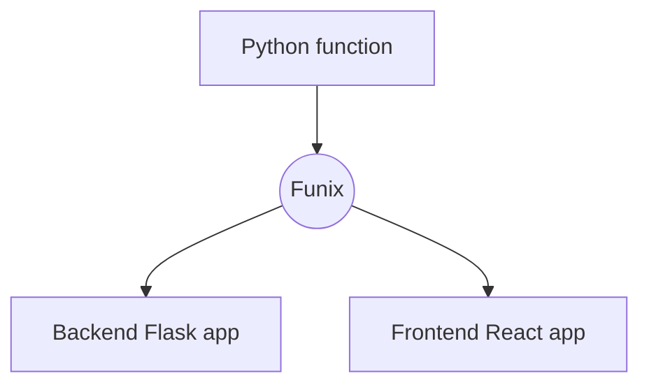
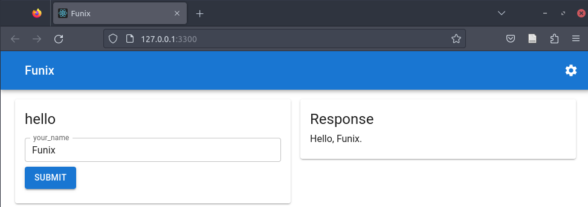

---
# Ensure that this title is the same as the one in `myst.yml`
title: Funix - vivifying (any) Python functions into GUI apps
abstract: |
  The raise of machine learning (ML) and artificial intelligence (AI), especially the generative AI (GenAI), has brought up the need for wrapping models or algorithms into GUI apps. For example, a large language model (LLM) can be access through a string-to-string GUI app with a textbox as the primary input.
  Most of existing solutions require developers to manually create widgets and link them to arguments/returns of a function individually. This low-level process is labrious and usually intrusive. Funix takes a CSS-like approach to this problem by automatically picking widgets based on the types of the arguments and returns of a function according to the type-to-widget mapping defined in a theme. For example, in Funix' default theme, the Python native types `str`, `bool`, and `Literal` are mapped into an input box, a checkbox, and a set of radio buttons in the MUI library. As a result, an existing Python function can be turned into a GUI app without any code change. Unlike existing solutions that bound the choice of widgets to those provided by them, as a transcompiler, Funix allows a developer to pick any component in the frontend world and customize it in JSON without any knowledge to Javascript/Typescript. Funix further uses the information in docstrings, which are common in Python development, to control the appearance of the GUI. 
---

## Introduction

Presenting a model or an algorithm as a GUI app is a common need in the scientific and engineering community. 
For example, a large language model (LLM) is not accessible to the general public until we wrap it with a chat interface, which consists of a text input and a text output. 
Because most scientists and engineers are not familiar with frontend development which is Javascript/Typescript-centric, there have been many solutions based on Python, one of the most popular programming language in scientific computing -- especially AI, such as ipywidgets,  [Streamlit](), Gradio, Reflex, Dash, and PyWebIO. 
Most of them follow the conventional GUI programming philosophy that a developer needs to manually pick widgets from a widget library and associate them with the arguments and returns of an underlying function, which is usually called the "call back function."

This approach has several drawbacks. **First**, it needs continuous manual work to align the GUI code with the callback function. If the signature of the callback function changes, the GUI code needs to be manually updated. In this sense, the developer is manually maintaining two sets of code that are highly overlapping. **Second**, the GUI configuration is low-level, at individual widgets. It is difficult to reuse the design choices and thus laborious to keep the appearance of the GUI consistent across apps. **Third**, the developer is bounded by the widgets provided by the GUI library. If there is an unsupported datatype, the developer most likely has to give up due to the lack of frotend development knowledge. **Fourth**, they do not leverage the features of the Python language itself to reduce the amount of additional work. For example, it is very common in Python development to use docstrings to annotate arguments of a function. However, most of the existing solutions still requires the developer to manually specify the labels of the widgets. **Last** but not least, all existing solutions require the developer to read their documentations before being able to say "hello, world!" 

[Funix](http://funix.io), which stands for "function/funny" + "*nix", takes a different approach. We notice that the choice of a widget has a weak correlation with the type of the function I/O it is associated with. For example, a checkbox is unsuitable for any type other than Boolean. Therefore, Funix takes a CSS-like approach that automatically picks the widgets based on the types of the arguments/returns of a function. The type-to-widget mapping is defined in a theme. For example, in the default theme of Funix, the Python native types `str`, `bool`, and `Literal`, respectively, are mapped into an input box, a checkbox, and a set of radio buttons in the MUI library, while the common scientific types `pandas.DataFrame` and `matplotlib.figure.Figure` are mapped to tables and charts. 

As a result, an existing Python function can be turned into a GUI app without any code change. The type-to-widget mapping makes it easy to keep the GUI appearance consistent across apps. Scientists and developers can focus on building the functions that best use their domain knowledge and leave the rest to Funix, and if any, the customized themes made by their UI teams. 
Although Funix uses themes to control the UI, customizations that cannot be done via types, e.g., rate limiting, can be done via a Funix decorator. 

In summary, Funix has the following distinctive features compared with many existing solutions:
1. Type-based GUI generation controlled by themes
2. Exposing the frontend world to Python developers

The rest of the paper is organized as follows: 


## Motivation

Funix is motivated by the following observations on app building in science and engineering, including the authors' very own machine learning research: 
1. a GUI app is a simple wrapper around a straightforwward input-output process -- thus not much interactivity is needed.
2. the app is not the goal but a necessary step to the goal -- thus it is not worthy to spend time on building the app.

Therefore, full-fledged frontend development is often overkilling here. As machine learning researchers ourselves, we found that the existing solutions are still too complicated for the 2nd reason above. Therefore, Funix is designed to, without any code modification nor document reading, fire up an app that is good enough for the user to interact with from an existing Python function that describes a simple input-output process. 

We'd like to argue that GenAI is transforming the GUI and apps will become more straightforward as natural languages are becoming a prominent interface between humans and computers. Consider text-to-image generation, the app only needs a string input and an image output. In this sense, there is not much customization or layout controls needed. 

We found that Funix can be really useful in building what we call "disposable apps" -- apps that are built for a specific purpose and are not meant to be maintained. For example, a researcher may want to quickly visualize the output of a model, or a data scientist may want to quickly check the distribution of a dataset.

## Hello, world!

Funix is a transcompiler. It transcompiles a Python function into both the backend and the frontend of a GUI app. For the backend, Funix wraps a Python function into a Flask app. For the frontend, Funix generates React code. 
Funix ensures that the backend only talks to the frontend and vice versa. 




Suppose you have a function saved in the file `hello.py` as follows: 

```python 
# hello.py
def hello(your_name: str) -> str:
    return f"Hello, {your_name}."
```

This function can be turned into a GUI app by passing the file path to the `funix` command line tool: 

```bash
funix hello.py
```

The app looks like this: 



Because Funix is designed for quickly firing up apps that model a straightforward input-output process, it has one input panel on the left and an output panel on the right. The underlying function will be called after the user plugs in the arguments and click the "Run" button. The result will be displayed in the output panel.

## Type-driven automatic GUI generation

Like CSS, the philosophy of Funix is to control the GUI appearance based on the types of arguments and returns of a function. 
Currently, Funix requires the type hints for every argument or return of a function. In the future, it will support type inference through tracing.


By default, Funix maps the following basic Python types to the following MUI components:

| Python type | MUI component |
|-------------|---------------|
| `str`       | TextField |
| `bool`      | Checkbox  |
| `int`       | TextField |
| `float`     | TextField |
| `Literal`   | RadioGroup if number of elements is below 5; MultiSelect otherwise|
| `range`     | Slider    |
| `List[Literal]`  | Yazawazi: What is the bubble select component here?  |

In particular, we leverage the semantics of `Literal` and `List[Literal]` for single-choice and multiple-choice selections. 

PUT AN EXAMPLE CODE AND SCREENSHOT HERE

Funix also has built-in support to common scientific types such as `pandas.DataFrame` and `matplotlib.figure.Figure`, which are mapped to tables and charts. For example, the function below

```python
import pandas, matplotlib.pyplot
from numpy import arange, log
from numpy.random import random

def table_and_plot(
   df: pandas.DataFrame = pandas.DataFrame({
       "a": arange(500) + random(500)/5,
       "b": random(500)-0.5 + log(arange(500)+1),
       "c": log(arange(500)+1) })
   ) -> matplotlib.figure.Figure:

   fig = matplotlib.pyplot.figure()
   matplotlib.pyplot.plot(df["a"], df["b"], 'b')
   matplotlib.pyplot.plot(df["a"], df["c"], 'r')

   return fig
```

becomes the app below:


where both the table and the chart are interactive. As far as we know, no other Python-based solutions supports editable tables as inputs. 

## Python as a surface language for frontend development

As a transcompiler, Funix exposes the frontend world to the Python developers. Theoretically, a Python developer can pick any component from any frontend library and bound it with a Python type. All this as done via JSON strings. Funix provides two ways: 
1. Via themes. 
2. On-the-fly. 

### Themes: CSS for Python app building

```python
from funix import new_funix_type

@new_funix_type(
   widget = {
       "widget": "@mui/material/TextField",
       "props": {
           "type": "password",
           "placeholder": "Enter a secret here."
       }
   }
)
class blackout(str):
   def print(self):
       return self + " is the message."

def hoho(x: blackout = "Funix Rocks!") -> str:
   return x.print()

```


### On-the-fly

```python
{
 "name": "test_theme",
 "widgets": {    
   "str": "inputbox",        // Funix' shorthand
   "int": "slider[0,100,2]", // Funix' shorthand
   "float": {
       "widget": "@mui/material/Slider", 
       // using MUI's widget
       // https://mui.com/material-ui/api/slider
       "props": { 
           // config props of the frontend widget
           "min": 0,
           "max": 100,
           "step": 0.1
       }
   }
 }
}
```

## Docstring-based GUI customization

## Multi-page app 

If multiple functions are defined in the file passed to the command `funix`, Funix will turn each of them into a separate page in the app. If a class is defined in the file, Funix will turn each of them in a page and all pages will share the `self` variable for easy and sessionized data passing. See [below](#multi-page-app) for more details.


## Showcases


## Funix: conveniently Pythonic

### Sessionized data passing

### print-to-the-web

### Native streaming 

## Misc. features 

## Future work 

## Acknowledgments
Funix is not the first to make use of variable types to automatically generate UIs. [Python Fire by Google](https://github.com/google/python-fire) is a Python library that automatically generates command line interfaces (CLIs) from Python functions. However, it is limited to CLIs and does not support GUIs. ipywidgets also has limited support to certain types. Funix supports way more types than ipywidgets does by introducing the concept of themes which allows users to further expand  the type support.