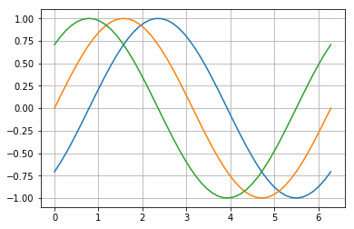

:author: Geoffrey M. Poore
:email: gpoore@uu.edu
:institution: Union University
:bibliography: poore


=======================================
Codebraid: Live Code in Pandoc Markdown
=======================================


.. class:: abstract

   Codebraid executes code blocks and inline code in Pandoc Markdown documents
   as part of the document build process.  Code can be executed with a
   built-in system or Jupyter kernels.  Either way, a single document can
   involve multiple programming languages, as well as multiple independent
   sessions or processes per language.  Because Codebraid only uses standard
   Pandoc Markdown syntax, Pandoc handles all Markdown parsing and format
   conversions.  In the final output document produced by Pandoc, a code chunk
   can be replaced by a display of any combination of its original Markdown
   source, its code, the stdout or stderr resulting from execution, or rich
   output in the case of Jupyter kernels.  There is also support for
   programmatically copying code or output to other parts of a document.


.. class:: keywords

   reproducibility, dynamic report generation, literate programming, Python,
   Pandoc, Project Jupyter

Introduction
============

Scientific and technical documents are increasingly written with
software that allows a mixture of text and executable code, such as the
Jupyter Notebook :cite:`Kluyver2016`, knitr :cite:`Xie2015`, and
Org-mode Babel :cite:`Schulte2011,Schulte2012`. Writing with such tools
can enhance reproducibility, simplify code documentation, and aid in
automating reports.

This paper introduces Codebraid, which allows executable code within
Pandoc Markdown documents :cite:`markdown,pandoc`. Codebraid is
developed at https://github.com/gpoore/codebraid and is available from
the Python Package Index (PyPI). It allows Markdown code blocks like the
one below to be executed during the document build process. In this
case, the “``.cb.run``” tells Codebraid to run the code and include the
output.

.. code:: text

   ```{.python .cb.run}
   print("Running code within *Markdown!*")
   ```

The final document contains the code’s output, interpreted as if it had
been entered directly in the original Markdown source:

   Running code within *Markdown!*

A document using Codebraid can be converted from Markdown into any of
the many formats supported by Pandoc, such as HTML, Microsoft Word,
LaTeX, and PDF. Codebraid delegates all Markdown parsing and format
conversions to Pandoc, so it does not introduce any special restrictions
on what is possible with a Pandoc Markdown document. This close
integration with Pandoc also means that Codebraid can be extended in the
future to work with additional document formats beyond Markdown.

Codebraid includes a built-in code execution system. It can also use
Jupyter kernels :cite:`Kluyver2016` to execute code. The first code
block that is executed with a given language can specify a kernel. In
the example below, the “``.cb.nb``” tells Codebraid to run the code and
provide a “notebook” display that shows both code and output, while
“``jupyter_kernel``” specifies a kernel.

.. code:: text

   ```{.python .cb.nb jupyter_kernel=python3}
   from sympy import *
   init_printing()
   x = Symbol('x')
   integral = Integral(E**(-x**2), (x, -oo, oo))
   display(integral)
   integral.doit()
   ```

Because a Jupyter kernel was used to run the code, the result includes
rich output in the form of rendered LaTeX math, just as it would in a
Jupyter notebook:

.. code:: python

   from sympy import *
   init_printing()
   x = Symbol('x')
   integral = Integral(E**(-x**2), (x, -oo, oo))
   display(integral)
   integral.doit()

.. math:: \int_{-\infty}^{\infty} e^{- x^{2}}\, dx

.. math:: \sqrt{\pi}

..

..

The next section provides an example of the document build process with
Codebraid. This is followed by an overview of Codebraid features and
capabilities. Finally, the `Comparison`_ considers Codebraid in the
context of knitr, Pweave, Org-mode Babel, and the Jupyter Notebook.

Building a simple Codebraid document
====================================

A simple Pandoc Markdown document that runs code with Codebraid is shown
below.

.. code:: text

   ```{.python .cb.run name=part1}
   var1 = "Hello from *Python!*"
   var2 = f"Here is some math:  $2^8={2**8}$."
   ```

   ```{.python .cb.run name=part2}
   print(var1)
   print(var2)
   ```

..

If this were a normal Pandoc document, converting it into a format such
as reStructuredText could be accomplished by running

::

   pandoc --from markdown --to rst file.md

Using Codebraid to execute code as part of the document conversion
process is simply a matter of replacing ``pandoc`` with
``codebraid pandoc``:

::

   codebraid pandoc --from markdown --to rst file.md

The ``codebraid`` executable is available from the Python Package Index
(PyPI); development is at https://github.com/gpoore/codebraid. By
default, code is executed with Codebraid’s built-in code execution
system. This can easily be swapped for a Jupyter kernel, as shown in the
`Introduction`_ and discussed in greater detail in `Jupyter kernels`_.

When this ``codebraid pandoc`` command is executed, the original
Markdown shown above is converted into Codebraid-processed Markdown:

.. code:: text

   Hello from *Python!*
   Here is some math:  $2^8=256$.

This processed Markdown is then converted into the final
reStructuredText, rendering as

   Hello from *Python!* Here is some math: :math:`2^8=256`.

..

By default, the output of code executed with ``cb.run`` is interpreted
as Markdown. It is possible to show the output verbatim instead, as
discussed later.

In this example, the code is simple enough that it could be executed
every time the document is built, but that will often not be the case.
By default, Codebraid caches all code output, and code is only
re-executed when it is modified. This can be changed by building with
the flag ``--no-cache``.

Pandoc code attribute syntax
============================

Pandoc Markdown defines an attribute syntax for inline code and code
blocks. Codebraid uses this to designate which code blocks should be
executed and provide options. Code attributes have the general form

::

   {#id .class1 .class2 key1=value1 key2=value2}

If code with these attributes were converted into HTML, ``#id`` becomes
an HTML id for the code, anything with the form ``.class`` specifies
classes, and space-separated key-value pairs provide additional
attributes. Although key-value pairs can be quoted with double quotation
marks, Pandoc allows most characters except the space and equals sign
unquoted. Other output formats such as LaTeX use attributes in a largely
equivalent manner.

Pandoc uses the first class to determine the language name for syntax
highlighting, hence the ``.python`` in the example in the last section.
Codebraid uses the second class to specify a command for processing the
code. All Codebraid commands are under a ``cb`` namespace to prevent
unintentional collisions with normal Pandoc attributes. In the example,
``cb.run`` indicates that code should be run, stdout should be included
and interpreted as Markdown, and stderr should be displayed in the event
of errors. If a Jupyter kernel were in use, rich output such as plots
would also be included. Finally, the ``name`` keyword is used to assign
a unique name to each piece of code. This allows the code to be
referenced elsewhere in a document to insert any combination of its
Markdown source, code, stdout, stderr, and rich output (for Jupyter
kernels).

Creating examples
=================

The example in `Building a simple Codebraid document`_ was actually
itself an example of using Codebraid. This paper was written in
Markdown, then converted to reStructuredText via Codebraid with Pandoc.
Finally, the reStructuredText was converted through LaTeX to PDF via
Docutils :cite:`docutils`. The two code blocks in the example were only
entered in the original Markdown source of this paper a single time, and
Codebraid only executed them a single time. However, with Codebraid’s
copy-paste capabilities, it was possible to display the code and output
at other locations in the document programmatically.

The rendered output of the two code blocks is shown at the very end of
the earlier section. This is where the code blocks were actually entered
in the original Markdown source of this paper, and where they were
executed.

Recall that both blocks were given names, ``part1`` and ``part2``. This
enables any combination of their Markdown source, code, stdout, and
stderr to be inserted elsewhere in the document. At the beginning of the
earlier section, the Markdown source for the blocks was shown. This was
accomplished via

.. code:: text

   ```{.cb.paste copy=part1+part2 show=copied_markup}
   ```

The ``cb.paste`` command inserts copied data from one or more code
chunks that are specified with the ``copy`` keyword. Meanwhile, the
``show`` keyword controls what is displayed. In this case, the Markdown
source of the copied code chunks was shown. Since the ``cb.paste``
command is copying content from elsewhere, it is used with an empty code
block. Alternatively, a single empty line or a single line containing an
underscore is allowed as a placeholder.

Toward the end of the earlier section, the verbatim output of the
Codebraid-processed Markdown was displayed. This was inserted in a
similar manner:

.. code:: text

   ```{.cb.paste copy=part1+part2 show=stdout:verbatim}
   ```

The default format of ``stdout`` is ``verbatim``, but this was specified
just to be explicit. The other option is ``raw`` (interpreted as
Markdown).

Of course, all Markdown shown in the current section was itself inserted
programmatically using ``cb.paste`` to copy from the earlier section.
However, to prevent infinite recursion, the next section is not devoted
to explaining how this was accomplished.

Other Codebraid commands
========================

The commands ``cb.run`` and ``cb.paste`` have already been introduced.
There are three additional commands.

The ``cb.code`` command simply displays code, like normal inline code or
a code block. It primarily exists so that normal code can be named, and
then accessed later. ``cb.paste`` could be used to insert the code
elsewhere, perhaps combined with code from other sources via something
like ``copy=code1+code2``. It would also be possible to run the code
elsewhere:

::

   ```{.cb.run copy=code1+code2}
   ```

When ``copy`` is used with ``cb.run``, or another command that executes
code, only code is copied, and everything proceeds as if this code had
been entered directly in the code block.

The ``cb.expr`` command only works with inline code, unlike other
commands. It evaluates an expression and then prints a string
representation, which is interpreted as Markdown. For example,

.. code:: text

   `2**128`{.python .cb.expr}

produces

   340282366920938463463374607431768211456

As this demonstrates, Pandoc code attributes for inline code immediately
follow the closing backtick(s). While this sort of a “postfix” notation
may not be ideal from some perspectives, it is the cost of maintaining
full compatibility with Pandoc Markdown syntax.

Finally, the ``cb.nb`` command runs code and provides a “notebook”
display. For inline code, ``cb.nb`` is like ``cb.expr`` except that it
displays rich output or verbatim text. For code blocks, ``cb.nb``
displays code followed by verbatim stdout. If there are errors, stderr
is also included automatically. When Codebraid is used with a Jupyter
kernel, rich outputs such as plots are included as well. This was
demonstrated in the `Introduction`_.

Display options
===============

There are two code chunk keywords that govern display, ``show`` and
``hide``. These can be used to override the default display settings for
each command.

``show`` takes any combination of the following options: ``markup``
(display Markdown source), ``code`` (display code being executed),
``stdout``, ``stderr``, and ``none``. There is also ``rich_output`` when
a Jupyter kernel is used to execute code. Multiple options can be
combined, such as ``show=code+stdout+stderr``. Code chunks using
``copy`` can employ ``copied_markup`` to display the Markdown source of
the copied code chunk. When the ``cb.expr`` command is used, the
expression output is available via ``expr``. Using ``show`` completely
overwrites the existing display settings.

The display format can also be specified with ``show``. For ``stdout``,
``stderr``, and ``expr``, there are three formats: ``raw`` (interpreted
as Markdown), ``verbatim``, or ``verbatim_or_empty`` (verbatim if there
is output, otherwise a space or empty line). For example,
``show=stdout:raw+stderr:verbatim``. While a format can be specified for
``markup`` and ``code``, only the default ``verbatim`` is permitted. For
``rich_output``, the output representation (MIME type) can be selected.
Thus, ``show=rich_output:png`` selects a PNG image representation.

``hide`` takes the same options as ``show``, except that ``none`` is
replaced by ``all`` and formats are not specified. Instead of overriding
existing settings like ``show``, ``hide`` removes the specified display
options from those that currently exist.

Codebraid code execution system
===============================

Codebraid currently provides two options for executing code: a built-in
code execution system which is used by default and Jupyter kernels.
Jupyter kernels are demonstrated in the next section. This section
describes the built-in system, which currently supports Python 3.5+,
Julia, Rust, R, Bash, and JavaScript. Any combination of these languages
can be used within a single document. While the built-in system
currently lacks Jupyter kernel features like rich output, it is nearly
identical to extracting the code from a document, concatenating it, and
executing it via the standard interpreter or compiler. As a result, it
has low overhead and produces the same output as would have been
generated by a separate source file.

Overview
--------

The code from each code chunk is inserted into a template before
execution. The template writes delimiters to stdout and stderr at the
beginning of each code chunk. These delimiters are based on a hash of
the code to avoid the potential for collisions. Once execution is
complete, Codebraid parses stdout and stderr and uses these delimiters
to associate output with individual code chunks. This system is a more
advanced variant of the one I created previously in PythonTeX
:cite:`Poore2015`.

By default, code must be divided into complete units. For example, a
code block must contain an entire loop, or an entire function
definition. (This restriction can be relaxed with the code-chunk keyword
``complete``; see `Incomplete units of code`_ later.) If a code chunk is
not complete (and this is not indicated), then the incomplete code will
interfere with writing the delimiters.

To address this, each individual delimiter is unique, and is tracked
individually by Codebraid. If incomplete code interferes with the
template to produce an error, Codebraid can use any existing stderr
delimiters plus parsing of stderr to find the source and generate an
appropriate error message. If the code does not produce an error, but
prevents a delimiter from being written or causes a delimiter to be
written multiple times or not at the beginning of a line, this will also
be detected and traced back. Under normal conditions, interfering with
the delimiters without detection requires conscious effort.

Adding languages
----------------

Adding support for additional languages is simply a matter of creating
the necessary templates and putting them in a configuration file. Basic
language support can require very little, essentially just code for
writing the delimiters to stdout and stderr. For example, Bash support
is based on this three-line template:

::

   printf "\n{stdout_delim}\n"
   printf "\n{stderr_delim}\n" >&2
   {code}

The Bash configuration file also specifies that the file extension
``.sh`` should be used, and provides another four lines of template code
to enable ``cb.expr``. So far, the longest configuration file, for Rust,
is less than fifty lines—counting empty lines.

Stderr
------

Because code is typically inserted into a template for execution, if
there are errors the line numbers will not correspond to those of the
code that was extracted from the document, but rather to those of the
code that was actually executed. Codebraid tracks line numbers during
template assembly, so that executed line numbers can be converted into
original line numbers. Then it parses stderr and corrects line numbers.
An example of an error produced with ``cb.nb`` with Python is shown
below. Notice that the line number displayed is correct.

.. code:: python

   var = 123
   print(var, flush=True)
   var += "a"

.. code:: text

   123

.. code:: text

   Traceback (most recent call last):
     File "source.py", line 3, in <module>
       var += "a"
   TypeError: unsupported operand type(s) for +=:
   'int' and 'str'

..

Since line numbers in errors and warnings correspond to those in the
code entered by the user, and since anything written to stderr is
displayed by default next to the code that caused it, debugging is
significantly simplified. In many cases, this even applies to compile
errors for a language like Rust.

Jupyter kernels
===============

Using a Jupyter kernel instead of the built-in code execution system is
as simple as adding ``jupyter_kernel=<name>`` to the first code chunk
for a language (or, as discussed later, to the first code chunk of a
named ``session``):

.. code:: text

   ```{.python .cb.run jupyter_kernel=python3}
   %matplotlib inline
   import numpy as np
   from matplotlib import pyplot as plt
   ```

   ```{.python .cb.run}
   x = np.linspace(0, 2*np.pi)
   for n in range(-1, 2):
       plt.plot(x, np.sin(x + n*np.pi/4))
   plt.grid()
   ```

Notice that ``jupyter_kernel`` was only needed (and only allowed) for
the first code chunk. The second code chunk is still using the same
language (``.python``), so it shares the same kernel. This Markdown
results in a plot, just as it would within a Jupyter notebook. Because
``cb.run`` was used rather than ``cb.nb``, code is not displayed and
only the plot is shown:

|image0|

The built-in code execution system allows multiple languages within a
single document. This is also possible when Jupyter kernels are used
instead. A single document can involve multiple kernels. Multiple
independent sessions for the same kernel type are also possible when
``jupyter_kernel`` is combined with ``session`` (described in the next
section). Of course, kernel features like IPython magics
:cite:`ipython-magics` are fully functional as well.

Advanced code execution
=======================

Ideally, executable code should be arranged within a document based on
what is best for the reader, rather than in a manner dictated by
limitations of the tooling. Several options are provided to maximize the
flexibility of code presentation.

Incomplete units of code
------------------------

By default, Codebraid requires that code be divided into complete units.
For example, a code block must contain an entire loop, or an entire
function definition. Codebraid’s built-in code execution system can
detect the presence of an incomplete unit of code because it interferes
with stdout and stderr processing, in which case Codebraid will raise an
error. Attempting to run an incomplete unit of code with a Jupyter
kernel will also result in an error.

The ``complete`` keyword allows incomplete units of code. While this
increases the flexibility of code layout, it also means that any output
will not be shown until the next complete code chunk.

The Markdown for a somewhat contrived example that demonstrates these
capabilities is shown below, along with its output. While this example
uses Codebraid’s code execution system, exactly the same result is
obtained by using a Jupyter kernel.

.. code:: text

   ```{.python .cb.run complete=false}
   for n in range(11):
       if n % 2 == 0:
   ```

   ```{.python .cb.run}
           if n < 10:
               print(f"{n}, ", end="")
           else:
               print(f"{n}")
   ```

..

   0, 2, 4, 6, 8, 10

..

Sessions
--------

By default, all code for a language is executed within a single default
session, so variables and data are shared between code chunks. It can be
convenient to separate code into multiple sessions when several
independent tasks are being performed, or when a long calculation is
required but the output can easily be saved and loaded by separate code
for visualization or other processing. The ``session`` keyword makes
this possible. Session names are restricted to valid Python identifiers.
For example,

.. code:: text

   ```{.python .cb.run session=long}
   import json
   result = sum(range(100_000_000))
   with open("result.json", "w") as f:
       json.dump({"result": result}, f)
   ```

Sessions work with both Codebraid’s built-in code execution system and
Jupyter kernels. For example, it is possible to have multiple
independent sessions with a ``python3`` kernel within a single document.

All sessions are currently executed in serial. In the future, support
for parallel execution may be added.

Outside ``main()``
------------------

Codebraid’s built-in code execution system runs code by inserting it
into a template. The template allows stdout and stderr to be broken into
pieces and correctly associated with the code chunks that created them.
For a language like Python under typical usage, ``complete`` eliminates
the few limitations of this approach. However, the situation for a
compiled language with a ``main()`` function is more complex.

Codebraid includes support for Rust. By default, code is inserted into a
template that defines a ``main()`` function. Thus, a code block like

.. code:: text

   ```{.rust .cb.run}
   let x = "Greetings from *Rust!*";
   println!("{}", x);
   ```

can run to produce

   Greetings from *Rust!*

..

In some situations, it would be convenient to completely control the
definition of the ``main()`` function and add code outside of
``main()``. The ``outside_main`` keyword makes this possible. All code
chunks with ``outside_main=true`` at the beginning of a session are used
to overwrite the beginning of the ``main()`` template (everything before
``main()``), while any chunks with ``outside_main=true`` at the end of
the session are used to overwrite the end of the ``main()`` template
(everything after ``main()``). If all code chunks have
``outside_main=true``, then all of Codebraid’s templates are completely
omitted, and all output is associated with the final code chunk. The
example below demonstrates this option.

.. code:: text

   ```{.rust .cb.run outside_main=true}
   fn main() {
       use std::fmt::Write as FmtWrite;
       use std::io::Write as IoWrite;
       let x = "Rust says hello.  Again!";
       println!("{}", x);
   }
   ```

..

   Rust says hello. Again!

..

Working with external files
===========================

Though Codebraid is focused on embedding executable code within a
document, there will be times when it is useful to interact with
external source files. Since Codebraid’s built-in code execution system
processes code with a programming language’s standard interpreter or
compiler, normal module systems are fully compatible; for example, in
Python, ``import`` works normally. Of course, this is also true when
working with Jupyter kernels. Codebraid provides additional ways to work
with external files via the ``include_file`` option.

When ``include_file`` is used with the ``cb.code`` command, an external
source file is simply included and displayed. It is possible to include
only certain line ranges using the additional option ``include_lines``,
or only part of a file that matches a regular expression via
``include_regex``. For example,

.. code:: text

   ```{.markdown .cb.code include_file=poore.txt
   include_regex="# Working.*?,"}
   ```

includes the original Markdown source for this paper, and then uses a
regular expression to display only the first few lines of this current
section on working with external files:

.. code:: text

   # Working with external files

   Though Codebraid is focused on embedding executable
   code within a document,

Since the ``cb.code`` command is including content from elsewhere, it is
used with an empty code block. Alternatively, a single empty line or a
single line containing an underscore is allowed as a placeholder.

This example included part of a file using a single regular expression.
There are also options for including everything starting with or
starting after a literal string or regular expression, and for including
everything before or through a literal string or regular expression.

The ``include_file`` option works with commands that execute code as
well. For instance,

::

   ```{.python .cb.run include_file=code.py}
   ```

would read in the contents of an external file “code.py” and then run it
in the default Python session, just as if it had been entered directly
within the Markdown file.


.. _Comparison:

Comparison
==========

To put Codebraid in context, this section provides a comparison with knitr,
Pweave, Org-mode Babel, and the Jupyter Notebook.  The comparison focuses on
the default features of each program.  Extensions for these programs and
additional programs with similar features are summarized in the Appendix_.


knitr
-----

.. https://leisch.userweb.mwn.de/Sweave/
.. https://rstudio.github.io/reticulate/index.html
.. https://cran.r-project.org/web/packages/JuliaCall/index.html
.. https://rmarkdown.rstudio.com/lesson-2.html

knitr :cite:`Xie2015` provides powerful R evaluation in Markdown, LaTeX, HTML,
and other formats.  It was inspired by Sweave :cite:`Leisch2002`, which allows
R in LaTeX.  The reticulate :cite:`reticulate` and JuliaCall :cite:`juliacall`
packages for R have given knitr significant Python and Julia capabilities as
well, including the ability to convert objects between languages.  knitr is
commonly used with the RStudio IDE, which provides a two-panel
source-and-output preview interface as well as a notebook-style mode with
inline display of results.

.. https://bookdown.org/yihui/rmarkdown/language-engines.html

While knitr provides superior support for R, Codebraid focuses on providing
more capabilities for other languages.  knitr runs all R, Python, and Julia
code in language-specific sessions, so data and variables are shared between
code chunks.  For all other languages, each code chunk is run in a separate
process and there is no such continuity.  Codebraid's built-in code execution
system is designed to allow any language to share a session between multiple
code chunks, and Jupyter kernels provide equivalent capabilities.  R, Python,
and Julia are limited to a single shared session each with knitr.  Codebraid
allows multiple sessions for all supported languages.  This allows independent
computations to be divided into separate sessions and only re-executed when
necessary.

Once code is executed, Codebraid and knitr provide similar basic features for
displaying the code and its output.  knitr has more advanced options for
formatting output, such as customizing plot appearance, converting plots into
figures with captions, or combining plots into an animation.

.. https://github.com/rstudio/rmarkdown/issues/974
.. https://github.com/yihui/knitr/issues/1363
.. https://rviews.rstudio.com/2017/12/04/how-to-show-r-inline-code-blocks-in-r-markdown/
.. https://yihui.name/knitr/faq/

The two programs take different approaches to extracting code from Markdown
documents.  knitr uses the custom R Markdown :cite:`rmarkdown` syntax to
designate code that should be executed.  It extracts inline code and code
blocks from the original Markdown source using a preprocessor, then inserts
the code's output into a copy of the document that can subsequently be
processed with Pandoc.  Because the preprocessor is based on simple regex
matching, it does not understand Markdown comments and will run code in a
commented-out part of a document.  Writing tutorials that show literal knitr
code chunks can involve inserting empty strings, zero-width spaces,
line breaks, or Unicode escapes to avoid the preprocessor's tendency to execute
code :cite:`knitrfaq,Hovorka`.  With Codebraid, Pandoc is used to convert a
Markdown document into Pandoc's abstract syntax tree (AST) representation.
Code extraction and output insertion are performed as operations on the AST,
and then Pandoc converts the modified AST into the final output document.
This has the advantage that Pandoc handles all parsing and conversion, at
the cost of running Pandoc multiple times.


Pweave
------

Pweave :cite:`pweave` is inspired by Sweave :cite:`Leisch2002` and knitr
:cite:`Xie2015`, with a focus on Python in Markdown and other formats like
LaTeX and reStructuredText.  Pweave uses a custom Markdown syntax similar to
knitr's for designating code blocks that should be executed, with many similar
features and options.  It also extracts code from Markdown documents with a
simple preprocessor.  Code is executed with a single Jupyter kernel.  Any
kernel can be used; the default is ``python3``.  Rich output like plots can be
included automatically.

Like knitr, Pweave provides some more advanced options for display formatting
that Codebraid lacks, primarily related to figures.  Codebraid has advantages
in three areas.  Code execution is more flexible since it allows multiple
Jupyter kernels per document and multiple independent sessions per kernel, in
addition to the built-in code execution system.  Since Codebraid uses Pandoc
for all Markdown parsing, it avoids the limitations of a preprocessor.
Codebraid also provides a broader set of display capabilities, including the
ability to programmatically copy and display code or its output into other
parts of a document.


Org-mode Babel
--------------

.. https://orgmode.org/worg/org-contrib/babel/
.. https://orgmode.org/worg/org-contrib/babel/languages.html
.. https://orgmode.org/worg/org-contrib/babel/languages/
.. https://orgmode.org/manual/Specific-header-arguments.htm
.. https://orgmode.org/manual/session.html
.. https://orgmode.org/manual/file.html#file
.. https://orgmode.org/worg/org-contrib/babel/languages/ob-doc-gnuplot.html

Babel :cite:`Schulte2011,Schulte2012` allows code blocks and inline code in
Emacs Org-mode documents to be executed.  Any number of languages can be used
within a single document.  By default, each code chunk is executed
individually in its own process.  For many interpreted languages, it is also
possible to run code in a session so that data and variables persist between
code chunks.  In those cases, multiple sessions per language are possible.
Any combination of code and its stdout can be displayed.  Stdout can be shown
verbatim or interpreted as Org-mode, HTML, or LaTeX markup.  For some
languages, such as gnuplot, graphical output can also be captured and included
automatically.

.. https://orgmode.org/worg/org-contrib/babel/intro.html#literate-programming

Babel can function as a meta-programming language for Org mode.  A code chunk
can be named, and then a later code chunk—potentially in a different
language—can access its output by name and perform further processing.
Similarly, there are literate programming capabilities that allow a code chunk
to copy the source of one or more named chunks into itself, essentially
serving as a template, before execution.

Codebraid is like a Markdown-based Babel with additional code execution
capabilities but without some of the meta-programming and literate programming
options.  Codebraid allows sessions for all languages, not just for some
interpreted languages.  It provides broad support for rich output like plots
through Jupyter kernels.  Stderr can also be displayed.  While Codebraid
currently lacks a system for passing output between code chunks, it does
provide some literate-programming style capabilities for code reuse.


Jupyter Notebook
----------------

The Jupyter (formerly IPython) Notebook :cite:`Kluyver2016` provides a
browser-based user interface in which a document is represented as a series of
cells.  A cell may contain Markdown (which is converted into HTML and
displayed when not being edited), raw text, or code.  Code is executed by
language-specific backends, or kernels.  Well over one hundred kernels are
available beyond Python, including Julia, R, Bash, and even compiled languages
like C++ and Rust :cite:`jupyter-kernels`.  Jupyter kernels are often used
with the Jupyter Notebook, but they can also function as a standalone code
execution system.

A Jupyter Notebook can only have a single kernel, and thus only a single
primary programming language with a single session or process.  This means
that dividing independent computations into separate sessions or processes is
typically not as straightforward as it might be in Org-mode Babel or
Codebraid.  However, the interactive nature of the notebook often reduces the
impact of this limitation, and can actually be a significant advantage.  Code
cells can be run one at a time; a single code cell can be modified and run
again without re-executing any previous code cells.

Some kernels include support for interacting with additional languages.  The
IPython kernel :cite:`ipython` has ``%%script`` and similar “magics”
:cite:`ipython-magics` that allow single cells to be executed in a subprocess
by another language.  PyJulia :cite:`PyJulia` and rpy2 :cite:`RPy2` provide
more advanced magics that allow an IPython kernel to interact with a single
Julia or R session over a series of cells (see :cite:`Bussonnier2018` for
examples).

While Codebraid lacks the Jupyter Notebook's interactivity, it does have
several capabilities not present in the default Notebook.  A Codebraid
document can involve multiple Jupyter kernels, as well as multiple independent
sessions per kernel.  It can execute both code blocks and inline code; the
Jupyter Notebook is limited to executing code in code cells.  Code layout is
more flexible with Codebraid because a code chunk can contain an incomplete
unit of code, such as part of a loop or part of a function definition.  This
is possible even when working with Jupyter kernels.  Codebraid also provides
more flexible display options.  It is possible to show any combination of
code, stdout, stderr, or rich output in any order, and to select which form of
rich output (MIME type) is shown.  Code or its output can be copied
programmatically, so code can be executed at one location in a document and
its output displayed elsewhere.


Conclusion
==========

Codebraid provides a unique and powerful combination of features for executing
code embedded in Pandoc Markdown documents.

* Both code blocks and inline code can be executed.

* Code blocks are not required to contain complete units of code, like a
  complete loop or function definition.

* A single document can use multiple languages and multiple independent
  sessions per language.  Any language can share a session between multiple
  code chunks.  Independent computations can be divided into separate sessions
  and only re-executed when necessary.

* Code can be executed with the built-in system, or with Jupyter
  kernels which provide rich output such as plots.

* A code chunk can display any combination of its Markdown source, code,
  stdout, stderr, and rich output.

* It is easy to reuse code and its output programmatically with the paste
  functionality. It is also possible to include all or part of an external source file for display or execution.

* Because only standard Pandoc Markdown syntax is used, all Markdown
  parsing and document conversion can be delegated to Pandoc, and there are
  no issues with preprocessors that do not fully support Markdown syntax.

There are several logical avenues for further development.  One of the
original motivations for creating Codebraid was to build on my previous work
with PythonTeX :cite:`Poore2015` to create a program that could
be used with multiple markup languages.  While Codebraid has focused thus far
on Pandoc Markdown, little of it is actually Markdown-specific.  It should be
possible to work with other markup languages supported by Pandoc, such as
LaTeX; all that is required is that Pandoc parses key-value attributes for
some variant of a code block.  Pandoc has recently added Jupyter notebooks to
its extensive list of supported formats.  Perhaps at some point it will be
possible to convert a Codebraid document into a Jupyter notebook, perform some
exploratory programming for a single session of a single language, and then
convert back to Markdown.

Codebraid's caching system could also be improved in the future.  Currently,
caching is based only on the code that is executed.  Adding a way to specify
external dependencies such as data files would be beneficial.


.. raw:: latex

   \begin{center}
   \rule[-.3\baselineskip]{0.5\linewidth}{0.4pt}
   \end{center}

.. _Appendix:

|appendix_small_caps|
=====================

.. |appendix_small_caps| raw:: latex

   \sc{\textbf{\textsf{Appendix}}}

The Comparison_ focuses on the default features of knitr, Pweave, Org-mode
Babel, and the Jupyter Notebook.  This appendix summarizes extensions for
these programs and additional programs with similar features.


knitr extensions
----------------

Though knitr does not include any support for Jupyter kernels, the knitron
:cite:`knitron` and ipython_from_R :cite:`ipython-from-R` packages have
demonstrated that this is technically feasible.


Software similar to Pweave
--------------------------

The Comparison_ includes Pweave :cite:`pweave` because it is one of the
most capable knitr-like systems for other languages.  There are several other
similar programs.

.. http://weavejl.mpastell.com/stable/

Weave.jl :cite:`weavejl-joss`, by the creator of Pweave, provides similar
features for executing Julia code.  It uses Julia to manage code execution
rather than a Jupyter kernel.

.. https://github.com/jankatins/knitpy
.. https://github.com/pystitch/stitch

knitpy :cite:`knitpy` describes itself as a port of knitr to Python.  It uses
knitr-style Markdown syntax, and provides code-block options to control basic
code and output display.  Other knitr-style options are not supported.  Code
is executed in a single Jupyter IPython kernel.  stitch :cite:`stitch` is
similar, drawing inspiration from knitr and knitpy.  Compared to knitpy, it
lacks options for customizing output display but has options for customizing
figure display.

.. https://github.com/jhrmnn/knitj

Knitj :cite:`knitj` is another Jupyter kernel–Markdown integration.  Options
for controlling display are contained in special comments in the first line of
code within a code block, rather than in the code block's Markdown attributes.
It focuses on producing HTML and includes efficient live preview capabilities.


.. https://github.com/matthew-brett/nb2plots

There are also some comparable tools for reStructuredText.  nb2plots can
convert an ipynb notebook file into reStructuredText for Sphinx
:cite:`nb2plots`.  When Sphinx builds the document, the code is still executed
and plots are automatically included, so the live code and rich output of the
notebook are not lost.  It is possible to customize display by hiding code.
The reStructuredText can also be converted to a Python source file or ipynb
when that is desired.

.. https://jupyter-sphinx.readthedocs.io/en/latest/

The Jupyter Sphinx Extension :cite:`jupyter-sphinx` provides a
``jupyter-execute`` directive for running code in a Jupyter kernel.  By
default, code is executed within a single kernel, providing continuity.  It is
also possible to switch to a different kernel or switch to a different session
using the same kernel type.  Code and output (including rich output like
plots) are displayed by default, but there are options for hiding code or
output, or reversing their order.  All code for a given Jupyter session can be
converted into a script or a Jupyter notebook.


Org-mode Babel extensions
-------------------------

Packages like ob-ipython :cite:`ob-ipython` and emacs-jupyter
:cite:`emacs-jupyter` allow Jupyter kernels :cite:`Kluyver2016` instead of
Babel's built-in code execution system.  These add the capability to display
error messages or rich output like graphics.  The Emacs IPython Notebook
:cite:`ein` takes a different approach by providing a complete Jupyter
Notebook client in Emacs.


Jupyter Notebook extensions and related software
------------------------------------------------

Some more general approaches to working around the limitation of one kernel
per notebook are provided by the BeakerX polyglot magics :cite:`BeakerX`,
which support bidirectional autotranslation of data between languages, and the
Script of Scripts (SoS) kernel :cite:`SoS`, which acts as a managing kernel
over multiple normal kernels.

It is possible to execute inline code within Markdown cells with the Python
Markdown extension :cite:`jupyter:pymarkdown`.  This treats Markdown cells as
``{{expression}}``-style templates so long as inline code is outside LaTeX
equations.  The extension also supports notebook export to other document
formats with nbconvert :cite:`nbconvert` via a bundled preprocessor.

.. https://nbconvert.readthedocs.io/en/latest/config_options.html
.. https://jupyter.org/jupyter-book/features/hiding.html
.. https://nbconvert.readthedocs.io/en/latest/customizing.html

The Comparison_ does not consider hiding code or output in documents derived
from Jupyter notebooks because this is possible with nbconvert
:cite:`nbconvert` as well as extensions and other programs.  Hiding code or
output in exported documents is possible on a notebook-wide basis by
configuring nbconvert with the ``TemplateExporter`` exclude options.  It is
also possible at the individual cell level by adding a tag to a cell (View,
Cell Toolbar, Tags, then “Add tag”) and then configuring nbconvert to use the
desired ``TagRemovePreprocessor`` with a given tag.  An alternative is to use
extensions with their provided preprocessors or templates
:cite:`jupyter:codefolding,jupyter:hideinput`, or employ a more comprehensive
tool like Jupyter Book :cite:`JupyterBook` that defines a set of tags for
display customization.

The Comparison_ does not cover the Jupyter Notebook's JSON-based ipynb file
format because there are multiple ways to work around its limitations.  There
are special diffing tools for ipynb files such as nbdime :cite:`nbdime`.  It
is also possible to save notebooks as Markdown files instead, or convert them
to source code with Markdown in comments:

* Jupytext :cite:`jupytext-intro,jupytext` can convert Jupyter notebooks into
  Markdown or R Markdown (knitr), or into scripts in which code cells are
  converted into code while Markdown cells are converted into intervening
  comments.  These formats can also be converted into Jupyter notebooks.

* notedown :cite:`notedown` can convert between Markdown and ipynb, and can
  also work with R Markdown documents.

* Pandoc :cite:`pandoc` can convert to or from ipynb files.  Notebooks,
  including cells along with their attributes, can be represented as standard
  Pandoc Markdown.  podoc :cite:`podoc` is an earlier program for converting
  between ipynb and Pandoc's AST.  It builds on the prior ipymd :cite:`ipymd`.

* The Hydrogen package :cite:`hydrogen` for the Atom text editor provides
  conversion between ipynb and source code plus comments.  When such a source
  file is edited, Hydrogen can connect to a Jupyter kernel to display rich
  output inline within the editor.  Similar  capabilities are provided by the
  Python extension for VS Code :cite:`python-vscode`.

Of the programs listed above, Jupytext, notedown, and podoc provide
``ContentsManager`` subclasses for the Jupyter Notebook that allow it to
seamlessly use Markdown as a storage format.



