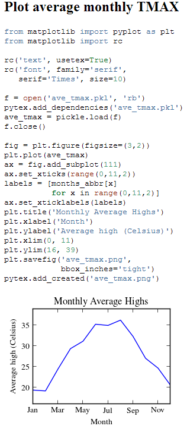

:author: Geoffrey M. Poore
:email: gpoore@uu.edu
:institution: Union University

------------------------------------------------
Reproducible Documents with PythonTeX
------------------------------------------------

.. class:: abstract

   PythonTeX is a LaTeX package that allows Python code in a LaTeX 
   document to be executed.  This makes possible reproducible documents that
   combine analysis with the code required to perform it. 
   Writing such documents can be more efficient because code is adjacent to 
   its output.  Writing is also less error-prone since results may be accessed
   directly from within the document, without copy-and-pasting.  This paper
   provides an overview of PythonTeX, including Python output caching, 
   dependency tracking, synchronization of errors and warnings with the LaTeX
   document, conversion of documents to other formats, and support for 
   languages beyond Python.  These features are illustrated through an
   extended, step-by-step example of reproducible analysis performed with 
   PythonTeX.

.. class:: keywords

   reproducible science, reproducible documents, dynamic report 
   generation

Introduction
------------

The concept of "reproducible documents" is not new—indeed, there are at least 
two definitions, each with its own history.

According to one definition, a reproducible document is a document whose 
results may be conveniently reproduced via a makefile or a similar approach 
[Schwab]_.  Systems such as Madagascar [Mad]_ and VisTrails [Vis]_ represent
a more recent and sophisticated version of this idea.  The actual writing 
process for this type of document closely resembles the unreproducible case,
except that the author must create the makefile (or equivalent), and thus
it is easier to ensure that figures and other results are current.

According to another definition, a reproducible document is a document 
in which analysis code is embedded. The document itself both generates 
and reports results, using external data. This approach is common among 
users of the R language. Sweave has allowed R to be embedded in LaTeX 
since 2002 [Leisch]_. The knitr package provides similar but more 
powerful functionality, and has become increasingly popular since its 
release in 2011 [Xie]_. This approach to reproducible documents has 
roots in literate programming, through noweb [Ramsey]_ ultimately back 
to Knuth's original concept [Knuth]_. The writing process for such a 
document can be significantly different from the unreproducible case, 
since code and document are present in the same file and may be tightly 
integrated. For example, it is possible to create dynamic reports with 
Sweave and knitr that automatically accomodate whatever data is 
provided. 

These two definitions of a reproducible document need not be mutually 
exclusive. They might be thought of as two ends of a continuum, with a 
given project potentially benefiting from some combination. The 
makefile-style approach may be more appropriate for large codebases and 
complex computations, but even then, it can be convenient to embed 
plotting code in reports. Likewise, even a relatively simple analysis 
might benefit from externalizing some code and managing it via the 
makefile-style approach, rather than embedding everything. 

This paper is primarily concerned with the second type of reproducible 
document, in which code is embedded.  In the Python ecosystem, there are 
several options for creating such documents.  The IPython notebook provides 
a highly interactive interface in which code, results, and text may be 
combined [IPY]_.  Reproducible documents may be created with Sphinx 
[Brandl]_, though the extent to which this is possible strongly depends on 
the extensions employed.  Pweave is essentially Sweave for Python, with 
support for reST, Sphinx, and markdown in addition to LaTeX
[Pastell]_.  There have also been LaTeX packages that allow Python 
code to be included in LaTeX documents:  
``python.sty`` [Ehmsen]_, SageTeX [Drake]_, and SympyTeX [Molteno]_.
PythonTeX is the most recent of these packages.

The LaTeX-based approach has some drawbacks.  It is less interactive than 
the IPython notebook.  And it can be less convenient than a non-LaTeX
system for converting documents to formats such as HTML.  At the same time,
a LaTeX package has several significant advantages.  Since the user 
directly creates a valid LaTeX document, the full power of LaTeX is 
immediately accessible.  A LaTeX package can also provide superior 
LaTeX integration compared to other approaches that do support LaTeX but are
not integrated at the package level.  For example, PythonTeX makes it 
possible to create LaTeX macros that contain Python code.

The PythonTeX package builds on previous LaTeX packages, emphasizing 
performance and usability. Python code may be divided into user-defined 
sessions, which automatically run in parallel via the 
``multiprocessing`` module [MULT]_. All code output is cached and the 
user has fine-grained control over when code will be re-executed, 
including the option to track document dependencies. This allows a 
PythonTeX document to be compiled just as quickly as a normal LaTeX 
document so long as no Python code is modified. Python errors and 
warnings are synchronized with the document's line numbering, so that 
their source is easily located. PythonTeX documents may be easily 
converted to plain LaTeX documents suitable for journal submission or 
format conversion. While PythonTeX's focus is on Python, the package may 
extended to support additional languages. 

PythonTeX overview
------------------

Using the PythonTeX package is as simple as adding the command

.. code-block:: latex

    \usepackage{pythontex}

to the preamble of a LaTeX document and slightly modifying the way you
compile the document. When a document using the PythonTeX package is
first compiled, all of the Python code contained in the document is saved
to an auxiliary file (with delimiters). To execute the Python code,
you simply run the provided script ``pythontex.py`` with the document name as 
an argument. In a standard PythonTeX installation, a symlink or launching 
wrapper for this script is created in your TeX installation's ``bin/`` 
directory, so that the script will be on your PATH. The next time you 
compile the document, all Python-generated content will be included. 

PythonTeX is compatible with all standard LaTeX engines (executable binaries):  
pdfTeX, XeTeX, and LuaTeX.  It has been tested with TeX Live [TL]_ and 
MiKTeX [MIK]_, and should work with other distributions.

Commands and environments
=========================

PythonTeX provides a number of commands and environments. These can be
used to run any valid Python code; even imports from ``__future__`` are
allowed, so long as they occur before any other code.

The **code** environment runs whatever code is provided. By default, any
printed content is automatically included in the document. For example,

.. code-block:: python

    \begin{pycode}
    my_string = 'A string from Python!'
    print(my_string)
    \end{pycode}

creates

    A string from Python!

The **block** environment also executes its contents. In this case, the
code is typeset with highlighting from Pygments [Pyg]_. Printed content
is not automatically included, but may be brought in via the
``\printpythontex`` command. For example,

.. code-block:: python

    \begin{pyblock}
    print(my_string)
    \end{pyblock}
    \begin{quotation}
    \printpythontex
    \end{quotation}

typesets

.. code-block:: python

    print(my_string)

..
    
    A string from Python!

All commands and environments take an optional argument that specifies
the session in which the code is executed. If a session is not
specified, code is executed in a default session. In the case above, the
variable ``my_string`` was available to be printed in the block
environment because the block environment shares the same default
session as the code environment.

Inline versions of the code and block environments are provided as the
commands ``\pyc`` and ``\pyb``. A special command ``\py`` is provided
that returns a string representation of its argument. For example,
``\py{2**8}`` yields ``256``.

PythonTeX also provides a **verbatim** command ``\pyv`` and environment 
``pyverbatim``.  These simply typeset highlighted code; nothing is executed.
Descriptions of additional commands and environments are available in the
documentation.

Caching
=======

All Python output is cached.  PythonTeX also tracks the exit status of each
session, including the number of errors and warnings produced (it parses
``stderr``).  By default, code is only re-executed by ``pythontex.py`` when 
it has been modified or when it produced errors on the last run.

That approach is most efficient for many cases, but sometimes the user may 
need finer-grained control over code executation. This is provided via the
package option ``rerun``, which accepts five values:

-  ``never``: Code is never executed; only syntax highlighting is
   performed.

-  ``modified``: Only modified code is executed.

-  ``errors``: Only modified code or code that produced errors on the
   last run is executed.

-  ``warnings``: Code is executed if it was modified or if it produced
   errors or warnings previously.

-  ``always``: Code is always executed.

Tracking dependencies and created files
=======================================

Code may need to be re-executed not just based on its own modification
or exit status, but also based on external dependencies.

PythonTeX provides a utilities class. An instance of this class 
called ``pytex`` is automatically created in each session. The utilities 
class provides an ``add_dependencies()`` method that allows dependencies 
to be specified and tracked.  Whenever PythonTeX runs, all dependencies 
are checked for modification, and all code with changed dependencies is
re-executed (unless ``rerun=never``). By default, modification is detected 
via modification time (``os.path.getmtime()``) [OSPATH]_, since this is 
fast even for large data sets. File hashing may be used instead via the 
package option ``hashdependencies``.

The PythonTeX utilities class also provides an ``add_created()`` method.
This allows created files to be deleted automatically when the code that 
created them is re-executed, preventing unused files from accumulating. For
example, if a figure is saved under one name, and later the name is changed, 
the old version would be deleted automatically if it were tracked.

When there are only a few dependencies or created files, it may be simplest 
to specify them manually.  For example, the line

::

    pytex.add_dependencies('data.txt')

could be added after ``data.txt`` is loaded.  In cases where the manual 
approach is tedious, the entire tracking process may be automated.  A custom
version of ``open()`` could be defined in which each file opened is tracked 
based on whether it is opened for reading (dependency) or writing (created).

Synchronizing exceptions
========================

When ``pythontex.py`` runs, it prints an annotated version of the ``stderr``
produced by user code.  Before each error or warning, a message is inserted
that specifies the corresponding line number in the document.  For example,
if the code environment

.. code-block:: python

   \begin{pycode}
   s = 'Python
   \end{pycode}

were on line 20 of a document, then when PythonTeX runs, it would return 
a message in the form

::

   * PythonTeX exception: error on line 20
       File "<scriptname>", line 46
         s = 'Python
                   ^
     SyntaxError: EOL while scanning string literal

where ``<scriptname>`` is the name of the temporary script that was 
executed.  This greatly simplifies debugging.

PythonTeX provides a sophisticated system that parses ``stderr`` and 
synchronizes line numbers in errors and warnings with the document's 
line numbering. As PythonTeX assembles the code to be executed, it 
creates a record of where each chunk of code originated in the document. 
The actual scripts that are executed are assembled by inserting user code
into predefined templates that 
provide access to the PythonTeX utilities class and additional 
functionality. This means that the line numbers of the code that is 
actually executed differ not only from the document's line numbering, 
but also from the user code's numbering. In the example above, the error 
occurred on line 20 of the document, on line 46 of the code that was 
actually executed, and on line 1 of the user code. PythonTeX keeps a 
running tally of how many lines originated in user code versus 
templates, so that the correct line number in the document may be 
calculated. 

In some cases, errors or warnings may only reference a line number in the 
file in which they occur.  For example, if ``warnings.warn()`` is used in 
an imported module [WAR]_, a line number in the module will be referenced, 
but a line number in the code that imported the module will not.  The 
previous approach to synchronization fails.  To deal with this 
scenario, PythonTeX writes delimiters to ``stderr`` before each command and 
environment.  This allows messages that do not reference a line number in
the user's code to be tracked back to a single command or environment 
in the document.

Converting PythonTeX documents
==============================

One disadvantage of a reproducible document created with PythonTeX is that it
mixes plain LaTeX with Python code. Many publishers will not accept
documents that require specialized packages. In addition, some format 
converters for LaTeX documents only support a subset of LaTeX 
commands—so PythonTeX support is not an option.

To address these issues, PythonTeX includes a ``depythontex`` utility.
It creates a version of a document in which all Python code has been
replaced by its output.  There is no way to tell that the converted document 
ever used PythonTeX.  Typically, the converted document is a perfect copy 
of the original, though occasionally spacing may be slightly different 
based on the user's choice of ``depythontex`` options.  A few features are
especially noteworthy.

* Any Python-generated figures that were included in the original document
  will be included in the converted document; the converted document still
  checks the same paths for figures.  It is possible to configure
  PythonTeX so that figures created by matplotlib [MPL]_ and other plotting 
  libraries are automatically included in the document, without the user
  needing to enter an ``\includegraphics`` command.  (Additional details are
  provided in the documentation.)  Even in these cases, figures are correctly
  included in the converted document.
* Any code highlighted by PythonTeX in the original version can also be
  highlighted in the ``depythontex`` version.  Highlighted code can be 
  converted into the format of the ``listings`` [LST]_, ``minted`` [MINT]_, 
  or ``fancyvrb`` [FV]_ packages for LaTeX.  Line numbering and syntax 
  highlighting are preserved if the target package supports them.

When Python is not enough
=========================

While PythonTeX is focused on providing Python-LaTeX integration, most
of the LaTeX interface is language-agnostic.  In many cases, adding support 
for an additional language is as simple as providing two templates and
creating a new instance of a class.  For example, support for Ruby has 
just been added to PythonTeX.  This required two Ruby templates and a few 
lines of Python—only about 70 lines of code total.  The format of Ruby 
errors, warnings, and associated line numbers was specified as part of this 
process, so Ruby exceptions can be synchronized with the document, just like
Python exceptions.

Support for additional languages will be added in the near future.

Case study: Average temperatures in Austin, TX
----------------------------------------------

The remainder of this paper illustrates the application of PythonTeX through
a reproducible analysis of average temperatures in Austin, TX. I will
calculate monthly average high temperatures in 2012 at the
Austin-Bergstrom International Airport from daily highs. In addition to
demonstrating the basic features of PythonTeX, this example shows how
performance may be optimized and how the final document may be converted
to other formats.

Data set
========

Daily high temperatures for 2012 at the Austin-Bergstrom International
Airport were downloaded from the National Oceanic and Atmospheric
Administration (NOAA)’s National Climatic Data Center [NCDC]_. The data
center’s website provides a data search page. Setting the zip code to
78719 and selecting “Daily CHCND” accesses daily data at the airport.
Maximum temperature TMAX was selected under the “Air temperature”
category of daily data, and the data were downloaded in comma-separated
values (CSV) format. The CSV file contained three columns: station name
(the airport station’s code), date (ISO 8601), and TMAX (temperature 
in tenths of a degree Celsius). The first three lines of the file are 
shown below:

::

    STATION,DATE,TMAX
    GHCND:USW00013904,20120101,172
    GHCND:USW00013904,20120102,156

Since the temperatures are in tenths of a degree Celsius, the 172 in the
second line is 17.2 degrees Celsius.

Document setup
==============

I will use the same IEEEtran document class used by the SciPy
proceedings, with a minimal preamble. All Python sessions involved in the
analysis should have access to the ``pickle`` module [PKL]_ and to lists of 
the names of the months. PythonTeX provides a ``pythontexcustomcode`` 
environment that is used to add code to all sessions of a given type.  
I use that environment to add the ``pickle`` import and lists to all
sessions for the ``py`` family of commands and environments (``pycode``, 
``pyblock``, ``\pyc``, ``\pyb``, ``\py``, etc.).

.. code-block:: python

    \documentclass[compsoc]{IEEEtran}
    \usepackage{graphicx}
    \usepackage{pythontex}

    \begin{pythontexcustomcode}{py}
    import pickle
    months = ['January', 'February', 'March', 'April', 
              'May', 'June', 'July', 'August', 
              'September', 'October', 'November', 
              'December']
    months_abbr = [m[:3] for m in months]
    \end{pythontexcustomcode}

:: 

    \title{Monthly Average Highs in Austin,
        TX for 2012}
    \author{Geoffrey M. Poore}
    \date{May 18, 2013}

    \begin{document}

    \maketitle

Loading data and tracking dependencies
======================================

The first step in the analysis is loading the data. Since the data set
is relatively small (daily values for one year) and in a simple format
(CSV), it may be completely loaded into memory with the built-in
``open()`` function.

.. code-block:: python

    \subsection*{Load the data}
    
    \begin{pyblock}[calc]
    f = open('../austin_tmax.csv')
    pytex.add_dependencies('austin_tmax.csv')
    raw_data = f.readlines()
    f.close()
    \end{pyblock}

Notice the optional argument ``calc`` for the ``pyblock`` environment. I
am creating a session ``calc`` in which I will calculate the monthly
average highs. Later, I will save the final results of the calculations,
so that they will be available to other sessions for plotting and
further analysis. In this simple example, dividing the tasks among
multiple sessions provides little if any performance benefit. But if I
were working with a larger dataset and/or more intensive calculations, it
could be very useful to separate such calculations from the plotting and
final analysis. That way, the calculations will only be performed when
the data or calculation code is modified.

The data file ``austin_tmax.csv`` was located in my document’s root
directory. Since the PythonTeX working directory is by default a
PythonTeX directory created within the document directory, I had to
specify a relative path to the data file. I could have set the working
directory to be the document directory instead, via
``\setpythontexworkingdir{.}``. But this way all saved files will be
isolated in the PythonTeX directory unless a path is specified, keeping
the document directory cleaner.

The data file ``austin_tmax.csv`` is now a dependency of the analysis.
The analysis should be rerun in the event the data file is modified, for
example, if a better data set is obtained. Since this is a relatively
simple example, I add the dependency manually via
``add_dependencies()``, rather than creating a custom version of
``open()`` that tracks dependencies and created files automatically.

Data processing
===============

Now that the data are loaded, they may be processed.  The first row of data is 
a header, so it is ignored.  The temperature readings are sorted into lists by
month.  Temperatures are converted from tenths of a degree Celsius to degrees 
Celsius.  Finally, the averages are calculated and saved.  The processed data 
file is added to the list of created files that are tracked, so that it is 
deleted whenever the code is run again.  This ensures that renaming the file
wouldn't leave old versions that could cause confusion.

.. code-block:: python

    \subsection*{Process the data}
    
    \begin{pyblock}[calc]
    monthly_data = [[] for x in range(0, 12)]
    for line in raw_data[1:]:
        date, temp = line.split(',')[1:]
        index = int(date[4:-2]) - 1
        temp = int(temp)/10
        monthly_data[index].append(temp)

    ave_tmax = [sum(t)/len(t) for t in 
                monthly_data]

    f = open('ave_tmax.pkl', 'wb')
    pytex.add_created('ave_tmax.pkl')
    pickle.dump(ave_tmax, f)
    f.close()
    \end{pyblock}

Plotting
========

Once the calculations are finished, it is time to plot the results. This
is performed in a new session. Notice that ``pickle`` and the list of
months are already available since they were added to all sessions via
``pythontexcustomcode``. As before, dependencies and created files are
specified. In this particular case, I have also matched the fonts in the
plot to the document’s fonts.

.. code-block:: python

    \subsection*{Plot average monthly TMAX}
    
    \begin{pyblock}[plot]
    from matplotlib import pyplot as plt
    from matplotlib import rc

    rc('text', usetex=True)
    rc('font', family='serif', 
       serif='Times', size=10)

    f = open('ave_tmax.pkl', 'rb')
    pytex.add_dependencies('ave_tmax.pkl')
    ave_tmax = pickle.load(f)
    f.close()

    fig = plt.figure(figsize=(3,2))
    plt.plot(ave_tmax)
    ax = fig.add_subplot(111)
    ax.set_xticks(range(0,11,2))
    labels = [months_abbr[x] 
              for x in range(0,11,2)]
    ax.set_xticklabels(labels)
    plt.title('Monthly Average Highs')
    plt.xlabel('Month')
    plt.ylabel('Average high (Celsius)')
    plt.xlim(0, 11)
    plt.ylim(16, 39)
    plt.savefig('ave_tmax.pdf', 
                bbox_inches='tight')
    pytex.add_created('ave_tmax.pdf')
    \end{pyblock}
    
::
    
    \includegraphics[width=3in]{ave_tmax.pdf}

Final analysis
==============

It might be nice to add some final analysis. In this case, I simply add
a sentence giving the maximum monthly average temperature and the month
in which it occurred. Notice the way in which Python content is
interwoven with the text. If a dataset for a different year were used,
the sentence would update automatically.

.. code-block:: python

    \subsection*{Final analysis}
    
    \begin{pyblock}[analysis]
    f = open('ave_tmax.pkl', 'rb')
    pytex.add_dependencies('ave_tmax.pkl')
    ave_tmax = pickle.load(f)
    f.close()

    tmax = max(ave_tmax)
    tmax_month = months[ave_tmax.index(tmax)]
    \end{pyblock}

    The largest monthly average high was 
    \py[analysis]{round(tmax, 1)} degrees 
    Celsius, in \py[analysis]{tmax_month}.

    \end{document}

Output and conversion
=====================

The resulting document is shown in Figure :ref:`case-study`. The figure
from the document is shown in Figure :ref:`case-study-fig`, and the
sentence at the end of the document is quoted below:

    The largest monthly average high was 36.3 degrees Celsius, in
    August.

.. figure:: casestudy.pdf

   The temperature case study document. :label:`case-study`

.. figure:: avetmax.pdf
   
   The temperature case study document. :label:`case-study-fig`

The analysis is complete at this point if a PDF is all that is desired.
But perhaps the analysis should also be posted online in HTML format. A
number of LaTeX-to-HTML converters exist, including TeX4ht [TEX4HT]_,
HEVEA [HEVEA]_, and Pandoc [PAN]_. I will use Pandoc in this
example since the document has a simple structure that Pandoc fully
supports. A different converter might be more appropriate for a
more complex document.

Since Pandoc only supports a basic subset of LaTeX, it is not aware of the 
PythonTeX commands and environments and cannot convert the document in its
current form.  This is where the ``depythontex`` utility is needed. 
To use ``depythontex``, I modify the case study document by adding the
``depythontex`` option when the PythonTeX package is loaded:

.. code-block:: latex

    \usepackage[depythontex]{pythontex}

I also edit the document so that the figure is saved as a PNG rather
than a PDF, so that it may be included in a webpage. Next, I compile the
document with LaTeX, run the PythonTeX script, and compile again. This
creates an auxiliary file that ``depythontex`` needs. Then I run
``depythontex`` on the case study document:

::

    depythontex casestudy.tex --listing=minted

This creates a file ``depythontex_casestudy.tex`` in which all PythonTeX
commands and environments have been replaced by their output. The
``depythontex`` utility provides a ``--listing`` option that determines
how PythonTeX code listings are translated. In this case, I am having
them translated into the syntax of the ``minted`` package [MINT]_,
since Pandoc can interpret ``minted`` syntax. Next, I run Pandoc on the
``depythontex`` output:

::

    pandoc --standalone depythontex_casestudy.tex 
        -o casestudy.html

Together, ``casestudy.html`` and ``ave_tmax.png`` provide an HTML
version of ``casestudy.tex``, including syntax highlighting (Figure
:ref:`case-study-html`).

   A screenshot of part of the HTML version of the case study document.
   :label:`case-study-html`

Conclusion
----------

PythonTeX provides an efficient, user-friendly system for creating 
reproducible documents with Python and LaTeX.  Since code output is
cached and user-defined sessions run in parallel, document compile times
are minimized.  Since exceptions are synchronized with the document's line
numbering, debugging is simple.  Since PythonTeX documents can be converted
to plain LaTeX documents, the system is suitable for writing journal papers
and documents that must be converted to other formats.

Most of the key elements planned for PythonTeX are in place, but several
significant enhancements are planned for the future.  Support for
additional languages will be added soon.  Better support for macro
programming with PythonTeX that mixes Python and LaTeX code is also under
development.  Several usability enhancements are in preparation, including
the option to automatically include ``stderr`` in the document, next to its
source, as an aid in debugging.

PythonTeX is under active development and provides many features not 
discussed here. Additional information and the latest release are 
available at https://github.com/gpoore/pythontex.

References
----------

.. [Schwab] M. Schwab, M. Karrenbach, and J. Claerbout.
            *Making scientific computations reproducible*.
            Computing in Science \& Engineering, 2(6):61-67, Nov/Dec 2000.

.. [Mad] http://www.ahay.org/.

.. [Vis] http://www.vistrails.org/

.. [Leisch] F. Leisch. *Sweave: Dynamic generation of statistical reports 
            using literate data analysis*, in Wolfgang Härdle and Bernd Rönz, 
            editors, Compstat 2002 - Proceedings in Computational Statistics, 
            pages 575-580. Physica Verlag, Heidelberg, 2002. ISBN 
            3-7908-1517-9. http://www.statistik.lmu.de/~leisch/Sweave/

.. [Xie] Y. Xie.  "knitr:  Elegant, flexible and fast dynamic report 
            generation with R." http://yihui.name/knitr/.

.. [Ramsey] N. Ramsey. *Literate programming simplified*. IEEE Software, 
           11(5):97-105, September 1994.  http://www.cs.tufts.edu/~nr/noweb/.

.. [Knuth] D. E. Knuth. *Literate Programming*. CSLI Lecture Notes, no. 27. 
           Stanford, California: Center for the Study of Language and 
           Information, 1992.

.. [Brandl] G. Brandl. "SPHINX: Python Documentation Generator." 
            http://sphinx-doc.org/.

.. [Pastell] M. Pastell. "Pweave - reports from data with Python."
             http://mpastell.com/pweave/

.. [IPY] The IPython development team. "The IPython Notebook." 
         http://ipython.org/notebook.html.

.. [Ehmsen] M. R. Ehmsen.  "Python in LaTeX." 
            http://www.ctan.org/pkg/python.

.. [Drake] D. Drake. "The SageTeX package."
             https://bitbucket.org/ddrake/sagetex/

.. [Molteno] T. Molteno. "The sympytex package."
              https://github.com/tmolteno/SympyTeX/

.. [MULT] Python Software Foundation. "``multiprocessing`` — Process-based 
          'threading' interface."
          http://docs.python.org/2/library/multiprocessing.html.
          
.. [TL] TeX Live.  http://www.tug.org/texlive/.

.. [MIK] MiKTeX. http://www.miktex.org/.
          
.. [WAR] Python Software Foundation. "``warnings`` — Warning control."
         http://docs.python.org/2/library/warnings.html

.. [Pyg] The Pocoo Team. "Pygments: Python Syntax Highlighter."
         http://pygments.org/

.. [MPL] J. D. Hunter. *Matplotlib: A 2D Graphics Environment*, in Computing 
         in Science & Engineering, Vol. 9, No. 3. (2007), pp. 90-95.
         http://matplotlib.org/

.. [LST] C. Heinz and B. Moses.  "The Listings Package."
         http://www.ctan.org/tex-archive/macros/latex/contrib/listings/

.. [FV] T. Van Zandt, D. Girou, S. Rahtz, and H. Voß.  "The 'fancyvrb'
        package:  Fancy Verbatims in LaTeX." http://www.ctan.org/pkg/fancyvrb

.. [SYMPY] SymPy Development Team. "SymPy." http://sympy.org/
        
.. [NCDC] National Climatic Data Center.  http://www.ncdc.noaa.gov.

.. [PKL] Python Software Foundation. "``pickle`` — Python object serialization."
         http://docs.python.org/2/library/pickle.html

.. [OSPATH] Python Software Foundation.  "os.path — Common pathname 
            manipulations."  http://docs.python.org/2/library/os.path.html.

.. [TEX4HT] TeX User's Group. 
            http://www.tug.org/applications/tex4ht/.

.. [HEVEA] L. Maranget.  "HEVEA."  http://hevea.inria.fr/.

.. [PAN] J. MacFarlane.  "Pandoc: a universal document converter." 
            http://johnmacfarlane.net/pandoc/.

.. [MINT] K. Rudolph.  "Minted." The minted package:
          Highlighted source code in LaTeX. 
          https://code.google.com/p/minted/.
