:author: Nina Miolane
:email: nmiolane@stanford.edu
:institution: Stanford University
:corresponding:

:author: Nicolas Guigui
:email: nicolas.guigui@inria.fr

:author: Hadi Zaatiti
:email: hadi.zaatiti@irt-systemx.fr

:author: Christian Shewmake
:email: cshewmake2@gmail.com

:author: Daniel Brookes:
:email:

:author: Alice Le Brigant
:email: alice.le-brigant@univ-paris1.fr

:author: Johan Mathe
:email: johan@froglabs.ai

:author: Benjamin Hou
:email: benjamin.hou11@imperial.ac.uk

:author: Yann Thanwerdas
:email: yann.thanwerdas@inria.fr

:author: Stefan Heyder
:email: stefan.heyder@tu-ilmenau.de

:author: Olivier Peltre
:email: opeltre@gmail.com

:author: Niklas Koep
:email: niklas.koep@gmail.com

:author: Hatem Hajri
:email: hatem.hajri@irt-systemx.fr

:author: Yann Cabanes
:email: yann.cabanes@gmail.com

:author: Thomas Gerald
:email: thomas.gerald@lip6.fr

:author: Paul Chauchat
:email: pchauchat@gmail.com

:author: Bernhard Kainz
:email: b.kainz@imperial.ac.uk

:author: Claire Donnat
:email: cdonnat@stanford.edu

:author: Susan Holmes
:email: susan@stat.stanford.edu

:author: Xavier Pennec
:email: xavier.pennec@inria.fr%

:video: http://www.youtube.com/watch?v=dhRUe-gz690

:bibliography: main

-------------------------------------------------------------
Introduction to Geometric Statistics in Python with Geomstats
-------------------------------------------------------------

.. class:: abstract

We introduce `geomstats`, an open-source Python package for computations and statistics for data on non-linear manifolds such as hyperbolic spaces, spaces of symmetric positive definite matrices, Lie groups of transformations, etc. We provide object-oriented and extensively unit-tested implementations. The manifolds come with families of Riemannian metrics, with associated Exponential/Logarithm maps, geodesics, and parallel transport. The learning algorithms follow scikit-learn API and provide methods for estimation, clustering and dimension reduction on manifolds. The operations are vectorized for batch computations and available with NumPy, PyTorch, and TensorFlow backends, which allows GPU acceleration. This talk will present the package, compare it with related libraries, and show relevant examples. Code and documentation: www.geomstats.ai.

:cite:`Evans1993`

.. class:: keywords

   different geometry, statistics, manifold, machine learning

Introduction
------------

Data on manifolds naturally arise in different fields. Hyperspheres model directional data in molecular and protein biology, and some aspects of 3D shapes. Density estimation on hyperbolic spaces arises for electrical impedance, networks or reflection coefficients extracted from a radar signal. Symmetric Positive Definite (SPD) matrices are used to characterize data from Diffusion Tensor Imaging (DTI) and functional Magnetic Resonance Imaging (fMRI). Examples of manifold data are numerous: as a result, there has been a growing interest in leveraging differential geometry in the machine learning community.

Yet, the adoption of differential geometry computations has been inhibited by the lack of a reference implementation. Code sequences are often custom-tailored for specific problems and are not easily reused. Some python packages do exist, but focus on optimization (Pymanopt, Geoopt, and McTorch), or are dedicated to a single manifold (PyRiemann, PyQuaternion, PyGeometry), or lack unit-tests and continuous integration (TheanoGeometry). There is a need for an open-source low-level implementation of differential geometry, and associated learning algorithms, for manifold-valued data.

We present `geomstats`, an open-source Python package of computations and statistics for data on non-linear manifolds such as hyperbolic spaces, spaces of symmetric positive definite matrices, Lie groups of transformations, etc: a field called “geometric statistics”. We provide object-oriented and extensively unit-tested implementations. Geomstats has three main objectives: (i) support research in differential geometry and geometric statistics, by providing code to get intuition or test a theorem (ii) democratize the use of geometric statistics, by implementing user-friendly geometric learning algorithms using scikit-learn API (iii) provide educational support to learn "hands-on" differential geometry and geometric statistics, through its examples and visualizations.

Presentation of Geomstats
-------------------------

In Geomstats, the module `geometry` implements low-level differential geometry with an object-oriented approach and two main parent classes: Manifold and RiemannianMetric. Standard manifolds inherit from Manifold, space-specific attributes and methods can then be added. The class RiemannianMetric provides methods such as the inner product of two tangent vectors at a base point, the geodesic distance between two points, the Exponential and Logarithm maps at a base point, etc. Going beyond Riemannian geometry, the class Connection implements affine connections using automatic differentiation with `autograd` to provide computations when closed-form formulae do not exist.

The module `learning` implements statistics and machine learning algorithms for data on manifolds. The code is object-oriented and classes inherit from scikit-learn base classes and mixin: BaseEstimator, ClassifierMixin, RegressorMixin, etc. This module provides implementations of Frechet mean estimators, K-means and principal component analysis (PCA) designed for manifold data. These algorithms can be applied seamlessly to the different manifolds implemented in the library.

The code follows international standards for readability and ease of collaboration, is vectorized for batch computations, undergoes unit-testing with continuous integration, relies on TensorFlow/PyTorch backend allowing GPU acceleration, and is partially ported to R. The package comes with a `visualization` module that enables users to develop an intuition on differential geometry.

Tutorial: Computing with data on manifolds
------------------------------------------

Set-up
******

Before starting this tutorial, we import the visualization module and
its parameters.

.. code:: ipython3

    import matplotlib
    import matplotlib.image as mpimg
    import matplotlib.pyplot as plt

    import geomstats.visualization as visualization

    visualization.tutorial_matplotlib()

.. parsed-literal::

    INFO: Using numpy backend

We also import the backend that will be used for geomstats computations.

.. code:: ipython3

    import geomstats.backend as gs

From data on linear spaces to data on manifolds
***********************************************

The **science of Statistics** is defined as the collection of data,
their analysis and interpretation. Statistical theory is usually defined
for data belonging to vector spaces, which are *linear spaces*. For
example, we know how to compute the mean of a data set of numbers, like
the mean of students’ weights in a classroom, or of multidimensional
arrays, like the average 3D velocity vector of blood cells in a vessel.

Here is an example of the computation of the mean of two arrays of
dimension 2.

.. code:: ipython3

    from geomstats.geometry.euclidean import Euclidean

    dim = 2
    n_samples = 2

    euclidean = Euclidean(dim=dim)
    points_in_linear_space = euclidean.random_uniform(n_samples=n_samples)
    print('Points in linear space:\n', points_in_linear_space)

    linear_mean = gs.sum(points_in_linear_space, axis=0) / n_samples
    print('Mean of points:\n', linear_mean)

.. parsed-literal::

    Points in linear space:
     [[ 0.97255366  0.74678389]
     [ 0.01949105 -0.45632857]]
    Mean of points:
     [0.49602235 0.14522766]

We plot the points and their mean on the 2D Euclidean space, which is a
linear space: a plane.

.. code:: ipython3

    %matplotlib inline

    fig = plt.figure(figsize=(6, 6))
    ax = fig.add_subplot(111)

    ax.scatter(points_in_linear_space[:, 0], points_in_linear_space[:, 1], label='Points')
    ax.plot(points_in_linear_space[:, 0], points_in_linear_space[:, 1], linestyle='dashed')

    ax.scatter(
        gs.to_numpy(linear_mean[0]),
        gs.to_numpy(linear_mean[1]), label='Mean', s=80, alpha=0.5)

    ax.set_title('Mean of points in a linear space')
    ax.legend();

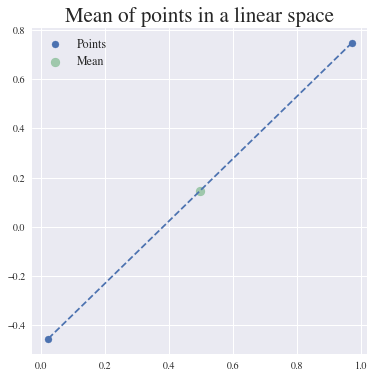

What happens to the usual statistical theory when the data doesn’t
naturally belong to a linear space. For example, if we want to perform
statistics on the coordinates of world cities, which lie on the earth: a
sphere?

The non-linear spaces we consider are called manifolds. A **manifold
:math:`M` of dimension :math:`m`** is a space that is allowed to be
curved but that looks like an :math:`m`-dimensional vector space in the
neighborhood of every point.

A sphere, like the earth, is a good example of a manifold. We know that
the earth is curved, but at our scale we do not see its curvature. Can
we still use linear statistics when data are defined on these manifolds,
or shall we?

Let’s try.

.. code:: ipython3

    from geomstats.geometry.hypersphere import Hypersphere

    sphere = Hypersphere(dim=dim)
    points_in_manifold = sphere.random_uniform(n_samples=n_samples)
    print('Points in manifold:\n', points_in_manifold)

    linear_mean = gs.sum(points_in_manifold, axis=0) / n_samples
    print('Mean of points:\n', linear_mean)

.. parsed-literal::

    Points in manifold:
     [[-0.71502435 -0.41197257 -0.56481748]
     [-0.997575   -0.04788171  0.05051201]]
    Mean of points:
     [-0.85629967 -0.22992714 -0.25715273]

We plot the points and their mean computed with the linear formula.

.. code:: ipython3

    %matplotlib inline

    fig = plt.figure(figsize=(8, 8))
    ax = fig.add_subplot(111, projection='3d')

    visualization.plot(
        points_in_manifold, ax=ax, space='S2', label='Point', s=80)

    ax.plot(
        points_in_manifold[:, 0],
        points_in_manifold[:, 1],
        points_in_manifold[:, 2],
        linestyle='dashed', alpha=0.5)

    ax.scatter(
        linear_mean[0], linear_mean[1], linear_mean[2],
        label='Mean', s=80, alpha=0.5)

    ax.set_title('Mean of points on a manifold')
    ax.legend();

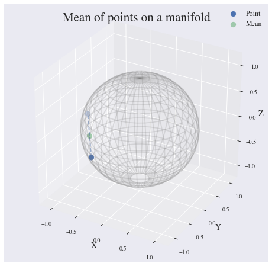

What happened? The mean of two points on a manifold (the sphere) is not
on the manifold. In our example, the mean city is not on the earth. This
leads to errors in statistical computations.

.. code:: ipython3

    print(sphere.belongs(linear_mean))

.. parsed-literal::

    False

For this reason, researchers aim to build a theory of statistics that is
by construction compatible with any structure we equip the manifold
with. This theory is called *Geometric Statistics*.

**Geometric Statistics** is a theory of statistics on manifolds, that
takes into account their geometric structures. Geometric Statistics is
therefore the child of two major pillars of Mathematics: Geometry and
Statistics.

Examples of data on manifolds
*****************************

Why should we bother to build a whole new theory of statistics? Do we
really have data that belong to spaces like the sphere illustrated in
introduction?

Let’s see some examples of data spaces that are naturally manifolds. By
doing so, we will introduce the ``datasets`` and ``visualization``
modules of ``geomstats``.

We first import the ``datasets.utils`` module that allows loading
datasets.

.. code:: ipython3

    import geomstats.datasets.utils as data_utils

World cities: data on the sphere
~~~~~~~~~~~~~~~~~~~~~~~~~~~~~~~~

We load the dataset ``cities``, that contains the coordinates of world
cities in spherical coordinates.

.. code:: ipython3

    data, names = data_utils.load_cities()
    print(names[:5])
    print(data[:5])

.. parsed-literal::

    ['Tokyo', 'New York', 'Mexico City', 'Mumbai', 'São Paulo']
    [[ 0.61993792 -0.52479018  0.58332859]
     [-0.20994315  0.7285533   0.65202298]
     [ 0.14964311  0.93102728  0.33285904]
     [-0.27867026 -0.9034188   0.32584868]
     [-0.62952884  0.6662902  -0.3996884 ]]

We convert the spherical coordinates to X, Y, Z coordinates and verify
that they belong to the sphere.

.. code:: ipython3

    gs.all(sphere.belongs(data))

.. parsed-literal::

    True

Now, we plot the cities on the sphere. We choose only a subset of the
cities that have a nice rendering in the 2D plot of the 3D earth. This
plot is nicer shown in an interactive 3D figure.

.. code:: ipython3

    from geomstats.geometry.matrices import Matrices
    from geomstats.geometry.special_orthogonal import SpecialOrthogonal

    data, names = data_utils.load_cities()

.. code:: ipython3

    fig = plt.figure(figsize=(10, 10))
    ax = fig.add_subplot(111, projection='3d')

    visualization.plot(data[15:20], ax=ax, space='S2', label=names[15:20], s=80, alpha=0.5)

    ax.set_title('Cities on the earth.');

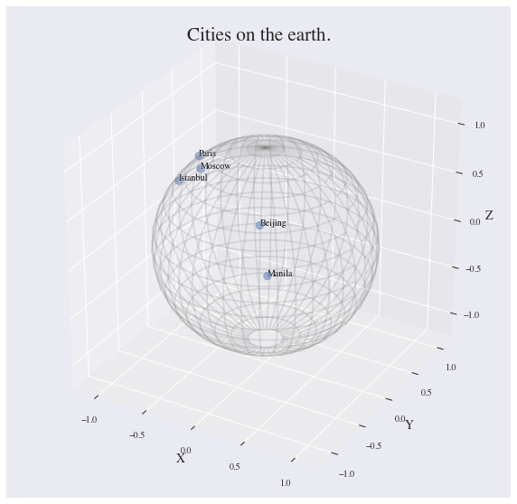

Pose of objects in pictures
~~~~~~~~~~~~~~~~~~~~~~~~~~~

We consider the dataset ``poses``, that contains the 3D poses of objects
in images. Specifically, we consider poses of beds in images, i.e. the
3D orientation of each bed within a given 2D image.

The orientation corresponds to a 3D rotation. A 3D rotation :math:`R` is
visually represented as the result of :math:`R` applied to the
coordinate frame :math:`(e_x, e_y, e_z)`.

We first load the dataset.

.. code:: ipython3

    data, img_paths = data_utils.load_poses()

    img_path1, img_path2 = img_paths[0], img_paths[1]
    img_path1 = os.path.join(data_utils.DATA_FOLDER, 'poses', img_path1)
    img_path2 = os.path.join(data_utils.DATA_FOLDER, 'poses', img_path2)

    img1 = mpimg.imread(img_path1)
    img2 = mpimg.imread(img_path2)

    fig = plt.figure(figsize=(16, 8))

    ax = fig.add_subplot(121)
    imgplot = ax.imshow(img1)
    ax.axis('off')
    ax = fig.add_subplot(122)
    imgplot = ax.imshow(img2)
    ax.axis('off')

    plt.show()

.. image:: 01_data_on_manifolds_files/01_data_on_manifolds_35_0.png

We import the manifold of 3D rotations: the Special Orthogonal group in
3D, :math:`SO(3)`. We choose to represent the 3D rotations as rotation
vectors, hence: ``point_type='vector'``.

.. code:: ipython3

    from geomstats.geometry.special_orthogonal import SpecialOrthogonal

    so3 = SpecialOrthogonal(n=3, point_type='vector')

We verify that the poses belong to the space of 3D rotations.

.. code:: ipython3

    gs.all(so3.belongs(data))

.. parsed-literal::

    True

We plot the orientations of the first 2 beds.

.. code:: ipython3

    fig = plt.figure(figsize=(8, 8))
    ax = fig.add_subplot(111, projection='3d')

    visualization.plot(data[:2], ax=ax, space='SO3_GROUP')

    ax.set_title('3D orientations of the beds.');

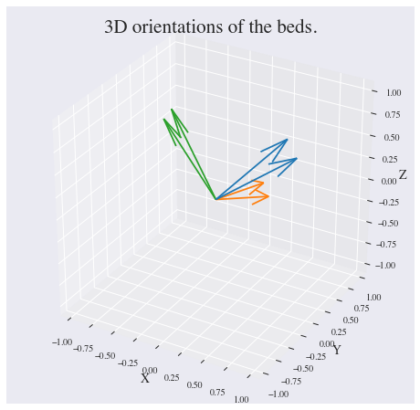

These orientations are very close, as expected from the corresponding
images.

From vector spaces to manifolds
*******************************

In the previous tutorial, we visualized data that naturally belong to
manifolds, i.e. generalizations of vector spaces that are allowed to
have curvature.

A simple example of such data is the coordinates of cities on the
surface of the earth: they belong to a sphere, which is a manifold.

.. code:: ipython3

    import geomstats.datasets.utils as data_utils

    data, names = data_utils.load_cities()

    fig = plt.figure(figsize=(10, 10))
    ax = fig.add_subplot(111, projection='3d')

    visualization.plot(data[15:20], ax=ax, space='S2', label=names[15:20], s=80, alpha=0.5)

    ax.set_title('Cities on the earth.');

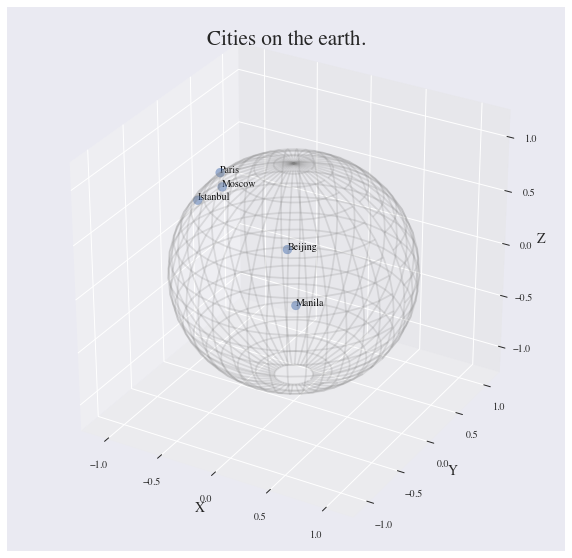

The purpose of this tutorial is to show how we can perform elementary
computations on such data.

From addition to exponential map
~~~~~~~~~~~~~~~~~~~~~~~~~~~~~~~~

The elementary operations on a vector space are: addition, substraction
and multiplication by a scalar. We can add a vector to a point,
substract two points to get a vector, or multiply a vector by a scalar
value.

.. code:: ipython3

    %matplotlib inline

    fig = plt.figure(figsize=(6, 6))
    ax = fig.add_subplot(111)

    point_a = gs.array([0, 1])
    point_b = gs.array([1, 2])
    vector = point_b - point_a

    ax.scatter(point_a, point_b, label='Points')
    ax.arrow(gs.to_numpy(point_a[0]), gs.to_numpy(point_a[1]),
             dx=gs.to_numpy(vector[0]), dy=gs.to_numpy(vector[1]),
             width=0.008, length_includes_head=True, color='black')

    ax.legend();

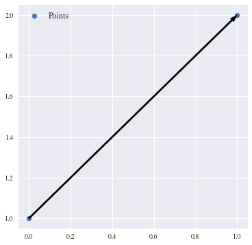

For points on a manifold, like the sphere, the same operations are not
permitted. Indeed, adding a vector to a point will not give a point that
belongs to the manifold.

.. code:: ipython3

    fig = plt.figure(figsize=(10, 10))
    ax = fig.add_subplot(111, projection='3d')

    paris = data[19]
    vector = gs.array([1, 0, 0.8])

    ax = visualization.plot(paris, ax=ax, space='S2', s=200, alpha=0.8, label='Paris')

    arrow = visualization.Arrow3D(paris, vector=vector)
    arrow.draw(ax, color='black')
    ax.legend();

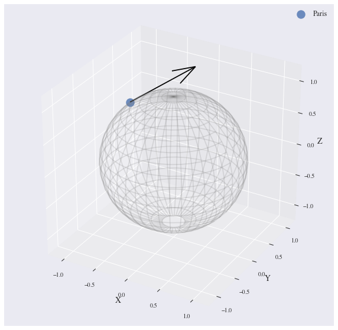

The exponential map is the operation that generalizes the addition of a
vector to a point, on manifolds.

The exponential map takes a point and a tangent vector as inputs, and
outputs the point on the manifold that is reached by “shooting” with the
tangent vector. “Shooting” means taking the path of shortest length.
This path is called a “geodesic”.

.. code:: ipython3

    from geomstats.geometry.hypersphere import Hypersphere

    sphere = Hypersphere(dim=2)

    paris = data[19]
    vector = gs.array([1, 0, 0.8])
    tangent_vector = sphere.to_tangent(vector, base_point=paris)

    result = sphere.metric.exp(tangent_vector, base_point=paris)

    geodesic = sphere.metric.geodesic(
            initial_point=paris,
            initial_tangent_vec=tangent_vector)

    points_on_geodesic = geodesic(gs.linspace(0., 1., 30))

.. code:: ipython3

    fig = plt.figure(figsize=(10, 10))
    ax = fig.add_subplot(111, projection='3d')

    ax = visualization.plot(paris, ax=ax, space='S2', s=100, alpha=0.8, label='Paris')
    ax = visualization.plot(result, ax=ax, space='S2', s=100, alpha=0.8, label='End point')
    ax = visualization.plot(
        points_on_geodesic, ax=ax, space='S2', color='black', label='Geodesic')

    arrow = visualization.Arrow3D(paris, vector=tangent_vector)
    arrow.draw(ax, color='black')
    ax.legend();

.. image:: 02_from_vector_spaces_to_manifolds_files/02_from_vector_spaces_to_manifolds_19_0.png

From substraction to logarithm map
~~~~~~~~~~~~~~~~~~~~~~~~~~~~~~~~~~

The logarithm map is the operation that generalizes the substraction of
two points, that gives a vector.

The logarithm map takes two points on the manifold as inputs, and
outputs the tangent vector that is required to “shoot” from one point to
the other.

.. code:: ipython3

    paris = data[19]
    beijing = data[15]

    log = sphere.metric.log(point=beijing, base_point=paris)

    geodesic = sphere.metric.geodesic(
            initial_point=paris,
            end_point=beijing)

    points_on_geodesic = geodesic(gs.linspace(0., 1., 30))

.. code:: ipython3

    fig = plt.figure(figsize=(10, 10))
    ax = fig.add_subplot(111, projection='3d')

    ax = visualization.plot(paris, ax=ax, space='S2', s=100, alpha=0.8, label='Paris')
    ax = visualization.plot(beijing, ax=ax, space='S2', s=100, alpha=0.8, label='Beijing')
    ax = visualization.plot(
        points_on_geodesic, ax=ax, space='S2', color='black', label='Geodesic')

    arrow = visualization.Arrow3D(paris, vector=log)
    arrow.draw(ax, color='black')
    ax.legend();

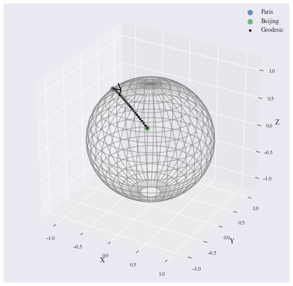

Geodesics
~~~~~~~~~

So far, we have given examples of geodesics on the sphere. The sphere is
a simple manifold that is easy to visualize. Yet, ``geomstats`` provides
many more manifolds, on which the exp and log are defined. Let’s present
a few more.

We consider the hyperbolic geometry here. We define two points on the
hyperbolic plane and compute the geodesic between them.

.. code:: ipython3

    from geomstats.geometry.hyperboloid import Hyperboloid

    hyperbolic = Hyperboloid(dim=2, coords_type='extrinsic')

    initial_point = gs.array([gs.sqrt(2.), 1., 0.])
    end_point = gs.array([2.5, 2.5])
    end_point = hyperbolic.from_coordinates(end_point, 'intrinsic')

    geodesic = hyperbolic.metric.geodesic(
        initial_point=initial_point, end_point=end_point)

    points = geodesic(gs.linspace(0., 1., 10))

We use the visualization module to plot the two points and the geodesic
between them. We can choose the visualization we prefer for points on
the hyperbolic plane. First we visualize with the Poincare disk
representation.

.. code:: ipython3

    fig = plt.figure(figsize=(8, 8))
    ax = fig.add_subplot(111)

    representation = 'H2_poincare_disk'

    ax = visualization.plot(
        initial_point, ax=ax, space=representation, s=50, label='Initial point');
    ax = visualization.plot(
        end_point, ax=ax, space=representation, s=50, label='End point');

    ax = visualization.plot(
        points[1:-1], ax=ax, space=representation, s=5, color='black', label='Geodesic');
    ax.axis('off')
    ax.set_title('Geodesic on the hyperbolic plane in Poincare disk representation')
    ax.legend();

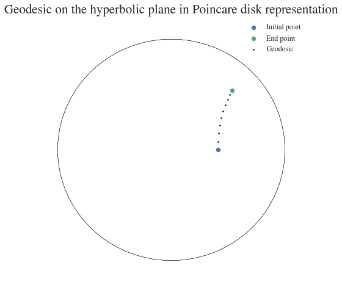

We can visualize the same geodesic in Klein disk representation.

.. code:: ipython3

    fig = plt.figure(figsize=(8, 8))
    ax = fig.add_subplot(111)

    representation = 'H2_klein_disk'

    ax = visualization.plot(
        initial_point, ax=ax, space=representation, s=50, label='Initial point');
    ax = visualization.plot(
        end_point, ax=ax, space=representation, s=50, label='End point');

    ax = visualization.plot(
        points[1:-1], ax=ax, space=representation, s=5, color='black', label='Geodesic');
    ax.axis('off')
    ax.set_title('Geodesic on the hyperbolic plane in Klein disk representation')
    ax.legend();

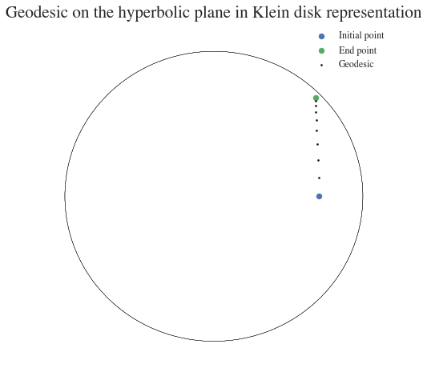

We consider the special euclidean group in 3D, which is the group of 3D
rotations and 3D translations. One element of this group can be
represented by a frame, oriented by the 3D rotation, and located by the
3D translation from the origin.

We create two points in SE(3), and compute the geodesic between them.

.. code:: ipython3

    from geomstats.geometry.special_euclidean import SpecialEuclidean

    se3 = SpecialEuclidean(n=3, point_type='vector')
    metric = se3.left_canonical_metric

    initial_point = se3.identity
    initial_tangent_vec = gs.array([1.8, 0.2, 0.3, 3., 3., 1.])
    geodesic = metric.geodesic(
        initial_point=initial_point,
        initial_tangent_vec=initial_tangent_vec)

    points = geodesic(gs.linspace(-3., 3., 40))

We visualize the geodesic in the group SE(3), which is a path of frames
in 3D.

.. code:: ipython3

    fig = plt.figure(figsize=(8, 8))
    ax = fig.add_subplot(111, projection='3d')

    visualization.plot(points, ax=ax, space='SE3_GROUP');

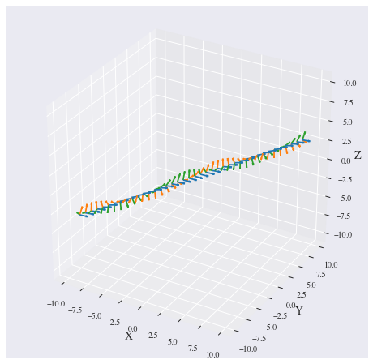

-> Notebooks 02 here: https://github.com/geomstats/geomstats/tree/master/notebooks

Tutorial: Classification of SPD matrices
----------------------------------------

Manifold of SPD matrices
************************

We consider a manifold embedded in the general linear group of invertible matrices. The manifold of symmetric positive definite (SPD) matrices in :math:`n` dimensions is defined as:

.. math::
    SPD = \left\{
    S \in \mathbb{R}_{n \times n}: S^T = S, \forall herez \in \mathbb{R}^n, z \neq 0, z^TSz > 0
    \right\}.

There class \texttt{SPDMatricesSpace} inherits from the class \texttt{EmbeddedManifold} and has an \texttt{embedding\_manifold} attribute which stores an object of the class \texttt{GeneralLinearGroup}. We equip the manifold of SPD matrices with an object of the class \texttt{SPDMetric} that implements the affine-invariant Riemannian metric of \cite{Pennec2006b} and inherits from the class \texttt{RiemannianMetric}.

Visualization of SPD matrices
*****************************

SPD matrices in the literature
******************************

SPD matrices are ubiquitous in machine learning across many fields \cite{Cherian2016}, either as input or output to the problem. In diffusion tensor imaging (DTI) for instance, voxels are represented by "diffusion tensors" which are 3x3 SPD matrices. These ellipsoids spatially characterize the diffusion of water molecules in the tissues. Each DTI thus consists in a field of SPD matrices, which are inputs to regression models. In \cite{Yuan2012} for example, the authors use an intrinsic local polynomial regression applied to comparison of fiber tracts between HIV subjects and a control group. Similarly, in functional magnetic resonance imaging (fMRI), it is possible to extract connectivity graphs from a set of patients' resting-state images' time series \cite{sporns2005human,wang2013disrupted,ingalhalikar2014sex}-- a framework known as brain connectomics. The regularized graph Laplacians of the graphs form a dataset of SPD matrices. They represent a compact summary of the brain's connectivity patterns which is used to assess neurological responses to a variety of stimuli (drug, pathology, patient's activity, etc.).

More generally speaking, covariance matrices are also SPD matrices which appear in many settings. We find covariance clustering used for sound compression in acoustic models of automatic speech recognition (ASR) systems \cite{Shinohara2010} or for material classification \cite{Faraki2015} among others. Covariance descriptors are also popular image or video descriptors \cite{Harandi2014}.

Lastly, SPD matrices have found applications in deeep learning, where they are used as features extracted by a neural network. The authors of \cite{Gao2017} show that an aggregation of learned deep convolutional features into a SPD matrix creates a robust representation of images that enables to outperform state-of-the-art methods on visual classification.

Classification of SPD matrices with Geomstats
*********************************************

We show through a concrete brain connectome application to show \texttt{geomstats} can be easily leveraged for efficient supervised learning on the space of SPD matrices. The folder \texttt{brain\_connectome} of the supplementary materials contains the implementation of this use case.

We consider the fMRI data from the 2014 MLSP Schizophrenia Classification challenge\footnote{Data openly available at \url{https://www.kaggle.com/c/mlsp-2014-mri}}, consisting of the resting-state fMRIs of 86 patients split into two balanced categories: control vs people suffering schizophrenia. Consistently with the connectome literature, we tackle the classification task by using a SVM classifier on the precomputed pairwise-similarities between subjects. The critical step lies in our ability to correctly identify similar brain structures, here represented by regularized Laplacian SPD matrices $\hat{L}=(D-A)+\gamma I$, where A and D are respectively the adjacency and the degree matrices of a given connectome. The parameter $\gamma$ is a regularization shown to have little effect on the classification performance \cite{Dodero2015}.

Following two popular approaches in there literature \cite{Dodero2015}, we define similarities between connectomes through kernels relying on the Riemannian distance :math:`d_R(\hat{L}_1,\hat{L}_2)= ||\log(\hat{L}_1^{-1/2}.\hat{L}_2.\hat{L}_1^{-1/2})||_F` and on the log-Euclidean distance, a computationally-lighter proxy for the first:
:math:`d_{LED}(\hat{L}_1,\hat{L}_2)= ||\log_{I}(\hat{L}_2) -\log_{I}(\hat{L}_1)||_F`. In these formulae, :math:`\log` is the matrix logarithm and :math:`F` refers to the Frobenius norm. Both of these similarities are easily computed with \texttt{geomstats}, for example the Riemannian distance is obtained through \texttt{metric.squared\_dist} where \texttt{metric} is an instance of the class \texttt{SPDMetric}.

Figure~\ref{convertedfig:SPD} (left) shows the performance of these similarities for graph classification, which we benchmark against a standard Frobenius distance. With an out-of-sample accuracy of 61.2\%, the log-Euclidean distance here achieves the best performance. Interestingly, the affine-invariant Riemannian distance on SPD matrices is the distance that picks up the most differences between connectomes. While both the Frobenius and the log-Euclidean recover only very slight differences between connectomes --placing them almost uniformly afar from each other--, the Riemannian distance exhibits greater variability, as shown by the clustermap in Figure~\ref{fig:SPD} (right). Given the ease of implementation of these similarities with \texttt{geomstats}, comparing them further opens research directions for in-depth connectome analysis.

-> Application here to be converted to a notebook: https://github.com/geomstats/applications/tree/master/brain_connectome

Tutorial: Learning graph representations with Hyperbolic spaces
---------------------------------------------------------------

Hyperbolic space
****************
The :math:`n`-dimensional hyperbolic space :math:`H_n` is defined by its embedding in the :math:`(n+1)`-dimensional Minkowski space, which is a flat pseudo-Riemannian manifold, as:

.. math::
   :label: hyperbolic

   H_{n} = \left\{
        x \in \mathbb{R}^{n+1}: - x_1^2 + ... + x_1{n+1}^2 = -1
    \right\}.

Visualizations of the Hyperbolic space
**************************************

We can visualize the hyperbolic space $H_2$ through the Poincare disk representation, where the border of the disk is at infinity. The user can then observe how a geodesic grid and a geodesic square are deformed in the hyperbolic geometry on Figure~\ref{fig:poincaredisk}.

.. figure:: grid_h2.pdf
   :align: center
   :scale: 30%

   Regular geodesic grid on the Hyperbolic space $H^2$ in Poincare disk representation.

.. figure:: square_h2.pdf
   :align: center
   :scale: 30%

   Geodesic square on the Hyperbolic space $H_2$, with points regularly spaced on the geodesics defining the square's edges.

Hyperbolic spaces in the literature
***********************************

We now focus on the applications of hyperbolic spaces in the machine learning literature. Hyperbolic spaces arise in information and learning theory. Indeed, the space of univariate Gaussians endowed with the Fisher metric densities is a hyperbolic space \cite{costa2005fisher}. This characterization is used in various fields, such as in image processing, where each image pixel is represented by a Gaussian distribution \cite{Angulo2014}, or in radar signal processing where the corresponding echo is represented by a stationary Gaussian process \cite{Arnaudon2013}.

The hyperbolic spaces can also be stanfordeen as continuous versions of trees and are therefore interesting when learning hierarchical representations of data \cite{Nickel2017}. Hyperbolic geometric graphs (HGG) have also been suggested as a promising model for social networks, where the hyperbolicity appears through a competition between similarity and popularity of an individual \cite{Papadopoulos2012}.

Learning graph representations with hyperbolic spaces in Geomstats
******************************************************************

-> Example here to be converted to a notebook: https://github.com/geomstats/geomstats/blob/master/examples/learning_graph_structured_data_h2.py
