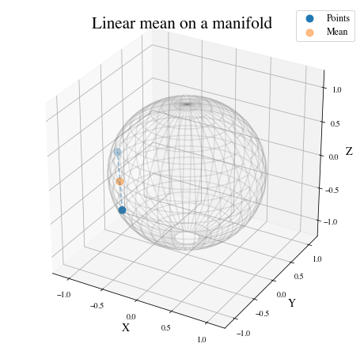
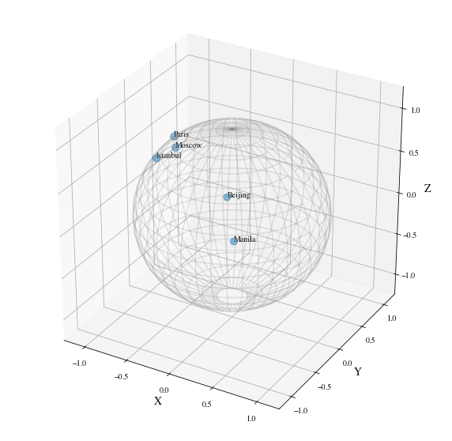
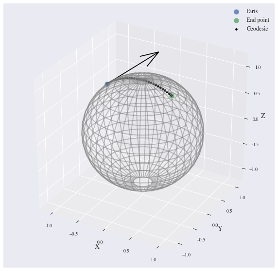
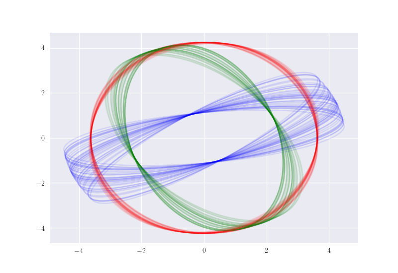
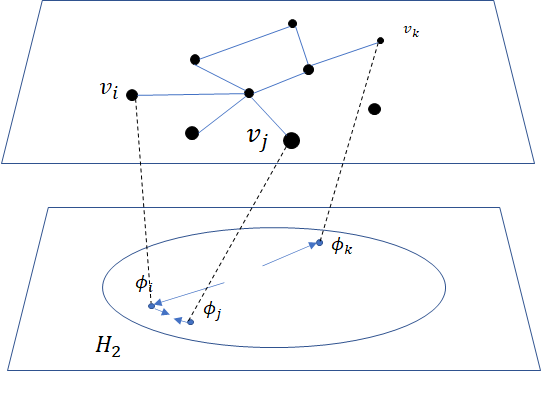
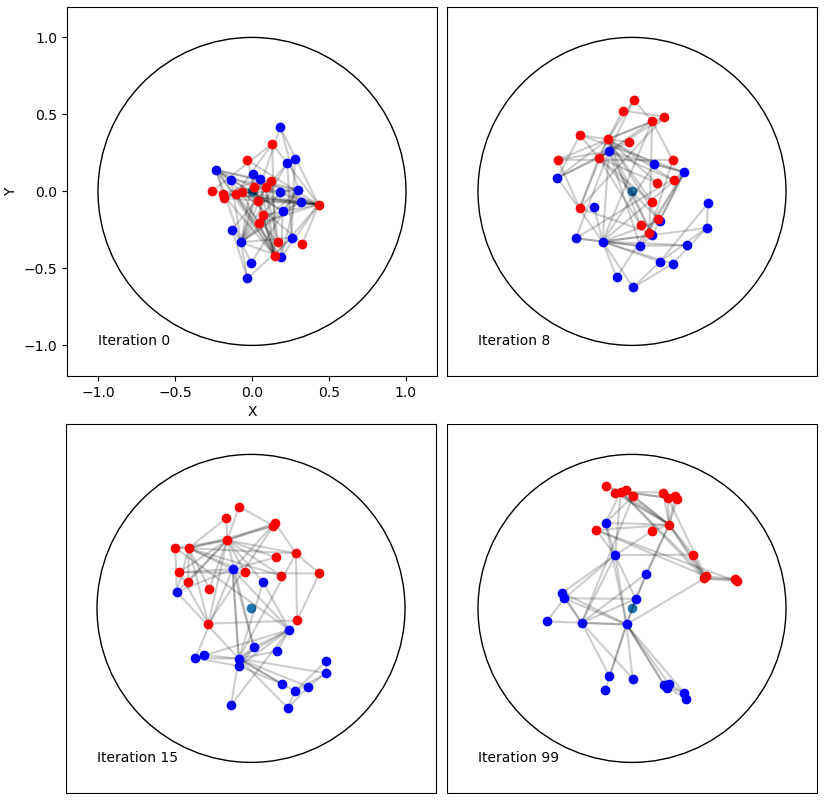
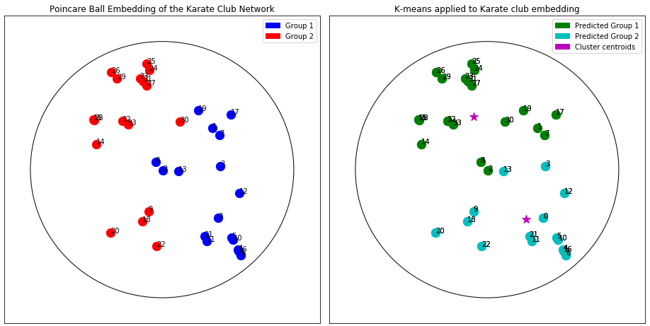

:author: Nina Miolane
:email: nmiolane@stanford.edu
:institution: Stanford University
:corresponding:

:author: Nicolas Guigui
:email: nicolas.guigui@inria.fr

:author: Hadi Zaatiti
:email: hadi.zaatiti@irt-systemx.fr

:author: Christian Shewmake
:email: cshewmake2@gmail.com

:author: Daniel Brooks
:email: daniel.brooks@lip6.fr

:author: Alice Le Brigant
:email: alice.le-brigant@univ-paris1.fr

:author: Johan Mathe
:email: johan@froglabs.ai

:author: Benjamin Hou
:email: benjamin.hou11@imperial.ac.uk

:author: Yann Thanwerdas
:email: yann.thanwerdas@inria.fr

:author: Stefan Heyder
:email: stefan.heyder@tu-ilmenau.de

:author: Olivier Peltre
:email: opeltre@gmail.com

:author: Niklas Koep
:email: niklas.koep@gmail.com

:author: Hatem Hajri
:email: hatem.hajri@irt-systemx.fr

:author: Yann Cabanes
:email: yann.cabanes@gmail.com

:author: Thomas Gerald
:email: thomas.gerald@lip6.fr

:author: Paul Chauchat
:email: pchauchat@gmail.com

:author: Bernhard Kainz
:email: b.kainz@imperial.ac.uk

:author: Claire Donnat
:email: cdonnat@stanford.edu

:author: Susan Holmes
:email: susan@stat.stanford.edu

:author: Xavier Pennec
:email: xavier.pennec@inria.fr%

:video: http://www.youtube.com/watch?v=dhRUe-gz690

:bibliography: main

-----------------------------------------------------------
Introduction to Geometric Learning in Python with Geomstats
-----------------------------------------------------------

.. class:: abstract

There is a growing interest in leveraging differential geometry in the machine learning community. Yet, the adoption of the associated geometric computations has been inhibited by the lack of reference implementation. Such implementation should typically allow its users: (i) to get intuition on concepts from differential geometry through a hands-on approach, often not provided by traditional textbooks; and (ii) to run geometric machine learning algorithms seamlessly, without delving into the mathematical details. To address this gap, we introduce the open-source Python package :code:`geomstats` and present hands-on tutorials of differential geometry and geometric machine learning algorithms - Geometric Learning - that rely on it. Code and documentation: :code:`www.geomstats.ai`.

.. class:: keywords

   differential geometry, statistics, manifold, machine learning

Introduction
------------

Data on manifolds arise naturally in different fields. Hyperspheres model directional data in molecular and protein biology :cite:`Kent2005UsingStructure` and some aspects of 3D shapes :cite:`Jung2012AnalysisSpheres, Hong2016`. Density estimation on hyperbolic spaces arises to model electrical impedances :cite:`Huckemann2010MobiusEstimation`, networks :cite:`Asta2014GeometricComparison` or reflection coefficients extracted from a radar signal :cite:`Chevallier2015ProbabilityProcessing`. Symmetric Positive Definite (SPD) matrices are used to characterize data from Diffusion Tensor Imaging (DTI) :cite:`Pennec2006b, Yuan2012` and functional Magnetic Resonance Imaging (fMRI) :cite:`Sporns2005TheBrain`. Examples of manifold data are numerous. As a result, there is a growing interest in leveraging differential geometry in the machine learning community, supported by the growing fields of Geometric Learning and Geometric Deep Learning :cite:`Bronstein2017`.

Despite this need, the adoption of differential geometric computations has been inhibited by the lack of a reference implementation. Project code implementing geometric tools are often custom-built for specific problems and are not easily reused. Some Python packages do exist, but these mainly focus on optimization (Pymanopt :cite:`Townsend2016Pymanopt:Differentiation`, Geoopt :cite:`Becigneul2018RiemannianMethods, Kochurov2019Geoopt:Optim`, and McTorch :cite:`Meghwanshi2018McTorchLearning`), are dedicated to a single manifold (PyRiemann :cite:`Barachant2015PyRiemann:Interface`, PyQuaternion :cite:`Wynn2014PyQuaternions:Quaternions`, PyGeometry :cite:`Censi2012PyGeometry:Manifolds.`), or lack unit-tests and continuous integration (TheanoGeometry :cite:`Kuhnel2017ComputationalTheano`). An open-source, low-level implementation of differential geometry and associated learning algorithms for manifold-valued data is thus thoroughly welcome.

We present :code:`geomstats`, an open-source Python package built for machine learning with data on non-linear manifolds: a field called Geometric Learning. We provide object-oriented and extensively unit-tested implementations of essential manifolds, operations, and learning methods with support for different execution backends - namely NumPy, PyTorch, and TensorFlow. This paper illustrates the use of :code:`geomstats` through hands-on introductory tutorials of Geometric Learning. These tutorials enable users: (i) to build intuition for differential geometry through a hands-on approach which is not often provided by traditional textbooks; and (ii) to run geometric machine learning algorithms seamlessly without delving into the lower-level computational or mathematical details. We emphasize that the tutorials are not meant to replace theoretical expositions of differential geometry and geometric learning :cite:`Postnikov2001,Pennec2019RiemannianAnalysis`. Rather, they will complement them with an intuitive, didactic, and engineering-oriented approach.

Presentation of Geomstats
-------------------------

The package :code:`geomstats` is organized into two main modules: :code:`geometry` and :code:`learning`. The module :code:`geometry` implements low-level differential geometry with an object-oriented approach and two main parent classes: :code:`Manifold` and :code:`RiemannianMetric`. Standard manifolds like the hypersphere or the hyperbolic space are classes that inherit from :code:`Manifold`. The class :code:`RiemannianMetric` provides computations related to Riemannian geometry, such as the inner product of two tangent vectors at a base point, the geodesic distance between two points, the Exponential and Logarithm maps at a base point, etc.

The module :code:`learning` implements statistics and machine learning algorithms for data on manifolds. The code is object-oriented and classes inherit from :code:`scikit-learn` base classes and mixins: :code:`BaseEstimator`, :code:`ClassifierMixin`, :code:`RegressorMixin`, etc. This module provides implementations of Frechet mean estimators, K-means, and principal component analysis (PCA) designed for manifold data. The algorithms can be applied seamlessly to the different manifolds implemented in the library.

The code follows international standards for readability and ease of collaboration, is vectorized for batch computations, undergoes unit-testing with continuous integration, and incorporates both TensorFlow and PyTorch backends to allow for GPU acceleration. The package comes with a :code:`visualization` module that enables users to visualize and further develop an intuition for differential geometry.

First Steps
-----------

To begin, we need to install :code:`geomstats`. We follow the installation procedure described at :code:`https://geomstats.github.io/first-steps.html`. Next, in the command line, we choose the backend of interest: :code:`numpy`, :code:`pytorch`, or :code:`tensorflow`, open the ipython notebook, then import the backend together with the visualization module. In the command line::

    export GEOMSTATS_BACKEND=numpy

then, in the Python script:

.. code:: python

    import geomstats.backend as gs
    import geomstats.visualization as visualization

    visualization.tutorial_matplotlib()

.. parsed-literal::

    INFO: Using numpy backend

Modules related to :code:`matplotlib` and :code:`logging` should be imported during setup too. More details on setup can be found on the documentation website: :code:`www.geomstats.ai`.

Tutorial: Statistics and Geometric Statistics
---------------------------------------------

This tutorial illustrates how Geometric Statistics and Learning differ from traditional Statistics. Statistical theory is usually defined
for data belonging to vector spaces, which are linear spaces. For
example, we know how to compute the mean of a set of numbers or of multidimensional
arrays.

Now consider a non-linear space: a manifold. A manifold
:math:`M` of dimension :math:`m` is a space that is possibly
curved but that looks like an :math:`m`-dimensional vector space in a small
neighborhood of every point. A sphere, like the earth, is a good example of a manifold.
What happens to the usual statistical theory when the data does not
naturally belong to a linear space? For example, what happens if we want to perform
statistics on the coordinates of world cities lying on the earth's surface: a
sphere? Let us compute the mean of two data points on the sphere using the traditional definition of the mean.

.. code:: python

    from geomstats.geometry.hypersphere import \
        Hypersphere

    sphere = Hypersphere(dim=2)
    points_in_manifold = sphere.random_uniform(
         n_samples=2)

    linear_mean = gs.sum(
        points_in_manifold, axis=0) / n_samples

   Linear mean of two points on a manifold, the sphere :label:`fig:linearmean`.

The result is shown in Figure :ref:`fig:linearmean`. What happened? The mean of two points on a manifold (the sphere) is not
on the manifold. In our example, the mean of these cities is not on the earth's surface. This
leads to errors in statistical computations. The line :code:`sphere.belongs(linear_mean)` returns :code:`False`. For this reason, researchers aim to build a theory of statistics that is - by construction - compatible with any structure with which we equip the manifold. This theory is called Geometric Statistics, and the associated learning algorithms: Geometric Learning.

In this specific example of mean computation, Geometric Statistics provides a generalization of
the definition of “mean” to manifolds: the Fréchet mean.

.. code:: python

    from geomstats.learning.frechet_mean import \
        FrechetMean

    estimator = FrechetMean(metric=sphere.metric)
    estimator.fit(points_in_manifold)
    frechet_mean = estimator.estimate_

You can observe that the syntax of this code snippet follows the syntax of :code:`scikit-learn`'s learning algorithms. We plot the result in Figure :ref:`fig:frechetmean`. Observe that the Fréchet mean now belongs to the surface of
the sphere!

.. figure:: 01_data_on_manifolds_files/01_data_on_manifolds_22_0.png
   :align: center
   :scale: 50%

   Fréchet mean of two points on a manifold, the sphere :label:`fig:frechetmean`.

Beyond the computation of the mean, Geometric Learning provides learning algorithms on manifolds by taking into account their specific geometric structure. Geometric Learning is therefore the child of two major pillars: Geometry and Machine Learning.

Tutorial: Elementary Operations for Data on Manifolds
-----------------------------------------------------

The previous tutorial showed why we need to generalize traditional statistics for data on manifolds. This tutorial shows how to perform the elementary operations that allow us to "translate" learning algorithms from linear spaces to manifolds.

We import data that lie on a manifold: the dataset :code:`cities` containing coordinates of cities on the earth's surface. We visualize it in Figure :ref:`fig:cities`.

.. code:: python

    import geomstats.datasets.utils as data_utils

    data, names = data_utils.load_cities()

   World cities as data on a manifold, the sphere :label:`fig:cities`.

How can we compute with data that lie on such a manifold? The elementary operations on a vector space are addition and subtraction. In a vector space, we can add a vector to a point and
subtract two points to get a vector. Can we generalize these operations in order to compute on manifolds?

For points on a manifold, such as the sphere, the same operations are not permitted. Indeed, adding a vector to a point will not give a point that belongs to the manifold. So, we need to generalize to manifolds the operations of addition and subtraction.

On manifolds, the exponential map is the operation that generalizes the addition of a vector to a point. The exponential map takes the following inputs: a point and a tangent vector to the manifold at that point. These are shown in Figure :ref:`fig:operations` using the blue point and its tangent vector, respectively. The exponential map returns the point on the manifold that is reached by “shooting” with the tangent vector from the point. “Shooting” means following a “geodesic” on the manifold, which is the dotted path on Figure :ref:`fig:operations`. A geodesic, roughly, is the analog of a straight line for general manifolds - the path which, in a sense, minimizes the distance between two points. This code snippet shows how to compute the exponential map and the geodesic with :code:`geomstats`.

.. code:: python

    from geomstats.geometry.hypersphere import \
        Hypersphere

    sphere = Hypersphere(dim=2)

    paris = data[19]
    vector = gs.array([1, 0, 0.8])
    tangent_vector = sphere.to_tangent(
         vector, base_point=paris)

    result = sphere.metric.exp(
        tangent_vector, base_point=paris)

    geodesic = sphere.metric.geodesic(
        initial_point=paris,
        initial_tangent_vec=tangent_vector)

   Exponential map, Logarithm map, and geodesic on a manifold: the sphere :label:`fig:operations`.

Correspondingly, on manifolds, the logarithm map is the operation that generalizes the subtraction of two points. The logarithm map takes two points on the manifold as inputs and returns the tangent vector required to “shoot” from one point to the other. In Figure :ref:`fig:operations`, the logarithm map of the orange point at the blue point returns the tangent vector in black. This code snippet shows how to compute the logarithm map with :code:`geomstats`.

.. code:: python

    paris = data[19]
    beijing = data[15]

    log = sphere.metric.log(
        point=beijing, base_point=paris)

Using the exponential and logarithm maps instead of linear addition and subtraction, many learning algorithms can be generalized to manifolds. We emphasize that these operations depend on the "Riemannian metric" chosen for a given manifold. The metric defines the notion of geodesic and distance between points on the manifold. We could have chosen a different metric on the sphere that would have changed the distance between the points: with a different metric, the "sphere" could, for example, look like an ellipsoid.

We presented the use of the exponential and logarithm maps on the sphere only; yet, :code:`geomstats` provides their implementation for over 15 different manifolds in its :code:`geometry` module with support for a variety of Riemannian metrics. The next tutorials show more involved examples of learning algorithms that rely on these elementary operations on manifolds.

Tutorial: Classification of SPD Matrices
----------------------------------------

SPD matrices in the literature
******************************

Before diving into the tutorial, let us recall a few applications of symmetric positive definite (SPD) matrices
in the machine learning literature. SPD matrices are ubiquitous across many fields :cite:`Cherian2016`, either as input of or output to a given problem. In Diffusion Tensor Imaging (DTI) for instance, voxels are represented by "diffusion tensors" which are 3x3 SPD matrices representing ellipsoids in their structure. These ellipsoids spatially characterize the diffusion of water molecules in various tissues. Each DTI thus consists of a field of SPD matrices, where each point in space corresponds to an SPD matrix. These matrices then serve as inputs to regression models. In :cite:`Yuan2012` for example, the authors use an intrinsic local polynomial regression to compare fiber tracts between HIV subjects and a control group. Similarly, in functional Magnetic Resonance Imaging (fMRI), researchers have modeled brain activity using SPD matrices :cite:`wang2013disruptedDisease`.

More generally speaking, covariance matrices are also SPD matrices which appear in many settings. Covariance clustering can be used for various applications such as sound compression in acoustic models of automatic speech recognition (ASR) systems :cite:`Shinohara2010` or for material classification :cite:`Faraki2015`, among others. Covariance descriptors are also popular image or video descriptors :cite:`Harandi2014`.

Lastly, SPD matrices have found applications in deep learning, where they are used as features extracted by a neural network. The authors of :cite:`Gao2017` show that an aggregation of learned deep convolutional features into an SPD matrix creates a robust representation of images that enables to outperform state-of-the-art methods on visual classification.

Tutorial context and description
********************************

We demonstrate how any standard machine learning
algorithm can be used on data that live on a manifold yet respecting its geometry. In the previous tutorials we saw that linear operations (mean, linear weighting, addition and substraction) do not work on manifold. However, to each point on a manifold, is associated a tangent space, which is a vector space, where all our off-the-shelf machine learning operations are well defined! Therefore, we will use the logarithm map (see Figure :ref:`fig:operations` from the previous tutorial) to go from points of the manifolds to vectors in the tangent space at a reference point. This will enable to use traditional learning algorithms.

This strategy can be applied to any manifold-valued data and to any learning algorithm. In this tutorial we consider SPD matrices data from brain connectomics and perform a simple logistic regression. In functional Magnetic Resonance Imaging (fMRI), it is possible to extract connectivity graphs from a set of patients' resting-state images' time series :cite:`wang2013disruptedDisease` - a framework known as brain connectomics. The regularized graph Laplacians of the graphs form a dataset of SPD matrices. They represent a compact summary of the brain's connectivity patterns which is used to assess neurological responses to a variety of stimuli (drug, pathology, patient's activity, etc.).

Manifold of SPD matrices
************************

Let us recall the mathematical definition of the manifold of SPD matrices. The manifold of symmetric positive definite (SPD) matrices in :math:`n` dimensions is embedded in the General Linear group of invertible matrices and defined as:

.. math::
    SPD = \left\{
    S \in \mathbb{R}_{n \times n}: S^T = S, \forall z \in \mathbb{R}^n, z \neq 0, z^TSz > 0
    \right\}.

The class :code:`SPDMatricesSpace` inherits from the class :code:`EmbeddedManifold` and has an :code:`embedding_manifold` attribute which stores an object of the class :code:`GeneralLinear`. SPD matrices in 2 dimensions can be visualized as ellipses, that give insights into their eigenvalues and eigenvectors. This is implemented in the ``visualization`` module of :code:`geomstats`. We generate a toy data-set:

.. code:: python

    import geomstats.datasets.sample_sdp_2d as sampler

    n_samples=100
    dataset_generator = sampler.DatasetSPD2D(
        n_samples, n_features=2, n_classes=3)

and plot it on Figure :ref:`fig:spd`.

.. code:: python

    ellipsis = visualization.Ellipsis2D()
    for i in range(n_samples):
        x = data[i]
        y = sampler.get_label_at_index(i, labels)
        ellipsis.draw(
            x, color=ellipsis.colors[y], alpha=.1)

   Dataset of SPD matrices in 2D :label:`fig:spd`.

Classifying brain connectomes in Geomstats
******************************************

We use data from the `MSLP 2014 Schizophrenia
Challenge <https://www.kaggle.com/c/mlsp-2014-mri/data>`__. The dataset correponds to the Functional Connectivity Networks (FCN) extracted from resting-state fMRIs of 86 patients at 28 Regions Of Interest (ROIs). Roughly, an FCN corresponds to a correlation matrix and can be seen as a point on the manifold of Symmetric Positive-Definite (SPD) matrices in 28 dimensions. Patients are separated in two classes: schizophrenic and control. Our goal is to classify them. First we load the data.

.. code:: python

    import geomstats.datasets.utils as data_utils

    data, patient_ids, labels = \
        data_utils.load_connectomes()

Because multiple metrics could be used on SPD matrices, we also import two of
the most commonly used ones: the Log-Euclidean metric and the
Affine-Invariant metric :cite:`Pennec2006b`. We check that our data indeed
belongs to the manifold of SPD matrices:

.. code:: python

    import geomstats.geometry.spd_matrices as spd

    manifold = spd.SPDMatrices(28)
    ai_metric = spd.SPDMetricAffine(28)
    le_metric = spd.SPDMetricLogEuclidean(28)
    logging.info(gs.all(manifold.belongs(data)))

.. parsed-literal::

    INFO: True

Great! Now, although the sum of two SPD matrices is an SPD matrix, their
difference or their linear combination with non-positive weights are not
necessarily! Therefore we need to work in a tangent space to perform
simple machine learning. All the geometric operations are handled by :code:`geomstats`, thanks to the preprocessing module.

.. code:: python

    from geomstats.learning.preprocessing import \
        ToTangentSpace

What ``ToTangentSpace`` does is simple: it computes the Fréchet Mean of
the data set, then takes the logarithm map of
each data point from the mean. This results in a set of tangent vectors,
and in the case of the SPD manifold, these are simply symmetric
matrices. It then squeezes them to a 1d-vector of size
``dim = 28 * (28 + 1) / 2``, and thus outputs an array of shape
``[n_patients, dim]``, which can be fed to your favorite scikit-learn
algorithm.

Because the mean of the input data is computed, ``ToTangentSpace``
should be used in a pipeline (as e.g. scikit-learn’s ``StandardScaler``)
not to leak information from the test set at train time.

.. code:: python

    from sklearn.pipeline import Pipeline
    from sklearn.linear_model import LogisticRegression
    from sklearn.model_selection import cross_validate

    pipeline = Pipeline(
        steps=[
            ('feature_ext',
             ToTangentSpace(geometry=ai_metric)),
            ('classifier',
             LogisticRegression(C=2))])

We now have all the material to classify connectomes, and we evaluate
the model with cross validation. With the affine-invariant metric we
obtain:

.. code:: python

    result = cross_validate(pipeline, data, labels)
    print(result['test_score'].mean())

.. parsed-literal::

    0.71

And with the log-Euclidean metric:

.. code:: python

    pipeline = Pipeline(
        steps=[
            ('feature_ext',
             ToTangentSpace(geometry=le_metric)),
            ('classifier',
             LogisticRegression(C=2))])

    result = cross_validate(pipeline, data, labels)
    logging.info(result['test_score'].mean())

.. parsed-literal::

    INFO: 0.67

We observe that the results depend on the metric used! The Riemannian metric indeed defines the notions of geodesic and distance on the manifold. Both notions are used to compute the Fréchet Mean and the logarithms. Thus, changing the metric changes the results, and some metrics may be more suitable than others for different applications. There are published results that show how useful geometry can be with this type of data (e.g :cite:`Wong2018`, :cite:`Ng2014`).

We saw how to use the representation of points on the manifold as tangent vectors at a reference point to fit any machine learning algorithm, and compared the effect of different metrics on the manifold of SPD matrices. Another class of machine learning algorithms can be used very easily on manifolds with ``geomstats``: those that work with similarity matrices. With small datasets such as this one, we can easily compute the matrix of pairwise Riemannian distances:

 .. code:: python

    pairwise_dist = []
    for i, x in enumerate(data):
        for y in data[i:]:
            pairwise_dist.append(ai_metric.dist(x,y))
    pairwise_dist = manifold.from_vector(
        pairwise_dist)

We can then pass this matrix to ``scikit-learn``'s k-nearest-neighbors classification algorithm:

.. code:: python

    from sklearn.neighbors import KNeighborsClassifier
    classifier = KNeighborsClassifier(metric='precomputed')

    result = cross_validate(
        classifier, pairwise_dist, labels)
    logging.info(result['test_score'].mean())

.. parsed-literal::

    INFO: 0.72

We see that in this case, using pairwise distances is slightly more discriminative than using directions (and distances) to the mean only.

Tutorial: Learning graph representations with Hyperbolic spaces
---------------------------------------------------------------

Hyperbolic spaces and machine learning applications
***************************************************

Before going into this tutorial, let us recall a few applications of hyperbolic spaces
in the machine learning literature. Hyperbolic spaces arise in information and
learning theory. Indeed, the space of univariate Gaussians endowed with the Fisher
metric densities is a hyperbolic space :cite:`1531851`. This characterization
is used in various fields, such as in image processing, where each image pixel is
represented by a Gaussian distribution :cite:`Angulo2014`, or in radar signal
processing where the corresponding echo is represented by a stationary Gaussian process :cite:`Arnaudon2013`. The hyperbolic spaces can
also be stanfordeen as continuous versions of trees and are
therefore interesting when learning hierarchical representations of data
:cite:`Nickel2017`. Hyperbolic geometric graphs (HGG) have also been suggested
as a promising model for social networks, where the hyperbolicity appears through
a competition between similarity and popularity of an individual :cite:`papadopoulos2012popularity`
and in learning communities on large graphs :cite:`gerald2019node`.

Tutorial context and description
********************************

Learning GSD has known major achievements in recent years thanks to the
discovery of hyperbolic embeddings. It has been speculated since
several years that hyperbolic spaces would better represent GSD than
Euclidean spaces :cite:`Gromov1987` :cite:`PhysRevE` :cite:`hhh` :cite:`6729484`.
These speculations have recently been proven effective through concrete studies
and applications :cite:`Nickel2017` :cite:`DBLP:journals/corr/ChamberlainCD17` :cite:`DBLP:conf/icml/SalaSGR18` :cite:`gerald2019node`.
As outlined by :cite:`Nickel2017`, Euclidean embeddings require large
dimensions to capture certain complex relations such as the Wordnet
noun hierarchy. On the other hand, this complexity can be captured by
a simple model of hyperbolic geometry such as the Poincaré disc of two
dimensions :cite:`DBLP:conf/icml/SalaSGR18`. Additionally, hyperbolic embeddings provide
better visualisation of clusters on graphs than Euclidean embeddings
:cite:`DBLP:journals/corr/ChamberlainCD17`.

In the scope of these recent
discoveries, this tutorial shows how to learn such embeddings in :code:`geomstats`
using the Poincaré Ball manifold applied to the well-known ‘Karate Club’ dataset.
Please note that in the sequel we omit details regarding re-shaping/dimensioning the data arrays and those regarding visualizations and plot.
A full working code is available in the ``examples`` directory and additionally a detailed notebook under ``notebooks``.

Hyperbolic space
****************

The :math:`n`-dimensional hyperbolic space :math:`H_n` is defined by its embedding in the :math:`(n+1)`-dimensional Minkowski space, which is a flat pseudo-Riemannian manifold, as:

.. math::
   :label: hyperbolic

   H_{n} = \left\{
        x \in \mathbb{R}^{n+1}: - x_1^2 + ... + x_{n+1}^2 = -1
    \right\}.

In :code:`geomstats`, the hyperbolic space is implemented in the classes :code:`Hyperboloid` and
:code:`PoincareBall` depending on the coordinate system used to represent the points.
These classes  inherit from the class :code:`EmbeddedManifold` and has an :code:`embedding_manifold` attribute which stores an object of the class :code:`Minkowski`.

Learning graph representations with hyperbolic spaces in `Geomstats`
********************************************************************

`Parameters and Initialization`
~~~~~~~~~~~~~~~~~~~~~~~~~~~~~~~
Table :ref:`tabparam` defines the parameters needed for embedding that we now discuss. The
number of dimensions should be high (i.e., 10+) for large datasets
(i.e., large number of nodes/edges). In this
tutorial we consider a dataset with only 34 nodes.
The Poincaré disk of two dimensions (also called the Poincaré Ball) is therefore sufficient to
capture the complexity of the graph. Some parameters are hard to know in advance, such as
``max_epochs`` and ``lr``. These should be tuned specifically for each
dataset. Visualization can help with tuning the parameters. Also, one
can perform a grid search to find values of these parameters which
maximize some performance function (a measure for cluster seperability
or normalized mutual information (NMI) or others). Similarly, the number
of negative samples and context size are considered
hyperparameters and will be further discussed in the sequel. An instance
of the ``Graph`` class is created and set to the Karate club dataset.
The latter and several others can be found in the ``datasets.data`` module.

.. table:: Embedding parameters :label:`tabparam`

    +--------------+------------------------------------------------+
    | Parameter    | Description                                    |
    +==============+================================================+
    | dim          | Dimensions of the manifold used for embedding  |
    +--------------+------------------------------------------------+
    | max_epochs   | Number of iterations for learning the embedding|
    +--------------+------------------------------------------------+
    | lr           | Learning rate                                  |
    +--------------+------------------------------------------------+
    | n_negative   | Number of negative samples                     |
    +--------------+------------------------------------------------+
    | context_size | Size of the considered context                 |
    |              | for each node of the graph                     |
    +--------------+------------------------------------------------+

.. code:: python

    from geomstats.datasets
        import graph_data_preparation as gdp

    dim = 2
    max_epochs = 15
    lr = .05
    n_negative = 2
    context_size = 1
    karate_graph = gdp.Graph(
        graph_matrix_path=
            geomstats.datasets.utils.KARATE_PATH,
        labels_path=
            geomstats.datasets.utils.KARATE_LABELS_PATH)

The karate club network was collected from the members of a
university karate club by Wayne Zachary in 1977. Each node represents a
member of the club, and each edge represents an undirected relation
between two members. An often discussed problem using this dataset is to
find the two groups of people into which the karate club split after an
argument between two teachers. Figure :ref:`karafig` displays the dataset graph.
Further information about the dataset is
displayed to provide insight into its complexity.

.. figure:: learning_graph_structured_data_h2_files/karate_graph.png
    :scale: 20%
    :align: center

    Karate club dataset graph. :label:`karafig`

.. code:: python

    nb_vertices_by_edges =\
        [len(e_2) for _, e_2 in
            karate_graph.edges.items()]
    logging.info('
        Number of vertices: %s', len(karate_graph.edges))
    logging.info(
        'Mean edge-vertex ratio: %s',
        (sum(nb_vertices_by_edges, 0) /
            len(karate_graph.edges)))

.. parsed-literal::

    INFO: Number of vertices: 34
    INFO: Mean edge-vertex ratio: 4.588235294117647

Recall that :math:`H_2` is the Poincaré ball equipped with the distance function
:math:`d`. Declaring an instance of the ``PoincareBall`` manifold of two dimensions
in :code:`geomstats` is straightforward, as shown by this code snippet.

.. code:: python

    from geomstats.geometry.poincare_ball
        import PoincareBall

    hyperbolic_manifold = PoincareBall(dim)

`Learning embedding by optimizing a loss function`
~~~~~~~~~~~~~~~~~~~~~~~~~~~~~~~~~~~~~~~~~~~~~~~~~~

Denote :math:`V` as the set of nodes and :math:`E \subset V\times V` the
set of edges of the graph. The goal of embedding GSD is to provide a faithful and
exploitable representation of the graph. It is mainly achieved
by preserving first-order proximity that enforces nodes sharing edges
to be close to each other. It can additionally preserve second-order
proximity that enforces two nodes sharing the same context (i.e., nodes
that share a neighbor but are not necessarily directly connected) to be close.
To preserve first and second-order proximities we adopt the following loss function
similar to :cite:`NIPS2017_7213` and consider the negative sampling
approach as in :cite:`NIPS2013_5021`:

.. math::      \mathcal{L} = - \sum_{v_i\in V} \sum_{v_j \in C_i} \bigg[ \log(\sigma(-d^2(\phi_i, \phi_j'))) + \sum_{v_k\sim \mathcal{P}_n} \log(\sigma(d^2(\phi_i, \phi_k')))  \bigg]

where :math:`\sigma(x)=(1+e^{-x})^{-1}` is the sigmoid function and
:math:`\phi_i \in H_2` is the embedding of the :math:`i`-th
node of :math:`V`, :math:`C_i` the nodes in the context of the
:math:`i`-th node, :math:`\phi_j'\in H_2` the embedding of
:math:`v_j\in C_i`. Negatively sampled nodes :math:`v_k` are chosen according to
the distribution :math:`\mathcal{P}_n` such that
:math:`\mathcal{P}_n(v)=(\mathrm{deg}(v)^{3/4}).(\sum_{v_i\in V}\mathrm{deg}(v_i)^{3/4})^{-1}`.

Intuitively one can see on Figure :ref:`fignotation` that minimizing :math:`\mathcal{L}`, the distance
between :math:`\phi_i` and :math:`\phi_j` should get smaller, while the one
between :math:`\phi_i` and :math:`\phi_k` would get larger. Therefore
by minimizing :math:`\mathcal{L}`, one obtains representative embeddings.

    Distances between node embeddings after applying one optimization iteration :label:`fignotation`.

`Riemannian optimization`
~~~~~~~~~~~~~~~~~~~~~~~~~

Following the literature on optimization on manifolds :cite:`ganea2018hyperbolic` we use the following gradient updates
to optimize :math:`\mathcal{L}`:

.. math::  \phi^{t+1} = \text{Exp}_{\phi^t} \left( -lr \frac{\partial \mathcal{L}}{\partial \phi} \right)

where :math:`\phi` is a parameter of :math:`\mathcal{L}`,
:math:`t\in\{1,2,\cdots\}` is the epoch iteration number and :math:`lr`
is the learning rate. The formula consists of first computing the usual
gradient of the loss function giving the direction in which the
parameter should move. The Riemannian exponential map :math:`\text{Exp}`
is a function that takes a base point :math:`\phi^t` and some direction
vector :math:`T` and returns the point :math:`\phi^{t+1}` such that
:math:`\phi^{t+1}` belongs to the geodesic initiated from
:math:`\phi^{t}` in the direction of :math:`T` and the length of the
geoedesic curve between :math:`\phi^t` and :math:`\phi^{t+1}` is of 1
unit. The Riemannian exponential map is implemented as a method of the
``PoincareBallMetric`` class in the ``geometry`` module of
:code:`geomstats`. It is a straightforward generalization of standard gradient update in the Euclidean case.

As a summary to minimize :math:`\mathcal{L}`, we will need to compute its gradient.
To do so, we will need the gradient of:

1. the squared distance :math:`d^2(x,y)`
2. the log sigmoid :math:`\log(\sigma(x))`
3. the composition of 1. with 2.

For 1., we use the formula proposed by :cite:`Arnaudon2013` which uses the Riemannian
logarithmic map to compute the gradient of the distance implemented below. Similarly as the exponential
:math:`\text{Exp}`, the logarithmic map is implemented under the ``PoincareBallMetric``.

.. code:: python

    def grad_squared_distance(point_a, point_b):
        hyperbolic_metric = PoincareBall(2).metric
        log_map = hyperbolic_metric.log(point_b, point_a)
        return -2 * log_map

For 2. define the ``log_sigmoid`` as below. Note that the used `log` here is
the usual function and not the Riemannian logarithmic map.

.. code:: python

    def log_sigmoid(vector):
        return gs.log((1 / (1 + gs.exp(-vector))))

The gradient of the logarithm of sigmoid function is implemented as:

.. code:: python

    def grad_log_sigmoid(vector):
        return 1 / (1 + gs.exp(vector))

For 3., apply the composition rule to obtain the gradient of :math:`\mathcal{L}`.
To obtain the value of :math:`\mathcal{L}` the loss function
formula is simply applied. For the gradient of :math:`\mathcal{L}`, we apply the composition of
``grad_log_sigmoid`` with ``grad_squared_distance`` while paying
attention to the signs. For simplicity, the following function computes the loss function and gradient of
:math:`\mathcal{L}` while ignoring the part dealing with the negative samples (The code
implementing the whole loss function is available in in the `examples` directory).

.. code:: python

    def context_loss(
        example_embedding, context_embedding, manifold):

        dim = example_embedding.shape[-1]

        context_distance =\
            manifold.metric.squared_dist(
                example_embedding,
                context_embedding)
        context_loss =\
            log_sigmoid(-context_distance)

        context_log_sigmoid_grad =\
            -grad_log_sigmoid(-context_distance)

        context_distance_grad =\
            grad_squared_distance(example_embedding,
            context_embedding)

        context_grad =\
            context_log_sigmoid_grad,
            * context_distance_grad

        example_grad = -context_grad
        return context_loss, example_grad

`Capturing the graph structure`
~~~~~~~~~~~~~~~~~~~~~~~~~~~~~~~

At this point we have the necessary bricks to compute the resulting
gradient of :math:`\mathcal{L}`. We are ready to prepare the nodes :math:`v_i`,
:math:`v_j` and :math:`v_k` and initialise their embeddings
:math:`\phi_i`, :math:`\phi^{'}_j` and :math:`\phi^{'}_k`. First,
initialize an array that will hold embeddings :math:`\phi_i` of each
node :math:`v_i\in V` with random points belonging to the Poincaré disk.

.. code:: python

    embeddings = gs.random.normal(
        size=(karate_graph.n_nodes, dim)) * 0.2

Next, to prepare the context nodes :math:`v_j` for each node
:math:`v_i`, we compute random walks initialised from each :math:`v_i`
up to some length (5 by default). The latter is done via a special
function within the ``Graph`` class. The nodes :math:`v_j` will be later
picked from the random walk of :math:`v_i`.

.. code:: python

    random_walks = karate_graph.random_walk()

Negatively sampled nodes :math:`v_k` are chosen according to the
previously defined probability distribution function
:math:`\mathcal{P}_n(v_k)` implemented as

.. code:: python

    negative_table_parameter = 5
    negative_sampling_table = []

    for i, nb_v in enumerate(nb_vertices_by_edges):
        negative_sampling_table +=\
            ([i] * int((nb_v**(3. / 4.)))
                * negative_table_parameter)

`Numerically optimizing the loss function`
~~~~~~~~~~~~~~~~~~~~~~~~~~~~~~~~~~~~~~~~~~

Optimizing the loss function is performed numerically. At each iteration, we will compute the gradient of :math:`\mathcal{L}`.
Then the graph nodes are moved in the direction pointed by the gradient.
The movement of the nodes is performed by following geodesics in the
gradient direction. The key to obtain an embedding representing
accurately the dataset, is to move the nodes smoothly rather than by brutal
movements. This is done by tuning the learning rate, such that at each
epoch all the nodes made small movements.

A first level loop iterates over the epochs, the table ``total_loss``
will record the value of :math:`\mathcal{L}` at each iteration and help us track
the minimization of :math:`\mathcal{L}`.
A second level nested loop iterates over each path in the previously
computed random walks. Observing these walks, notice that nodes having
many edges appear more often. Such nodes can be considered as important
crossroads and will therefore be subject to a greater number of
embedding updates. This is one of the main reasons why random walks have
proven to be effective in capturing the structure of graphs. The context
of each :math:`v_i` will be the set of nodes :math:`v_j` belonging to
the random walk from :math:`v_i`. The ``context_size`` specified earlier
will limit the length of the walk to be considered. Similarly, we use
the same ``context_size`` to limit the number of negative samples. We
find :math:`\phi_i` from the ``embeddings`` array.

A third and fourth level nested loops will iterate on each :math:`v_j` and
:math:`v_k`. From within, we find :math:`\phi'_j` and :math:`\phi'_k`
then call the ``loss`` function to compute the gradient. Then the
Riemannian exponential map is applied to find the new value of
:math:`\phi_i` as we mentioned before.

.. code:: python

    for epoch in range(max_epochs):
        total_loss = []
        for path in random_walks:
            for example_index,
                    one_path in enumerate(path):
                context_index = path[max(
                    0, example_index - context_size):
                    min(example_index + context_size,
                    len(path))]
                negative_index =\
                    gs.random.randint(
                        negative_sampling_table.shape[0],
                        size=(len(context_index),
                        n_negative))
                negative_index =
                    negative_sampling_table[negative_index]
                example_embedding =
                    embeddings[one_path]
                for one_context_i, one_negative_i in
                    zip(context_index, negative_index):
                    context_embedding =
                        embeddings[one_context_i]
                    negative_embedding =
                        embeddings[one_negative_i]
                    l, g_ex = loss(
                        example_embedding,
                        context_embedding,
                        negative_embedding,
                        hyperbolic_manifold)
                    total_loss.append(l)

                    example_to_update =
                        embeddings[one_path]
                    embeddings[one_path] =
                        hyperbolic_manifold.metric.exp(
                        -lr * g_ex, example_to_update)
        logging.info(
            'iteration %d loss_value %f',
            epoch, sum(total_loss, 0) / len(total_loss))

.. parsed-literal::

    INFO: iteration 0 loss_value 1.819844
    INFO: iteration 14 loss_value 1.363593

Figure :ref:`embeddingiterations` shows the graph embedding at different epochs with the true labels of each node
whether belonging to a first or a second group. Notice
how the converged embedding separates well the two clusters and is a quite accurate representation
to be used for predicting the labels of each node.

    Embedding at different `epoch` iterations. :label:`embeddingiterations`

Let us apply :math:`K`-means algorithm to label the nodes of the embedding in an unsupervized way.
For this import the :math:`K`-means class, set the number of clusters and plot the results.

.. code:: python

    from geomstats.learning.kmeans import RiemannianKMeans

    kmeans = RiemannianKMeans(
        riemannian_metric= hyperbolic_manifold.metric,
        n_clusters=n_clusters, init='random',
        mean_method='frechet-poincare-ball')
    centroids = kmeans.fit(X=embeddings, max_iter=100)
    labels = kmeans.predict(X=embeddings)

Figure :ref:`fig:kmeans` shows the true labels versus the predicted ones.

    True labels (left) and predicted labels (right) via :math:`K`-means. :label:`fig:kmeans`

Conclusion
----------

This paper demonstrated the use of :code:`geomstats` to perform geometric learning on data that belong to manifolds. These tutorials, as well as many other learning examples on different manifolds, can be found at :code:`geomstats.ai`. We hope that this hands-on presentation of Geometric Learning will further democratize the use of differential geometry in the machine learning community.

Acknowledgements
----------------

This work is partially supported by the National Science Foundation, grant NSF DMS RTG 1501767, the Inria-Stanford associated team GeomStats, and the European Research Council (ERC) under the European Union's Horizon 2020 research and innovation program (grant agreement G-Statistics No. 786854).
