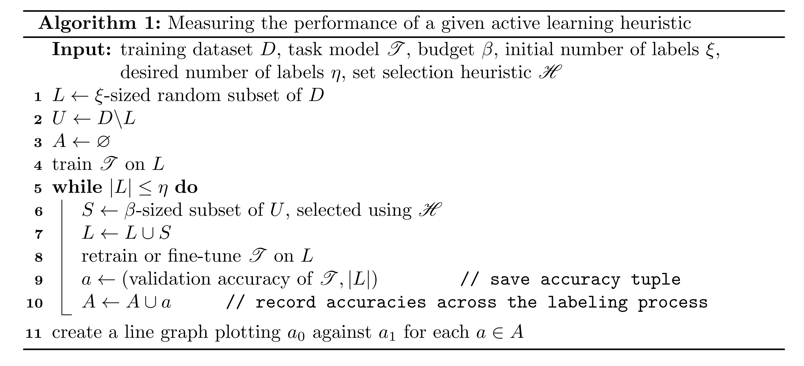

:author: Curtis Godwin
:email: cmgodwin263@gmail.com
:institution: Institute for Artificial Intelligence, University of Georgia, Athens, GA 30602 USA
:corresponding:
:equal-contributor:

:author: Meekail Zain
:email: meekail.zain@uga.edu
:institution: Department of Computer Science, University of Georgia, Athens, GA 30602 USA
:corresponding:
:equal-contributor:

:author: Nathan Safir
:email: nssafir@gmail.com
:institution: Institute for Artificial Intelligence, University of Georgia, Athens, GA 30602 USA

:author: Bella Humphrey
:email: isabelladhumphrey@gmail.com
:institution: Department of Computer Science, University of Georgia, Athens, GA 30602 USA

:author: Shannon P Quinn
:email: spq@uga.edu
:institution: Department of Computer Science, University of Georgia, Athens, GA 30602 USA
:institution: Department of Cellular Biology, University of Georgia, Athens, GA 30602 USA

:bibliography: references

---------------------------------------------------------------------------------------------------
Boosting Task-Based Active Learning with Task-Agnostic Information Using a Variational Autoencoder
---------------------------------------------------------------------------------------------------
.. class:: abstract

It is often much easier and less expensive to collect data than to
label it. Active learning (AL) responds to this issue by selecting
which unlabeled data are best to label next. Standard approaches
utilize task-aware AL, which identifies informative samples based on
a trained supervised model. Task-agnostic AL
ignores the task model and instead makes selections based on learned
properties of the dataset. We seek to combine these approaches and
measure the contribution of incorporating task-agnostic information
into standard AL. We test this on various AL methods using a ResNet
classifier with and without added unsupervised information from a
variational autoencoder (VAE).

.. class:: keywords
   
   active learning, variational autoencoder, deep learning, pytorch, 
   semi-supervised learning, unsupervised learning

Introduction
============

In deep learning, the capacity for data gathering often significantly
outpaces the labeling. This is easily observed in the field of
bioimaging, where ground-truth labeling usually requires the
expertise of a clinician. For example, producing a large quantity of
CT scans is relatively simple, but having them labeled for COVID-19
by cardiologists takes much more time and money. These constraints
ultimately limit the contribution of deep learning to many crucial
research problems.

This labeling issue has compelled advancements in the field of active
learning (AL). In a typical AL setting, there is a set of labeled
data and a (usually larger) set of unlabeled data. A model is trained
on the labeled data, then the model is analyzed to evaluate which
unlabeled points should be labeled to best improve the loss objective
after further training. AL acknowledges labeling constraints by
specifying a budget of points that can be labeled at a time and
evaluating against this budget.

In AL, the model for which we select new labels is referred to as the
task model. If this model is a classifier neural network, the space
in which it maps inputs before classifying them is known as the
latent space or representation space. A recent branch of
AL (:cite:`sener2018active,smailagic2018medal,yoo2019learning`),
prominent for its applications to deep models, focuses on mapping
unlabeled points into the task model’s latent space before comparing
them.

These methods are limited in their analysis by the labeled data they
must train on, failing to make use of potentially useful information
embedded in the unlabeled data. We therefore suggest that this family
of methods may be improved by extending their representation spaces
to include unsupervised features learned over the entire dataset. For
this purpose, we opt to use a variational autoencoder
(VAE) (:cite:`kingma2013auto`) , which is a prominent method
for unsupervised representation learning. Our main contributions are
(a) a new methodology for extending AL methods using VAE features and
(b) a demonstration of improved AL performance across three recent
feature-based AL methods using the new method.

Related Literature
==================

Active learning
---------------

Much of the early active learning (AL) literature is based on
shallower, less computationally demanding networks since deeper
architectures were not well-developed at the time.
Settles (:cite:`settles2009active`) provides a review of
these early methods, with the main branches being membership query
synthesis (:cite:`angluin1988queries`), stream-based
sampling (:cite:`atlas1989training`), and pool-based
sampling (:cite:`lewis1994sequential`). The latter method
takes a holistic approach of ranking all available unlabeled points
by some chosen heuristic :math:`\mathfrak{H}` and choosing to label
the points of highest ranking. This is the current default AL
approach, as technological advancements have made it a less demanding
task in terms of processing and memory.

The popularity of the pool-based method has led to a widely-used
evaluation procedure, which we describe in Algorithm 1. This
procedure trains a task model :math:`\mathfrak{T}` on the initial
labeled data, records its test accuracy, then uses
:math:`\mathfrak{H}` to label a set of unlabeled points. We then once
again train :math:`\mathfrak{T}` on the labeled data and record its
accuracy. This is repeated until a desired number of labels is
reached, and then the accuracies can be graphed against the number of
available labels to demonstrate performance over the course of
labeling. We can separately pass multiple heuristics through this
evaluation algorithm to compare their performance based on the
resulting accuracy graphs. This is utilized in many AL papers to show
the efficacy of their methods in comparison to
others (:cite:`wang2016cost,sener2018active,smailagic2018medal,yoo2019learning`).

The prevailing approach to the pool-based method has been to choose
unlabeled points for which the model is most uncertain, the
assumption being that uncertain points will be the most
informative (:cite:`budd2021survey`). A popular early
method was to label the unlabeled points of highest Shannon
entropy (:cite:`shannon1948mathematical`) under the task
model, which is a measure of uncertainty between the classes of the
data. This method is now more commonly used in combination with a
representativeness measure (:cite:`wang2016cost`) to
encourage that very similar samples are not successively selected.

Recent heuristics using deep features
-------------------------------------

For convolutional neural networks (CNNs) in image classification
settings, the task model :math:`\mathfrak{T}` can be decomposed into a
feature-generating module

.. math::

   \begin{aligned}
   \mathfrak{T}_f \colon \mathbb{R}^n \to \mathbb{R}^f,
   \end{aligned}

which maps the input data vectors to the output of the final fully
connected layer before classification, and a classification module

.. math::

   \begin{aligned}
   \mathfrak{T}_c \colon \mathbb{R}^f \to \{0,1,...,c\},
   \end{aligned}

where :math:`c` is the number of classes.

(1) Core-set and MedAL
++++++++++++++++++++++

Recent deep learning-based AL methods have approached the notion of
uncertainty in terms of the rich features generated by the learned
model. Core-set (:cite:`sener2018active`) and
MedAL (:cite:`smailagic2018medal`) select unlabeled points
that are the furthest from the labeled set in terms of
:math:`\text{L}_2` distance between the learned features. For
core-set, each point constructing the set :math:`S` in step 6 of
Algorithm 1 is chosen by

.. math::
   :label: eq:core-set-selection

   \begin{aligned}
   \mathbf{u}^* = \mathop{\mathrm{arg max}}_{\mathbf{u} \in U} \min_{{\boldsymbol\ell} \in L} || (\mathfrak{T}_f(\mathbf{u}) - \mathfrak{T}_f({\boldsymbol\ell})) ||^2,
   \end{aligned}

where :math:`U` is the unlabeled set and :math:`L` is the labeled
set. The analogous operation for MedAL is

.. math::
   :label: eq:med-al-selection

   \begin{aligned}
   \mathbf{u}^* = \mathop{\mathrm{arg max}}_{\mathbf{u} \in U} {1 \over |L|} \sum_{i=1}^{|L|} || \mathfrak{T}_f(\mathbf{u}) -  \mathfrak{T}_f(\mathbf{L_i}) ||^2 .
   \end{aligned}

Note that after a point :math:`\mathbf{u}^*` is chosen, the selection
of the next point assumes the previous :math:`\mathbf{u}^*` to be in
the labeled set. This way we discourage choosing sets that are
closely packed together, leading to sets that are more diverse in
terms of their features. This effect is more pronounced in the
core-set method since it takes the minimum distance whereas MedAL
uses the average distance.

(2) Loss prediction
+++++++++++++++++++

Another recent method (:cite:`yoo2019learning`) trains a
regression network to predict the loss of the task model, then takes
the heuristic :math:`\mathfrak{H}` to select the unlabeled points of
highest predicted loss. To implement this, the loss prediction
network :math:`\mathfrak{P}` is attached to a ResNet task model
:math:`\mathfrak{T}` and is trained jointly with :math:`\mathfrak{T}`.
The inputs to :math:`\mathfrak{P}` are the features output by the
ResNet’s four residual blocks. These features are mapped into the
same dimensionality via a fully connected layer and then concatenated
to form a representation :math:`\mathbf{c}`. An additional fully
connected layer then maps :math:`\mathbf{c}` into a single value
constituting the loss prediction.

When attempting to train a network to directly predict
:math:`\mathfrak{T}`\ ’s loss during training, the ground truth losses
naturally decrease as :math:`\mathfrak{T}` is optimized, resulting in
a moving objective. The authors
of (:cite:`yoo2019learning`) find that a more stable ground
truth is the inequality between the losses of given pairs of points.
In this case, :math:`\mathfrak{P}` is trained on pairs of labeled
points, so that :math:`\mathfrak{P}` is penalized for producing
predicted loss pairs that exhibit a different inequality than the
corresponding true loss pair.

More specifically, for each batch of labeled data
:math:`L_{batch} \subset L` that is propagated through
:math:`\mathfrak{T}` during training, the batch of true losses is
computed and split randomly into a batch of pairs :math:`P_{batch}`.
The loss prediction network produces a corresponding batch of
predicted loss pairs, denoted :math:`\widetilde{P}_{batch}`. The
following pair loss is then computed given each
:math:`p \in P_{batch}` and its corresponding
:math:`\tilde{p} \in \widetilde{P}_{batch}`:

.. math::
   :label: eq:pair-loss

   \begin{aligned}
   \mathfrak{L}_{pair}(p, \tilde{p}) = \max (0, -\mathfrak{I}(p) \cdot (\tilde{p}^{(1)} - \tilde{p}^{(2)}) + \xi),
   \end{aligned}

where :math:`\mathfrak{I}` is the following indicator function for
pair inequality:

.. math::
   :label: eq:inequality-indicator

   \begin{aligned}
   \mathfrak{I}(p) = \begin{cases}
                        \hspace{0.75em}1, \quad p^{(1)} > p^{(2)}\\
                        -1, \quad p^{(1)} \le p^{(2)}
                     \end{cases}.
   \end{aligned}

Variational Autoencoders
------------------------

Variational autoencoders (VAEs) (:cite:`kingma2013auto`)
are an unsupervised method for modeling data using Bayesian posterior
inference. We begin with the Bayesian assumption that the data is
well-modeled by some distribution, namely a multivariate Gaussian. We
also assume that this data distribution can be inferred reasonably
well by a lower dimensional random variable, also modeled by a
multivariate Gaussian.

The inference process then consists of an encoding into the lower
dimensional latent variable, followed by a decoding back into the
data dimension. We parametrize both the encoder and the decoder as
neural networks, jointly optimizing their parameters with the
following loss function (:cite:`kingma2019introduction`):

.. math::
   :label: eq:vae-loss

   \begin{aligned}
   \mathfrak{L}_{\theta, \phi}(\mathbf{x}) = \log p_{\theta}(\mathbf{x} | \mathbf{z}) + [\log p_{\theta}(\mathbf{z}) - \log q_{\phi}(\mathbf{z | x})],
   \end{aligned}

where :math:`\theta` and :math:`\phi` are the parameters of the
encoder and the decoder, respectively. The first term is the
reconstruction error, penalizing the parameters for producing poor
reconstructions of the input data. The second term is the
regularization error, encouraging the encoding to resemble a
pre-selected prior distribution, commonly a unit Gaussian prior.

The encoder of a well-optimized VAE can be used to generate latent
encodings with rich features which are sufficient to approximately
reconstruct the data. The features also have some geometric
consistency, in the sense that the encoder is encouraged to generate
encodings in the pattern of a Gaussian distribution.

Methods
=======

We observe that the notions of uncertainty developed in the core-set
and MedAL methods rely on distances between feature vectors modeled
by the task model :math:`\mathfrak{T}`. Additionally, loss prediction
relies on a fully connected layer mapping from a feature space to a
single value, producing different predictions depending on the values
of the relevant feature vector. Thus all of these methods utilize
spatial reasoning in a vector space.

Furthermore, in each of these methods, the heuristic
:math:`\mathfrak{H}` only has access to information learned by the
task model, which is trained only on the labeled points at a given
timestep in the labeling procedure. Since variational autoencoder
(VAE) encodings are not limited by the contents of the labeled set,
we suggest that the aforementioned methods may benefit by expanding
the vector spaces they investigate to include VAE features learned
across the entire dataset, including the unlabeled data. These
additional features will constitute representative and previously
inaccessible information regarding the data, which may improve the
active learning process.

We implement this by first training a VAE model :math:`\mathfrak{V}`
on the given dataset. :math:`\mathfrak{V}` can then be used as a
function returning the VAE features for any given datapoint. We
append these additional features to the relevant vector spaces using
vector concatenation, an operation we denote with the symbol
:math:`\frown`. The modified point selection operation in core-set
then becomes

.. math::
   :label: eq:vae-core-set-selection

   \begin{aligned}
   \mathbf{u}^* = \mathop{\mathrm{arg max}}_{\mathbf{u} \in U} \min_{{\boldsymbol\ell} \in L} || ([\mathfrak{T}_f(\mathbf{u}) \frown \alpha\mathfrak{V}(\mathbf{u})] - [\mathfrak{T}_f({\boldsymbol\ell}) \frown \alpha\mathfrak{V}(\mathbf{\boldsymbol\ell})] ||^2,
   \end{aligned}

and the analogous MedAL operation becomes

.. math::
   :label: eq:vae-med-al-selection

   \begin{aligned}
   \mathbf{u}^* = \mathop{\mathrm{arg max}}_{\mathbf{u} \in U} {1 \over |L|} \sum_{i=1}^{|L|} || [\mathfrak{T}_f(\mathbf{u}) \frown \alpha\mathfrak{V}(\mathbf{u})] - [\mathfrak{T}_f(\mathbf{L_i}) \frown \alpha\mathfrak{V}(\mathbf{L_i})] ||^2 ,
   \end{aligned}

where :math:`\alpha` is a hyperparameter that scales the influence of
the VAE features in computing the vector distance. To similarly
modify the loss prediction method, we concatenate the VAE features to
the final ResNet feature concatenation :math:`\mathbf{c}` before the
loss prediction, so that the extra information is factored into the
training of the prediction network :math:`\mathfrak{P}`.
